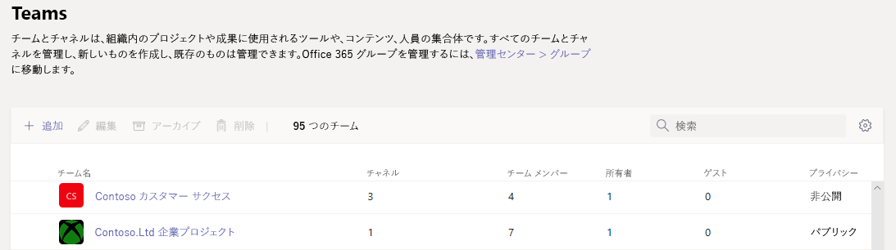
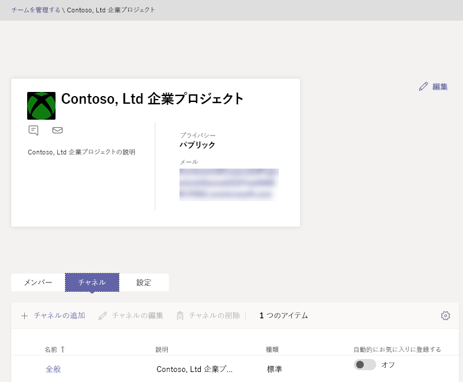

Microsoft Teams 管理センターでチームを管理する
==========================================

## 概要

この記事では、Microsoft Teams の管理センターでの Teams 管理ツールの概要を説明します。

管理者である場合、自分の組織で共同作業のためにセットアップしたチームを表示したり更新したりする必要性が生じます。また、所有者のいないチームに所有者を割り当てるなどの修復アクションを実行しなければならない場合もあります。 組織のチームは、Microsoft Teams PowerShell モジュールと Microsoft Teams 管理センターの両方から管理することができます。 管理センターには、にアクセスでき <a href="https://go.microsoft.com/fwlink/p/?linkid=2024339" target="_blank">https://admin.microsoft.com</a> ます。 これらの 2 つのツールセットを使用した完全な管理機能については、次の役割の 1 つが割り当てられることを確認する必要があります。

- グローバル管理者
- Teams サービス管理者

Teams での管理者の役割の詳細については、「[ Microsoft Teams の管理者ロールを使用して Teams を管理する](using-admin-roles.md)」をご覧ください。また、PowerShell コマンドレットを使用してチームを管理する方法の詳細については、「[Microsoft Teams コマンドレットのリファレンス](https://docs.microsoft.com/powershell/teams/?view=teams-ps)」をご覧ください。

## Teams の概要グリッド

チームの管理ツールは、Microsoft Teams 管理センターの [**Teams**] ノードの下にあります。 (管理センターで、[ **Teams**  >  ] を選択します)**チームを管理**します。)各チームは Microsoft 365 グループによってサポートされており、このノードには、組織で Microsoft Teams が有効になっているグループのビューが用意されています。

  

このグリッドには、次のプロパティが表示されます。

- **チーム名**
- **チャネル** - 既定の全般チャネルを含む、チーム内のすべてのチャネルの数。
- **チーム メンバー** - テナントの所有者、ゲスト、メンバーを含む合計ユーザーの数。
- **所有者** - このチームの所有者の数。
- **ゲスト** - このチームのメンバーである、Azure Active Directory B2B ゲスト ユーザーの数。
- **プライバシー** -バッキング Microsoft 365 グループの可視性/AccessType。
- **状態** - このチームの状態がアーカイブ済みかアクティブか。 チームのアーカイブに関する詳細については、「[チームをアーカイブまたは復元する](https://support.office.com/article/archive-or-restore-a-team-dc161cfd-b328-440f-974b-5da5bd98b5a7)」を参照してください。
- [ **Description** ]-バッキング Microsoft 365 グループの説明。
- **分類** : バッキング Microsoft 365 グループに割り当てられている (組織で使用されている場合)。 分類の詳細については、「[組織の Office グループに対する分類を作成する](https://docs.microsoft.com/office365/enterprise/powershell/manage-office-365-groups-with-powershell#create-classifications-for-office-groups-in-your-organization)」を参照してください。
- **Groupid** -バッキング Microsoft 365 グループの固有の groupid。

> [!NOTE]
> グリッドにこれらのプロパティがすべて表示されない場合は、**[列の編集]** アイコンをクリックします。 **[列の編集]** ウィンドウで、トグルを使用してグリッドの列のオンとオフを切り替えることができます。 完了したら、**[適用]** をクリックします。

### 追加

新しいチームを追加するには、**[追加]** をクリックします。 **[新しいチームの追加]** ウィンドウで、チームの名前と説明を入力し、プライベート チームかパブリック チームのどちらにするかを決定し、分類を設定します。

> [!NOTE]
> 新しく作成されたチームは、Outlook などの他のクライアントの操作とは異なり、Teams 管理センターですぐに管理できます。

### 編集

グループおよびチーム固有の設定を編集するには、チーム名の左側をクリックしてチームを選択し、**[編集]** を選択します。

### アーカイブ

チームをアーカイブすることができます。 チームをアーカイブすると、チームは Microsoft Teams 内で読み取り専用モードに切り替わります。 管理者は組織の代理として、チームのアーカイブやアーカイブの解除を管理センターで行うことができます。 

### 削除

チームを削除すると、チームと対応する Microsoft 365 グループのソフト削除となります。 誤って削除されたチームを復元するには、「 [削除されたグループを復元](https://docs.microsoft.com/microsoft-365/admin/create-groups/restore-deleted-group)する」の手順に従います。

### 検索

検索では現在「Begins with (次で始まる)」文字列をサポートされていて、[**Team name (チーム名)**] フィールドの検索を行います。

## チーム プロフィール

メインのチームの概要グリッドから、チーム名をクリックすることによって、任意のチームのチーム プロフィール ページに移動することができます。 [チームプロファイル] ページには、チーム (およびそのバッキング Microsoft 365 グループ) に属するメンバー、所有者、ゲスト、およびチームのチャネルと設定が表示されます。 チーム プロフィール ページから、次の操作を行うことができます。

- メンバーおよび所有者の追加または削除。
- チャネルの追加または削除 (全般チャネルを削除することはできません)。
- チームおよびグループの設定の変更。
 

## チームに対する変更

チームのプロフィールのページで、チームの次の要素を変更することができます。

- **メンバー** - メンバーの追加や削除、所有者の昇格または降格を行います。
- **チャネル** - 新しいチャネルの追加、既存チャネルの編集や削除を行います。 既定の全般チャネルを削除することはできません。
- **チーム名**
- **説明**
- **プライバシー** - チームをパブリックかプライベートに設定します。
- **分類** -これは Microsoft 365 グループの分類によってサポートされます。 **[社外秘]**、**[非常に機密性の高い社外秘]**、または **[一般]** を選択します。
- **会話の設定** - 送信されたメッセージをメンバーが編集および削除できるかどうかを設定します。
- **チャネルの設定** - メンバーが新しいチャネルを作成したり、既存のチャネルを編集したりできるかどうかを設定します。また、タブ、コネクタ、アプリの追加、編集、削除も行えます。

チームに対して行う変更はログに記録されます。 グループ設定 (名前、説明、写真、プライバシー、分類、またはチーム メンバー) を変更する場合、これらの変更は監査パイプラインを通して自分自身によるものとされます。 Teams 固有の設定に対するアクションを実行している場合、自分による変更は、チームの全般チャネル内で記録され、自分自身によるものとされます。

## トラブルシューティング

**問題: チームがチームの概要グリッドに表示されない**

チームの概要グリッド内のチーム一覧に、一部のチームが表示されない。

**原因**: この問題は、チームがシステムによって不適切にプロファイルされた場合 (またはまだプロファイルされていない場合) に発生し、チームを認識するためのプロパティが見つからない状態を作ります。

**解決方法: MS Graph でプロパティを適切な値に手動で設定します。**

該当する GroupId に対するクエリで **{groupid}** を置き換えます。{groupid} は、Exchange Online powershell で "**ExternalDirectoryObjectId**" 属性として **"[Get-unifiedgroup](https://docs.microsoft.com/powershell/module/exchange/users-and-groups/get-unifiedgroup?view=exchange-ps)"** コマンドレットを使用して取得できます。　

1. [Graph エクスプローラー](https://developer.microsoft.com/graph/graph-explorer)にアクセスします。

2. 左側のメニューで、Graph エクスプローラーにサインインします。

3. クエリの行を、PATCH > v1.0 > https://graph.microsoft.com/v1.0/groups/{groupid} に変更します。

4. リクエストの本文に、次の値を追加します: {"resourceProvisioningOptions": ["Team"]}

5. 右上のクエリを実行します。

6. Microsoft Teams 管理センターのチームの概要ページで、チームが正しく表示されていることを確認します。

## 詳細情報

- [Teams コマンドレット リファレンス](https://docs.microsoft.com/powershell/teams/?view=teams-ps)  
- [Teams の管理者ロールを使用して Teams を管理する](using-admin-roles.md)
- [Teams でのライフサイクル管理を計画する](plan-teams-lifecycle.md)
