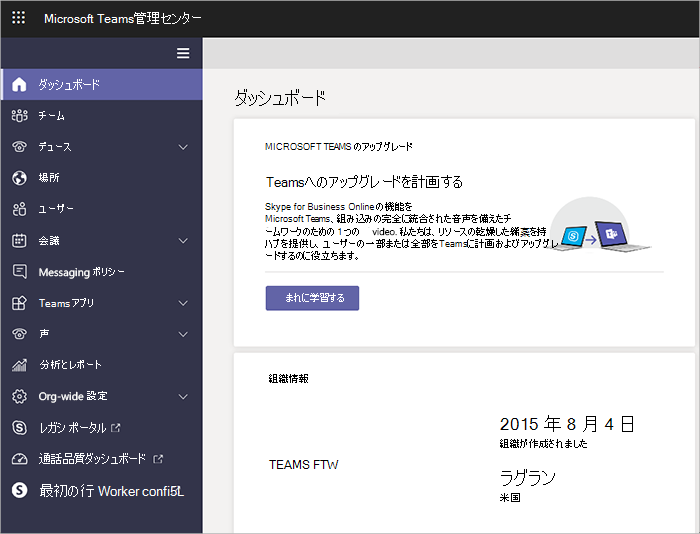

新しい Microsoft Teams 管理センターへの移行中に Teams を管理する
======================================================

> [!IMPORTANT]
> [!INCLUDE [new-teams-sfb-admin-center-notice](includes/new-teams-sfb-admin-center-notice.md)]

## 新しい Microsoft Teams 管理センターとは  

新しい管理センターでは、Teams と Skype for Business の両方を一元管理することができます。 Microsoft は、追加機能、エンドツーエンドの洞察、チーム設定をユーザーレベルで管理する機能を提供しています。

## 新しい Microsoft Teams 管理センターに移行された設定

次の表で、移行が済んだ Teams エクスペリエンスのセクションと、現在の設定と新しい管理ポータルのポリシーとの関係を示します。

|Microsoft 365 管理センターの Teams のセクション  |設定名 (テナント レベル)  |Microsoft Teams 管理センターのポリシー   |レベル: テナントまたはユーザー   |
|---------|---------|---------|---------|
|全般     |個人用プロファイルで組織図を表示する        |  [TeamsClientConfiguration](https://docs.microsoft.com/powershell/module/skype/set-csteamsclientconfiguration?view=skype-ps)       |  テナント       |
|全般     |Teams を持っていない受信者に Skype for Business を使用する         |[TeamsClientConfiguration](https://docs.microsoft.com/powershell/module/skype/set-csteamsclientconfiguration?view=skype-ps)         |テナント         |
|電子メールの統合     |ユーザーがチャネルにメールを送信することを許可する         |[TeamsClientConfiguration](https://docs.microsoft.com/powershell/module/skype/set-csteamsclientconfiguration?view=skype-ps)         |テナント         |
|電子メールの統合     |差出人のリストを許可する         |[TeamsClientConfiguration](https://docs.microsoft.com/powershell/module/skype/set-csteamsclientconfiguration?view=skype-ps)        |テナント         |
|カスタム クラウド ストレージ     |Box         |[TeamsClientConfiguration](https://docs.microsoft.com/powershell/module/skype/set-csteamsclientconfiguration?view=skype-ps)         |テナント         |
|カスタム クラウド ストレージ     |Dropbox        |[TeamsClientConfiguration](https://docs.microsoft.com/powershell/module/skype/set-csteamsclientconfiguration?view=skype-ps)         |テナント         |
|カスタム クラウド ストレージ     |Google ドライブ        |[TeamsClientConfiguration](https://docs.microsoft.com/powershell/module/skype/set-csteamsclientconfiguration?view=skype-ps)         |テナント         |
|カスタム クラウド ストレージ     |ShareFile        |[TeamsClientConfiguration](https://docs.microsoft.com/powershell/module/skype/set-csteamsclientconfiguration?view=skype-ps)         |テナント         |
|ユーザー/ライセンスの種類別の設定     |すべてのユーザーに対して Microsoft Teams をオンまたはオフにする          |廃止1        |         |
|Teams とチャネル     |         |Azure Active Directory グループ管理にリダイレクト (現在のエクスペリエンスと同じ)。              |ユーザー         |
|Teams とチャネル     |         |AAD グループ管理にリダイレクト (現在のエクスペリエンスと同じ)。             |ユーザー          |
|アプリ|Enable new external apps by default (既定で新しい外部アプリを有効にする)|組織全体のアプリ設定|テナント|
|アプリ|外部アプリを許可する|組織全体のアプリ設定|テナント|
|アプリ|外部アプリのサイドロードを許可する2|[TeamsAppSetupPolicy](https://docs.microsoft.com/powershell/module/skype/set-csteamsappsetuppolicy?view=skype-ps)|ユーザー|
|アプリ|既定のアプリ3|TeamsAppPermissionPolicy|ユーザー|
|アプリ|外部アプリ3|TeamsAppPermissionPolicy|ユーザー|
|通話と会議     |プライベート会議のスケジュール設定を許可する         |[TeamsMeetingPolicy](https://docs.microsoft.com/powershell/module/skype/set-csteamsmeetingpolicy?view=skype-ps)         |ユーザー          |
|通話と会議     |アドホック チャネル Meetup を許可する         |[TeamsMeetingPolicy](https://docs.microsoft.com/powershell/module/skype/set-csteamsmeetingpolicy?view=skype-ps)         |ユーザー          |
|通話と会議     |チャネル会議のスケジュール設定を許可する         |[TeamsMeetingPolicy](https://docs.microsoft.com/powershell/module/skype/set-csteamsmeetingpolicy?view=skype-ps)         |ユーザー          |
|通話と会議     |会議でビデオを許可する         |[TeamsMeetingPolicy](https://docs.microsoft.com/powershell/module/skype/set-csteamsmeetingpolicy?view=skype-ps)         |ユーザー          |
|通話と会議     |会議で画面共有を許可する         |[TeamsMeetingPolicy](https://docs.microsoft.com/powershell/module/skype/set-csteamsmeetingpolicy?view=skype-ps)         |ユーザー          |
|通話と会議     |プライベート通話を許可する         |[TeamsCallingPolicy](https://docs.microsoft.com/powershell/module/skype/set-csteamscallingpolicy?view=skype-ps)        |ユーザー          |
|メッセージング     |ユーザーが会話に GIF を追加できるように Giphy を有効にする         |[TeamsMessagingPolicy](https://docs.microsoft.com/powershell/module/skype/set-csteamsmessagingpolicy?view=skype-ps)         |ユーザー         |
|メッセージング     |コンテンツの規制         |[TeamsMessagingPolicy](https://docs.microsoft.com/powershell/module/skype/set-csteamsmessagingpolicy?view=skype-ps)         |ユーザー         |
|メッセージング     |ユーザーが編集して会話に追加できるミームを有効にする         |[TeamsMessagingPolicy](https://docs.microsoft.com/powershell/module/skype/set-csteamsmessagingpolicy?view=skype-ps)         |ユーザー         |
|メッセージング     |ユーザーが編集して会話に追加できるステッカーを有効にする         |[TeamsMessagingPolicy](https://docs.microsoft.com/powershell/module/skype/set-csteamsmessagingpolicy?view=skype-ps)         |ユーザー         |
|メッセージング     |所有者がすべてのメッセージを削除できるようにする         |[TeamsMessagingPolicy](https://docs.microsoft.com/powershell/module/skype/set-csteamsmessagingpolicy?view=skype-ps)         |ユーザー         |
|メッセージング     |ユーザーが自分のメッセージを編集できるようにする         |[TeamsMessagingPolicy](https://docs.microsoft.com/powershell/module/skype/set-csteamsmessagingpolicy?view=skype-ps)         |ユーザー         |
|メッセージング     |ユーザーが自分のメッセージを削除できるようにする         |[TeamsMessagingPolicy](https://docs.microsoft.com/powershell/module/skype/set-csteamsmessagingpolicy?view=skype-ps)         |ユーザー         |
|メッセージング     |ユーザーがプライベートにチャットできるようにする         |[TeamsMessagingPolicy](https://docs.microsoft.com/powershell/module/skype/set-csteamsmessagingpolicy?view=skype-ps)         |ユーザー         |

1 ゲストに対して廃止。 ゲストの有効化/無効化は、Microsoft Teams 管理センターで管理できるようになりました。 Teams for Business Enterprise、Edu Student、Edu Faculty の有効化/無効化は、まもなく廃止されます。 これは、Microsoft 365 管理センターでライセンスを割り当てることにより管理する必要があります。 「[Microsoft Teams へのユーザー アクセスを管理する](user-access.md)」を参照してください。
  
2 サイドローディングは、次のように分割されます。

- [TeamsAppSetupPolicy](https://docs.microsoft.com/powershell/module/skype/set-csteamsappsetuppolicy?view=skype-ps) でユーザー レベルで管理できるアプリのサイドロードをユーザーに許可します。
- 組織全体のアプリ設定でテナント レベルで管理できるカスタム アプリの操作を、テナント内のユーザーに許可します。
 
3 既定のアプリと外部アプリは、TeamsAppPermissionPolicy でユーザー レベルで有効または無効にできます。 また、アプリは、組織全体のアプリ設定でテナント レベルでブロックすることもできます。この場合、ユーザー設定やテナントレベルの設定は上書きされます。 

> [!NOTE]
> 引き続き、Microsoft 365 管理センターの Groups ダッシュボードを使用して、チームとチャネルに関する構成を行います。 アプリの設定は Microsoft 365 管理センターの Teams エリアに残っていますが、将来移行される予定です。 

## 移行時に設定を管理する

セクションの移行がテナントに対して完了するまでは、Microsoft 365 管理センターと Skype for Business 管理センターで設定を変更することができます。 

次の表に、移行時に何で機能を管理できるかを示します。

|機能  |Microsoft Teams 管理センター                      |Skype for Business 管理センター (レガシ)  |Microsoft 365 管理センター  |
|---------|:---------:|:---------:|:---------:|
|Teams のメッセージング、会議、ライブ イベント ポリシー     |     X    |         |         |
|Teams のアップグレード ポリシー     |    X     |         |         |
|メッセージング、会議、音声のゲスト設定     |   X      |         |         |
|Teams のライフサイクル管理   |    X    |      |       |
|Teams の設定   |    X    |      |       |
|外部アクセス設定     |    X    |      |       |
|ユーザーの管理    |         |         |    X     |    
|電話会議     |    X     |    X     |         |
|通話プラン     |    X    |    X     |         |
|電話システム    |    X    |     X    |         |
|電話番号の管理     |    X    |   X      |         |
|クラウド ボイス機能のライセンス     |         |         |    X     |
|自動応答     |    X    |          |         |
|通話キュー     |    X    |          |         |

## 移行後に設定を管理する

これらの設定の移行が完了したら、Office 365 管理センターと Skype for Business 管理センターでそれらの設定を無効にし、新しい Microsoft Teams 管理センターで管理することができます。
