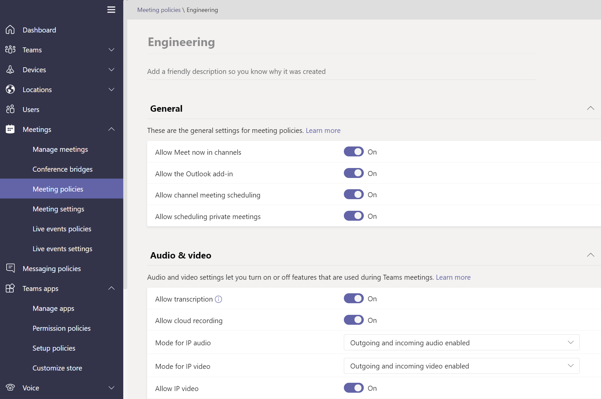

# ポリシーを使用してTeamsを管理する

ポリシーは、Teamsを管理する上で重要な部分です。 この記事を使用して、ポリシーを使用して組織に利益をもたらす方法を説明します。

## ポリシーを使用する対象

ポリシーは、メッセージング、会議、アプリケーションなど、さまざまな分野で組織内の多くのタスクを実行するために使用されます。 ユーザーがチーム チャネルで会議をスケジュールできるようにする、送信メッセージを編集できるようにする、ユーザーがアプリを Teams アプリ バーにピン留めできるかどうかを制御するなど、できることがいくつかあります。

## ポリシーを割り当てる方法

ポリシーは、組織が達成しようとしている内容に応じて、いくつかの異なる方法で割り当てることができます。 Teams管理センターで割り当てを作成して表示できます。

ポリシーの割り当ての詳細については、 [こちらを参照してください](policy-assignment-overview.md)。

## ポリシーを管理する方法

ポリシーは、Microsoft Teams管理センターまたは [PowerShell を使用して](./teams-powershell-managing-teams.md#manage-policies-via-powershell)管理されます。

たとえば、アプリ設定ポリシーを使用すると、ユーザーがカスタム アプリをアップロードしたり、ユーザーに代わってアプリをインストールしたり、アプリをTeams アプリ バーにピン留めしたりできます。 これらのポリシーは、Teams管理センターで構成されます。

さらに、会議ポリシーを使用して、文字起こし、クラウドレコーディング、IP オーディオ/ビデオなどのTeams会議のオーディオとビデオの設定を制御できます。

### 教育機関用 Teams

[Microsoft Teams for Education ポリシー ウィザード](easy-policy-setup-edu.md)を使用して、学習環境のポリシーを簡単に設定および管理することもできます。

## ポリシーの種類

次のポリシーは、Microsoft Teamsで管理できます。

ポリシーの種類 | 説明
------------|------------
[ポリシー パッケージ](manage-policy-packages.md) | Microsoft Teamsのポリシー パッケージは、組織内で同様のロールを持つユーザーに割り当てることができる定義済みのポリシーと設定のコレクションです。
[会議ポリシー](meeting-policies-overview.md) | 会議ポリシーは、組織内のユーザーがスケジュールした会議の会議参加者が利用できる機能を制御するために使用されます。 会議ポリシーには、次のトピックが含まれます。  - オーディオポリシーとビデオ ポリシー  - コンテンツと画面共有ポリシー  - 参加者、ゲスト、アクセス ポリシー  - 一般的なポリシー
[音声ポリシーと通話ポリシー](voice-and-calling-policies.md)| 音声ポリシーと通話ポリシーは、緊急通話、通話ルーティング、発信者 ID などのチームを通じてこれらの設定を管理します。
[アプリのポリシー](app-policies.md)| アプリ ポリシーは、Microsoft Teams内のアプリケーションを制御するために使用されます。 管理者は、ユーザーがインストールできるアプリを許可またはブロックしたり、ユーザーのTeams アプリ バーにアプリケーションをピン留めしたり、ユーザーに代わってアプリケーションをインストールしたりできます。
[メッセージング ポリシー](messaging-policies-in-teams.md)| メッセージング ポリシーは、チャットとチャネル機能の可用性を制御します。

## 関連項目

* [Teamsでポリシーを割り当てる - 作業の開始](policy-assignment-overview.md)
* [Microsoft Teams でフィードバック ポリシーを管理する](manage-feedback-policies-in-teams.md)
* [Microsoft Teams でチーム ポリシーを管理する](teams-policies.md)
* [Microsoft Teams でのライブ イベントのセットアップ](teams-live-events/set-up-for-teams-live-events.md)
* [Microsoft Teams for Education ポリシーとポリシー パッケージ](policy-packages-edu.md)