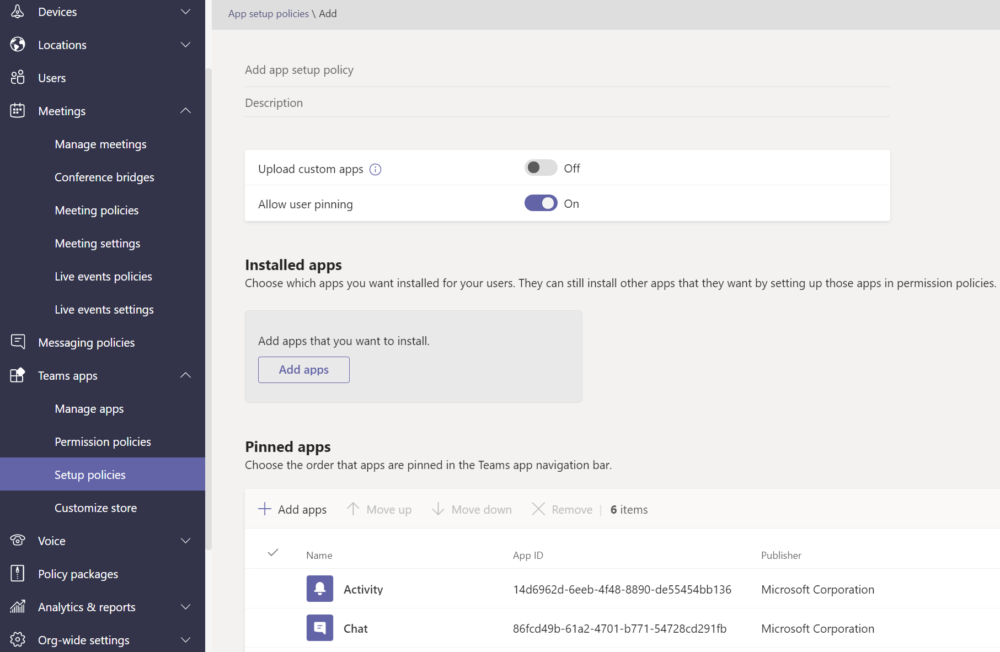

# ポリシーを使用してチームを管理するManage teams with policies

ポリシーは、Teams 管理の重要な部分です。Policies are an important part of managing Teams. この記事では、ポリシーを使用して組織に利益をもたらす方法について説明します。Use this article to navigate how to use policies to benefit your organization.

## ポリシーの使用What you use policies for

ポリシーは、メッセージング、会議、アプリケーションなど、さまざまな分野にわたって組織内の多くのタスクを実行するために使用されます。Policies are used to accomplish many tasks in your organization across different areas such as messaging, meetings, and applications. ユーザーがチーム チャネルで会議をスケジュールできるようにしたり、ユーザーが送信したメッセージを編集したり、ユーザーがアプリを Teams アプリ バーにピン留めできるかどうかを制御したりすることもできます。Some of the things you can do include allowing users to schedule meetings in a teams channel, enabling users to edit sent messages, and controlling whether users can pin apps to the Teams app bar.

## ポリシーを割り当てる方法How to assign policies

組織が達成しようとしている内容に応じて、いくつかの方法でポリシーを割り当てることができます。Policies can be assigned in several different ways depending on what your organization is trying to accomplish. Teams 管理センターで課題を作成および表示できます。You can make and view assignments in the Teams admin center.

ポリシーの割り当てに関する詳細については、こちらを参照 [してください](assign-policies.md)。Read more about assigning policies [here](assign-policies.md).

## ポリシーを管理する方法How to manage policies

ポリシーは、Microsoft Teams 管理センターまたは [PowerShell を使用して管理されます](https://docs.microsoft.com/microsoftteams/teams-powershell-managing-teams#manage-policies-via-powershell)。Policies are managed with the Microsoft Teams admin center or [using PowerShell](https://docs.microsoft.com/microsoftteams/teams-powershell-managing-teams#manage-policies-via-powershell).

たとえば、アプリセットアップ ポリシーを使用すると、ユーザーがカスタム アプリをアップロードし、ユーザーの代わりにアプリをインストールし、アプリを Teams アプリ バーにピン留めすることができます。For example, an app setup policy can allow you to enable users to upload custom apps, install apps on behalf of your users, and pin apps to the Teams app bar. これらのポリシーは、Teams 管理センターで構成されます。These policies are configured in the Teams admin center.

さらに、会議ポリシーを使用して、議事書き、クラウドレコーディング、IP オーディオ/ビデオなどの Teams 会議の音声とビデオの設定を制御できます。Additionally, a meeting policy can be used to control audio and video settings in Teams meetings such as transcriptions, cloud recordings, and IP audio/video.

### 教育機関用 TeamsTeams for Education

[Teams for Education](easy-policy-setup-edu.md)ポリシー ウィザードを使用して、学習環境のポリシーを簡単に設定および管理することもできます。You can also use the [Teams for Education policy wizard](easy-policy-setup-edu.md) to easily set up and manage policies for your learning environment.

## ポリシーの種類Types of policies

次のポリシーは、Microsoft Teams で管理できます。The following policies can be managed with Microsoft Teams.

ポリシーの種類Policy type | 説明Description
------------|------------
[ポリシー パッケージPolicy packages](manage-policy-packages.md) | Microsoft Teams のポリシー パッケージは、組織内で同様の役割を持つユーザーに割り当て可能な定義済みのポリシーと設定のコレクションです。A policy package in Microsoft Teams is a collection of predefined policies and settings you can assign to users who have similar roles in your organization.
[会議ポリシーMeeting policies](meeting-policies-in-teams.md) | 会議ポリシーは、組織内のユーザーがスケジュールした会議の会議参加者が使用できる機能を制御するために使用されます。A meeting policy is used to control the features that are available to meeting participants for meetings scheduled by users in your organization. 会議ポリシーには、次のトピックが含まれます。Meeting policies include the following topics.  - オーディオ ポリシーとビデオ ポリシー- Audio and video policies  - コンテンツと画面の共有ポリシー- Content and screen sharing policies  - 参加者、ゲスト、アクセス ポリシー- Participants, guests, and access policies  - 一般的なポリシー- General policies
[音声と通話のポリシーVoice and calling policies](voice-and-calling-policies.md)| 音声および通話ポリシーは、緊急通話、通話ルーティング、発信者番号などのチームを通じてこれらの設定を管理します。Voice and calling policies manage these settings through teams such as emergency calling, call routing, and caller ID.
[アプリ ポリシーApp policies](app-policies.md)| アプリ ポリシーは、Microsoft Teams でアプリケーションを制御するために使用されます。App policies are used to control applications in Microsoft Teams. 管理者は、ユーザーがインストールできるアプリを許可またはブロックしたり、ユーザーの Teams アプリ バーにアプリケーションをピン留めしたり、ユーザーの代わりにアプリケーションをインストールすることができます。Admins can allow or block which apps users can install, pin applications to a user's Teams app bar, and install application on behalf of your users.
[メッセージング ポリシーMessaging policies](messaging-policies-in-teams.md)| メッセージング ポリシーは、チャットとチャネル機能の可用性を制御します。Messaging policies control chat and channel feature availability.

## 関連トピックRelated topics

* [Microsoft Teams でフィードバック ポリシーを管理するManage feedback policies in Microsoft Teams](manage-feedback-policies-in-teams.md)
* [Microsoft Teams でチーム ポリシーを管理するManage teams policies in Microsoft Teams](teams-policies.md)
* [Microsoft Teams でのライブ イベントのセットアップSet up for live events in Microsoft Teams](teams-live-events/set-up-for-teams-live-events.md)
* [Teams for Education ポリシーとポリシー パッケージTeams for Education policies and policy packages](policy-packages-edu.md)
