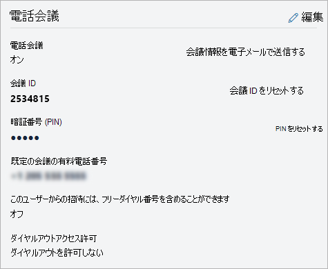

# Microsoft Teams でユーザーの電話会議の設定を管理するManage the Audio Conferencing settings for a user in Microsoft Teams

Office 365 管理者としてSkype for Business Onlineの電話会議の設定 を編集することができます-プロバイダー、既定の有料または無料電話番号、会議 ID、暗証番号 (pin) など、組織内の個々 のユーザーの設定です。As an Office 365 admin, you can edit the Audio Conferencing settings—such as the provider, default toll or toll-free number, conference ID, or PIN—for an individual user in your organization. 組織の設定を編集する場合は、[組織の電話会議の設定を管理する](manage-the-audio-conferencing-settings-for-my-organization-in-teams.md)を参照してください。If you want to edit settings for your organization, see [Manage the Audio Conferencing settings for your organization](manage-the-audio-conferencing-settings-for-my-organization-in-teams.md).

##  マイクロソフトのチーム管理センターを使用してください。Using the Microsoft Teams admin center

1. 左側のナビゲーションでは、**ユーザー**] をクリックしてで使用可能なユーザーの一覧からユーザーを選択します。In the left navigation, click **Users**, and then select the user from the list of available users.

2. [**編集**] をクリックします。Click **Edit**.

3. [**オーディオ会議**では、次のいずれかを変更します。Under **Audio Conferencing**, modify any of the following:

|**設定****Setting**|**説明****Description**|
|:-----|:-----|
|**音声会議****Audio conferencing**|音声会議をオンまたはオフ、ユーザーをクリックして**音声会議**の横にあるし、[**電話会議**] ウィンドウで**編集**を、**オーディオ会議**で、オフを切り替えます。To turn audio conferencing on or off for the user, click **Edit** next to **Audio Conferencing**, and then in the **Audio Conferencing** pane, toggle **Audio conferencing** On or Off.|
|**会議の情報を電子メールで送信します。****Send conference info in email**  |ユーザーに電子メールで会議 ID と電話番号とをすぐに送信する場合にのみ、このリンクをクリックします。Click this link only if you want to immediately send an email to the user with his or her conference ID and phone number. (PINはこのメールは含まれません。) [ユーザーに電子メールで電話会議の情報を送信する](send-an-email-to-a-user-with-their-dial-in-information-in-teams.md)を参照してください。(This email does not include the PIN.) See [Send an email to a user with their Audio Conferencing information](send-an-email-to-a-user-with-their-dial-in-information-in-teams.md).  |
|**会議 ID****Conference ID**  |ユーザーの会議 ID をリセットする必要がある場合は、**会議 ID のリセット**をクリックします。Click **Reset conference ID** if you need to reset the conference ID for the user. 詳細については、 [ユーザーの会議 ID をリセットする](reset-a-conference-id-for-a-user-in-teams.md)を参照してください。For more information, see [Reset a conference ID for a user](reset-a-conference-id-for-a-user-in-teams.md).  |
|**暗証番号 (PIN)****PIN** |ユーザーの PIN をリセットする必要がある場合は、 **PIN のリセット**をクリックします。Click **Reset PIN** if you need to reset the PIN for the user. 詳細については、 [電話会議の PIN のリセット](reset-the-audio-conferencing-pin-in-teams.md)を参照してください。For more information, see [Reset the Audio Conferencing PIN](reset-the-audio-conferencing-pin-in-teams.md). |
|**既定の会議通話の電話番号**(必須)**Default conferencing toll phone number** (required) |これらをオーディオ会議ブリッジで設定されている番号となります。These will be numbers that are set on the audio conferencing bridge. ビジネスおよびマイクロソフトのチームの会議出席依頼の Skype に表示する数値書式を設定します。Format the numbers as you want them to appear in Skype for Business and Microsoft Teams meeting requests. 既定の有料電話番号を変更するには、**オーディオ会議**の横にあると、[**電話会議**] ウィンドウで**編集**をクリックして、**有料電話番号**の下の数字を選択します。To change the default toll number, click **Edit** next to **Audio Conferencing** and in the **Audio Conferencing** pane, select a number under **Toll number**. |
|**このユーザーからの招待は、フリー ダイヤル番号を含めることができます。****Invites from this user can include toll-free number**|この設定を変更するには、**オーディオ会議**の横にあると、[**電話会議**] ウィンドウで**編集**をクリックして、**このユーザーからの要求を達成するためのフリー ダイヤル番号**で、オフを切り替えます。To change this setting, click **Edit** next to **Audio Conferencing** and in the **Audio Conferencing** pane, toggle **Include toll-free numbers in meeting requests from this user** On or Off. |
|**認証されていないユーザーは、会議の最初の人****Unauthenticated users can be the first person in the meeting**|この設定を変更するのには**認証されていないユーザーは、会議の最初の人**で、オフを切り替えます。To change this setting, toggle **Unauthenticated users can be the first person in the meeting** On or Off.
|**ダイヤルアウトのアクセス許可****Dial-out permissions**|この設定を変更するには、**オーディオ会議**の横にあると、[**電話会議**] ウィンドウで**編集**をクリックして、**会議から発信**] のオプションを選択します。To change this setting, click **Edit** next to **Audio Conferencing** and in the **Audio Conferencing** pane, choose an option under **Dial-out from meetings**.|

 

> [!Note]
> [!INCLUDE [updating-admin-interfaces](includes/updating-admin-interfaces.md)]

## 関連トピックRelated topics

[組織のオーディオ会議設定を管理します。Manage the Audio Conferencing settings for your organization](manage-the-audio-conferencing-settings-for-my-organization-in-teams.md)

[電話会議に関するよくある質問Audio Conferencing common questions](audio-conferencing-common-questions.md)
