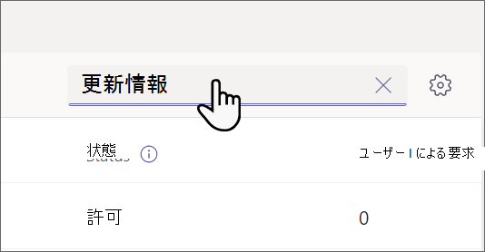

# Microsoft Teamsで組織の更新プログラム アプリを管理する

## Updates アプリとは

Microsoft Teams アプリの更新プログラムは、組織のメンバーが更新プログラムを作成、確認、送信するための一元的な場所を提供します。 テンプレートを作成することで、Updates アプリを使用して、組織のニーズを追跡できます。 更新プログラムは、デスクトップとモバイルの両方で使用できます。

Teamsでは、ユーザーはTeamsアプリ ストアから更新プログラムを取得できます。 送信する必要があるすべての更新プログラムが [ **送信]** ページに表示されます。

[![デスクトップ用のTeamsの [送信] ページの画像。](media/updates-submit-small.png)](media/updates-submit.png#lightbox)

ユーザーは、[ **校閲** ] ページで、割り当てた更新プログラムを表示できます。

[![デスクトップのTeamsの [校閲] ページの画像。](media/updates-home-small.png)](media/updates-home.png#lightbox)

ユーザーに更新プログラムが割り当てられると、Teamsアクティビティ フィードに表示されます。 ユーザーは、Updates アプリで現在のすべての更新要求と以前の申請を表示することもできます。 さらに、すべてのユーザーがテンプレートを作成し、更新要求を送信できます。

更新には、一般的なビジネス シナリオ用の既定のテンプレートと、独自のテンプレートを作成するオプションの両方が付属しています。 誰でも、新しい種類の更新プログラム用のテンプレートを作成できます。

## シナリオ例

衣料品店の従業員は、毎日店を開いたり閉じたりする責任があります。 シフト リーダーは毎日、更新プログラム アプリですぐに使用できるテンプレートである更新プログラムを開くMicrosoft Storeに入力します。 この更新プログラムでは、前の夜の閉店に関する問題について説明し、店の清潔さに関する質問に答え、補充が必要な消耗品を報告します。 更新プログラムを送信すると、ストアのニーズや問題を迅速かつ効率的に伝えられます。 また、毎日の更新により、ストアは何がうまくいっているかを強調する機会を提供します。

店舗の製造施設では、従業員がモバイル デバイスを使用して Updates で安全性チェックを実行します。

一方、リモート ワーカーのチームがストアの Web サイトを更新しています。 タイム ゾーンに分散されているため、毎日の立ち上げ会議は便利ではありません。 代わりに、各チーム メンバーは、その進捗状況に関する毎日の更新レポートをチーム リーダーに送信します。

[Updates のルックブックをダウンロード](https://go.microsoft.com/fwlink/?linkid=2197649&clcid=0x409) して、Updates で実行できる操作の例をさらに確認します。

## 必要なアクセス許可とライセンス

更新プログラムを展開するには、次の項目のアクセス許可が必要です。

- Microsoft Dataverse データベースを作成する権限。

- [powerautomate.microsoft.com](https://powerautomate.microsoft.com/) のアカウント。

- ターゲット環境の管理者ロール。

- Power Automate、Office 365、または Dynamics 365 のライセンス。

- ユーザーが新しいテンプレートを設定するには、Microsoft Formsのライセンスが必要です。

## Microsoft Dataverse を使用したストレージ

共通データ モデル (CDM) は、Microsoft Dataverse のビジネス アプリケーションや分析アプリケーションで使用される共有データ言語です。 これは、Microsoft とそのパートナーによって公開された、一連の標準化された拡張可能なデータ スキーマで構成されており、アプリケーションとビジネス プロセス全体でデータとその意味の一貫性を実現します。 [Common Data Model](/common-data-model/) の詳細については、こちらを参照してください。

テンプレートから作成された更新プログラムは、タイトル、詳細、テンプレート ID など、Microsoft Dataverse にデータを格納します。  [Microsoft Forms のデータの保存場所](https://support.microsoft.com/office/data-storage-for-microsoft-forms-97a34e2e-98e1-4dc2-b6b4-7a8444cb1dc3#:~:text=Where%20data%20is%20stored%20for%20Microsoft%20Forms.%20Microsoft,European-based%20tenants%20is%20stored%20on%20servers%20in%20Europe)の詳細。

>[!Note]
>Microsoft Forms サイトでフォーム テンプレートを削除すると、Updates テンプレートが破損し、ユーザーは更新プログラムを送信できなくなります。 Microsoft Formsで削除されたテンプレートを開こうとすると、ユーザーに "CDB TableNotFound" というエラーが表示されます。

## アプリのアクセス許可Teams更新プログラム

Updates Teams アプリを使用すると、次の機能にアクセスできます。

- メッセージやデータを受信します。

- メッセージと通知を送信します。

- Teams が提供するヘッダーを必要とすることなく、個人用アプリとダイアログをレンダリングします。

- [名前]、[電子メールアドレス]、[会社名]、[優先する言語] などの個人用プロフィール情報にアクセスします。

- チーム メンバーがチャネルで提供するメッセージとデータを受信します。

- チャネルでメッセージと通知を送信する。

- チームの情報にアクセスする:
  - チーム名
  - チャネル リスト
  - 名簿 (チーム メンバーの名前と電子メール アドレス)

- チームの情報を使用してメンバーに連絡します。

## Updates アプリを無効にする

Updates アプリは既定で使用できます。 Teams 管理センターでアプリを無効にできます。

  1. Teams 管理センターにサインインします。

  2. **[Teams アプリ]** > **[アプリの管理]** の順に移動します。

  3. Updates アプリを検索します。

     

  4. [ **更新プログラム] を選択します**。

  5. 切り替えを選択して、組織のアプリを無効にします。
    

## Teamsに更新プログラムをピン留めする

### カスタマイズされたフロントライン アプリ エクスペリエンスを使用して、更新プログラムやその他のアプリをTeamsにピン留めする

Teamsのカスタマイズされたフロントライン アプリ エクスペリエンスは、[F ライセンス](https://www.microsoft.com/microsoft-365/enterprise/frontline#office-SKUChooser-0dbn8nt)を持つユーザーにとってTeamsで最も関連性の高いアプリをピン留めします。 ピン留めされたアプリには、更新プログラム、承認、Walkie Talkie、Tasks、Shifts などがあります。 既定では、この機能はオンになっており、現場のワーカーはニーズに合わせてすぐに使えるエクスペリエンスを提供します。

アプリは、アプリ バー (Teams デスクトップ クライアントの側とTeamsモバイル クライアントの下部にあるバー) にピン留めされ、ユーザーはすばやく簡単にアクセスできます。

設定したアプリ ポリシーでのエクスペリエンスの動作など、詳細については、「[現場のワーカー向けにアプリTeamsを調整する](pin-teams-apps-based-on-license.md)」を参照してください。

### アプリセットアップ ポリシーを使用して更新プログラムをTeamsにピン留めする

アプリのセットアップ ポリシーを使用すると、Teamsをカスタマイズして、ユーザーのユーザーにとって最も重要なアプリをピン留めできます。

ユーザーの更新プログラム アプリをピン留めするには、グローバル (組織全体の既定) ポリシーを編集するか、カスタム アプリセットアップ ポリシーを作成して割り当てることができます。 詳細については、「[Teams でアプリの設定ポリシーを管理する](teams-app-setup-policies.md)」を参照してください。

## アイテム保持ポリシー

Updates アプリから作成された更新プログラムは、既定の Microsoft Dataverse 環境に格納されます。現時点ではバックアップはサポートされていません。 詳細については、「[環境のバックアップと復元の方法Power Platform \|Microsoft Docs](/power-platform/admin/backup-restore-environments)」をご覧ください。

フォームに格納されたデータは、テンプレート作成者がMicrosoft Forms Web アプリの **[削除されたフォーム**] タブからクリーンアップするまで削除されません。

## 条件付きアクセス ポリシー

現在、Teamsの Updates アプリでは、Microsoft Teamsに設定された条件付きアクセス ポリシーはサポートされていません。

## データの制限事項

各ユーザーは最大 400 個の更新プログラム テンプレートを作成でき、各テンプレートは、Microsoft Formsの現在の機能に基づいて最大 50,000 件の要求を収集できます。

## セキュリティ

Teams Updates アプリから、ユーザーは新しい更新プログラムを作成し、送受信した更新プログラムを表示するアクセス権を持っています。 ユーザーは、要求の閲覧者でない限り、他のユーザーが作成した更新プログラムにアクセスできません。

> [!Note]
> 更新レポートが作成されたチャットまたはチャネルの一部であるか、テンプレート作成者が手動でビューアーとして追加した場合、ユーザーには要求のビューアー ロールが与えられます。 レポートの作成時にそのロールが与えられなかった場合、要求に対してアクションを実行することはできません。
