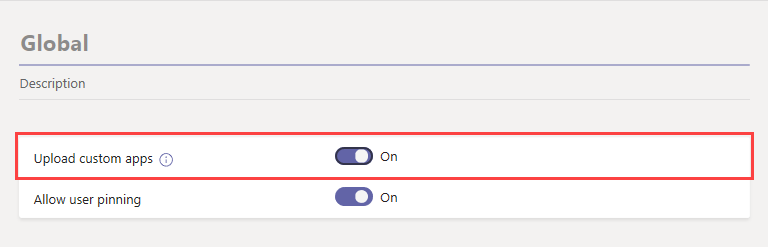

# Microsoft Teams でカスタムアプリを管理する

この記事では、チームアプリを開発から展開に移動する方法についてのエンドツーエンドのガイダンスを提供します。 このガイダンスは、アプリの Teams の側面を中心としており、IT 担当者を対象としています。 Teams アプリの開発の詳細については、<a href="https://docs.microsoft.com/microsoftteams/platform" target="_blank">こちら</a>を参照してください。

## はじめに

Teams でカスタムアプリを作成して管理するには、2つのテナント (開発用と運用用テナントのテストテナント) が必要です。

> [!NOTE]
> まだテスト用のテナントを作成していない場合は、Office 365 開発者プログラムを使用して、簡単にテスト用のデータを作成し、テストデータに設定することができます。 <a href="https://developer.microsoft.com/office/dev-program" target="_blank">詳細はこちら</a>をご覧ください。

## 手順 1: 開発とテスト

### テストユーザーを作成する

社内または外部の開発者がテストテナントのアカウントを持っているかどうかを確認します。 <a href="https://docs.microsoft.com/microsoft-365/admin/add-users/add-users" target="_blank">詳しく</a>は、「ユーザーの追加」をご覧ください。

### テストテナントでカスタムアプリを許可する

テストに必要なアクセス権を開発者に提供するために、テストテナントのすべてのユーザーがカスタムアプリ (サイドローディングとも呼ばれます) をアップロードすることを許可します。 これにより、開発者は、アプリを Teams apps ストアに提出せずに、個人向けまたはテスト用テナント全体で使用するカスタムアプリをアップロードすることができます。 カスタムアプリをアップロードすると、配布する前に開発者がアプリをテストすることができます。

ユーザーがカスタムアプリをアップロードすることを許可するには、次の手順を実行します。

1. [**カスタムアプリの組織全体での操作を許可する**] 設定をオンにします。 その手順は次のとおりです。
    1. <a href="https://admin.teams.microsoft.com/" target="_blank">Microsoft Teams 管理センター</a>の左のナビゲーションで、[ **Teams アプリ**の管理] に移動し、  >  **Manage apps**[**組織全体のアプリの設定**] をクリックします。
    2. [**カスタムアプリ**] の下で、[**カスタムアプリでの操作を許可**する] をオンにし、[**保存**] をクリックします。

    

2. グローバルアプリセットアップポリシーで [**カスタムアプリのアップロード**] 設定をオンにします。 その手順は次のとおりです。
    1. <a href="https://admin.teams.microsoft.com/" target="_blank">Microsoft Teams 管理センター</a>の左のナビゲーションで、[ **Teams アプリ**  >  **セットアップポリシー**] に移動し、[**グローバル (組織全体の既定)** ] ポリシーをクリックします。
    2. [**カスタムアプリのアップロード**] をオンにし、[**保存**] をクリックします。

    

> [!NOTE]
> チームレベルで [カスタムアプリのアップロード] 設定もあります。 この設定は既定でオンになっています。 ただし、開発者がカスタムアプリをチームにアップロードできない場合は、次の手順に従って設定を<a href="https://docs.microsoft.com/microsoftteams/teams-custom-app-policies-and-settings#configure-the-team-custom-app-setting" target="_blank">確認します</a>。

### アプリを作成する

これで、開発者はアプリを作成するために必要なものを取得できるようになりました。 これについて<a href="https://docs.microsoft.com/microsoftteams/platform" target="_blank">は、こちら</a>をご覧ください。

## 手順 2: 運用環境で検証する

### アプリパッケージを取得する

アプリを運用環境で使う準備ができたら、開発者はアプリパッケージを生成する必要があります。 そのためには、<a href="https://docs.microsoft.com/microsoftteams/platform/get-started/get-started-app-studio" target="_blank">アプリ Studio</a>を使うことができます。 ファイルを .zip 形式で送信します。

Microsoft は、<a href="https://docs.microsoft.com/microsoftteams/platform/publishing/office-store-approval" target="_blank">これらのガイドライン</a>を使用して、アプリがグローバルチームアプリストアの品質とセキュリティ標準に準拠していることを確認します。

### 信頼されたユーザーに対して、プロダクションテナントのカスタムアプリのアップロードを許可する

プロダクションテナントでアプリが正常に動作していることを確認するには、カスタムアプリをアップロードするために、自分と組織の信頼できるユーザーを許可する必要があります。  前の<a href="https://docs.microsoft.com/microsoftteams/manage-your-lob-apps#allow-custom-apps-in-the-test-tenant" target="_blank">手順</a>と同じように、アプリセットアップポリシーを使ってこの操作を行います。

> [!NOTE]
> 自分や信頼されたユーザーの場合でも、検証のためにアプリを運用テナントにアップロードすることができない場合は、この手順をスキップして、手順3と4を実行して、unvalidated アプリをテナントアプリストアにアップロードします。 その後、そのアプリへのアクセスを、信頼できる自分とユーザーのみに制限します。 これらのユーザーは、テナントアプリストアからアプリを取得して検証を実行することができます。 アプリを検証した後で、同じアクセス許可ポリシーを使用して access を開き、運用のためにアプリをロールアウトします。

信頼されたユーザーに対してカスタムアプリのアップロードを許可するには、次の手順を実行します。

1. [**カスタムアプリの組織全体での操作を許可する**] 設定をオンにします。 その手順は次のとおりです。
    1. <a href="https://admin.teams.microsoft.com/" target="_blank">Microsoft Teams 管理センター</a>の左のナビゲーションで、[ **Teams アプリ**の管理] に移動し、  >  **Manage apps**[**組織全体のアプリの設定**] をクリックします。
    2. [**カスタムアプリ**] の下で、[**カスタムアプリでの操作を許可**する] をオンにし、[**保存**] をクリックします。
2. グローバルアプリセットアップポリシーで [**カスタムアプリのアップロード**] 設定をオフにします。 その手順は次のとおりです。
    1. <a href="https://admin.teams.microsoft.com/" target="_blank">Microsoft Teams 管理センター</a>の左のナビゲーションで、[ **Teams アプリ**  >  **セットアップポリシー**] に移動し、[**グローバル (組織全体の既定)** ] ポリシーをクリックします。
    2. [**カスタムアプリのアップロード**] をオフにして、[**保存**] をクリックします。
3. カスタムアプリをアップロードして、信頼されたユーザーのセットに割り当てることができる新しいアプリのセットアップポリシーを作成します。 その手順は次のとおりです。
    1. <a href="https://admin.teams.microsoft.com/" target="_blank">Microsoft Teams 管理センター</a>の左のナビゲーションで、[ **Teams アプリ**  >  **セットアップポリシー**] に移動し、[**追加**] をクリックします。 新しいポリシーに名前と説明を付け、[**カスタムアプリのアップロード**] をオンにして、[**保存**] をクリックします。
    2. 作成した新しいポリシーを選択し、[**ユーザーの管理**] をクリックします。 ユーザーを検索し、[**追加**] をクリックして、[**適用**] をクリックします。 この手順を繰り返して、すべての信頼できるユーザーにポリシーを割り当てます。

        ![[アプリセットアップポリシーの追加] ページのスクリーンショット](media/manage-your-lob-apps-new-app-setup-policy.png)

    これらのユーザーは、アプリマニフェストをアップロードして、アプリが運用テナントで正常に動作していることを確認できます。

## 手順 3: テナントアプリカタログにアップロードする

テナント app store のユーザーがアプリを利用できるようにするには、アプリをアップロードします。 これは、Microsoft Teams 管理センターの [[アプリの管理](manage-apps.md)] ページで行うことができます。

![管理センターの [アプリの管理] ページのスクリーンショット](media/manage-your-lob-apps-upload-new-app.png)

## 手順 4: 権限を構成して割り当てる

### アプリへのアクセスを制御する

既定では、すべてのユーザーが Teams apps ストアでこのアプリにアクセスできます。 アプリを使用する権限を持つユーザーを制限および制御するには、新しいアプリのアクセス許可ポリシーを作成して割り当てることができます。 <a href="https://docs.microsoft.com/microsoftteams/teams-app-permission-policies#create-a-custom-app-permission-policy" target="_blank">次の手順を</a>実行します。

![[アプリのアクセス許可ポリシーの追加] ページのスクリーンショット](media/manage-your-lob-apps-new-app-permission-policy.png)

### ユーザーが検出できるようにアプリを固定する

既定では、ユーザーがこのアプリを見つけるには、Teams アプリストアに移動して、それを参照または検索する必要があります。 ユーザーがアプリを簡単に利用できるようにするために、アプリを Teams のアプリバーにピン留めすることができます。 これを行うには、新しいアプリセットアップポリシーを作成し、ユーザーに割り当てます。 <a href="https://docs.microsoft.com/microsoftteams/teams-app-setup-policies#create-a-custom-app-setup-policy" target="_blank">次の手順を</a>実行します。

![[固定されたアプリの追加] ウィンドウのスクリーンショット](media/manage-your-lob-apps-pinned-apps.png)

## 手順 5: アプリを更新する

アプリを更新するには、開発者が[手順 1](#step-1-develop-and-test)と[手順 2](#step-2-validate-in-production)に従って続行する必要があります。

テナントアプリカタログを使用して、アプリを更新することができます。 これを行うには、Microsoft Teams 管理センターで、[ **Teams アプリ**の管理] に移動  >  **Manage apps**します。 アプリの一覧で、アプリ名をクリックし、[**更新**] をクリックします。 この操作を行うと、テナントアプリカタログの既存のアプリは置き換えられ、アプリのすべてのアクセス許可ポリシーとアプリのセットアップポリシーは、更新されたアプリに適用されたままになります。

### エンドユーザーによる更新エクスペリエンス

ほとんどの場合、アプリの更新が完了すると、エンドユーザーに対して新しいバージョンが自動的に表示されます。 ただし、 <a href="https://docs.microsoft.com/microsoftteams/platform/resources/schema/manifest-schema" target="_blank">Microsoft Teams マニフェスト</a>には、ユーザーの承認を必要とする次のような更新があります。

* ボットが追加または削除された
* 既存のボットの "botId" プロパティが変更されました
* 既存のボットの "isNotificationOnly" プロパティが変更されました
* ボットの "supportsFiles" プロパティが変更されました
* メッセージング拡張機能が追加または削除されました
* 新しいコネクタが追加されました
* 新しい静的タブが追加されました
* 新しい [構成可能] タブが追加されました
* "WebApplicationInfo" 内のプロパティが変更されました

## 関連アプリ

- [Microsoft Teams 管理センターでアプリを管理する](manage-apps.md)
