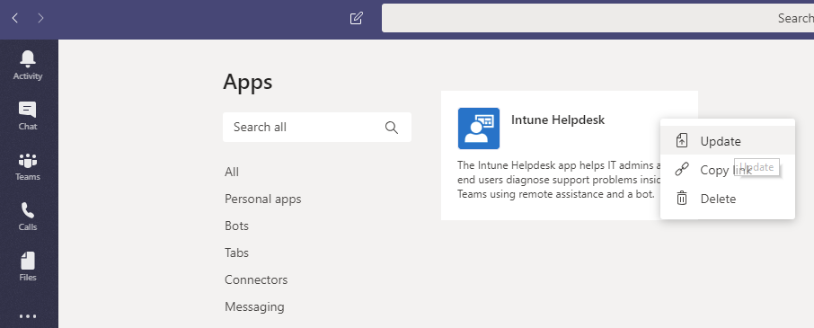

# Microsoft Teams で基幹業務アプリを管理するManage your line-of-business apps in Microsoft Teams

この記事では、チームアプリを開発から展開に移動する方法についてのエンドツーエンドのガイダンスを提供します。This article provides end-to-end guidance for how to take your Teams app from development to deployment. このガイダンスは、アプリの Teams の側面を中心としており、IT 担当者を対象としています。This guidance focuses on the Teams aspects of the app and is intended for IT pros. Teams アプリの開発の詳細については、[こちら](https://docs.microsoft.com/microsoftteams/platform)を参照してください。For more information on developing Teams apps, see [here](https://docs.microsoft.com/microsoftteams/platform).

## はじめにGetting started

Teams で基幹業務 (LOB) アプリを作成して管理するには、2つのテナント (開発用と運用用テナントのテストテナント) が必要です。To create and manage line-of-business (LOB) apps in Teams, you’ll need two tenants: a test tenant for development and a production tenant.

> [!NOTE]
> まだテスト用のテナントを作成していない場合は、Office 365 開発者プログラムを使用して、簡単にテスト用のデータを作成し、テストデータに設定することができます。If you don’t already have a test tenant, you can quickly create one and populate it with test data using the Office 365 Developer Program. [詳細はこちら](https://developer.microsoft.com/office/dev-program)をご覧ください。[Learn more here](https://developer.microsoft.com/office/dev-program).

## 手順 1: 開発とテストStep 1: Develop and test

### テストユーザーを作成するCreate test users

社内または外部の開発者がテストテナントのアカウントを持っているかどうかを確認します。Make sure that your developers, whether in-house or external, have accounts in your test tenant. [詳しく](https://docs.microsoft.com/office365/admin/add-users/add-users)は、「ユーザーの追加」をご覧ください。[Learn more about adding users](https://docs.microsoft.com/office365/admin/add-users/add-users).

### テストテナントでカスタムアプリを許可するAllow custom apps in the test tenant

テストに必要なアクセス権を開発者に提供するために、テストテナントのすべてのユーザーがカスタムアプリ (サイドローディングとも呼ばれます) をアップロードすることを許可します。To give developers the access they need for testing, allow all users in the test tenant to upload custom apps (also known as sideloading). これにより、開発者は、アプリを Teams apps ストアに提出せずに、個人向けまたはテスト用テナント全体で使用するカスタムアプリをアップロードすることができます。This lets developers upload a custom app to be used personally or across the test tenant without having to submit the app to the Teams apps store. カスタムアプリをアップロードすると、配布する前に開発者がアプリをテストすることができます。Uploading a custom app lets developers test an app before you distribute it more widely.

ユーザーがカスタムアプリをアップロードすることを許可するには、次の手順を実行します。To allow users to upload custom apps, follow these steps:

1. [**カスタムアプリの組織全体での操作を許可する**] 設定をオンにします。Turn on the **Allow interaction with custom apps** org-wide setting. その手順は次のとおりです。To do this:
    1. [Microsoft Teams 管理センター](https://admin.teams.microsoft.com/)の左のナビゲーションで、[ **Teams アプリ** > の**アクセス許可ポリシー**] に移動し、[**組織全体の設定**] をクリックします。In the left navigation of the [Microsoft Teams admin center](https://admin.teams.microsoft.com/), go to **Teams apps** > **Permission policies**, and then click **Org-wide settings**.
    2. [**カスタムアプリ**] の下で、[**カスタムアプリでの操作を許可**する] をオンにし、[**保存**] をクリックします。Under **Custom apps**, turn on **Allow interaction with custom apps**, and then click **Save**.

    

2. グローバルアプリセットアップポリシーで [**カスタムアプリのアップロード**] 設定をオンにします。Turn on the **Upload custom apps** setting in the global app setup policy. その手順は次のとおりです。To do this:
    1. [Microsoft Teams 管理センター](https://admin.teams.microsoft.com/)の左のナビゲーションで、[ **Teams アプリ** > **セットアップポリシー**] に移動し、[**グローバル (組織全体の既定)** ] ポリシーをクリックします。In the left navigation of the [Microsoft Teams admin center](https://admin.teams.microsoft.com/), go to **Teams apps** > **Setup policies**, and then click the **Global (Org-wide default)** policy.
    2. [**カスタムアプリのアップロード**] をオンにし、[**保存**] をクリックします。Turn on **Upload custom apps**, and then click **Save**.

    

> [!NOTE]
> チームレベルで [カスタムアプリのアップロード] 設定もあります。There's also an upload custom app setting at the team level. この設定は既定でオンになっています。By default this setting is on. ただし、開発者がカスタムアプリをチームにアップロードできない場合は、次の手順に従って設定を[確認します](teams-custom-app-policies-and-settings.md#configure-the-team-custom-app-setting)。However, if developers are unable to upload a custom app to a team, check the setting by following the steps [here](teams-custom-app-policies-and-settings.md#configure-the-team-custom-app-setting).

### アプリを作成するCreate your app

これで、開発者はアプリを作成するために必要なものを取得できるようになりました。Developers should now have what they need to create your app. これについて[は、こちら](https://docs.microsoft.commicrosoftteams/platform)をご覧ください。See [here](https://docs.microsoft.commicrosoftteams/platform) for guidance on that.

## 手順 2: 運用環境で検証するStep 2: Validate in production

### アプリパッケージを取得するGet the app package

アプリを運用環境で使う準備ができたら、開発者はアプリパッケージを生成する必要があります。When the app is ready for use in production, the developer should produce an app package. そのためには、[アプリ Studio](https://docs.microsoft.com/microsoftteams/platform/get-started/get-started-app-studio)を使うことができます。They can use [App Studio](https://docs.microsoft.com/microsoftteams/platform/get-started/get-started-app-studio) for that. ファイルを .zip 形式で送信します。They'll send you the file in .zip format.

Microsoft は、[これらのガイドライン](https://docs.microsoft.com/microsoftteams/platform/publishing/office-store-approval)を使用して、アプリがグローバルチームアプリストアの品質とセキュリティ標準に準拠していることを確認します。Microsoft uses [these guidelines](https://docs.microsoft.com/microsoftteams/platform/publishing/office-store-approval) to ensure apps comply with the quality and security standards of the global Teams apps store.

### 信頼されたユーザーに対して、プロダクションテナントのカスタムアプリのアップロードを許可するAllow trusted users to upload custom apps in the production tenant

プロダクションテナントでアプリが正常に動作していることを確認するには、カスタムアプリをアップロードするために、自分と組織の信頼できるユーザーを許可する必要があります。To validate that the app is working correctly in your production tenant, you need to allow yourself and/or trusted users in your organization to upload custom apps.  「テナントのテスト」の手順では、前の「[カスタムアプリを許可](#allow-custom-apps-in-the-test-tenant)する」と同じように、アプリセットアップポリシーを使ってこの操作を行います。Much like in the earlier [Allow custom apps in the test tenant](#allow-custom-apps-in-the-test-tenant) step, you use app setup policies to do this.

> [!NOTE]
> 自分や信頼されたユーザーの場合でも、検証のためにアプリを運用テナントにアップロードすることができない場合は、この手順をスキップして、手順3と4を実行して、unvalidated アプリをテナントアプリストアにアップロードします。If you’re uncomfortable with uploading the app to your production tenant for validation, even for yourself or trusted users, you can skip this step and follow steps 3 and 4 to upload the unvalidated app to your tenant apps store. その後、そのアプリへのアクセスを、信頼できる自分とユーザーのみに制限します。Then, restrict access to that app to only yourself and users you trust. これらのユーザーは、テナントアプリストアからアプリを取得して、検証を実行することができます。These users can then get the app from the tenant apps store to perform validation. アプリを検証した後で、同じアクセス許可ポリシーを使用して access を開き、運用のためにアプリをロールアウトします。After the app is validated, use the same permission policies to open access and roll the app out for production use.

信頼されたユーザーに対してカスタムアプリのアップロードを許可するには、次の手順を実行します。To allow trusted users to upload custom apps, follow these steps:

1. [**カスタムアプリの組織全体での操作を許可する**] 設定をオンにします。Turn on the **Allow interaction with custom apps** org-wide setting. その手順は次のとおりです。To do this:
    1. [Microsoft Teams 管理センター](https://admin.teams.microsoft.com/)の左のナビゲーションで、[ **Teams アプリ** > の**アクセス許可ポリシー**] に移動し、[**組織全体の設定**] をクリックします。In the left navigation of the [Microsoft Teams admin center](https://admin.teams.microsoft.com/), go to **Teams apps** > **Permission policies**, and then click **Org-wide settings**.
    2. [**カスタムアプリ**] の下で、[**カスタムアプリでの操作を許可**する] をオンにし、[**保存**] をクリックします。Under **Custom apps**, turn on **Allow interaction with custom apps**, and then click **Save**.
2. グローバルアプリセットアップポリシーで [**カスタムアプリのアップロード**] 設定をオフにします。Turn off the **Upload custom apps** setting in the global app setup policy. その手順は次のとおりです。To do this:
    1. [Microsoft Teams 管理センター](https://admin.teams.microsoft.com/)の左のナビゲーションで、[ **Teams アプリ** > **セットアップポリシー**] に移動し、[**グローバル (組織全体の既定)** ] ポリシーをクリックします。In the left navigation of the [Microsoft Teams admin center](https://admin.teams.microsoft.com/), go to **Teams apps** > **Setup policies**, and then click the **Global (Org-wide default)** policy.
    2. [**カスタムアプリのアップロード**] をオフにして、[**保存**] をクリックします。Turn off **Upload custom apps**, and then click **Save**.
3. カスタムアプリをアップロードして、信頼されたユーザーのセットに割り当てることができる新しいアプリのセットアップポリシーを作成します。Create a new app setup policy that allows uploading custom apps and assign it to your set of trusted users. その手順は次のとおりです。To do this:
    1. [Microsoft Teams 管理センター](https://admin.teams.microsoft.com/)の左のナビゲーションで、[ **Teams アプリ** > **セットアップポリシー**] に移動し、[**追加**] をクリックします。In the left navigation of the [Microsoft Teams admin center](https://admin.teams.microsoft.com/), go to **Teams apps** > **Setup policies**, and then click the **Add**. 新しいポリシーに名前と説明を付け、[**カスタムアプリのアップロード**] をオンにして、[**保存**] をクリックします。Give the new policy a name and description, turn on **Upload custom apps**, and then click **Save**.
    2. 作成した新しいポリシーを選択し、[**ユーザーの管理**] をクリックします。Select the new policy you created, and then click **Manage users**. ユーザーを検索し、[**追加**] をクリックして、[**適用**] をクリックします。Search for a user, click **Add**, and then click **Apply**. この手順を繰り返して、すべての信頼できるユーザーにポリシーを割り当てます。Repeat this step to assign the policy to all your trusted users.

        ![[アプリセットアップポリシーの追加] ページのスクリーンショット](media/manage-your-lob-apps-new-app-setup-policy.png)

    これらのユーザーは、アプリマニフェストをアップロードして、アプリが運用テナントで正常に動作していることを確認できます。These users can now upload the app manifest to validate that the app is working correctly in the production tenant.

## 手順 3: テナントアプリカタログにアップロードするStep 3: Upload to the Tenant Apps Catalog

テナントアプリストアのユーザーがアプリを利用できるようにするには、アプリをアップロードします。To make the app available to users in the tenant apps store, upload the app. これは、Teams のデスクトップクライアントを使って行うことができます。You can do this using the Teams desktop client. [次の手順を](tenant-apps-catalog-teams.md#go-to-the-tenant-apps-catalog)実行します。Follow the steps [here](tenant-apps-catalog-teams.md#go-to-the-tenant-apps-catalog).

![[アプリ] ページのスクリーンショット](media/manage-your-lob-apps-store.png)

## 手順 4: 権限を構成して割り当てるStep 4: Configure and assign permissions

### アプリへのアクセスを制御するControl access to the app

既定では、すべてのユーザーが Teams apps ストアでこのアプリにアクセスできます。By default, all users have access to this app in the the Teams apps store. アプリを使用する権限を持つユーザーを制限および制御するには、新しいアプリのアクセス許可ポリシーを作成して割り当てることができます。To restrict and control who has permission to use the app, you can create and assign a new app permission policy. [次の手順を](teams-app-permission-policies.md#create-a-custom-app-permission-policy)実行します。Follow the steps [here](teams-app-permission-policies.md#create-a-custom-app-permission-policy).

![[アプリのアクセス許可ポリシーの追加] ページのスクリーンショット](media/manage-your-lob-apps-new-app-permission-policy.png)

### ユーザーが検出できるようにアプリを固定するPin the app for users to discover

既定では、ユーザーがこのアプリを見つけるには、Teams アプリストアに移動して、それを参照または検索する必要があります。By default, for users to find this app they would have to go to Teams apps store and browse or search for it. ユーザーがアプリを簡単に利用できるようにするために、アプリを Teams のアプリバーにピン留めすることができます。To make it easy for users to get to the app, you can pin the app to the app bar in Teams. これを行うには、新しいアプリセットアップポリシーを作成し、ユーザーに割り当てます。To do this, create a new app setup policy and assign it to users. [次の手順を](teams-app-setup-policies.md#create-a-custom-app-setup-policy)実行します。Follow the steps [here](teams-app-setup-policies.md#create-a-custom-app-setup-policy).

![[固定されたアプリの追加] ウィンドウのスクリーンショット](media/manage-your-lob-apps-pinned-apps.png)

## 手順 5: アプリを更新するStep 5: Update the app

アプリを更新するには、開発者が[手順 1](#step-1-develop-and-test)と[手順 2](#step-2-validate-in-production)に従って続行する必要があります。To update an app, developers should continue to follow [step 1](#step-1-develop-and-test) and [step 2](#step-2-validate-in-production).

テナントアプリカタログを使用して、アプリを更新することができます。You can update the app through the Tenant Apps Catalog. これを行うには、Teams デスクトップクライアントで、**テナント名&lt;&gt;用に構築**された**アプリ** > に移動し、[.. **.** ] をクリックします。To do this, in the Teams desktop client, go to **Apps** > **Built for &lt;Your tenant name&gt;**, click **…** をクリックし、アプリの右上隅にある [**更新**] をクリックします。in the upper-right corner of the app, and then click **Update**. この操作を行うと、テナントアプリカタログ内の既存のアプリは置き換えられ、すべてのアクセス許可ポリシーとセットアップポリシーは、更新されたアプリに適用されたままになります。Doing this replaces the existing app in the Tenant Apps Catalog, and all permission policies and setup policies remain enforced for the updated app. 

