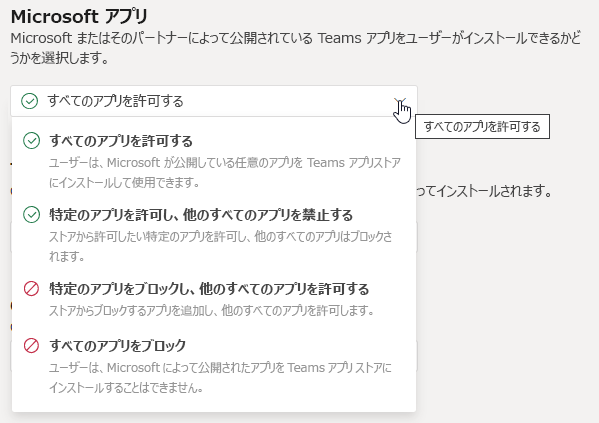

# 会議ポリシーの設定 - 全般

この記事では、Teams 会議の次の一般的なポリシー設定について説明します。

- [チャネルで "今すぐ会議" を許可する](#allow-meet-now-in-channels)
- [Outlook アドインを許可する](#allow-the-outlook-add-in)
- [チャネルの会議スケジュールを許可する](#allow-channel-meeting-scheduling)
- [プライベート会議のスケジュールを許可する](#allow-scheduling-private-meetings)
- [プライベート会議で "今すぐ会議" を許可する](#allow-meet-now-in-private-meetings)
- [指定された発表者ロール モード](#designated-presenter-role-mode)
- [会議出席レポート](#meeting-attendance-report)
- [諸島モードの会議プロバイダー](#meeting-provider-for-islands-mode)

## チャネルで "今すぐ会議" を許可する

これはユーザーごとのポリシーであり、会議が始まる前に適用されます。 この設定は、ユーザーが Teams チャネルでアドホック会議を開始できるかどうかを制御します。 この設定をオンにした場合、ユーザーは[会議] ボタンをクリックして臨時の会議を開始したり、チャネルで会議をスケジュールできます。 既定値は True です。

[![メッセージの下に [今すぐ会う] アイコンを示すスクリーンショット ](media/meeting-policies-meet-now.png)](media/meeting-policies-meet-now.png#lightbox)

## Outlook アドインを許可する

これはユーザーごとのポリシーであり、会議が始まる前に適用されます。 この設定は、Outlook (Windows、Mac、Web、およびモバイル) 内から Teams 会議をスケジュールできるかどうかを制御します。

これをオフにすると、ユーザーは Outlook で新しい会議を作成するときに Teams 会議をスケジュールできなくなります。 たとえば、Windows 上の Outlook では、[**新しい Teams 会議**] オプションはリボンに表示されません。

## チャネルの会議スケジュールを許可する

既存の[AllowChannelMeetingScheduling] ポリシーを使用して、チームのチャネルの予定表で作成できるイベントの種類を制御します。 これはユーザーごとのポリシーであり、会議が始まる前に適用されます。 この設定は、ユーザーが Teams チャネルで会議をスケジュールできるかどうかを制御します。 既定では、この設定は[オン] に設定されています。 

このポリシーをオフにすると、ユーザーは新しいチャネル会議を作成できます。 ただし、既存のチャネル会議は、イベントの開催者が編集できます。

会議のスケジュールは無効になります。

![Teams の [会議の予約] オプションが表示されたスクリーンショット](media/schedule-meeting-option.png)

チャネルの選択が無効になっています。

チャネルの投稿ページで、次の機能が無効になります。

- [チャネル返信の作成] ボックスの [**会議のスケジュール**] ボタン
  
  
- チャネル ヘッダーの [**会議のスケジュール**] ボタン。
  

[チャネル カレンダー] で、次の操作を行います。

- チャンネル予定表ヘッダーの[**新しいイベントの追加**] ボタンは、無効になります。
  

- ユーザーは、チャネル予定表の時間ブロックをドラッグして選択して、チャネル会議を作成できない。

- ユーザーは、キーボード ショートカットを使用して、チャネル予定表に会議を作成することはできません。

管理センターにて

[アプリのアクセス許可ポリシー] ページの [**Microsoft アプリ**] セクションに、チャネル カレンダー アプリが表示されます。

## プライベート会議のスケジュールを許可する

これはユーザーごとのポリシーであり、会議が始まる前に適用されます。 この設定は、ユーザーが Teams でプライベート会議をスケジュールできるかどうかを制御します。 チームのチャネルに公開されていない会議はプライベートです。

[**プライベート会議のスケジュールを許可する**] および [**チャネルの会議スケジュールを許可する**] を無効にすると、Teams のユーザーに対して [**必須出席者の追加**] および [**チャネルの追加**] オプションが無効になります。 既定では、この設定は[オン] に設定されています。

## プライベート会議で "今すぐ会議" を許可する

これはユーザーごとのポリシーであり、会議が始まる前に適用されます。 この設定は、ユーザーがアドホック プライベート会議を開始できるかどうかを制御します。  既定では、この設定は[オン] に設定されています。

## 指定された発表者ロール モード

これは、ユーザーごとのポリシーです。 この設定では、Teams クライアントの **会議オプション** の **誰がプレゼンをするか?** の設定の既定値を変更することができます。 このポリシー設定は、Meet Now (今すぐ会議) を含むすべての会議に影響します。

**誰がプレゼンをするか?** の設定を使用すると、会議の開催者は会議の発表者を選択することができます。 詳細については、「[Teams 会議の参加者設定の変更](https://support.microsoft.com/article/change-participant-settings-for-a-teams-meeting-53261366-dbd5-45f9-aae9-a70e6354f88e)」 と 「[Teams 会議での役割](https://support.microsoft.com/article/roles-in-a-teams-meeting-c16fa7d0-1666-4dde-8686-0a0bfe16e019)」を参照してください。

現在、このポリシー設定を構成することができるのは、PowerShell を使用した場合のみです。 [Set-CsTeamsMeetingPolicy](https://docs.microsoft.com/powershell/module/skype/set-csteamsmeetingpolicy) コマンドレットを使用して、既存の Teams 会議ポリシーを編集することができます。 または、[New-CsTeamsMeetingPolicy](https://docs.microsoft.com/powershell/module/skype/new-csteamsmeetingpolicy) コマンドレットを使用して、新しい Teams の会議ポリシーを作成し、ユーザーに割り当てます。

Teams の **誰がプレゼンをするか?** 設定の既定値を指定するには、**DesignatedPresenterRoleMode** パラメーターを次のいずれかに設定します。

- **EveryoneUserOverride**: すべての会議参加者は発表者になることができます。 これが既定値です。 このパラメーターは、 Teams 内の **すべてのユーザー** の設定 に呼応します。
- **EveryoneInCompanyUserOverride**: 組織内の認証済みユーザー (ゲスト ユーザーを含む) は、発表者になることができます。 このパラメーターは、Teams の **組織内の人たち** 設定に呼応します。
- **OrganizerOnlyUserOverride**: 会議の開催者のみが発表者となり、他のすべての会議参加者が出席者として指定されます。 このパラメーターは、Teams の [**私だけ**] 設定に呼応します。

既定値を設定した後でも、会議の開催者はチームの設定を変更し、スケジュールした会議での発表者を選ぶことができることにご注意ください。

## 会議出席レポート

これは、ユーザーごとのポリシーです。 この設定では、会議の開催者が [会議出席レポート](teams-analytics-and-reports/meeting-attendance-report.md)をダウンロードできるかどうかを制御します。

現在、このポリシー設定を構成することができるのは、PowerShell を使用した場合のみです。 [Set-CsTeamsMeetingPolicy](https://docs.microsoft.com/powershell/module/skype/set-csteamsmeetingpolicy) コマンドレットを使用して、既存の Teams 会議ポリシーを編集することができます。 または、[New-CsTeamsMeetingPolicy](https://docs.microsoft.com/powershell/module/skype/new-csteamsmeetingpolicy) コマンドレットを使用して、新しい Teams の会議ポリシーを作成し、ユーザーに割り当てます。

会議の開催者が会議の出席依頼のレポートをダウンロードできるようにするには、**AllowEngagementReport** パラメーターを [**有効**] に設定します。 有効にすると、**参加者** ウィンドウに、レポートをダウンロードするためのオプションが表示されます。

会議の開催者がレポートをダウンロードしないようにするには、パラメーターを [**無効**] に設定します。 既定では、この設定は無効になっており、レポートをダウンロードするオプションは利用できません。

## 諸島モードの会議プロバイダー

これは、ユーザー単位のポリシーです。 この設定は、*アイランド モードのユーザー* がどの Outlook 会議アドインを使用するかを制御できます。 Teams 会議アドインのみを使用するか、Teams 会議アドインと Skype for Business 会議アドインの両方を使用するかを指定して、Outlook で会議をスケジュールできます。

このポリシーは、アイランドモードで、Teams の会議ポリシーで **AllowOutlookAddIn** パラメーターが **True** に設定されているユーザーにのみ適用できます。

現在、このポリシーを設定するには PowerShell を使用する必要があります。 [Set-CsTeamsMeetingPolicy](https://docs.microsoft.com/powershell/module/skype/set-csteamsmeetingpolicy) コマンドレットを使用して、既存の Teams 会議ポリシーを編集することができます。 または、[New-CsTeamsMeetingPolicy](https://docs.microsoft.com/powershell/module/skype/new-csteamsmeetingpolicy) コマンドレットを使用して、新しい Teams の会議ポリシーを作成し、ユーザーに割り当てます。

ユーザーが使用できる会議アドインを指定するには、次のように **PreferredMeetingProviderForIslandsMode** パラメーターを指定します。

- パラメーターを **TeamsAndSfB** に設定すると、Outlook の Teams 会議アドインと Skype for Business アドインの両方が有効になります。 これが既定値です。
- パラメーターを **Teams** に設定すると、Outlook の Teams 会議アドインのみが有効になります。 このポリシー設定では、今後のすべての会議にTeams の会議への参加リンクがあることが確実になります。 既存の Skype for Business 会議の参加リンクはTeams には移行されません。 このポリシー設定は、ユーザーが Skype for Business への参加、チャット、PSTN 通話、その他の機能を使用することに影響を与えません。ユーザーが Skype for Business の機能を引き続き使用できることを意味します。

  パラメーターを **Teams** に設定し、**の TeamsAndSfB** に戻すと、両方の会議アドインが有効になります。 ただし、既存の Teams 会議の参加リンクは、Skype for Business に移行されないことにご注意ください。 変更の後にスケジュールされた Skype for Business の会議のみが、Skype for Business の会議参加リンクを持つようになります。

## 会議の反応

AllowMeetingReactions の設定は、PowerShell を使用する場合にのみ適用できます。 Teams 管理センターから AllowMeetingReactions のオンとオフを切り替えるオプションはありません。

会議の反応は、既定ではオフになっています。 ユーザーに対する反応をオフにしても、ユーザーがスケジュールした会議でリアクションを使用できないという意味ではない。 会議の開催者は、既定の設定に関係なく、会議オプション ページからリアクションを有効にできます。

## 関連項目

- [Teams での PowerShell の概要](teams-powershell-overview.md)
- [ Teams でユーザーにポリシーを割り当てる](assign-policies.md)
- [ユーザーから RestrictedAnonymousAccess Teams 会議ポリシーを削除する](meeting-policies-restricted-anonymous-access.md)
