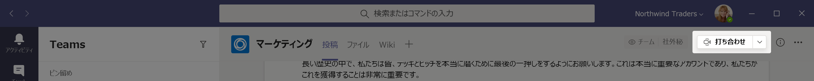
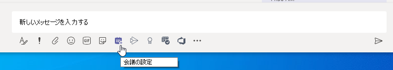
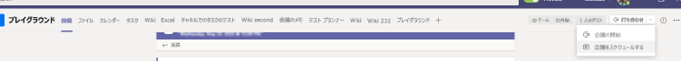

# 会議ポリシーの設定 - 全般Meeting policy settings - General

この記事では、Teams 会議の次の一般的なポリシー設定について説明します。This article describes the following general policy settings for Teams meetings:

- [チャネルで "今すぐ会議" を許可するAllow Meet now in channels](#allow-meet-now-in-channels)
- [Outlook アドインを許可するAllow the Outlook add-in](#allow-the-outlook-add-in)
- [チャネルの会議スケジュールを許可するAllow channel meeting scheduling](#allow-channel-meeting-scheduling)
- [プライベート会議のスケジュールを許可するAllow scheduling private meetings](#allow-scheduling-private-meetings)
- [プライベート会議で "今すぐ会議" を許可するAllow Meet now in private meetings](#allow-meet-now-in-private-meetings)
- [指定された発表者ロール モードDesignated presenter role mode](#designated-presenter-role-mode)
- [会議出席レポートMeeting attendance report](#meeting-attendance-report)
- [諸島モードの会議プロバイダーMeeting provider for Islands mode](#meeting-provider-for-islands-mode)

## チャネルで "今すぐ会議" を許可するAllow Meet now in channels

これはユーザーごとのポリシーであり、会議が始まる前に適用されます。This is a per-user policy and applies before a meeting starts. この設定は、ユーザーが Teams チャネルでアドホック会議を開始できるかどうかを制御します。This setting controls whether a user can start an ad hoc meeting in a Teams channel. この設定をオンにした場合、ユーザーは[会議] ボタンをクリックして臨時の会議を開始したり、チャネルで会議をスケジュールできます。If you turn this on, users can click the **Meet** button to start an ad hoc meeting or schedule a meeting in the channel. 既定値は True です。The default value is True.

[![メッセージの下に [今すぐ会う] アイコンを示すスクリーンショット ](media/meeting-policies-meet-now.png)](media/meeting-policies-meet-now.png#lightbox)

## Outlook アドインを許可するAllow the Outlook add-in

これはユーザーごとのポリシーであり、会議が始まる前に適用されます。This is a per-user policy and applies before a meeting starts. この設定は、Outlook (Windows、Mac、Web、およびモバイル) 内から Teams 会議をスケジュールできるかどうかを制御します。This setting controls whether Teams meetings can be scheduled from within Outlook (Windows, Mac, web, and mobile).

これをオフにすると、ユーザーは Outlook で新しい会議を作成するときに Teams 会議をスケジュールできなくなります。If you turn this off, users are unable to schedule Teams meetings when they create a new meeting in Outlook. たとえば、Windows 上の Outlook では、[**新しい Teams 会議**] オプションはリボンに表示されません。For example, in Outlook on Windows, the **New Teams Meeting** option won't show up in the ribbon.

## チャネルの会議スケジュールを許可するAllow channel meeting scheduling

既存の[AllowChannelMeetingScheduling] ポリシーを使用して、チームのチャネルの予定表で作成できるイベントの種類を制御します。Use the existing AllowChannelMeetingScheduling policy to control the types of events that can be created on the team channel calendars. これはユーザーごとのポリシーであり、会議が始まる前に適用されます。This is a per-user policy and applies before a meeting starts. この設定は、ユーザーが Teams チャネルで会議をスケジュールできるかどうかを制御します。This setting controls whether users can schedule a meeting in a Teams channel. 既定では、この設定は[オン] に設定されています。By default, this setting is turned on. 

このポリシーをオフにすると、ユーザーは新しいチャネル会議を作成できます。If this policy is turned off, users will not be able to create new channel meetings. ただし、既存のチャネル会議は、イベントの開催者が編集できます。However, existing channel meetings can be edited by the organizer of the event.

会議のスケジュールは無効になります。Schedule a meeting will be disabled.

![Teams の [会議の予約] オプションが表示されたスクリーンショット](media/schedule-meeting-option.png)

チャネルの選択が無効になっています。Channel selection is disabled.

チャネルの投稿ページで、次の機能が無効になります。In the channel posts page, the following will be disabled:

- [チャネル返信の作成] ボックスの [**会議のスケジュール**] ボタン**Schedule a meeting** button on the channel reply compose box.
  
  
- チャネル ヘッダーの [**会議のスケジュール**] ボタン。**Schedule a meeting** button on the channel header.
  

[チャネル カレンダー] で、次の操作を行います。In the channel calendar:

- チャンネル予定表ヘッダーの[**新しいイベントの追加**] ボタンは、無効になります。**Add new event** button on channel calendar header will be disabled.
  

- ユーザーは、チャネル予定表の時間ブロックをドラッグして選択して、チャネル会議を作成できない。Users will not be able to drag and select a time block on the channel calendar to create a channel meeting.

- ユーザーは、キーボード ショートカットを使用して、チャネル予定表に会議を作成することはできません。Users cannot use Keyboard shortcuts to create a meeting on the channel calendar.

管理センターにてIn the admin center:

[アプリのアクセス許可ポリシー] ページの [**Microsoft アプリ**] セクションに、チャネル カレンダー アプリが表示されます。The channel calendar app will show up in the **Microsoft apps** section on the app permission policies page.

## プライベート会議のスケジュールを許可するAllow scheduling private meetings

これはユーザーごとのポリシーであり、会議が始まる前に適用されます。This is a per-user policy and applies before a meeting starts. この設定は、ユーザーが Teams でプライベート会議をスケジュールできるかどうかを制御します。This setting controls whether users can schedule private meetings in Teams. チームのチャネルに公開されていない会議はプライベートです。A meeting is private when it's not published to a channel in a team.

[**プライベート会議のスケジュールを許可する**] および [**チャネルの会議スケジュールを許可する**] を無効にすると、Teams のユーザーに対して [**必須出席者の追加**] および [**チャネルの追加**] オプションが無効になります。Note that if you turn off **Allow scheduling private meetings** and **Allow channel meeting scheduling**,  the **Add required attendees** and **Add channel** options are disabled for users in Teams. 既定では、この設定は[オン] に設定されています。By default, this setting is turned on.

## プライベート会議で "今すぐ会議" を許可するAllow Meet now in private meetings

これはユーザーごとのポリシーであり、会議が始まる前に適用されます。This is a per-user policy and applies before a meeting starts. この設定は、ユーザーがアドホック プライベート会議を開始できるかどうかを制御します。This setting controls whether a user can start an ad hoc private meeting.  既定では、この設定は[オン] に設定されています。By default, this setting is turned on.

## 指定された発表者ロール モードDesignated presenter role mode

これは、ユーザーごとのポリシーです。This is a per-user policy. この設定では、Teams クライアントの **会議オプション** の **誰がプレゼンをするか?** の設定の既定値を変更することができます。This setting lets you change the default value of the **Who can present?** setting in **Meeting options** in the Teams client. このポリシー設定は、Meet Now (今すぐ会議) を含むすべての会議に影響します。This policy setting affects all meetings, including Meet Now meetings.

**誰がプレゼンをするか?** の設定を使用すると、会議の開催者は会議の発表者を選択することができます。The **Who can present?** setting lets meeting organizers choose who can be presenters in a meeting. 詳細については、「[Teams 会議の参加者設定の変更](https://support.microsoft.com/article/change-participant-settings-for-a-teams-meeting-53261366-dbd5-45f9-aae9-a70e6354f88e)」 と 「[Teams 会議での役割](https://support.microsoft.com/article/roles-in-a-teams-meeting-c16fa7d0-1666-4dde-8686-0a0bfe16e019)」を参照してください。To learn more, see [Change participant settings for a Teams meeting](https://support.microsoft.com/article/change-participant-settings-for-a-teams-meeting-53261366-dbd5-45f9-aae9-a70e6354f88e) and [Roles in a Teams meeting](https://support.microsoft.com/article/roles-in-a-teams-meeting-c16fa7d0-1666-4dde-8686-0a0bfe16e019).

現在、このポリシー設定を構成することができるのは、PowerShell を使用した場合のみです。Currently, you can only use PowerShell to configure this policy setting. [Set-CsTeamsMeetingPolicy](https://docs.microsoft.com/powershell/module/skype/set-csteamsmeetingpolicy) コマンドレットを使用して、既存の Teams 会議ポリシーを編集することができます。You can edit an existing Teams meeting policy by using the [Set-CsTeamsMeetingPolicy](https://docs.microsoft.com/powershell/module/skype/set-csteamsmeetingpolicy) cmdlet. または、[New-CsTeamsMeetingPolicy](https://docs.microsoft.com/powershell/module/skype/new-csteamsmeetingpolicy) コマンドレットを使用して、新しい Teams の会議ポリシーを作成し、ユーザーに割り当てます。Or, create a new Teams meeting policy by using the [New-CsTeamsMeetingPolicy](https://docs.microsoft.com/powershell/module/skype/new-csteamsmeetingpolicy) cmdlet and assign it to users.

Teams の **誰がプレゼンをするか?** 設定の既定値を指定するには、**DesignatedPresenterRoleMode** パラメーターを次のいずれかに設定します。To specify the default value of the **Who can present?** setting in Teams, set the **DesignatedPresenterRoleMode** parameter to one of the following:

- **EveryoneUserOverride**: すべての会議参加者は発表者になることができます。**EveryoneUserOverride**:  All meeting participants can be presenters. これが既定値です。This is the default value. このパラメーターは、 Teams 内の **すべてのユーザー** の設定 に呼応します。This parameter corresponds to the **Everyone** setting in Teams.
- **EveryoneInCompanyUserOverride**: 組織内の認証済みユーザー (ゲスト ユーザーを含む) は、発表者になることができます。**EveryoneInCompanyUserOverride**: Authenticated users in the organization, including guest users, can be presenters. このパラメーターは、Teams の **組織内の人たち** 設定に呼応します。This parameter corresponds to the **People in my organization** setting in Teams.
- **OrganizerOnlyUserOverride**: 会議の開催者のみが発表者となり、他のすべての会議参加者が出席者として指定されます。**OrganizerOnlyUserOverride**: Only the meeting organizer can be a presenter and all meeting participants are designated as attendees. このパラメーターは、Teams の [**私だけ**] 設定に呼応します。This parameter corresponds to the **Only me** setting in Teams.

既定値を設定した後でも、会議の開催者はチームの設定を変更し、スケジュールした会議での発表者を選ぶことができることにご注意ください。Keep in mind that after you set the default value, meeting organizers can still change this setting in Teams and choose who can present in the meetings that they schedule.

## 会議出席レポートMeeting attendance report

これは、ユーザーごとのポリシーです。This is a per-user policy. この設定では、会議の開催者が [会議出席レポート](teams-analytics-and-reports/meeting-attendance-report.md)をダウンロードできるかどうかを制御します。This setting controls whether meeting organizers can download the [meeting attendance report](teams-analytics-and-reports/meeting-attendance-report.md).

現在、このポリシー設定を構成することができるのは、PowerShell を使用した場合のみです。Currently, you can only use PowerShell to configure this policy setting. [Set-CsTeamsMeetingPolicy](https://docs.microsoft.com/powershell/module/skype/set-csteamsmeetingpolicy) コマンドレットを使用して、既存の Teams 会議ポリシーを編集することができます。You can edit an existing Teams meeting policy by using the [Set-CsTeamsMeetingPolicy](https://docs.microsoft.com/powershell/module/skype/set-csteamsmeetingpolicy) cmdlet. または、[New-CsTeamsMeetingPolicy](https://docs.microsoft.com/powershell/module/skype/new-csteamsmeetingpolicy) コマンドレットを使用して、新しい Teams の会議ポリシーを作成し、ユーザーに割り当てます。Or, create a new Teams meeting policy by using the [New-CsTeamsMeetingPolicy](https://docs.microsoft.com/powershell/module/skype/new-csteamsmeetingpolicy) cmdlet and assign it to users.

会議の開催者が会議の出席依頼のレポートをダウンロードできるようにするには、**AllowEngagementReport** パラメーターを [**有効**] に設定します。To enable a meeting organizer to download the meeting attendance report, set the **AllowEngagementReport** parameter  to **Enabled**. 有効にすると、**参加者** ウィンドウに、レポートをダウンロードするためのオプションが表示されます。When enabled, the option to download the report is displayed in the **Participants** pane.

会議の開催者がレポートをダウンロードしないようにするには、パラメーターを [**無効**] に設定します。To prevent a meeting organizer from downloading the report, set the parameter to **Disabled**. 既定では、この設定は無効になっており、レポートをダウンロードするオプションは利用できません。By default, this setting is disabled and the option to download the report isn't available.

## 諸島モードの会議プロバイダーMeeting provider for Islands mode

これは、ユーザー単位のポリシーです。This is a per-user policy. この設定は、*アイランド モードのユーザー* がどの Outlook 会議アドインを使用するかを制御できます。This setting controls which Outlook meeting add-in is used for *users who are in Islands mode*. Teams 会議アドインのみを使用するか、Teams 会議アドインと Skype for Business 会議アドインの両方を使用するかを指定して、Outlook で会議をスケジュールできます。You can specify whether users can only use the Teams Meeting add-in or both the Teams Meeting and Skype for Business Meeting add-ins to schedule meetings in Outlook.

このポリシーは、アイランドモードで、Teams の会議ポリシーで **AllowOutlookAddIn** パラメーターが **True** に設定されているユーザーにのみ適用できます。You can only apply this policy to users who are in Islands mode and have the **AllowOutlookAddIn** parameter set to **True** in their Teams meeting policy.

現在、このポリシーを設定するには PowerShell を使用する必要があります。Currently, you can only use PowerShell to set this policy. [Set-CsTeamsMeetingPolicy](https://docs.microsoft.com/powershell/module/skype/set-csteamsmeetingpolicy) コマンドレットを使用して、既存の Teams 会議ポリシーを編集することができます。You can edit an existing Teams meeting policy by using the [Set-CsTeamsMeetingPolicy](https://docs.microsoft.com/powershell/module/skype/set-csteamsmeetingpolicy) cmdlet. または、[New-CsTeamsMeetingPolicy](https://docs.microsoft.com/powershell/module/skype/new-csteamsmeetingpolicy) コマンドレットを使用して、新しい Teams の会議ポリシーを作成し、ユーザーに割り当てます。Or, create a new Teams meeting policy by using the [New-CsTeamsMeetingPolicy](https://docs.microsoft.com/powershell/module/skype/new-csteamsmeetingpolicy) cmdlet and assign it to users.

ユーザーが使用できる会議アドインを指定するには、次のように **PreferredMeetingProviderForIslandsMode** パラメーターを指定します。To specify which meeting add-in you want to be available to users, set the **PreferredMeetingProviderForIslandsMode** parameter as follows:

- パラメーターを **TeamsAndSfB** に設定すると、Outlook の Teams 会議アドインと Skype for Business アドインの両方が有効になります。Set the parameter to **TeamsAndSfB** to enable both the Teams Meeting add-in and Skype for Business add-in in Outlook. これが既定値です。This is the default value.
- パラメーターを **Teams** に設定すると、Outlook の Teams 会議アドインのみが有効になります。Set the parameter to **Teams** to enable only the Teams Meeting add-in in Outlook. このポリシー設定では、今後のすべての会議にTeams の会議への参加リンクがあることが確実になります。This policy setting ensures that all future meetings have a Teams meeting join link. 既存の Skype for Business 会議の参加リンクはTeams には移行されません。It doesn't migrate existing Skype for Business meeting join links to Teams. このポリシー設定は、ユーザーが Skype for Business への参加、チャット、PSTN 通話、その他の機能を使用することに影響を与えません。ユーザーが Skype for Business の機能を引き続き使用できることを意味します。This policy setting doesn't affect presence, chat, PSTN calling, or any other capabilities in Skype for Business, which means that users will continue to use Skype for Business for these capabilities.

  パラメーターを **Teams** に設定し、**の TeamsAndSfB** に戻すと、両方の会議アドインが有効になります。If you set the parameter to **Teams**, and then switch back to **TeamsAndSfB**, both meeting add-ins are enabled. ただし、既存の Teams 会議の参加リンクは、Skype for Business に移行されないことにご注意ください。However, note that existing Teams meeting join links won't be migrated to Skype for Business. 変更の後にスケジュールされた Skype for Business の会議のみが、Skype for Business の会議参加リンクを持つようになります。Only Skype for Business meetings scheduled after the change will have a Skype for Business meeting join link.

## 会議の反応Meeting reactions

AllowMeetingReactions の設定は、PowerShell を使用する場合にのみ適用できます。The AllowMeetingReactions setting can only be applied using PowerShell. Teams 管理センターから AllowMeetingReactions のオンとオフを切り替えるオプションはありません。There is no option to toggle AllowMeetingReactions on or off from the Teams admin center.

会議の反応は、既定ではオフになっています。Meeting reactions are Off by default. ユーザーに対する反応をオフにしても、ユーザーがスケジュールした会議でリアクションを使用できないという意味ではない。Turning off reactions for a user doesn't mean that a user can't use reactions in meetings they schedule. 会議の開催者は、既定の設定に関係なく、会議オプション ページからリアクションを有効にできます。The meeting organizer can still turn on reactions from the meeting option page, regardless of the default setting.

## 関連項目Related topics

- [Teams での PowerShell の概要Teams PowerShell overview](teams-powershell-overview.md)
- [ Teams でユーザーにポリシーを割り当てるAssign policies to your users in Teams](assign-policies.md)
- [ユーザーから RestrictedAnonymousAccess Teams 会議ポリシーを削除するRemove the RestrictedAnonymousAccess Teams meeting policy from users](meeting-policies-restricted-anonymous-access.md)
