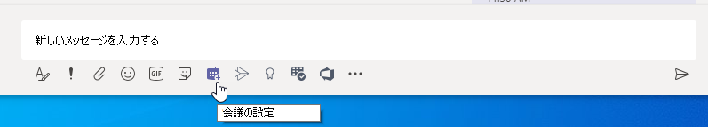
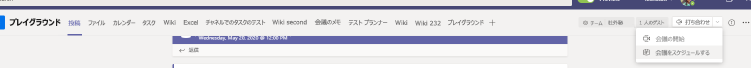

# Teams での会議ポリシーを管理するManage meeting policies in Teams

::: zone target="docs"
会議ポリシーは、組織内のユーザーによってスケジュールされた会議への参加者が利用できる機能を制御するために使用されます。Meeting policies are used to control the features that are available to meeting participants for meetings that are scheduled by users in your organization. 自動的に作成される、またはカスタムポリシーを作成して割り当てるグローバル (組織全体の既定) ポリシーを使用できます。You can use the global (Org-wide default) policy that's automatically created or create and assign custom policies. 会議ポリシーは、Microsoft Teams 管理センターで管理するか、[PowerShell](teams-powershell-overview.md) を使用して管理します。You manage meeting policies in the Microsoft Teams admin center or by using [PowerShell](teams-powershell-overview.md).

> [!NOTE]
> ロールを使用して、会議の発表者と出席者の権限を管理する方法については、「 [Teams 会議のロール](https://support.microsoft.com/office/roles-in-a-teams-meeting-c16fa7d0-1666-4dde-8686-0a0bfe16e019?ui=en-us&rs=en-us&ad=us)」を参照してください。For information about using roles to manage the permissions of meeting presenters and attendees, see [Roles in a Teams meeting](https://support.microsoft.com/office/roles-in-a-teams-meeting-c16fa7d0-1666-4dde-8686-0a0bfe16e019?ui=en-us&rs=en-us&ad=us).

次の方法でポリシーを実装できます。これらの方法は、会議の開始前、会議中、または会議後のユーザーの会議エクスペリエンスに影響します。You can implement policies in the following ways, which affect the meeting experience for users before a meeting starts, during a meeting, or after a meeting.

|実装の種類Implementation type  |説明Description  |
|---------|---------|
|開催者単位Per-organizer    |開催者単位のポリシーを実装すると、すべての参加者は開催者のポリシーを継承します。When you implement a per-organizer policy, all meeting participants inherit the policy of the organizer. たとえば、[**ユーザーの参加を自動的に許可する**] は、開催者単位のポリシーであり、ユーザーが会議に直接参加するか、ポリシーが割り当てられたユーザーがスケジュールした会議をロビーで待機するかを制御します。For example, **Automatically admit people** is a per-organizer policy and controls whether users join the meeting directly or wait in the lobby for meetings scheduled by the user who is assigned the policy.          |
|ユーザーごとPer-user    |ユーザーごとのポリシーを実装すると、ユーザーごとのポリシーのみが適用され、開催者や会議参加者に対する特定の機能が制限されます。When you implement a per-user policy, only the per-user policy applies to restrict certain features for the organizer and/or meeting participants. たとえば、[**チャネルで "今すぐ会議" を許可する**] は、ユーザー単位のポリシーです。For example, **Allow Meet now in channels** is a per-user policy.     |
|開催者単位およびユーザーごとPer-organizer and per-user     |開催者単位とユーザー単位のポリシーを組み合わせて実装すると、会議の参加者はユーザーのポリシーと開催者のポリシーに基づいて特定の機能が制限されます。When you implement a combination of a per-organizer and per-user policy, certain features are restricted for meeting participants based on their policy and the organizer's policy. たとえば、[**クラウド記録を許可する**] は、開催者単位およびユーザーごとのポリシーです。For example, **Allow cloud recording** is a per-organizer and per-user policy. この設定をオンにすると、会議の開催者と参加者は記録の開始と停止が可能になります。Turn on this setting to allow the meeting organizer and participants to start and stop a recording.

グローバルポリシーの設定を編集するか、または1つまたは複数のカスタムポリシーを作成して割り当てることができます。You can edit the settings in the global policy or create and assign one or more custom policies. カスタムポリシーを作成して割り当てる場合を除き、ユーザーはグローバルポリシーを取得します。Users will get the global policy unless you create and assign a custom policy.

> [!NOTE]
> [会議の詳細] ボタンは、ユーザーが電話会議ライセンスを有効にしているか、ユーザーが電話会議を許可している場合に使用できます。それ以外の場合は、会議の詳細は使用できません。Meeting details button will be available if a user has the audio conference licenses enabled or the user is allow for audio conferencing, if not, the meeting details will not be available.

## ユーザー設定の会議ポリシーを作成するCreate a custom meeting policy

1. Microsoft Teams 管理センターの左側のナビゲーションで、[**会議**]  >  [**会議ポリシー**] の順に移動します。In the left navigation of the Microsoft Teams admin center, go to **Meetings** > **Meeting policies**.
2. **[追加]** をクリックします。Click **Add**.
3. ポリシーの名前と説明を入力します。Enter a name and description for the policy. 名前に特殊文字を含めたり、64 文字より長くしたりすることはできません。The name can't contain special characters or be longer than 64 characters.
4. 目的の設定を選びます。Choose the settings that you want.
5. [**保存**] をクリックします。Click **Save**.

たとえば、多数のユーザーがいて、会議に必要な帯域幅を制限するとします。For example, say you have a bunch of users and you want to limit the amount of bandwidth that their meeting would require. 「制限された帯域幅」という名前の新しいカスタム ポリシーを作成し、次の設定を無効にできます。You would create a new custom policy named "Limited bandwidth" and disable the following settings:

[**オーディオとビデオ**] で、Under **Audio & video**:

- [クラウド記録を許可する] を無効にします。Turn off Allow cloud recording.
- [IP のビデオを許可する] を無効にします。Turn off Allow IP video.

[**コンテンツの共有**] で、Under **Content sharing**:

- 画面共有モードを無効にします。Disable screen sharing mode.
- [ホワイトボードを許可] を無効にします。Turn off Allow whiteboard.
- [メモの共有を許可する] を無効にします。Turn off Allow shared notes.

その後、ポリシーをユーザーに割り当てます。Then assign the policy to the users.

## 会議ポリシーを編集するEdit a meeting policy

グローバルポリシーと、作成したカスタムポリシーを編集できます。You can edit the global policy and any custom policies that you create.

1. Microsoft Teams 管理センターの左側のナビゲーションで、[**会議**]  >  [**会議ポリシー**] の順に移動します。In the left navigation of the Microsoft Teams admin center, go to **Meetings** > **Meeting policies**.
2. ポリシー名の左側をクリックしてポリシーを選び、**[編集]** をクリックします。Select the policy by clicking to the left of the policy name, and then click **Edit**.
3. ここで、必要な変更を行います。From here, make the changes that you want.
4. [**保存**] をクリックします。Click **Save**.

> [!NOTE]
> ユーザーに割り当てることができる会議ポリシーは一度に 1 つのみです。A user can be assigned only one meeting policy at a time.

## ユーザーに会議ポリシーを割り当てるAssign a meeting policy to users

[!INCLUDE [assign-policy](includes/assign-policy.md)]

> [!NOTE]
> ユーザーが割り当てられているポリシーは削除できません。You can't delete a policy if users are assigned to it. 影響を受けるすべてのユーザーにまず異なるポリシーを割り当ててから、元のポリシーを削除できます。You must first assign a different policy to all affected users, and then you can delete the original policy.

## 会議ポリシーの設定Meeting policy settings

[**会議ポリシー**] ページで既存のポリシーを選択するか、新しいポリシーを追加するための [**追加**] を選択すると、次の設定内容を構成できます。When you select an existing policy on the **Meeting policies** page or select **Add** to add a new policy, you can configure settings for the following.

- [全般General](#meeting-policy-settings---general)
- [オーディオとビデオAudio & video](#meeting-policy-settings---audio--video)
- [コンテンツの共有Content sharing](#meeting-policy-settings---content-sharing)
- [参加者とゲストParticipants & guests](#meeting-policy-settings---participants--guests)

::: zone-end

## 会議ポリシーの設定 - 全般Meeting policy settings - General

- [チャネルで "今すぐ会議" を許可するAllow Meet now in channels](#allow-meet-now-in-channels)
- [Outlook アドインを許可するAllow the Outlook add-in](#allow-the-outlook-add-in)
- [チャネルの会議スケジュールを許可するAllow channel meeting scheduling](#allow-channel-meeting-scheduling)
- [プライベート会議のスケジュールを許可するAllow scheduling private meetings](#allow-scheduling-private-meetings)
- [プライベート会議で "今すぐ会議" を許可するAllow Meet now in private meetings](#allow-meet-now-in-private-meetings)

### チャネルで "今すぐ会議" を許可するAllow Meet now in channels

これはユーザーごとのポリシーであり、会議が始まる前に適用されます。This is a per-user policy and applies before a meeting starts. この設定は、ユーザーが Teams チャネルでアドホック会議を開始できるかどうかを制御します。This setting controls whether a user can start an ad hoc meeting in a Teams channel. このオプションをオンにすると、ユーザーは [ **会議** ] ボタンをクリックして臨時の会議を開始したり、チャネルで会議のスケジュールを設定したりできます。If you turn this on, users can click the **Meet** button to start an ad hoc meeting or schedule a meeting in the channel. 既定値は True です。The default value is True.

[ の下に [今すぐ会議] アイコンが表示されたスクリーンショット](media/meeting-policies-meet-now.png#lightbox)

### Outlook アドインを許可するAllow the Outlook add-in

これはユーザーごとのポリシーであり、会議が始まる前に適用されます。This is a per-user policy and applies before a meeting starts. この設定は、Outlook (Windows、Mac、Web、およびモバイル) 内から Teams 会議をスケジュールできるかどうかを制御します。This setting controls whether Teams meetings can be scheduled from within Outlook (Windows, Mac, web, and mobile).

これをオフにすると、ユーザーは Outlook で新しい会議を作成するときに Teams 会議をスケジュールできなくなります。If you turn this off, users are unable to schedule Teams meetings when they create a new meeting in Outlook. たとえば、Windows 上の Outlook では、[**新しい Teams 会議**] オプションはリボンに表示されません。For example, in Outlook on Windows, the **New Teams Meeting** option won't show up in the ribbon.

### チャネルの会議スケジュールを許可するAllow channel meeting scheduling

既存の Allowchannel会議スケジュールポリシーを使用して、チームチャネルの予定表で作成できるイベントの種類を制御します。Use the existing AllowChannelMeetingScheduling policy to control the types of events that can be created on the team channel calendars. これはユーザーごとのポリシーであり、会議が始まる前に適用されます。This is a per-user policy and applies before a meeting starts. この設定は、ユーザーが Teams チャネルで会議をスケジュールできるかどうかを制御します。This setting controls whether users can schedule a meeting in a Teams channel. 既定では、この設定はオンになっています。By default, this setting is turned on. 

このポリシーが無効になっている場合、ユーザーは新しいチャネル会議を作成できません。If this policy is turned off, users will not be able to create new channel meetings. ただし、既存のチャネル会議は、イベントの開催者によって編集できます。However, existing channel meetings can be edited by the organizer of the event.

会議のスケジュールが無効になります。Schedule a meeting will be disabled.

![Teams の [会議の予約] オプションが表示されたスクリーンショット](media/schedule-meeting-option.png)

チャネルの選択が無効になっています。Channel selection is disabled.

[![会議をスケジュールするチャネルを選択するための [予定表] オプションを示すスクリーンショット。 ](media/meeting-policies-select-a-channel-to-meet-in.png)](media/meeting-policies-select-a-channel-to-meet-in.png#lightbox)

[チャネルの投稿] ページでは、次の機能が無効になります。In the channel posts page, the following will be disabled:

- [チャネル返信の作成] ボックスの [**会議の予約**] ボタン。**Schedule a meeting** button on the channel reply compose box.
  ![会議をスケジュールするチャネルを選択するための [予定表] オプションを示すスクリーンショット。](media/schedule-meeting-disabled-in-chat2.png)
  
- チャネルヘッダーの [**会議の予約**] ボタン。**Schedule a meeting** button on the channel header.
  ![会議をスケジュールするチャネルを選択するための [予定表] オプションを示すスクリーンショット。](media/schedule-now-in-header.png)

チャネルの予定表で、次の操作を行います。In the channel calendar:

- チャネル予定表ヘッダーの [**新しいイベントの追加**] ボタンは無効になります。**Add new event** button on channel calendar header will be disabled.
  ![会議をスケジュールするチャネルを選択するための [予定表] オプションを示すスクリーンショット。](media/add-new-event-disabled.png)

- チャネルの会議を作成するために、ユーザーはチャネルの予定表の時間ブロックをドラッグして選択することはできません。Users will not be able to drag and select a time block on the channel calendar to create a channel meeting.

- ユーザーはキーボードショートカットを使用して、チャネル予定表で会議を作成することはできません。Users cannot use Keyboard shortcuts to create a meeting on the channel calendar.

管理センターでは、次の操作を行います。In the Admin Center:

[管理者] パネルの [ **Microsoft アプリ** ] セクションに、アクセス許可ポリシーが表示されます。The channel calendar app will show up under the **Microsoft apps** section in the admin panel for permission policies.

### プライベート会議のスケジュールを許可するAllow scheduling private meetings

これはユーザーごとのポリシーであり、会議が始まる前に適用されます。This is a per-user policy and applies before a meeting starts. この設定は、ユーザーが Teams でプライベート会議をスケジュールできるかどうかを制御します。This setting controls whether users can schedule private meetings in Teams. チームのチャネルに公開されていない会議はプライベートです。A meeting is private when it's not published to a channel in a team.

[**プライベート会議のスケジュールを許可する**] および [**チャネルの会議スケジュールを許可する**] を無効にすると、Teams のユーザーに対して [**必須出席者の追加**] および [**チャネルの追加**] オプションが無効になります。Note that if you turn off **Allow scheduling private meetings** and **Allow channel meeting scheduling**,  the **Add required attendees** and **Add channel** options are disabled for users in Teams. 既定では、この設定はオンになっています。By default, this setting is turned on.

### プライベート会議で "今すぐ会議" を許可するAllow Meet now in private meetings

これはユーザーごとのポリシーであり、会議が始まる前に適用されます。This is a per-user policy and applies before a meeting starts. この設定は、ユーザーがアドホック プライベート会議を開始できるかどうかを制御します。This setting controls whether a user can start an ad hoc private meeting.  既定では、この設定はオンになっています。By default, this setting is turned on.

## 会議ポリシーの設定 - オーディオとビデオMeeting policy settings - Audio & video

- [文字起こしを許可するAllow transcription](#allow-transcription)
- [クラウド記録を許可するAllow cloud recording](#allow-cloud-recording)
- [IP オーディオ用モードMode for IP audio](#mode-for-ip-audio) 
- [IP ビデオのモードMode for IP video](#mode-for-ip-video) 
- [IP のビデオを許可するAllow IP video](#allow-ip-video)
- [メディアのビットレート (Kbs)Media bit rate (Kbs)](#media-bit-rate-kbs)

### 文字起こしを許可するAllow transcription

これは、開催者単位とユーザーごとのポリシーの組み合わせです。This is a combination of a per-organizer and per-user policy. この設定は、会議の記録の再生中にキャプションと文字起こし機能を使用できるかどうかを制御します。This setting controls whether captions and transcription features are available during playback of meeting recordings. これをオフにすると、会議の記録の再生中に [**検索**] および [**CC**] オプションを使用できなくなります。If you turn this off, the **Search** and **CC** options won't be available during playback of a meeting recording. 記録を開始したユーザーは、記録に文字起こしも含まれるように、この設定を有効にする必要があります。The person who started the recording needs this setting turned on so that the recording also includes transcription.

記録された会議の文字起こしは、現在、Teams の言語が英語に設定されているユーザー、および会議で英語が話されている場合のユーザーに対してのみサポートされていることに注意してください。Note that transcription for recorded meetings is currently only supported for users who have the language in Teams set to English and when English is spoken in the meeting.

### クラウド記録を許可するAllow cloud recording

これは、開催者単位とユーザーごとのポリシーの組み合わせです。This is a combination of a per-organizer and per-user policy. この設定は、このユーザーの会議を記録できるかどうかを制御します。This setting controls whether this user's meetings can be recorded. 参加者のポリシー設定が有効になっており、同じ組織の認証済みユーザーである場合、会議の開催者または別の会議参加者が記録を開始できます。The recording can be started by the meeting organizer or by another meeting participant if the policy setting is turned on for the participant and if they're an authenticated user from the same organization.

フェデレーション ユーザーや匿名ユーザーなど、組織外のユーザーは記録を開始できません。People outside your organization, such as federated and anonymous users, can't start the recording. ゲスト ユーザーは記録を開始または停止できません。Guest users can't start or stop the recording.

次の例を見てみましょう。Let's look at the following example.

|ユーザーUser |会議ポリシーMeeting policy  |クラウド記録を許可するAllow cloud recording |
|---------|---------|---------|
|DanielaDaniela | グローバルGlobal   | オフOff |
|AmandaAmanda | Location1MeetingPolicyLocation1MeetingPolicy | オンOn|
|John (外部ユーザー)John (external user) | 該当なしNot applicable | 該当なしNot applicable|

Daniela が開催する会議は記録されず、ポリシー設定が有効になっている Amanda は Daniela が開催する会議を記録できません。Meetings organized by Daniela can't be recorded and Amanda, who has the policy setting enabled, can't record meetings organized by Daniela. Amanda が開催する会議は記録できますが、ポリシー設定が無効になっている Daniela と外部ユーザーである John は、Amanda が開催する会議を記録できません。Meetings organized by Amanda can be recorded, however,  Daniela, who has the policy setting disabled and John who is an external user, can't record meetings organized by Amanda.

クラウド会議の記録の詳細については、「[Teams のクラウド会議の記録](cloud-recording.md)」を参照してください。To learn more about cloud meeting recording, see [Teams cloud meeting recording](cloud-recording.md).

### IP オーディオ用モードMode for IP audio

これは、ユーザーごとのポリシーです。This is a per-user policy. この設定では、会議やグループ通話でオーディオを有効にするかどうかを制御します。This setting controls whether audio can be turned on in meetings and group calls. この設定の値を次に示します。Here are the values for this setting.

|値を設定するSetting value |動作Behavior  |
|---------|---------|
|**送信および受信音声有効****Outgoing and incoming audio enabled**    |会議では、送信および受信音声が許可されています。Outgoing and incoming audio is allowed in the meeting. これは、既定の設定です。This is the default setting. |
|**無効****Disabled**     |会議で送信および受信した音声がオフになります。Outgoing and incoming audio is turned off in the meeting.     |

ユーザーに対して [ **無効** ] に設定した場合、ユーザーは会議をスケジュールして開催することはできますが、音声を使用することはできません。If set to **Disabled** for a user, that user can still schedule and organize meetings but they can't use audio. 会議に参加するには、公衆交換電話網 (PSTN) 経由でダイヤルインするか、電話で会議に参加する必要があります。To join a meeting, they have to dial in through the Public Switched Telephone Network (PSTN) or have the meeting call and join them by phone. (たとえば、匿名の参加者などの) ポリシーが割り当てられていない会議の参加者は、この設定を使用して、既定で **[送信および受信音声を有効** にする] に設定します。Meeting participants who don't have any policies assigned (for example, anonymous participants) have this set to **Outgoing and incoming audio enabled** by default. Teams モバイルクライアントでは、この設定を無効にすると、ユーザーは PSTN 経由で会議にダイヤルインする必要があります。On Teams mobile clients, if this setting is disabled, the user has to dial in to the meeting through the PSTN.

この設定は、1:1 の通話には適用されません。This setting doesn't apply to 1:1 calls. 1:1 通話を制限するには、チームの [通話ポリシー](teams-calling-policy.md) を構成し、[ **プライベート通話** にする] 設定をオフにします。To restrict 1:1 calls, configure a Teams [calling policy](teams-calling-policy.md) and turn off the **Make private calls** setting. この設定は、Surface Hub や Microsoft Teams 室デバイスなどの会議室デバイスにも適用されません。This setting also doesn't apply to conference room devices such as Surface Hub and Microsoft Teams Rooms devices.

詳細については、「 [会議の参加者の音声とビデオを管理](#manage-audiovideo-for-meeting-participants)する」を参照してください。To learn more, see [Manage audio/video for meeting participants](#manage-audiovideo-for-meeting-participants).

### IP ビデオのモードMode for IP video

これは、ユーザーごとのポリシーです。This is a per-user policy. この設定は、会議やグループ通話でビデオを有効にするかどうかを制御します。This setting controls whether video can be turned on in meetings and group calls. この設定の値を次に示します。Here are the values for this setting.

|値を設定するSetting value |動作Behavior  |
|---------|---------|
|**送信および受信ビデオを有効にする****Outgoing and incoming video enabled**    | 会議では、送信および受信ビデオが許可されています。Outgoing and incoming video is allowed in the meeting. これは、既定の設定です。This is the default setting. |
|**無効****Disabled**     | 会議で送信ビデオと着信ビデオがオフになっています。Outgoing and incoming video is turned off in the meeting. Teams モバイルクライアントでは、ユーザーは会議でビデオまたは写真を共有することはできません。On Teams mobile clients, users can't share videos or photos in the meeting.   **Ip audio のモード**が無効になっている場合は、 **Ip ビデオのモード**も無効のままであることに注意してください。Note that if **Mode for IP audio** is disabled, then **Mode for IP video** will also remain disabled.  |

ユーザーに対して [ **無効** ] に設定した場合、ユーザーはビデオをオンにすることも、他の会議参加者が共有したビデオを表示することもできません。If set to **Disabled** for a  user, that user can't turn on video or view videos shared by other meeting participants. (たとえば、匿名の参加者などの) ポリシーが割り当てられていない会議の参加者は、この設定を **[送信および受信ビデオ** を既定で有効にする] に設定します。Meeting participants who don't have any policies assigned (for example, anonymous participants) have this set to **Outgoing and incoming video enabled** by default.

この設定は、Surface Hub や Microsoft Teams room デバイスなどの会議室デバイスには適用されません。This setting doesn't apply to conference room devices such as Surface Hub and Microsoft Teams Rooms devices.

> [!NOTE]
> この設定では送信ビデオと着信ビデオの両方が制御されるため、[ **IP ビデオの許可** ] 設定では送信ビデオが制御されます。Keep in mind that this setting controls both outgoing and incoming video whereas the **Allow IP video** setting controls outgoing video. 詳細については、「 [どの IP ビデオポリシー設定が優先](#which-ip-video-policy-setting-takes-precedence) されますか」を参照してください。 [会議の参加者の音声/ビデオを管理](#manage-audiovideo-for-meeting-participants)します。To learn more, see [Which IP video policy setting takes precedence?](#which-ip-video-policy-setting-takes-precedence) and [Manage audio/video for meeting participants](#manage-audiovideo-for-meeting-participants).

### IP ビデオを許可するAllow IP video

これは、開催者単位とユーザーごとのポリシーの組み合わせです。This is a combination of a per-organizer and per-user policy. ビデオは、会議の重要な構成要素です。Video is a key component to meetings. 一部の組織では、管理者がビデオを使用するユーザーの会議をさらに制御する必要がある場合があります。In some organizations, admins might want more control over which users' meetings have video. この設定では、ユーザーによってホストされている会議でビデオをオンにするかどうかを制御し、ユーザーによって開始された1:1 およびグループの通話にすることができます。This setting controls whether video can be turned on in meetings hosted by a user and in 1:1 and group calls started by a user. Teams モバイルクライアントでは、この設定により、ユーザーが会議で写真やビデオを共有できるかどうかが制御されます。On Teams mobile clients, this setting controls whether users can share photos and videos in a meeting. 

このポリシー設定が有効になっているユーザーによって開催された会議は、参加者がポリシー設定を有効にしている場合は、会議参加者の会議でのビデオ共有を許可します。Meetings organized by a user who has this policy setting enabled, allow video sharing in the meeting by the meeting participants, if the participants also have the policy setting enabled. ポリシーが割り当てられていない会議参加者 (匿名参加者やフェデレーション参加者など) は、会議開催者のポリシーを継承します。Meeting participants who don't have any policies assigned (for example, anonymous and federated participants) inherit the policy of the meeting organizer.

> [!NOTE]
> この設定では送信ビデオが制御されるのに対し、[ **IP ビデオのモード** ] 設定では送信ビデオと着信ビデオの両方が制御されることに注意してください。Keep in mind that this setting controls outgoing video whereas the **Mode for IP video** setting controls both outgoing and incoming video. 詳細については、「 [どの IP ビデオポリシー設定が優先](#which-ip-video-policy-setting-takes-precedence) されますか」を参照してください。 [会議の参加者の音声/ビデオを管理](#manage-audiovideo-for-meeting-participants)します。To learn more, see [Which IP video policy setting takes precedence?](#which-ip-video-policy-setting-takes-precedence) and [Manage audio/video for meeting participants](#manage-audiovideo-for-meeting-participants).

| Teams のデスクトップと web クライアントTeams desktop and web client |Teams モバイルクライアントTeams mobile client  |
|:-------:|:-------:|
|    |          |

次の例を見てみましょう。Let's look at the following example.

|ユーザーUser |会議ポリシーMeeting policy  |IP ビデオを許可するAllow IP video |
|---------|---------|---------|
|DanielaDaniela   | グローバルGlobal   | オンOn       |
|AmandaAmanda    | Location1MeetingPolicyLocation1MeetingPolicy        | オフOff      |

Daniela が開催する会議では、ビデオを有効にすることができます。Meetings hosted by Daniela allow video to be turned on. Daniela は会議に参加してビデオを有効にすることができます。Daniela can join the meeting and turn on video. Amanda のポリシーが [ビデオを許可しない] に設定されているため、Amanda は Daniela の会議でビデオを有効にできません。Amanda can't turn on video in Daniela's meeting because Amanda's policy is set to not allow video. Amanda は、会議の他の参加者が共有しているビデオを見ることができます。Amanda can see videos shared by other participants in the meeting.

Amanda が主催する会議では、割り当てられたビデオ ポリシーに関係なく、誰もビデオを有効にできません。In meetings hosted by Amanda, no one can turn on video, regardless of the video policy assigned to them. これは、Daniela Amanda の会議でビデオを有効にできないことを意味します。This means Daniela can't turn on video in Amanda's meetings.  

Daniela がビデオを有効にして Amanda に電話した場合、Amanda はオーディオのみで電話に出ることができます。If Daniela calls Amanda with video on, Amanda can answer the call with audio only.  通話が接続されている場合、Amanda は Daniela のビデオを見ることはできますが、ビデオを有効にすることはできません。When the call is connected, Amanda can see Daniela's video, but can't turn on video. Amanda が Daniela に電話すると、Daniela はビデオとオーディオで電話に出ることができます。If Amanda calls Daniela, Daniela can answer the call with video and audio. 通話が接続されると、Daniela は必要に応じてビデオを有効または無効にできます。When the call is connected, Daniela can turn on or turn off her video, as needed.

#### どの IP ビデオポリシー設定が優先されますか?Which IP video policy setting takes precedence?

ユーザーの場合は、ビデオの最も制限の厳しいポリシー設定が優先されます。For a user, the most restrictive policy setting for video takes precedence. いくつかの例を次に示します。Here's some examples.

|IP ビデオを許可するAllow IP video|IP ビデオのモードMode for IP video|会議エクスペリエンスMeeting experience|
|---------|---------|---------|
|開催者: **オン**Organizer: **On**  参加者: **オン**Participant: **On** |参加者: **無効**Participant: **Disabled**        |[ **IP ビデオのモード] の** 設定が優先されます。The **Mode for IP video** setting takes precedence. このポリシーが割り当てられた参加者は、他のユーザーと共有しているビデオを有効または非表示にすることはできません。The participant who is assigned this policy can't turn on or view videos shared by others.|
|開催者: **オン**Organizer: **On**  参加者: **オン**Participant: **On** |参加者:**送信および受信ビデオを有効に**するParticipant: **Outgoing and incoming video enabled**          |このポリシーが割り当てられた参加者は、他のユーザーと共有しているビデオを有効または非表示にすることができます。The participant who is assigned this policy can turn on or view videos shared by others.         |
|開催者: **オン**Organizer: **On**  参加者: **オフ**Participant: **Off** |参加者:**送信および受信ビデオを有効に**するParticipant: **Outgoing and incoming video enabled**         |[ **IP の使用を許可する] ビデオ** 設定が優先されます。The **Allow IP video** setting takes precedence. 参加者は受信ビデオのみを表示でき、発信ビデオを送信することはできません。Participants can only see incoming video and can't send outgoing video.         |
|開催者: **オン**Organizer: **On**  参加者: **オフ**Participant: **Off** |参加者: **無効**Participant: **Disabled**         |[ **IP ビデオのモード] の** 設定が優先されます。The **Mode for IP video** setting takes precedence. 参加者が着信または発信のビデオを見ることはできません。The participant can't see incoming or outgoing video.|
|開催者: **オフ**Organizer: **Off**    |       |[ **IP を許可する] ビデオ** 設定は、開催者に対して無効になっているため優先されます。The **Allow IP video** setting takes precedence because it's turned off for the organizer. このポリシーが割り当てられているユーザーによって開催された会議では、ビデオをオンにすることはできません。No one can turn on video in meetings organized by the user who is assigned this policy.         |

### 会議参加者の音声/ビデオを管理するManage audio/video for meeting participants

|必要な場合If you want to...  |次のポリシー設定を設定するSet the following policy settings  |
|---------|---------|
|会議の参加者に対して音声とビデオを無効にするDisable audio and video for participants in meetings  |IP audio 用モード: **Disabled**Mode for IP audio: **Disabled**  IP ビデオ用モード: **無効**Mode for IP video: **Disabled** IP ビデオを許可する: 該当なしAllow IP video: N/A       |
|会議の参加者に対して受信したビデオと音声のみを有効にするEnable only incoming video and audio for participants in meetings  |IP オーディオ用モード: **送信および受信音声が有効**Mode for IP audio: **Outgoing and incoming audio enabled**  IP ビデオのモード: **送信および受信ビデオが有効**Mode for IP video: **Outgoing and incoming video enabled** IP ビデオの許可: **オフ**Allow IP video: **Off**       |
|会議の参加者にビデオを無効にする (参加者は音声のみ)Disable video for participants in meetings (participants have audio only)|  [IP audio のモード]: **送信および受信音声を有効にする**Mode for IP audio: **Enable outgoing and incoming audio**  IP ビデオ用モード: **無効**Mode for IP video: **Disabled** IP ビデオを許可する: 該当なしAllow IP video: N/A        
|会議の参加者に対してオーディオとビデオを有効にするEnable audio and video for participants in meetings    |IP audio のモード: **送信および受信音声が有効** (既定)Mode for IP audio: **Outgoing and incoming audio enabled** (default)  IP ビデオのモード: **送信および受信ビデオ有効** (既定)Mode for IP video: **Outgoing and incoming video enabled** (default) IP ビデオの許可: **オン** (既定)Allow IP video: **On** (default)    |

会議の開催者のポリシーとユーザーのポリシー間で最も制限の厳しいポリシーが適用されます。The most restrictive policy between the meeting organizer’s policy and the user’s policy applies. たとえば、開催者がビデオを制限するポリシーを持っているが、ユーザーのポリシーによってビデオが制限されていない場合、会議参加者は会議の開催者のポリシーを継承し、会議のビデオにはアクセスできません。For example, if an organizer has a policy that restricts video and a user’s policy doesn't restrict video, meeting participants inherit the policy of the meeting organizer and don't have access to video in meetings. これは、ユーザーが音声のみで会議に参加できることを意味します。This means that they can join the meeting with audio only.

> [!NOTE]
> 電話で参加するためにユーザーがグループ通話を開始すると、[ **電話で電話を使う** ] 画面が表示されません。When a user starts a group call to join by phone, the **Use phone for audio** screen doesn't appear. これは既知の問題であり、解決に向けて取り組んでいます。This is a known issue that we're working to resolve. この問題を回避するには、[**その他の参加オプション**] で [**電話**] を選択します。To work around this issue, select **Phone audio** under **Other join options**.  

#### Teams モバイルクライアントTeams mobile clients

Teams モバイルクライアントのユーザーは、会議中に写真やビデオを共有できるかどうかは、[ **ip ビデオ** または **ip ビデオモード** の許可] の設定によって決まります。For users on Teams mobile clients, the ability to share photos and videos during a meeting is also determined by the **Allow IP video** or **IP video mode** setting. どのポリシー設定が優先されるかに応じて、ビデオと写真を共有する機能は利用できません。Depending on which policy setting takes precedence, the ability to share videos and photos won't be available. これは、別の [画面共有モード](#screen-sharing-mode) の設定を使って構成した画面共有には影響しません。This doesn't affect screen sharing, which you configure using a separate [Screen sharing mode](#screen-sharing-mode) setting. さらに、モバイルユーザーが携帯電話接続経由で IP ビデオを使用できないようにするために、 [チームの機動性のポリシー](https://docs.microsoft.com/powershell/module/skype/new-csteamsmobilitypolicy) を設定することができます。つまり、WiFi 接続を使用する必要があります。Additionally, you can set a [Teams mobility policy](https://docs.microsoft.com/powershell/module/skype/new-csteamsmobilitypolicy) to prevent mobile users from using IP video over a cellular connection, which means they must use a WiFi connection.

### メディアのビットレート (Kbs)Media bit rate (Kbs)

これは、ユーザーごとのポリシーです。This is a per-user policy. この設定により、ユーザーの通話および会議でのオーディオ、ビデオ、およびビデオベースのアプリ共有送信のメディア ビット レートが決まります。This setting determines the media bit rate for audio, video, and video-based app sharing transmissions in calls and meetings for the user. 通話または会議のユーザーのアップリンクとダウンリンクの両方のメディア トラバーサルに適用されます。It's applied to both the uplink and downlink media traversal for users in the call or meeting. この設定により、組織の帯域幅の管理をきめ細やかに制御できます。This setting gives you granular control over managing bandwidth in your organization. ユーザーが必要とする会議シナリオに応じて、高品質のエクスペリエンスを得るために十分な帯域幅を用意することをお勧めします。Depending on the meetings scenarios required by users, we recommend having enough bandwidth in place for a good quality experience. 最小値は 30 Kbps で、最大値は会議シナリオによって異なります。The minimum value is 30 Kbps and the maximum value depends on the meeting scenario. Teams での高品質の会議、通話、およびライブ イベントを実現する最小推奨帯域幅の詳細については、「[帯域幅要件](prepare-network.md#bandwidth-requirements)」を参照してください。To learn more about the minimum recommended bandwidth for good quality meetings, calls, and live events in Teams, see [Bandwidth requirements](prepare-network.md#bandwidth-requirements).

会議に十分な帯域幅がない場合、参加者には、ネットワークの品質低下を示すメッセージが表示されます。If there isn't enough bandwidth for a meeting, participants see a message that indicates poor network quality.

最高品質のビデオエクスペリエンス (CEO ボード会議や Teams live イベントなど) が必要な会議の場合は、帯域幅を 10 Mbps に設定することをお勧めします。For meetings that need the highest-quality video experience, such as CEO board meetings and Teams live events, we recommend you set the bandwidth to 10 Mbps. 最大のエクスペリエンスが設定されている場合でも、シナリオによっては、特定のネットワーク条件が検出されると、チームメディアスタックが低帯域幅の条件に合わせて調整されます。Even when the maximum experience is set, the Teams media stack adapts to low-bandwidth conditions when certain network conditions are detected, depending on the scenario.

## 会議ポリシーの設定 - コンテンツの共有Meeting policy settings - Content sharing

- [画面共有モードScreen sharing mode](#screen-sharing-mode)
- [参加者に制御を渡す、または制御を要求するAllow a participant to give or request control](#allow-a-participant-to-give-or-request-control)
- [外部の参加者に制御を渡す、または制御を要求するAllow an external participant to give or request control](#allow-an-external-participant-to-give-or-request-control)
- [PowerPoint の共有を許可するAllow PowerPoint sharing](#allow-powerpoint-sharing)
- [ホワイトボードを許可するAllow whiteboard](#allow-whiteboard)
- [メモの共有を許可するAllow shared notes](#allow-shared-notes)

### 画面共有モードScreen sharing mode

これは、開催者単位とユーザーごとのポリシーの組み合わせです。This is a combination of a per-organizer and per-user policy. この設定は、ユーザーの会議でデスクトップやウィンドウの共有を許可するかどうかを制御します。This setting controls whether desktop and/or window sharing is allowed in the user's meeting. ポリシーが割り当てられていない会議参加者 (匿名参加者、ゲスト参加者、B2B 参加者、フェデレーション参加者など) は、会議開催者のポリシーを継承します。Meeting participants who don't have any policies assigned (for example, anonymous, guest, B2B, and federated participants) inherit the policy of the meeting organizer.

|値を設定するSetting value |動作Behavior  |
|---------|---------|
|**画面全体****Entire screen**    | 完全なデスクトップ共有とアプリケーション共有が会議で許可されているFull desktop sharing and application sharing are allowed in the meeting |
|**単一アプリケーション****Single application**   | 会議ではアプリケーションの共有が許可されますApplication sharing is allowed in the meeting        |
|**無効****Disabled**     |会議では画面共有とアプリケーション共有が無効になります。Screen sharing and application sharing turned off in the meeting.       |

次の例を見てみましょう。Let's look at the following example.

|ユーザーUser |会議ポリシーMeeting policy |画面共有モードScreen sharing mode |
|---------|---------|---------|
|DanielaDaniela  | グローバルGlobal   | 画面全体Entire screen |
|AmandaAmanda   | Location1MeetingPolicyLocation1MeetingPolicy  | 無効Disabled |

Daniela が開催する会議では、会議の参加者が画面全体または特定のアプリケーションを共有できます。Meetings hosted by Daniela allow meeting participants to share their entire screen or a specific application. Amanda が Daniela の会議に参加している場合は、そのポリシー設定が無効になっているために、Amanda が自分の画面や特定のアプリケーションを共有することはできません。If Amanda joins Daniela's meeting, Amanda can't share her screen or a specific application as her policy setting is disabled. Amanda がホストする会議では、割り当てられた画面共有モード ポリシーに関係なく、誰も画面または単一のアプリケーションを共有できません。In meetings hosted by Amanda, no one is allowed to share their screen or a single application, regardless of the screen sharing mode policy assigned to them. これは、Daniela が Amanda の会議で、画面や単一のアプリケーションを共有できないことを意味します。This means that Daniela can't share her screen or a single application in Amanda's meetings.  

現在、ユーザーは Google Chrome を使用している場合、Teams 会議でビデオを再生したり画面を共有したりすることはできません。Currently, users can't play video or share their screen in a Teams meeting if they're using Google Chrome.

### 参加者に制御を渡す、または制御を要求するAllow a participant to give or request control

これは、ユーザーごとのポリシーです。This is a per-user policy. この設定は、ユーザーが他の会議参加者に共有デスクトップまたはウィンドウの制御を渡すことができるかどうかを制御します。This setting controls whether the user can give control of the shared desktop or window to other meeting participants. 制御を渡すには、画面の上部にカーソルを合わせます。To give control, hover over the top of the screen.

ユーザーに対してこの設定が有効になっている場合、共有セッションの上部のバーに [**制御を渡す**] オプションが表示されます。If this setting is turned on for the user, the **Give Control** option is displayed in the top bar in a sharing session.

![[制御を渡す] オプションが表示されたスクリーンショット](media/meeting-policies-give-control.png)

ユーザーの設定が無効になっている場合、[**制御を渡す**] オプションは使用できません。If the settings is turned off for the user, the **Give Control** option isn't available.

![[制御を渡す] オプションが利用できないことを示すスクリーンショット](media/meeting-policies-give-control-not-available.png)

次の例を見てみましょう。Let's look at the following example.

|ユーザーUser |会議ポリシーMeeting policy  |参加者に制御を渡す、または制御を要求するAllow participant to give or request control |
|---------|---------|---------|
|DanielaDaniela   | グローバルGlobal   | オンOn       |
|BabekBabek    | Location1MeetingPolicyLocation1MeetingPolicy        | オフOff   |

Daniela は、Babek が開催する会議の他の参加者に共有デスクトップまたはウィンドウの制御を渡すことができますが、Babek は他の参加者に制御を渡すことができません。Daniela can give control of the shared desktop or window to other participants in a meeting organized by Babek whereas Babek can't give control to other participants.

制御を渡したり、制御要求を受け入れたりすることができるユーザーを PowerShell を使用して制御するには、AllowParticipantGiveRequestControl コマンドレットを使用します。To use PowerShell to control who can give control or accept requests for control, use the AllowParticipantGiveRequestControl cmdlet.

> [!NOTE]
> 共有中に共有コンテンツの制御を渡したり受け取ったりするには、両者が Teams デスクトップ クライアントを使用している必要があります。To give and take control of shared content during sharing, both parties must be using the Teams desktop client. いずれかの当事者がブラウザーで Teams を実行している場合、制御はサポートされません。Control isn't supported when either party is running Teams in a browser. これは、修正する予定の技術的制限によるものです。This is due to a technical limitation that we're planning to fix.

### 外部の参加者に制御を渡す、または制御を要求するAllow an external participant to give or request control

これは、ユーザーごとのポリシーです。This is a per-user policy. 組織がユーザーに対してこのセットを持っているかどうかは、会議の開催者によって設定されているかどうかに関係なく、外部の参加者が実行できる操作を制御しません。Whether an organization has this set for a user doesn't control what external participants can do, regardless of what the meeting organizer has set. このパラメーターは、外部の参加者が、組織の会議のポリシーに設定されている内容に応じて、共有元の画面の制御を付与できるか、制御を要求するかを制御します。This parameter controls whether external participants can be given control or request control of the sharer's screen, depending on what the sharer has set within their organization's meeting policies. Teams 会議の外部参加者は、次のように分類できます。External participants in Teams meetings can be categorized as follows:  

- 匿名ユーザーAnonymous user
- ゲスト ユーザーGuest users  
- B2B ユーザーB2B user
- フェデレーション ユーザーFederated user  

フェデレーション ユーザーが共有中に外部ユーザーに制御を渡すことができるかどうかは、組織の「**外部の参加者に制御を渡す、または制御を要求する**」設定によって制御されます。Whether federated users can give control to external users while sharing is controlled by the **Allow an external participant to give or request control** setting in their organization.

PowerShell を使用して、外部の参加者が制御を渡すことができるか、または制御要求を受け入れることができるかを制御するには、AllowExternalParticipantGiveRequestControl コマンドレットを使用します。To use PowerShell to control whether external participants can give control or accept requests for control, use the AllowExternalParticipantGiveRequestControl cmdlet.

### PowerPoint の共有を許可するAllow PowerPoint sharing

これは、ユーザーごとのポリシーです。This is a per-user policy. この設定は、ユーザーが会議で PowerPoint スライド セットを共有できるかどうかを制御します。This setting controls whether the user can share PowerPoint slide decks in a meeting. 匿名ユーザー、ゲスト ユーザー、フェデレーション ユーザーを含む外部ユーザーは、会議開催者のポリシーを継承します。External users, including anonymous, guest, and federated users, inherit the policy of the meeting organizer.

次の例を見てみましょう。Let's look at the following example.

|ユーザーUser |会議ポリシーMeeting policy  |PowerPoint の共有を許可するAllow PowerPoint sharing |
|---------|---------|---------|
|DanielaDaniela   | グローバルGlobal   | オンOn       |
|AmandaAmanda   | Location1MeetingPolicyLocation1MeetingPolicy        | オフOff   |

Amanda は、会議の開催者であっても、PowerPoint スライド セットを会議で共有することはできません。Amanda can't share PowerPoint slide decks in meetings even if she's the meeting organizer. Daniela は、会議が Amanda によって開催されている場合でも、PowerPoint スライド セットを共有することができます。Daniela can share PowerPoint slide decks even if the meeting is organized by Amanda. Amanda は、PowerPoint スライド セットを共有できない場合でも、会議の他のユーザーによって共有されている PowerPoint スライド セットを表示することができます。Amanda can view the PowerPoint slide decks shared by others in the meeting, even though she can't share PowerPoint slide decks.

### ホワイトボードを許可するAllow whiteboard

これは、ユーザーごとのポリシーです。This is a per-user policy. この設定は、ユーザーが会議でホワイトボードを共有できるかどうかを制御します。This setting controls whether a user can share the whiteboard in a meeting. 匿名ユーザー、B2B ユーザー、およびフェデレーション ユーザーを含む外部ユーザーは、会議開催者のポリシーを継承します。External users, including anonymous, B2B, and federated users, inherit the policy of the meeting organizer.

次の例を見てみましょう。Let's look at the following example.

|ユーザーUser |会議ポリシーMeeting policy  |ホワイトボードを許可するAllow whiteboard|
|---------|---------|---------|
|DanielaDaniela   | グローバルGlobal   | オンOn       |
|AmandaAmanda   | Location1MeetingPolicyLocation1MeetingPolicy        | オフOff   |

Amanda は、会議の開催者であっても、会議でホワイトボードを共有することはできません。Amanda can't share the whiteboard in a meeting even if she's the meeting organizer. Daniela は、Amanda が会議を開催する場合でも、ホワイトボードを共有することができます。Daniela can share the whiteboard even if a meeting is organized by Amanda.  

### メモの共有を許可するAllow shared notes

これは、ユーザーごとのポリシーです。This is a per-user policy. この設定は、ユーザーが会議でメモを作成および共有できるかどうかを制御します。This setting controls whether a user can create and share notes in a meeting. 匿名ユーザー、B2B ユーザー、およびフェデレーション ユーザーを含む外部ユーザーは、会議開催者のポリシーを継承します。External users, including anonymous, B2B, and federated users, inherit the policy of the meeting organizer. 現在、[ **会議メモ** ] タブは、参加者が20人未満の会議でのみサポートされています。The **Meeting Notes** tab is currently only supported in meetings that have fewer than 20 participants.

次の例を見てみましょう。Let's look at the following example.

|ユーザーUser |会議ポリシーMeeting policy  |メモの共有を許可するAllow shared notes |
|---------|---------|---------|
|DanielaDaniela   | グローバルGlobal   | オンOn       |
|AmandaAmanda   | Location1MeetingPolicyLocation1MeetingPolicy | オフOff |

Daniela は Amanda の会議でメモを取ることができ、Amanda はすべての会議でメモを取ることができません。Daniela can take notes in Amanda's meetings and Amanda can't take notes in any meetings.

## 会議ポリシーの設定 - 参加者とゲストMeeting policy settings - Participants & guests

これらの設定では、会議への入室が許可されるまでロビーで待機する必要がある会議参加者およびそれらの参加者に許可する会議への参加レベルが制御されます。These settings control which meeting participants wait in the lobby before they are admitted to the meeting and the level of participation they are allowed in a meeting.

- [匿名ユーザーが会議を開始できるようにするLet anonymous people start a meeting](#let-anonymous-people-start-a-meeting)
- [ユーザーの参加を自動的に許可するAutomatically admit people](#automatically-admit-people)
- [ダイヤルイン ユーザーによるロビーのバイパスを許可するAllow dial-in users to bypass the lobby](#allow-dial-in-users-to-bypass-the-lobby)
- [ライブ キャプションを有効にするEnable live captions](#enable-live-captions)
- [会議でチャットを許可するAllow chat in meetings](#allow-chat-in-meetings)

> [!NOTE]
>会議に参加するためのオプションは、各 Teams グループの設定および接続方法によって異なります。Options to join a meeting will vary, depending on the settings for each Teams group, and the connection method. グループに電話会議があり、それを使用して接続する場合は、「 [電話会議](https://docs.microsoft.com/microsoftteams/audio-conferencing-in-office-365)」を参照してください。If your group has audio conferencing, and uses it to connect, see [Audio Conferencing](https://docs.microsoft.com/microsoftteams/audio-conferencing-in-office-365). Teams グループに電話会議がない場合は、「 [teams で会議に参加する」](https://support.office.com/article/join-a-meeting-in-teams-1613bb53-f3fa-431e-85a9-d6a91e3468c9)を参照してください。If your Teams group doesn't have audio conferencing, refer to [Join a meeting in Teams](https://support.office.com/article/join-a-meeting-in-teams-1613bb53-f3fa-431e-85a9-d6a91e3468c9).

### 匿名ユーザーが会議を開始できるようにするLet anonymous people start a meeting

これは、leaderless のダイヤルイン会議の会議に使用できる開催者ごとのポリシーです。This is a per-organizer policy that allows for leaderless dial-in conferencing meetings. この設定では、ダイヤルインユーザーが会議に参加できるかどうかを制御します。This setting controls whether dial-in users can join the meeting without an authenticated user from the organization in attendance. 既定では、この設定はオフになっています。これは、組織の認証されたユーザーが会議に参加するまで、ダイヤルインユーザーがロビーで待機することを意味します。By default, this setting is turned off which means dial-in users will wait in the lobby until an authenticated user from the organization joins the meeting.

> [!NOTE]
> この設定を無効にしている場合、ダイヤルインユーザーが最初に会議に参加してロビーに配置されると、組織のユーザーは、ユーザーをロビーから承認するためにチームクライアントと会議に参加する必要があります。If this setting is turned off and a dial-in user joins the meeting first and is placed in the lobby, an organization user must join the meeting with a Teams client to admit the user from the lobby. ユーザーのダイヤルに使用できるロビーコントロールはありません。There are no lobby controls available for dialed in users.

### ユーザーの参加を自動的に許可するAutomatically admit people

これは開催者単位のポリシーです。This is a per-organizer policy. この設定は、ユーザーが会議に直接参加するのか、認証ユーザーにより入室が許可されるまでロビーで待機するのかを制御します。This setting controls whether people join a meeting directly or wait in the lobby until they are admitted by an authenticated user. この設定はダイヤルインユーザーには適用されません。This setting does not apply to dial-in users.

 会議の開催者は、会議出席依頼の [**会議オプション**] をクリックして、スケジュールする会議ごとにこの設定を変更できます。Meeting organizers can click **Meeting Options** in the meeting invitation to change this setting for each meeting they schedule.

> [!NOTE]
> 会議オプションの設定には、"ロビーをバイパスできるユーザー" のラベルが表示されます。In the meeting options the setting is labeled "Who can bypass the lobby". 任意のユーザーの既定の設定を変更した場合、そのユーザーによって開催されたすべての新しい会議と、ユーザーが会議オプションを変更していない前の会議にも適用されます。If you change the default setting for any user, it will apply to all new meetings organized by that user and any prior meetings where the user didn't modify Meeting options.
  
|値を設定するSetting value  |参加動作Join behavior |
|---------|---------|
|**すべてのユーザー****Everyone**   |すべての会議参加者は、ロビーで待たずに会議に直接参加します。All meeting participants join the meeting directly without waiting in the lobby. 認証済みのユーザー、信頼された組織の外部ユーザー (フェデレーション)、ゲスト、匿名ユーザーなどが含まれます。This includes authenticated users, external users from trusted organizations (federated), guests, and anonymous users.     |
|**組織内およびフェデレーション組織のすべてのユーザー****Everyone in your organization and federated organizations**     |組織内で認証されたユーザー (ゲストユーザーや信頼できる組織のユーザーを含む) は、ロビーで待機することなく直接会議に参加します。Authenticated users within the organization, including guest users and the users from trusted organizations, join the meeting directly without waiting in the lobby.  匿名ユーザーがロビーで待機しています。Anonymous users wait in the lobby.   |
|**組織内のすべてのユーザー****Everyone in your organization**    |ゲスト ユーザーを含む組織内の認証ユーザーは、ロビーで待たずに会議に直接参加します。Authenticated users from within the organization, including guest users, join the meeting directly without waiting in the lobby.  信頼された組織および匿名ユーザーのユーザーは、ロビーで待機します。Users from trusted organizations and anonymous users wait in the lobby. これは、既定の設定です。This is the default setting.           |
|**開催者のみ****Organizer only**    |会議の開催者のみが、ロビーで待たずに会議に直接参加できます。Only meeting organizers can join the meeting directly without waiting in the lobby. 他のすべてのユーザー (組織内の認証済みユーザー、ゲストユーザー、信頼できる組織および匿名ユーザーのユーザーを含む) は、ロビーで待機する必要があります。Everyone else, including authenticated users within the organization, guest users, users from trusted organizations and anonymous users must wait in the lobby.           |

### ダイヤルイン ユーザーによるロビーのバイパスを許可するAllow dial-in users to bypass the lobby

これは開催者単位のポリシーです。This is a per-organizer policy. この設定では、スマートフォンでダイヤル インするユーザーが会議に直接参加するのか、[**ユーザーの参加を自動的に許可する**] の設定に関わらずロビーで待機するのかを制御します。This setting controls whether people who dial in by phone join the meeting directly or wait in the lobby regardless of the **Automatically admit people** setting. 既定では、この設定はオフになっています。By default, this setting is turned off. この設定をオフにすると、ダイヤルインユーザーは、組織のユーザーがチームクライアントと会議に参加し、それを承認するまで、ロビーで待機します。When this setting is turned off, dial-in users will wait in the lobby until a organization user joins the meeting with a Teams client and admits them. この設定をオンにすると、組織のユーザーが会議に参加したときに、ダイヤルインユーザーは自動的に会議に参加します。When this setting is turned on, dial-in users will automatically join the meeting when an organization user joins the meeting.

> [!NOTE]
> ダイヤルインユーザーが会議に参加する前に、組織のユーザーが会議に参加すると、組織のユーザーがチームクライアントを使って会議に参加し、その会議を許可するまで、そのユーザーはロビーに配置されます。If a dial-in user joins a meeting before an organization user joins the meeting, they will be placed in the lobby until an organization user joins the meeting using a Teams client and admits them. 任意のユーザーの既定の設定を変更した場合、そのユーザーによって開催されたすべての新しい会議と、ユーザーが会議オプションを変更していない前の会議にも適用されます。If you change the default setting for any user, it will apply to all new meetings organized by that user and any prior meetings where the user didn't modify Meeting options.

### ライブ キャプションを有効にするEnable live captions

これはユーザーごとのポリシーであり、会議中に適用されます。This is a per-user policy and applies during a meeting. この設定は、ユーザーが参加する会議でライブ キャプションを有効または無効にするために、[**ライブ キャプションを有効にする**] オプションを使用できるかどうかを制御します。This setting controls whether the **Turn on live captions** option is available for the user to turn on and turn off live captions in meetings that the user attends.  

![[ライブ キャプションを有効にする] オプションが表示されたスクリーンショット](media/meeting-policies-live-captions.png)

|値を設定するSetting value |動作Behavior  |
|---------|---------|
|**無効。ただし、ユーザーは上書きできます。****Disabled but the user can override**     | 会議中にユーザーのライブ キャプションが自動的に有効になることはありません。Live captions aren't automatically turned on for the user during a meeting. オーバーフロー (**...**) メニューに [**ライブ キャプションを有効にする**] オプションが表示され、それらを有効にします。The user sees the **Turn on live captions** option in the overflow (**...**) menu to turn them on. これは、既定の設定です。This is the default setting. |
|**無効****Disabled**     | 会議中、ユーザーのライブ キャプションが無効になります。Live captions are disabled for the user during a meeting. ユーザーには、それらを有効にするオプションはありません。The user doesn't have the option to turn them on.          |

### 会議でチャットを許可するAllow chat in meetings

これは、参加者ごとの設定です。This is a per-participant setting. この設定は、ユーザーの会議で会議チャットを許可するかどうかを制御します。This setting controls whether meeting chat is allowed in the user's meeting.

## 会議ポリシー設定-指定されたプレゼンターロールモードMeeting policy settings - Designated presenter role mode

これは、ユーザーごとのポリシーです。This is a per-user policy. この設定では、Teams クライアントの [**会議オプション**] の設定を変更する**こと**ができます。This setting lets you change the default value of the **Who can present?** setting in **Meeting options** in the Teams client. このポリシー設定は、[今すぐ会議] を含むすべての会議に影響します。This policy setting affects all meetings, including Meet Now meetings.

[ **発表者]** : 会議の開催者が会議で発表者になれるユーザーを選択できるように設定します。The **Who can present?** setting lets meeting organizers choose who can be presenters in a meeting. 詳細については、「teams 会議のチーム会議と[ロール](https://support.microsoft.com/article/roles-in-a-teams-meeting-c16fa7d0-1666-4dde-8686-0a0bfe16e019)[の参加者設定を変更](https://support.microsoft.com/article/change-participant-settings-for-a-teams-meeting-53261366-dbd5-45f9-aae9-a70e6354f88e)する」を参照してください。To learn more, see [Change participant settings for a Teams meeting](https://support.microsoft.com/article/change-participant-settings-for-a-teams-meeting-53261366-dbd5-45f9-aae9-a70e6354f88e) and [Roles in a Teams meeting](https://support.microsoft.com/article/roles-in-a-teams-meeting-c16fa7d0-1666-4dde-8686-0a0bfe16e019).

現時点では、このポリシー設定を構成するには PowerShell を使用する必要があります。Currently, you can only use PowerShell to configure this policy setting. [CsTeamsMeetingPolicy](https://docs.microsoft.com/powershell/module/skype/set-csteamsmeetingpolicy)コマンドレットを使用して、既存の Teams 会議ポリシーを編集できます。You can edit an existing Teams meeting policy by using the [Set-CsTeamsMeetingPolicy](https://docs.microsoft.com/powershell/module/skype/set-csteamsmeetingpolicy) cmdlet. または、 [CsTeamsMeetingPolicy](https://docs.microsoft.com/powershell/module/skype/new-csteamsmeetingpolicy) コマンドレットを使用して新しいチーム会議ポリシーを作成し、ユーザーに割り当てます。Or, create a new Teams meeting policy by using the [New-CsTeamsMeetingPolicy](https://docs.microsoft.com/powershell/module/skype/new-csteamsmeetingpolicy) cmdlet and assign it to users.

Teams で [ **表示できるユーザー]** の既定値を指定するには、 **Designatedpresenterrolemode** パラメーターを次のいずれかに設定します。To specify the default value of the **Who can present?** setting in Teams, set the **DesignatedPresenterRoleMode** parameter to one of the following:

- すべてのユーザーの**上書き**: すべての会議参加者を発表者にすることができます。**EveryoneUserOverride**:  All meeting participants can be presenters. これは既定の値です。This is the default value. このパラメーターは、Teams の [ **すべてのユーザー** ] 設定に対応します。This parameter corresponds to the **Everyone** setting in Teams.
- すべてのユーザーの**上書き**: ゲストユーザーを含む、組織内の認証済みユーザーは発表者になることができます。**EveryoneInCompanyUserOverride**: Authenticated users in the organization, including guest users, can be presenters. このパラメーターは、Teams の **[組織内のユーザー** ] 設定に対応します。This parameter corresponds to the **People in my organization** setting in Teams.
- 構成内容の**上書き**: 会議の開催者のみが発表者になり、すべての会議参加者が出席者として指定されます。**OrganizerOnlyUserOverride**: Only the meeting organizer can be a presenter and all meeting participants are designated as attendees. このパラメーターは、Teams の [ **自分のみ** ] の設定に対応しています。This parameter corresponds to the **Only me** setting in Teams.

既定値を設定した後でも、会議の開催者は Teams でこの設定を変更することができ、スケジュールした会議で発表できるユーザーを選択することに注意してください。Keep in mind that after you set the default value, meeting organizers can still change this setting in Teams and choose who can present in the meetings that they schedule.

## 会議のポリシー設定-会議出席依頼のレポートMeeting policy settings - Meeting attendance report

これは、ユーザーごとのポリシーです。This is a per-user policy. この設定は、会議の開催者が [会議出席の参加者レポート](teams-analytics-and-reports/meeting-attendance-report.md)をダウンロードできるかどうかを制御します。This setting controls whether meeting organizers can download the [meeting attendance report](teams-analytics-and-reports/meeting-attendance-report.md).

現時点では、このポリシー設定を構成するには PowerShell を使用する必要があります。Currently, you can only use PowerShell to configure this policy setting. [CsTeamsMeetingPolicy](https://docs.microsoft.com/powershell/module/skype/set-csteamsmeetingpolicy)コマンドレットを使用して、既存の Teams 会議ポリシーを編集できます。You can edit an existing Teams meeting policy by using the [Set-CsTeamsMeetingPolicy](https://docs.microsoft.com/powershell/module/skype/set-csteamsmeetingpolicy) cmdlet. または、 [CsTeamsMeetingPolicy](https://docs.microsoft.com/powershell/module/skype/new-csteamsmeetingpolicy) コマンドレットを使用して新しいチーム会議ポリシーを作成し、ユーザーに割り当てます。Or, create a new Teams meeting policy by using the [New-CsTeamsMeetingPolicy](https://docs.microsoft.com/powershell/module/skype/new-csteamsmeetingpolicy) cmdlet and assign it to users.

会議の開催者が会議の出席レポートをダウンロードできるようにするには、 **AllowEngagementReport** パラメーターを [ **有効**] に設定します。To enable a meeting organizer to download the meeting attendance report, set the **AllowEngagementReport** parameter  to **Enabled**. 有効にした場合、レポートをダウンロードするオプションが [ **参加者** ] ウィンドウに表示されます。When enabled, the option to download the report is displayed in the **Participants** pane.

会議の開催者がレポートをダウンロードできないようにするには、パラメーターを [ **無効**] に設定します。To prevent a meeting organizer from downloading the report, set the parameter to **Disabled**. 既定では、この設定は無効であり、レポートをダウンロードするためのオプションは使用できません。By default, this setting is disabled and the option to download the report isn't available.

## 会議ポリシーの設定-諸島モードの会議プロバイダーMeeting policy settings - Meeting provider for Islands mode

これは、ユーザーごとのポリシーです。This is a per-user policy. この設定は、 *孤島モードのユーザー*が使用する Outlook 会議アドインを制御します。This setting controls which Outlook meeting add-in is used for *users who are in Islands mode*. Teams 会議アドインのみを使用するか、Teams 会議アドインと Skype for Business 会議アドインの両方を使用するかを指定して、Outlook で会議をスケジュールできます。You can specify whether users can only use the Teams Meeting add-in or both the Teams Meeting and Skype for Business Meeting add-ins to schedule meetings in Outlook.

このポリシーは、アイランドモードで、Teams の会議ポリシーで **AllowOutlookAddIn** パラメーターが **True** に設定されているユーザーにのみ適用できます。You can only apply this policy to users who are in Islands mode and have the **AllowOutlookAddIn** parameter set to **True** in their Teams meeting policy.

現在、PowerShell を使ってこのポリシーを設定することはできません。Currently, you can only use PowerShell to set this policy. [CsTeamsMeetingPolicy](https://docs.microsoft.com/powershell/module/skype/set-csteamsmeetingpolicy)コマンドレットを使用して、既存の Teams 会議ポリシーを編集できます。You can edit an existing Teams meeting policy by using the [Set-CsTeamsMeetingPolicy](https://docs.microsoft.com/powershell/module/skype/set-csteamsmeetingpolicy) cmdlet. または、 [CsTeamsMeetingPolicy](https://docs.microsoft.com/powershell/module/skype/new-csteamsmeetingpolicy) コマンドレットを使用して新しいチーム会議ポリシーを作成し、ユーザーに割り当てます。Or, create a new Teams meeting policy by using the [New-CsTeamsMeetingPolicy](https://docs.microsoft.com/powershell/module/skype/new-csteamsmeetingpolicy) cmdlet and assign it to users.

ユーザーが使用できるようにする会議アドインを指定するには、次のように **PreferredMeetingProviderForIslandsMode** パラメーターを設定します。To specify which meeting add-in you want to be available to users, set the **PreferredMeetingProviderForIslandsMode** parameter as follows:

- Outlook で Teams 会議アドインと Skype for Business アドインの両方を有効にするには、パラメーターを **TeamsAndSfB** に設定します。Set the parameter to **TeamsAndSfB** to enable both the Teams Meeting add-in and Skype for Business add-in in Outlook. これは既定の値です。This is the default value.
- このパラメーターを [ **teams** ] に設定して、Outlook で teams 会議アドインのみを有効にします。Set the parameter to **Teams** to enable only the Teams Meeting add-in in Outlook. このポリシー設定では、今後のすべての会議に Teams の会議参加リンクを設定することができます。This policy setting ensures that all future meetings have a Teams meeting join link. 既存の Skype for Business 会議の参加リンクは Teams に移行されません。It doesn't migrate existing Skype for Business meeting join links to Teams. このポリシー設定は、プレゼンス、チャット、PSTN 通話、または Skype for Business のその他の機能には影響しません。つまり、ユーザーはこれらの機能に対して引き続き Skype for Business を使用することになります。This policy setting doesn't affect presence, chat, PSTN calling, or any other capabilities in Skype for Business, which means that users will continue to use Skype for Business for these capabilities.

  このパラメーターを **Teams**に設定してから、 **TeamsAndSfB**に戻すと、両方の会議アドインが有効になります。If you set the parameter to **Teams**, and then switch back to **TeamsAndSfB**, both meeting add-ins are enabled. ただし、既存の Teams 会議の参加リンクは Skype for Business に移行されないことに注意してください。However, note that existing Teams meeting join links won't be migrated to Skype for Business. 変更後にスケジュールされた Skype for Business 会議のみが、Skype for Business 会議の参加リンクになります。Only Skype for Business meetings scheduled after the change will have a Skype for Business meeting join link.

## 会議のポリシー設定-ビデオフィルターモードMeeting policy settings - Video filters mode

これは、ユーザーごとのポリシーです。This is a per-user policy. この設定は、ユーザーが会議でビデオの背景をカスタマイズできるかどうかを制御します。This setting controls whether users can customize their video background in a meeting.

現在、PowerShell を使ってこのポリシーを設定することはできません。Currently, you can only use PowerShell to set this policy. [CsTeamsMeetingPolicy](https://docs.microsoft.com/powershell/module/skype/set-csteamsmeetingpolicy)コマンドレットを使用して、既存の Teams 会議ポリシーを編集できます。You can edit an existing Teams meeting policy by using the [Set-CsTeamsMeetingPolicy](https://docs.microsoft.com/powershell/module/skype/set-csteamsmeetingpolicy) cmdlet. または、 [CsTeamsMeetingPolicy](https://docs.microsoft.com/powershell/module/skype/new-csteamsmeetingpolicy) コマンドレットを使用して新しいチーム会議ポリシーを作成し、ユーザーにポリシーを割り当てます。Or, create a new Teams meeting policy by using the [New-CsTeamsMeetingPolicy](https://docs.microsoft.com/powershell/module/skype/new-csteamsmeetingpolicy) cmdlet, and then assign the policy to users.

会議中にユーザーがビデオの背景をカスタマイズできるかどうかを指定するには、次のように **Videoフィルタモード** のパラメーターを設定します。To specify whether users can customize their video background in a meeting, set the **VideoFiltersMode** parameter as follows:

|PowerShell での値の設定Setting value in PowerShell |動作Behavior  |
|---------|---------|
|**NoFilters****NoFilters**     |ユーザーはビデオの背景をカスタマイズできません。User can't customize their video background.|
|**BlurOnly****BlurOnly**     |ユーザーには、ビデオの背景をぼかすオプションがあります。User has the option to blur their video background. |
|**BlurandDefaultBackgrounds****BlurandDefaultBackgrounds**     |ユーザーには、ビデオの背景をぼかすか、既定の画像セットから背景として使うかを選択するオプションがあります。User has the option to blur their video background or choose from the default set of images to use as their background. |
|**AllFilters****AllFilters**     |[使用] では、ビデオの背景をぼかす、既定の画像セットから選ぶ、または背景として使用するカスタム画像をアップロードするオプションがあります。Use has the option to blur their video background, choose from the default set of images, or upload custom images to use as their background. |

> [!NOTE]
> ユーザーによってアップロードされた画像は、Teams ではスクリーンされません。Images uploaded by users aren't screened by Teams. [ **Allfilters** ] 設定を使用すると、ユーザーが不快感を与える、または不適切な画像をアップロードすることを防止するための内部組織ポリシーが必要になります。また、組織が Teams 会議の背景に使用する権限を持っていない場合もあります。When you use the **AllFilters** setting, you should have internal organization policies to prevent users from uploading offensive or inappropriate images, or images your organization don't have rights to use for Teams meeting backgrounds.

## 関連項目Related topics

- [Teams での PowerShell の概要Teams PowerShell overview](teams-powershell-overview.md)
- [チームのユーザーにポリシーを割り当てるAssign policies to your users in Teams](assign-policies.md)
- [RestrictedAnonymousAccess Teams の会議ポリシーをユーザーから削除するRemove the RestrictedAnonymousAccess Teams meeting policy from users](meeting-policies-restricted-anonymous-access.md)
