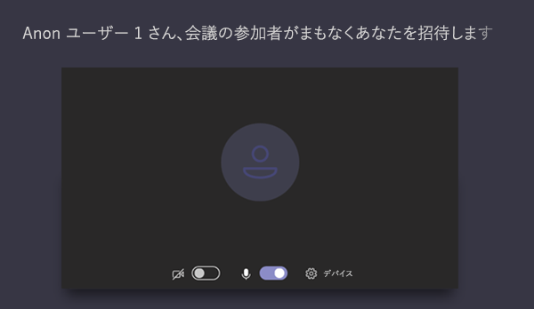

# Teams での会議ポリシーを管理する

::: zone target="docs"
会議ポリシーは、組織内のユーザーによってスケジュールされている会議の参加者が使用できる機能を制御するために使用されます。 ポリシーを作成して変更を行うと、そのポリシーにユーザーを割り当てることができます。 会議ポリシーは、Microsoft Teams 管理センターまたは[PowerShell を使用](teams-powershell-overview.md)して管理します。

ポリシーを実装するには、次のような方法があります。これは、会議の開始前、会議中、または会議中にユーザーの会議の操作に影響します。 

|実装の種類  |説明  |
|---------|---------|
|開催者ごと    |開催者ごとのポリシーを実装すると、すべての会議参加者が開催者のポリシーを継承します。 たとえば、ユーザーが開催者ごと**に自動的に**参加するポリシーを設定し、そのポリシーが割り当てられているユーザーによってスケジュールされた会議のロビーでユーザーが会議に参加するかどうかを制御します。          |
|ユーザーごと    |ユーザーごとのポリシーを実装する場合、開催者や会議の参加者の特定の機能を制限するために、ユーザーごとのポリシーのみが適用されます。 たとえば、[**今すぐ会議を許可する**] は、ユーザーごとのポリシーです。     |
|開催者ごととユーザーごと     |開催者ごととユーザーごとのポリシーの組み合わせを実装する場合、特定の機能は、そのポリシーと開催者のポリシーに基づいて会議の参加者に制限されます。 たとえば、**クラウドの記録を許可する**のは、開催者ごととユーザーごとのポリシーです。 会議の開催者と参加者がレコーディングを開始および停止できるようにするには、この設定をオンにします。 

既定では、Global (org wide default) という名前のポリシーが作成されます。 組織内のすべてのユーザーには、既定でこの会議ポリシーが割り当てられます。 このポリシーを変更するか、1つ以上のカスタムポリシーを作成し、ユーザーを割り当てることができます。 ユーザー設定のポリシーを作成するときに、特定の機能をユーザーが利用できるようにするか、または設定を適用する1人以上のユーザーに割り当てることができます。 

## 会議のポリシーを変更または作成する

会議ポリシーを変更または作成するには、Microsoft Teams 管理センターの >**会議** > の**ポリシー**を参照してください。 リストからポリシーを選ぶか、[**新しいポリシー**] を選択します。 新しいポリシーを作成する場合は、名前と説明を追加します。 名前には特殊文字を含めたり、64文字より長い名前を指定したりすることはできません。 設定を選び、[**保存**] を選びます。

たとえば、多数のユーザーがいて、会議で必要な帯域幅の量を制限するとします。 "制限された帯域幅" という名前の新しいカスタムポリシーを作成して、次の設定を無効にします。

[ **Audio & video**] で、次の操作を行います。
- クラウドの記録を無効にする
- IP ビデオの許可を無効にする

[**コンテンツ共有**] の下:
- 画面共有モードを無効にする
- ホワイトボードをオフにする
- 共有のノートをオフにする

次に、ポリシーをユーザーに割り当てます。

> [!NOTE] 
> ユーザーには、一度に1つの会議ポリシーのみを割り当てることができます。 

## ユーザーに会議ポリシーを割り当てる

1人のユーザーにポリシーを適用する場合は、左側のナビゲーションウィンドウで [**ユーザー** ] を選択し、ユーザーの表示名をクリックします。 ユーザーのページで、[**割り当てられたポリシー**] の横にある [**編集**] を選択します。 次に、[**ユーザーポリシーの編集**] ウィンドウの [**会議のポリシー**] で、ドロップダウンリストから会議のポリシーを選び、[**保存**] を選びます。 また、ユーザーの一覧からポリシーを割り当てることもできます。 そのためには、ユーザーの表示名の左側をクリックしてユーザーを選びます。 [**設定の編集**] を選びます。 次に、[**設定の編集**] ウィンドウの [**会議ポリシー**] で、ドロップダウンリストからポリシーを選び、[**保存**] を選びます。 
 
複数のユーザーにポリシーを適用する場合は、左側のナビゲーションウィンドウで [**ユーザー** ] を選択し、ユーザー名の左側をクリックしてユーザーを選び、[設定の**編集**] をクリックします。 [**設定の編集**] ウィンドウの [**会議ポリシー**] で、ドロップダウンリストからポリシーを選び、[**保存**] を選びます。
 
会議ポリシーは、次のように1人または複数のユーザーに割り当てることもできます。

1. **Microsoft Teams 管理センター** > の**会議** > の**ポリシー**に移動します。
2. ポリシー名の左側をクリックして、ポリシーを選択します。
3. [**ユーザーの管理**] を選びます。
4. [**ユーザーの管理**] ウィンドウで、[表示名] または [ユーザー名] でユーザーを検索し、名前を選択して [**追加**] を選択します。 追加するユーザーごとに、この手順を繰り返します。
5. ユーザーの追加が完了したら、[**保存**] を選択します。
 
> [!NOTE] 
> ポリシーは、ユーザーに割り当てられている場合は削除できません。 最初に、影響を受けるすべてのユーザーに別のポリシーを割り当てる必要があります。その後、元のポリシーを削除することができます。
 
## 会議のポリシー設定

[**会議ポリシー** ] ページで既存のポリシーを選ぶか、[**新しいポリシー** ] を選んで新しいポリシーを追加するときに、次の設定を構成できます。

- [[全般]](#meeting-policy-settings---general)
- [オーディオ & ビデオ](#meeting-policy-settings---audio--video)
- [コンテンツ共有](#meeting-policy-settings---content-sharing)
- [参加者 & ゲスト](#meeting-policy-settings---participants--guests)

::: zone-end 

## 会議のポリシー設定-全般

- [チャネルの [会議の開始] を許可する](#allow-meet-now-in-channels)
- [今すぐプライベート会議を許可する (近日公開予定)](#allow-private-meet-now-coming-soon)
- [Outlook アドインの使用を許可する](#allow-the-outlook-add-in)
- [チャネル会議のスケジュールを許可する](#allow-channel-meeting-scheduling)
- [プライベート会議のスケジュールを許可する](#allow-scheduling-private-meetings)

### チャネルの [会議の開始] を許可する

これはユーザーごとのポリシーであり、会議が開始される前に適用されます。 この設定は、ユーザーが Teams のチャネルで臨時の会議を開始できるかどうかを制御します。 この設定を有効にした場合、ユーザーが Teams チャネルでメッセージを投稿したときに、[作成] ボックスの下にある [**今すぐ**ミーティング] をクリックして、チャネル内で臨時の会議を開始することができます。

![メッセージの下に [今すぐ会議] アイコンが表示されたスクリーンショット](media/meeting-policies-meet-now.png)

### 今すぐプライベート会議を許可する (近日公開予定)

これはユーザーごとのポリシーであり、会議が開始される前に適用されます。 この設定は、ユーザーが臨時のプライベート会議を開始できるかどうかを制御します。  

### Outlook アドインの使用を許可する

これはユーザーごとのポリシーであり、会議が開始される前に適用されます。 この設定は、Teams 会議を Outlook 内でスケジュールできるかどうかを制御します (Windows、Mac、web、およびモバイル)。

この設定を無効にした場合、ユーザーが Outlook で新しい会議を作成するときに、チームの会議をスケジュールできなくなります。 たとえば、Windows の Outlook では、[**新しいチーム会議**] オプションがリボンに表示されません。

### チャネル会議のスケジュールを許可する

これはユーザーごとのポリシーであり、会議が開始される前に適用されます。 この設定は、ユーザーが Teams のチャネルで会議をスケジュールできるかどうかを制御します。  この設定を無効にした場合、チームのチャネルで会議を開始したときに [**会議のスケジュール**] オプションがユーザーに表示されないようにすることはできません。チームの会議から会議をスケジュールするときに、ユーザーは **[** 会議の予約] オプションを使用できません。

![Teams の [meetion のスケジュール] オプションを示すスクリーンショット](media/meeting-policies-schedule-a-meeting.png)

![[会議のためのチャネルを選択する] オプションが表示されたスクリーンショット](media/meeting-policies-select-a-channel-to-meet-in.png)

### プライベート会議のスケジュールを許可する

これはユーザーごとのポリシーであり、会議が開始される前に適用されます。 この設定は、ユーザーが Teams でプライベート会議をスケジュールできるかどうかを制御します。 チーム内のチャネルに発行されていない場合、会議は非公開になります。

[**プライベート会議**のスケジュール設定を許可し、**チャネル会議のスケジュールを許可**する] をオフにすると、[**会議のスケジュール**] オプションは利用できなくなり、ユーザーは Teams で会議をスケジュールできなくなります。

## 会議のポリシー設定-オーディオ & ビデオ

- [議事録を許可する](#allow-transcription)
- [クラウドの記録を許可する](#allow-cloud-recording)
- [IP ビデオを許可する](#allow-ip-video)
- [メディアのビットレート (KBs)](#media-bit-rate-kbs)
- [ライブキャプションを有効にする (近日公開)](#enable-live-captions-coming-soon)

### 議事録を許可する

これは、1つの開催者とユーザーごとのポリシーを組み合わせたものです。 この設定では、会議のレコーディングの再生中にキャプションと議事録機能を使用できるかどうかを制御します。 この設定を無効にした場合、会議のレコーディングの再生中は、[**検索**] と [ **CC** ] オプションは使用できません。 レコーディングを開始したユーザーは、この設定をオンにして、レコーディングにも議事録を含めることができます。 

記録された会議の議事録は、現時点では、Teams の言語が英語に設定されているユーザー、および英語が会議で話されている場合にのみサポートされます。

![会議の [議事録] オプションを示すスクリーンショット](media/meeting-policies-transcription.png)

### クラウドの記録を許可する

これは、1つの開催者とユーザーごとのポリシーを組み合わせたものです。 この設定は、このユーザーの会議を記録できるかどうかを制御します。 参加者のポリシー設定が有効になっている場合、または同じ組織から認証されたユーザーである場合は、レコーディングを会議の開催者または別の会議参加者が開始することができます。

フェデレーションユーザーや匿名ユーザーなどの組織外のユーザーは、レコーディングを開始できません。 ゲストユーザーがレコーディングを開始または停止することはできません。 

![[レコーディング] オプションが表示されたスクリーンショット](media/meeting-policies-recording.png)

次の例を見てみましょう。

|ユーザー |会議のポリシー  |クラウドの記録を許可する |
|---------|---------|---------|
|Daniela | Global   | False |
|Amanda | Location1MeetingPolicy | True|
|John (外部ユーザー) | 該当しない | 該当しない|

Daniela によって開催された会議を記録することはできません。ポリシー設定が有効になっている場合は、Daniela で開催された会議を記録することはできません。 Amanda によって開催された会議を記録することはできますが、ポリシー設定が無効になっている、または外部ユーザーである John が、Amanda によって開催された会議を記録することはできません。 Daniela。

クラウド会議のレコーディングの詳細については、「 [Teams クラウド会議のレコーディング](cloud-recording.md)」を参照してください。

### IP ビデオを許可する

これは、1つの開催者とユーザーごとのポリシーを組み合わせたものです。 ビデオは、会議の主要なコンポーネントです。 一部の組織では、管理者がビデオを使用するユーザーの会議をさらに制御する必要がある場合があります。 この設定では、ユーザーによってホストされている会議でビデオをオンにするかどうかを制御します。また、ユーザーが開始した1:1 通話とグループ通話にも使用できます。 このポリシーが有効になっているユーザーによって開催された会議は、会議参加者がポリシーを有効にしている場合は、会議参加者の会議でのビデオ共有を許可します。 (匿名およびフェデレーション参加者などの) ポリシーが割り当てられていない会議の参加者は、会議の開催者のポリシーを継承します。

次の例を見てみましょう。

|ユーザー |会議のポリシー  |IP ビデオを許可する |
|---------|---------|---------|
|Daniela   | Global   | True        |
|Amanda    | Location1MeetingPolicy        | False      |

Daniela でホストされている会議では、ビデオをオンにすることができます。 Daniela は会議に参加して、ビデオをオンにすることができます。 Amanda のポリシーが [ビデオを許可しない] に設定されているため、Amanda は Daniela の会議でビデオを有効にできません。 Amanda は、会議で他の参加者と共有されているビデオを表示できます。

Amanda によってホストされている会議では、ユーザーに割り当てられているビデオポリシーに関係なく、誰もビデオをオンにすることはできません。 これは、Daniela Amanda の会議でビデオを有効にできないことを意味します。  

Daniela がビデオで Amanda 通話を発信した場合、Amanda は音声のみで通話に応答できます。  通話が接続されている場合、Amanda は Daniela のビデオを見ることはできますが、ビデオを有効にすることはできません。 Amanda が Daniela 通話を発信すると、Daniela はビデオと音声で通話に応答できます。 通話が接続されると、Daniela は、必要に応じて彼女のビデオをオンまたはオフにすることができます。

### メディアのビットレート (KBs)

これは開催者ごとのポリシーです。 この設定は、ユーザーの通話と会議でのオーディオ、ビデオ、およびビデオベースのアプリ共有転送のメディアのビットレートを決定します。 これは、通話または会議のユーザーに対して、アップリンクとダウンリンクメディアトラバーサルの両方に適用されます。 この設定により、組織内の帯域幅の管理をきめ細かく制御できます。 ユーザーが必要とする会議シナリオによっては、優れた品質を実現するために十分な帯域幅を用意することをお勧めします。 最小値は 30 Kbps で、最大値は会議シナリオによって異なります。 Teams での品質の高い会議、通話、ライブイベントに関する最低限の推奨帯域幅の詳細については、「[帯域幅要件](prepare-network.md#bandwidth-requirements)」を参照してください。

会議に十分な帯域幅がない場合、参加者には、ネットワークの品質低下を示すメッセージが表示されます。

最高品質のビデオエクスペリエンス (CEO ボード会議や Teams live イベントなど) が必要な会議の場合は、帯域幅を 10 Mbps に設定することをお勧めします。 最大のエクスペリエンスが設定されている場合でも、シナリオによっては、特定のネットワーク条件が検出されると、Teams メディアスタックが低帯域幅の条件に合わせて調整されます。 

### ライブキャプションを有効にする (近日公開)

これはユーザーごとのポリシーであり、会議中に適用されます。 この設定をオンにすると、会議中にキャプションを表示するオプションがユーザーに表示されます。

## 会議のポリシー設定-コンテンツ共有

- [画面共有モード](#screen-sharing-mode)
- [参加者による制御を許可または要求する](#allow-a-participant-to-give-or-request-control)
- [外部参加者による制御の付与または要求を許可する](#allow-an-external-participant-to-give-or-request-control)
- [PowerPoint の共有を許可する](#allow-powerpoint-sharing)
- [ホワイトボードを許可する](#allow-whiteboard)
- [共有のノートを許可する](#allow-shared-notes)
- [会議でチャットを許可する (近日公開予定)](#allow-chat-in-meetings-coming-soon)

### 画面共有モード

これは、1つの開催者とユーザーごとのポリシーを組み合わせたものです。 この設定は、ユーザーの会議でデスクトップとウィンドウの共有を許可するかどうかを制御します。 (匿名、ゲスト、B2B、フェデレーション参加者などの) ポリシーが割り当てられていない会議の参加者は、会議の開催者のポリシーを継承します。

|値の設定 |動作  |
|---------|---------|
|**画面全体**    | 完全なデスクトップ共有とアプリケーション共有が会議で許可されている |
|**1つのアプリケーション**   | 会議ではアプリケーション共有が許可されている        |
|**無効**     |会議中に画面共有とアプリケーション共有が無効になりました。       |

次の例を見てみましょう。

|ユーザー |会議のポリシー |画面共有モード |
|---------|---------|---------|
|Daniela  | Global   | 画面全体 |
|Amanda   | Location1MeetingPolicy  | 無効 |

Daniela によってホストされている会議により、会議の参加者は画面全体または特定のアプリケーションを共有できるようになります。 Amanda が Daniela の会議に参加している場合は、そのポリシー設定が無効になっているために、Amanda が自分の画面や特定のアプリケーションを共有することはできません。 Amanda によってホストされている会議では、画面共有モードポリシーが割り当てられているかどうかに関係なく、1つのアプリを共有することはできません。 これは、Daniela が Amanda の会議で、画面や単一のアプリケーションを共有できないことを意味します。  

現時点では、ユーザーが Google Chrome を使用している場合は、Teams 会議でビデオを再生したり、画面を共有したりすることはできません。

### 参加者による制御を許可または要求する

これは、ユーザーごとのポリシーです。 この設定は、ユーザーが共有デスクトップまたはウィンドウの制御を他の会議参加者に対して許可できるかどうかを制御します。 コントロールを指定するには、画面の上部にマウスポインターを置きます。 

ユーザーに対してこの設定をオンにすると、共有セッションのトップバーに [**制御を渡す**] オプションが表示されます。 

![[制御を渡す] オプションが表示されたスクリーンショット](media/meeting-policies-give-control.png)

ユーザーに対して設定を無効にした場合は、[**制御を渡す**] オプションは使用できません。

![[制御を渡す] オプションが使用できないことを示すスクリーンショット](media/meeting-policies-give-control-not-available.png)

次の例を見てみましょう。

|ユーザー |会議のポリシー  |参加者にコントロールの譲渡または要求を許可する |
|---------|---------|---------|
|Daniela   | Global   | True       |
|Babek    | Location1MeetingPolicy        | False   |

Daniela は、Babek によって開催された会議の他の参加者と共有しているデスクトップまたはウィンドウを制御できますが、Babek は他の参加者に制御を渡すことはできません。

### 外部参加者による制御の付与または要求を許可する

これは、ユーザーごとのポリシーです。 この設定では、会議の外部参加者が、共有しているデスクトップまたはウィンドウを会議の他の参加者に対して管理できるようにするかどうかを制御します。 Teams 会議の外部参加者は、次のように分類されます。  

   - 匿名ユーザー
   - ゲスト ユーザー  
   - B2B ユーザー
   - フェデレーションされたユーザー  

フェデレーションされたユーザーが外部ユーザーに制御を渡すことができるかどうかは、「外部参加者による組織の制御設定の**付与または要求**」によって制御されます。

### PowerPoint の共有を許可する

これは、ユーザーごとのポリシーです。 この設定は、ユーザーが PowerPoint スライドデッキを会議で共有できるかどうかを制御します。 匿名、ゲスト、フェデレーションユーザーなどの外部ユーザーは、会議の開催者のポリシーを継承します。

次の例を見てみましょう。

|ユーザー |会議のポリシー  |PowerPoint の共有を許可する |
|---------|---------|---------|
|Daniela   | Global   | True       |
|Amanda   | Location1MeetingPolicy        | False   |

Amanda が会議の開催者であっても、会議で PowerPoint スライドデッキを共有することはできません。 Daniela は、Amanda によって会議が開催されている場合でも、PowerPoint スライドデッキを共有できます。 Amanda は、PowerPoint スライドデッキを共有できない場合でも、会議中に他のユーザーと共有している PowerPoint スライドデッキを表示できます。

### ホワイトボードを許可する

これは、ユーザーごとのポリシーです。 この設定は、ユーザーが会議でホワイトボードを共有できるかどうかを制御します。 匿名、B2B、フェデレーションユーザーなどの外部ユーザーは、会議の開催者のポリシーを継承します。 

次の例を見てみましょう。

|ユーザー |会議のポリシー  |ホワイトボードを許可する|
|---------|---------|---------|
|Daniela   | Global   | True       |
|Amanda   | Location1MeetingPolicy        | False   |

Amanda が会議の開催者である場合でも、会議でホワイトボードを共有することはできません。 Daniela は、会議が Amanda によって開催されている場合でも、ホワイトボードを共有できます。  

### 共有のノートを許可する

これは、ユーザーごとのポリシーです。 この設定では、ユーザーが会議でノートを作成して共有できるかどうかを制御します。 匿名、B2B、フェデレーションユーザーなどの外部ユーザーは、会議の開催者のポリシーを継承します。 現在、[**会議メモ**] タブは、参加者が20人未満の会議でのみサポートされています。 

次の例を見てみましょう。

|ユーザー |会議のポリシー  |共有のノートを許可する |
|---------|---------|---------|
|Daniela   | Global   | True       |
|Amanda   | Location1MeetingPolicy | False |

Daniela は Amanda の会議でノートを取ることができ、Amanda はどの会議でもノートを取ることができません。

### 会議でチャットを許可する (近日公開予定)

これは開催者ごとのポリシーです。 この設定は、ユーザーの会議で会議チャットを許可するかどうかを制御します。 

## 会議のポリシー設定-参加者 & ゲスト

これらの設定では、参加者が会議に参加する前に、ロビーで待機する会議の参加者と、会議で許可されている参加のレベルを制御します。

- [ユーザーを自動的に許可する](#automatically-admit-people)
- [匿名ユーザーが会議を開始することを許可する](#allow-anonymous-people-to-start-a-meeting)
- [ダイヤルインユーザーがロビーをバイパスすることを許可する](#allow-dial-in-users-to-bypass-the-lobby-coming-soon)
- [開催者がロビーの設定を無効にすることを許可する](#allow-organizers-to-override-lobby-settings-coming-soon)

### ユーザーを自動的に許可する

これは開催者ごとのポリシーです。 この設定では、ユーザーが会議に直接参加するか、認証されたユーザーに許可されるまでロビーで待機するかを制御します。

 会議の開催者は、会議出席依頼の [**会議オプション**] をクリックして、スケジュールする会議ごとにこの設定を変更できます。 **(近日公開)**
  
|値の設定  |結合動作 |
|---------|---------|
|**すべて**   |すべての会議参加者が、ロビーで待たずに会議に直接参加します。 これには、認証済みユーザー、フェデレーションされたユーザー、ゲスト、匿名ユーザー、電話でダイヤルインするユーザーが含まれます。       |
|**組織内のすべてのユーザーとフェデレーション組織**     |組織内で認証されたユーザー (ゲストユーザーやフェデレーションされた組織のユーザーを含む) は、ロビーで待機することなく直接会議に参加します。  ロビーで電話で通話を発信する匿名ユーザーとユーザー。   |
|**組織内のすべてのユーザー**    |ゲストユーザーを含む、組織内から認証されたユーザーは、ロビーで待たずに会議に直接参加できます。  フェデレーションされたユーザー、匿名ユーザー、およびロビーで電話で通話を発信するユーザー。           |

### 匿名ユーザーが会議を開始することを許可する

これは開催者ごとのポリシーです。 この設定では、組織の承認されたユーザーが参加していない場合に、そのユーザーの会議に参加できるかどうかを制御します。 

認証されたユーザーが会議に存在する場合の、匿名ユーザーの結合動作を次に示します。

|匿名ユーザーが会議を開始することを許可する  |ユーザーを自動的に許可する |匿名ユーザーの参加動作 |
|---------|---------|---------|
|True    | すべて      | 直接参加         |
|   | 組織内のすべてのユーザー       | ロビーで待機する        |
|   | 組織内のすべてのユーザーとフェデレーション組織       | ロビーで待機する         |
|False    | すべて        | 直接参加        |
|   | 組織内のすべてのユーザー     | ロビーで待機する        |
|   | 組織内のすべてのユーザーとフェデレーション組織      | ロビーで待機する         |

認証されたユーザーが会議に存在しない場合の、匿名ユーザーの結合動作を次に示します。

|匿名ユーザーが会議を開始することを許可する |ユーザーを自動的に許可する  |匿名ユーザーの参加動作 |
|---------|---------|---------|
|True    | すべて      | 直接参加         |
|   | 組織内のすべてのユーザー       | ロビーで待機する        |
|   | 組織内のすべてのユーザーとフェデレーション組織       | ロビーで待機する         |
|False    | すべて        | ロビーで待機します。 最初の認証済みのユーザーが会議に参加すると、ユーザーは自動的に許可されます。        |
|   | 組織内のすべてのユーザー     |ロビーで待機する         |
|   | 組織内のすべてのユーザーとフェデレーション組織      | ロビーで待機する         |

### ダイヤルインユーザーがロビーをバイパスすることを許可する (近日公開)

これは開催者ごとのポリシーです。 この設定では、電話でダイヤルインするユーザーが会議に直接参加するか、[ユーザーの**自動**許可] 設定に関係なくロビーで待機するかを制御します。

電話でダイヤルインするユーザーの結合動作を次に示します。

|ダイヤルインユーザーがロビーをバイパスすることを許可する  |ユーザーに自動的に参加する  |ダイヤルインするユーザーの参加動作 |
|---------|---------|---------|
|True    | すべて      | 直接参加         |
|   | 組織内のすべてのユーザー       | 直接参加        |
|   | 組織内のすべてのユーザーとフェデレーション組織       | 直接参加         |
|False    | すべて        | 直接参加        |
|   | 組織内のすべてのユーザー     |ロビーで待機する         |
|   | 組織内のすべてのユーザーとフェデレーション組織      | ロビーで待機する         |

### 開催者がロビーの設定を無効にすることを許可する (近日公開)

これは開催者ごとのポリシーです。 この設定では、管理者が**ユーザーを自動的に**許可するように設定されているロビー設定を会議の開催者が上書きできるかどうかを制御し、新しい会議をスケジュールするときに、**ダイヤルインユーザーがロビーをバイパスする**ことを許可するかどうかを制御します。 

会議の開催者は、会議出席依頼の [**会議オプション**] をクリックして、スケジュールする各会議のロビー設定を変更できます。 

この設定は、会議の開催者が [開催者のスケジュールを会議するたびに**ユーザーに**許可する] 設定を変更できるかどうかにどのように影響するかについて説明します。

|開催者がロビーの設定を無効にすることを許可する  |ユーザーを自動的に許可する  |動作 |
|---------|---------|---------|
|True    | すべて      | 開催者は、他の値に設定を変更できます。 |
|   | 組織内のすべてのユーザー       | 開催者は、他の値に設定を変更できます。|
|   | 組織内のすべてのユーザーとフェデレーション組織       | 開催者は、これを他の値に変更することができます。         |
|False    | すべて        | 開催者は、他の値に設定を変更できます。|
|   | 組織内のすべてのユーザー     |開催者は、**組織内のすべてのユーザー**に設定を変更できます。 |
|   | 組織内のすべてのユーザーとフェデレーション組織      | 開催者がロビーの設定を上書きすることはできません。 |

ここでは、この設定を変更して、会議の開催者が、開催者のスケジュールを会議するたびに、**ロビー設定をバイパスすることを許可する**かどうかを決定する方法について説明します。
    
|開催者がロビーの設定を無効にすることを許可する  |ダイヤルインユーザーがロビーをバイパスすることを許可する  |動作 |
|---------|---------|---------|
|True    |  True        | 開催者は、設定を [いいえ] に変更できます。       |
|True      | False         | 開催者は、設定を [True] に変更することができます。        |
|False     | True        |開催者は、設定を [いいえ] に変更できます。         |
|False      |False          |開催者は、ロビーの設定を上書きすることはできません。また、ダイヤルインユーザーが会議のロビーをバイパスすることを許可することはできません。        |

[記事の全文](meeting-policies-in-teams.md)

## 関連トピック
[Teams のメッセージポリシー](messaging-policies-in-teams.md)
