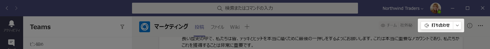
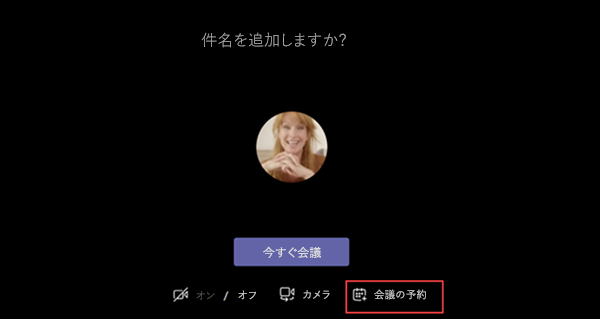
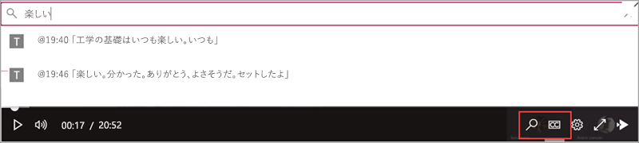

# Teams での会議ポリシーを管理する

::: zone target="docs"
ミーティングのポリシーは、組織内のユーザーによってスケジュールされている会議の参加者をミーティングに使用可能な機能の制御に使用されます。 ポリシーを作成し、変更を行い後、は、ポリシーに、ユーザーを割り当てることができます。 または[PowerShell を使用して](teams-powershell-overview.md)マイクロソフトのチームの管理センターでのミーティングのポリシーを管理します。

ポリシーを実装するには、会議前に、会議のユーザー エクスペリエンスに影響する次のように、会議中または会議後に開始します。 

|実装の種類  |説明  |
|---------|---------|
|オーガナイザーごと    |オーガナイザーごとのポリシーを実装すると、すべてのミーティング参加者は、主催者のポリシーを継承します。 **人を自動的に認める**は開催ごとのポリシーとコントロールのユーザーが直接会議に参加またはポリシーが割り当てられているユーザーによってスケジュールされた会議のロビーで待機するかどうか。          |
|ユーザーごと    |ユーザーごとのポリシーを実装する場合は、開催者、会議参加者の特定の機能を制限するのにはユーザーごとのポリシーのみが適用されます。 たとえば、**会議の開始を許可する**は、ユーザーごとのポリシーです。     |
|オーガナイザーごと、ユーザーごと     |オーガナイザーごと、ユーザーごとのポリシーの組み合わせを実装すると、特定の機能は、ミーティングのポリシーと、主催者のポリシーに基づく参加者の制限されています。 たとえば、**許可するクラウドの記録**は、オーガナイザーごと、ユーザーごとのポリシーです。 会議の開催者と参加者が起動し、録画を停止できるようにするには、この設定をオンにします。 

既定では、グローバル (組織全体の既定値) をという名前のポリシーが作成されます。 組織内のすべてのユーザー ポリシーが割り当てられますこの会議既定します。 このポリシーに変更を加えるか、1 つまたは複数のカスタム ポリシーの作成にユーザーを割り当てるとします。 カスタム ポリシーを作成するときを許可するまたはされない特定の機能、ユーザーが利用して、それらに適用する設定を持つ 1 つまたは複数のユーザーに割り当てます。 

## 変更するか、会議ポリシーを作成

マイクロソフトのチームの管理センター _gt**会議**に変更したり、会議ポリシーを作成、 > **ミーティングのポリシー**です。 リストからポリシーを選択するか、**新しいポリシー**を選択します。 新しいポリシーを作成する場合は、名前と説明を追加します。 名前は、特殊文字が含まれているか、64 文字より長くすることはできません。 設定を選択し、[**保存**] を選択します。

たとえば、一連のユーザがあり、その会議を必要とする帯域幅の量を制限したいとします。 「帯域幅の制限」をという名前の新しいカスタム ポリシーを作成し、次の設定を無効にします。

[**ビデオのオーディオ &**。
- クラウドをオフに記録
- ビデオを許可する IP をオフにします。

[**コンテンツの共有**をします。
- 画面の共有モードを無効にします。
- ホワイト ボードをオフにします。
- 共有のメモをオフにします。

ユーザーにポリシーを割り当てます。

> [!NOTE] 
> ユーザーには、一度に 1 つだけの会議ポリシーを割り当てることできます。 

## 会議ポリシーをユーザーに割り当てる

1 人のユーザーにポリシーを適用する場合の左側のナビゲーション ウィンドウで**ユーザー**を選択し、ユーザーの表示名をクリックします。 [ユーザーのページの [**割り当てポリシー**の**編集**を選択します。 **ユーザー ポリシーの編集**] ウィンドウの [**ミーティングのポリシー**]、[ボックスの一覧からミーティングのポリシーを選択し、し、[**保存**] を選択します。 ユーザーの一覧からポリシーを割り当てることもできます。 これを行うには、ユーザーの表示名の左側に] をクリックしてユーザーを選択します。 **設定の編集**] を選択します。 **設定を編集**] ウィンドウの [**ミーティングのポリシー**]、[ボックスの一覧からポリシーを選択し、し、[**保存**] を選択します。 
 
複数のユーザーにポリシーを適用する場合、左側のナビゲーション ウィンドウで**ユーザー**を選択、ユーザー名の左側をクリックすると、各ユーザーを選択し、**設定の編集**] をクリックします。 **設定の編集**] ウィンドウの [**ミーティングのポリシー**]、[ボックスの一覧からポリシーを選択し、[**保存**します。
 
割り当てることも会議ポリシーを 1 つまたは複数のユーザーとして次のように。

1. **マイクロソフトのチーム管理センター**を参照して > **会議** > **ミーティングのポリシー**です。
2. ポリシーを選択するには、ポリシー名の左側にクリックします。
3. **ユーザーの管理**を選択します。
4. **ユーザーの管理**ウィンドウで、表示名、ユーザー名、ユーザーの検索、名を選択し、[**追加**] をクリックします。 追加するユーザーごとにこの手順を繰り返します。
5. ユーザーの追加が完了したら、[**保存**] を選択します。
 
> [!NOTE] 
> ユーザーがそれに割り当てられている場合は、ポリシーを削除することはできません。 まず、影響を受けるすべてのユーザーに別のポリシーを割り当てる必要があり、元のポリシーを削除することができます。
 
## 会議ポリシーの設定

[**ミーティングのポリシー** ] ページで、既存のポリシーを選択した場合、または新しいポリシーを追加する**新しいポリシー**を選択するときは、次の設定を構成できます。

- [[全般]](#meeting-policy-settings---general)
- [ビデオのオーディオの &](#meeting-policy-settings---audio--video)
- [コンテンツ共有](#meeting-policy-settings---content-sharing)
- [参加者 & 来園者](#meeting-policy-settings---participants--guests)

::: zone-end 

## 会議ポリシー設定の [全般]

- [チャンネルの即時を許可します。](#allow-meet-now-in-channels)
- [プライベート即時 (準備中) を許可します。](#allow-private-meet-now-coming-soon)
- [Outlook アドインを許可します。](#allow-the-outlook-add-in)
- [チャネルの会議のスケジュールを許可します。](#allow-channel-meeting-scheduling)
- [秘密の会議をスケジュールできるようにします。](#allow-scheduling-private-meetings)

### チャンネルの即時を許可します。

これはユーザーごとのポリシーであり、ミーティングの前に適用されますが起動します。 この設定は、ユーザーがチームのチャネルで特別な会議を開始できるかどうかを制御します。 するとこのユーザーがチームのチャネルにメッセージをポストするときに、ユーザーがクリックしてできる**即時**チャネルでの特別な会議を開始するのには [作成する] ボックスの下にあります。

### プライベート即時 (準備中) を許可します。

これはユーザーごとのポリシーであり、ミーティングの前に適用されますが起動します。 この設定は、ユーザーが、暫定的なプライベートな会議を開始できるかどうかを制御します。  

### Outlook アドインを許可します。

これはユーザーごとのポリシーであり、ミーティングの前に適用されますが起動します。 この設定では、(Windows、Mac、web、およびモバイル)、Outlook 内からチームのミーティングをスケジュールできるかどうかを制御します。

この機能を有効にする場合、ユーザーは Outlook の新しい会議を作成するときに、チームのミーティングをスケジュールすることではありません。 などの Outlook では Windows では、**新しいチームのミーティング**のオプションは表示されませんをリボンにします。

### チャネルの会議のスケジュールを許可します。

これはユーザーごとのポリシーであり、ミーティングの前に適用されますが起動します。 この設定は、ユーザーは、チャネル ・ チームのミーティングをスケジュールできるかどうかを制御します。  このオプションをオフにすると場合、は、チームのチャネルで会議を開始するとき**を満たすためにチャネルを選択する**オプションはありませんユーザーにチームでの会議から会議をスケジュールするとき、**会議のスケジュール**オプションがユーザーに利用可能なできません。

### 秘密の会議をスケジュールできるようにします。

これはユーザーごとのポリシーであり、ミーティングの前に適用されますが起動します。 この設定は、ユーザーがチーム内の秘密の会議をスケジュールできるかどうかを制御します。 会議は、チーム内のチャネルには公開されませんするときに専用です。

**個人の会議のスケジュールを許可する****許可するチャネルの会議のスケジュール**を無効にして、**会議のスケジュール**] オプションは使用できません、ユーザーをチームでミーティングをスケジュールすることはできないことに注意してください。

## 会議ポリシー設定のビデオのオーディオ &

- [議事録作成を許可します。](#allow-transcription)
- [クラウドを許可する記録](#allow-cloud-recording)
- [ビデオ IP を許可します。](#allow-ip-video)
- [メディア ビット レート (KBs)](#media-bit-rate-kbs)
- [(準備中) ライブのキャプションを有効にします。](#enable-live-captions-coming-soon)

### 議事録作成を許可します。

オーガナイザーごと、ユーザーごとのポリシーの組み合わせです。 かどうかキャプションと議事録作成の機能が利用可能なミーティングのレコーディングの再生中にこの設定を制御します。 場合はこのオプションをオフにすると、**検索**し、 **[cc]** のオプションは選択できなく、ミーティングのレコーディングの再生中に。 レコーディングを開始したユーザーには、この設定がオンになって録画も議事録を含む必要があります。 

言語を英語に設定するチームであるし、会議で英語が話されるとき、記録された会議の議事録は、現在のノートはユーザーに対してのみサポートされます。

### クラウドを許可する記録

オーガナイザーごと、ユーザーごとのポリシーの組み合わせです。 この設定は、このユーザーのミーティングを記録できるかどうかを制御します。 録音開始できます会議の開催者または他のミーティング参加者を参加者には、ポリシー設定が有効になっている場合と同じ組織からの認証済みのユーザーがいる場合。

フェデレーション ユーザーおよび匿名ユーザーなど、組織外のユーザーは、録音または録画を開始できません。 ゲスト ユーザーは、開始や録画を停止することはできません。 

次の使用例を見てみましょう。

|ユーザー |ミーティングのポリシー  |クラウドを許可する記録 |
|---------|---------|---------|
|Daniela | Global   | False |
|Amanda | Location1MeetingPolicy | True|
|ジョン (外部ユーザー) | 該当しない | 該当しない|

Daniela が開催するミーティングを記録することはできませんし、Amanda は、ポリシー設定を有効にしたことはできません Daniela が開催するミーティングを記録します。 Amanda が開催するミーティングを記録することができます、ただし、Daniela は、無効にするポリシーの設定を持っていると、外部のユーザーである John Amanda が開催するミーティングを記録できません。

クラウドのミーティングのレコーディングの詳細については、[チーム ミーティングのレコーディングのクラウド](cloud-recording.md)を参照してください。

### ビデオ IP を許可します。

オーガナイザーごと、ユーザーごとのポリシーの組み合わせです。 ビデオは、会議に重要なコンポーネントです。 組織によっては、管理者は、詳細に制御するユーザーの会議でビデオがある必要があります。 この設定で制御ビデオかどうかをオンにできますユーザーによってホストされている会議では 1 対 1 で呼び出し、グループ呼び出しがユーザーによって起動します。 有効にすると、このポリシーを持つユーザーによって開催されるミーティング共有を許可するビデオ会議の参加者が会議で会議の参加者も有効になっているポリシーを持つ場合。 ミーティングの参加者が割り当てられているポリシー (たとえば、匿名およびフェデレーション参加者) がないでは、会議の開催者のポリシーを継承します。

次の使用例を見てみましょう。

|ユーザー |ミーティングのポリシー  |IP ビデオを許可します。 |
|---------|---------|---------|
|Daniela   | Global   | True        |
|Amanda    | Location1MeetingPolicy        | False      |

Daniela でホストされている会議を有効にするビデオを許可します。 Daniela は、ミーティングに参加し、ビデオを有効にすることができます。 Amanda は、Daniela の Amanda のポリシーは、ビデオを許可しないように設定されているためにの会議でビデオを有効にできません。 Amanda は、他のミーティング参加者が共有するビデオを表示できます。

Amanda によってホストされている会議、ビデオに割り当てられているポリシーにかかわらず、ビデオのないオンにできます。 つまり Daniela は、Amanda の会議でビデオを有効にできません。  

Daniela は、ビデオに Amanda を呼び出し、Amanda はオーディオのみの呼び出しに応答できます。  呼び出しが接続されている場合、Amanda は Daniela のビデオを表示することができますが、ビデオを有効にできません。 Daniela は、Amanda Daniela 場合、ビデオとオーディオの呼び出しに応答できます。 呼び出しが接続しているとき Daniela をオンにしたり、自分のビデオでは、必要に応じてをオフにします。

### メディア ビット レート (KBs)

これは、構成内容変更ごとのポリシーです。 この設定は、送信呼び出しと、ユーザーの会議での共有、オーディオ、ビデオ、およびビデオ ・ ベースのアプリケーションのメディアのビット レートを決定します。 通話や会議でのユーザーのアップリンク ・ ダウンリンクの両方のメディアの移動に適用されます。 この設定では、組織内の帯域幅の管理をきめ細かく制御をできます。 会議シナリオをユーザーが必要に応じて、高品質のエクスペリエンスのために十分な帯域幅を持つをお勧めします。 30 Kbps は、最小値と最大値は、会議のシナリオによって異なります。 高品質会議、通話、およびチームでのライブ イベント用の帯域幅の推奨最小値の詳細については、[帯域幅の要件](prepare-network.md#bandwidth-requirements)を参照してください。

会議のための十分な帯域幅がない場合は、参加者には、ネットワークの品質を示すメッセージが参照してください。

最高品質のビデオ機能を必要とする会議の最高経営責任者などボードのミーティングとチームのライブ イベント、10 mbps の帯域幅を設定することをお勧めします。 最大の経験が設定されている場合でも、チーム メディア スタックは、状況によって、特定のネットワーク条件が検出されると低帯域幅の条件に適応します。 

### (準備中) ライブのキャプションを有効にします。

これはユーザーごとのポリシーであり、会議中に適用されます。 この設定がオンの場合、会議中にキャプションを表示するオプションが表示されます。

## 会議ポリシー設定のコンテンツの共有

- [共有モードの画面](#screen-sharing-mode)
- [したり制御を要求する参加者を許可します。](#allow-a-participant-to-give-or-request-control)
- [制御を要求したりする外部の参加者を許可します。](#allow-an-external-participant-to-give-or-request-control)
- [PowerPoint の共有を許可します。](#allow-powerpoint-sharing)
- [ホワイト ボードを許可します。](#allow-whiteboard)
- [ノートの共有を許可します。](#allow-shared-notes)
- [(近日公開予定) の会議でチャットを許可します。](#allow-chat-in-meetings-coming-soon)

### 共有モードの画面

オーガナイザーごと、ユーザーごとのポリシーの組み合わせです。 デスクトップかどうかを制御したり、ユーザーの会議で使用できるウィンドウの共有します。 会議の参加者は、すべてのポリシーが割り当てられている必要はありません (例では、匿名、ゲスト、B2B、およびフェデレーション参加者) の会議の開催者のポリシーを継承します。

|値を設定します。 |動作  |
|---------|---------|
|**画面全体**    | 会議で完全なデスクトップ共有およびアプリケーション共有は許可されて |
|**1 つのアプリケーション**   | 会議で使用できるアプリケーションの共有        |
|**無効**     |画面とアプリケーションの共有、会議ではオフにします。       |

次の使用例を見てみましょう。

|ユーザー |ミーティングのポリシー |共有モードの画面 |
|---------|---------|---------|
|Daniela  | Global   | 画面全体 |
|Amanda   | Location1MeetingPolicy  | 無効 |

Daniela でホストされている会議は、画面の全体または特定のアプリケーションを共有する会議の参加者を許可します。 Amanda は、Daniela の会議に参加する場合は、Amanda は必要、ポリシー設定が無効になって、さんは画面または特定のアプリケーションと共有できません。 Amanda によってホストされている会議で一切禁止だ、画面または共有モード ポリシーが割り当てられている画面に関係なく、1 つのアプリケーションを共有します。 これは Daniela でさんは画面または Amanda の会議で 1 つのアプリケーションを共有できないことを意味します。  

現時点では、ユーザーがビデオを再生または Google のクロムを使用している場合、チームの会議で、画面を共有できません。

### したり制御を要求する参加者を許可します。

これは、ユーザーごとのポリシーです。 この設定は、ユーザーが他の参加者に共有されているデスクトップまたはウィンドウのコントロールをできるかどうかを制御します。 管理できるように、画面の上部の上に置きます。 

ユーザーはこの設定がオンになっていると場合、は、共有セッションで一番上のバーで、[**コントロールを譲渡**] オプションが表示されます。 

ユーザーの設定がオフの場合、[**コントロールを譲渡**] オプションは使用できません。

次の使用例を見てみましょう。

|ユーザー |ミーティングのポリシー  |したり制御を要求する参加者を許可します。 |
|---------|---------|---------|
|Daniela   | Global   | True       |
|Babek    | Location1MeetingPolicy        | False   |

Daniela は、Babek は、他の参加者に制御を与えることはできませんが、Babek で開催する会議の他の参加者に共有されているデスクトップまたはウィンドウのコントロールを与えることができます。

### 制御を要求したりする外部の参加者を許可します。

これは、ユーザーごとのポリシーです。 この設定は、外部の会議参加者が会議の他の参加者に、共有デスクトップやウィンドウのコントロールを与えることができるかどうかを制御します。 チームのミーティングの参加者に外部は、次のように分類できます。  

   - 匿名ユーザー
   - ゲスト ユーザー  
   - B2B のユーザー
   - フェデレーション ユーザー  

かどうかフェデレーション ユーザーに与えることがコントロール外部ユーザーと共有しているは、自分の組織の**制御を要求したりする外部の参加者を許可する**設定によって制御されます。

### PowerPoint の共有を許可します。

これは、ユーザーごとのポリシーです。 この設定は、ユーザーが会議で PowerPoint のスライド デッキを共有できるかどうかを制御します。 匿名、ゲスト、およびフェデレーション ユーザーを含む、外部のユーザーは、会議の開催者のポリシーを継承します。

次の使用例を見てみましょう。

|ユーザー |ミーティングのポリシー  |PowerPoint の共有を許可します。 |
|---------|---------|---------|
|Daniela   | Global   | True       |
|Amanda   | Location1MeetingPolicy        | False   |

Amanda は、場合でも、会議の開催者はミーティングで PowerPoint のスライド デッキを共有できません。 Daniela は、Amanda で会議が構成されている場合でも、PowerPoint のスライド デッキを共有できます。 Amanda は彼女が PowerPoint のスライド デッキを共有できない場合でも、PowerPoint のスライド デッキのミーティングで他のユーザーによって共有を表示できます。

### ホワイト ボードを許可します。

これは、ユーザーごとのポリシーです。 この設定は、ユーザーが、会議でホワイト ボードを共有できるかどうかを制御します。 外部ユーザー、匿名を含む、B2B、およびフェデレーション ユーザーは、会議の開催者のポリシーを継承します。 

次の使用例を見てみましょう。

|ユーザー |ミーティングのポリシー  |ホワイト ボードを許可します。|
|---------|---------|---------|
|Daniela   | Global   | True       |
|Amanda   | Location1MeetingPolicy        | False   |

Amanda は、会議の開催者は場合でも、会議でホワイト ボードを共有できません。 Daniela は、Amanda で会議を開催していて、ホワイト ボードを共有できます。  

### ノートの共有を許可します。

これは、ユーザーごとのポリシーです。 この設定は、ユーザーが作成し、会議でノートを共有するかどうかを制御します。 外部ユーザー、匿名を含む、B2B、およびフェデレーション ユーザーは、会議の開催者のポリシーを継承します。 [**会議メモ**] タブは、20 未満の参加者のある会議でサポートされている現在です。 

次の使用例を見てみましょう。

|ユーザー |ミーティングのポリシー  |ノートの共有を許可します。 |
|---------|---------|---------|
|Daniela   | Global   | True       |
|Amanda   | Location1MeetingPolicy | False |

Daniela は、Amanda の会議でノートを取ることができ、Amanda は、すべての会議でノートを取ることはできません。

### (近日公開予定) の会議でチャットを許可します。

これは、構成内容変更ごとのポリシーです。 この設定は、ユーザーの会議で会議のチャットを許可するかどうかを制御します。 

## 会議ポリシー設定の参加者の & 来園者

調整会議の参加者が待機するミーティングおよび参加レベルに入場を許可する前にロビーで会議に参加できます。

- [自動的に人を認める](#automatically-admit-people)
- [会議を開始するのには匿名ユーザーを許可します。](#allow-anonymous-people-to-start-a-meeting)
- [ダイヤルイン ユーザーはロビーをバイパスできるようにします。](#allow-dial-in-users-to-bypass-the-lobby-coming-soon)
- [ロビーの設定のオーバーライドを許可します。](#allow-organizers-to-override-lobby-settings-coming-soon)

### 自動的に人を認める

これは、構成内容変更ごとのポリシーです。 この設定で制御は、人は直接のミーティングに参加かどうかまたは認証済みのユーザーが参加を許可するまでロビーで待機します。

 ミーティングの開催者はことができます会議ごとにスケジュールを設定するには、この設定を変更するのには、ミーティングの招待状の **[ミーティングのオプション**をクリックします。 **(近日公開)**
  
|値を設定します。  |動作への参加します。 |
|---------|---------|
|**全員**   |すべてのミーティング参加者は、ロビーで待機せずに、直接会議に参加します。 これには、認証されたユーザー、フェデレーション ユーザー、ゲスト、匿名ユーザー、および電話でダイヤルしている人が含まれます。       |
|**組織とフェデレーション組織内の全員**     |ゲスト ユーザーとフェデレーション組織のユーザーを含め、組織内で認証されたユーザーは、ロビーで待機せずに、直接会議に参加します。  匿名ユーザーと電話でダイヤルしているユーザーは、ロビーで待機します。   |
|**組織内のすべてのユーザー**    |ゲスト ユーザーを含む、組織内の認証されたユーザーは、ロビーで待機せずに、直接ミーティングに参加します。  フェデレーション ユーザー、匿名ユーザー、および電話でダイヤルしているユーザーは、ロビーで待機します。           |

### 会議を開始するのには匿名ユーザーを許可します。

これは、構成内容変更ごとのポリシーです。 この設定では、B2B、およびフェデレーション ユーザーを含め、匿名の方が参加せず、組織の認証済みユーザーのユーザーの会議に参加できるかどうかを制御します。 

ここでは、ジョインの動作を匿名ユーザーの認証されたユーザーが会議にします。

|会議を開始するのには匿名ユーザーを許可します。  |自動的に人を認める |匿名ユーザーの動作に参加します。 |
|---------|---------|---------|
|True    | 全員      | 直接結合します。         |
|   | 組織内のすべてのユーザー       | ロビーで待機します。        |
|   | 組織とフェデレーション組織内の全員       | ロビーで待機します。         |
|False    | 全員        | 直接結合します。        |
|   | 組織内のすべてのユーザー     | ロビーで待機します。        |
|   | 組織とフェデレーション組織内の全員      | ロビーで待機します。         |

ここでは、ジョインの動作を匿名ユーザーの認証されたユーザーは、会議には存在しません。

|会議を開始するのには匿名ユーザーを許可します。 |自動的に人を認める  |匿名ユーザーの動作に参加します。 |
|---------|---------|---------|
|True    | 全員      | 直接結合します。         |
|   | 組織内のすべてのユーザー       | ロビーで待機します。        |
|   | 組織とフェデレーション組織内の全員       | ロビーで待機します。         |
|False    | 全員        | ロビーで待機します。 ユーザーは、最初の認証されたユーザーがミーティングに参加すると自動的に入場を許可します。        |
|   | 組織内のすべてのユーザー     |ロビーで待機します。         |
|   | 組織とフェデレーション組織内の全員      | ロビーで待機します。         |

### (準備中) ロビーをバイパスするユーザーにダイヤルインを許可します。

これは、構成内容変更ごとのポリシーです。 この設定は、電話でダイヤルしている人が直接会議に参加または、**自動的に人を認める**設定に関係なく、ロビーで待機するかどうかを制御します。

ここでは、電話でダイヤルしている人の結合動作をします。

|ダイヤルイン ユーザーはロビーをバイパスできるようにします。  |ユーザーを自動的に認める  |ダイヤルしているユーザーの動作に参加します。 |
|---------|---------|---------|
|True    | 全員      | 直接結合します。         |
|   | 組織内のすべてのユーザー       | 直接結合します。        |
|   | 組織とフェデレーション組織内の全員       | 直接結合します。         |
|False    | 全員        | 直接結合します。        |
|   | 組織内のすべてのユーザー     |ロビーで待機します。         |
|   | 組織とフェデレーション組織内の全員      | ロビーで待機します。         |

### 許可 (準備中) ロビーの設定を上書きするには

これは、構成内容変更ごとのポリシーです。 この設定は、会議の開催者が新しい会議をスケジュールするときに管理者が**ユーザーを自動的に認める**と、**ダイヤルイン ユーザーはロビーをバイパスできるようにする**設定をロビー設定を上書きできるかどうかを制御します。 

ミーティングの開催者はことができますロビー会議ごとに、スケジュールの設定を変更するのには、ミーティングの招待状の **[ミーティングのオプション**をクリックします。 

会議の開催者は各会議の開催者のスケジュールを**自動的に人を認める**設定を変更することができるかどうかのこの設定の影響があります。

|ロビーの設定のオーバーライドを許可します。  |自動的に人を認める  |動作 |
|---------|---------|---------|
|True    | 全員      | 開催者は、他の任意の値に設定を変更できます。 |
|   | 組織内のすべてのユーザー       | 開催者は、他の任意の値に設定を変更できます。|
|   | 組織とフェデレーション組織内の全員       | 開催者は、他の任意の値にこれを変更できます。         |
|False    | 全員        | 開催者は、他の任意の値に設定を変更できます。|
|   | 組織内のすべてのユーザー     |開催者は、**組織内**のすべてのユーザー設定を変更できます。 |
|   | 組織とフェデレーション組織内の全員      | 開催者は、ロビーの設定をオーバーライドできません。 |

次の方法この設定に影響を与える会議の開催者は各会議の開催者のスケジュールの**ロビーをバイパスするユーザー ダイヤルインできるようにする**設定を変更することができるかどうか。
    
|ロビーの設定のオーバーライドを許可します。  |ダイヤルイン ユーザーはロビーをバイパスできるようにします。  |動作 |
|---------|---------|---------|
|True    |  True        | 開催者は、False に設定を変更できます。       |
|True      | False         | 開催者は、True に設定を変更できます。        |
|False     | True        |開催者は、False に設定を変更できます。         |
|False      |False          |開催者は、ロビーの設定を上書きすることはできず、ミーティング ロビーをバイパスするユーザーにダイヤルインを許可することはできません。        |

[記事の全文](meeting-policies-in-teams.md)

## 関連トピック
[チームでのメッセージングのポリシー](messaging-policies-in-teams.md)
