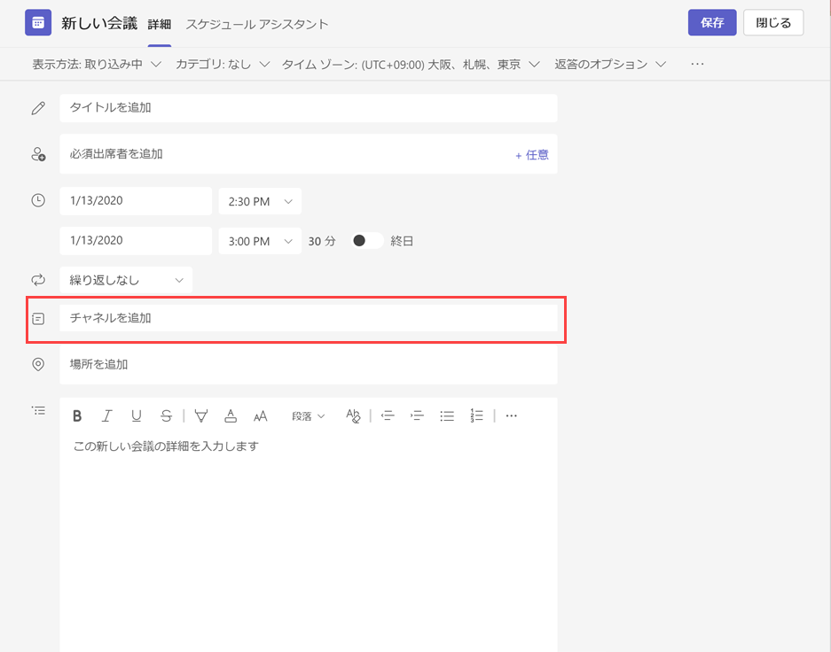
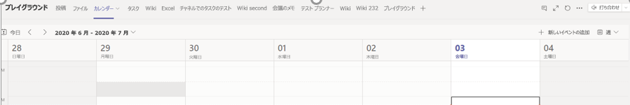
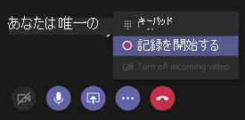
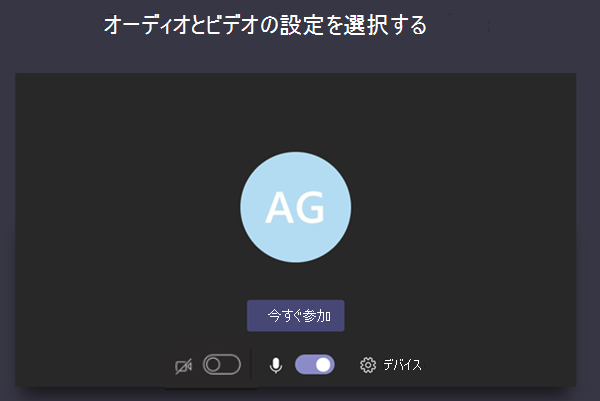
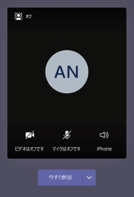
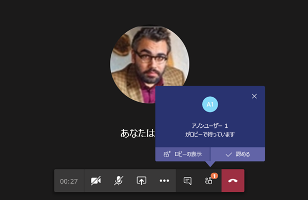
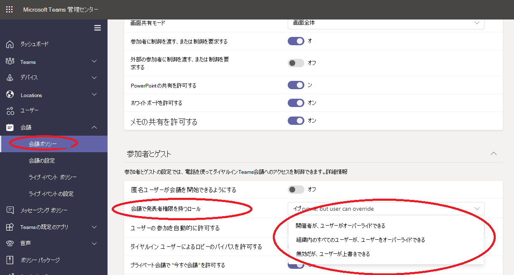

# Teams での会議ポリシーを管理する

::: zone target="docs"
会議ポリシーを使用して、組織内のユーザーがスケジュールした会議の会議参加者が使用できる機能を制御します。 自動的に作成されるグローバル (組織全体の既定) ポリシーを使用することも、カスタム ポリシーを作成して割り当てることもできます。 会議ポリシーは、Microsoft Teams 管理センターで管理するか、[PowerShell](teams-powershell-overview.md) を使用して管理します。

> [!NOTE]
> ロールを使用して、会議の発表者や出席者の権限を管理する方法の詳細については、「[Teams会議の役割](https://support.microsoft.com/office/roles-in-a-teams-meeting-c16fa7d0-1666-4dde-8686-0a0bfe16e019?ui=en-us&rs=en-us&ad=us)」を参照してください。

次の方法でポリシーを実装できます。これらの方法は、会議の開始前、会議中、または会議後のユーザーの会議エクスペリエンスに影響します。

|実装の種類  |説明  |
|---------|---------|
|開催者単位    |開催者単位のポリシーを実装すると、すべての参加者は開催者のポリシーを継承します。 たとえば、ユーザー **を自動的に参加を認める** のは開催者ごとのポリシーです。 ユーザーが会議に直接参加するか、ポリシーが割り当てられたユーザーによってスケジュールされた会議をロビーで待つのかを制御します。          |
|ユーザーごと    |ユーザーごとのポリシーを実装すると、ユーザーごとのポリシーのみが適用され、開催者や会議参加者に対する特定の機能が制限されます。 たとえば、[**チャネルで "今すぐ会議" を許可する**] は、ユーザー単位のポリシーです。     |
|開催者単位およびユーザーごと     |開催者単位とユーザー単位のポリシーを組み合わせて実装すると、会議の参加者はユーザーのポリシーと開催者のポリシーに基づいて特定の機能が制限されます。 たとえば、[**クラウド記録を許可する**] は、開催者単位およびユーザーごとのポリシーです。 ユーザーが記録を開始および停止するには、この設定をオンにします。

グローバル ポリシーの設定を編集したり、1 つまたは複数のカスタム ポリシーを作成して割り当てることができます。 カスタム ポリシーを作成して割り当てていない場合、ユーザーにはグローバル ポリシーが適用されます。

> [!NOTE]
> [会議の詳細] ボタンは、ユーザーがオーディオ会議ライセンスを有効にしているか、ユーザーがオーディオ会議に許可されている場合に使用できます。それ以外の場合、会議の詳細は利用できません。

## カスタムのチーム ポリシーを作成する

1. Microsoft Teams 管理センターの左側のナビゲーションで、[**会議**]  >  [**会議ポリシー**] の順に移動します。
2. **[追加]** を選択します。
3. ポリシーの名前と説明を入力します。 名前に特殊文字を含めたり、64 文字より長くすることはできません。
4. 希望する設定を選びます。
5. **[保存]** を選択します。

たとえば、多数のユーザーがいて、会議に必要な帯域幅を制限するとします。 「制限された帯域幅」という名前の新しいカスタム ポリシーを作成し、次の設定を無効にできます。

[**オーディオとビデオ**] で、

- [クラウド記録を許可する] を無効にします。
- [IP のビデオを許可する] を無効にします。

[**コンテンツの共有**] で、

- 画面共有モードを無効にします。
- [ホワイトボードを許可] を無効にします。
- [メモの共有を許可する] を無効にします。

その後、ポリシーをユーザーに割り当てます。

## 会議 ポリシーの編集

グローバル ポリシーおよび作成したカスタム ポリシーを編集できます。

1. Microsoft Teams 管理センターの左側のナビゲーションで、[**会議**]  >  [**会議ポリシー**] の順に移動します。
2. ポリシー名の左側をクリックしてポリシーを選び、**[編集]** を選択します。
3. ここで、希望する変更を行います。
4. **[保存]** を選択します。

> [!NOTE]
> ユーザーに割り当てることができる会議ポリシーは一度に 1 つのみです。

## ユーザーに会議ポリシーを割り当てる

[!INCLUDE [assign-policy](includes/assign-policy.md)]

> [!NOTE]
> ユーザーが割り当てられているポリシーは削除できません。 影響を受けるすべてのユーザーにまず異なるポリシーを割り当ててから、元のポリシーを削除できます。

## 会議ポリシーの設定

[会議ポリシー] ページで既存のポリシーを **選択するか、[追加** ] を選択 **して新しい** ポリシーを追加します。 次の設定を構成します。

- [全般](#meeting-policy-settings---general)
- [オーディオとビデオ](#meeting-policy-settings---audio--video)
- [コンテンツの共有](#meeting-policy-settings---content-sharing)
- [参加者とゲスト](#meeting-policy-settings---participants--guests)

::: zone-end

## 会議ポリシーの設定 - 全般

- [チャネルで "今すぐ会議" を許可する](#allow-meet-now-in-channels)
- [Outlook アドインを許可する](#allow-the-outlook-add-in)
- [チャネルの会議スケジュールを許可する](#allow-channel-meeting-scheduling)
- [プライベート会議のスケジュールを許可する](#allow-scheduling-private-meetings)
- [プライベート会議で "今すぐ会議" を許可する](#allow-meet-now-in-private-meetings)

### チャネルで "今すぐ会議" を許可する

[**今すぐ会議**] を許可することはユーザーごとのポリシーであり、会議が始まる前に適用されます。 この設定は、ユーザーが Teams チャネルで予定外の会議を開始できるかどうかを制御します。 この設定をオンにすると、ユーザーは [会議] ボタンを選択して、予定外の会議を開始したり、チャネルで会議をスケジュールできます。 既定値は True です。

![メッセージの下の [今すぐ会議] アイコンが表示されたスクリーンショット](media/meeting-policies-meet-now.png)

### Outlook アドインを許可する

Outlook アドインはユーザーごとのポリシーであり、会議を開始する前に適用されます。 この設定は、Outlook (Windows、Mac、Web、およびモバイル) 内から Teams 会議をスケジュールできるかどうかを制御します。

この機能をオフにした場合、ユーザーはスケジュールを設定できません。 Outlook で新しい会議を作成するときに Teams 会議をスケジュールできなくなります。 たとえば、Windows 上の Outlook では、[**新しい Teams 会議**] オプションはリボンに表示されません。

### チャネルの会議スケジュールを許可する

既存の[AllowChannelMeetingScheduling] ポリシーを使用して、チームのチャネルの予定表で作成できるイベントの種類を制御します。 これはユーザーごとのポリシーであり、会議が始まる前に適用されます。 この設定は、ユーザーが Teams チャネルで会議をスケジュールできるかどうかを制御します。 既定では、この設定は[オン] に設定されています。

このポリシーが無効になっている場合、ユーザーは新しいチャネル会議を作成できます。 ただし、既存のチャネル会議は、イベントの開催者が編集できます。

会議のスケジュールは無効になります。

 ![Teams の [会議のスケジュール] オプション](media/schedule-meeting-option.png)

チャネルの選択が無効になっています。

[チャネルの投稿] ページで、次の機能を無効にします。

- [チャネル返信の作成] ボックスの [**会議のスケジュール**] ボタン
  ![ [会議のスケジュール] ボタン返信作成ボックス](media/schedule-meeting-disabled-in-chat2.png)
  
- チャネル ヘッダーの [**会議のスケジュール**] ボタン。
  ![チャネル ヘッダーの [会議のスケジュール] ボタン](media/schedule-now-in-header.png)

[チャネル カレンダー] で、次の操作を行います。

- チャンネル予定表ヘッダーの[**新しいイベントの追加**] ボタンは、無効になります。
  

- ユーザーは、チャネル予定表の時間ブロックをドラッグして選択して、チャネル会議を作成できない。

- ユーザーがキーボード ショートカットを使用して、チャンネル予定表で会議を作成することはできません。

管理センターにて

[アプリのアクセス許可ポリシー] ページの [**Microsoft アプリ**] セクションに、チャネル カレンダー アプリが表示されます。

 

### プライベート会議のスケジュールを許可する

プライベート会議のスケジュールはユーザーごとのポリシーであり、会議を開始する前に適用されます。 この設定は、ユーザーが Teams でプライベート会議をスケジュールできるかどうかを制御します。 チームのチャネルに公開されていない会議はプライベートです。

[プライベート会議の **スケジュール設定** とチャネル会議のスケジュールを許可する]をオフにすると、Teams のユーザーに対して [必須出席者の追加] と [チャネルの追加] オプションが無効になります。  既定では、この設定は[オン] に設定されています。

### プライベート会議で "今すぐ会議" を許可する

これはユーザーごとのポリシーであり、会議が始まる前に適用されます。 この設定は、ユーザーが予定外のプライベート会議を開始できるかどうかを制御します。 既定では、この設定は[オン] に設定されています。

## 会議ポリシーの設定 - オーディオとビデオ

- [文字起こしを許可する](#allow-transcription)
- [クラウド記録を許可する](#allow-cloud-recording)
- [IP オーディオ用モード](#mode-for-ip-audio)
- [IP ビデオ用モード](#mode-for-ip-video)
- [IP ビデオを許可する](#allow-ip-video)
- [メディア ビット レート (KBs)](#media-bit-rate-kbs)

### 文字起こしを許可する

このポリシーはライブ トランスクリプションを有効にします。 トランスクリプションを許可するポリシーはユーザーごとのポリシーです。 この設定では、この特定のチームの会議を文字起こしできるかどうかを制御します。

ライブ トランスクリプションでは、Teams 会議中の音声テキスト変換がほぼリアルタイムで表示されます。 テキストは、発表者の名前やタイム スタンプなど、会議ビデオの一緒に表示されます。 詳細については、「Teams 会議でライブ [トランスクリプションを表示する」を参照してください](https://support.microsoft.com/office/view-live-transcription-in-a-teams-meeting-dc1a8f23-2e20-4684-885e-2152e06a4a8b?storagetype=live)。

現在、ライブ トランスクリプションは Teams デスクトップ クライアントでサポートされています。 トランスクリプションは、米国の音声英語でサポートされています。 トランスクリプトは、Teams デスクトップまたは Web での会議の後に利用できます。

[トランスクリプションを許可する] と **[** クラウド録画を許可する] **ポリシー** の設定を組み合わせて使用する方法を示します。 次の表では、これらの設定の値と会議の動作について説明します。

|文字起こしを許可する|クラウド記録を許可する|動作|
|---------|---------|---------|
|**オン**|**オン**|[ **トランスクリプションの** 開始] オプションは、Teams 会議で使用できます。 会議の開催者または会議の参加者は、議事の開始と停止を行います。 [ **レコーディングの開始]** オプションは、Teams 会議で使用できます。 会議の開催者または会議の参加者は、記録の開始と停止を行います。 |
|**オン**|**オフ**|[ **トランスクリプションの** 開始] オプションは、Teams 会議で使用できます。 [ **レコーディングの開始]** オプションは、Teams 会議では使用できません。 |
|**オフ**|**オン**|[ **レコーディングの開始]** オプションは、Teams 会議で使用できます。 [ **トランスクリプションの** 開始] オプションは、Teams 会議では使用できません。|
|**オフ**|**オフ**|記録とトランスクリプションは、Teams 会議では使用できません。  |

### クラウド記録を許可する

クラウド記録の許可は、ユーザーごとのポリシーで制御されます。 この設定は、ユーザーが記録できるかどうかを制御します。 特定のポリシー設定が有効になっている場合、および開催者と同じ組織から認証されたユーザーである場合は、会議の開催者または別の会議参加者が記録を開始できます。

フェデレーション ユーザーや匿名ユーザーなど、組織外のユーザーは記録を開始できません。 ゲスト ユーザーは記録を開始または停止できません。

次の例を見てみましょう。

|ユーザー |会議ポリシー  |クラウド記録を許可する |
|---------|---------|---------|
|Daniela | グローバル   | オフ |
|Amanda | Location1MeetingPolicy | オン|
|John (外部ユーザー) | 該当なし | 該当なし|

Daniela は、彼女が開催者だった場合でも、ポリシーがオフに設定されているので記録できない。 ポリシー設定を有効にしている Amanda は、Daniela が開催した会議も含めて会議を記録できます。 Amanda が会議を開催する場合は、その会議を記録できます。 ただし、ポリシー設定が無効になっている Daniela と、外部ユーザーである John は、その会議を記録できません。

クラウド会議の記録の詳細については、「[Teams のクラウド会議の記録](cloud-recording.md)」を参照してください。

### IP オーディオ用モード

IP オーディオのモードはユーザーごとのポリシーです。 この設定は、ユーザーが会議やグループ通話でオーディオを有効にできるかどうかを制御します。 この設定の値は次のとおりです。

|値を設定する |動作  |
|---------|---------|
|**送信オーディオと受信オーディオが有効**    |会議での送信および受信オーディオは、許可されます。 これは、既定の設定です。 |
|**無効**     |会議の送信オーディオと受信オーディオはオフになっています。     |

ユーザーに **対して [無効]** に設定した場合、そのユーザーは引き続き会議をスケジュールおよび整理できますが、音声を使用することはできません。 会議に参加するには、ユーザーが公衆交換電話網 (PSTN) を介してダイヤルインするか、電話でユーザーに参加するために会議通話を行う必要があります。 (匿名の参加者などの) ポリシーが割り当てられていない会議の参加者は、規定でこの設定が **送受信オーディオが有効** に設定されています。 Teams のモバイル クライアントでは、この設定を無効にすると、ユーザーは PSTN 経由で会議にダイヤル インする必要があります。

この設定は、1 対 1 の通話には適用されません。 1 対 1 の通話を制限するには、Teams の [通話ポリシー](teams-calling-policy.md) を構成して、[**プライベート通話を行う**] 設定をオフにします。 この設定は、Surface Hub や Microsoft Teams Rooms デバイスなどの会議室内のデバイスには適用されません。

この設定は、Microsoft 365 Government Community Cloud (GCC)、GCC 高、または国防総省 (DoD) 環境ではまだ利用できません。

詳細については、「[会議の参加者のオーディオ/ビデオ管理](#manage-audiovideo-for-meeting-participants)」を参照してください。

### IP ビデオ用モード

IP ビデオのモードはユーザーごとのポリシーです。 この設定は、会議、およびグループ通話でビデオを有効にできるかどうかを制御します。 この設定の値は次のとおりです。

|値を設定する |動作  |
|---------|---------|
|**送信ビデオと受信ビデオの有効化**    | 会議では、送信ビデオと受信ビデオが既定の設定で許可されます。 |
|**無効**     | 会議で送信ビデオと受信ビデオはオフになっています。 Teams モバイル クライアントでは、会議でビデオや写真を共有することはできません。   IP **オーディオのモードが無効** になっている場合 **、IP ビデオ** のモードも無効なままです。  |

ユーザーに対して **無効** に設定すると、そのユーザーはビデオをオンにしたり、他の会議参加者から共有されたビデオを閲覧できなくなります。 (匿名の参加者などの) ポリシーが割り当てられていない会議の参加者は、規定で **送受信ビデオが有効** に設定されています。

この設定は、Surface Hub や Microsoft Teams Rooms デバイスなどの会議室内のデバイスには適用されません。

この設定は、Microsoft 365 Government Community Cloud (GCC)、GCC 高、または国防総省 (DoD) 環境ではまだ利用できません。

> [!NOTE]
> この設定は送信ビデオと受信ビデオの両方を制御するのに対して、[**IP ビデオの許可**] 設定は送信ビデオのみを制御します。 詳細については、「[どちらの IP ビデオ ポリシーの設定が優先されますか?](#which-ip-video-policy-setting-takes-precedence)」と「[ミーティングの参加者を対象にしたオーディオ/ビデオの管理](#manage-audiovideo-for-meeting-participants)」を参照してください。

詳細については、「[会議の参加者のオーディオ/ビデオ管理](#manage-audiovideo-for-meeting-participants)」を参照してください。

### IP ビデオを許可する

許可 IP ビデオは、開催者ごとのポリシーとユーザーごとのポリシーの組み合わせです。 ビデオは、会議の重要な構成要素です。 一部の組織では、管理者はどのユーザーの会議でビデオを使用するかについてより詳細に制御したい場合があります。 この設定は、ユーザーがホストする会議、およびユーザーが開始する 1 対 1 の通話やグループ通話でビデオを有効にできるかどうかを制御します。 Teams モバイル クライアントでは、この設定を使用して、ユーザーが会議で写真とビデオを共有できるかどうかを制御します。

このポリシー設定を有効にしたユーザーが開催する会議では、会議の参加者もポリシー設定を有効にしている場合に、会議の参加者による会議でのビデオ共有が許可されます。 いずれのポリシーも割り当てられていない会議参加者 (匿名参加者やフェデレーション参加者など) は、会議開催者のポリシーを継承します。

> [!NOTE]
> この設定は送信ビデオを制御するのに対し、**IPビデオのモード** 設定は、ビデオの送信と受信両方を制御することにお気をつけください。 詳細については、「[どちらの IP ビデオ ポリシーの設定が優先されますか?](#which-ip-video-policy-setting-takes-precedence)」と「[ミーティングの参加者を対象にしたオーディオ/ビデオの管理](#manage-audiovideo-for-meeting-participants)」を参照してください。

| Teams デスクトップおよび Web クライアント |Teams モバイル クライアント  |
|:-------:|:-------:|
|    |          |

次の例を見てみましょう。

|ユーザー |会議ポリシー  |IP ビデオを許可する |
|---------|---------|---------|
|Daniela   | グローバル   | オン       |
|Amanda    | Location1MeetingPolicy        | オフ      |

Daniela が開催する会議では、ビデオを有効にすることができます。 Daniela は会議に参加してビデオを有効にすることができます。 Amanda は、Amanda のポリシーでビデオを許可していないので、Daniela の会議でビデオを有効にできない。 Amanda は、会議の他の参加者が共有しているビデオを見ることができます。

Amanda が主催する会議では、割り当てられたビデオ ポリシーに関係なく、誰もビデオを有効にできません。 これは、Daniela が Amanda の会議でビデオを有効にできないことを意味します。  

Daniela がビデオを有効にして Amanda に電話した場合でも、Amanda はオーディオのみで通話に応答することになります。 通話が接続されると、Amanda は Daniela のビデオを見ることができますが、ビデオを有効にすることはできません。 Amanda が Daniela に電話すると、Daniela はビデオとオーディオで電話に出ることができます。 通話が接続されると、Daniela は必要に応じてビデオを有効または無効にできます。

詳細については、「[会議の参加者のオーディオ/ビデオ管理](#manage-audiovideo-for-meeting-participants)」を参照してください。

#### 優先される IP ビデオ ポリシーの設定

ユーザーの場合、ビデオの設定が最も制限の厳しいポリシーが優先されます。 次に例を示します。

|IP ビデオを許可する|IP ビデオ用モード|会議エクスペリエンス|
|---------|---------|---------|
|開催者: **オン**  参加者 : **オン** |参加者: **無効**        |**IP ビデオのモード** 設定が優先されます。 このポリシーが割り当てられている参加者は、他のユーザーが共有しているビデオを有効にしたり、または表示することはできません。|
|開催者: **オン**  参加者 : **オン** |参加者: **送信ビデオと受信ビデオが有効**          |このポリシーが割り当てられている参加者は、他のユーザーが共有しているビデオを有効にしたり、または表示することができます。         |
|開催者: **オン**  参加者: **オフ** |参加者: **送信ビデオと受信ビデオが有効**         |**IP ビデオの許可** 設定が優先されます。 参加者は、受信ビデオのみを見ることができ、ビデオの送信はできません。         |
|開催者: **オン**  参加者: **オフ** |参加者: **無効**         |**IP ビデオのモード** 設定が優先されます。 参加者には、受信または送信ビデオが表示されません。|
|開催者: **オフ**    |       |[**IP ビデオの許可**]設定が優先されるのは、開催者には、これがオフになっているからです。 このポリシーが割り当てられているユーザーによって開催される会議では、誰もビデオをオンにすることはできません。         |

### ミーティング参加者のオーディオ/ビデオを管理する

|もしこういう場合は...  |次のポリシーを設定する  |
|---------|---------|
|会議に参加している場合は、オーディオとビデオをオフにする  |IP オーディオのモード: **無効**  IP ビデオのモード: **無効** IP ビデオの許可: 該当なし       |
|会議の参加者に受信ビデオとオーディオだけを有効にする  |IP オーディオ用モード: **オーディオの送受信が有効**  IP ビデオ用モード: **ビデオの送受信が有効** IP ビデオを許可: **オフ**       |
|会議の参加者にビデオを無効にする (参加者にはオーディオのみ)|  IP オーディオ用モード: **オーディオの送受信を有効にする**  IP ビデオのモード: **無効** IP ビデオの許可: 該当なし
|会議の参加者に対してオーディオとビデオを有効にする    |IP オーディオ用モード: **オーディオの送受信が有効** (既定)  IP ビデオ用モード: **ビデオの送受信が有効** (既定) IP ビデオを許可する: **オン** (既定)    |

会議の開催者のポリシーとユーザーのポリシーの間で最も制限の厳しいポリシーが適用されます。 たとえば、開催者がビデオを制限するポリシーを使用していて、ユーザーのポリシーがビデオを制限していない場合、会議参加者は会議の開催者のポリシーを継承し、会議のビデオにはアクセスできません。 つまり、参加者は会議に音声のみで参加することができます。

> [!NOTE]
> ユーザーが電話で参加するためにグループ通話を開始した場合、[**オーディオに電話を使用する**] 画面は表示されません。 これは既知の問題であり、解決に向けて取り組んでいます。 この問題を回避するには、[**その他の参加オプション**] の [**オーディオとしての電話**] を選択します。  

#### Teams モバイル クライアント

Teams モバイル クライアントのユーザーの場合、会議中に写真やビデオを共有する機能は **、[IP** ビデオの許可] または [IP ビデオ] モード **の設定によって決** まります。 優先されるポリシー設定によっては、ビデオや写真を共有する機能を利用できません。 これは、画面の共有には影響しません。「[スクリーン共有モード](#screen-sharing-mode)」設定を使用して別個に構成します。 また、モバイル ユーザーが携帯電話接続を介して IP ビデオを使用できないように、[Teams モビリティ ポリシー](https://docs.microsoft.com/powershell/module/skype/new-csteamsmobilitypolicy) を設定できます。これは WiFi 接続を使用する必要があること意味します。

### メディア ビット レート (KBs)

これは、ユーザーごとのポリシーです。 この設定では、ユーザーの通話や会議での音声、ビデオ、ビデオベースのアプリ共有転送のメディア ビット レートの平均を決定します。 通話または会議のユーザーのアップリンクとダウンリンクの両方のメディア トラバーサルに適用されます。 この設定により、組織の帯域幅の管理をきめ細やかに制御できます。 ユーザーが必要とする会議シナリオに応じて、高品質のエクスペリエンスを得るために十分な帯域幅を用意することをお勧めします。 最小値は 30 Kbps で、最大値は会議シナリオによって異なります。 Teams での高品質の会議、通話、およびライブ イベントを実現する最小推奨帯域幅の詳細については、「[帯域幅要件](prepare-network.md#bandwidth-requirements)」を参照してください。

会議に十分な帯域幅がない場合、参加者にはネットワーク品質の低下を示すメッセージが表示されます。

CEO 役員会議や Teams のライブ イベントなど、最高品質のビデオ エクスペリエンスを必要とする会議では、帯域幅を 10 Mbps に設定することをお勧めします。 最大限のエクスペリエンスが設定されている場合でも、特定のネットワーク条件が検出されると、シナリオに応じて、Teams メディア スタックは低帯域幅の条件に適応します。

## 会議ポリシーの設定 - コンテンツの共有

- [画面共有モード](#screen-sharing-mode)
- [参加者に制御を渡す、または制御を要求する](#allow-a-participant-to-give-or-request-control)
- [外部の参加者に制御を渡す、または制御を要求する](#allow-an-external-participant-to-give-or-request-control)
- [PowerPoint の共有を許可する](#allow-powerpoint-sharing)
- [ホワイトボードを許可する](#allow-whiteboard)
- [メモの共有を許可する](#allow-shared-notes)

### 画面共有モード

> [!NOTE]
> この機能はまだ開発中です。 画面共有は参加者ごとのポリシーですが、このセクションで説明するように、開催者の画面共有設定の影響を受ける可能性があります。

この設定は、ユーザーの会議でデスクトップやウィンドウの共有を許可するかどうかを制御します。 ポリシーが割り当てられていない会議参加者 (匿名参加者、ゲスト参加者、B2B 参加者、フェデレーション参加者など) は、会議開催者のポリシーを継承します。

|値を設定する |動作  |
|---------|---------|
|**画面全体**    | 会議では完全なデスクトップ共有とアプリケーション共有が許可されます |
|**単一アプリケーション**   | 会議ではアプリケーションの共有が許可されます        |
|**無効**     |会議では画面共有とアプリケーション共有が無効になります。       |

次の例を見てみましょう。

|ユーザー |会議ポリシー |画面共有モード |
|---------|---------|---------|
|Daniela  | グローバル   | 画面全体 |
|Amanda   | Location1MeetingPolicy  | 無効 |

Daniela が開催する会議では、会議の参加者が画面全体または特定のアプリケーションを共有できます。 Amanda が Daniela の会議に参加すると、ポリシー設定が無効になっているため、Amanda は自分の画面または特定のアプリケーションを共有できません。 Amanda がホストする会議では、割り当てられた画面共有モード ポリシーに関係なく、誰も画面または単一のアプリケーションを共有できません。 つまり、Daniela は Amanda の会議で自分の画面や単一のアプリケーションを共有することはできません。  

現在、ユーザーは Google Chrome を使用している場合、Teams 会議でビデオを再生したり画面を共有したりすることはできません。

### 参加者に制御を渡す、または制御を要求する

これは、ユーザーごとのポリシーです。 この設定は、ユーザーが他の会議参加者に共有デスクトップまたはウィンドウの制御を渡すことができるかどうかを制御します。 制御を渡すには、画面の上部にカーソルを合わせます。

ユーザーに対してこの設定が有効になっている場合、共有セッションの上部のバーに [**制御を渡す**] オプションが表示されます。

![[制御を渡す] オプションが表示されたスクリーンショット](media/meeting-policies-give-control.png)

ユーザーの設定がオフになっている場合、[制御を渡す] **オプションは** 使用できません。

![[制御を渡す] オプションが利用できないことを示すスクリーンショット](media/meeting-policies-give-control-not-available.png)

次の例を見てみましょう。

|ユーザー |会議ポリシー  |参加者に制御を渡す、または制御を要求する |
|---------|---------|---------|
|Daniela   | グローバル   | オン       |
|Babek    | Location1MeetingPolicy        | オフ   |

Daniela は、Babek が開催する会議の他の参加者に共有デスクトップまたはウィンドウの制御を渡すことができますが、Babek は他の参加者に制御を渡すことができません。

制御を渡したり、制御要求を受け入れたりすることができるユーザーを PowerShell を使用して制御するには、AllowParticipantGiveRequestControl コマンドレットを使用します。

> [!NOTE]
> 共有中に共有コンテンツの制御を渡したり受け取ったりするには、両者が Teams デスクトップ クライアントを使用している必要があります。 いずれかの当事者がブラウザーで Teams を実行している場合、制御はサポートされません。 これは、修正する予定の技術的制限によるものです。

### 外部の参加者に制御を渡す、または制御を要求する

これは、ユーザーごとのポリシーです。 組織がユーザーに対してこの設定を行ったかどうかは、会議の開催者が設定した内容に関係なく、外部の参加者ができることを制御するものではありません。 このパラメーターは、組織の会議ポリシー内において、共有先が設定した内容に応じて、外部の参加者に共有スクリーンの制御または制御の依頼を許可するかどうかを制御します。 Teams 会議の外部参加者は、次のように分類できます。  

- 匿名ユーザー
- ゲスト ユーザー  
- B2B ユーザー
- フェデレーション ユーザー  

フェデレーション ユーザーが共有中に外部ユーザーに制御を渡すことができるかどうかは、組織の「**外部の参加者に制御を渡す、または制御を要求する**」設定によって制御されます。

PowerShell を使用して、外部の参加者が制御を渡すことができるか、または制御要求を受け入れることができるかを制御するには、AllowExternalParticipantGiveRequestControl コマンドレットを使用します。

### PowerPoint の共有を許可する

これは、ユーザーごとのポリシーです。 この設定は、ユーザーが会議で PowerPoint スライド セットを共有できるかどうかを制御します。 匿名ユーザー、ゲスト ユーザー、フェデレーション ユーザーを含む外部ユーザーは、会議開催者のポリシーを継承します。

次の例を見てみましょう。

|ユーザー |会議ポリシー  |PowerPoint の共有を許可する |
|---------|---------|---------|
|Daniela   | グローバル   | オン       |
|Amanda   | Location1MeetingPolicy        | オフ   |

Amanda は、会議の開催者であっても、PowerPoint スライド セットを会議で共有することはできません。 Daniela は、会議が Amanda によって開催されている場合でも、PowerPoint スライド セットを共有することができます。 Amanda は、PowerPoint スライド セットを共有できない場合でも、会議の他のユーザーによって共有されている PowerPoint スライド セットを表示することができます。

### ホワイトボードを許可する

これは、ユーザーごとのポリシーです。 この設定は、ユーザーが会議でホワイトボードを共有できるかどうかを制御します。 匿名ユーザー、B2B ユーザー、およびフェデレーション ユーザーを含む外部ユーザーは、会議開催者のポリシーを継承します。

次の例を見てみましょう。

|ユーザー |会議ポリシー  |ホワイトボードを許可する|
|---------|---------|---------|
|Daniela   | グローバル   | オン       |
|Amanda   | Location1MeetingPolicy        | オフ   |

Amanda は、会議の開催者であっても、会議でホワイトボードを共有することはできません。 Daniela は、Amanda が会議を開催する場合でも、ホワイトボードを共有することができます。  

### メモの共有を許可する

これは、ユーザーごとのポリシーです。 この設定は、ユーザーが会議でメモを作成および共有できるかどうかを制御します。 匿名ユーザー、B2B ユーザー、およびフェデレーション ユーザーを含む外部ユーザーは、会議開催者のポリシーを継承します。 [ **会議のメモ]** タブは、最大 100 人の参加者を含む会議でサポートされます。

次の例を見てみましょう。

|ユーザー |会議ポリシー  |メモの共有を許可する |
|---------|---------|---------|
|Daniela   | グローバル   | オン       |
|Amanda   | Location1MeetingPolicy | オフ |

Daniela は Amanda の会議でメモを取ることができ、Amanda はすべての会議でメモを取ることができません。

<!-- Bookmark used by Context Sensitive Help (CSH). Do not delete. -->

<!-- Do not remove the bookmark link above. -->

## 会議ポリシーの設定 - 参加者とゲスト

これらの設定では、会議への入室が許可されるまでロビーで待機する必要がある会議参加者およびそれらの参加者に許可する会議への参加レベルが制御されます。

- [匿名ユーザーが会議を開始できるようにする](#let-anonymous-people-start-a-meeting)
- [ユーザーの参加を自動的に許可する](#automatically-admit-people)
- [ダイヤルイン ユーザーによるロビーのバイパスを許可する](#allow-dial-in-users-to-bypass-the-lobby)
- [ライブ キャプションを有効にする](#enable-live-captions)
- [会議でチャットを許可する](#allow-chat-in-meetings)

> [!NOTE]
>会議に参加するためのオプションは、各 Teams グループの設定および接続方法によって異なります。 グループに電話会議があり、それを使用して接続する場合は、「[電話会議](https://docs.microsoft.com/microsoftteams/audio-conferencing-in-office-365)」を参照してください。 Teams グループに電話会議がない場合は、「[Teams で会議に参加](https://support.office.com/article/join-a-meeting-in-teams-1613bb53-f3fa-431e-85a9-d6a91e3468c9)」を参照してください。

### 匿名ユーザーが会議を開始できるようにする

これは、リーダーレス会議を許可する開催者ごとのポリシーです。 この設定では、出席している組織から認証されたユーザーなしで匿名ユーザーが会議に参加できるかどうかを制御します。 既定では、この設定はオフになっています。つまり、匿名ユーザーは、組織の認証されたユーザーが会議に参加するまでロビーで待機します。

> [!NOTE]
> この設定がオフになっていて、匿名ユーザーが最初に会議に参加し、ロビーに配置されている場合、組織のユーザーがロビーからユーザーを許可するには、Teams クライアントで会議に参加する必要があります。 ダイヤル インのユーザーに使用できるロビー コントロールはありません。

### ユーザーの参加を自動的に許可する

これは開催者単位のポリシーです。 この設定は、ユーザーが会議に直接参加するのか、認証ユーザーにより入室が許可されるまでロビーで待機するのかを制御します。 この設定はダイヤルイン ユーザーには適用されません。

 会議の開催者は、会議出席 **依頼** で [会議オプション] を選択して、スケジュールした会議ごとにこの設定を変更できます。

> [!NOTE]
> [会議] のオプションの設定には、"ロビーをバイパスできるユーザー" のラベルが表示されます。 ユーザーの既定の設定を変更すると、そのユーザーによって開催されたすべての新しい会議に適用され、ユーザーが会議のオプションを変更していない以前の会議にも適用されます。
  
|値を設定する  |参加動作 |
|---------|---------|
|**すべてのユーザー**   |すべての会議参加者は、ロビーで待たずに会議に直接参加します。 これには、認証されたユーザー、信頼された組織の外部ユーザー (フェデレーション)、ゲスト、匿名ユーザーが含まれます。     |
|**組織内およびフェデレーション組織のすべてのユーザー**     |ゲスト ユーザーや信頼された組織のユーザーなど、組織内の認証ユーザーは、ロビーで待たずに会議に直接参加します。  匿名ユーザーは、ロビーで待機します。   |
|**組織内のすべてのユーザー**    |ゲスト ユーザーを含む組織内の認証ユーザーは、ロビーで待たずに会議に直接参加します。  信頼された組織および匿名ユーザーのユーザーが、ロビーで待機します。 これは、既定の設定です。           |
|**開催者のみ**    |会議の開催者のみが、ロビーで待たずに会議に直接参加します。 組織内の認証されたユーザー、ゲストユーザー、信頼された組織からのユーザーと匿名ユーザーを含むそれ以外のすべてのユーザーは、ロビーで待機する必要があります。           |

### ダイヤルイン ユーザーによるロビーのバイパスを許可する

これは開催者単位のポリシーです。 この設定では、スマートフォンでダイヤル インするユーザーが会議に直接参加するのか、[**ユーザーの参加を自動的に許可する**] の設定に関わらずロビーで待機するのかを制御します。 既定では、この設定は [オフ] です。 この設定をオフにすると、ダイヤルイン ユーザーは、組織のユーザーが Teams クライアントで会議に参加し、許可されるまでロビーで待機します。 この設定をオンにすると、組織のユーザーが会議に参加したときにダイヤルインユーザーが自動的に会議に参加できます。

> [!NOTE]
> 組織のユーザーが会議に参加する前に、ダイヤルイン ユーザーが会議に参加すると、組織のユーザーがチームのクライアントと共に会議に参加して、そのユーザーを入室させるまで、ダイヤルインユーザーはロビーに入ります。 ユーザーの既定の設定を変更すると、そのユーザーによって開催されたすべての新しい会議に適用され、ユーザーが会議のオプションを変更していない以前の会議にも適用されます。

### ライブ キャプションを有効にする

これはユーザーごとのポリシーであり、会議中に適用されます。 この設定は、ユーザーが参加する会議でライブ キャプションを有効または無効にするために、[**ライブ キャプションを有効にする**] オプションを使用できるかどうかを制御します。  

![[ライブ キャプションを有効にする] オプションが表示されたスクリーンショット](media/meeting-policies-live-captions.png)

|値を設定する |動作  |
|---------|---------|
|**無効だが、ユーザーが上書きできる**     | 会議中にユーザーのライブ キャプションが自動的に有効になることはありません。 オーバーフロー (**...**) メニューに [**ライブ キャプションを有効にする**] オプションが表示され、それらを有効にします。 これは、既定の設定です。 |
|**無効**     | 会議中、ユーザーのライブ キャプションが無効になります。 ユーザーには、それらを有効にするオプションはありません。          |

### 会議でチャットを許可する

これは参加者単位の設定です。 この設定は、ユーザーの会議で会議チャットを許可するかどうかを制御します。

## 会議ポリシーの設定 - 指定された発表者の役割モード

これは、ユーザーごとのポリシーです。 この設定では、Teams クライアントの **会議オプション** の **誰がプレゼンをするか?** の設定の既定値を変更することができます。 このポリシー設定は、Meet Now (今すぐ会議) を含むすべての会議に影響します。

**誰がプレゼンをするか?** の設定を使用すると、会議の開催者は会議の発表者を選択することができます。 詳細については、「[Teams 会議の参加者設定の変更](https://support.microsoft.com/article/change-participant-settings-for-a-teams-meeting-53261366-dbd5-45f9-aae9-a70e6354f88e)」 と 「[Teams 会議での役割](https://support.microsoft.com/article/roles-in-a-teams-meeting-c16fa7d0-1666-4dde-8686-0a0bfe16e019)」を参照してください。

[Set-CsTeamsMeetingPolicy](https://docs.microsoft.com/powershell/module/skype/set-csteamsmeetingpolicy) コマンドレットを使用して、既存の Teams 会議ポリシーを編集することができます。 または、[New-CsTeamsMeetingPolicy](https://docs.microsoft.com/powershell/module/skype/new-csteamsmeetingpolicy) コマンドレットを使用して、新しい Teams の会議ポリシーを作成し、ユーザーに割り当てます。

Teams の **誰がプレゼンをするか?** 設定の既定値を指定するには、**DesignatedPresenterRoleMode** パラメーターを次のいずれかに設定します。

- **EveryoneUserOverride**: すべての会議参加者は発表者になることができます。 これが既定値です。 このパラメーターは、 Teams 内の **すべてのユーザー** の設定 に呼応します。
- **EveryoneInCompanyUserOverride**: 組織内の認証済みユーザー (ゲスト ユーザーを含む) は、発表者になることができます。 このパラメーターは、Teams の **組織内の人たち** 設定に呼応します。
- **OrganizerOnlyUserOverride**: 会議の開催者のみが発表者となり、他のすべての会議参加者が出席者として指定されます。 このパラメーターは、Teams の [**私だけ**] 設定に呼応します。

さらに、Teams 管理センターでこのポリシーを編集できます。

既定値を設定した後でも、会議の開催者はチームの設定を変更し、スケジュールした会議での発表者を選ぶことができることにご注意ください。

## 会議のポリシーの設定-会議出席レポート

これは、ユーザーごとのポリシーです。 この設定では、会議の開催者が [会議出席レポート](teams-analytics-and-reports/meeting-attendance-report.md)をダウンロードできるかどうかを制御します。

現在、このポリシー設定を構成することができるのは、PowerShell を使用した場合のみです。 [Set-CsTeamsMeetingPolicy](https://docs.microsoft.com/powershell/module/skype/set-csteamsmeetingpolicy) コマンドレットを使用して、既存の Teams 会議ポリシーを編集することができます。 または、[New-CsTeamsMeetingPolicy](https://docs.microsoft.com/powershell/module/skype/new-csteamsmeetingpolicy) コマンドレットを使用して、新しい Teams の会議ポリシーを作成し、ユーザーに割り当てます。

会議の開催者が会議の出席依頼のレポートをダウンロードできるようにするには、**AllowEngagementReport** パラメーターを [**有効**] に設定します。 有効にすると、**参加者** ウィンドウに、レポートをダウンロードするためのオプションが表示されます。

会議の開催者がレポートをダウンロードしないようにするには、パラメーターを [**無効**] に設定します。 既定では、この設定は無効になっており、レポートをダウンロードするオプションは利用できません。

## 会議ポリシーの設定-アイランド モードの会議のプロバイダー

これは、ユーザー単位のポリシーです。 この設定は、*アイランド モードのユーザー* がどの Outlook 会議アドインを使用するかを制御できます。 Teams 会議アドインのみを使用するか、Teams 会議アドインと Skype for Business 会議アドインの両方を使用するかを指定して、Outlook で会議をスケジュールできます。

このポリシーは、アイランドモードで、Teams の会議ポリシーで **AllowOutlookAddIn** パラメーターが **True** に設定されているユーザーにのみ適用できます。

現在、このポリシーを設定するには PowerShell を使用する必要があります。 [Set-CsTeamsMeetingPolicy](https://docs.microsoft.com/powershell/module/skype/set-csteamsmeetingpolicy) コマンドレットを使用して、既存の Teams 会議ポリシーを編集することができます。 または、[New-CsTeamsMeetingPolicy](https://docs.microsoft.com/powershell/module/skype/new-csteamsmeetingpolicy) コマンドレットを使用して、新しい Teams の会議ポリシーを作成し、ユーザーに割り当てます。

ユーザーが使用できる会議アドインを指定するには、次のように **PreferredMeetingProviderForIslandsMode** パラメーターを指定します。

- パラメーターを **TeamsAndSfB** に設定すると、Outlook の Teams 会議アドインと Skype for Business アドインの両方が有効になります。 これが既定値です。
- パラメーターを **Teams** に設定すると、Outlook の Teams 会議アドインのみが有効になります。 このポリシー設定では、今後のすべての会議にTeams の会議への参加リンクがあることが確実になります。 既存の Skype for Business 会議の参加リンクはTeams には移行されません。 このポリシー設定は、ユーザーが Skype for Business への参加、チャット、PSTN 通話、その他の機能を使用することに影響を与えません。ユーザーが Skype for Business の機能を引き続き使用できることを意味します。

  パラメーターを **Teams** に設定し、**の TeamsAndSfB** に戻すと、両方の会議アドインが有効になります。 既存の Teams 会議 **参加リンクは** Skype for Business に移行されません。 変更の後にスケジュールされた Skype for Business の会議のみが、Skype for Business の会議参加リンクを持つようになります。

## 会議ポリシーの設定-ビデオ フィルター モード

これは、ユーザー単位のポリシーです。 この設定では、ユーザーが会議のビデオの背景をカスタマイズできるかどうかを制御します。

現在、このポリシーを設定するには PowerShell を使用する必要があります。 [Set-CsTeamsMeetingPolicy](https://docs.microsoft.com/powershell/module/skype/set-csteamsmeetingpolicy) コマンドレットを使用して、既存の Teams 会議ポリシーを編集することができます。 または、 [の CsTeamsMeetingPolicy](https://docs.microsoft.com/powershell/module/skype/new-csteamsmeetingpolicy) コマンドレットを使用して新しいチームの会議ポリシーを作成し、ユーザーにポリシーを割り当てます。

ユーザーが会議のビデオの背景をカスタマイズできるかどうかを指定するには、次のように **VideoFiltersMode** パラメーターを設定します。

|PowerShell の値を設定する |動作  |
|---------|---------|
|**NoFilters**     |ユーザーがビデオの背景をカスタマイズすることはできません。|
|**BlurOnly**     |ユーザーはビデオの背景をぼかします。 |
|**BlurandDefaultBackgrounds**     |ユーザーは、ビデオの背景をぼかすか、背景として使用する画像を既定の画像セットから選ぶことができます。 |
|**AllFilters**     |ユーザーは、ビデオの背景をぼかしたり、既定の画像セットから選択したり、背景として使用するカスタム画像をアップロードしたりすることができます。 |

> [!IMPORTANT]
> ユーザーがアップロードした画像は、Teams はスクリーニングしません。 [**AllFilters**] を設定すると、ユーザーが不快な画像や不適切な画像をアップロードするのを防ぐ内部の組織ポリシーに準拠する必要があります。または、組織が Teams の会議の背景に使用する権限を持たないこともあります。

> [!NOTE]
> これらの機能は、一部の Teams クライアントでは使用できません。 詳細については、会議とライブ イベント _のビデオと_ 背景 [のタイトルを参照してください](https://support.microsoft.com/office/meetings-and-live-events-5c3e0646-dc37-45ad-84a4-1666fac62d4e)。

## 会議ポリシーの設定 - 会議の反応

AllowMeetingReactions の設定は、PowerShell を使用する場合にのみ適用できます。 Teams 管理センターから AllowMeetingReactions のオンとオフを切り替えるオプションはありません。

会議の反応は、既定ではオフになっています。 ユーザーに対する反応をオフにしても、ユーザーがスケジュールした会議でリアクションを使用できないという意味ではない。 会議の開催者は、既定の設定に関係なく、会議オプション ページからリアクションを有効にできます。

## 関連項目

- [Teams での PowerShell の概要](teams-powershell-overview.md)
- [ Teams でユーザーにポリシーを割り当てる](assign-policies.md)
- [ユーザーから RestrictedAnonymousAccess Teams 会議ポリシーを削除する](meeting-policies-restricted-anonymous-access.md)
