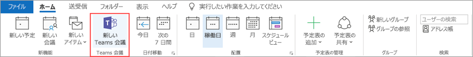

# Teams での会議ポリシーを管理するManage meeting policies in Teams

::: zone target="docs"
会議ポリシーを使用して、組織内のユーザーによってスケジュールされた会議への参加者が利用できる機能を制御します。Use meeting policies to control the features that are available to meeting participants for meetings that are scheduled by users in your organization. 自動的に作成されるグローバル (組織全体の既定) ポリシーを使用することも、カスタム ポリシーを作成して割り当てることもできます。You can use the global (Org-wide default) policy that's automatically created or create and assign custom policies. 会議ポリシーは、Microsoft Teams 管理センターで管理するか、[PowerShell](teams-powershell-overview.md) を使用して管理します。You manage meeting policies in the Microsoft Teams admin center or by using [PowerShell](teams-powershell-overview.md).

> [!NOTE]
> ロールを使用して、会議の発表者や出席者の権限を管理する方法の詳細については、「[Teams会議の役割](https://support.microsoft.com/office/roles-in-a-teams-meeting-c16fa7d0-1666-4dde-8686-0a0bfe16e019?ui=en-us&rs=en-us&ad=us)」を参照してください。For information about using roles to manage the permissions of meeting presenters and attendees, see [Roles in a Teams meeting](https://support.microsoft.com/office/roles-in-a-teams-meeting-c16fa7d0-1666-4dde-8686-0a0bfe16e019?ui=en-us&rs=en-us&ad=us).

次の方法でポリシーを実装できます。これらの方法は、会議の開始前、会議中、または会議後のユーザーの会議エクスペリエンスに影響します。You can implement policies in the following ways, which affect the meeting experience for users before a meeting starts, during a meeting, or after a meeting.

|実装の種類Implementation type  |説明Description  |
|---------|---------|
|開催者単位Per-organizer    |開催者単位のポリシーを実装すると、すべての参加者は開催者のポリシーを継承します。When you implement a per-organizer policy, all meeting participants inherit the policy of the organizer. たとえば、[**ユーザーの参加を自動的に許可する**] は開催者単位のポリシーです。For example, **Automatically admit people** is a per-organizer policy. ユーザーが会議に直接参加するか、ポリシーを割り当てられたユーザーがスケジュールした会議のロビーで待機するかを制御します。It controls whether users join the meeting directly or wait in the lobby for meetings scheduled by the user who is assigned the policy.          |
|ユーザーごとPer-user    |ユーザーごとのポリシーを実装すると、ユーザーごとのポリシーのみが適用され、開催者や会議参加者に対する特定の機能が制限されます。When you implement a per-user policy, only the per-user policy applies to restrict certain features for the organizer and/or meeting participants. たとえば、[**チャネルで "今すぐ会議" を許可する**] は、ユーザー単位のポリシーです。For example, **Allow Meet now in channels** is a per-user policy.     |
|開催者単位およびユーザーごとPer-organizer and per-user     |開催者単位とユーザー単位のポリシーを組み合わせて実装すると、会議の参加者はユーザーのポリシーと開催者のポリシーに基づいて特定の機能が制限されます。When you implement a combination of a per-organizer and per-user policy, certain features are restricted for meeting participants based on their policy and the organizer's policy. たとえば、[**クラウド記録を許可する**] は、開催者単位およびユーザーごとのポリシーです。For example, **Allow cloud recording** is a per-organizer and per-user policy. ユーザーに記録の開始および停止を許可するには、この設定をオンにします。Turn on this setting to allow users to start and stop a recording.

グローバル ポリシーの設定を編集したり、1 つまたは複数のカスタム ポリシーを作成して割り当てることができます。You can edit the settings in the global policy or create and assign one or more custom policies. カスタム ポリシーを作成して割り当てていない場合、ユーザーにはグローバル ポリシーが適用されます。Users will get the global policy unless you create and assign a custom policy.

> [!NOTE]
> [会議の詳細] ボタンは、ユーザーがオーディオ会議ライセンスを有効にしているか、ユーザーがオーディオ会議に許可されている場合に使用できます。それ以外の場合、会議の詳細は利用できません。Meeting details button will be available if a user has the audio conference licenses enabled or the user is allow for audio conferencing, if not, the meeting details will not be available.

## カスタムのチーム ポリシーを作成するCreate a custom meeting policy

1. Microsoft Teams 管理センターの左側のナビゲーションで、[**会議**]  >  [**会議ポリシー**] の順に移動します。In the left navigation of the Microsoft Teams admin center, go to **Meetings** > **Meeting policies**.
2. **[追加]** を選択します。Select **Add**.
3. ポリシーの名前と説明を入力します。Enter a name and description for the policy. 名前に特殊文字を含めたり、64 文字より長くすることはできません。The name can't contain special characters or be longer than 64 characters.
4. 希望する設定を選びます。Choose the settings that you want.
5. **[保存]** を選択します。Select **Save**.

たとえば、多数のユーザーがいて、会議に必要な帯域幅を制限するとします。For example, say you have a bunch of users and you want to limit the amount of bandwidth that their meeting would require. 「制限された帯域幅」という名前の新しいカスタム ポリシーを作成し、次の設定を無効にできます。You would create a new custom policy named "Limited bandwidth" and disable the following settings:

[**オーディオとビデオ**] で、Under **Audio & video**:

- [クラウド記録を許可する] を無効にします。Turn off Allow cloud recording.
- [IP のビデオを許可する] を無効にします。Turn off Allow IP video.

[**コンテンツの共有**] で、Under **Content sharing**:

- 画面共有モードを無効にします。Disable screen sharing mode.
- [ホワイトボードを許可] を無効にします。Turn off Allow whiteboard.
- [メモの共有を許可する] を無効にします。Turn off Allow shared notes.

その後、ポリシーをユーザーに割り当てます。Then assign the policy to the users.

## 会議 ポリシーの編集Edit a meeting policy

グローバル ポリシーおよび作成したカスタム ポリシーを編集できます。You can edit the global policy and any custom policies that you create.

1. Microsoft Teams 管理センターの左側のナビゲーションで、[**会議**]  >  [**会議ポリシー**] の順に移動します。In the left navigation of the Microsoft Teams admin center, go to **Meetings** > **Meeting policies**.
2. ポリシー名の左側をクリックしてポリシーを選び、**[編集]** を選択します。Select the policy by clicking to the left of the policy name, and then select **Edit**.
3. ここで、希望する変更を行います。From here, make the changes that you want.
4. **[保存]** を選択します。Select **Save**.

> [!NOTE]
> ユーザーに割り当てることができる会議ポリシーは一度に 1 つのみです。A user can be assigned only one meeting policy at a time.

## ユーザーに会議ポリシーを割り当てるAssign a meeting policy to users

[!INCLUDE [assign-policy](includes/assign-policy.md)]

> [!NOTE]
> ユーザーが割り当てられているポリシーは削除できません。You can't delete a policy if users are assigned to it. 影響を受けるすべてのユーザーにまず異なるポリシーを割り当ててから、元のポリシーを削除できます。You must first assign a different policy to all affected users, and then you can delete the original policy.

## 会議ポリシーの設定Meeting policy settings

[**会議ポリシー**] ページで既存のポリシーを選択するか、[**追加**] を選択して新しいポリシーを追加します。Select an existing policy on the **Meeting policies** page or select **Add** to add a new policy. 次の設定を構成します。Configure settings for the following.

- [全般General](#meeting-policy-settings---general)
- [オーディオとビデオAudio & video](#meeting-policy-settings---audio--video)
- [コンテンツの共有Content sharing](#meeting-policy-settings---content-sharing)
- [参加者とゲストParticipants & guests](#meeting-policy-settings---participants--guests)

::: zone-end

## 会議ポリシーの設定 - 全般Meeting policy settings - General

- [チャネルで "今すぐ会議" を許可するAllow Meet now in channels](#allow-meet-now-in-channels)
- [Outlook アドインを許可するAllow the Outlook add-in](#allow-the-outlook-add-in)
- [チャネルの会議スケジュールを許可するAllow channel meeting scheduling](#allow-channel-meeting-scheduling)
- [プライベート会議のスケジュールを許可するAllow scheduling private meetings](#allow-scheduling-private-meetings)
- [プライベート会議で "今すぐ会議" を許可するAllow Meet now in private meetings](#allow-meet-now-in-private-meetings)

### チャネルで "今すぐ会議" を許可するAllow Meet now in channels

[**今すぐ会議**] を許可することはユーザーごとのポリシーであり、会議が始まる前に適用されます。Allow **Meet now** is a per-user policy and applies before a meeting starts. この設定は、ユーザーが Teams チャネルで予定外の会議を開始できるかどうかを制御します。This setting controls whether a user can start an unplanned meeting in a Teams channel. この設定をオンにすると、ユーザーは [**会議**] ボタンを選択して、予定外の会議を開始したり、チャネルで会議をスケジュールしたりできます。If you turn on this setting, users can select the **Meet** button to start an unplanned meeting or schedule a meeting in the channel. 既定値は True です。The default value is True.

![メッセージの下の [今すぐ会議] アイコンが表示されたスクリーンショット](media/meeting-policies-meet-now.png)

### Outlook アドインを許可するAllow the Outlook add-in

Outlook アドインの許可はユーザーごとのポリシーであり、会議が始まる前に適用されます。Allow the Outlook add-in is a per-user policy and applies before a meeting starts. この設定は、Outlook (Windows、Mac、Web、およびモバイル) 内から Teams 会議をスケジュールできるかどうかを制御します。This setting controls whether Teams meetings can be scheduled from within Outlook (Windows, Mac, web, and mobile).

この機能をオフにすると、ユーザーはスケジュールできなくなります。If you turn this feature off, users are unable to schedule. Outlook で新しい会議を作成するときに Teams 会議をスケジュールできなくなります。Teams meetings when they create a new meeting in Outlook. たとえば、Windows 上の Outlook では、[**新しい Teams 会議**] オプションはリボンに表示されません。For example, in Outlook on Windows, the **New Teams Meeting** option won't show up in the ribbon.

### チャネルの会議スケジュールを許可するAllow channel meeting scheduling

既存の[AllowChannelMeetingScheduling] ポリシーを使用して、チームのチャネルの予定表で作成できるイベントの種類を制御します。Use the existing AllowChannelMeetingScheduling policy to control the types of events that can be created on the team channel calendars. これはユーザーごとのポリシーであり、会議が始まる前に適用されます。This is a per-user policy and applies before a meeting starts. この設定は、ユーザーが Teams チャネルで会議をスケジュールできるかどうかを制御します。This setting controls whether users can schedule a meeting in a Teams channel. 既定では、この設定は[オン] に設定されています。By default, this setting is turned on.

このポリシーが無効になっている場合、ユーザーは新規のチャネル会議を作成できません。If this policy is turned off, users can't create new channel meetings. ただし、既存のチャネル会議は、イベントの開催者が編集できます。However, existing channel meetings can be edited by the organizer of the event.

会議のスケジュールは無効になります。Schedule a meeting will be disabled.

 ![Teams の [会議のスケジュール] オプション](media/schedule-meeting-option.png)

チャネルの選択が無効になっています。Channel selection is disabled.

[チャネルの投稿] ページで、次の機能を無効にします。In the channel posts page, the following features will be disabled:

- [チャネル返信の作成] ボックスの [**会議のスケジュール**] ボタン**Schedule a meeting** button on the channel reply compose box.
  ![ [会議のスケジュール] ボタン返信作成ボックス](media/schedule-meeting-disabled-in-chat2.png)
  
- チャネル ヘッダーの [**会議のスケジュール**] ボタン。**Schedule a meeting** button on the channel header.
  ![チャネル ヘッダーの [会議のスケジュール] ボタン](media/schedule-now-in-header.png)

[チャネル カレンダー] で、次の操作を行います。In the channel calendar:

- チャンネル予定表ヘッダーの[**新しいイベントの追加**] ボタンは、無効になります。**Add new event** button on channel calendar header will be disabled.
  

- ユーザーがチャネル予定表のタイム ブロックをドラッグおよび選択して、チャネルの会議を作成することはできません。Users can't drag and select a time block on the channel calendar to create a channel meeting.

- ユーザーがキーボード ショートカットを使用して、チャンネル予定表で会議を作成することはできません。Users can't use Keyboard shortcuts to create a meeting on the channel calendar.

管理センターにてIn the admin center:

[アプリのアクセス許可ポリシー] ページの [**Microsoft アプリ**] セクションに、チャネル カレンダー アプリが表示されます。The channel calendar app will show up in the **Microsoft apps** section on the app permission policies page.

 

### プライベート会議のスケジュールを許可するAllow scheduling private meetings

プライベート会議のスケジュールはユーザーごとのポリシーであり、会議が始まる前に適用されます。Scheduling private meetings is a per-user policy and applies before a meeting starts. この設定は、ユーザーが Teams でプライベート会議をスケジュールできるかどうかを制御します。This setting controls whether users can schedule private meetings in Teams. チームのチャネルに公開されていない会議はプライベートです。A meeting is private when it's not published to a channel in a team.

[**プライベート会議のスケジュールを許可する**] および [**チャネルの会議スケジュールを許可する**] を無効にすると、Teams のユーザーに対して [**必須出席者の追加**] および [**チャネルの追加**] オプションが無効になります。If you turn off **Allow scheduling private meetings** and **Allow channel meeting scheduling**,  the **Add required attendees** and **Add channel** options are disabled for users in Teams. 既定では、この設定は[オン] に設定されています。By default, this setting is turned on.

### プライベート会議で "今すぐ会議" を許可するAllow Meet now in private meetings

これはユーザーごとのポリシーであり、会議が始まる前に適用されます。This is a per-user policy and applies before a meeting starts. この設定は、ユーザーが予定外のプライベート会議を開始できるかどうかを制御します。This setting controls whether a user can start an unplanned private meeting. 既定では、この設定は[オン] に設定されています。By default, this setting is turned on.

## 会議ポリシーの設定 - オーディオとビデオMeeting policy settings - Audio & video

- [文字起こしを許可するAllow transcription](#allow-transcription)
- [クラウド記録を許可するAllow cloud recording](#allow-cloud-recording)
- [IP オーディオ用モードMode for IP audio](#mode-for-ip-audio)
- [IP ビデオ用モードMode for IP video](#mode-for-ip-video)
- [IP ビデオを許可するAllow IP video](#allow-ip-video)
- [メディア ビット レート (KBs)Media bit rate (Kbs)](#media-bit-rate-kbs)

### 文字起こしを許可するAllow transcription

このポリシーはライブ文字起こしをオンにします。This policy turns on Live transcription. 文字起こしの許可は、ユーザーごとのポリシーです。Allow transcription is a per-user policy. この設定は、この特定のチームの会議で文字起こしを実行できるかどうかを制御します。This setting controls whether this specific Team's meeting can be transcribed.

ライブ文字起こしでは、Teams 会議中に音声コンテンツの音声変換がほぼリアルタイムで表示されます。Live transcription shows speech-to-text of spoken content during a Teams meeting in near real time. テキストは発表者の名前とタイム スタンプと一緒に会議ビデオの横に表示されます。The text appears alongside the meeting video, including the speaker's name and a time stamp. 詳細については、「[Teams 会議でライブ文字起こしを表示する](https://support.microsoft.com/office/view-live-transcription-in-a-teams-meeting-dc1a8f23-2e20-4684-885e-2152e06a4a8b) 」を参照してください。To learn more, see [View live transcription in a Teams meeting](https://support.microsoft.com/office/view-live-transcription-in-a-teams-meeting-dc1a8f23-2e20-4684-885e-2152e06a4a8b).

現在、ライブ文字起こしは Teams デスクトップ クライアントでサポートされています。Currently, live transcription is supported on the Teams desktop client. 文字起こしは米国口語英語でサポートされています。Transcription is supported for spoken U.S. English. 文字起こしは、Teams デスクトップまたは Web クライアントでの会議終了後に使用できます。The transcript is available after the meeting on Teams desktop or web.

[**文字起こしを許可する**] および [**クラウド記録を許可する**] ポリシー設定を組み合わせて使用する方法を示します。Here's how the **Allow transcription** and **Allow cloud recording** policy settings work together. 次の表では、これらの設定の値と会議の動作について説明します。The following table describes the values for these settings and the meeting behavior.

|文字起こしを許可するAllow transcription|クラウド記録を許可するAllow cloud recording|動作Behavior|
|---------|---------|---------|
|**オン****On**|**オン****On**|[**文字起こしの開始**] オプションが Teams 会議で使用できます。The **Start transcription** option is available in Teams meetings. 会議の開催者または会議の参加者が文字起こしを開始および停止できます。The meeting organizer or meeting participants can start and stop transcription. [**記録の開始**] オプションが Teams 会議で使用できます。The **Start recording** option is available in Teams meetings. 会議の開催者または会議の参加者が記録を開始および停止できます。The meeting organizer or meeting participants can start and stop recording. |
|**オン****On**|**オフ****Off**|[**文字起こしの開始**] オプションが Teams 会議で使用できます。The **Start transcription** option is available in Teams meetings. [**記録の開始**] オプションが Teams 会議で使用できません。The **Start recording** option isn't available in Teams meetings. |
|**オフ****Off**|**オン****On**|[**記録の開始**] オプションが Teams 会議で使用できます。The **Start recording** option is available in Teams meetings. [**文字起こしの開始**] オプションが Teams 会議で使用できません。The **Start transcription** option isn't available in Teams meetings.|
|**オフ****Off**|**オフ****Off**|記録および文字起こしが Teams 会議で使用できません。Recording and transcription aren't available in Teams meetings.  |

### クラウド記録を許可するAllow cloud recording

クラウド記録の許可は、ユーザーごとのポリシーで制御されます。Allow cloud recording is controlled at a per-user policy. この設定は、ユーザーが記録できるかどうかを制御します。This setting controls whether a user can record. 特定のポリシー設定が有効になっており、会議の開催者と同じ組織の認証済みユーザーである場合、会議の開催者または別の会議参加者が記録を開始できます。The recording can be started by the meeting organizer or by another meeting participant if their specific policy setting is turned on and if they're an authenticated user from the same organization as the organizer.

フェデレーション ユーザーや匿名ユーザーなど、組織外のユーザーは記録を開始できません。People outside your organization, such as federated and anonymous users, can't start the recording. ゲスト ユーザーは記録を開始または停止できません。Guest users can't start or stop the recording.

次の例を見てみましょう。Let's look at the following example.

|ユーザーUser |会議ポリシーMeeting policy  |クラウド記録を許可するAllow cloud recording |
|---------|---------|---------|
|DanielaDaniela | グローバルGlobal   | オフOff |
|AmandaAmanda | Location1MeetingPolicyLocation1MeetingPolicy | オンOn|
|John (外部ユーザー)John (external user) | 該当なしNot applicable | 該当なしNot applicable|

Daniela はポリシーがオフに設定されているため、開催者であっても記録できません。Daniela, even if she were the organizer can't record because her policy is set to off. Amanda はポリシー設定が有効になっているため、Daniela が開催するものも含め、会議を記録できます。Amanda, who has the policy setting enabled, can record meetings, including those organized by Daniela. Amanda が会議を開催する場合、Amanda はその会議を記録できます。If Amanda were to organize a meeting, she'll be able to record that meeting. ただし、ポリシー設定が無効になっている Daniela と外部ユーザーである John はその会議を記録できません。However, Daniela, who has the policy setting disabled, and John who is an external user, can't record that meeting.

クラウド会議の記録の詳細については、「[Teams のクラウド会議の記録](cloud-recording.md)」を参照してください。To learn more about cloud meeting recording, see [Teams cloud meeting recording](cloud-recording.md).

### IP オーディオ用モードMode for IP audio

IP オーディオ用モードは、ユーザーごとのポリシーです。Mode for IP audio is a per-user policy. この設定は、ユーザーが会議やグループ通話でオーディオを有効にできるかどうかを制御します。This setting controls whether audio can be turned on in meetings and group calls. この設定の値は次のとおりです。Here are the values for this setting.

|値を設定するSetting value |動作Behavior  |
|---------|---------|
|**送信オーディオと受信オーディオが有効****Outgoing and incoming audio enabled**    |会議での送信および受信オーディオは、許可されます。Outgoing and incoming audio is allowed in the meeting. これは、既定の設定です。This is the default setting. |
|**無効****Disabled**     |会議の送信オーディオと受信オーディオはオフになっています。Outgoing and incoming audio is turned off in the meeting.     |

ユーザーに対して **無効** に設定されている場合でも、そのユーザーは会議のスケジュールと開催ができますが、オーディオを使用することはできません。If set to **Disabled** for a user, that user can still schedule and organize meetings but can't use audio. ユーザーが会議に参加するには、公衆交換電話網 (PSTN) 経由でダイヤルインするか、会議が通話を行って電話でユーザーに参加します。To join a meeting, the user has to dial in through the Public Switched Telephone Network (PSTN) or have the meeting call to join the user by phone. (匿名の参加者などの) ポリシーが割り当てられていない会議の参加者は、規定でこの設定が **送受信オーディオが有効** に設定されています。Meeting participants who don't have any policies assigned (for example, anonymous participants) have this set to **Outgoing and incoming audio enabled** by default. Teams のモバイル クライアントでは、この設定を無効にすると、ユーザーは PSTN 経由で会議にダイヤル インする必要があります。On Teams mobile clients, if this setting is disabled, the user has to dial in to the meeting through the PSTN.

この設定は、1 対 1 の通話には適用されません。This setting doesn't apply to 1:1 calls. 1 対 1 の通話を制限するには、Teams の [通話ポリシー](teams-calling-policy.md) を構成して、[**プライベート通話を行う**] 設定をオフにします。To restrict 1:1 calls, configure a Teams [calling policy](teams-calling-policy.md) and turn off the **Make private calls** setting. この設定は、Surface Hub や Microsoft Teams Rooms デバイスなどの会議室内のデバイスには適用されません。This setting also doesn't apply to conference room devices such as Surface Hub and Microsoft Teams Rooms devices.

この設定は、Microsoft 365 Government Community Cloud (GCC)、GCC 高、または国防総省 (DoD) 環境ではまだ利用できません。This setting isn't yet available for Microsoft 365 Government Community Cloud (GCC), GCC High, or Department of Defense (DoD) environments.

詳細については、「[会議の参加者のオーディオ/ビデオ管理](#manage-audiovideo-for-meeting-participants)」を参照してください。To learn more, see [Manage audio/video for meeting participants](#manage-audiovideo-for-meeting-participants).

### IP ビデオ用モードMode for IP video

IP ビデオ用モードは、ユーザーごとのポリシーです。Mode for IP video is a per-user policy. この設定は、会議、およびグループ通話でビデオを有効にできるかどうかを制御します。This setting controls whether video can be turned on in meetings and group calls. この設定の値は次のとおりです。Here are the values for this setting.

|値を設定するSetting value |動作Behavior  |
|---------|---------|
|**送信ビデオと受信ビデオの有効化****Outgoing and incoming video enabled**    | 送信ビデオと受信ビデオの有効化は既定の設定です。Outgoing and incoming video is allowed in the meeting is the default setting. |
|**無効****Disabled**     | 会議で送信ビデオと受信ビデオはオフになっています。Outgoing and incoming video is turned off in the meeting. Teams モバイル クライアントでは、会議でビデオや写真を共有することはできません。On Teams mobile clients, users can't share videos or photos in the meeting.   [**IP オーディオ用モード**] が無効になっている場合は、[**IP ビデオ用モード**] も無効のままになります。If **Mode for IP audio** is disabled, then **Mode for IP video** will also remain disabled.  |

ユーザーに対して **無効** に設定すると、そのユーザーはビデオをオンにしたり、他の会議参加者から共有されたビデオを閲覧できなくなります。If set to **Disabled** for a  user, that user can't turn on video or view videos shared by other meeting participants. (匿名の参加者などの) ポリシーが割り当てられていない会議の参加者は、規定で **送受信ビデオが有効** に設定されています。Meeting participants who don't have any policies assigned (for example, anonymous participants) have this set to **Outgoing and incoming video enabled** by default.

この設定は、Surface Hub や Microsoft Teams Rooms デバイスなどの会議室内のデバイスには適用されません。This setting doesn't apply to conference room devices such as Surface Hub and Microsoft Teams Rooms devices.

この設定は、Microsoft 365 Government Community Cloud (GCC)、GCC 高、または国防総省 (DoD) 環境ではまだ利用できません。This setting isn't yet available for Microsoft 365 Government Community Cloud (GCC), GCC High, or Department of Defense (DoD) environments.

> [!NOTE]
> この設定は送信ビデオと受信ビデオの両方を制御するのに対して、[**IP ビデオの許可**] 設定は送信ビデオのみを制御します。Keep in mind that this setting controls both outgoing and incoming video whereas the **Allow IP video** setting controls outgoing video. 詳細については、「[どちらの IP ビデオ ポリシーの設定が優先されますか?](#which-ip-video-policy-setting-takes-precedence)」と「[ミーティングの参加者を対象にしたオーディオ/ビデオの管理](#manage-audiovideo-for-meeting-participants)」を参照してください。To learn more, see [Which IP video policy setting takes precedence?](#which-ip-video-policy-setting-takes-precedence) and [Manage audio/video for meeting participants](#manage-audiovideo-for-meeting-participants).

詳細については、「[会議の参加者のオーディオ/ビデオ管理](#manage-audiovideo-for-meeting-participants)」を参照してください。To learn more, see [Manage audio/video for meeting participants](#manage-audiovideo-for-meeting-participants).

### IP ビデオを許可するAllow IP video

IP ビデオの許可は、開催者単位とユーザーごとのポリシーの組み合わせです。Allow IP video is a combination of a per-organizer and per-user policy. ビデオは、会議の重要な構成要素です。Video is a key component to meetings. 一部の組織では、管理者はどのユーザーの会議でビデオを使用するかについてより詳細に制御したい場合があります。In some organizations, admins might want more control over which users' meetings have video. この設定は、ユーザーがホストする会議、およびユーザーが開始する 1 対 1 の通話やグループ通話でビデオを有効にできるかどうかを制御します。This setting controls whether video can be turned on in meetings hosted by a user and in 1:1 and group calls started by a user. Teams モバイル クライアントでは、この設定を使用して、ユーザーが会議で写真とビデオを共有できるかどうかを制御します。On Teams mobile clients, this setting control whether users can share photos and videos in a meeting.

このポリシー設定を有効にしたユーザーが開催する会議では、会議の参加者もポリシー設定を有効にしている場合に、会議の参加者による会議でのビデオ共有が許可されます。Meetings organized by a user who has this policy setting enabled, allow video sharing in the meeting by the meeting participants, if the participants also have the policy setting enabled. いずれのポリシーも割り当てられていない会議参加者 (匿名参加者やフェデレーション参加者など) は、会議開催者のポリシーを継承します。Meeting participants who don't have any policies assigned (for example, anonymous and federated participants) inherit the policy of the meeting organizer.

> [!NOTE]
> この設定は送信ビデオを制御するのに対し、**IPビデオのモード** 設定は、ビデオの送信と受信両方を制御することにお気をつけください。Keep in mind that this setting controls outgoing video whereas the **Mode for IP video** setting controls both outgoing and incoming video. 詳細については、「[どちらの IP ビデオ ポリシーの設定が優先されますか?](#which-ip-video-policy-setting-takes-precedence)」と「[ミーティングの参加者を対象にしたオーディオ/ビデオの管理](#manage-audiovideo-for-meeting-participants)」を参照してください。To learn more, see [Which IP video policy setting takes precedence?](#which-ip-video-policy-setting-takes-precedence) and [Manage audio/video for meeting participants](#manage-audiovideo-for-meeting-participants).

| Teams デスクトップおよび Web クライアントTeams desktop and web client |Teams モバイル クライアントTeams mobile client  |
|:-------:|:-------:|
|    |          |

次の例を見てみましょう。Let's look at the following example.

|ユーザーUser |会議ポリシーMeeting policy  |IP ビデオを許可するAllow IP video |
|---------|---------|---------|
|DanielaDaniela   | グローバルGlobal   | オンOn       |
|AmandaAmanda    | Location1MeetingPolicyLocation1MeetingPolicy        | オフOff      |

Daniela が開催する会議では、ビデオを有効にすることができます。Meetings hosted by Daniela allow video to be turned on. Daniela は会議に参加してビデオを有効にすることができます。Daniela can join the meeting and turn on video. Amanda のポリシーがビデオを許可しないように設定されているため、Amanda は Daniela の会議でビデオを有効にできません。Amanda can't turn on video in Daniela's meeting, because Amanda's policy is set to not allow video. Amanda は、会議の他の参加者が共有しているビデオを見ることができます。Amanda can see videos shared by other participants in the meeting.

Amanda が主催する会議では、割り当てられたビデオ ポリシーに関係なく、誰もビデオを有効にできません。In meetings hosted by Amanda, no one can turn on video, regardless of the video policy assigned to them. これは、Daniela が Amanda の会議でビデオを有効にできないことを意味します。This means Daniela can't turn on video in Amanda's meetings.  

Daniela がビデオを有効にして Amanda に電話した場合でも、Amanda はオーディオのみで通話に応答することになります。If Daniela calls Amanda with video on, Amanda can answer the call with audio only. 通話が接続されると、Amanda は Daniela のビデオを見ることができますが、ビデオを有効にすることはできません。When the call is connected, Amanda can see Daniela's video, but can't turn on video. Amanda が Daniela に電話すると、Daniela はビデオとオーディオで電話に出ることができます。If Amanda calls Daniela, Daniela can answer the call with video and audio. 通話が接続されると、Daniela は必要に応じてビデオを有効または無効にできます。When the call is connected, Daniela can turn on or turn off her video, as needed.

詳細については、「[会議の参加者のオーディオ/ビデオ管理](#manage-audiovideo-for-meeting-participants)」を参照してください。To learn more, see [Manage audio/video for meeting participants](#manage-audiovideo-for-meeting-participants).

#### 優先される IP ビデオ ポリシーの設定Which IP video policy setting takes precedence

ユーザーの場合、ビデオの設定が最も制限の厳しいポリシーが優先されます。For a user, the most restrictive policy setting for video takes precedence. 次に例を示します。Here's some examples.

|IP ビデオを許可するAllow IP video|IP ビデオ用モードMode for IP video|会議エクスペリエンスMeeting experience|
|---------|---------|---------|
|開催者: **オン**Organizer: **On**  参加者 : **オン**Participant: **On** |参加者: **無効**Participant: **Disabled**        |**IP ビデオのモード** 設定が優先されます。The **Mode for IP video** setting takes precedence. このポリシーが割り当てられている参加者は、他のユーザーが共有しているビデオを有効にしたり、または表示することはできません。The participant who is assigned this policy can't turn on or view videos shared by others.|
|開催者: **オン**Organizer: **On**  参加者 : **オン**Participant: **On** |参加者: **送信ビデオと受信ビデオが有効**Participant: **Outgoing and incoming video enabled**          |このポリシーが割り当てられている参加者は、他のユーザーが共有しているビデオを有効にしたり、または表示することができます。The participant who is assigned this policy can turn on or view videos shared by others.         |
|開催者: **オン**Organizer: **On**  参加者: **オフ**Participant: **Off** |参加者: **送信ビデオと受信ビデオが有効**Participant: **Outgoing and incoming video enabled**         |**IP ビデオの許可** 設定が優先されます。The **Allow IP video** setting takes precedence. 参加者は、受信ビデオのみを見ることができ、ビデオの送信はできません。Participants can only see incoming video and can't send outgoing video.         |
|開催者: **オン**Organizer: **On**  参加者: **オフ**Participant: **Off** |参加者: **無効**Participant: **Disabled**         |**IP ビデオのモード** 設定が優先されます。The **Mode for IP video** setting takes precedence. 参加者には、受信または送信ビデオが表示されません。The participant can't see incoming or outgoing video.|
|開催者: **オフ**Organizer: **Off**    |       |[**IP ビデオの許可**]設定が優先されるのは、開催者には、これがオフになっているからです。The **Allow IP video** setting takes precedence because it's turned off for the organizer. このポリシーが割り当てられているユーザーによって開催される会議では、誰もビデオをオンにすることはできません。No one can turn on video in meetings organized by the user who is assigned this policy.         |

### ミーティング参加者のオーディオ/ビデオを管理するManage audio/video for meeting participants

|もしこういう場合は...If you want to...  |次のポリシーを設定するSet the following policy settings  |
|---------|---------|
|会議に参加している場合は、オーディオとビデオをオフにするDisable audio and video for participants in meetings  |IP オーディオのモード: **無効**Mode for IP audio: **Disabled**  IP ビデオのモード: **無効**Mode for IP video: **Disabled** IP ビデオの許可: 該当なしAllow IP video: N/A       |
|会議の参加者に受信ビデオとオーディオだけを有効にするEnable only incoming video and audio for participants in meetings  |IP オーディオ用モード: **オーディオの送受信が有効**Mode for IP audio: **Outgoing and incoming audio enabled**  IP ビデオ用モード: **ビデオの送受信が有効**Mode for IP video: **Outgoing and incoming video enabled** IP ビデオを許可: **オフ**Allow IP video: **Off**       |
|会議の参加者にビデオを無効にする (参加者にはオーディオのみ)Disable video for participants in meetings (participants have audio only)|  IP オーディオ用モード: **オーディオの送受信を有効にする**Mode for IP audio: **Enable outgoing and incoming audio**  IP ビデオのモード: **無効**Mode for IP video: **Disabled** IP ビデオの許可: 該当なしAllow IP video: N/A
|会議の参加者に対してオーディオとビデオを有効にするEnable audio and video for participants in meetings    |IP オーディオ用モード: **オーディオの送受信が有効** (既定)Mode for IP audio: **Outgoing and incoming audio enabled** (default)  IP ビデオ用モード: **ビデオの送受信が有効** (既定)Mode for IP video: **Outgoing and incoming video enabled** (default) IP ビデオを許可する: **オン** (既定)Allow IP video: **On** (default)    |

会議の開催者のポリシーとユーザーのポリシーの間で最も制限の厳しいポリシーが適用されます。The most restrictive policy between the meeting organizer’s policy and the user’s policy applies. たとえば、開催者がビデオを制限するポリシーを使用していて、ユーザーのポリシーがビデオを制限していない場合、会議参加者は会議の開催者のポリシーを継承し、会議のビデオにはアクセスできません。For example, if an organizer has a policy that restricts video and a user’s policy doesn't restrict video, meeting participants inherit the policy of the meeting organizer and don't have access to video in meetings. つまり、参加者は会議に音声のみで参加することができます。This means that they can join the meeting with audio only.

> [!NOTE]
> ユーザーが電話で参加するためにグループ通話を開始した場合、[**オーディオに電話を使用する**] 画面は表示されません。When a user starts a group call to join by phone, the **Use phone for audio** screen doesn't appear. これは既知の問題であり、解決に向けて取り組んでいます。This is a known issue that we're working to resolve. この問題を回避するには、[**その他の参加オプション**] の [**オーディオとしての電話**] を選択します。To work around this issue, select **Phone audio** under **Other join options**.  

#### Teams モバイル クライアントTeams mobile clients

Teams モバイル クライアントのユーザーの場合、会議中に写真やビデオを共有できるかどうかは、[**IP ビデオの許可**] または [**IP ビデオ モード**] 設定によって決まります。For users on Teams mobile clients, the ability to share photos and videos during a meeting is determined by the **Allow IP video** or **IP video mode** setting. 優先されるポリシー設定によっては、ビデオや写真を共有する機能を利用できません。Depending on which policy setting takes precedence, the ability to share videos and photos won't be available. これは、画面の共有には影響しません。「[スクリーン共有モード](#screen-sharing-mode)」設定を使用して別個に構成します。This doesn't affect screen sharing, which you configure using a separate [Screen sharing mode](#screen-sharing-mode) setting. また、モバイル ユーザーが携帯電話接続を介して IP ビデオを使用できないように、[Teams モビリティ ポリシー](/powershell/module/skype/new-csteamsmobilitypolicy) を設定できます。これは WiFi 接続を使用する必要があること意味します。Additionally, you can set a [Teams mobility policy](/powershell/module/skype/new-csteamsmobilitypolicy) to prevent mobile users from using IP video over a cellular connection, which means they must use a WiFi connection.

### メディア ビット レート (KBs)Media bit rate (Kbs)

これは、ユーザーごとのポリシーです。This is a per-user policy. この設定により、ユーザーの通話および会議でのオーディオ、ビデオ、およびビデオベースのアプリ共有送信のメディア ビット レートの合計平均が決まります。This setting determines the total average media bit rate for audio, video, and video-based app sharing transmissions in calls and meetings for the user. 通話または会議のユーザーのアップリンクとダウンリンクの両方のメディア トラバーサルに適用されます。It's applied to both the uplink and downlink media traversal for users in the call or meeting. この設定により、組織の帯域幅の管理をきめ細やかに制御できます。This setting gives you granular control over managing bandwidth in your organization. ユーザーが必要とする会議シナリオに応じて、高品質のエクスペリエンスを得るために十分な帯域幅を用意することをお勧めします。Depending on the meetings scenarios required by users, we recommend having enough bandwidth in place for a good quality experience. 最小値は 30 Kbps で、最大値は会議シナリオによって異なります。The minimum value is 30 Kbps and the maximum value depends on the meeting scenario. Teams での高品質の会議、通話、およびライブ イベントを実現する最小推奨帯域幅の詳細については、「[帯域幅要件](prepare-network.md#bandwidth-requirements)」を参照してください。To learn more about the minimum recommended bandwidth for good quality meetings, calls, and live events in Teams, see [Bandwidth requirements](prepare-network.md#bandwidth-requirements).

会議に十分な帯域幅がない場合、参加者にはネットワーク品質の低下を示すメッセージが表示されます。If there isn't enough bandwidth for a meeting, participants see a message that indicates poor network quality.

CEO 役員会議や Teams のライブ イベントなど、最高品質のビデオ エクスペリエンスを必要とする会議では、帯域幅を 10 Mbps に設定することをお勧めします。For meetings that need the highest-quality video experience, such as CEO board meetings and Teams live events, we recommend you set the bandwidth to 10 Mbps. 最大限のエクスペリエンスが設定されている場合でも、特定のネットワーク条件が検出されると、シナリオに応じて、Teams メディア スタックは低帯域幅の条件に適応します。Even when the maximum experience is set, the Teams media stack adapts to low-bandwidth conditions when certain network conditions are detected, depending on the scenario.

## 会議ポリシーの設定 - コンテンツの共有Meeting policy settings - Content sharing

- [画面共有モードScreen sharing mode](#screen-sharing-mode)
- [参加者に制御を渡す、または制御を要求するAllow a participant to give or request control](#allow-a-participant-to-give-or-request-control)
- [外部の参加者に制御を渡す、または制御を要求するAllow an external participant to give or request control](#allow-an-external-participant-to-give-or-request-control)
- [PowerPoint の共有を許可するAllow PowerPoint sharing](#allow-powerpoint-sharing)
- [ホワイトボードを許可するAllow whiteboard](#allow-whiteboard)
- [メモの共有を許可するAllow shared notes](#allow-shared-notes)

### 画面共有モードScreen sharing mode

> [!NOTE]
> この機能はまだ開発中です。This feature is still in development. 画面共有は、参加者単位のポリシーですが、このセクションで説明されているように、開催者の画面共有設定の影響を受ける場合があります。Screen sharing is a per-participant policy, however, it can be affected by the organizer's screen sharing settings, as described in this section.

この設定は、ユーザーの会議でデスクトップやウィンドウの共有を許可するかどうかを制御します。This setting controls whether desktop and/or window sharing is allowed in the user's meeting. ポリシーが割り当てられていない会議参加者 (匿名参加者、ゲスト参加者、B2B 参加者、フェデレーション参加者など) は、会議開催者のポリシーを継承します。Meeting participants who don't have any policies assigned (for example, anonymous, guest, B2B, and federated participants) inherit the policy of the meeting organizer.

|値を設定するSetting value |動作Behavior  |
|---------|---------|
|**画面全体****Entire screen**    | 会議では完全なデスクトップ共有とアプリケーション共有が許可されますFull desktop sharing and application sharing are allowed in the meeting |
|**単一アプリケーション****Single application**   | 会議ではアプリケーションの共有が許可されますApplication sharing is allowed in the meeting        |
|**無効****Disabled**     |会議では画面共有とアプリケーション共有が無効になります。Screen sharing and application sharing turned off in the meeting.       |

次の例を見てみましょう。Let's look at the following example.

|ユーザーUser |会議ポリシーMeeting policy |画面共有モードScreen sharing mode |
|---------|---------|---------|
|DanielaDaniela  | グローバルGlobal   | 画面全体Entire screen |
|AmandaAmanda   | Location1MeetingPolicyLocation1MeetingPolicy  | 無効Disabled |

Daniela が開催する会議では、会議の参加者が画面全体または特定のアプリケーションを共有できます。Meetings hosted by Daniela allow meeting participants to share their entire screen or a specific application. Amanda が Daniela の会議に参加すると、ポリシー設定が無効になっているため、Amanda は自分の画面または特定のアプリケーションを共有できません。If Amanda joins Daniela's meeting, Amanda can't share her screen or a specific application as her policy setting is disabled. Amanda がホストする会議では、割り当てられた画面共有モード ポリシーに関係なく、誰も画面または単一のアプリケーションを共有できません。In meetings hosted by Amanda, no one is allowed to share their screen or a single application, regardless of the screen sharing mode policy assigned to them. つまり、Daniela は Amanda の会議で自分の画面や単一のアプリケーションを共有することはできません。This means that Daniela can't share her screen or a single application in Amanda's meetings.  

現在、ユーザーは Google Chrome を使用している場合、Teams 会議でビデオを再生したり画面を共有したりすることはできません。Currently, users can't play video or share their screen in a Teams meeting if they're using Google Chrome.

### 参加者に制御を渡す、または制御を要求するAllow a participant to give or request control

これは、ユーザーごとのポリシーです。This is a per-user policy. この設定は、ユーザーが他の会議参加者に共有デスクトップまたはウィンドウの制御を渡すことができるかどうかを制御します。This setting controls whether the user can give control of the shared desktop or window to other meeting participants. 制御を渡すには、画面の上部にカーソルを合わせます。To give control, hover over the top of the screen.

ユーザーに対してこの設定が有効になっている場合、共有セッションの上部のバーに [**制御を渡す**] オプションが表示されます。If this setting is turned on for the user, the **Give Control** option is displayed in the top bar in a sharing session.

![[制御を渡す] オプションが表示されたスクリーンショット](media/meeting-policies-give-control.png)

設定がユーザーに対して無効になっている場合、[**制御を渡す**] オプションは使用できません。If the setting is turned off for the user, the **Give Control** option isn't available.

![[制御を渡す] オプションが利用できないことを示すスクリーンショット](media/meeting-policies-give-control-not-available.png)

次の例を見てみましょう。Let's look at the following example.

|ユーザーUser |会議ポリシーMeeting policy  |参加者に制御を渡す、または制御を要求するAllow participant to give or request control |
|---------|---------|---------|
|DanielaDaniela   | グローバルGlobal   | オンOn       |
|BabekBabek    | Location1MeetingPolicyLocation1MeetingPolicy        | オフOff   |

Daniela は、Babek が開催する会議の他の参加者に共有デスクトップまたはウィンドウの制御を渡すことができますが、Babek は他の参加者に制御を渡すことができません。Daniela can give control of the shared desktop or window to other participants in a meeting organized by Babek whereas Babek can't give control to other participants.

制御を渡したり、制御要求を受け入れたりすることができるユーザーを PowerShell を使用して制御するには、AllowParticipantGiveRequestControl コマンドレットを使用します。To use PowerShell to control who can give control or accept requests for control, use the AllowParticipantGiveRequestControl cmdlet.

> [!NOTE]
> 共有中に共有コンテンツの制御を渡したり受け取ったりするには、両者が Teams デスクトップ クライアントを使用している必要があります。To give and take control of shared content during sharing, both parties must be using the Teams desktop client. いずれかの当事者がブラウザーで Teams を実行している場合、制御はサポートされません。Control isn't supported when either party is running Teams in a browser. これは、修正する予定の技術的制限によるものです。This is due to a technical limitation that we're planning to fix.

### 外部の参加者に制御を渡す、または制御を要求するAllow an external participant to give or request control

これは、ユーザーごとのポリシーです。This is a per-user policy. 組織がユーザーに対してこの設定を行ったかどうかは、会議の開催者が設定した内容に関係なく、外部の参加者ができることを制御するものではありません。Whether an organization has this set for a user doesn't control what external participants can do, regardless of what the meeting organizer has set. このパラメーターは、組織の会議ポリシー内において、共有先が設定した内容に応じて、外部の参加者に共有スクリーンの制御または制御の依頼を許可するかどうかを制御します。This parameter controls whether external participants can be given control or request control of the sharer's screen, depending on what the sharer has set within their organization's meeting policies. Teams 会議の外部参加者は、次のように分類できます。External participants in Teams meetings can be categorized as follows:  

- 匿名ユーザーAnonymous user
- ゲスト ユーザーGuest users  
- B2B ユーザーB2B user
- フェデレーション ユーザーFederated user  

フェデレーション ユーザーが共有中に外部ユーザーに制御を渡すことができるかどうかは、組織の「**外部の参加者に制御を渡す、または制御を要求する**」設定によって制御されます。Whether federated users can give control to external users while sharing is controlled by the **Allow an external participant to give or request control** setting in their organization.

PowerShell を使用して、外部の参加者が制御を渡すことができるか、または制御要求を受け入れることができるかを制御するには、AllowExternalParticipantGiveRequestControl コマンドレットを使用します。To use PowerShell to control whether external participants can give control or accept requests for control, use the AllowExternalParticipantGiveRequestControl cmdlet.

### PowerPoint の共有を許可するAllow PowerPoint sharing

これは、ユーザーごとのポリシーです。This is a per-user policy. この設定は、ユーザーが会議で PowerPoint スライド セットを共有できるかどうかを制御します。This setting controls whether the user can share PowerPoint slide decks in a meeting. 匿名ユーザー、ゲスト ユーザー、フェデレーション ユーザーを含む外部ユーザーは、会議開催者のポリシーを継承します。External users, including anonymous, guest, and federated users, inherit the policy of the meeting organizer.

次の例を見てみましょう。Let's look at the following example.

|ユーザーUser |会議ポリシーMeeting policy  |PowerPoint の共有を許可するAllow PowerPoint sharing |
|---------|---------|---------|
|DanielaDaniela   | グローバルGlobal   | オンOn       |
|AmandaAmanda   | Location1MeetingPolicyLocation1MeetingPolicy        | オフOff   |

Amanda は、会議の開催者であっても、PowerPoint スライド セットを会議で共有することはできません。Amanda can't share PowerPoint slide decks in meetings even if she's the meeting organizer. Daniela は、会議が Amanda によって開催されている場合でも、PowerPoint スライド セットを共有することができます。Daniela can share PowerPoint slide decks even if the meeting is organized by Amanda. Amanda は、PowerPoint スライド セットを共有できない場合でも、会議の他のユーザーによって共有されている PowerPoint スライド セットを表示することができます。Amanda can view the PowerPoint slide decks shared by others in the meeting, even though she can't share PowerPoint slide decks.

### ホワイトボードを許可するAllow whiteboard

これは、ユーザーごとのポリシーです。This is a per-user policy. この設定は、ユーザーが会議でホワイトボードを共有できるかどうかを制御します。This setting controls whether a user can share the whiteboard in a meeting. 匿名ユーザー、B2B ユーザー、およびフェデレーション ユーザーを含む外部ユーザーは、会議開催者のポリシーを継承します。External users, including anonymous, B2B, and federated users, inherit the policy of the meeting organizer.

次の例を見てみましょう。Let's look at the following example.

|ユーザーUser |会議ポリシーMeeting policy  |ホワイトボードを許可するAllow whiteboard|
|---------|---------|---------|
|DanielaDaniela   | グローバルGlobal   | オンOn       |
|AmandaAmanda   | Location1MeetingPolicyLocation1MeetingPolicy        | オフOff   |

Amanda は、会議の開催者であっても、会議でホワイトボードを共有することはできません。Amanda can't share the whiteboard in a meeting even if she's the meeting organizer. Daniela は、Amanda が会議を開催する場合でも、ホワイトボードを共有することができます。Daniela can share the whiteboard even if a meeting is organized by Amanda.  

### メモの共有を許可するAllow shared notes

これは、ユーザーごとのポリシーです。This is a per-user policy. この設定は、ユーザーが会議でメモを作成および共有できるかどうかを制御します。This setting controls whether a user can create and share notes in a meeting. 匿名ユーザー、B2B ユーザー、およびフェデレーション ユーザーを含む外部ユーザーは、会議開催者のポリシーを継承します。External users, including anonymous, B2B, and federated users, inherit the policy of the meeting organizer. [**会議のメモ**] タブは、最大 100 人の出席者を含む会議でサポートされています。The **Meeting Notes** tab is supported in meetings with up to 100 participants.

次の例を見てみましょう。Let's look at the following example.

|ユーザーUser |会議ポリシーMeeting policy  |メモの共有を許可するAllow shared notes |
|---------|---------|---------|
|DanielaDaniela   | グローバルGlobal   | オンOn       |
|AmandaAmanda   | Location1MeetingPolicyLocation1MeetingPolicy | オフOff |

Daniela は Amanda の会議でメモを取ることができ、Amanda はすべての会議でメモを取ることができません。Daniela can take notes in Amanda's meetings and Amanda can't take notes in any meetings.

<!-- Bookmark used by Context Sensitive Help (CSH). Do not delete. -->

<!-- Do not remove the bookmark link above. -->

## 会議ポリシーの設定 - 参加者とゲストMeeting policy settings - Participants & guests

これらの設定では、会議への入室が許可されるまでロビーで待機する必要がある会議参加者およびそれらの参加者に許可する会議への参加レベルが制御されます。These settings control which meeting participants wait in the lobby before they are admitted to the meeting and the level of participation they are allowed in a meeting.

- [匿名ユーザーが会議を開始できるようにするLet anonymous people start a meeting](#let-anonymous-people-start-a-meeting)
- [ユーザーの参加を自動的に許可するAutomatically admit people](#automatically-admit-people)
- [ダイヤルイン ユーザーによるロビーのバイパスを許可するAllow dial-in users to bypass the lobby](#allow-dial-in-users-to-bypass-the-lobby)
- [ライブ キャプションを有効にするEnable live captions](#enable-live-captions)
- [会議でチャットを許可するAllow chat in meetings](#allow-chat-in-meetings)

> [!NOTE]
>会議に参加するためのオプションは、各 Teams グループの設定および接続方法によって異なります。Options to join a meeting will vary, depending on the settings for each Teams group, and the connection method. グループに電話会議があり、それを使用して接続する場合は、「[電話会議](./audio-conferencing-in-office-365.md)」を参照してください。If your group has audio conferencing, and uses it to connect, see [Audio Conferencing](./audio-conferencing-in-office-365.md). Teams グループに電話会議がない場合は、「[Teams で会議に参加](https://support.office.com/article/join-a-meeting-in-teams-1613bb53-f3fa-431e-85a9-d6a91e3468c9)」を参照してください。If your Teams group doesn't have audio conferencing, refer to [Join a meeting in Teams](https://support.office.com/article/join-a-meeting-in-teams-1613bb53-f3fa-431e-85a9-d6a91e3468c9).

### 匿名ユーザーが会議を開始できるようにするLet anonymous people start a meeting

これは、リーダーなしの会議を許可する開催者単位のポリシーです。This is a per-organizer policy that allows for leaderless conferencing meetings. この設定は、組織から認証されたユーザーが参加していない場合でも、匿名ユーザーが会議に参加できるかどうかを制御します。This setting controls whether anonymous users can join the meeting without an authenticated user from the organization in attendance. 既定では、この設定はオフになっています。つまり、匿名ユーザーは、組織の認証済みのユーザーが会議に参加するまでロビーで待機します。By default, this setting is turned off which means anonymous users will wait in the lobby until an authenticated user from the organization joins the meeting.

> [!NOTE]
> この設定がオフになっており、匿名ユーザーが最初に会議に参加し、ロビーに配置されている場合、組織のユーザーが Teams クライアントで会議に参加し、ユーザーをロビーから会議室への入室を認める必要があります。If this setting is turned off and an anonymous user joins the meeting first and is placed in the lobby, an organization user must join the meeting with a Teams client to admit the user from the lobby. ダイヤル インのユーザーに使用できるロビー コントロールはありません。There are no lobby controls available for dialed in users.

### ユーザーの参加を自動的に許可するAutomatically admit people

これは開催者単位のポリシーです。This is a per-organizer policy. この設定は、ユーザーが会議に直接参加するのか、認証ユーザーにより入室が許可されるまでロビーで待機するのかを制御します。This setting controls whether people join a meeting directly or wait in the lobby until they are admitted by an authenticated user. この設定はダイヤルイン ユーザーには適用されません。This setting does not apply to dial-in users.

 会議の開催者は、会議出席依頼の [**会議オプション**] を選択して、スケジュールする会議ごとにこの設定を変更できます。Meeting organizers can select **Meeting Options** in the meeting invitation to change this setting for each meeting they schedule.

> [!NOTE]
> [会議] のオプションの設定には、"ロビーをバイパスできるユーザー" のラベルが表示されます。In the meeting options the setting is labeled "Who can bypass the lobby". ユーザーの既定の設定を変更すると、そのユーザーによって開催されたすべての新しい会議に適用され、ユーザーが会議のオプションを変更していない以前の会議にも適用されます。If you change the default setting for any user, it will apply to all new meetings organized by that user and any prior meetings where the user didn't modify Meeting options.
  
|値を設定するSetting value  |参加動作Join behavior |
|---------|---------|
|**すべてのユーザー****Everyone**   |すべての会議参加者は、ロビーで待たずに会議に直接参加します。All meeting participants join the meeting directly without waiting in the lobby. これには、認証されたユーザー、信頼された組織の外部ユーザー (フェデレーション)、ゲスト、匿名ユーザーが含まれます。This includes authenticated users, external users from trusted organizations (federated), guests, and anonymous users.     |
|**組織内およびフェデレーション組織のすべてのユーザー****Everyone in your organization and federated organizations**     |ゲスト ユーザーや信頼された組織のユーザーなど、組織内の認証ユーザーは、ロビーで待たずに会議に直接参加します。Authenticated users within the organization, including guest users and the users from trusted organizations, join the meeting directly without waiting in the lobby.  匿名ユーザーは、ロビーで待機します。Anonymous users wait in the lobby.   |
|**組織内のすべてのユーザー****Everyone in your organization**    |ゲスト ユーザーを含む組織内の認証ユーザーは、ロビーで待たずに会議に直接参加します。Authenticated users from within the organization, including guest users, join the meeting directly without waiting in the lobby.  信頼された組織および匿名ユーザーのユーザーが、ロビーで待機します。Users from trusted organizations and anonymous users wait in the lobby. これは、既定の設定です。This is the default setting.           |
|**開催者のみ****Organizer only**    |会議の開催者のみが、ロビーで待たずに会議に直接参加します。Only meeting organizers can join the meeting directly without waiting in the lobby. 組織内の認証されたユーザー、ゲストユーザー、信頼された組織からのユーザーと匿名ユーザーを含むそれ以外のすべてのユーザーは、ロビーで待機する必要があります。Everyone else, including authenticated users within the organization, guest users, users from trusted organizations and anonymous users must wait in the lobby.           |

### ダイヤルイン ユーザーによるロビーのバイパスを許可するAllow dial-in users to bypass the lobby

これは開催者単位のポリシーです。This is a per-organizer policy. この設定では、スマートフォンでダイヤル インするユーザーが会議に直接参加するのか、[**ユーザーの参加を自動的に許可する**] の設定に関わらずロビーで待機するのかを制御します。This setting controls whether people who dial in by phone join the meeting directly or wait in the lobby regardless of the **Automatically admit people** setting. 既定では、この設定は [オフ] です。By default, this setting is turned off. この設定をオフにすると、組織のユーザーが Teams クライアントで会議に参加し、そのユーザーに入室を許可するまで、ダイヤルイン ユーザーはロビーで待機します。When this setting is turned off, dial-in users will wait in the lobby until an organization user joins the meeting with a Teams client and admits them. この設定をオンにすると、組織のユーザーが会議に参加したときにダイヤルインユーザーが自動的に会議に参加できます。When this setting is turned on, dial-in users will automatically join the meeting when an organization user joins the meeting.

> [!NOTE]
> 組織のユーザーが会議に参加する前に、ダイヤルイン ユーザーが会議に参加すると、組織のユーザーがチームのクライアントと共に会議に参加して、そのユーザーを入室させるまで、ダイヤルインユーザーはロビーに入ります。If a dial-in user joins a meeting before an organization user joins the meeting, they will be placed in the lobby until an organization user joins the meeting using a Teams client and admits them. ユーザーの既定の設定を変更すると、そのユーザーによって開催されたすべての新しい会議に適用され、ユーザーが会議のオプションを変更していない以前の会議にも適用されます。If you change the default setting for any user, it will apply to all new meetings organized by that user and any prior meetings where the user didn't modify Meeting options.

### ライブ キャプションを有効にするEnable live captions

これはユーザーごとのポリシーであり、会議中に適用されます。This is a per-user policy and applies during a meeting. この設定は、ユーザーが参加する会議でライブ キャプションを有効または無効にするために、[**ライブ キャプションを有効にする**] オプションを使用できるかどうかを制御します。This setting controls whether the **Turn on live captions** option is available for the user to turn on and turn off live captions in meetings that the user attends.  

![[ライブ キャプションを有効にする] オプションが表示されたスクリーンショット](media/meeting-policies-live-captions.png)

|値を設定するSetting value |動作Behavior  |
|---------|---------|
|**無効だが、ユーザーが上書きできる****Disabled but the user can override**     | 会議中にユーザーのライブ キャプションが自動的に有効になることはありません。Live captions aren't automatically turned on for the user during a meeting. オーバーフロー (**...**) メニューに [**ライブ キャプションを有効にする**] オプションが表示され、それらを有効にします。The user sees the **Turn on live captions** option in the overflow (**...**) menu to turn them on. これは、既定の設定です。This is the default setting. |
|**無効****Disabled**     | 会議中、ユーザーのライブ キャプションが無効になります。Live captions are disabled for the user during a meeting. ユーザーには、それらを有効にするオプションはありません。The user doesn't have the option to turn them on.          |

### 会議でチャットを許可するAllow chat in meetings

これは参加者単位の設定です。This is a per-participant setting. この設定は、ユーザーの会議で会議チャットを許可するかどうかを制御します。This setting controls whether meeting chat is allowed in the user's meeting.

## 会議ポリシーの設定 - 指定された発表者の役割モードMeeting policy settings - Designated presenter role mode

これは、ユーザーごとのポリシーです。This is a per-user policy. この設定では、Teams クライアントの **会議オプション** の **誰がプレゼンをするか?** の設定の既定値を変更することができます。This setting lets you change the default value of the **Who can present?** setting in **Meeting options** in the Teams client. このポリシー設定は、Meet Now (今すぐ会議) を含むすべての会議に影響します。This policy setting affects all meetings, including Meet Now meetings.

**誰がプレゼンをするか?** の設定を使用すると、会議の開催者は会議の発表者を選択することができます。The **Who can present?** setting lets meeting organizers choose who can be presenters in a meeting. 詳細については、「[Teams 会議の参加者設定の変更](https://support.microsoft.com/article/change-participant-settings-for-a-teams-meeting-53261366-dbd5-45f9-aae9-a70e6354f88e)」 と 「[Teams 会議での役割](https://support.microsoft.com/article/roles-in-a-teams-meeting-c16fa7d0-1666-4dde-8686-0a0bfe16e019)」を参照してください。To learn more, see [Change participant settings for a Teams meeting](https://support.microsoft.com/article/change-participant-settings-for-a-teams-meeting-53261366-dbd5-45f9-aae9-a70e6354f88e) and [Roles in a Teams meeting](https://support.microsoft.com/article/roles-in-a-teams-meeting-c16fa7d0-1666-4dde-8686-0a0bfe16e019).

[Set-CsTeamsMeetingPolicy](/powershell/module/skype/set-csteamsmeetingpolicy) コマンドレットを使用して、既存の Teams 会議ポリシーを編集することができます。You can edit an existing Teams meeting policy by using the [Set-CsTeamsMeetingPolicy](/powershell/module/skype/set-csteamsmeetingpolicy) cmdlet. または、[New-CsTeamsMeetingPolicy](/powershell/module/skype/new-csteamsmeetingpolicy) コマンドレットを使用して、新しい Teams の会議ポリシーを作成し、ユーザーに割り当てます。Or, create a new Teams meeting policy by using the [New-CsTeamsMeetingPolicy](/powershell/module/skype/new-csteamsmeetingpolicy) cmdlet and assign it to users.

Teams の **誰がプレゼンをするか?** 設定の既定値を指定するには、**DesignatedPresenterRoleMode** パラメーターを次のいずれかに設定します。To specify the default value of the **Who can present?** setting in Teams, set the **DesignatedPresenterRoleMode** parameter to one of the following:

- **EveryoneUserOverride**: すべての会議参加者は発表者になることができます。**EveryoneUserOverride**:  All meeting participants can be presenters. これが既定値です。This is the default value. このパラメーターは、 Teams 内の **すべてのユーザー** の設定 に呼応します。This parameter corresponds to the **Everyone** setting in Teams.
- **EveryoneInCompanyUserOverride**: 組織内の認証済みユーザー (ゲスト ユーザーを含む) は、発表者になることができます。**EveryoneInCompanyUserOverride**: Authenticated users in the organization, including guest users, can be presenters. このパラメーターは、Teams の **組織内の人たち** 設定に呼応します。This parameter corresponds to the **People in my organization** setting in Teams.
- **OrganizerOnlyUserOverride**: 会議の開催者のみが発表者となり、他のすべての会議参加者が出席者として指定されます。**OrganizerOnlyUserOverride**: Only the meeting organizer can be a presenter and all meeting participants are designated as attendees. このパラメーターは、Teams の [**私だけ**] 設定に呼応します。This parameter corresponds to the **Only me** setting in Teams.

さらに、このポリシーは Teams 管理センターで編集できます。Additionally, you can edit this policy in the Teams admin center.

既定値を設定した後でも、会議の開催者はチームの設定を変更し、スケジュールした会議での発表者を選ぶことができることにご注意ください。Keep in mind that after you set the default value, meeting organizers can still change this setting in Teams and choose who can present in the meetings that they schedule.

## 会議のポリシーの設定-会議出席レポートMeeting policy settings - Meeting attendance report

これは、ユーザーごとのポリシーです。This is a per-user policy. この設定では、会議の開催者が [会議出席レポート](teams-analytics-and-reports/meeting-attendance-report.md)をダウンロードできるかどうかを制御します。This setting controls whether meeting organizers can download the [meeting attendance report](teams-analytics-and-reports/meeting-attendance-report.md).

現在、このポリシー設定を構成することができるのは、PowerShell を使用した場合のみです。Currently, you can only use PowerShell to configure this policy setting. [Set-CsTeamsMeetingPolicy](/powershell/module/skype/set-csteamsmeetingpolicy) コマンドレットを使用して、既存の Teams 会議ポリシーを編集することができます。You can edit an existing Teams meeting policy by using the [Set-CsTeamsMeetingPolicy](/powershell/module/skype/set-csteamsmeetingpolicy) cmdlet. または、[New-CsTeamsMeetingPolicy](/powershell/module/skype/new-csteamsmeetingpolicy) コマンドレットを使用して、新しい Teams の会議ポリシーを作成し、ユーザーに割り当てます。Or, create a new Teams meeting policy by using the [New-CsTeamsMeetingPolicy](/powershell/module/skype/new-csteamsmeetingpolicy) cmdlet and assign it to users.

会議の開催者が会議の出席依頼のレポートをダウンロードできるようにするには、**AllowEngagementReport** パラメーターを [**有効**] に設定します。To enable a meeting organizer to download the meeting attendance report, set the **AllowEngagementReport** parameter  to **Enabled**. 有効にすると、**参加者** ウィンドウに、レポートをダウンロードするためのオプションが表示されます。When enabled, the option to download the report is displayed in the **Participants** pane.

会議の開催者がレポートをダウンロードしないようにするには、パラメーターを [**無効**] に設定します。To prevent a meeting organizer from downloading the report, set the parameter to **Disabled**. 既定では、この設定は無効になっており、レポートをダウンロードするオプションは利用できません。By default, this setting is disabled and the option to download the report isn't available.

## 会議ポリシーの設定-アイランド モードの会議のプロバイダーMeeting policy settings - Meeting provider for Islands mode

これは、ユーザー単位のポリシーです。This is a per-user policy. この設定は、*アイランド モードのユーザー* がどの Outlook 会議アドインを使用するかを制御できます。This setting controls which Outlook meeting add-in is used for *users who are in Islands mode*. Teams 会議アドインのみを使用するか、Teams 会議アドインと Skype for Business 会議アドインの両方を使用するかを指定して、Outlook で会議をスケジュールできます。You can specify whether users can only use the Teams Meeting add-in or both the Teams Meeting and Skype for Business Meeting add-ins to schedule meetings in Outlook.

このポリシーは、アイランドモードで、Teams の会議ポリシーで **AllowOutlookAddIn** パラメーターが **True** に設定されているユーザーにのみ適用できます。You can only apply this policy to users who are in Islands mode and have the **AllowOutlookAddIn** parameter set to **True** in their Teams meeting policy.

現在、このポリシーを設定するには PowerShell を使用する必要があります。Currently, you can only use PowerShell to set this policy. [Set-CsTeamsMeetingPolicy](/powershell/module/skype/set-csteamsmeetingpolicy) コマンドレットを使用して、既存の Teams 会議ポリシーを編集することができます。You can edit an existing Teams meeting policy by using the [Set-CsTeamsMeetingPolicy](/powershell/module/skype/set-csteamsmeetingpolicy) cmdlet. または、[New-CsTeamsMeetingPolicy](/powershell/module/skype/new-csteamsmeetingpolicy) コマンドレットを使用して、新しい Teams の会議ポリシーを作成し、ユーザーに割り当てます。Or, create a new Teams meeting policy by using the [New-CsTeamsMeetingPolicy](/powershell/module/skype/new-csteamsmeetingpolicy) cmdlet and assign it to users.

ユーザーが使用できる会議アドインを指定するには、次のように **PreferredMeetingProviderForIslandsMode** パラメーターを指定します。To specify which meeting add-in you want to be available to users, set the **PreferredMeetingProviderForIslandsMode** parameter as follows:

- パラメーターを **TeamsAndSfB** に設定すると、Outlook の Teams 会議アドインと Skype for Business アドインの両方が有効になります。Set the parameter to **TeamsAndSfB** to enable both the Teams Meeting add-in and Skype for Business add-in in Outlook. これが既定値です。This is the default value.
- パラメーターを **Teams** に設定すると、Outlook の Teams 会議アドインのみが有効になります。Set the parameter to **Teams** to enable only the Teams Meeting add-in in Outlook. このポリシー設定では、今後のすべての会議にTeams の会議への参加リンクがあることが確実になります。This policy setting ensures that all future meetings have a Teams meeting join link. 既存の Skype for Business 会議の参加リンクはTeams には移行されません。It doesn't migrate existing Skype for Business meeting join links to Teams. このポリシー設定は、ユーザーが Skype for Business への参加、チャット、PSTN 通話、その他の機能を使用することに影響を与えません。ユーザーが Skype for Business の機能を引き続き使用できることを意味します。This policy setting doesn't affect presence, chat, PSTN calling, or any other capabilities in Skype for Business, which means that users will continue to use Skype for Business for these capabilities.

  パラメーターを **Teams** に設定し、**の TeamsAndSfB** に戻すと、両方の会議アドインが有効になります。If you set the parameter to **Teams**, and then switch back to **TeamsAndSfB**, both meeting add-ins are enabled. 既存の Teams 会議の参加リンクは、Skype for Business に移行 **されません**。Existing Teams meeting join links **won't** be migrated to Skype for Business. 変更の後にスケジュールされた Skype for Business の会議のみが、Skype for Business の会議参加リンクを持つようになります。Only Skype for Business meetings scheduled after the change will have a Skype for Business meeting join link.

## 会議ポリシーの設定-ビデオ フィルター モードMeeting policy settings - Video filters mode

これは、ユーザー単位のポリシーです。This is a per-user policy. この設定では、ユーザーが会議のビデオの背景をカスタマイズできるかどうかを制御します。This setting controls whether users can customize their video background in a meeting.

現在、このポリシーを設定するには PowerShell を使用する必要があります。Currently, you can only use PowerShell to set this policy. [Set-CsTeamsMeetingPolicy](/powershell/module/skype/set-csteamsmeetingpolicy) コマンドレットを使用して、既存の Teams 会議ポリシーを編集することができます。You can edit an existing Teams meeting policy by using the [Set-CsTeamsMeetingPolicy](/powershell/module/skype/set-csteamsmeetingpolicy) cmdlet. または、 [の CsTeamsMeetingPolicy](/powershell/module/skype/new-csteamsmeetingpolicy) コマンドレットを使用して新しいチームの会議ポリシーを作成し、ユーザーにポリシーを割り当てます。Or, create a new Teams meeting policy by using the [New-CsTeamsMeetingPolicy](/powershell/module/skype/new-csteamsmeetingpolicy) cmdlet, and then assign the policy to users.

ユーザーが会議のビデオの背景をカスタマイズできるかどうかを指定するには、次のように **VideoFiltersMode** パラメーターを設定します。To specify whether users can customize their video background in a meeting, set the **VideoFiltersMode** parameter as follows:

|PowerShell の値を設定するSetting value in PowerShell |動作Behavior  |
|---------|---------|
|**NoFilters****NoFilters**     |ユーザーがビデオの背景をカスタマイズすることはできません。User can't customize their video background.|
|**BlurOnly****BlurOnly**     |ユーザーは、ビデオの背景をぼかすことができます。Users can blur their video background. |
|**BlurandDefaultBackgrounds****BlurandDefaultBackgrounds**     |ユーザーは、ビデオの背景をぼかすか、背景として使用する画像を既定の画像セットから選ぶことができます。User has the option to blur their video background or choose from the default set of images to use as their background. |
|**AllFilters****AllFilters**     |ユーザーは、ビデオの背景をぼかすか、既定の画像セットから選ぶか、カスタム画像をアップロードして背景として使用することができます。User has the option to blur their video background, choose from the default set of images, or upload custom images to use as their background. |

> [!IMPORTANT]
> ユーザーがアップロードした画像は、Teams はスクリーニングしません。Images uploaded by users aren't screened by Teams. [**AllFilters**] を設定すると、ユーザーが不快な画像や不適切な画像をアップロードするのを防ぐ内部の組織ポリシーに準拠する必要があります。または、組織が Teams の会議の背景に使用する権限を持たないこともあります。When you use the **AllFilters** setting, you should have internal organization policies to prevent users from uploading offensive or inappropriate images, or images your organization don't have rights to use for Teams meeting backgrounds.

> [!NOTE]
> これらの機能は、一部の Teams クライアントでは利用できません。These features are not available for all Teams clients. 詳細については、「[会議とライブ イベント](https://support.microsoft.com/office/meetings-and-live-events-5c3e0646-dc37-45ad-84a4-1666fac62d4e)」の「_ビデオと背景_」のタイトルを参照してください。For more information, see the _Video and backgrounds_ title in [Meetings and live events](https://support.microsoft.com/office/meetings-and-live-events-5c3e0646-dc37-45ad-84a4-1666fac62d4e).

## 会議のポリシーの設定 - 会議の反応Meeting policy settings - Meeting reactions

AllowMeetingReactions 設定は、PowerShell を使用してのみ適用できます。The AllowMeetingReactions setting can only be applied using PowerShell. Teams 管理センターから AllowMeetingReactions のオンまたはオフを切り替えるオプションはありません。There is no option to toggle AllowMeetingReactions on or off from the Teams admin center.

会議の反応は、既定ではオフになっています。Meeting reactions are Off by default. ユーザーに対して反応をオフにしても、ユーザーがスケジュールする会議で反応を利用できないという意味ではありません。Turning off reactions for a user doesn't mean that a user can't use reactions in meetings they schedule. 既定の設定に関係なく、会議の開催者は [会議のオプション] ページで反応をオンにできます。The meeting organizer can still turn on reactions from the meeting option page, regardless of the default setting.

## 関連項目Related topics

- [Teams での PowerShell の概要Teams PowerShell overview](teams-powershell-overview.md)
- [ Teams でユーザーにポリシーを割り当てるAssign policies to your users in Teams](assign-policies.md)
- [ユーザーから RestrictedAnonymousAccess Teams 会議ポリシーを削除するRemove the RestrictedAnonymousAccess Teams meeting policy from users](meeting-policies-restricted-anonymous-access.md)
