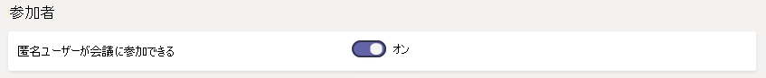
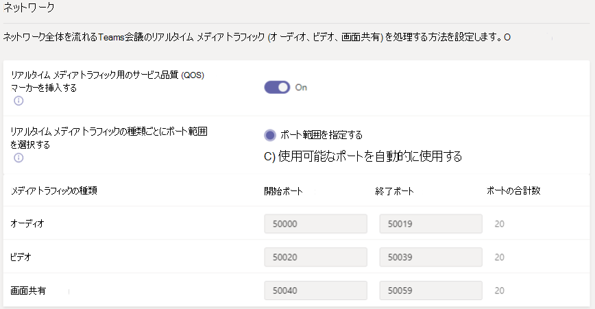

# Microsoft Teams で会議の設定を管理するManage meeting settings in Microsoft Teams

管理者は Teams 会議の設定を使用することにより、Teams 会議への匿名ユーザーの参加可否、会議への招待状のカスタマイズ、およびサービスの品質 (QoS) をオンにするかどうかの制御を行え、リアルタイム トラフィックのポート範囲を設定することができます。As an admin, you use Teams meetings settings to control whether anonymous users can join Teams meetings, customize meeting invitations, and if you want to enable Quality of Service (QoS), set port ranges for real-time traffic. これらの設定は、組織のユーザーがスケジュールするすべての Teams 会議に適用されます。These settings will be used for all of the Teams meetings that users schedule in your organization. これらの設定は、Microsoft Teams 管理センターの [**会議**] > [**会議設定**] から管理します。You manage these settings from **Meetings** > **Meeting settings** in the Microsoft Teams admin center.

## 匿名ユーザーによる会議への参加を許可するAllow anonymous users to join meetings

匿名参加を許可した場合、会議への招待状に含まれるリンクをクリックすると、誰でも匿名ユーザーとして会議に参加することができます。With anonymous join, anyone can join the meeting as an anonymous user by clicking the link in the meeting invitation. 詳細については、「[Teams のアカウントなしに会議に参加する](https://support.office.com/article/join-a-meeting-without-a-teams-account-c6efc38f-4e03-4e79-b28f-e65a4c039508)」を参照してください。To learn more, see [Join a meeting without a Teams account](https://support.office.com/article/join-a-meeting-without-a-teams-account-c6efc38f-4e03-4e79-b28f-e65a4c039508).

 **Microsoft Teams 管理センターの使用** **Using the Microsoft Teams admin center**

1. 左側のナビゲーションで、[**会議**] > [**会議設定**] に移動します。In the left navigation, go to **Meetings** > **Live event settings**.
2. [**参加者**] の下で、[**匿名ユーザーが会議に参加できます**] をオンにします。Under **Participants**, turn on **Anonymous users can join a meeting**.

    

組織のユーザーがスケジュールを行った会議に匿名ユーザーを参加させないようにするには、この設定をオフにします。If you don't want anonymous users to join meetings scheduled by users in your organization, turn off this setting.

## 会議への招待状をカスタマイズするCustomize meeting invitations

組織のニーズに合わせて Teams 会議への招待状をカスタマイズできます。You can customize Teams meeting invitations to meet your organization's needs. 組織のロゴを加えたり、役立つ情報 (組織のサポート Web サイトへのリンク、法的免責事項、テキストのみのフッターなど) を含めたりすることができます。You can add your organization's logo and include helpful information, such as links to your support website and legal disclaimer, and a text-only footer.

### 会議の招待状用ロゴの作成ヒントTips for creating a logo for meeting invitations  

1. 幅 188 ピクセル、高さ 30 ピクセル以内の、ごく小さな画像を作成します。Create an image that is no more than 188 pixels wide by 30 pixels tall (it's quite small).
2. 画像を JPG または PNG 形式で保存します。Save the image in JPG format.
3. パブリック Web サイトなど、招待状を受け取るすべてのユーザーがアクセス可能な場所に画像を保存します。Store the image in a location that everyone receiving the invitation can access, such as a public website.

    会議出席依頼に追加できるようになります。Now you can add it to your meeting invitations. 方法については、次の手順を参照してください。See the next section.

### 会議の招待状をカスタマイズするCustomize meeting invitations

 **Microsoft Teams 管理センターの使用** **Using the Microsoft Teams admin center**

1. 左側のナビゲーションで、[**会議**] > [**会議設定**] に移動します。In the left navigation, go to **Meetings** > **Live event settings**.
2. [**招待メール**] で、次の操作を行います。Under **Email invitation**, do the following:

    

    - [**ロゴ URL**] ロゴの保存場所の URL を入力します。**Logo URL:** Enter the URL where your logo is stored.
    - [**法的情報の URL**] 法的な質問があるユーザーを誘導することができる、法的情報が記載されている Web サイトが組織にある場合は、こちらに URL を入力します。**Legal URL:** If your organization has a legal website you want people to go to if they have legal concerns, enter the URL here.
    - [**ヘルプの URL**] ユーザーに問題が発生した場合にユーザーを誘導することができる、サポート Web サイトが組織にある場合は、こちらに URL を入力します。**Help URL:** If your organization has a support website you want people to go to if they have problems, enter the URL here.
    - [**フッター**] フッターとして含めるテキストを入力します。**Footer** Enter text that you want to include as a footer.
3. 変更が反映されるまで、約 1 時間待ちます。Wait an hour or so for the changes to get populated across all Office 365 services. その後、Team 会議をスケジュールし、会議の招待状の表示のされ方を確認します。Then schedule a Teams meeting to see what the meeting invitation looks like.  

## Teams 会議でのリアルタイム メディア トラフィックの処理方法を設定するSet how you want to handle real-time media traffic for Teams meetings

ネットワーク トラフィックの優先順位を付けるためにサービスの品質 [(QoS)](qos-in-teams.md) を使用している場合は、QoS マーカーを有効にしたり、メディア トラフィックの種類ごとにポート範囲を設定したりできます。If you're using Quality of Service [(QoS)](qos-in-teams.md) to prioritize network traffic, you can enable QoS markers and you can set port ranges for each type of media traffic. トラフィックの種類ごとのポート範囲の設定は、リアルタイム メディアの処理に関する手順のうちの 1 つに過ぎません。詳細については、「[Teams でのサービスの品質 (QoS)](qos-in-teams.md)」を参照してください。Setting port ranges for different traffic types is only one step in handling real-time media; see [Quality of Service (QoS) in Teams](qos-in-teams.md) for much more detail.

> [!IMPORTANT]
> QoS を有効にするか Microsoft Teams サービスに関する設定を Microsoft Teams 管理センターで変更する場合、Teams の QoS への変更を完全に実装するには、[すべてのユーザー デバイスおよびすべてのネットワーク デバイスに対して対応する設定を適用](QoS-in-Teams-clients.md)する必要があいります。If you enable QoS or change settings in the Microsoft Teams admin center for the Microsoft Teams service, you will also need to [apply matching settings to all user devices](QoS-in-Teams-clients.md) and all internal network devices to fully implement the changes to QoS in Teams.

  **Microsoft Teams 管理センターの使用** **Using the Microsoft Teams admin center**

1. 左側のナビゲーションで、[**会議**] > [**会議設定**] に移動します。In the left navigation, go to **Meetings** > **Live event settings**.
2. [**ネットワーク**] で、以下の手順を実行します。Under **Network**, do the following:

    

    - DSCP マーキングを QoS で使用できるようにするには、[**リアルタイム メディア トラフィックのサービスの品質 (QoS) マーカーを挿入する**] をオンにします。To allow DSCP markings to be used for QoS, turn on **Insert Quality of Service (QoS) markers for real-time media traffic**. 選択できるのは、マーカーを使用するか使用しないかのどちらかです。トラフィックの種類ごとにカスタム マーカーを設定することはできません。You only have the option of using markers or not; you can't set custom markers for each traffic type. DSCP マーカーの詳細については、「[QoS の実装方法を選択する](QoS-in-Teams.md#select-a-qos-implementation-method)」を参照してください。See [Select a QoS implementation method](QoS-in-Teams.md#select-a-qos-implementation-method) for more on DSCP markers.
    > [!NOTE] 
    > [**リアルタイム メディア トラフィックのサービスの品質 (QoS) マーカーを挿入する**] をオンにすると、UDP ポート 3479 (オーディオ), 3480 (ビデオ)、および 3481 (共有) を使用するトランスポート リレーへの通信もオンになります。Turning on **Insert Quality of Service (QoS) markers for real-time media traffic** will also enable communication to the Transport Relay with UDP ports 3479 (Audio), 3480 (Video) and 3481 (Sharing).
    - ポート範囲を指定するには、[**リアルタイム メディア トラフィックの種類ごとのポート範囲を選択する**] の横にある [**ポート範囲を指定**] を選択し、オーディオ、ビデオ、画面共有用の開始および終了ポートを入力します。To specify port ranges, next to **Select a port range for each type of real-time media traffic**, select  **Specify port ranges**, and then enter the starting and ending ports for audio, video, and screen sharing. QoS を実装するには、このオプションを選択する必要があります。Selecting this option is required to implement QoS.
    > [!IMPORTANT]
    > [**任意の利用可能なポートを自動的に使用する**] を選択すると、1024 と 65535 の間の利用可能なポートが使用されます。If you select **Automatically use any available ports**, available ports between 1024 and 65535 are used. このオプションは、QoS を実装しない場合にのみ使用します。Use this option only when not implementing QoS.
    >
    > 範囲が狭すぎるポート範囲を選択すると、通話の中断や通話の品質低下が発生します。Selecting a port range that is too narrow will lead to dropped calls and poor call quality. 以下の推奨事項は、最低限のものです。The recommendations below should be a bare minimum.

お客様の環境で使用すべきポート範囲が分からない場合は、以下の設定から始めることをお勧めします。If you are unsure what port ranges to use in your environment, the following settings are a good starting point. 詳細については、「[Microsoft Teams でサービスの品質 (QoS) を実装する](QoS-in-Teams.md)」を参照してください。To learn more, read [Implement Quality of Service (QoS) in Microsoft Teams](QoS-in-Teams.md). 必要な DSCP マーキングと、Teams と ExpressRoute の両方で使用される、対応する推奨メディア ポートの範囲を以下に示します。These are the required DSCP markings and the suggested corresponding media port ranges used by both Teams and ExpressRoute.

_ポート範囲と DSCP マーカー__Port ranges and DSCP markings_

メディア トラフィックの種類Media traffic type| クライアントのソース ポートの範囲\*Client source port\* |プロトコルProtocol|DSCP 値DSCP value|DSCP クラスDSCP class|
|:---             |:---                         |:---    |:---      |:---      |
|オーディオAudio            | 50,000–50,01950000-50019               |TCP/UDPTCP/UDP |4646        |完全優先転送 (EF)Expedited Forwarding (EF)|
|ビデオVideo            | 50,020–50,03950,020–50,039               |TCP/UDPTCP/UDP |343-4        |相対的優先転送 (AF41)Assured Forwarding (AF41)|
|アプリケーション/画面共有Application/Screen Sharing| 50,040–50,05950,040–50,059      |TCP/UDPTCP/UDP |1818        |相対的優先転送 (AF21)Assured Forwarding (AF21)|
| | | | |

\* 割り当てるポート範囲は重複させることはできず、互いに隣り合っている必要があります。\* The port ranges you assign cannot overlap and must be next to each other.

QoS をしばらくの期間使用すると、これらの 3 つのワークロードのそれぞれの需要に関する使用状況情報を入手できます。具体的なニーズに応じて、変更が必要な点を決められます。After QoS has been in use for a while, you'll have usage information on the demand for each of these three workloads, and you can choose what changes to make based on your specific needs. この作業を行う上で、[通話品質ダッシュボード](turning-on-and-using-call-quality-dashboard.md)が役に立ちます。[Call Quality Dashboard](turning-on-and-using-call-quality-dashboard.md) will be helpful with that.
