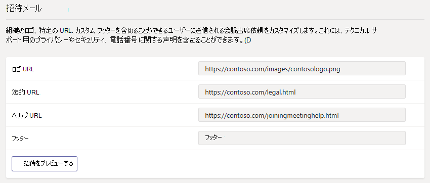

# Microsoft Teams で会議の設定を管理するManage meeting settings in Microsoft Teams

管理者と匿名ユーザーは、チームの会議に参加、ミーティングの招待状をカスタマイズ、およびサービスの品質 (QoS) を有効にする場合は、リアルタイムのトラフィックをポート範囲を設定します。 かどうかチーム会議を制御する設定を使用します。As an admin, you use Teams meetings settings to control whether anonymous users can join Teams meetings, customize meeting invitations, and if you want to enable Quality of Service (QoS), set port ranges for real-time traffic. これらの設定は、組織内でそのユーザーのスケジュールをチームのすべての会議に適用されます。These settings apply to all Teams meetings that users schedule in your organization. **会議**からこれらの設定を管理する > マイクロソフト チームの管理センターでの**会議を設定**します。You manage these settings from **Meetings** > **Meeting settings** in the Microsoft Teams admin center.

## 匿名ユーザーが会議に参加できるようにAllow anonymous users to join meetings

匿名結合は、ミーティング招待状のリンクをクリックすると、匿名ユーザーとして会議に参加誰でもできます。With anonymous join, anyone can join the meeting as an anonymous user by clicking the link in the meeting invitation.

 **、マイクロソフトのチーム管理センターを使用して** **Using the Microsoft Teams admin center**

1. 左側のナビゲーションでは、**会議**に移動 > **会議を設定**します。In the left navigation, go to **Meetings** > **Meeting settings**.
2. **参加者**の下でオンに**匿名ユーザーが会議に参加できます**。Under **Participants**, turn on **Anonymous users can join a meeting**.

    

匿名ユーザーは、組織内のユーザーがスケジュールしたミーティングに参加しない場合は、この設定をオフにします。If you don't want anonymous users to join meetings scheduled by users in your organization, turn off this setting.

## 会議出席依頼をカスタマイズするCustomize meeting invitations

組織のニーズを満たすためにチームのミーティングの招待状をカスタマイズできます。You can customize Teams meeting invitations to meet your organization's needs. 組織のロゴを追加したり、サポート用 web サイトと免責事項、およびテキストのみのフッターへのリンクなど、役に立つ情報が含まれます。You can add your organization's logo and include helpful information, such as links to your support website and legal disclaimer, and a text-only footer.

### 会議出席依頼のロゴを作成するためのヒントTips for creating a logo for meeting invitations  

1. 188 ピクセル 30 ピクセルの高さ (非常に小さいです) では、イメージを作成します。Create an image that's no more than 188 pixels wide by 30 pixels tall (it's quite small).
2. イメージを JPG 形式で保存します。Save the image in JPG format.
3. ネットワーク共有など、組織内のすべてのユーザーがアクセスできる中央の場所にイメージを格納します。Store the image in a central location that everyone in your organization can access, such as a network share.

### 会議出席依頼をカスタマイズします。Customize your meeting invitations

 **、マイクロソフトのチーム管理センターを使用して** **Using the Microsoft Teams admin center**

1. 左側のナビゲーションでは、**会議**に移動 > **会議を設定**します。In the left navigation, go to **Meetings** > **Meeting settings**.
2. [**電子メール招待状**の場合は、次の操作を行います。Under **Email invitation**, do the following:

    

    - **ロゴの URL**ロゴを保存する場所の URL を入力します。**Logo URL** Enter the URL where your logo is stored.
    - **有効な URL**組織の法的な懸念事項を参照する有効な web サイトの場合は、ここに URL を入力します。**Legal URL** If your organization has a legal website that you want people to go to for any legal concerns, enter the URL here.
    - **URL のヘルプ**組織がサポートする web サイトに問題が発生する場合に移動するようにする場合は、ここに URL を入力します。**Help URL** If your organization has a support website that you want people to go to if they run into issues, enter the URL here.
    - **フッター**フッターとして使用するテキストを入力します。**Footer** Enter text that you want to include as a footer.
3. 1 時間など、変更を伝達するを待ちます。Wait an hour or so for the changes to propagate. 会議のチームに会議出席依頼は次のように参照してください。Then schedule a Teams meeting to see what the meeting invitation looks like.  

## チームの会議のためのリアルタイムのメディア トラフィックを処理する方法を設定します。Set how you want to handle real-time media traffic for Teams meetings

ネットワーク トラフィックの優先順位を設定するのにはサービスの品質[(QoS)](qos-in-teams.md)を使用する場合は、QoS のマーカーを有効にすることができ、メディア トラフィックの種類ごとにポートの範囲を設定することができます。If you're using Quality of Service [(QoS)](qos-in-teams.md) to prioritize network traffic, you can enable QoS markers and you can set port ranges for each type of media traffic.

  **、マイクロソフトのチーム管理センターを使用して** **Using the Microsoft Teams admin center**

1. 左側のナビゲーションでは、**会議**に移動 > **会議を設定**します。In the left navigation, go to **Meetings** > **Meeting settings**.
2. [**ネットワーク**では、次の操作を行います。Under **Network**, do the following:

    

    - QoS を使用する DSCP マーキングを許可するには、**トラフィックのリアルタイム メディアの挿入のサービスの品質 (QoS) のマーカー**を入れます。To allow DSCP markings to be used for QoS, turn on **Insert Quality of Service (QoS) markers for real-time media traffic**. どうか、マーカーを使用するオプションだけがあります。トラフィックの種類ごとにカスタム マーカーを設定することはできません。You only have the option of using markers or not; you can't set custom markers for each traffic type. DSCP マーカーが複数の[QoS の実装方法を選択する](QoS-in-Teams.md#select-a-qos-implementation-method)を参照してください。See [Select a QoS implementation method](QoS-in-Teams.md#select-a-qos-implementation-method) for more on DSCP markers.
    - **リアルタイム メディア トラフィックの種類ごとにポートの範囲を選択**すると、横には、ポート範囲を指定するのには**を指定するポートの範囲**を選択し、オーディオ、ビデオ、および画面共有の開始と終了のポートを入力します。To specify port ranges, next to **Select a port range for each type of real-time media traffic**, select  **Specify port ranges**, and then enter the starting and ending ports for audio, video, and screen sharing. このオプションを選択すると、QoS を実装する必要があります。Selecting this option is required to implement QoS.
    > [!IMPORTANT]
    > **自動的にすべての利用可能なポートを使用して**1024 の間で利用可能なポートを選択すると、65535 が使用されます。If you select **Automatically use any available ports**, available ports between 1024 and 65535 are used. QoS を実装しない場合にのみ、このオプションを使用します。Use this option only when not implementing QoS.
    >
    > ポートの範囲が狭すぎることを選択することにより、通話の中断や品質の低い呼び出しされます。Selecting a port range that is too narrow will lead to dropped calls and poor call quality. 以下の推奨事項には、最小限に抑える必要があります。The recommendations below should be a bare minimum.

 明確でない環境で使用するポートの範囲は、次の設定は、開始点をしてください。If you are unsure what port ranges to use in your environment, the following settings are a good starting point. 詳細については、[実装のサービス品質 (QoS) では、マイクロソフトのチーム](QoS-in-Teams.md)を参照してください。To learn more, read [Implement Quality of Service (QoS) in Microsoft Teams](QoS-in-Teams.md). これらは、必須の DSCP マーキングと推奨される対応するメディア チームと ExpressRoute の両方で使用する範囲のポートです。These are the required DSCP markings and the suggested corresponding media port ranges used by both Teams and ExpressRoute.

_ポート範囲および DSCP マーキング__Port ranges and DSCP markings_

メディア トラフィックの種類Media traffic type| クライアント ソース ポートの範囲\*Client source port range \* |プロトコルProtocol|DSCP 値DSCP value|DSCP クラスDSCP class|
|:---             |:---                         |:---    |:---      |:---      |
|オーディオAudio            | 50,000 – 50,01950,000–50,019               |TCP/UDPTCP/UDP |4646        |完全優先転送 (EF)Expedited Forwarding (EF)|
|ビデオVideo            | 50,020 – 50,03950,020–50,039               |TCP/UDPTCP/UDP |3434        |相対的優先転送 (AF41)Assured Forwarding (AF41)|
|アプリケーションと画面の共有Application/Screen Sharing| 50,040-50,05950,040–50,059      |TCP/UDPTCP/UDP |1818        |相対的優先転送 (AF21)Assured Forwarding (AF21)|
| | | | |

\*割り当てるポートの範囲は、重ねることはできませんし、互いに隣接する必要があります。\* The port ranges you assign cannot overlap and must be adjacent to each other.

リアルタイム メディアを処理するときの 1 つのステップは、種類の異なるトラフィックのポート範囲を設定します。詳細な[サービスの品質 (QoS)](qos-in-teams.md)を参照してください。Setting port ranges for different traffic types is only one step in handling real time media; see [Quality of Service (QoS) in Teams](qos-in-teams.md) for much more detail. 有効にするか、マイクロソフトのチーム管理センターの設定を変更した場合は、チームでの QoS への変更を完全に実装する[すべてのユーザーのデバイスに一致する設定を適用](QoS-in-Teams-clients.md)し、内部のネットワーク デバイスに必要があります。If you enable or change settings in the Microsoft Teams admin center, you will need to [apply matching settings to all user devices](QoS-in-Teams-clients.md) and internal network devices to fully implement the changes to QoS in Teams.

QoS が使用された後、しばらくの間、これら 3 つのワークロードごとに、オン ・ デマンドでの使用状況に関する情報があり、どのような変更を加えるに基づいて、特定のニーズを選択することができます。After QoS has been in use for a while, you'll have usage information on the demand for each of these three workloads, and you can choose what changes to make based on your specific needs. [品質のダッシュ ボードを呼び出す](turning-on-and-using-call-quality-dashboard.md)と便利になります。[Call Quality Dashboard](turning-on-and-using-call-quality-dashboard.md) will be helpful with that.
