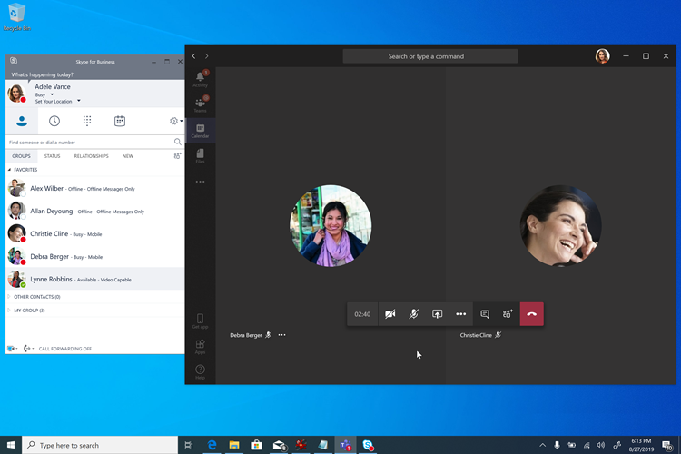
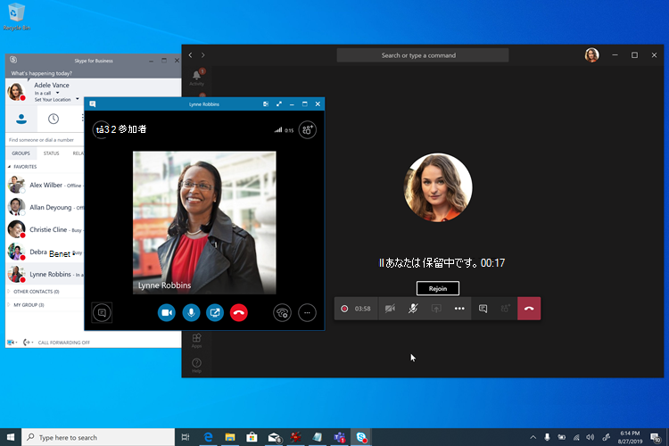
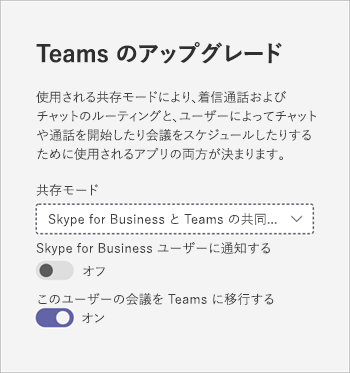

# Meetings First

"Meetings First" は、エンタープライズ VoIP オンプレミスを使用して、可能な限り迅速に Teams 会議を使用し始めたいと考えている、Skype for Business Server 組織を対象に、最適化されています。 Meetings First は、このような組織用に Teams 会議機能を優先させる、**Islands** モードの代替手段です。

## Meetings First とは

Meetings First は、**SfBWithTeamsCollabAndMeetings** 共存モードに基づいています。 Meetings First は、製品や機能ではありません。これは、Teams や Skype for Business の機能を活用して、独自にカスタマイズされた共存環境を実現する構成です。

Meetings First では、ユーザーは、Skype for Business でチャット、通話、プレゼンスを使用しながら、Teams で会議を作成します。 Teams と Skype for Business の間にモダリティの重複はありません。 チャット、通話、プレゼンスは、Skype for Business ではオンになり、Teams ではオフになります。 これにより、Skype for Business と Teams の間で、共存中のユーザーの操作環境を向上する独自の "優れた連携" シナリオだけでなく、**Teams のみ** のユーザーを対象とした相互運用性のシナリオも実現します。

> [!Important]
> Meetings First は、アクティブな Teams チャット ユーザーがいない、またはほとんどいない組織に適しています。 アクティブな Teams チャット ユーザーは、Meetings First モードに切り替えると、Teams でチャットしたり、自分のチャット履歴にアクセスしたりできなくなるため切り替えるべきではありません。 これらのユーザーは、代わりに **Islands** モードで許可される必要があり、Meetings First は Teams のチャットでまだアクティブでないユーザーにのみ許可する必要があります。

## Meetings First を検討する必要がある対象ユーザーはだれですか。

Meetings First は、エンタープライズ VoIP で Skype for Business Server を使用し、Teams 会議への移行を促進したいと考えている組織、特に、Teams に対して管理された確定的なアップグレード パスを必要とする IT 規律の強い組織を対象として設計されています。

複雑な組織や大規模な組織では、通常、音声の移行はサイトごとに行われるため、時間がかかる場合があり、場合によっては数年かかる可能性もあるため、結果として共存のシナリオが延長されます。 この共存が **Islands** モードにある場合、ユーザーには常に 2 つの会議ソリューション (Skype for Business と Teams) が用意されているため、混乱を招いたり、最適なシナリオではなくなる可能性があります。 音声の移行とは異なり、会議の移行は、一般に会社全体で短時間で行うことができます。 Teams 会議にできるだけ早く (音声の移行が完了するのを待たずに) 完全に切り替えたい組織は、Meetings First を検討する必要があります。

Meetings First は、エンタープライズ VoIP ユーザーがいない組織では役に立ちません。 これらの組織は、Teams 会議を導入できるようになればすぐに **Teams のみ** にアップグレードできるはずです。 これらの組織は、Meetings First を採用しないことを検討する必要があります。

さらに、Meetings First は、"会議のみ" の RFP が発行されている場合など、組織の対象範囲が会議専業ソリューション場合に役立ちます。

## Meetings First の機能

Meetings First では、次の機能が提供されます。

- [Skype for Business Server (オンプレミス) ユーザー](https://docs.microsoft.com/microsoftteams/tutorial-audio-conferencing?tutorial-step=3)に [Teams の電話会議](tutorial-audio-conferencing.yml)機能を提供します。
- [会議移行サービス](https://docs.microsoft.com/skypeforbusiness/audio-conferencing-in-office-365/setting-up-the-meeting-migration-service-mms): ユーザーが Meetings First に参加すると、そのユーザーが開催した会議がクラウドに移行され、Teams 会議に変換されます (Exchange Online が必要)。
- Teams のユーザー エクスペリエンスが合理化され、Teams の会議、チーム、チャネルが中心になります (必要に応じて、[アプリのアクセス許可ポリシー](teams-app-permission-policies.md)を使用して非表示にすることもできます)。[Teams のプライベート チャット、通話、および自己プレセンス](teams-client-experience-and-conformance-to-coexistence-modes.md)は、Meetings First に提供されません。これにより、展開と導入の取り組みを完全に会議に集中させることができます。
- 優れた [Teams 会議環境](tutorial-meetings-in-teams.yml)。
- Teams と Skype for Business との "優れた連携"  
  - 自動ホールド: Teams の会議中に Skype for Business で電話を受けると、Teams 会議が保留にされます (逆も同様)。 これにより、ユーザーは会議の参加者にプライベートな通話を聞かれないようにすることができます。
    
  - プレゼンスの調整: Teams でのアクティビティは、ユーザーのプレゼンスに反映されます。チャットと通話は Skype for Business にあるため、これは Skype for Business のプレゼンスです。 具体的に言うと、Meetings First ユーザーが Teams 会議に参加しているとき、そのユーザーのプレゼンスは、それを反映して更新されます。 ユーザーが画面を提示すると、そのユーザーのプレゼンスは (Skype for Business の設定に基づいて) [応答不可] が表示されるように更新されます。
  - USB デバイス HID コントロール調整 (Mac でも使用可能): HID コントロールは、Teams 会議中は Teams に従い、他の状況ではすべての Skype for Business に従います。
  - 特に記載がない限り、Better Together 機能には、現時点で最新の Windows デスクトップ クライアントが必要です。

## Meetings First の前提条件

Meetings First の唯一のハード要件は、オンプレミスの Active Directory と Skype for Business のオンプレミス展開を使用する Teams の要件と同じです。

- [Teams の一般的な前提条件](upgrade-plan-journey-prerequisites.md)。次を含みます。
- [Teams での ID と認証](identify-models-authentication.md)、および
- [Teams と Skype for Business 用 Azure Active Directory の構成](https://docs.microsoft.com/skypeforbusiness/hybrid/configure-azure-ad-connect)。

[Skype for Business ハイブリッド トポロジ](https://docs.microsoft.com/skypeforbusiness/hybrid/configure-federation-with-skype-for-business-online)は必須ではありませんが、推奨されます。 会議の移行サービスなどの一部の機能や相互運用性は、そのトポロジに依存します。

Meetings First は、Skype for Business Server の任意のバージョンでサポートされています (サポートされなくなった Lync サーバーで動作することも確認されています)。 Meetings First は、サポートされている任意の Skype for Business クライアントでサポートされていますが、Better Together 機能を使用するには、最新のクライアントが必要です。

これらの要件が満たされると (以前は満たされていなかった場合)、ユーザーは [Microsoft 365 または Office 365 および Teams のライセンス](https://docs.microsoft.com/office365/enterprise/assign-licenses-to-user-accounts)を取得できます。

Meetings First を最適に活用するため、すべてのユーザーは [Exchange Online](exchange-teams-interact.md)、[SharePoint Online、OneDrive for Business](sharepoint-onedrive-interact.md)、および Microsoft 365 グループの作成が可能になっている必要があります。 Meetings First は、メールボックスがオンプレミスの Exchange にあるか、SharePoint Online や OneDrive For Business、または Microsoft 365 グループを作成していないユーザー向けにサポートされています。 ただし、エクスペリエンスは完全なものではなくなります。 特に、オンプレミスの Exchange Server を使用している組織では、Teams クライアントからの会議の作成と表示、およびコンプライアンス機能に制限がある場合があります (Exchange Server のバージョンによる)。

少なくとも、ユーザーは [Teams のライセンス](https://docs.microsoft.com/microsoft-365/admin/manage/assign-licenses-to-users)が付与されている必要があります。 さらに、ユーザーには必要に応じて、[電話会議](set-up-audio-conferencing-in-teams.md)のライセンスを付与することもできます。

ユーザーにライセンスを付与するときは、テナントの既定値として [**SfBOnly** または **SfBWithTeamsCollab**](https://docs.microsoft.com/powershell/module/skype/grant-csteamsupgradepolicy?view=skype-ps) モードを付与することをお勧めします。 これによりユーザーは、Meetings First を開始する準備が整うまでは、既定の **Islands** モードで Teams を自分で使用し始めないようにすることができます。

Meetings First は、フル デスクトップ クライアント (Windows および Mac)、ブラウザー クライアント、およびモバイル クライアントでサポートされています。 これは、[Microsoft Teams Rooms](https://docs.microsoft.com/microsoftteams/room-systems/)とも互換性があります。 Better Together には、フル デスクトップ クライアントが必要です。

## Meetings First で Teams 会議を準備する

ユーザーが Teams 会議で最適な操作性を得るには、次の操作を行う必要があります。

- 具体的には、「[Microsoft Teams のミーティングと会議](deploy-meetings-microsoft-teams-landing-page.md)」の手順に従ってください。
- [環境を評価する](3-envision-evaluate-my-environment.md)。
- [Microsoft Teams 用に組織のネットワークを準備する](prepare-network.md)。
- Teams 対応の[会議室のデバイスやソリューション](https://docs.microsoft.com/skypeforbusiness/certification/devices-meeting-rooms?toc=/MicrosoftTeams/toc.json&bc=/microsoftteams/breadcrumb/toc.json)で会議室をアップグレードするか、[Microsoft Teams のクラウド ビデオ相互運用性](cloud-video-interop.md)を使用して、既存のサードパーティ製の会議室やデバイスが Teams 会議に参加できるようする。
- [認定された USB オーディオ デバイスやビデオ デバイス](https://docs.microsoft.com/skypeforbusiness/certification/devices-usb-devices?toc=/MicrosoftTeams/toc.json&bc=/microsoftteams/breadcrumb/toc.json)をユーザーに提供する。
- [Teams 会議の認識と導入を促進する](adopt-microsoft-teams-landing-page.md)準備をする。
- [サービス管理を計画する](4-envision-plan-my-service-management.md)。
- 豊富な通話解析レポートを理解して、[低品質通話をトラブルシューティングする](use-call-analytics-to-troubleshoot-poor-call-quality.md)。

この段階で、中規模の運用環境対応パイロットを実行することを検討します。

## Meetings First のユーザーを構成する

ユーザーにライセンスを付与し、Teams 会議の組織の準備ができたら、Meetings First のユーザーを有効にします。 1 つの設定ですべてを簡単に行うことができます。

Meetings First のすべての機能とユーザー エクスペリエンス (Teams クライアント構成、ユーザー エクスペリエンスの[自動適合](teams-client-experience-and-conformance-to-coexistence-modes.md)、会議移行サービス、Better Together 機能を含む) は、[Microsoft Teams 管理センター](manage-teams-in-modern-portal.md)で、または [PowerShell](https://docs.microsoft.com/powershell/module/skype/grant-csteamsupgradepolicy?view=skype-ps) を使ってユーザー (またはユーザーのグループ、あるいはテナントの既定) に[SfBWithTeamsCollabAndMeetings 共存モード](setting-your-coexistence-and-upgrade-settings.md)を付与することによって構成されます。

必要に応じて、ユーザーの Teams クライアントの左側のナビゲーションにあるチームとチャネル アプリケーションを非表示して、エクスペリエンスを会議に集中させます。これは、[アプリのアクセス許可ポリシー](teams-app-permission-policies.md)を使用して実現できます。

## レポート作成と通話分析

Meetings First の Teams 会議のレポート作成と通話分析は、他のモードの場合と変わりません。

## 関連リンク

この記事の内容を確認した後、さらに詳細については「[アップグレードの行程を選択する](upgrade-and-coexistence-of-skypeforbusiness-and-teams.md)」、「[移行と相互運用に関するガイドライン](migration-interop-guidance-for-teams-with-skype.md)」、「[Skype for Business と共存する](coexistence-chat-calls-presence.md)」を参照してください。

