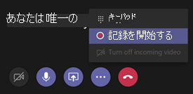

# 文字起こしを記録する会議&設定

この記事では、次のような記録と文字起こしに固有の会議ポリシー設定について説明します。

- [文字起こしを許可する](#allow-transcription)
- [クラウド記録を許可する](#allow-cloud-recording)
- [お客様の国または地域以外の場所にレコーディングを保存する](#store-recordings-outside-of-your-country-or-region)

## 文字起こしを許可する

これは、開催者単位とユーザーごとのポリシーの組み合わせです。 この設定は、会議の記録の再生中にキャプションと文字起こし機能を使用できるかどうかを制御します。 録音を開始したユーザーは、これらの機能が記録を使用するためにこの設定を有効にしている必要があります。

この設定をオンにすると、会議記録に保存されているトランスクリプトのコピーが作成され、会議の記録で検索 **、CC、** およびトランスクリプトが有効にされます。 

現在、記録された会議の文字起こしは、会議中に自分の言語を英語に設定または英語で話すユーザー Teamsされています。

## クラウド記録を許可する

この設定は、開催者ごとのポリシーとユーザーごとのポリシーの組み合わせであり、会議を記録できるかどうかを制御します。 参加者のポリシー設定が有効になっており、同じ組織の認証済みユーザーである場合、会議の開催者または別の会議参加者が記録を開始できます。

フェデレーション ユーザーや匿名ユーザーなど、組織外のユーザーは記録を開始できません。 ゲスト ユーザーは記録を開始または停止できません。

次の例を見てみましょう。

|ユーザー |会議ポリシー  |クラウド記録を許可する |
|---------|---------|---------|
|Daniela | グローバル   | オフ |
|Amanda | Location1MeetingPolicy | オン|
|John (外部ユーザー) | 該当なし | 該当なし|

- Daniela が開催した会議は記録されません。
- Amanda は、Daniela が開催した会議を記録できない。
- Amanda によって開催された会議を記録できます。
- Daniela は、Amanda が開催した会議を記録できない。
- John は、Amanda が開催した会議を記録できない。

クラウド会議の記録の詳細については、「[Teams のクラウド会議の記録](cloud-recording.md)」を参照してください。

## お客様の国または地域以外の場所にレコーディングを保存する

このポリシーは、会議レコードを別の国または地域に永続的に保存できるかどうかを制御します。 有効になっている場合は、レコーディングを移行できません。 クラウド会議とレコーディングの保存場所の詳細については、「クラウド会議の記録Teams[を参照してください](cloud-recording.md)。

## 関連トピック

- [グループ内のユーザーにポリシーを割り当Teams](policy-assignment-overview.md)
- [クラウド会議の記録](cloud-recording.md)
