# Microsoft Teams 通話のフローMicrosoft Teams call flows

> [!Tip]
> チームでネットワークを活用する方法と、最適なネットワーク接続を計画する方法については、次のセッションをご覧ください。 [Teams ネットワーク計画](https://aka.ms/teams-networking)Watch the following session to learn how Teams leverages your network and how to plan for optimal network connectivity: [Teams Network Planning](https://aka.ms/teams-networking)

## 概要Overview
この記事では、さまざまなトポロジで Teams が Office 365 のコールフローを使用する方法について説明します。This article describes how Teams uses Office 365 call flows in various topologies. また、ピアツーピアメディア通信に使用される固有のチームフローについても説明します。In addition, it describes unique Teams flows that are used for peer-to-peer media communication. このドキュメントでは、ネットワーク上でこれらのフロー、目的、およびその発生元と終了が説明されています。The document describes these flows, their purpose, and their origin and termination on the network. この記事の目的に応じて、次のことを前提とします。For purposes of this article, assume the following:

- Flow X は、オンプレミスの Office 365 クライアントによって、クラウドの Office 365 サービスと通信するために使用されます。Flow X is used by the on-premises Office 365 client to communicate with the Office 365 service in the cloud. これは、顧客ネットワークから発信され、Office 365 のエンドポイントとして終了します。It originates from the customer network, and it terminates as an endpoint in Office 365.

- Flow Y は、オンプレミスの Office 365 クライアントによって、Office 365 が依存しているインターネット上のサービスと通信するために使用されます。Flow Y is used by the on-premises Office 365 client to communicate with a service on the Internet that Office 365 has a dependency on. これは、顧客ネットワークから発信され、インターネット上のエンドポイントとして終了します。It originates from the customer network, and it terminates as an endpoint on the Internet.

この記事には、次のセクションが含まれています。The article contains the following sections:

- **バックグラウンド**-office 365 フローが走査する可能性のあるネットワーク、トラフィックの種類、顧客ネットワークから Office 365 サービスエンドポイントへの接続のガイダンス、サードパーティ製のコンポーネントとの相互運用性などの背景情報を提供します。メディアフローを選択するために Teams で使用される原則。**Background** - Provides background information, such as networks that Office 365 flows may traverse, type of traffic, connectivity guidance from the customer network to Office 365 service endpoints, interoperability with third-party components, and principles that are used by Teams to select media flows.

- **さまざまなトポロジのコールフロー** -さまざまなトポロジでのコールフローの使い方を示しています。**Call flows in various topologies** - Illustrates the use of call flows in various topologies. 各トポロジについて、サポートされているすべてのフローを列挙し、これらのフローがさまざまなユースケースでどのように使用されるかを示します。For each topology, the section enumerates all supported flows and illustrates how these flows are used via several use cases. 各ユースケースについて、フロー図を使ってフローの順序および選択を記述します。For each use case, it describes the sequence and selection of flows via a flow diagram. 

- **エクスプレスルートの最適化を使用しているチーム**-簡易ルートを使用して最適化を展開する場合の、これらのフローの使い方について説明します。**Teams with Express Route optimization** - Describes how these flows are used when Express Route is deployed for optimization, illustrated via a simple topology.

## 背景Background
### ネットワークセグメントNetwork segments
[**顧客ネットワーク**]: これは、管理および管理するネットワークセグメントです。**Customer network**: This is the network segment that you control and manage. これには、有線またはワイヤレス、office 建物間、オンプレミスのデータセンターへの接続、インターネットプロバイダー、Express Route、またはその他のプライベートピアリングへの接続など、顧客オフィス内のすべての顧客接続が含まれます。This includes all customer connections within customer offices, whether wired or wireless, between office buildings, to on-premises datacenters, and your connections to Internet providers, Express Route, or any other private peering. 

通常、顧客ネットワークには、ファイアウォールやプロキシサーバーを備えたネットワーク境界がいくつかあります。これにより、組織のセキュリティポリシーが適用されます。また、設定して構成した特定のネットワークトラフィックのみを許可します。Typically, a customer network has several network perimeters with firewalls and/or proxy servers, which enforce your organization's security policies, and that only allow certain network traffic that you have set up and configured. このネットワークを管理しているため、ネットワークのパフォーマンスを直接制御できます。また、ネットワーク上のサイトと365ネットワークの両方でパフォーマンスを検証するために、ネットワークの評価を実行することを強くお勧めします。Because you manage this network, you have direct control over the performance of the network, and it is highly recommended that you complete network assessments to validate performance both within sites in your network and from your network to the Office 365 network. 

[ **Internet (インターネット**): これは、顧客ネットワークの外部から Office 365 に接続しているユーザーが使用する、全体的なネットワークの一部であるネットワークセグメントです。**Internet**: This is the network segment that is part of your overall network that will be used by users who are connecting to Office 365 from outside of the customer network. また、顧客ネットワークから Office 365 への一部のトラフィックでも使用されます。It is also used by some traffic from the customer network to Office 365. 

**アクセス済み/ゲストプライベートネットワーク**: これは、顧客ネットワークの外部のネットワークセグメントであり、公共のインターネットでは使用できません。ユーザーやゲストがアクセスする可能性があります。**Visited/Guest private network**: This is the network segment outside your customer network, but not in the public Internet, that your users and/or their guests may visit. たとえば、[ホームプライベートネットワーク] または [エンタープライズプライベートネットワーク] では、Teams は展開されません。これにより、チームサービスとやり取りするユーザーやユーザーが存在する可能性があります。For example, home private network or an Enterprise private network, that does not deploy Teams, where your users and/or their customers that interact with Teams services may reside.

>**注**: Office 365 への接続は、これらのネットワークにも適用されます。**Note**: Connectivity to Office 365 is also applicable to these networks.

**Office 365**: これは、office 365 サービスをサポートするネットワークセグメントです。**Office 365**: This is the network segment that supports Office 365 services. これは、世界各地のお客様のネットワークに近接したエッジを使用して世界中に配布されています。It is distributed worldwide with edges in proximity to the customer network in most locations. このドキュメントで説明されている関数には、トランスポートリレー、会議サーバー、メディアプロセッサが含まれています。Functions mentioned in this document include Transport Relay, conferencing server, and Media Processor. 

[**簡易ルート] (オプション)**: これは、Office 365 ネットワークに対する専用のプライベートな接続を提供する、全体的なネットワークの一部であるネットワークセグメントです。**Express Route (optional)**: This is the network segment that is part of your overall network that will give you a dedicated, private connection to the Office 365 network.

### トラフィックのタイプTypes of traffic

**リアルタイムメディア**: RTP (リアルタイムトランスポートプロトコル) 内にカプセル化されたデータで、オーディオ、ビデオ、画面共有のワークロードをサポートします。**Real-time media**: Data encapsulated within RTP (Real-time Transport Protocol) that supports audio, video and screen sharing workloads. 通常、メディアトラフィックは非常に待機時間が高いため、このトラフィックは可能な限り多くのパスを使用し、トランスポート層プロトコルとして UDP または TCP を使うことをお勧めします。これは、品質の観点から対話的なリアルタイムメディアを作成するための最適なトランスポートです。.In general, media traffic is highly latency sensitive, so you would want this traffic to take the most direct path possible, and to use UDP versus TCP as the transport layer protocol, which is the best transport for interactive real time media from a quality perspective. (注: 最後の手段として、メディアには TCP/IP を使用できます。また、HTTP プロトコル内でトンネリングすることもできますが、品質への影響が不適切なため、お勧めしません。)RTP フローは SRTP を介してセキュリティ保護され、ペイロードのみが暗号化されます。(Note: As a last resort, media can use TCP/IP and also be tunneled within the HTTP protocol, but it is not recommended due to bad quality implications.) RTP flow is secured via SRTP, in which only the payload is encrypted.

**シグナリング**: クライアントとサーバーの間の通信リンク、またはアクティビティ (通話の開始時など) を制御するために使用される他のクライアント。**Signaling**: The communication link between the client and server, or other clients that are used to control activities (for example, when a call is initiated), and deliver instant messages. ほとんどのシグナルトラフィックでは、HTTPS ベースの REST インターフェイスが使用されますが、シナリオによっては (たとえば、Office 365 とセッション境界コントローラー間の接続)、SIP プロトコルを使います。Most signaling traffic uses the HTTPS-based REST interfaces, though in some scenarios (for example, connection between Office 365 and a Session Border Controller) it uses SIP protocol. このトラフィックは待ち時間に非常に敏感であることを理解しておく必要がありますが、エンドポイント間の待機時間が数秒を超えると、サービスが停止したり、タイムアウトしたりする可能性があります。It's important to understand that this traffic is much less sensitive to latency but may cause service outages or call timeouts if latency between the endpoints exceeds several seconds. 

### Office 365 への接続Connectivity to Office 365

チーム[にはインターネットへの接続](https://support.office.com/article/connectivity-to-the-internet-64b420ef-0218-48f6-8a34-74bb27633b10)が必要。Teams requires [connectivity to the Internet](https://support.office.com/article/connectivity-to-the-internet-64b420ef-0218-48f6-8a34-74bb27633b10). Teams のエンドポイント Url と IP アドレス範囲は、 [Office 365 url と ip アドレス範囲](https://docs.microsoft.com/office365/enterprise/urls-and-ip-address-ranges)に記載されています。Teams endpoint URLs and IP address ranges are listed in [Office 365 URLs and IP address ranges](https://docs.microsoft.com/office365/enterprise/urls-and-ip-address-ranges). (注: TCP ポート80および443への接続を開き、UDP ポート3478から3481への接続が必要です。)さらに、Teams は Skype for Business Online に依存しているため、インターネットにも接続する必要があります。(Note: Open connectivity to TCP ports 80 and 443, and to UDP ports 3478 through 3481 is required.) Furthermore, Teams has a dependency on Skype for Business Online, which must also be connected to the Internet.

Teams メディアフロー接続は、標準の IETF ICE (対話型接続の確立) 手順によって実装されます。Teams media flows connectivity is implemented via standard IETF ICE (Interactive Connectivity Establishment) procedures.

### 相互運用性の制限Interoperability restrictions
**サードパーティメディアリレー**: teams メディアフロー (つまり、teams のエンドポイントの1つ) は、teams または Skype for business のネイティブメディアリレーのみをスキャンする場合があります。**Third party media relays**: A Teams media flow (that is, one of the media endpoints is Teams) may traverse only Teams or Skype for Business native media relays. サードパーティメディアリレーとの相互運用性はサポートされていません。Interoperability with a third party media relay is not supported. (注: PSTN でのサードパーティの SBC は、RTP/RTCP ストリームを終了して、SRTP 経由でセキュアであり、次のホップにはリレーしません。)(Note: A third party SBC on the boundary with PSTN must terminate RTP/RTCP stream, secured via SRTP, and not relay it to the next hop.)

**サードパーティの sip プロキシサーバー**: サードパーティの SBC やゲートウェイを使用した sip ダイアログの通知は、teams または Skype for business のネイティブ SIP プロキシによって発生します。**Third party SIP proxy servers**: A Teams signaling SIP dialog with a third party SBC and/or gateway may traverse Teams or Skype for Business native SIP proxies. サードパーティの SIP プロキシとの相互運用性はサポートされていません。Interoperability with a third party SIP proxy is not supported.

**サードパーティ B2BUA (つまり、SBC)**: PSTN との間の Teams メディアフローは、サードパーティの SBC によって終了します。**Third party B2BUA (that is, SBC)**: A Teams media flow from/to the PSTN is terminated by a third party SBC. ただし、Teams ネットワーク内のサードパーティの SBC との相互運用性 (つまり、サードパーティの SBC の1つのチームと Skype for Business エンドポイントの両方) はサポートされていません。However, interoperability with a third party SBC within the Teams network (that is, a third party SBC mediates two Teams/Skype for Business endpoints) is not supported.

### Microsoft Teams で推奨されないテクノロジTechnologies that are not recommended with Microsoft Teams

**VPN ネットワーク**: メディアトラフィックには推奨されません (つまり、flow 2 ')。**VPN network**: It is not recommended for media traffic (that is, flow 2'). VPN クライアントは、で指定されているようにhttps://blogs.technet.microsoft.com/nexthop/2011/11/14/enabling-lync-media-to-bypass-a-vpn-tunnel/、境界 vpn を使用し、メディアトラフィックをルーティングする必要があります。The VPN client should use split VPN and route media traffic like any external non-VPN user, as specified in https://blogs.technet.microsoft.com/nexthop/2011/11/14/enabling-lync-media-to-bypass-a-vpn-tunnel/.

>**注**: タイトルは Lync でも、チームに適用されます。**Note**: Although the title is Lync, it is applicable to Teams as well.

**パケット**デバイス: どのような種類のパケット snippers、パケット検査、またはパケット shaper デバイスは推奨されません。また、品質が大幅に低下する可能性があります。**Packet shapers**: Any kind of packet snippers, packet inspection, or packet shaper devices are not recommended and may degrade quality significantly. 

### 指針Principles
Microsoft Teams のコールフローを理解するのに役立つ4つの一般的な原則があります。There are four general principles that help you understand call flows for Microsoft Teams:
 
1.  Microsoft Teams の会議は、最初の参加者が参加したのと同じ地域で Office 365 によってホストされています。A Microsoft Teams conference is hosted by Office 365 in the same region where the first participant joined. (注: 一部のトポロジでこの規則の例外が発生する場合は、このドキュメントで説明されていて、適切なコールフローで示されています。)(Note: If there will be exceptions to this rule in some topologies, then they will be described in this document, and illustrated by an appropriate call flow.)

2.  Office 365 の Teams メディアエンドポイントは、通話の種類に基づくメディア処理のニーズに基づいて使用されます。A Teams media endpoint in Office 365 is used based on media processing needs and not based on call type. (たとえば、ポイントツーポイントの通話では、クラウドのメディアエンドポイントを使用して、議事録や記録のためにメディアの処理を行うことができます。参加者が2人の会議では、クラウドのメディアエンドポイントを使用することはできません)。ただし、ほとんどの会議では、会議がホストされている場所に割り当てられる、ミキシングとルーティングの目的でメディアエンドポイントが使用されます。(For example, a point-to-point call may use a media endpoint in the cloud to process media for transcription and/or recording, while a conference with two participants may not use any media endpoint in the cloud.) However, most conferences will use a media endpoint for mixing and routing purposes, allocated where the conference is hosted. 顧客のネットワークファイアウォールの制限により、クライアントからメディアエンドポイントに送信されたメディアトラフィックが直接ルーティングされる場合や、必要に応じて、Office 365 でトランスポートリレーを使用する場合があります。The media traffic sent from a client to the media endpoint may be routed directly or use a Transport Relay in Office 365 if required due to customer network firewall restrictions. 

3.  ピアツーピア通話のメディアトラフィックは、電話がクラウドでメディアエンドポイントを必要としないことを前提として、利用可能な最も直接的なルートを受け取ります (上記の #2 を参照してください)。Media traffic for peer-to-peer calls take the most direct route that is available, assuming that the call doesn't mandate a media endpoint in the cloud (see #2 above). 優先ルートはリモートピア (クライアント) に直接送信されますが、そのルートが利用できない場合は、1つ以上のトランスポートリレーがトラフィックを中継します。The preferred route is direct to the remote peer (client), but if that route isn't available, then one or more Transport Relays will relay traffic. メディアトラフィックは、メディアの品質に影響を与えるため、パケットコントローラー、VPN サーバーなどの横にあるサーバーではないことをお勧めします。It is recommended that media traffic shall not transverse servers such as packet shapers, VPN servers, and so on, since this will impact the media quality.

4.  シグナリングトラフィックは、常に最も近いサーバーに移動します。Signaling traffic always goes to the closest server to the user. 

選択されているメディアパスの詳細については、をhttps://www.youtube.com/watch?v=1tmHMIlAQdo参照してください。To learn more about the details on the media path that is chosen, see https://www.youtube.com/watch?v=1tmHMIlAQdo.

## さまざまなトポロジでのコールフローCall flows in various topologies
### Teams のトポロジTeams topology
このトポロジは、Skype for Business Server や電話システムの直接ルーティングなど、オンプレミスの展開がなくてもクラウドから Teams サービスを利用する顧客によって使用されます。This topology is used by customers that leverage Teams services from the cloud without any on-premises deployment, such as Skype for Business Server or Phone System Direct Routing. さらに、Office 365 へのインターフェイスは、Azure Express Route を使わずにインターネット経由で行われます。In addition, the interface to Office 365 is done via the Internet without Azure Express Route. 

[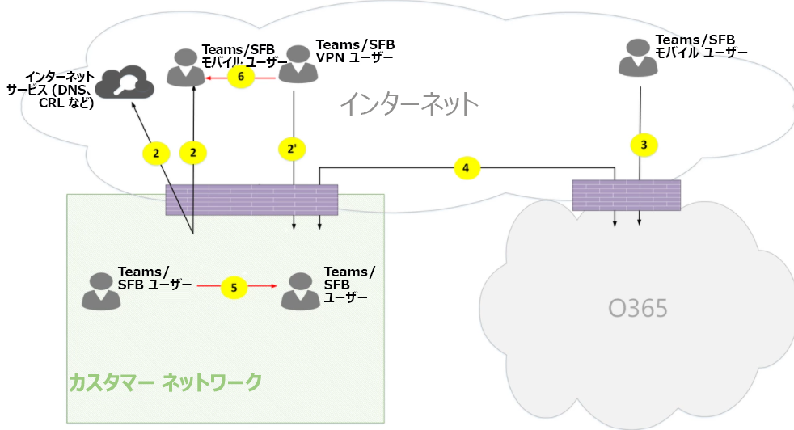](media/microsoft-teams-online-call-flows-figure01.png)

*図 1-Teams のトポロジ**Figure 1 - Teams topology*

次の点に注意してください。Note that:

- 上の図の矢印の方向は、企業境界での接続に影響を与える通信の開始方向を反映しています。The direction of the arrows on the diagram above reflect the initiation direction of the communication that affects connectivity at the enterprise perimeters. メディア用に UDP の場合は、最初のパケットが逆方向に流れる場合がありますが、これらのパケットは、他の方向のパケットが流れるまでブロックされることがあります。In the case of UDP for media, the first packet(s) may flow in the reverse direction, but these packets may be blocked until packets in the other direction will flow.
- Teams は Skype for Business Online と並行して展開されるため、クライアントは "Teams/SFB ユーザー" として表示されます。Teams is deployed side by side with Skype for Business Online, hence clients are displayed as "Teams/SFB user".

詳細については、次の記事の後のオプションのトポロジを参照してください。You can find more information on the following optional topologies later in the article:

- Skype for Business のオンプレミスの展開については、「 **Teams ハイブリッドトポロジ**」を参照してください。Skype for Business on-premises deployment is described in **Teams  hybrid topology**.
- 電話システムの直接ルーティング (PSTN 接続用) については、「**ダイレクトルーティングトポロジを使用した Teams**」を参照してください。Phone System Direct Routing (for PSTN connectivity) is described in **Teams with Direct Routing topology**.
- エクスプレスルートについては、「 **Express route の最適化」を**参照してください。Express Route is described in  **Teams with Express Route optimization**.

**フローの説明**:**Flow descriptions**:
- **フロー 2** –ユーザーのチームエクスペリエンスの一部として、顧客ネットワーク上のユーザーによって開始されたフローを表します。**Flow 2** – Represents a flow initiated by a user on the customer network to the Internet as a part of the user's Teams experience. これらのフローの例としては、DNS とピアツーピアメディアがあります。Examples of these flows are DNS and peer-to-peer media.
- **フロー 2 '** –リモートのモバイルチームユーザーによって開始されたフロー (顧客ネットワークへの VPN を含む) を表します。**Flow 2'** – Represents a flow initiated by a remote mobile Teams user, with VPN to the customer network. 
- **フロー 3** –リモートのモバイルチームユーザーによって開始されたフロー (Office 365 またはチームのエンドポイント) を表します。**Flow 3** – Represents a flow initiated by a remote mobile Teams user to Office 365/Teams endpoints. 
- **フロー 4** –顧客ネットワーク上のユーザーによって開始されたフロー (Office 365 またはチームのエンドポイント) を表します。**Flow 4** – Represents a flow initiated by a user on the customer network to Office 365/Teams endpoints.
- **フロー 5** – teams ユーザーと別のチームまたは顧客ネットワーク内の Skype for business ユーザーとの間のピアツーピアメディアフローを表します。**Flow 5** – Represents a peer-to-peer media flow between a Teams user and another Teams or Skype for Business user within the customer network.
- **フロー 6** –リモートのモバイルチームユーザーと別のリモートモバイルチーム、またはインターネット上の Skype for business ユーザーとの間のピアツーピアメディアフローを表します。**Flow 6** – Represents a peer-to-peer media flow between a remote mobile Teams user and another remote mobile Teams or Skype for Business user over the Internet.

#### ユースケース: 1 対1Use case: One-to-one
1対1の通話では、発信者が IP アドレス/ポート (中継によって表示されるクライアントのパブリック IP アドレスを含む) で構成される一連の候補を取得する共通モデルを使います。One-to-one calls use a common model in which the caller will obtain a set of candidates consisting of IP addresses/ports--including local, relay, and reflexive (public IP address of client as seen by the relay) candidates. 発信者は、これらの候補を、通話先に送信します。また、同様の候補を取得し、呼び出し元に送信します。The caller sends these candidates to the called party; the called party also obtains a similar set of candidates and sends them to the caller. STUN connectivity のチェックメッセージは、どの発信者/通話相手側メディアパスが機能し、最適な作業パスが選択されているかを確認するために使用されます。STUN connectivity check messages are used to find which caller/called party media paths work, and the best working path is selected. メディア (つまり、SRTP 経由で保護されている RTP/RTCP パケット) は、選択した候補ペアを使って送信されます。Media (that is, RTP/RTCP packets secured via SRTP) are then sent using the selected candidate pair. トランスポートリレーは、Office 365 の一部として展開されます。The Transport relay is deployed as part of Office 365.

ローカル IP アドレス/ポート候補または再帰的候補が接続されている場合は、メディアのためにクライアント (または NAT 経由) 間の直接パスが選択されます。If the local IP address/port candidates or the reflexive candidates have connectivity, then the direct path between the clients (or via a NAT) will be selected for media. クライアントが顧客ネットワーク上にある場合は、ダイレクトパスを選択する必要があります。If the clients are both on the customer network, then the direct path should be selected. これには、お客様のネットワーク内で直接の UDP 接続が必要です。This requires direct UDP connectivity within the customer network. クライアントが両方とも nomadic クラウドユーザーである場合は、NAT/ファイアウォールによっては、メディアに直接接続が使用されている可能性があります。If the clients are both nomadic cloud users, then depending on the NAT/firewall, media may use direct connectivity.

1つのクライアントが顧客ネットワーク上にあり、一方が外部 (たとえば、モバイルクラウドユーザー) のクライアントである場合は、ローカルまたは再帰の候補の間の直接接続が機能していることはほとんどありません。If one client is internal on the customer network and one client is external (for example, a mobile cloud user), then it is unlikely that direct connectivity between the local or reflexive candidates is working. この場合は、いずれかのクライアントからトランスポートリレーの候補の1つを使用することをお勧めします (たとえば、内部クライアントは、Office 365 のトランスポートリレーからリレー候補を取得している必要があります)。外部クライアントは、トランスポートリレー)。In this case, an option is to use one of the Transport Relay candidates from either client (for example, the internal client obtained a relay candidate from the Transport relay in Office 365; the external client needs to be able to send STUN/RTP/RTCP packets to the transport relay). 別の方法として、内部クライアントが、モバイルクラウドクライアントによって取得された relay 候補に送信されます。Another option is the internal client sends to the relay candidate obtained by the mobile cloud client. メディアの UDP 接続は強くお勧めしますが、TCP はサポートされています。Note that, although UDP connectivity for media is highly recommended, TCP is supported.

**高レベルの手順**:**High-level steps**:
1. Teams ユーザー A は flow2 経由で URL ドメイン名 (DNS) を解決しますTeams User A resolves URL domain name (DNS) via flow2
2. Teams ユーザー A は、flow 4 経由で Teams トランスポートリレーにメディアリレーポートを割り当てます。Teams User A allocates a media Relay port on Teams Transport Relay via flow 4
3. Teams ユーザー A は、フロー4から Office 365 への "招待" を ICE 候補と共に送信します。Teams User A sends "invite" with ICE candidates via flow 4 to Office 365
4. Office 365 は、フロー4を通じてチームユーザー B に通知を送信します。Office 365 sends notification to Teams User B via flow 4
5. Teams ユーザー B は、flow 4 経由で Teams トランスポートリレーにメディアリレーポートを割り当てます。Teams User B allocates a media Relay port on Teams Transport Relay via flow 4
6. チームユーザー B は、フロー4を通じて ICE 候補を使って "answer" を送信します。フロー4では、チームユーザー A に転送されます。Teams User B sends "answer" with ICE candidates via flow 4, which is forwarded back to Teams User A via Flow 4
7. Teams ユーザー A と Teams ユーザー B が ICE 接続テストを呼び出し、最適なメディアパスが選択されています (さまざまなユースケースについては、以下の図を参照してください)。Teams User A and Teams User B invoke ICE connectivity tests and the best available media path is selected (see diagrams below for various use cases)
8. チームユーザーは、フロー4を通じて Office 365 にテレメトリを送信します。Teams Users send telemetry to Office 365 via flow 4

**顧客ネットワーク内:****Within customer network:**

[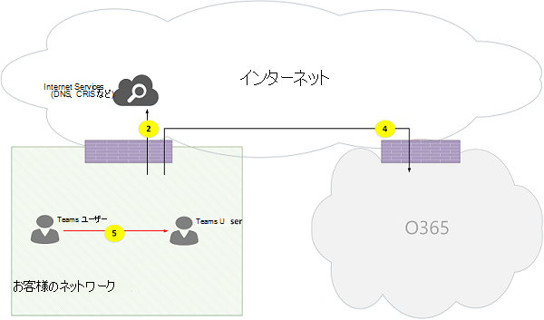](media/microsoft-teams-online-call-flows-figure02.png)

*図 2-顧客ネットワーク内**Figure 2 - Within customer network*
 
手順7では、ピアツーピアメディアフロー5が選択されています。In step 7, peer-to-peer media flow 5 is selected.
 
メディアは双方向です。Media is bidirectional. フロー5の方向は、このドキュメント内のすべてのフローと一貫性のある接続の観点から、1つのサイドが通信を開始することを示します。The direction of flow 5 indicates that one side initiates the communication from a connectivity perspective, consistent with all the flows in this document. この場合、どちらのエンドポイントも顧客のネットワーク内にあるため、どの方向を使用するかは関係ありません。In this case, it doesn't matter which direction is used because both endpoints are within the customer network.

**外部ユーザーに対する顧客ネットワーク (メディアトランスポートリレーによって中継されるメディア):****Customer network to external user (media relayed by Teams Transport Relay):**

[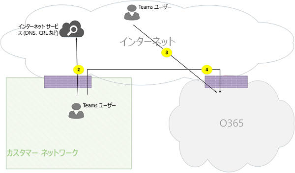](media/microsoft-teams-online-call-flows-figure03.png)

*図 3-外部ユーザーへの顧客ネットワーク (Teams トランスポートリレーによるメディアの中継)**Figure 3 - Customer network to external user (media relayed by Teams Transport Relay)*
 
手順7では、[顧客ネットワーク] から [Office 365] のフロー3、[リモートモバイルチームユーザーから Office 365 へのフロー 3] が選択されています。In step 7, flow 4, from customer network to Office 365, and flow 3, from remote mobile Teams user to Office 365, are selected. これらのフローは、Office 365 内の Teams トランスポートリレーによって中継されます。These flows are relayed by Teams Transport Relay within Office 365.

[メディア] は、双方向で接続の観点から通信を開始する側を示します。Media is bidirectional, where direction indicates which side initiates the communication from a connectivity perspective. この場合、これらのフローは、さまざまなトランスポートプロトコルとアドレスを使って、シグナリングとメディアに使用されます。In this case, these flows are used for signaling and media, via different transport protocols and addresses.

**外部ユーザー (ダイレクトメディア) に対する顧客ネットワーク:****Customer network to external user (direct media):**

*図 4-外部ユーザー (ダイレクトメディア) に対する顧客ネットワーク**Figure 4 - Customer network to external user (direct media)*
 
手順7では、[顧客ネットワークからインターネット (クライアントのピア) へのフロー 2] が選択されています。In step 7, flow 2, from customer network to Internet (client's peer), is selected.
- リモートモバイルユーザー (Office 365 経由で中継されない) のダイレクトメディアはオプションです。Direct media with remote mobile user (that is, not relayed through Office 365) is optional. つまり、お客様は、このパスをブロックして、Office 365 でトランスポートリレー経由でメディアパスを強制することができます。In other words, customer may block this path to enforce a media path through Transport Relay in Office 365.

- メディアは双方向です。Media is bidirectional. フロー2からリモートモバイルユーザーまでの方向は、一方のサイドが接続の観点から通信を開始することを示します。The direction of flow 2 to remote mobile user indicates that one side initiates the communication from a connectivity perspective. 

**内部ユーザーに対する VPN ユーザー (Teams トランスポートリレーによって中継されるメディア)****VPN user to internal user (media relayed by Teams Transport Relay)**

[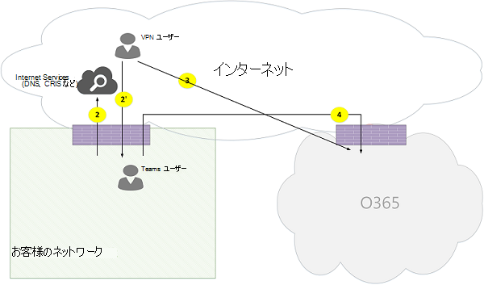](media/microsoft-teams-online-call-flows-figure05.png)

*図 5-内部ユーザーに対する VPN ユーザー (Teams トランスポートリレーによって中継されるメディア)**Figure 5 - VPN user to internal user (media relayed by Teams Transport Relay)*
 
VPN と顧客ネットワークとの間のシグナリングはフロー2で行われています。Signaling between the VPN to the customer network is via flow 2'. 顧客ネットワークと Office 365 間のシグナリングはフロー4経由で行われます。Signaling between the customer network and Office 365 is via flow 4. ただし、メディアは VPN をバイパスし、Office 365 の Teams メディアリレーを通じて、フロー3と4を介してルーティングされます。However, media bypasses the VPN and is routed via flows 3 and 4 through Teams media relay in Office 365.

**内部ユーザー (ダイレクトメディア) に対する VPN ユーザー****VPN user to internal user (direct media)**

[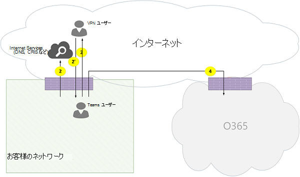](media/microsoft-teams-online-call-flows-figure06.png)

*図 6-VPN ユーザーと内部ユーザー (ダイレクトメディア)**Figure 6 - VPN user to internal user (direct media)*

VPN と顧客ネットワークとの間のシグナリングはフロー2で行われています。Signaling between the VPN to the customer network is via flow 2'. 顧客ネットワークと Office 365 間のシグナリングはフロー4経由で行われます。Signaling between the customer network and Office 365 is via flow 4. ただし、メディアは VPN をバイパスし、ユーザーのネットワークからインターネットへのフロー2経由でルーティングされます。However, media bypasses the VPN and is routed via flow 2 from the customer network to the Internet.

メディアは双方向です。Media is bidirectional. リモートモバイルユーザーのフロー2の方向は、一方のサイドが接続の観点から通信を開始することを示します。The direction of flow 2 to the remote mobile user indicates that one side initiates the communication from a connectivity perspective.

**外部ユーザー (ダイレクトメディア) に対する VPN ユーザー****VPN user to external user (direct media)**

[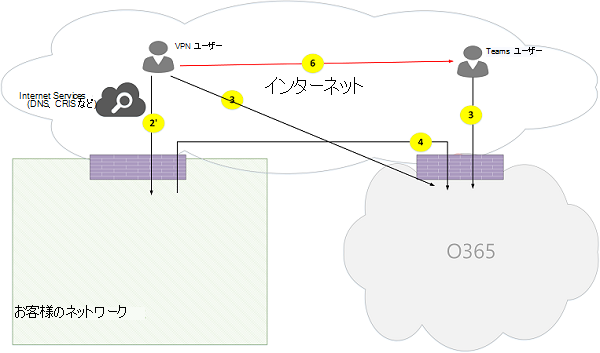](media/microsoft-teams-online-call-flows-figure07.png)

*図 7-VPN ユーザーから外部ユーザーへの接続 (ダイレクトメディア)**Figure 7 - VPN user to external user (direct media)*

VPN ユーザーと顧客ネットワークとの間のシグナリングは、フロー2から、フロー4から Office 365 までの間で行われます。Signaling between the VPN user to the customer network is via flow 2' and via flow 4 to Office 365. ただし、メディアは VPN をバイパスし、フロー6経由でルーティングされます。However, media bypasses VPN and is routed via flow 6.

メディアは双方向です。Media is bidirectional. リモートモバイルユーザーへのフロー6の方向は、一方のサイドが接続の観点から通信を開始することを示します。The direction of flow 6 to the remote mobile user indicates that one side initiates the communication from a connectivity perspective.

#### 使用例: Office 365 トランク経由でのチームと PSTNUse Case: Teams to PSTN through Office 365 Trunk
Office 365 には、公衆交換電話網 (PSTN) での通話の発信と受信を可能にする電話システムがあります。Office 365 has a Phone System that allows placing and receiving calls from the Public Switched Telephone Network (PSTN). PSTN トランクが電話システムの通話プランによって接続されている場合、このユースケースには特別な接続要件はありません。If the PSTN trunk is connected via the Phone System Calling Plan, then there are no special connectivity requirements for this use case. (独自のオンプレミス PSTN トランクを Office 365 に接続する場合は、電話システムのダイレクトルーティングを使うことができます)。(If you want to connect your own on-premises PSTN trunk to Office 365, you can use Phone System Direct Routing.)

[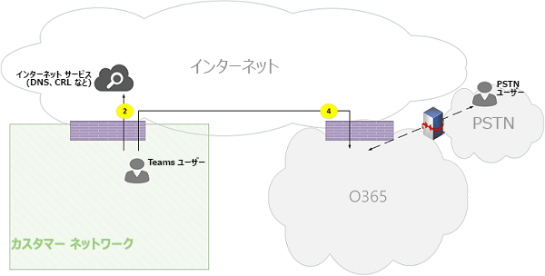](media/microsoft-teams-online-call-flows-figure08.png)

*図 8-Office 365 トランク経由のチーム間の PSTN**Figure 8 - Teams to PSTN through Office 365 Trunk*

#### 使用例: Teams 会議Use Case: Teams Meeting

音声/ビデオ/画面共有 (VBSS) 会議サーバーは、Office 365 に含まれています。The audio/video/screen sharing (VBSS) conferencing server is part of Office 365. これには、顧客ネットワークから到達可能である必要があり、Nomadic Cloud クライアントから到達可能である必要があるパブリック IP アドレスが含まれています。It has a public IP address that must be reachable from the customer network and must be reachable from a Nomadic Cloud client. クライアント/エンドポイントごとに、会議サーバーに接続できるようにする必要があります。Each client/endpoint needs to be able to connect to the conferencing server.

内部クライアントでは、1対1の通話の場合と同じ方法で、ローカル、再帰、およびリレーの候補が取得されます。Internal clients will obtain local, reflexive, and relay candidates in the same manner as described for one-to-one calls. クライアントは、招待状にこれらの候補を会議サーバーに送信します。The clients will send these candidates to the conferencing server in an invite. 会議サーバーは、公開された IP アドレスを持っているため、relay を使用しません。そのため、ローカル IP アドレス候補で応答します。The conferencing server does not use a relay since it has a publicly reachable IP address, so it responds with its local IP address candidate. クライアントと会議サーバーは、1対1の通話の場合と同じ方法で接続性を確認します。The client and conferencing server will check connectivity in the same manner described for one-to-one calls. 

次の点に注意してください。Note that:

- Teams クライアントは Skype for Business 会議に参加できず、Skype for Business クライアントは Teams 会議に参加できません。Teams clients cannot join Skype for Business meetings, and Skype for Business clients cannot join Teams meetings.

- PSTN ユーザーは、会議の開催者の PSTN 通話や会議のプロビジョニングに応じて、"ダイヤルイン" または "ダイヤルアウト" を行うことができます。A PSTN user optionally "Dials IN" or "Dialed OUT", depending on the meeting's organizer PSTN Calling and/or conferencing provisioning. 

- ゲストユーザーまたはお客様のユーザーがゲストプライベートネットワークから参加することができます。これは、厳密な規則を使って、FW/NAT で保護されています。A guest user or a customer user may join from a guest private network, which is protected via FW/NAT with strict rules.

[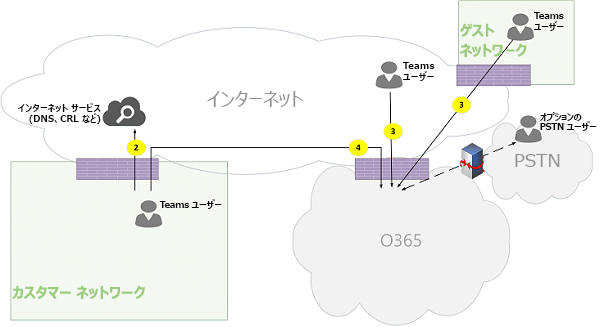](media/microsoft-teams-online-call-flows-figure09.png)

*図 9-Teams 会議**Figure 9 - Teams Meeting*

#### 使用例: オンプレミスの Skype for Business とのフェデレーションUse Case: Federation with Skype for Business on premises

**Office 365 で Teams トランスポートリレーによって中継されるメディア****Media relayed by Teams Transport Relay in Office 365**

[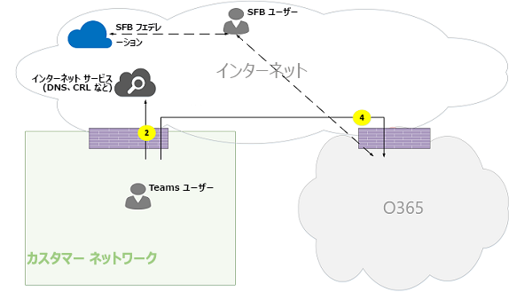](media/microsoft-teams-online-call-flows-figure10.png)

*図 10-Office 365 で Teams トランスポートリレーによって中継されるメディア**Figure 10 - Media relayed by Teams Transport Relay in Office 365*

次の点に注意してください。Note that:

- フェデレーションとは、2つのテナント間の通信を定義することです。Federation is, by definition, a communication between two tenants. この場合、federates を使用するテナント A は、オンプレミスの Skype for Business を使用するテナント B と共に使用されます。In this case, tenant A, which uses Teams, federates with tenant B, which uses Skype for Business on premises. テナント B でも Office 365 を使用している場合、Skype for Business クライアントでは、フロー3を使って Office 365 に接続していました。If tenant B is also using Office 365, then the Skype for Business client would have used flow 3 to connect with Office 365.

- フェデレーションされた Skype for Business クライアントからオンプレミスの Skype for business Server へのシグナルおよびメディアは、このドキュメントの範囲外です。Signaling and media from the federated Skype for Business client to on-premises Skype for Business Server is out of scope of this document. ただし、わかりやすくするために、ここで示しています。However, it is illustrated here for clarity.

- チームと Skype for Business の間のシグナリングは、Office 365 のゲートウェイによってブリッジされます。Signaling between Teams and Skype for Business is bridged by a gateway in Office 365.

- このケースのメディアは、Office 365 の Teams トランスポートリレーによって、フロー4経由で顧客ネットワークおよびリモートの Skype for Business クライアントに中継されます。Media in this case is relayed by Teams Transport Relay in Office 365 to the customer network and remote Skype for Business client via flow 4.

**フェデレーションテナントでの Skype for Business メディアリレーによるメディアの中継****Media relayed by Skype for Business Media Relay in federated tenant**

[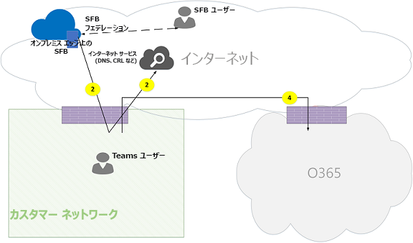](media/microsoft-teams-online-call-flows-figure11.png)

*図 11-フェデレーションされたテナントでの Skype for Business メディアリレーによるメディアの中継**Figure 11 - Media relayed by Skype for Business Media Relay in federated tenant*

次の点に注意してください。Note that:

- フェデレーションされた Skype for Business クライアントから社内の Skype for business Server へのシグナリングとメディアは、このドキュメントの範囲外です。Signaling and media from the federated Skype for Business client to an on-premises Skype for Business Server is out of scope of this document. ただし、わかりやすくするために、ここで示しています。However, it is illustrated here for clarity.

- チームと Skype for Business の間のシグナリングは、Office 365 のゲートウェイによってブリッジされます。Signaling between Teams and Skype for Business is bridged by a Gateway in Office 365.

- このケースのメディアは、flow 2 経由で Skype for Business のオンプレミスメディアリレーを使って顧客ネットワークに中継されます。Media in this case is relayed by Skype for Business on-premises Media Relay to the customer network via flow 2. (Teams ユーザーからフェデレーションされた顧客ネットワークでのリモートメディアリレーへのトラフィックは、逆方向のトラフィックが流れるまでに、最初にメディアリレーによってブロックされることに注意してください)。(Note that traffic from Teams user to the remote Media Relay in the federated customer network will be initially blocked by the Media Relay until traffic in the reverse direction starts to flow. ただし、双方向フローは両方の方向に接続を開きます。)However, the bidirectional flow will open connectivity in both directions.)

**Direct (ピアツーピア)****Direct (peer-to-peer)**

[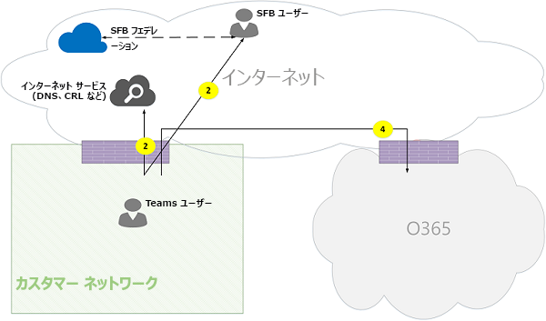](media/microsoft-teams-online-call-flows-figure12.png)

*図 12-直接 (ピアツーピア)**Figure 12 - Direct (peer-to-peer)*

### Teams ハイブリッドトポロジTeams hybrid topology
このトポロジには、Skype for Business のオンプレミス展開を含む Teams が含まれています。This topology includes Teams with a Skype for Business on-premises deployment.

[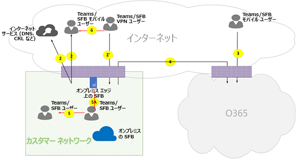](media/microsoft-teams-online-call-flows-figure13.png)

*図 13-Teams ハイブリッドトポロジ**Figure 13 - Teams hybrid topology*
 
- 上の図の矢印の方向は、企業境界での接続に影響を与える通信の開始方向を反映しています。The direction of the arrows on the diagram above reflect the initiation direction of the communication that affects connectivity at the enterprise perimeters. メディア用に UDP の場合は、最初のパケットが逆方向に流れる場合がありますが、これらのパケットは、他の方向のパケットが流れるまでブロックされることがあります。In the case of UDP for media, the first packet(s) may flow in the reverse direction, but these packets may be blocked until packets in the other direction will flow.

- Teams は Skype for Business Online と並行して展開されるため、クライアントは "Teams/SFB ユーザー" として表示されます。Teams is deployed side by side with Skype for Business Online, hence clients are displayed as "Teams/SFB user".

追加のフロー (チームのトポロジの上にあります):Additional flows (on top of Teams topology):
- **フロー 5a** –顧客ネットワーク内の Teams ユーザーと、顧客ネットワーク edge での Skype for business のオンプレミスメディアリレーとの間のピアツーピアメディアフローを表します。**Flow 5A** – Represents a peer-to-peer media flow between a Teams user within the customer network and a Skype for Business on-premises media relay at the customer network edge.

#### ユースケース: チームと Skype for Business の一対一Use Case: Teams to Skype for Business one-to-one
**顧客ネットワーク内のハイブリッド****Hybrid within the customer network**

[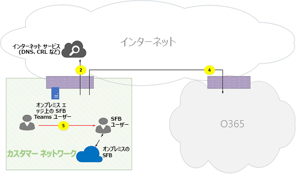](media/microsoft-teams-online-call-flows-figure14.png)

*図 14-顧客ネットワーク内のハイブリッド**Figure 14 - Hybrid within customer network*
 
チームと Skype for Business の間のシグナリングは、Office 365 のゲートウェイによってブリッジされます。Signaling between Teams and Skype for Business is bridged by a gateway in Office 365. ただし、メディアは、フロー5によって顧客ネットワーク内で直接ピアツーピアにルーティングされます。However, media is routed directly peer-to-peer within the customer network via flow 5.

**外部の Skype for Business ユーザーとのハイブリッド顧客ネットワーク– Office 365 によって中継される****Hybrid customer network with external Skype for Business user – relayed by Office 365**

[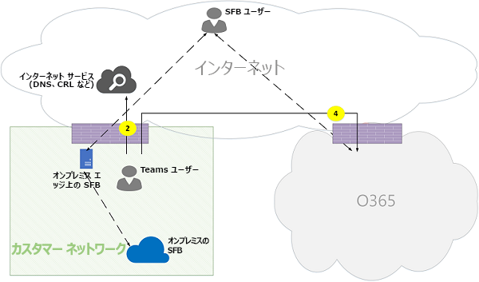](media/microsoft-teams-online-call-flows-figure15.png)

*図 15-外部の Skype for Business ユーザーとのハイブリッド顧客ネットワーク (Office 365 による中継)**Figure 15 - Hybrid customer network with external Skype for Business user - relayed by Office 365*

次の点に注意してください。Note that:

- Skype for Business クライアントからオンプレミスの Skype for Business Server へのシグナリングとメディアは、このドキュメントの範囲外です。Signaling and media from the Skype for Business client to an on-premises Skype for Business Server is out of scope of this document. ただし、わかりやすくするために、ここで示しています。However, it is illustrated here for clarity.

- チームと Skype for Business の間のシグナリングは、Office 365 のゲートウェイによってブリッジされます。Signaling between Teams and Skype for Business is bridged by a gateway in Office 365.

- メディアは、Office 365 の Teams トランスポートリレーを通じて、フロー4経由で顧客ネットワークに中継されます。Media is relayed through Teams Transport Relay in Office 365 to the customer network through flow 4.

**外部の Skype for Business ユーザーを使用したハイブリッド顧客ネットワーク-オンプレミスエッジによる中継****Hybrid customer network with external Skype for Business user – relayed by on-premises Edge**

[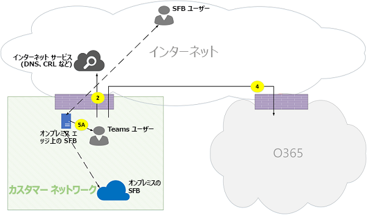](media/microsoft-teams-online-call-flows-figure16.png)

*図 16-外部の Skype for Business ユーザーを使用したハイブリッド顧客ネットワーク-オンプレミスエッジによる中継**Figure 16 - Hybrid customer network with external Skype for Business user - relayed by on-premises Edge*
 
次の点に注意してください。Note that:

- Skype for Business クライアントからオンプレミスの Skype for business Server へのシグナリングとメディアは、このドキュメントの範囲外です。Signaling and media from Skype for Business client to an on-premises Skype for Business Server is out of scope of this document. ただし、わかりやすくするために、ここで示しています。However, it is illustrated here for clarity.

- シグナリングは、Office 365 のゲートウェイでブリッジされます。Signaling is bridged by a gateway in Office 365.

- メディアは、Skype for Business オンプレミスエッジ内の skype for Business メディアリレーによって、media flow 5A を介して顧客ネットワーク内の Teams ユーザーに中継されます。Media is relayed by Skype for Business Media Relay within Skype for Business on-premises Edge to Teams user within the customer network via media flow 5A.

### 電話システムのダイレクトルーティングトポロジを使用しているチームTeams with Phone System Direct Routing topology
このトポロジには、電話システムのダイレクトルーティングを行うチームが含まれます。This topology includes Teams with Phone System Direct Routing. 

ダイレクトルーティングでは、サポートされているオンプレミスのユーザー所有のセッションボーダーコントローラー (SBC) ハードウェアデバイスを Office 365 にペアリングし、テレフォニートランクを接続することで、サードパーティの公衆交換電話網 (PSTN) サービスプロバイダーを使用することができます。そのデバイス。Direct Routing enables you to use a third-party Public Switched Telephone Network (PSTN) service provider by pairing a supported on-premises customer-owned Session Border Controller (SBC) hardware device to Office 365, and then connecting the telephony trunk to that device. 

このシナリオをサポートするには、お客様は Microsoft 認定パートナーの1つから直接ルーティングするための認定された SBC を展開する必要があります。To support this scenario, the customer must deploy a certified SBC for Direct Routing from one of Microsoft's certified partners. SBC は、ベンダーによって推奨されるように構成する必要があります。また、直接 UDP トラフィック用に Office 365 からルーティングすることもできます。The SBC must be configured as recommended by the vendor, and be routable from Office 365 for direct UDP traffic. メディアは、Teams から直接、または Skype for Business クライアントから SBC (Teams のゲートウェイを経由しない) に、または Teams のゲートウェイを通過する場合があります。The media may flow directly from Teams and/or the Skype for Business client to the SBC (bypassing the Teams gateway) or traverse through the Teams gateway. 樹幹が Teams ゲートウェイをバイパスするように構成されている場合、SBC を使用した接続は、SBC をサポートする ICE をベースにしており、Teams/Skype for Business のメディアエンドポイントは ICE をサポートしています。The connectivity with the SBC, when the trunk is configured to bypass the Teams gateway, is based on ICE, where SBC supports ICE-Lite, while the Teams/Skype for Business media endpoint supports ICE Full. 

[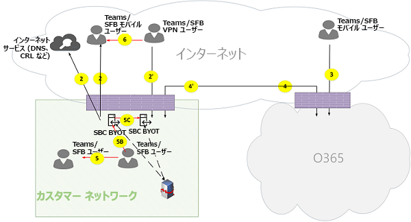](media/microsoft-teams-online-call-flows-figure17.png)

\* 図 17-電話システムのダイレクトルーティングトポロジを使用したチーム\*Figure 17 - Teams with Phone System Direct Routing topology

次の点に注意してください。Note that:

- 上の図の矢印の方向は、企業境界での接続に影響を与える通信の開始方向を反映しています。The direction of the arrows on the diagram above reflect the initiation direction of the communication that affects connectivity at the enterprise perimeters. メディア用に UDP の場合は、最初のパケットが逆方向に流れる場合がありますが、これらのパケットは、他の方向のパケットが流れるまでブロックされることがあります。In the case of UDP for media, the first packet(s) may flow in the reverse direction, but these packets may be blocked until packets in the other direction will flow.

- Teams は Skype for Business Online と並行して展開されるため、クライアントは "Teams/SFB ユーザー" として表示されます。Teams is deployed side by side with Skype for Business Online, hence clients are displayed as "Teams/SFB user".

追加のフロー (Teams online トポロジの一番上):Additional flows (on top of Teams online topology):
- **Flow 4 '** -Office 365 から顧客ネットワークへのフローを表します。これを使用して、お客様は、クラウドの Teams メディアサーバーと SBC オンプレミスの間の接続を確立します。**Flow 4'** - Represents a flow from Office 365 to the customer network, used to establish a connection between the Teams media server in the cloud with the SBC on premises.
- **Flow 5b** –お客様のネットワーク内の Teams ユーザー間のメディアフローを表します。**Flow 5B** – Represents a media flow between the Teams user within the customer network with the Direct Routing SBC in bypass mode.
- **フロー 5c** – PSTN 転送 call バイパスモードで、ダイレクトルーティングの sbc と別のダイレクトルーティングの sbc 間のメディアフローを表します。**Flow 5C** – Represents a media flow between the Direct Routing SBC to another Direct Routing SBC in a PSTN hairpin call bypass mode.

**直接ルーティングを使用する内部ユーザー (Office 365 で Teams トランスポートリレーによって中継されるメディア)****Internal user with Direct Routing (media relayed by Teams Transport Relay in Office 365)**

[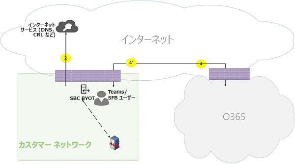](media/microsoft-teams-online-call-flows-figure18.png)

*図 18-直接ルーティングを使用する内部ユーザー (Office 365 で Teams トランスポートリレーによって中継されたメディア)**Figure 18 - Internal user with Direct Routing (media relayed by Teams Transport Relay in Office 365)*

次の点に注意してください。Note that:
 
- SBC には、Office 365 からルーティング可能なパブリック IP アドレスが必要です。The SBC must have a public IP address that is routable from Office 365.

- SBC から Office 365 へのシグナリングおよびメディアの場合は、flow 4 または flow 4 を使います。Signaling and media from the SBC to Office 365 and vice versa use flow 4 and/or flow 4'.

- 顧客ネットワーク内のクライアントから Office 365 へのシグナリングとメディアの送信は、flow 4 を使います。Signaling and media from the client within the customer network to Office 365 use flow 4.

**直接ルーティングを使用するリモートユーザー (メディアは、Office 365 でメディアサーバー (MP) 経由でルーティングされます)****Remote user with Direct Routing (media is routed through a media server (MP) in Office 365)**

[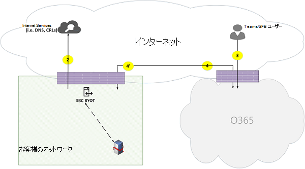](media/microsoft-teams-online-call-flows-figure19.png)

*図 19-直接ルーティングを使用しているリモートユーザー (メディアは、Office 365 でメディアサーバー (MP) 経由でルーティングされます)**Figure 19 - Remote user with Direct Routing (media is routed through a media server (MP) in Office 365)*
 
次の点に注意してください。Note that:

- SBC には、Office 365 からルーティング可能なパブリック IP アドレスが必要です。The SBC must have a public IP address that is routable from Office 365.

- SBC から Office 365 へのシグナリングおよびメディアの場合は、flow 4 または flow 4 を使います。Signaling and media from the SBC to Office 365 and vice versa use flow 4 and/or flow 4'.

- インターネット上のクライアントから Office 365 へのシグナリングとメディアの流れ3を使用します。Signaling and media from the client on the Internet to Office 365 use flow 3.

**内部ユーザー直接ルーティング (メディアバイパス)****Internal user Direct Routing (media bypass)**

[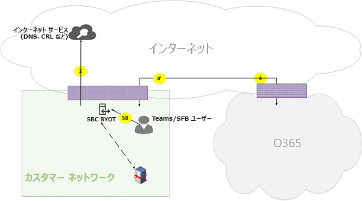](media/microsoft-teams-online-call-flows-figure20.png)

*図 20-内部ユーザー直接ルーティング (メディアバイパス)**Figure 20 - Internal user Direct Routing (media bypass)*
 
次の点に注意してください。Note that:

- SBC には、Office 365 からルーティング可能なパブリック IP アドレスが必要です。The SBC must have a public IP address that is routable from Office 365.

- SBC から Office 365 およびその逆のシグナリングでは、flow 4 またはフロー4のどちらか一方または両方を使用します。Signaling from SBC to Office 365 and vice versa use flow 4 and/or flow 4'.

- 顧客ネットワーク内のクライアントから Office 365 へのシグナリングは、flow 4 を使います。Signaling from client within the customer network to Office 365 use flow 4.

- 顧客ネットワーク内のクライアントから、顧客ネットワーク内の SBC までのメディア。フロー5B を使用します。Media from client within the customer network to SBC within the customer network use flow 5B.

**直接ルーティングを使用するリモートユーザー (Office 365 の Teams トランスポートリレーによって中継されたメディアのバイパス)****Remote user with Direct Routing (media bypass relayed by Teams Transport Relay in Office 365)**

[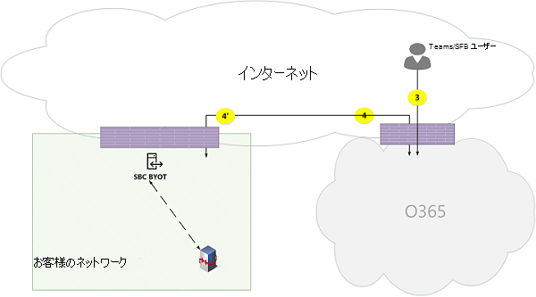](media/microsoft-teams-online-call-flows-figure21.png)

*図 21-直接ルーティングを使用するリモートユーザー (Office 365 の Teams トランスポートリレーによって中継されるメディア)**Figure 21 - Remote user with Direct Routing (media bypass relayed by Teams Transport Relay in Office 365)*

次の点に注意してください。Note that:

- SBC には、Office 365 およびインターネットからルーティング可能なパブリック IP アドレスが必要です。The SBC must have a public IP address that is routable from Office 365 and Internet.

- SBC から Office 365、またはその逆のシグナリングでは、flow 4 またはフロー4のいずれかまたは両方を使用します。Signaling from the SBC to Office 365 and vice versa uses flow 4 and/or flow 4'.

- インターネット上のクライアントから Office 365 への通知では、flow 3 が使用されます。Signaling from the client on the Internet to Office 365 uses flow 3.

- インターネット上のクライアントからお客様のネットワーク内の SBC へのメディアは、フロー3と4を使い、Office 365 の Teams トランスポートリレーによって中継されます。Media from the client on the Internet to the SBC within the customer network uses flows 3 and 4, relayed by Teams Transport Relay in Office 365. 

**リモートユーザーの直接ルーティング (メディアバイパスダイレクト)****Remote user Direct Routing (media bypass direct)**

[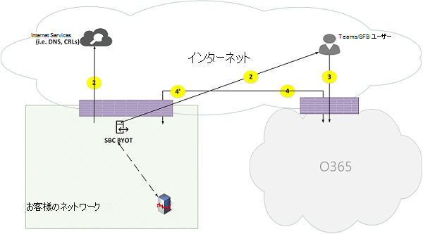](media/microsoft-teams-online-call-flows-figure22.png)

*図 22-リモートユーザーの直接ルーティング (メディアバイパスダイレクト)**Figure 22 - Remote user Direct Routing (media bypass direct)*
 
次の点に注意してください。Note that:

- SBC には、Office 365 およびインターネットからルーティング可能なパブリック IP アドレスが必要です。The SBC must have a public IP address that is routable from Office 365 and the Internet.

- SBC から Office 365、またはその逆のシグナリングでは、flow 4 またはフロー4のいずれかまたは両方を使用します。Signaling from the SBC to Office 365 and vice versa uses flow 4 and/or flow 4'.

- インターネット上のクライアントから Office 365 への通知では、flow 3 が使用されます。Signaling from the client on the Internet to Office 365 uses flow 3.

- インターネット上のクライアントから顧客ネットワーク内の SBC までのメディアは、フロー2を使用します。Media from the client on the Internet to the SBC within the customer network uses flow 2.

**直接ルーティング (メディアバイパス) – PSTN 転送通話 (通話転送/転送のため)****Direct Routing (media bypass) – PSTN hairpin call (due to call forward/transfer)**

[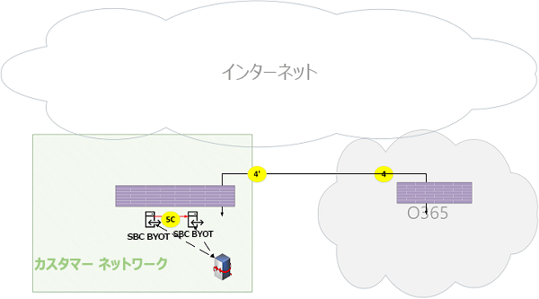](media/microsoft-teams-online-call-flows-figure23.png)

*図 23-直接ルーティング (メディアバイパス)-PSTN 転送通話 (通話転送/転送のため)**Figure 23 - Direct Routing (media bypass) - PSTN hairpin call (due to call forward/transfer)*
 
次の点に注意してください。Note that:

- SBC には、Office 365 からルーティング可能なパブリック IP アドレスが必要です。The SBC must have a public IP address that is routable from Office 365.

- SBC から Office 365、またはその逆のシグナリングでは、flow 4 またはフロー4のいずれかまたは両方を使用します。Signaling from the SBC to Office 365 and vice versa uses flow 4 and/or flow 4'.

- クライアントは、通話が PSTN から PSTN に hairpinned された後に、シグナリングおよびメディアループを終了します。The client is out of the signaling and media loop after the call is hairpinned from PSTN to PSTN.

- 顧客ネットワーク内の SBC インスタンス A から、顧客ネットワーク内の SBC インスタンス B へのメディア (場所 A と B は同じインスタンスである可能性があります) は、フロー5C を使用します。Media from SBC instance A within the customer network to SBC instance B within the customer network (where, A and B can be the same instance) uses flow 5C.

**直接ルーティング (Office 365 経由のメディア) –2つのテナント間での PSTN 転送通話****Direct Routing (media through Office 365) – PSTN hairpin call across two tenants**

[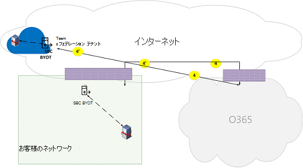](media/microsoft-teams-online-call-flows-figure24.png)

*図 24-ダイレクトルーティング (Office 365 経由のメディア) –2つのテナント間での PSTN 転送通話**Figure 24 - Direct Routing (media through Office 365) – PSTN hairpin call across two tenants*
 
次の点に注意してください。Note that:

- SBC には、Office 365 からルーティング可能なパブリック IP アドレスが必要です。The SBC must have a public IP address that is routable from Office 365.

- SBC から Office 365、またはその逆のシグナリングでは、flow 4 またはフロー4のいずれかまたは両方を使用します。Signaling from the SBC to Office 365 and vice versa uses flow 4 and/or flow 4'.

- クライアントは、通話が PSTN から PSTN に hairpinned された後に、シグナリングおよびメディアループを終了します。The client is out of the signaling and media loop after the call is hairpinned from PSTN to PSTN.

- 顧客ネットワーク X から SBC インスタンス B 内の SBC インスタンスからのメディアは、Office 365 メディアサーバーを通じて中継され、バイパスモードは使用できません。Media from SBC instance A within the customer network X to SBC instance B must be relayed through the Office 365 Media Server and can't use bypass mode.

## エクスプレスルートの最適化を使用しているチームTeams with Express Route optimization

[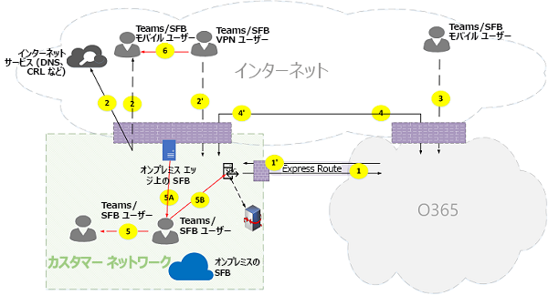](media/microsoft-teams-online-call-flows-figure25.png)

*図 25-簡易ルートの最適化を使用したチーム**Figure 25 - Teams with Express Route optimization*
 
エクスプレスルートが両端揃えで展開されている場合、チームフローはフロー4からフロー1に、フロー4からフロー1に再ルーティングすることができます。In the case that Express Route is justified and deployed, then Teams flows could be re-routed from flow 4 to flow 1 and from flow 4' to flow 1'. ただし、Teams アプリケーションは、フロー4と4を介してインターネット経由で、他の Office 365 のフローに対する依存関係を持っています。そのため、これらのフローはブロックしないでください。However, Teams Application has a hard dependency on other Office 365 flows over the internet via flows 4 and 4'; hence these flows must not be blocked. 

Skype for Business ハイブリッドエッジトラフィックは、インターネットにルーティングされるため、外部ユーザーと通信したり、他のテナントとフェデレーションを行ったりすることはできません。Note that Skype for Business hybrid Edge traffic is routed to the Internet and not to Express Route to communicate with external users and federate with other tenants. 

非対称のフローを防ぐために、再ルーティングは両方の方向で行われる必要があります。To prevent asymmetrical flows, re-routing must be in both directions. つまり、顧客ネットワーク内のアドレスは、インターネットまたはエクスプレスルート (最適化に基づく) を介してルーティングされますが、両方を経由することはできません。In other words, an address within the customer network is routable either through Internet or Express Route, based on optimization, but not through both.

次に例を示します。For example:

**外部ユーザーに対する顧客ネットワーク (メディアトランスポートリレーによって中継されるメディア):****Customer network to external user (media relayed by Teams Transport Relay):**

[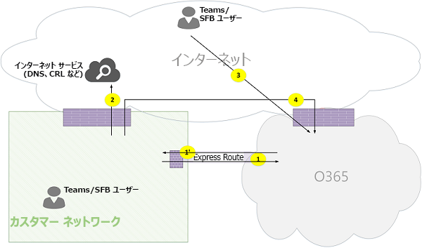](media/microsoft-teams-online-call-flows-figure26.png)

*図 26-外部ユーザーへの顧客ネットワーク (Teams トランスポートリレーによるメディアの中継)**Figure 26 - Customer network to external user (media relayed by Teams Transport Relay)*
 
**高レベルの手順:****High Level Steps:**
1. 顧客ネットワーク内の Teams ユーザーが flow2 経由で URL ドメイン名 (DNS) を解決するTeams User within customer network resolves URL domain name (DNS) via flow2
2. 顧客ネットワーク内の teams ユーザーは、フロー1経由で Teams トランスポートリレーにメディアリレーポートを割り当てます。Teams User within customer network allocates a media Relay port on Teams Transport Relay via flow 1
3. 顧客ネットワーク内の Teams ユーザーは、フロー1から Office 365 への "招待" を、ICE 候補と共に送信します。Teams User within customer network sends "invite" with ICE candidates via flow 1 to Office 365
4. OFFICE 365 は、フロー3経由で外部チームユーザーに通知を送信します。OFFICE 365 sends notification to external Teams user via flow 3
5. Teams の外部ユーザーは、フロー3経由で Teams トランスポートリレーにメディアリレーポートを割り当てますTeams external user allocates a media Relay port on Teams Transport Relay via flow 3
6. Teams の外部ユーザーは、フロー3経由で ICE 候補を使って "answer" を送信します。フロー1を通じて Teams ユーザー A に転送されます。Teams external user sends "answer" with ICE candidates via flow 3, which is forwarded back to Teams user A via Flow 1
7. Teams ユーザー A と Teams ユーザー B は、ICE 接続テストを呼び出し、フロー1と3を選択します。これは、Office 365 の Teams トランスポートリレーによって中継されます。Teams User A and Teams User B invoke ICE connectivity tests and selects flows 1 and 3, which are relayed by Teams Transport Relay in Office 365
8. Teams ユーザーは、フロー1と3を使って Office 365 にテレメトリを送信します。Teams Users send telemetry to Office 365 via flows 1 and 3

>**注**: フロー4では、他のマイクロサービスで Teams アプリケーションの依存関係がサポートされていることを確認する必要があります。**Note**: Flow 4 must be enabled to support dependencies of Teams application on other micro-services that mandates flow 4.
