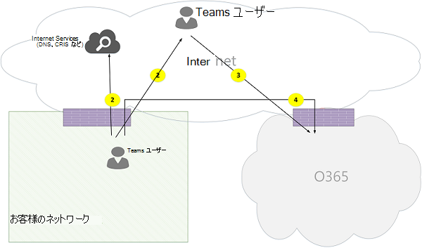

# マイクロソフト チーム呼び出しのフローMicrosoft Teams call flows

> [!Tip]
> チームが、ネットワークを活用する方法、および最適なネットワーク接続を計画する方法を説明するのには次のセッションを監視する:[チームのネットワークの計画](https://aka.ms/teams-networking)Watch the following session to learn how Teams leverages your network and how to plan for optimal network connectivity: [Teams Network Planning](https://aka.ms/teams-networking)

## 概要Overview
この資料では、チームは Office 365 がさまざまなトポロジのフローを呼び出す方法について説明します。This article describes how Teams uses Office 365 call flows in various topologies. さらに、メディアのピア ツー ピア通信に使用される一意のチームのフローを説明します。In addition, it describes unique Teams flows that are used for peer-to-peer media communication. ドキュメントは、ネットワーク上のこれらのフロー、その目的、および原点および終了処理について説明します。The document describes these flows, their purpose, and their origin and termination on the network. この資料の目的は、次のように想定します。For purposes of this article, assume the following:

- X のフローは、クラウド内の Office 365 サービスと通信するために設置の Office 365 クライアントが使用します。Flow X is used by the on-premises Office 365 client to communicate with the Office 365 service in the cloud. これは、発生元がお客様のネットワーク、および Office 365 のエンドポイントとして終了します。It originates from the customer network, and it terminates as an endpoint in Office 365.

- Y の流れは、Office 365 に依存している、インターネット上のサービスと通信するために設置の Office 365 クライアントが使用します。Flow Y is used by the on-premises Office 365 client to communicate with a service on the Internet that Office 365 has a dependency on. これは、発生元がお客様のネットワークとインターネット上のエンドポイントとして終了します。It originates from the customer network, and it terminates as an endpoint on the Internet.

この資料には、次のセクションが含まれています。The article contains the following sections:

- **バック グラウンド**・背景については、Office 365 のフローを通過することがありますの種類のトラフィックと、サードパーティ製のコンポーネントと相互運用性、Office 365 サービスのエンドポイントをお客様のネットワークからの接続ガイド、ネットワークなどが用意されていて、メディア フローを選択するのにはチームで使用される原則。**Background** - Provides background information, such as networks that Office 365 flows may traverse, type of traffic, connectivity guidance from the customer network to Office 365 service endpoints, interoperability with third-party components, and principles that are used by Teams to select media flows.

- **さまざまなトポロジでのフローを呼び出す**に流れるさまざまなトポロジでの使用を示しています。**Call flows in various topologies** - Illustrates the use of call flows in various topologies. 、トポロジごとには、セクションがサポートされているすべてのフローを列挙し、複数のユース ケースを使用してこれらのフローを使用する方法を示しています。For each topology, the section enumerates all supported flows and illustrates how these flows are used via several use cases. それぞれのユース ケースのシーケンスとフロー図を使用してフローの選択範囲を説明します。For each use case, it describes the sequence and selection of flows via a flow diagram. 

- **高速ルートの最適化を使用してチーム**には、単純なトポロジを使用して図の最適化の高速ルートを配置するときにこれらのフローを使用する方法について説明します。**Teams with Express Route optimization** - Describes how these flows are used when Express Route is deployed for optimization, illustrated via a simple topology.

## 背景Background
### ネットワーク セグメントNetwork segments
**お客様のネットワーク**: これは、ネットワーク セグメントを制御および管理します。**Customer network**: This is the network segment that you control and manage. ワイヤード (有線) またはワイヤレス オフィスの建物、オンプレミスのデータ センターに、インターネット プロバイダー、高速のルート、またはプライベートの他のすべてのピアリングへの接続の間で、かどうか、お客様のオフィス内のすべてのユーザー接続が含まれます。This includes all customer connections within customer offices, whether wired or wireless, between office buildings, to on-premises datacenters, and your connections to Internet providers, Express Route, or any other private peering. 

通常、お客様のネットワークにはいくつかのネットワーク境界のファイアウォールまたはプロキシ サーバーが組織のセキュリティ ポリシー、およびのみを設定して構成されている特定のネットワーク トラフィックを許可するとします。Typically, a customer network has several network perimeters with firewalls and/or proxy servers, which enforce your organization's security policies, and that only allow certain network traffic that you have set up and configured. このネットワークを管理するため、ネットワークのパフォーマンスを直接制御があることを強く推奨するには、両方と Office 365 のネットワークに、ネットワークからネットワーク内のサイト内でのパフォーマンスを検証するためにネットワークの評価を完了します。Because you manage this network, you have direct control over the performance of the network, and it is highly recommended that you complete network assessments to validate performance both within sites in your network and from your network to the Office 365 network. 

**インターネット**: これは、お客様のネットワークの外部から Office 365 に接続しているユーザーによって使用される全体的なネットワークの一部であるネットワーク セグメントです。**Internet**: This is the network segment that is part of your overall network that will be used by users who are connecting to Office 365 from outside of the customer network. いくつかのトラフィックを Office 365 をお客様のネットワークからでも使用します。It is also used by some traffic from the customer network to Office 365. 

**表示済みまたはゲストのプライベート ネットワーク**: これは、ネットワーク セグメント、顧客のネットワークの外側ではなく、パブリック インターネット ユーザーや、来園者が訪れる可能性があります。**Visited/Guest private network**: This is the network segment outside your customer network, but not in the public Internet, that your users and/or their guests may visit. たとえば、ホームのプライベート ネットワークや、企業のプライベート ネットワークを展開しているチーム、ユーザーやチーム サービスと対話する、顧客がある場合があります。For example, home private network or an Enterprise private network, that does not deploy Teams, where your users and/or their customers that interact with Teams services may reside.

>**注**: これらのネットワークに適用可能な Office 365 への接続もできます。**Note**: Connectivity to Office 365 is also applicable to these networks.

**Office 365**: これは、Office 365 サービスをサポートしているネットワーク セグメントです。**Office 365**: This is the network segment that supports Office 365 services. お客様のネットワークのほとんどの場所の近くでエッジを持つ世界中に分散されます。It is distributed worldwide with edges in proximity to the customer network in most locations. このドキュメントに記載されている機能には、トランスポートの中継、会議サーバー、およびメディア プロセッサが含まれます。Functions mentioned in this document include Transport Relay, conferencing server, and Media Processor. 

**(省略可能) の高速ルート**: これは、ネットワーク セグメント、専用のプライベート ネットワークへの接続、Office 365 を提供する全体的なネットワークの一部であります。**Express Route (optional)**: This is the network segment that is part of your overall network that will give you a dedicated, private connection to the Office 365 network.

### トラフィックのタイプTypes of traffic

**リアルタイム メディア**: データのリアルタイム転送プロトコル ()、オーディオ、ビデオ、画面の作業負荷の共有をサポートしている RTP にカプセル化します。**Real-time media**: Data encapsulated within RTP (Real-time Transport Protocol) that supports audio, video and screen sharing workloads. 一般に、メディア トラフィックは、高遅延、機密性の高いので、可能であれば、最も直接的なパスを実行しては、リアルタイムのインタラクティブなメディアの品質の観点から最適なトランスポートのトランスポート層プロトコルとして TCP と UDP を使用するのには、このトラフィックをすること.In general, media traffic is highly latency sensitive, so you would want this traffic to take the most direct path possible, and to use UDP versus TCP as the transport layer protocol, which is the best transport for interactive real time media from a quality perspective. (注: 最後の手段としてメディアが TCP/IP を使用することができ、HTTP プロトコル内でも通過するようしていますが、不適切な品質への影響のためお勧めできません)。RTP の流れは、ペイロードのみが暗号化されて、SRTP を使用してセキュリティで保護されています。(Note: As a last resort, media can use TCP/IP and also be tunneled within the HTTP protocol, but it is not recommended due to bad quality implications.) RTP flow is secured via SRTP, in which only the payload is encrypted.

**シグナル**: クライアントとサーバー、または他のクライアント (たとえば、呼び出しが開始されたとき) の活動を制御するために使用されている間の通信リンクおよびインスタント メッセージを配信します。**Signaling**: The communication link between the client and server, or other clients that are used to control activities (for example, when a call is initiated), and deliver instant messages. 最も信号のトラフィックは、SIP プロトコルを使用していくつかのシナリオ (たとえば、Office 365 とのセッション ボーダー コント ローラーとの間の接続) で、残りの HTTPS ベースのインターフェイスを使用します。Most signaling traffic uses the HTTPS-based REST interfaces, though in some scenarios (for example, connection between Office 365 and a Session Border Controller) it uses SIP protocol. このトラフィックは、待機時間にそれほど重要なことを理解するが、サービスの停止が発生する、エンドポイント間の遅延は、いくつかの秒を超える場合にタイムアウトをコールするに重要です。It's important to understand that this traffic is much less sensitive to latency but may cause service outages or call timeouts if latency between the endpoints exceeds several seconds. 

### Office 365 への接続Connectivity to Office 365

チームには、[インターネットへの接続](https://support.office.com/article/connectivity-to-the-internet-64b420ef-0218-48f6-8a34-74bb27633b10)が必要です。Teams requires [connectivity to the Internet](https://support.office.com/article/connectivity-to-the-internet-64b420ef-0218-48f6-8a34-74bb27633b10). チームのエンドポイントの Url と IP アドレスの範囲は、 [Office 365 の Url と IP アドレスの範囲](https://docs.microsoft.com/office365/enterprise/urls-and-ip-address-ranges)に表示されます。Teams endpoint URLs and IP address ranges are listed in [Office 365 URLs and IP address ranges](https://docs.microsoft.com/office365/enterprise/urls-and-ip-address-ranges). (注: 80 と 443 の TCP ポートへの接続を開き、UDP ポート 3478 3481 を指定する必要があります)。さらに、チームに依存している Skype のビジネス、オンライン、インターネットにも接続されている必要があります。(Note: Open connectivity to TCP ports 80 and 443, and to UDP ports 3478 through 3481 is required.) Furthermore, Teams has a dependency on Skype for Business Online, which must also be connected to the Internet.

チーム メディア フローの接続は、IETF の氷 (対話型の接続確立) の標準の手順を使用して実装されます。Teams media flows connectivity is implemented via standard IETF ICE (Interactive Connectivity Establishment) procedures.

### 相互運用性の制限Interoperability restrictions
**サード パーティ製のメディア リレー**: A チーム メディア フロー (つまり、メディアの端点のいずれかがチーム) ビジネス ネイティブ メディア リレーのチームまたは Skype のみをスキャン可能性があります。**Third party media relays**: A Teams media flow (that is, one of the media endpoints is Teams) may traverse only Teams or Skype for Business native media relays. サード パーティ製のメディア リレーとの相互運用性はサポートされていません。Interoperability with a third party media relay is not supported. (注: PSTN との境界でサード パーティ製 SBC が SRTP を使用してセキュリティで保護された、RTP と RTCP のストリームを終了し、次ホップに中継しない必要があります)。(Note: A third party SBC on the boundary with PSTN must terminate RTP/RTCP stream, secured via SRTP, and not relay it to the next hop.)

**第 3 パーティの SIP プロキシ サーバー**: SBC サード ・ パーティ製 SIP ダイアログまたはゲートウェイの信号 A チームはビジネス ネイティブ SIP プロキシのチームまたは Skype をスキャン可能性があります。**Third party SIP proxy servers**: A Teams signaling SIP dialog with a third party SBC and/or gateway may traverse Teams or Skype for Business native SIP proxies. サード パーティ製 SIP プロキシとの相互運用はサポートされていません。Interoperability with a third party SIP proxy is not supported.

**サード パーティ製の B2BUA (つまり、SBC)**: A チーム メディアの流れからすると、PSTN には、サード パーティ製 SBC で終了します。**Third party B2BUA (that is, SBC)**: A Teams media flow from/to the PSTN is terminated by a third party SBC. ただし、相互運用性、サード パーティ製の SBC チーム ネットワーク内で (つまり、サードパーティ製の SBC がビジネス エンドポイントの 2 つのチームと Skype を仲介する) はサポートされていません。However, interoperability with a third party SBC within the Teams network (that is, a third party SBC mediates two Teams/Skype for Business endpoints) is not supported.

### テクノロジは、マイクロソフトのチームで勧めできません。Technologies that are not recommended with Microsoft Teams

**VPN ネットワーク**: メディア トラフィック (フローは、2') をお勧めしません。**VPN network**: It is not recommended for media traffic (that is, flow 2'). VPN クライアントで指定されているすべての VPN 以外の外部のユーザーと同じように分割 VPN および工順メディアのトラフィックを使用する必要がありますhttps://blogs.technet.microsoft.com/nexthop/2011/11/14/enabling-lync-media-to-bypass-a-vpn-tunnel/。The VPN client should use split VPN and route media traffic like any external non-VPN user, as specified in https://blogs.technet.microsoft.com/nexthop/2011/11/14/enabling-lync-media-to-bypass-a-vpn-tunnel/.

>**注**: Lync では、タイトルがチームに該当する場合にもします。**Note**: Although the title is Lync, it is applicable to Teams as well.

**パケット shapers**: 任意の種類のパケットの snippers、パケットの検査、またはパケット デバイスは推奨されませんので、品質が著しく低下する可能性があります。**Packet shapers**: Any kind of packet snippers, packet inspection, or packet shaper devices are not recommended and may degrade quality significantly. 

### 原則Principles
役立つ 4 つの一般的な原則がマイクロソフト チームの呼び出しのフローを理解するにはあります。There are four general principles that help you understand call flows for Microsoft Teams:
 
1.  マイクロソフトのチーム会議は、最初の参加者が参加している同じ地域で Office 365 によってホストされています。A Microsoft Teams conference is hosted by Office 365 in the same region where the first participant joined. (注: かどうか、いくつかのトポロジでは、この規則に例外がありますしが、このドキュメントに記載されているされ、適切なコール フローを示します)。(Note: If there will be exceptions to this rule in some topologies, then they will be described in this document, and illustrated by an appropriate call flow.)

2.  Office 365 のメディア エンドポイントを使用するチームは、メディアの処理のニーズに基づいており、呼び出しの種類に基づいていません。A Teams media endpoint in Office 365 is used based on media processing needs and not based on call type. (などのポイント ツー ポイント呼び出し可能性がありますエンドポイントを使用メディア メディアを処理するクラウドの議事録や録音中に、2 つの参加者との会議、クラウドですべてのメディア エンドポイントは使用できません。)ただし、ほとんどの会議はミキシングとルーティングのために、会議をホストしている割り当てられたメディア エンドポイントを使用します。(For example, a point-to-point call may use a media endpoint in the cloud to process media for transcription and/or recording, while a conference with two participants may not use any media endpoint in the cloud.) However, most conferences will use a media endpoint for mixing and routing purposes, allocated where the conference is hosted. メディア エンドポイントにクライアントから送信されるメディア トラフィックは、直接ルーティングすることがあります。 または顧客ネットワークのファイアウォールの制限のために必要な場合、Office 365 のトランスポートのリレーを使用します。The media traffic sent from a client to the media endpoint may be routed directly or use a Transport Relay in Office 365 if required due to customer network firewall restrictions. 

3.  メディアのトラフィックには、ピア ツー ピアの呼び出しは、呼び出しは、雲の中のメディア エンドポイントを強制しないことを前提として、最短経路を実行する (上記の #2 を参照してください)。Media traffic for peer-to-peer calls take the most direct route that is available, assuming that the call doesn't mandate a media endpoint in the cloud (see #2 above). 優先ルートが (クライアント) は、リモート ピアに直接には、そのルートを使用できない場合、1 つまたは複数のトランスポートのリレー中継トラフィック。The preferred route is direct to the remote peer (client), but if that route isn't available, then one or more Transport Relays will relay traffic. メディア トラフィックでは、このメディアの品質に影響があるために、パケット shapers、VPN サーバー、および、横のないサーバーがするものとことをお勧めします。It is recommended that media traffic shall not transverse servers such as packet shapers, VPN servers, and so on, since this will impact the media quality.

4.  シグナルのトラフィックを常には、ユーザーに最も近いサーバーに移動します。Signaling traffic always goes to the closest server to the user. 

選択されているメディアのパスについての詳細についてを参照してくださいhttps://www.youtube.com/watch?v=1tmHMIlAQdo。To learn more about the details on the media path that is chosen, see https://www.youtube.com/watch?v=1tmHMIlAQdo.

## さまざまなトポロジでの呼び出しのフローCall flows in various topologies
### チームのトポロジTeams topology
このトポロジは、Skype のビジネス サーバーまたは電話システムの直接のルーティングなど、設置型展開しなくても、クラウドからのチームのサービスを利用する顧客によって使用されます。This topology is used by customers that leverage Teams services from the cloud without any on-premises deployment, such as Skype for Business Server or Phone System Direct Routing. さらに、Office 365 へのインタ フェースは、ルートの Azure が高速にインターネット経由で行われます。In addition, the interface to Office 365 is done via the Internet without Azure Express Route. 

*図 1 - チームのトポロジ**Figure 1 - Teams topology*

注意してください。Note that:

- 上の図の矢印の方向は、エンタープライズの境界での接続に影響を与える通信の開始方向を反映します。The direction of the arrows on the diagram above reflect the initiation direction of the communication that affects connectivity at the enterprise perimeters. メディアの場合、UDP の場合に、最初のパケットが逆方向に流れる可能性がありますが、逆方向のパケットが流れるまでは、これらのパケットをブロックされている可能性があります。In the case of UDP for media, the first packet(s) may flow in the reverse direction, but these packets may be blocked until packets in the other direction will flow.
- チームはビジネス オンラインの Skype と並べて配置、チーム/デバイス ユーザーとしてクライアントを表示するためです。Teams is deployed side by side with Skype for Business Online, hence clients are displayed as "Teams/SFB user".

後で次のオプションのトポロジの詳細についてをご覧ください。You can find more information on the following optional topologies later in the article:

- ビジネス用の Skype 設置型展開については、「**チーム ハイブリッド トポロジ**です。Skype for Business on-premises deployment is described in **Teams  hybrid topology**.
- 電話システム直接ルーティング (PSTN への接続) は、**直接ルーティング トポロジを持つチーム**の説明です。Phone System Direct Routing (for PSTN connectivity) is described in **Teams with Direct Routing topology**.
- 高速ルートは、**高速ルートの最適化を使用してチーム**の説明です。Express Route is described in  **Teams with Express Route optimization**.

**フローの説明**をします。**Flow descriptions**:
- **フロー 2** – は、ユーザーのチームの経験の一部として、お客様のネットワークをインターネット上のユーザーによって開始されたフローを表します。**Flow 2** – Represents a flow initiated by a user on the customer network to the Internet as a part of the user's Teams experience. これらのフローの例としては、DNS およびピア ツー ピアのメディアです。Examples of these flows are DNS and peer-to-peer media.
- **フロー 2'** -は、リモート モバイル チームのユーザーがお客様のネットワークへの VPN を開始したフローを表します。**Flow 2'** – Represents a flow initiated by a remote mobile Teams user, with VPN to the customer network. 
- **フロー 3** – は、Office 365 とチームのエンドポイントへのリモート モバイル チーム ユーザーによって開始されたフローを表します。**Flow 3** – Represents a flow initiated by a remote mobile Teams user to Office 365/Teams endpoints. 
- **フロー 4** – は、Office 365 とチームの端点をお客様のネットワーク上のユーザーによって開始されたフローを表します。**Flow 4** – Represents a flow initiated by a user on the customer network to Office 365/Teams endpoints.
- **フロー 5** – は、お客様のネットワーク内のビジネス ユーザーのチームのユーザーと別のチームまたは Skype 間のピア ツー ピア メディア フローを表します。**Flow 5** – Represents a peer-to-peer media flow between a Teams user and another Teams or Skype for Business user within the customer network.
- **フロー 6** – は、インターネット経由でリモート モバイル チームのユーザーとビジネス ユーザーのもう 1 つのリモート モバイル チームまたは Skype との間のピア ツー ピア メディア フローを表します。**Flow 6** – Represents a peer-to-peer media flow between a remote mobile Teams user and another remote mobile Teams or Skype for Business user over the Internet.

#### ユース ケース: 1 対 1Use case: One-to-one
1 対 1 の呼び出しは、呼び出し元が IP アドレス/ポート--ローカルを含む、中継、および再帰 (中継で見られるようクライアントのパブリックの IP アドレス) の候補者で構成される候補のセットを取得する一般的なモデルを使用します。One-to-one calls use a common model in which the caller will obtain a set of candidates consisting of IP addresses/ports--including local, relay, and reflexive (public IP address of client as seen by the relay) candidates. 呼び出し元は呼に候補を送信します。呼は、ような一連の候補を取得し、呼び出し元に送信します。The caller sends these candidates to the called party; the called party also obtains a similar set of candidates and sends them to the caller. 気絶攻撃力: 接続の確認メッセージを使用するどの呼び出し元/と呼ばれる製メディアのパスは次の作業、および作業に最適なパスを選択するとします。STUN connectivity check messages are used to find which caller/called party media paths work, and the best working path is selected. メディア (つまり、SRTP を使用してセキュリティで保護された RTP と RTCP パケット) は、選択した候補者のペアを使用し、送信されます。Media (that is, RTP/RTCP packets secured via SRTP) are then sent using the selected candidate pair. トランスポートのリレーは、Office 365 の一部として配置されます。The Transport relay is deployed as part of Office 365.

場合ローカルの IP アドレスとポート候補または再帰の候補となる接続が確立されて、メディア (または NAT 経由で)、クライアントとの間の直接のパスが選択されること、です。If the local IP address/port candidates or the reflexive candidates have connectivity, then the direct path between the clients (or via a NAT) will be selected for media. クライアントがネットワーク上の両方の場合は、直接のパスを選択してください。If the clients are both on the customer network, then the direct path should be selected. これには、お客様のネットワーク内での直接の UDP 接続が必要です。This requires direct UDP connectivity within the customer network. クライアントが住む遊牧民のクラウドの両方のユーザーの場合は、NAT ファイアウォールによってメディア可能性がありますして直接接続します。If the clients are both nomadic cloud users, then depending on the NAT/firewall, media may use direct connectivity.

1 つのクライアントが内部ネットワーク上とローカルまたは再帰の候補者との間の直接接続が動作している可能性はありませんし、1 つのクライアントを (たとえば、モバイル ・ クラウド ユーザー) の外部にあります。If one client is internal on the customer network and one client is external (for example, a mobile cloud user), then it is unlikely that direct connectivity between the local or reflexive candidates is working. この例では、オプションは、いずれかのクライアントからトランスポートのリレーの候補のいずれかを使用する (たとえば、内部クライアント Office 365 のトランスポートのリレーから中継候補を取得する; に気絶攻撃力: と RTP と RTCP パケットを送信できるようにする必要がある外部のクライアント、リレー) をトランスポートします。In this case, an option is to use one of the Transport Relay candidates from either client (for example, the internal client obtained a relay candidate from the Transport relay in Office 365; the external client needs to be able to send STUN/RTP/RTCP packets to the transport relay). 別のオプションが、内部クライアントがクラウドのモバイル クライアントによって取得されたリレー候補者に送信します。Another option is the internal client sends to the relay candidate obtained by the mobile cloud client. 、メディアの UDP 接続を強くお勧めですが TCP がサポートされていることに注意してください。Note that, although UDP connectivity for media is highly recommended, TCP is supported.

**大まかな手順を実行**します。**High-level steps**:
1. チームがユーザー A 解決 URL ドメイン名 (DNS) flow2 を使用してTeams User A resolves URL domain name (DNS) via flow2
2. チーム ユーザー A が 4 のフローを使用してチームのトランスポートのリレーにリレー ポートをメディアに割り当てますTeams User A allocates a media Relay port on Teams Transport Relay via flow 4
3. チームがユーザー A の送信フロー 4 を Office 365 に氷の応募者に「招待」Teams User A sends "invite" with ICE candidates via flow 4 to Office 365
4. Office 365 は、4 のフローを使用してユーザー B のチームに通知を送信します。Office 365 sends notification to Teams User B via flow 4
5. ユーザー B のチームに、メディア フロー 4 を使用してチームのトランスポートのリレーにリレー ポートが割り当てられますTeams User B allocates a media Relay port on Teams Transport Relay via flow 4
6. ユーザー B のチーム 4 のフローを使用してチーム ユーザー A には、転送の流れ 4、氷の応募者の「応答」を送信します。Teams User B sends "answer" with ICE candidates via flow 4, which is forwarded back to Teams User A via Flow 4
7. チーム ユーザー A とユーザー B のチームは、氷の接続テストを起動し、利用可能なメディアに最適なパスが選択されている (さまざまなユース ケースの下の図を参照)Teams User A and Teams User B invoke ICE connectivity tests and the best available media path is selected (see diagrams below for various use cases)
8. チームのユーザーが Office 365 にフロー 4 を介して遠隔測定を送信します。Teams Users send telemetry to Office 365 via flow 4

**お客様のネットワーク内で****Within customer network:**

*お客様のネットワーク内で、図 2-**Figure 2 - Within customer network*
 
手順 7 では、ピア ツー ピア メディア フロー 5 が選択されます。In step 7, peer-to-peer media flow 5 is selected.
 
メディアは、双方向です。Media is bidirectional. 5 の流れの方向は、1 つの側面に接続性の観点から、このドキュメント内のすべてのフローと一貫性のある通信が開始されることを示します。The direction of flow 5 indicates that one side initiates the communication from a connectivity perspective, consistent with all the flows in this document. この例では、方向を使用すると、両方のエンドポイントがお客様のネットワーク内にあるために関係ありません。In this case, it doesn't matter which direction is used because both endpoints are within the customer network.

**外部ユーザー (メディア トランスポート リレーのチームによって中継) にお客様のネットワーク:****Customer network to external user (media relayed by Teams Transport Relay):**

*図 3 - お客様のネットワークを外部のユーザー (メディア トランスポート リレーのチームによって中継)**Figure 3 - Customer network to external user (media relayed by Teams Transport Relay)*
 
手順 7、4 では、Office 365 では、お客様のネットワークからの流れとモバイル チーム ユーザーを Office 365 では、リモートからのフロー 3 が選択されます。In step 7, flow 4, from customer network to Office 365, and flow 3, from remote mobile Teams user to Office 365, are selected. これらのフローは、Office 365 のトランスポート リレーのチームがリレーされます。These flows are relayed by Teams Transport Relay within Office 365.

メディアは、双方向、方向がどちらの側が接続性の観点からの通信を開始するを示します。Media is bidirectional, where direction indicates which side initiates the communication from a connectivity perspective. この例では、シグナリングとメディアは、さまざまなトランスポート プロトコルとアドレスを使用してこれらのフローが使用されます。In this case, these flows are used for signaling and media, via different transport protocols and addresses.

**外部ユーザー (ダイレクト ・ メディア) にお客様のネットワーク:****Customer network to external user (direct media):**

*図 4 - お客様のネットワークを外部のユーザー (ダイレクト ・ メディア)**Figure 4 - Customer network to external user (direct media)*
 
手順 7 では、インターネット (クライアントのピア) にお客様のネットワークから第 2 のフローが選択されます。In step 7, flow 2, from customer network to Internet (client's peer), is selected.
- (Office 365 で中継されないが、) をリモートのモバイル ユーザーとの直接のメディアは、省略可能です。Direct media with remote mobile user (that is, not relayed through Office 365) is optional. つまり、顧客には、Office 365 でトランスポート リレー経由のメディア パスを適用するのには、このパスもブロックされます。In other words, customer may block this path to enforce a media path through Transport Relay in Office 365.

- メディアは、双方向です。Media is bidirectional. 2 リモート モバイル ユーザーへの流れの方向は、一方の側が接続性の観点からの通信を開始することを示します。The direction of flow 2 to remote mobile user indicates that one side initiates the communication from a connectivity perspective. 

**VPN ユーザーが内部ユーザー (メディア トランスポート リレーのチームによって中継)****VPN user to internal user (media relayed by Teams Transport Relay)**

*図 5 - VPN ユーザーが内部ユーザー (メディア トランスポート リレーのチームによって中継)**Figure 5 - VPN user to internal user (media relayed by Teams Transport Relay)*
 
フロー 2' を使用して、お客様のネットワークに VPN との間の信号です。Signaling between the VPN to the customer network is via flow 2'. フロー 4 を介して、お客様のネットワークと Office 365 の間の信号です。Signaling between the customer network and Office 365 is via flow 4. ただし、メディアでは、VPN をバイパスし、フロー 3 と 4 Office 365 のチームのメディア リレーから経由でルーティングします。However, media bypasses the VPN and is routed via flows 3 and 4 through Teams media relay in Office 365.

**VPN ユーザーが内部ユーザー (ダイレクト ・ メディア)****VPN user to internal user (direct media)**

*図 6 - VPN ユーザーが内部ユーザー (ダイレクト ・ メディア)**Figure 6 - VPN user to internal user (direct media)*

フロー 2' を使用して、お客様のネットワークに VPN との間の信号です。Signaling between the VPN to the customer network is via flow 2'. フロー 4 を介して、お客様のネットワークと Office 365 の間の信号です。Signaling between the customer network and Office 365 is via flow 4. ただし、メディアでは、VPN をバイパスし、2 からへのフロー、顧客のネットワーク、インターネット経由でルーティングします。However, media bypasses the VPN and is routed via flow 2 from the customer network to the Internet.

メディアは、双方向です。Media is bidirectional. 2 リモート モバイル ユーザーへの流れの方向は、一方の側が接続性の観点からの通信を開始することを示します。The direction of flow 2 to the remote mobile user indicates that one side initiates the communication from a connectivity perspective.

**VPN ユーザーが外部ユーザー (ダイレクト ・ メディア)****VPN user to external user (direct media)**

*図 7 - VPN ユーザーが外部ユーザー (ダイレクト ・ メディア)**Figure 7 - VPN user to external user (direct media)*

フロー 2' を使用して、Office 365 にフロー 4 は、VPN ユーザーがお客様のネットワークの間の信号です。Signaling between the VPN user to the customer network is via flow 2' and via flow 4 to Office 365. ただし、メディアでは、VPN をバイパスし、フロー 6 を介してルーティングされます。However, media bypasses VPN and is routed via flow 6.

メディアは、双方向です。Media is bidirectional. 6 リモート モバイル ユーザーへの流れの方向は、一方の側が接続性の観点からの通信を開始することを示します。The direction of flow 6 to the remote mobile user indicates that one side initiates the communication from a connectivity perspective.

#### Office 365 のトランクから PSTN への使用例: チームUse Case: Teams to PSTN through Office 365 Trunk
Office 365 は、電話システムを配置して、呼び出しから、公衆交換電話網 (PSTN) の受信を可能にするには。Office 365 has a Phone System that allows placing and receiving calls from the Public Switched Telephone Network (PSTN). PSTN トランクは、電話システムを呼び出す計画を使用して接続している場合この使用例の特殊な接続要件がありません。If the PSTN trunk is connected via the Phone System Calling Plan, then there are no special connectivity requirements for this use case. (独自設置の PSTN トランクを Office 365 に接続する場合は、することができます使用電話システムの直接のルーティング)。(If you want to connect your own on-premises PSTN trunk to Office 365, you can use Phone System Direct Routing.)

*図 8 - Office 365 のトランクから PSTN へのチーム**Figure 8 - Teams to PSTN through Office 365 Trunk*

#### 使用例: チーム会議Use Case: Teams Meeting

(VBSS) の共有、オーディオ/ビデオ/スクリーン会議サーバーは、Office 365 の一部です。The audio/video/screen sharing (VBSS) conferencing server is part of Office 365. お客様のネットワークから到達可能である必要があり、クラウドの住む遊牧民のクライアントから到達可能である必要がありますが、パブリック IP アドレスがあります。It has a public IP address that must be reachable from the customer network and must be reachable from a Nomadic Cloud client. 各クライアントまたはエンドポイントでは、会議サーバーに接続できるようにする必要があります。Each client/endpoint needs to be able to connect to the conferencing server.

内部クライアントでは、1 対 1 の呼び出しの説明に従って、ローカル、再帰的、および中継の候補を同様の方法で取得するは。Internal clients will obtain local, reflexive, and relay candidates in the same manner as described for one-to-one calls. クライアントは、これらの候補者を招待の会議サーバーに送信されます。The clients will send these candidates to the conferencing server in an invite. 会議サーバーは、そのローカル IP アドレスの候補を返しますので、パブリックにアクセス可能な IP アドレスがあるために、リレーを使用しません。The conferencing server does not use a relay since it has a publicly reachable IP address, so it responds with its local IP address candidate. クライアントと会議サーバーは 1 対 1 の呼び出しの説明と同じ方法で接続を確認します。The client and conferencing server will check connectivity in the same manner described for one-to-one calls. 

注意してください。Note that:

- チーム クライアントは、会議の Skype を参加することはできませんし、Skype のビジネス クライアント チーム会議に参加できません。Teams clients cannot join Skype for Business meetings, and Skype for Business clients cannot join Teams meetings.

- PSTN ユーザーがオプションで「ダイヤル IN」または「ダイヤル アウト時に、PSTN の呼び出し、会議の開催者、会議の準備によって。A PSTN user optionally "Dials IN" or "Dialed OUT", depending on the meeting's organizer PSTN Calling and/or conferencing provisioning. 

- ゲスト ユーザーまたは顧客のユーザーは、ゲストのプライベート ネットワークが保護されている FW と NAT を使用して厳密なルールとするから参加できます。A guest user or a customer user may join from a guest private network, which is protected via FW/NAT with strict rules.

*図 9 - チームのミーティング**Figure 9 - Teams Meeting*

#### 設置型のビジネス用の Skype での使用例: フェデレーションUse Case: Federation with Skype for Business on premises

**メディアを Office 365 でトランスポート リレーのチームによって中継****Media relayed by Teams Transport Relay in Office 365**

*図 10 - Office 365 のトランスポート リレーのチームによって中継メディア**Figure 10 - Media relayed by Teams Transport Relay in Office 365*

注意してください。Note that:

- フェデレーションとは、定義では、2 つのテナント間の通信します。Federation is, by definition, a communication between two tenants. この例では、テナント A、チームを使用するフェデレーション テナント B では、社内のビジネスの Skype を使用します。In this case, tenant A, which uses Teams, federates with tenant B, which uses Skype for Business on premises. テナント B はまた、Office 365 を使用している場合、ビジネス クライアント用の Skype を使ってフロー 3 Office 365 を使用して接続します。If tenant B is also using Office 365, then the Skype for Business client would have used flow 3 to connect with Office 365.

- シグナル化とビジネスのサーバーの設置型の Skype に連合の Skype ビジネス クライアント用のメディアは、このドキュメントの範囲外です。Signaling and media from the federated Skype for Business client to on-premises Skype for Business Server is out of scope of this document. ただし、それは次に示すわかりやすくするためです。However, it is illustrated here for clarity.

- チームとビジネス用の Skype との間の信号は、Office 365 にゲートウェイでブリッジです。Signaling between Teams and Skype for Business is bridged by a gateway in Office 365.

- メディアこの場合に中継されますチーム トランスポートのリレーでは、Office 365 でお客様のネットワークおよび 4 のフローを使用してビジネス クライアント用のリモートの Skype。Media in this case is relayed by Teams Transport Relay in Office 365 to the customer network and remote Skype for Business client via flow 4.

**連合のテナントで、ビジネス メディア リレー用 Skype によって中継メディア****Media relayed by Skype for Business Media Relay in federated tenant**

*図 11 - 連合のテナントで、ビジネス メディア リレー用 Skype によって中継メディア**Figure 11 - Media relayed by Skype for Business Media Relay in federated tenant*

注意してください。Note that:

- シグナル化と、設置型の Skype ビジネス サーバーの連合の Skype ビジネス クライアント用のメディアは、このドキュメントの範囲外です。Signaling and media from the federated Skype for Business client to an on-premises Skype for Business Server is out of scope of this document. ただし、それは次に示すわかりやすくするためです。However, it is illustrated here for clarity.

- チームとビジネス用の Skype との間の信号は、Office 365 にゲートウェイでブリッジです。Signaling between Teams and Skype for Business is bridged by a Gateway in Office 365.

- メディアでもによって中継される Skype フロー 2 を介してお客様のネットワークに、ビジネスの設置型メディア リレー用です。Media in this case is relayed by Skype for Business on-premises Media Relay to the customer network via flow 2. (連合のお客様のネットワークでリモート メディア リレーにチームのユーザーからのトラフィックはブロックするように最初にメディア リレーで逆方向のトラフィックのフローが開始されるまでに注意してください。(Note that traffic from Teams user to the remote Media Relay in the federated customer network will be initially blocked by the Media Relay until traffic in the reverse direction starts to flow. ただし、双方向フローは開く接続双方向で)。However, the bidirectional flow will open connectivity in both directions.)

**ダイレクト (ピア ツー ピア)****Direct (peer-to-peer)**

*図 12 - ダイレクト (ピア ツー ピア)**Figure 12 - Direct (peer-to-peer)*

### チーム ハイブリッド トポロジTeams hybrid topology
このトポロジには、設置型展開のビジネスを Skype でのチームが含まれています。This topology includes Teams with a Skype for Business on-premises deployment.

*図 13 - チーム ハイブリッド トポロジ**Figure 13 - Teams hybrid topology*
 
- 上の図の矢印の方向は、エンタープライズの境界での接続に影響を与える通信の開始方向を反映します。The direction of the arrows on the diagram above reflect the initiation direction of the communication that affects connectivity at the enterprise perimeters. メディアの場合、UDP の場合に、最初のパケットが逆方向に流れる可能性がありますが、逆方向のパケットが流れるまでは、これらのパケットをブロックされている可能性があります。In the case of UDP for media, the first packet(s) may flow in the reverse direction, but these packets may be blocked until packets in the other direction will flow.

- チームはビジネス オンラインの Skype と並べて配置、チーム/デバイス ユーザーとしてクライアントを表示するためです。Teams is deployed side by side with Skype for Business Online, hence clients are displayed as "Teams/SFB user".

(チーム トポロジ) の上にフローを追加します。Additional flows (on top of Teams topology):
- **フロー 5A** – は、お客様のネットワーク内のチームのユーザーと顧客ネットワーク エッジで、ビジネスの設置型メディア リレー用、Skype との間のピア ツー ピア メディア フローを表します。**Flow 5A** – Represents a peer-to-peer media flow between a Teams user within the customer network and a Skype for Business on-premises media relay at the customer network edge.

#### 一対一のビジネス用の Skype の使用例: チームUse Case: Teams to Skype for Business one-to-one
**お客様のネットワーク内でのハイブリッド****Hybrid within the customer network**

*図 14 - お客様のネットワーク内でのハイブリッド**Figure 14 - Hybrid within customer network*
 
チームとビジネス用の Skype との間の信号は、Office 365 にゲートウェイでブリッジです。Signaling between Teams and Skype for Business is bridged by a gateway in Office 365. ただし、メディアは、5 のフローを使用してネットワークの顧客内でピアに直接ルーティングされます。However, media is routed directly peer-to-peer within the customer network via flow 5.

**ハイブリッド ビジネス ユーザー: Office 365 によって中継の外部の Skype でのお客様のネットワーク****Hybrid customer network with external Skype for Business user – relayed by Office 365**

*図 15 - ハイブリッド顧客ネットワーク ビジネス ユーザーの外部の Skype での Office 365 によって中継**Figure 15 - Hybrid customer network with external Skype for Business user - relayed by Office 365*

注意してください。Note that:

- シグナル化とビジネス クライアント用の Skype から、設置型の Skype ビジネス サーバーのメディアは、このドキュメントの範囲外です。Signaling and media from the Skype for Business client to an on-premises Skype for Business Server is out of scope of this document. ただし、それは次に示すわかりやすくするためです。However, it is illustrated here for clarity.

- チームとビジネス用の Skype との間の信号は、Office 365 にゲートウェイでブリッジです。Signaling between Teams and Skype for Business is bridged by a gateway in Office 365.

- メディアは、4 の流れをお客様のネットワークに Office 365 のトランスポート リレーのチームによって中継されます。Media is relayed through Teams Transport Relay in Office 365 to the customer network through flow 4.

**ハイブリッド ビジネス ユーザー: 設置型のエッジによって中継の外部の Skype でお客様のネットワーク****Hybrid customer network with external Skype for Business user – relayed by on-premises Edge**

*設置型のエッジによって中継図 16 - ビジネス ユーザーの外部の Skype でハイブリッドお客様のネットワーク ・**Figure 16 - Hybrid customer network with external Skype for Business user - relayed by on-premises Edge*
 
注意してください。Note that:

- シグナル化と、設置型の Skype ビジネス サーバーのクライアントのビジネスの Skype からメディアは、このドキュメントの範囲外です。Signaling and media from Skype for Business client to an on-premises Skype for Business Server is out of scope of this document. ただし、それは次に示すわかりやすくするためです。However, it is illustrated here for clarity.

- Office 365 にゲートウェイでブリッジを通知します。Signaling is bridged by a gateway in Office 365.

- メディアは、メディア フロー 5A を使用してお客様のネットワーク内でのチームのユーザーにビジネスの設置型のエッジの Skype 内でビジネス ・ メディア リレー用 Skype で中継されます。Media is relayed by Skype for Business Media Relay within Skype for Business on-premises Edge to Teams user within the customer network via media flow 5A.

### 電話システムの直接のルーティング トポロジを持つチームTeams with Phone System Direct Routing topology
このトポロジには、電話システムの直接のルーティングのチームが含まれています。This topology includes Teams with Phone System Direct Routing. 

直接ルーティングでは、オンプレミスでサポートされているお客様が所有するセッション ボーダー コント ローラー (SBC) ハードウェア デバイスに、Office 365 をペアとするテレフォニー トランクを接続し、サード ・ パーティ製の公衆交換電話網 (PSTN) サービス プロバイダーを使用することができます。そのデバイスです。Direct Routing enables you to use a third-party Public Switched Telephone Network (PSTN) service provider by pairing a supported on-premises customer-owned Session Border Controller (SBC) hardware device to Office 365, and then connecting the telephony trunk to that device. 

このシナリオをサポートするためにお客様は、直接ルーティングのいずれかのマイクロソフトの認定パートナーの皆様からの認定の SBC を展開する必要があります。To support this scenario, the customer must deploy a certified SBC for Direct Routing from one of Microsoft's certified partners. SBC は、ベンダーの推奨に従って構成する必要があり、直接の UDP トラフィックを Office 365 から迂回可能であります。The SBC must be configured as recommended by the vendor, and be routable from Office 365 for direct UDP traffic. メディアは、(チーム ゲートウェイのバイパス)、SBC をチームとビジネス クライアント用の Skype から直接フローまたはチームのゲートウェイを通過可能性があります。The media may flow directly from Teams and/or the Skype for Business client to the SBC (bypassing the Teams gateway) or traverse through the Teams gateway. SBC と接続トランクがチームのゲートウェイを使用しないに構成されている場合は、SBC をサポートしている ICE Lite、ビジネス メディア エンドポイントのチームと Skype は、アイス完全をサポートしているときに、氷に基づいています。The connectivity with the SBC, when the trunk is configured to bypass the Teams gateway, is based on ICE, where SBC supports ICE-Lite, while the Teams/Skype for Business media endpoint supports ICE Full. 

\* 図 17 - チーム、電話システムの直接のルーティング トポロジ\*Figure 17 - Teams with Phone System Direct Routing topology

注意してください。Note that:

- 上の図の矢印の方向は、エンタープライズの境界での接続に影響を与える通信の開始方向を反映します。The direction of the arrows on the diagram above reflect the initiation direction of the communication that affects connectivity at the enterprise perimeters. メディアの場合、UDP の場合に、最初のパケットが逆方向に流れる可能性がありますが、逆方向のパケットが流れるまでは、これらのパケットをブロックされている可能性があります。In the case of UDP for media, the first packet(s) may flow in the reverse direction, but these packets may be blocked until packets in the other direction will flow.

- チームはビジネス オンラインの Skype と並べて配置、チーム/デバイス ユーザーとしてクライアントを表示するためです。Teams is deployed side by side with Skype for Business Online, hence clients are displayed as "Teams/SFB user".

(トポロジーのオンライン チーム) の上にフローを追加します。Additional flows (on top of Teams online topology):
- **フロー 4'** - は、Office 365 からお客様のネットワーク、社内 SBC をクラウドでチームのメディア サーバーとの間の接続を確立するために使用するフローを表します。**Flow 4'** - Represents a flow from Office 365 to the customer network, used to establish a connection between the Teams media server in the cloud with the SBC on premises.
- **フロー 5 b** – は、バイパス モードで直接ルーティングの SBC を使用して顧客ネットワーク内のチームのユーザーの間でメディアのフローを表します。**Flow 5B** – Represents a media flow between the Teams user within the customer network with the Direct Routing SBC in bypass mode.
- **フロー 5 C** – は、別直接ルーティング SBC PSTN hairpin 呼び出しバイパス モードに直接ルーティングの SBC の間でメディアのフローを表します。**Flow 5C** – Represents a media flow between the Direct Routing SBC to another Direct Routing SBC in a PSTN hairpin call bypass mode.

**内部のユーザーに直接ルーティング (メディアを Office 365 でトランスポート リレーのチームによって中継)****Internal user with Direct Routing (media relayed by Teams Transport Relay in Office 365)**

*図 18 - 内部のユーザーに直接ルーティング (メディアを Office 365 でトランスポート リレーのチームによって中継)**Figure 18 - Internal user with Direct Routing (media relayed by Teams Transport Relay in Office 365)*

注意してください。Note that:
 
- SBC には、パブリック IP アドレスから Office 365 にルーティング可能である必要があります。The SBC must have a public IP address that is routable from Office 365.

- シグナリングと Office 365 と副逆に、SBC からのメディアは、フロー 4 を使用して、フロー 4'。Signaling and media from the SBC to Office 365 and vice versa use flow 4 and/or flow 4'.

- シグナル化とお客様のネットワーク内でクライアントからのメディアを Office 365 には、4 のフローを使用します。Signaling and media from the client within the customer network to Office 365 use flow 4.

**(メディアを Office 365 のメディア ・ サーバ (MP) をルーティングします)、直接のルーティングとリモート ・ ユーザ****Remote user with Direct Routing (media is routed through a media server (MP) in Office 365)**

*図 19 - (メディアを Office 365 のメディア ・ サーバ (MP) をルーティングします)、直接のルーティングとリモート ・ ユーザ**Figure 19 - Remote user with Direct Routing (media is routed through a media server (MP) in Office 365)*
 
注意してください。Note that:

- SBC には、パブリック IP アドレスから Office 365 にルーティング可能である必要があります。The SBC must have a public IP address that is routable from Office 365.

- シグナリングと Office 365 と副逆に、SBC からのメディアは、フロー 4 を使用して、フロー 4'。Signaling and media from the SBC to Office 365 and vice versa use flow 4 and/or flow 4'.

- シグナル化と、インターネット上のクライアントからのメディアを Office 365 には、フロー 3 を使用します。Signaling and media from the client on the Internet to Office 365 use flow 3.

**内部のユーザーが直接ルーティング (メディアのバイパス)****Internal user Direct Routing (media bypass)**

*図 20 - 内部のユーザーが直接ルーティング (メディアのバイパス)**Figure 20 - Internal user Direct Routing (media bypass)*
 
注意してください。Note that:

- SBC には、パブリック IP アドレスから Office 365 にルーティング可能である必要があります。The SBC must have a public IP address that is routable from Office 365.

- 使用を Office 365 にし、その逆の SBC から信号 4 のフローや、フロー 4'。Signaling from SBC to Office 365 and vice versa use flow 4 and/or flow 4'.

- お客様のネットワーク内のクライアントから Office 365 の使用フロー 4 を通知します。Signaling from client within the customer network to Office 365 use flow 4.

- お客様のネットワーク内の SBC をお客様のネットワーク内のクライアントからのメディアでは、フローの 5 b を使用します。Media from client within the customer network to SBC within the customer network use flow 5B.

**リモート ユーザーが直接ルーティング (メディアのバイパスを Office 365 でトランスポート リレーのチームによって中継)****Remote user with Direct Routing (media bypass relayed by Teams Transport Relay in Office 365)**

*図 21 - リモート ユーザーが直接ルーティング (メディアのバイパスを Office 365 でトランスポート リレーのチームによって中継)**Figure 21 - Remote user with Direct Routing (media bypass relayed by Teams Transport Relay in Office 365)*

注意してください。Note that:

- SBC には、パブリック IP アドレスは、Office 365 とインターネットからルーティングする必要があります。The SBC must have a public IP address that is routable from Office 365 and Internet.

- Office 365、およびその逆の場合、SBC からシグナル フロー 4 と 4' の流れを使用します。Signaling from the SBC to Office 365 and vice versa uses flow 4 and/or flow 4'.

- フロー 3 を使用して Office 365 にインターネット上のクライアントからの通知です。Signaling from the client on the Internet to Office 365 uses flow 3.

- インターネット上のクライアントからのメディアをお客様のネットワーク内で SBC には、フロー 3 と 4 では、Office 365 でトランスポート リレーのチームによって中継を使用します。Media from the client on the Internet to the SBC within the customer network uses flows 3 and 4, relayed by Teams Transport Relay in Office 365. 

**リモート ユーザーが直接ルーティングの場合 (メディアでは、ダイレクトを使用しない)****Remote user Direct Routing (media bypass direct)**

*図 22 - リモート ユーザーが直接ルーティングの場合 (メディアでは、ダイレクトを使用しない)**Figure 22 - Remote user Direct Routing (media bypass direct)*
 
注意してください。Note that:

- SBC には、パブリック IP アドレスは、Office 365 とインターネットからルーティングする必要があります。The SBC must have a public IP address that is routable from Office 365 and the Internet.

- Office 365、およびその逆の場合、SBC からシグナル フロー 4 と 4' の流れを使用します。Signaling from the SBC to Office 365 and vice versa uses flow 4 and/or flow 4'.

- フロー 3 を使用して Office 365 にインターネット上のクライアントからの通知です。Signaling from the client on the Internet to Office 365 uses flow 3.

- インターネット上のクライアントからのメディアをお客様のネットワーク内で SBC には、フロー 2 を使用します。Media from the client on the Internet to the SBC within the customer network uses flow 2.

**直接 (メディア バイ パス) をルーティングするには – PSTN hairpin 呼び出し (呼び出しの転送/転送) のため****Direct Routing (media bypass) – PSTN hairpin call (due to call forward/transfer)**

*図 23 に直接ルーティング (メディアのバイパス) - PSTN hairpin の呼び出し (呼び出しの転送/転送) のため**Figure 23 - Direct Routing (media bypass) - PSTN hairpin call (due to call forward/transfer)*
 
注意してください。Note that:

- SBC には、パブリック IP アドレスから Office 365 にルーティング可能である必要があります。The SBC must have a public IP address that is routable from Office 365.

- Office 365、およびその逆の場合、SBC からシグナル フロー 4 と 4' の流れを使用します。Signaling from the SBC to Office 365 and vice versa uses flow 4 and/or flow 4'.

- 信号からは、クライアントと PSTN への PSTN からの hairpinned は、呼び出し後にメディアがループします。The client is out of the signaling and media loop after the call is hairpinned from PSTN to PSTN.

- SBC のインスタンス B (場所、A と B は、同じインスタンス) お客様のネットワーク内にお客様のネットワーク内の SBC インスタンス A からのメディアを使用して、5 の C. の流れMedia from SBC instance A within the customer network to SBC instance B within the customer network (where, A and B can be the same instance) uses flow 5C.

**2 つのテナント間でルーティング (Office 365 を通じてメディア) – PSTN hairpin の呼び出しを直接します。****Direct Routing (media through Office 365) – PSTN hairpin call across two tenants**

*2 つのテナントの間で、図 24 に直接ルーティング (Office 365 でのメディア) – PSTN hairpin 呼び出し**Figure 24 - Direct Routing (media through Office 365) – PSTN hairpin call across two tenants*
 
注意してください。Note that:

- SBC には、パブリック IP アドレスから Office 365 にルーティング可能である必要があります。The SBC must have a public IP address that is routable from Office 365.

- Office 365、およびその逆の場合、SBC からシグナル フロー 4 と 4' の流れを使用します。Signaling from the SBC to Office 365 and vice versa uses flow 4 and/or flow 4'.

- 信号からは、クライアントと PSTN への PSTN からの hairpinned は、呼び出し後にメディアがループします。The client is out of the signaling and media loop after the call is hairpinned from PSTN to PSTN.

- SBC のインスタンス B は、Office 365 のメディア サーバーを中継する必要がありは使用できません SBC から X 顧客ネットワーク内のメディアはバイパス モードです。Media from SBC instance A within the customer network X to SBC instance B must be relayed through the Office 365 Media Server and can't use bypass mode.

## 高速ルートの最適化を使用してチームTeams with Express Route optimization

*図 25 - 高速経路の最適化を使用してチーム**Figure 25 - Teams with Express Route optimization*
 
チームのフローを再ルーティングする可能性がありますし、[高速ルートが正当化および配置する場合に、フロー 1 となりから 4' 1' をフローするには 4 をフローします。In the case that Express Route is justified and deployed, then Teams flows could be re-routed from flow 4 to flow 1 and from flow 4' to flow 1'. ただし、チームのアプリケーションはハードコーディングによる依存関係の他の Office 365 のフロー フロー 4 を使用してインターネット経由でと 4' です。したがってこれらのフローを禁止する必要があります。However, Teams Application has a hard dependency on other Office 365 flows over the internet via flows 4 and 4'; hence these flows must not be blocked. 

ビジネス ハイブリッド エッジ トラフィックの Skype は、インターネットと外部ユーザーと通信し、他のテナントとフェデレーションを行う高速ルートがルーティングを確認します。Note that Skype for Business hybrid Edge traffic is routed to the Internet and not to Express Route to communicate with external users and federate with other tenants. 

非対称のフローを防ぐためには、再ルーティングが可能双方向にする必要があります。To prevent asymmetrical flows, re-routing must be in both directions. つまり、お客様のネットワーク内のアドレスは、インターネットまたはのどちらではありませんが、最適化を基に、高速ルート経由でルーティング可能です。In other words, an address within the customer network is routable either through Internet or Express Route, based on optimization, but not through both.

次に例を示します。For example:

**外部ユーザー (メディア トランスポート リレーのチームによって中継) にお客様のネットワーク:****Customer network to external user (media relayed by Teams Transport Relay):**

*図 26 - お客様のネットワークを外部のユーザー (メディア トランスポート リレーのチームによって中継)**Figure 26 - Customer network to external user (media relayed by Teams Transport Relay)*
 
**高度な手順:****High Level Steps:**
1. お客様のネットワーク内でのチームのユーザーが flow2 を使用して、URL のドメイン名 (DNS) を解決します。Teams User within customer network resolves URL domain name (DNS) via flow2
2. お客様のネットワーク内でのチームのユーザーにメディア フロー 1 を使用してチームのトランスポートのリレーにリレー ポートが割り当てられますTeams User within customer network allocates a media Relay port on Teams Transport Relay via flow 1
3. 顧客ネットワーク内でのチームのユーザーが Office 365 にフロー 1 氷の応募者に「招待」を送信Teams User within customer network sends "invite" with ICE candidates via flow 1 to Office 365
4. OFFICE 365 は、3 のフローを使用して外部のチームのユーザーに通知を送信します。OFFICE 365 sends notification to external Teams user via flow 3
5. チームの外部のユーザーにメディア フロー 3 を使用してチームのトランスポートのリレーにリレー ポートが割り当てられますTeams external user allocates a media Relay port on Teams Transport Relay via flow 3
6. チームの外部のユーザーがフロー 1 を使用してチーム ユーザー A には、転送の流れ 3、氷の応募者の「応答」を送信します。Teams external user sends "answer" with ICE candidates via flow 3, which is forwarded back to Teams user A via Flow 1
7. チーム ユーザー A とユーザー B のチーム氷の接続テストを呼び出すし、1 と 3 は、Office 365 でトランスポート リレーのチームによって中継のフローを選択します。Teams User A and Teams User B invoke ICE connectivity tests and selects flows 1 and 3, which are relayed by Teams Transport Relay in Office 365
8. チームのユーザーは、1 と 3 のフローを使用して Office 365 に「遠隔測定」をを送信します。Teams Users send telemetry to Office 365 via flows 1 and 3

>**注**: 規制が 4 に移動するその他のマイクロ サービスのチームのアプリケーションの依存関係をサポートするために、4 の流れを有効にする必要があります。**Note**: Flow 4 must be enabled to support dependencies of Teams application on other micro-services that mandates flow 4.
