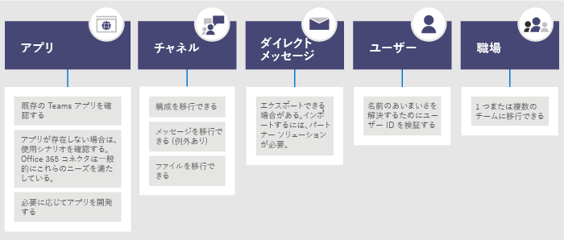

# <a name="migrate-from-slack-to-microsoft-teams"></a>Slack から Microsoft Teams に移行する

この記事では、Slack から Microsoft Teams への移行プロセスについて説明します。

Slack から Teams への組織の移行を計画する場合、保持するものを特定することが重要です (ある場合)。 まずは移行可能なデータの種類について説明し、次に組織のニーズの評価、移行計画、移行の実行方法について説明します。

次の図は、Slack のアーキテクチャの概観図です。


## <a name="plan-your-migration-from-slack"></a>Slack からの移行を計画する
### <a name="what-you-can-and-cant-migrate"></a>移行できるものと移行できないもの
移行できるものと移行できないものは、お客様の Slack サービス プランにより決まります。 たとえば、エクスポートできるのはパブリック チャンネルの履歴とファイルのみの Slack サービス プランもあれば、プライベート チャンネルとダイレクト メッセージを含めるには DocuSign のリクエストが必要なサービス プランもあります。 

Slack ワークスペースのサービス レベルを特定するには、Slack にログインし、[**このワークスペースについて**] ページに表示されるプランの種類を確認します。

Slack のエクスポート オプションの詳細については、Slack の Web サイトを参照してください。 https://get.slack.help/hc/articles/204897248-Guide-to-Slack-import-and-export-tools 

この記事で説明する Slack の移行に関する状況の概略を次の図に示します。 



このセクションを読み終えると、次のことを理解できます。
- Slack ワークスペースのサービス レベル
- エクスポートできるものとできないもの
- エクスポートの一般的な方法

### <a name="assess-your-slack-workspaces"></a>Slack ワークスペースの評価
組織の移行計画を立てる前に、Slack ワークスペースに関する情報をまとめる必要があります。 Slack ワークスペースがどのように使用されているかを理解することで、移行の範囲を特定しやすくなります。 たとえば、ワークスペースはいくつ移行するのでしょうか。 それらのワークスペースは特定の部署で使用されているものでしょうか。それとも組織全体で使用されているものでしょうか。

移行する Slack ワークスペースのメンバーのユーザーは、*<your Slack workspace>slack.com/stats* にアクセスして使用状況をユーザー自身で分析できます。使用パターンは [チャンネル] タブと [メンバー] タブで確認できます。 移行するワークスペース (および移行しないワークスペース) を決定します。 

> [!NOTE]
> ユーザーが統計情報のページにアクセスできない場合、そのユーザーは管理者または所有者ではないことを意味します。 

### <a name="export-channels"></a>チャンネルをエクスポートする

Slack では、ユーザーは Slack ワークスペースの一部であるチャンネルに参加します。これに対して Teams の場合、ユーザーはチャネルの集合体であるチームに参加します。 どのチャンネルを移行するかを決めやすくするために、Slack のアナリティクスを使用してそれぞれのチャンネルでのアクティビティの量を確認することを推奨します。 結果の一覧を使用して、Slack チャンネルを Teams のチームとしてグループ化する方法および各チームのメンバーにすべきユーザーを決定できます。

Slack の有料版サービス プラン (無料版以外のすべてのサービス プラン) を使用している場合、Slack のアナリティクス (<your Slack workspace>slack.com/admin/stats#channels) を使用して、チャンネルの活発度、最後に使用された日時、およびメンバー数を確認できます。 こうした情報を使用して、チャンネルを移行するかどうかを決定できます。 既定では、パブリック チャンネルのコンテンツ (メッセージおよびファイル) はエクスポートできます。 これらは、Slack のサービス プランに応じて、また、プライベート チャンネルとダイレクト メッセージを Slack に要求したかどうかに応じてエクスポートできます。

Slack のエクスポート オプションの詳細については、Slack の Web サイトを参照してください。 https://get.slack.help/hc/articles/204897248-Guide-to-Slack-import-and-export-tools 

> [!IMPORTANT]
> チャンネルのデータに関する組織のプライバシーとコンプライアンスの要件を確認します。 組織では、エンドユーザーを特定可能なコンテンツ (EUII) のライフライクルへの準拠に加え、このデータの取り扱い、保存、および処理に関するコンプライアンス要件がある場合があります。

### <a name="export-direct-messages"></a>ダイレクト メッセージをエクスポートする
ダイレクト メッセージは Teams のチャットと同じ機能で、1 対 1 または 1 対多数のチャンネル外の会話です。 エクスポート性は、Slack のサービス プランおよび、Slack のエクスポートにダイレクト メッセージを含めることを要求しているかどうかにより決まります。 Teams では現在、ダイレクト メッセージのインポートはサポートされていません。 ダイレクト メッセージのコンテンツを Teams に移動するためのサードパーティのソリューションを調べるには、Microsoft パートナーに相談して説明を受けてください。

ダイレクト メッセージをエクスポートする場合は、Slack アプリ ストアの Export などのツールを確認してください。

### <a name="apps-and-custom-integrations"></a>アプリとカスタム統合

Slack のアプリは、Teams のアプリのようなものです。 ワークスペースにあるアプリとそれらの構成の一覧が用意できたら、Teams アプリ ストアで検索を行い、Teams で使用できるものを確認できます*。 

<your Slack workspace>.slack.com/apps/manage にアクセスしてアプリとカスタム統合の一覧を取得します。 このページには、各アプリが使用している構成の数も表示されます。 カスタム統合の移行性は一定ではありません。 Web フックの場合は、通常はそれを Microsoft 365 または Office 365 コネクタに送信して、ワークフローを Teams に移動できます。 ボットやその他のアプリの Teams への移行については、それぞれの個別の状況に応じて評価を行うことにより計画を立てます。

\* アプリの使用が管理者により制限されている場合、使用可能なアプリの完全な一覧が表示されない可能性があります。

### <a name="users"></a>ユーザー
Slack で使用してきた ID スキームは、Microsoft 365 または Office 365 に直接マッピングできない可能性があります。 たとえば、Slack ユーザーのメール アドレスは、Microsoft 365 または Office 365 の職場または学校のアカウントにマッピングできない場合があります。 Teams の展開を開始する前に、ユーザー ID マップを作成する必要があります。

有料版 Slack のサービス プランを使用している場合は、*<your Slack workspace>.slack.com/admin/stats#members* にアクセスして各ユーザーのメール アドレスやアカウントの種類 (例: シングル チャンネル ゲスト、マルチ チャンネル ゲスト) などのメンバーの詳細情報を取得できます。

下に示すスクリプトは、Slack のエクスポートからのメール アドレスを Azure AD と比較することで名前のあいまいさを解消するために使用できます。 このスクリプトでは、ユーザーが Teams に対して有効化されているかどうかも報告されます。 PowerShell のサポートが必要な場合は、「[Azure PowerShell コマンドレットを使う](https://docs.microsoft.com/powershell/azure/get-started-azureps)」を参照してください。

```azurepowershell
Connect-AzureAD
Function Get-TimeStamp {
    return "[{0:MM/dd/yy} {0:HH:mm:ss}]" -f (Get-Date)
}

class User {
    [ValidateNotNullOrEmpty()] $ID
    [ValidateNotNullOrEmpty()] $FullName
    [string] $Email
    [string] $UPN
    [ValidateNotNullOrEmpty()][bool] $ExistsAzureAD
    [ValidateNotNullOrEmpty()][bool] $TeamsEnabled
}

$output = New-Object -type System.Collections.ObjectModel.Collection["User"]

$users = Get-Content -Raw -Path .\slackHistory\users.json | ConvertFrom-Json

Write-Host -ForegroundColor Green "$(Get-Timestamp) User Count: " $users.Count

$i=1
Write-Host "$(Get-Timestamp) Attempting direct email match.. `n"
foreach ($slackUser in $users) {
    $user = New-Object User
    $user.id = $slackUser.id
    $user.FullName = $slackUser.name
    try {
        if ($null -ne $slackUser.profile.email) {
            $user.email = $slackUser.profile.email
            $emailSplit = $slackUser.profile.email.Split('@')
            $mailNickName = $emailSplit[0]
            $result = Get-AzureADUser -Filter "MailNickName eq '$($mailNickName)' or UserPrincipalName eq '$($slackUser.profile.email)' or proxyAddresses/any(c:c eq 'smtp:$($slackUser.profile.email)')"
            if ($null -ne $result) {
                $user.ExistsAzureAD = $true
                $user.UPN = $result.UserPrincipalName
                $assignedPlans = $result.assignedPlans
                foreach ($plan in $assignedPlans) {
                    if ($plan.ServicePlanId -eq "57ff2da0-773e-42df-b2af-ffb7a2317929") {
                        if ($plan.CapabilityStatus -eq "Enabled") {
                            $user.TeamsEnabled = $true
                        }
                        else {
                            $user.TeamsEnabled = $false
                        }
                    }
                }
                Write-Host -ForegroundColor Green "$(Get-Timestamp) Current User $($i) - AzureAD object found:" $result.MailNickName
                Write-Host -ForegroundColor Green "$(Get-Timestamp) Current User $($i) - Teams Enabled:" $user.TeamsEnabled
            }
            else {
                $user.ExistsAzureAD = $false
                Write-Host -ForegroundColor Yellow "$(Get-Timestamp) Current User $($i) - AzureAD object not found: " $slackUser.profile.email
            }
        }
        $i++
    }   
    catch
    {
        $user.ExistsAzureAD = $false
        Write-Host -ForegroundColor Yellow "$(Get-Timestamp) Current User $($i) - AzureAD object not found: $($i)" $user.profile.email
        $i++
    }
    $output.Add($user)
}

$output | Export-Csv -Path .\SlackToAzureADIdentityMapping.csv -NoTypeInformation
Write-Host "`n $(Get-Timestamp) Generated SlackToAzureADIdentityMapping.csv. Exiting..."
$output | Export-Csv -Path .\SlackToAzureADIdentityMapping.csv -NoTypeInformation
Write-Host "`n $(Get-Timestamp) Generated SlackToAzureADIdentityMapping.csv. Exiting..."
```

このセクションの手順を完了すると、次の準備が完了します。
- ワークスペースごとのチャンネルの一覧および使用状況の統計情報。
- Slack アプリの一覧およびチャンネルごとの構成。
- エクスポートする Slack メッセージ履歴の種類の特定 (エクスポートする場合)。
- ユーザーの Slack アカウントが Microsoft の職場または学校のアカウントにマッピングされるユーザーの一覧、およびそれらのユーザーが持っている Teams のライセンスの種類。

## <a name="plan-your-teams-deployment"></a>Teams の展開を計画する
以上の手順により、必要なコンテンツの Slack からのエクスポートが完了します (必要のないコンテンツはエクスポートせずに残します)。 次に、Teams を展開し、Slack のデータをインポートする方法について説明します。 このステップでは、チームで効果的に使用されてきた内容を使用状況に基づいて評価し、Teams の展開計画にこれらの要素を含めることができます。 このセクションの手順を完了すると、Teams のユーザー、チャネル、アプリに関する詳細計画が完成します。 

Teams の展開における考慮対象の概略を次の図に示します。

:::image type="content" source="media/migrate-slack-to-teams-image3.png" alt-text="Slack から移行における Teams の展開計画の概略。":::

### <a name="team-and-channel-structure"></a>Teams とチャネルの構造

Slack ワークスペースは、1 つのチーム、複数のチーム、または組織全体を表す場合があります。 構造を特定する際は、ワークスペースの対象範囲を把握することが重要です。 ワークスペースは、Teams のチームと機能的に 1 番近い Slack 内の要素です。ワークスペースにはチャンネルの集まりが含まれています。 Slack から Teams への 3 種類のマッピング パターンおよび各ワークスペースに対して適切な方法を選ぶためのガイダンスを下の図に示します。


|Slack から Teams へのマッピング |  |
|---------|---------|
|1 Slack ワークスペース :arrow_right: 1 チーム   | 必要なチャンネルが 200 未満の小規模な Slack ワークスペース向け<br>成長したときのためのバッファーとプライベート チャンネルの計画を含めます  |
|1 Slack ワークスペース :arrow_right: 複数のチーム     | Slack ワークスペースのアナリティクス データを使用して、チームの基となる論理的なチャンネルのグループ分けをします        |
|2 つ以上の Slack ワークスペース :arrow_right: 複数のチーム     | Slack のワークスペース アナリティクス データを使用して、チームの基となる論理的なチームおよびチャンネルのグループ分けをします        |

チャンネルの活発度やチャンネルでの投稿数の評価に役立つ使用状況の統計情報は、サードパーティのソリューションで提供されます。 通常、使用頻度の高いチャンネルはチームの計画に含める候補として適しています。

> [!TIP]
> お客様の使用方法にとり必要なものだけを保持することで、Teams で再構築するチャンネルを特定します。 詳細については、「[チームとチャネルの概要](teams-channels-overview.md)」を参照してください。 

#### <a name="team-planning"></a>チームの計画
上記の計画セクションで作成したチャンネル インベントリを使用して、どのチャンネルをチームにし、どのチャンネルをチーム内のチャネルにするかを Slack の所有者および管理者と協議して決定します。 Excel または PowerBI では保持するチャンネルについての協議を進める上で役立つ追加の分析情報が提供されるため、いずれかを使用して分析に役立てます。

> [!TIP]
> Teams では現在、チーム 1 つあたりのチャネル数の上限は 200 です。 一覧に含まれるチャンネル数がこの上限値に近い場合、それらのチャンネルを 2 つのチームに分割する方法を考える必要があります。

### <a name="channel-history"></a>チャンネル履歴

パブリックおよびプライベート チャンネルのチャンネル履歴の保持に関する組織の要件に応じて、GitHub 上の無料のソリューションと有料のソリューションの両方を使用できます。 また、スクリプトを使用してソリューションを Teams に記述できます。

チームおよびチャンネルの新しい構造のセットアップが Teams で完了したら、エクスポートしたファイルを Teams チャネルの適切なドキュメント ライブラリにコピーできます。

コンテンツのインポートを自動化する方法がいくつかあるので、これらを検討します。 GitHub 上の無料ソリューション ([ChannelSurf](https://github.com/tamhinsf/ChannelSurf) または [Slack Export Viewer](https://github.com/hfaran/slack-export-viewer)) およびパートナー ソリューションがあります。 組織のニーズに応じてソリューションを選択します。 

### <a name="channel-files"></a>チャンネル ファイル

ほとんどのソリューションでは、ファイルをエクスポートできます。 ただし、これらは通常チャンネル履歴のリンクとして提供され、プログラムで取得するには API キーを必要とします。

Slack に保存されているファイルの場合、チームおよびチャネルのセットアップを Teams で完了すると、プログラムを使用してこれらのファイルを Slack からターゲットの Teams のチャネルにコピーできます。

次のスクリプトでは、Slack からファイルを取得します。 コンピューター上の指定された Slack のエクスポートが検索され、各ターゲット チャネルにフォルダーが作成され、すべてのファイルがその場所にダウンロードされます。 データを抽出できるサードパーティのソリューションがあります。 PowerShell のサポートが必要な場合は、「[Azure PowerShell コマンドレットを使う](https://docs.microsoft.com/powershell/azure/get-started-azureps)」を参照してください。


```azurepowershell
$ExportPath = ".\slackHistory"
$ExportContents = Get-ChildItem -path $ExportPath -Recurse
Function Get-TimeStamp {
    return "[{0:MM/dd/yy} {0:HH:mm:ss}]" -f (Get-Date)
}

class File {
    [string] $Name
    [string] $Title
    [string] $Channel
    [string] $DownloadURL
    [string] $MimeType
    [double] $Size
    [string] $ParentPath
    [string] $Time
}

$channelList = Get-Content -Raw -Path .\slackHistory\channels.json | ConvertFrom-Json
$Files = New-Object -TypeName System.Collections.ObjectModel.Collection["File"]

Write-Host -ForegroundColor Green "$(Get-TimeStamp) Starting Step 1 (processing channel export for files) of 2. Total Channel Count: $($channelList.Count)"
#Iterate through each Channel listed in the Archive
foreach ($channel in $channelList) {
    #Iterate through Channel folders from the Export
    foreach ($folder in $ExportContents)
    {
        #If Channel Name matches..
        if ($channel.name -eq $folder){
            $channelJsons = Get-ChildItem -Path $folder.FullName -File
            Write-Host -ForegroundColor White "$(Get-TimeStamp) Info: Starting to process $($channelJsons.Count) days of content for #$($channel.name)."
            #Start processing the daily JSON for files
            foreach ($json in $channelJsons){
                $currentJson = Get-Content -Raw -Path $json.FullName | ConvertFrom-Json
                #Write-Host -ForegroundColor Yellow "$(Get-TimeStamp) Info: Processing $($json.Name) in #$($channel.name).."
                #Iterate through every action
                foreach ($entry in $currentJson){
                    #If the action contained file(s)..
                    if($null -ne $entry.files){
                        #Iterate through each file and add it to the List of Files to download
                        foreach ($item in $entry.Files) {
                        $file = New-Object -TypeName File
                            if ($null -ne $item.url_private_download){
                                $file.Name = $item.name
                                $file.Title = $item.Title
                                $file.Channel = $channel.name
                                $file.DownloadURL = $item.url_private_download
                                $file.MimeType = $item.mimetype
                                $file.Size = $item.size
                                $file.ParentPath = $folder.FullName
                                $file.Time = $item.created
                                $files.Add($file)
                            }
                        }
                    }
                }
            }
        }
    }
}
Write-Host -ForegroundColor Green "$(Get-TimeStamp) Step 1 of 2 complete. `n"

Write-Host -ForegroundColor Green "$(Get-TimeStamp) Starting step 2 (creating folders and downloading files) of 2."
#Determine which Files folders need to be created
$FoldersToMake = New-Object System.Collections.ObjectModel.Collection["string"]
foreach ($file in $files){
    if ($FoldersToMake -notcontains $file.Channel){
        $FoldersToMake.Add($file.Channel)
    }
}

#Create Folders
foreach ($folder in $FoldersToMake){
    #$fullFolderPath = $file.ParentPath + "\Files"
    $fullFolderPath = $ExportPath +"\$($folder)"
    $fullFilesPath = $ExportPath +"\$($folder)\Files"
    if (-not (Test-Path $fullFilesPath)){
        New-Item -Path $fullFolderPath  -Name "Files" -ItemType "directory"
    }
}

#Downloading Files
foreach ($file in $files)
{
    Write-Host -ForegroundColor Yellow "$(Get-TimeStamp) Downloading $($file.Name)."
    $fullFilePath = $file.ParentPath + "\Files\" + $file.Name
        if (-not (Test-Path $fullFilePath)){
            try{
                $request = (New-Object System.Net.WebClient).DownloadFile($file.DownloadURL, $fullFilePath)
            }
            catch [System.Net.WebException]{
                Write-Host -ForegroundColor Red "$(Get-TimeStamp) Error: Unable to download $($file.Name) to $($fullFilePath)"
            }   
        }
        else {
            try{
                $extensionPosition = $file.name.LastIndexOf('.')
                $splitFileName = $file.name.Substring(0,$extensionPosition)
                $splitFileExtention = $file.name.Substring($extensionPosition)
                $newFileName = $splitFileName + $file.Time + $splitFileExtention
                $fullFilePath = $file.ParentPath + "\Files\" + $newFileName
                $request = (New-Object System.Net.WebClient).DownloadFile($file.DownloadURL, $fullFilePath)
            }
            catch [System.Net.WebException]{
                Write-Host -ForegroundColor Red "$(Get-TimeStamp) Error: Unable to download $($file.Name) to $($fullFilePath)"
            }   
        }
}
Write-Host -ForegroundColor Green "$(Get-TimeStamp) Step 2 of 2 complete. `n"
Write-Host -ForegroundColor Green "$(Get-TimeStamp) Exiting.."
```


### <a name="apps-and-custom-integrations"></a>アプリとカスタム統合
Slack アプリとカスタム統合 (構成を含む) の一覧を確認し、その中で Teams に移動するものを決めます。 利用可能なアプリがあるかどうかを Teams Marketplace で確認します。 ない場合でも、多くの場合代替方法を見つけられます。 

Teams に追加するアプリを特定するには、アプリの使用状況を把握することが重要です。 "このアプリはこのチャンネルにどのような機能を提供しているか?" と考えることで、アプリが提供している成果物を把握できます。 

多くの場合、アプリは主に外部サービス (例: 監視システム) からイベント主導のデータを受信し、Slack にメッセージをプッシュします。 これと同じ結果は、Microsoft 365 コネクタを使用してイベントに基づいてメッセージを Teams にプッシュする方法で得られます。

統合のために Teams で Microsoft 365 コネクタが使用された Slack のソリューションの例を次に示します。
- Ansible
  - 警告は [Ansible webhook](https://docs.ansible.com/ansible-tower/latest/html/userguide/notifications.html#webhook) 経由で Teams に送信できます。
- New Relic
  - こちらの [New Relic の警告の Teams への送信](https://discuss.newrelic.com/t/new-relic-alerts-not-working-with-microsoft-teams/48609/3)に関するユーザーによるソリューションをご覧ください。
- Nagios
  - 現在、警告はコネクタ経由で統合できます。 https://github.com/isaac-galvan/nagios-teams-notify
- ZenDesk
  - Teams ストアにアプリがあります
- Jenkins
  - 警告は [Jenkins の Office 365 コネクタ](https://plugins.jenkins.io/Office-365-Connector) を使用して Teams に送信できます。


### <a name="user-readiness-and-adoption-plan"></a>ユーザーの準備状況と導入計画
ソフトウェアの展開を成功させられるかどうかは、変更に向けたユーザーの準備度合にかかっています。 Slack を使用している組織内のユーザーは Teams の概念をすばやく理解できると思われますが、ユーザーがスムーズに移行できるようにするにはやはりトレーニングが必要です。 Teams 導入のための包括的なリソースについては、「[Teams 導入ハブ](adopt-microsoft-teams-landing-page.md)」を参照してください。

たとえば、チャネルは両方の製品に含まれる機能ですが、使用法はそれぞれの製品で異なります。 たとえば、Slack のチャンネルは多くの場合、Teams のチャットのように、短期間の事務的な会話に使用されます。 他にも、スレッド形式 / 非スレッド形式の会話や通知設定の調整などにおいても顕著な違いがあります。

[Teams のエンドユーザー ビデオ トレーニング](https://support.office.com/article/microsoft-teams-video-training-4f108e54-240b-4351-8084-b1089f0d21d7)に役立つ豊富なライブラリをぜひご覧ください。 

## <a name="move-to-teams"></a>Teams に移行する 
これで移行計画が定義されたので、Teams でチャネルとチームの作成を開始できます。 

チームとチャネルを作成したら、Slack チャンネルから Teams へのファイルのコピーとアプリの構成を開始します。 履歴を保持するソリューションを使用する場合、それもこの段階で構成できます。 これで、ユーザーへのライセンスの付与 (まだライセンスを付与していない場合) と正しいチームへのユーザーの追加を開始する準備ができました。 追加のエクスポートやファイルのコピーをせずに済むよう、あらかじめ決められた日に、各ユーザーをチームへ追加するのと同時に Slack へのアクセスを削除することを検討してください。 これにより、ファイルや履歴の差分変更の再エクスポートとインポートが不要になります。

下の図の手順に従って、組織で Teams を展開します。 詳細については、「[Teams の展開方法](How-to-roll-out-teams.md)」を参照してください。


:::image type="content" source="media/migrate-slack-to-teams-image4.png" alt-text="Slack から Teams への移行手順を示す図":::
