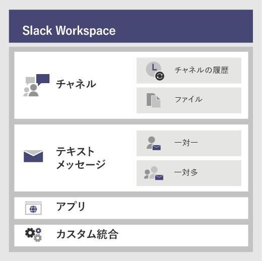

# <a name="migrate-from-slack-to-microsoft-teams"></a><span data-ttu-id="69ac3-103">Slack から Microsoft Teams に移行する</span><span class="sxs-lookup"><span data-stu-id="69ac3-103">Migrate from Slack to Teams</span></span>

<span data-ttu-id="69ac3-104">この記事では、Slack から Microsoft Teams への移行プロセスについて説明します。</span><span class="sxs-lookup"><span data-stu-id="69ac3-104">This article walks you through the journey of moving to Microsoft Teams from Slack.</span></span>

<span data-ttu-id="69ac3-105">Slack から Teams への組織の移行を計画する場合、保持するものを特定することが重要です (ある場合)。</span><span class="sxs-lookup"><span data-stu-id="69ac3-105">When planning your organization’s move to Teams from Slack, it's important to decide what you need to keep (if anything).</span></span> <span data-ttu-id="69ac3-106">まずは移行可能なデータの種類について説明し、次に組織のニーズの評価、移行計画、移行の実行方法について説明します。</span><span class="sxs-lookup"><span data-stu-id="69ac3-106">We'll start off by describing what types of data can be migrated and then walk you through how to assess your needs, plan your move, and then make the move.</span></span>

<span data-ttu-id="69ac3-107">次の図は、Slack のアーキテクチャの概観図です。</span><span class="sxs-lookup"><span data-stu-id="69ac3-107">The diagram below shows the Slack architecture at a high level.</span></span>



## <a name="plan-your-migration-from-slack"></a><span data-ttu-id="69ac3-109">Slack からの移行を計画する</span><span class="sxs-lookup"><span data-stu-id="69ac3-109">Plan your migration from Slack</span></span>
### <a name="what-you-can-and-cant-migrate"></a><span data-ttu-id="69ac3-110">移行できるものと移行できないもの</span><span class="sxs-lookup"><span data-stu-id="69ac3-110">What you can and can’t migrate</span></span>
<span data-ttu-id="69ac3-111">移行できるものと移行できないものは、お客様の Slack サービス プランにより決まります。</span><span class="sxs-lookup"><span data-stu-id="69ac3-111">Your Slack service plan will determine what you can and can’t migrate.</span></span> <span data-ttu-id="69ac3-112">たとえば、エクスポートできるのはパブリック チャンネルの履歴とファイルのみの Slack サービス プランもあれば、プライベート チャンネルとダイレクト メッセージを含めるには DocuSign のリクエストが必要なサービス プランもあります。</span><span class="sxs-lookup"><span data-stu-id="69ac3-112">For example, some Slack service plans only let you export public channels history and files, other require a DocuSign request to include Private Channels and Direct Messages.</span></span> 

<span data-ttu-id="69ac3-113">Slack ワークスペースのサービス レベルを特定するには、Slack にログインし、[**このワークスペースについて**] ページに表示されるプランの種類を確認します。</span><span class="sxs-lookup"><span data-stu-id="69ac3-113">To determine your Slack Workspace service level, log into Slack and note your plan type on the **About this Workspace** page.</span></span>

<span data-ttu-id="69ac3-114">Slack のエクスポート オプションの詳細については、Slack の Web サイトを参照してください。 https://get.slack.help/hc/articles/204897248-Guide-to-Slack-import-and-export-tools</span><span class="sxs-lookup"><span data-stu-id="69ac3-114">To learn more about Slack export options, go to the Slack website: https://get.slack.help/hc/articles/204897248-Guide-to-Slack-import-and-export-tools</span></span> 

<span data-ttu-id="69ac3-115">この記事で説明する Slack の移行に関する状況の概略を次の図に示します。</span><span class="sxs-lookup"><span data-stu-id="69ac3-115">The diagram below gives you a high-level look at the Slack migration landscape that we’ll cover in this article.</span></span> 

<span data-ttu-id="69ac3-116">:::image type="content" source="media/migrate-slack-to-teams-image2.png" alt-text="Slack の移行に関する状況を示す図":::</span><span class="sxs-lookup"><span data-stu-id="69ac3-116">:::image type="content" source="media/migrate-slack-to-teams-image2.png" alt-text="Diagram that shows the Slack export landscape.":::</span></span>

<span data-ttu-id="69ac3-117">このセクションを読み終えると、次のことを理解できます。</span><span class="sxs-lookup"><span data-stu-id="69ac3-117">When you're done with this section, you should understand:</span></span>
- <span data-ttu-id="69ac3-118">Slack ワークスペースのサービス レベル</span><span class="sxs-lookup"><span data-stu-id="69ac3-118">The service level of your Slack Workspaces</span></span>
- <span data-ttu-id="69ac3-119">エクスポートできるものとできないもの</span><span class="sxs-lookup"><span data-stu-id="69ac3-119">What can and can't be exported</span></span>
- <span data-ttu-id="69ac3-120">エクスポートの一般的な方法</span><span class="sxs-lookup"><span data-stu-id="69ac3-120">Common approaches to exporting</span></span>

### <a name="assess-your-slack-workspaces"></a><span data-ttu-id="69ac3-121">Slack ワークスペースの評価</span><span class="sxs-lookup"><span data-stu-id="69ac3-121">Assess your Slack workspaces</span></span>
<span data-ttu-id="69ac3-122">組織の移行計画を立てる前に、Slack ワークスペースに関する情報をまとめる必要があります。</span><span class="sxs-lookup"><span data-stu-id="69ac3-122">Before you can plan your organization’s migration plan, you need to pull together some information about your Slack workspaces.</span></span> <span data-ttu-id="69ac3-123">Slack ワークスペースがどのように使用されているかを理解することで、移行の範囲を特定しやすくなります。</span><span class="sxs-lookup"><span data-stu-id="69ac3-123">Understanding how your Slack workspaces are being used helps you determine the scope of your migration.</span></span> <span data-ttu-id="69ac3-124">たとえば、ワークスペースはいくつ移行するのでしょうか。</span><span class="sxs-lookup"><span data-stu-id="69ac3-124">For example, how many workspaces are being moved?</span></span> <span data-ttu-id="69ac3-125">それらのワークスペースは特定の部署で使用されているものでしょうか。それとも組織全体で使用されているものでしょうか。</span><span class="sxs-lookup"><span data-stu-id="69ac3-125">Are they used by a specific department, many, or in use by an entire organization?</span></span>

<span data-ttu-id="69ac3-126">移行する Slack ワークスペースのメンバーのユーザーは、*<your Slack workspace>slack.com/stats* にアクセスして使用状況をユーザー自身で分析できます。使用パターンは [チャンネル] タブと [メンバー] タブで確認できます。</span><span class="sxs-lookup"><span data-stu-id="69ac3-126">If you’re a member of the Slack Workspaces you want to migrate, you can analyze the usage yourself by going to *<your Slack workspace>.slack.com/stats*. Review the Channels and Members tabs to look for usage patterns.</span></span> <span data-ttu-id="69ac3-127">移行するワークスペース (および移行しないワークスペース) を決定します。</span><span class="sxs-lookup"><span data-stu-id="69ac3-127">Decide which workspaces you want to migrate (and which ones you want to leave behind).</span></span> 

> [!NOTE]
> <span data-ttu-id="69ac3-128">ユーザーが統計情報のページにアクセスできない場合、そのユーザーは管理者または所有者ではないことを意味します。</span><span class="sxs-lookup"><span data-stu-id="69ac3-128">If you don’t have access to the stats page, you’re not an admin or owner.</span></span> 

### <a name="export-channels"></a><span data-ttu-id="69ac3-129">チャンネルをエクスポートする</span><span class="sxs-lookup"><span data-stu-id="69ac3-129">Export Channels</span></span>

<span data-ttu-id="69ac3-130">Slack では、ユーザーは Slack ワークスペースの一部であるチャンネルに参加します。これに対して Teams の場合、ユーザーはチャネルの集合体であるチームに参加します。</span><span class="sxs-lookup"><span data-stu-id="69ac3-130">In Slack, users join a channel which is part of a Slack Workspace, whereas in Teams users join a team which is a collection of channels.</span></span> <span data-ttu-id="69ac3-131">どのチャンネルを移行するかを決めやすくするために、Slack のアナリティクスを使用してそれぞれのチャンネルでのアクティビティの量を確認することを推奨します。</span><span class="sxs-lookup"><span data-stu-id="69ac3-131">We recommend that you use Slack analytics to see how much activity happens in each channel to help you decide which channels to move.</span></span> <span data-ttu-id="69ac3-132">結果の一覧を使用して、Slack チャンネルを Teams のチームとしてグループ化する方法および各チームのメンバーにすべきユーザーを決定できます。</span><span class="sxs-lookup"><span data-stu-id="69ac3-132">You’ll use the resulting list to figure out how to group your Slack channels into teams in Teams as well as who should be members of each team.</span></span>

<span data-ttu-id="69ac3-133">Slack の有料版サービス プラン (無料版以外のすべてのサービス プラン) を使用している場合、Slack のアナリティクス (<your Slack workspace>slack.com/admin/stats#channels) を使用して、チャンネルの活発度、最後に使用された日時、およびメンバー数を確認できます。</span><span class="sxs-lookup"><span data-stu-id="69ac3-133">If you have a paid Slack service plan (anything other than Free), you can use Slack’s analytics (<your Slack workspace>.slack.com/admin/stats#channels) to see how active a channel is, when it was last used, and how many people are members.</span></span> <span data-ttu-id="69ac3-134">こうした情報を使用して、チャンネルを移行するかどうかを決定できます。</span><span class="sxs-lookup"><span data-stu-id="69ac3-134">This can help you decide whether to migrate the channel.</span></span> <span data-ttu-id="69ac3-135">既定では、パブリック チャンネルのコンテンツ (メッセージおよびファイル) はエクスポートできます。</span><span class="sxs-lookup"><span data-stu-id="69ac3-135">By default, public channels content (messages and files) can be exported.</span></span> <span data-ttu-id="69ac3-136">これらは、Slack のサービス プランに応じて、また、プライベート チャンネルとダイレクト メッセージを Slack に要求したかどうかに応じてエクスポートできます。</span><span class="sxs-lookup"><span data-stu-id="69ac3-136">Depending on your Slack service plan and whether you’ve requested Private Channels and Direct Messages from Slack, those can be exported.</span></span>

<span data-ttu-id="69ac3-137">Slack のエクスポート オプションの詳細については、Slack の Web サイトを参照してください。 https://get.slack.help/hc/articles/204897248-Guide-to-Slack-import-and-export-tools</span><span class="sxs-lookup"><span data-stu-id="69ac3-137">To learn more about Slack export options, go to the Slack website: https://get.slack.help/hc/articles/204897248-Guide-to-Slack-import-and-export-tools</span></span> 

> [!IMPORTANT]
> <span data-ttu-id="69ac3-138">チャンネルのデータに関する組織のプライバシーとコンプライアンスの要件を確認します。</span><span class="sxs-lookup"><span data-stu-id="69ac3-138">Check your organization’s privacy and compliance requirements around channel data.</span></span> <span data-ttu-id="69ac3-139">組織では、エンドユーザーを特定可能なコンテンツ (EUII) のライフライクルへの準拠に加え、このデータの取り扱い、保存、および処理に関するコンプライアンス要件がある場合があります。</span><span class="sxs-lookup"><span data-stu-id="69ac3-139">Your organization may have compliance requirements around the handling, storage, and processing of this data, in addition to complying with the lifecycle of end-user identifiable content (EUII).</span></span>

### <a name="export-direct-messages"></a><span data-ttu-id="69ac3-140">ダイレクト メッセージをエクスポートする</span><span class="sxs-lookup"><span data-stu-id="69ac3-140">Export Direct Messages</span></span>
<span data-ttu-id="69ac3-141">ダイレクト メッセージは Teams のチャットと同じ機能で、1 対 1 または 1 対多数のチャンネル外の会話です。</span><span class="sxs-lookup"><span data-stu-id="69ac3-141">Direct Messages are the same as chats in Teams, which are 1:1 or 1-to-many non-channel conversations.</span></span> <span data-ttu-id="69ac3-142">エクスポート性は、Slack のサービス プランおよび、Slack のエクスポートにダイレクト メッセージを含めることを要求しているかどうかにより決まります。</span><span class="sxs-lookup"><span data-stu-id="69ac3-142">Export-ability depends on your Slack service plan and if you’ve requested Direct Messages to be included in your Slack Export.</span></span> <span data-ttu-id="69ac3-143">Teams では現在、ダイレクト メッセージのインポートはサポートされていません。</span><span class="sxs-lookup"><span data-stu-id="69ac3-143">Teams doesn’t support importing Direct messages currently.</span></span> <span data-ttu-id="69ac3-144">ダイレクト メッセージのコンテンツを Teams に移動するためのサードパーティのソリューションを調べるには、Microsoft パートナーに相談して説明を受けてください。</span><span class="sxs-lookup"><span data-stu-id="69ac3-144">Consult a Microsoft partner to learn about third-party solutions you can explore that bring Direct Messages content into Teams.</span></span>

<span data-ttu-id="69ac3-145">ダイレクト メッセージをエクスポートする場合は、Slack アプリ ストアの Export などのツールを確認してください。</span><span class="sxs-lookup"><span data-stu-id="69ac3-145">For exporting Direct Messages, check out tools, such as Export, in the Slack App Store.</span></span>

### <a name="apps-and-custom-integrations"></a><span data-ttu-id="69ac3-146">アプリとカスタム統合</span><span class="sxs-lookup"><span data-stu-id="69ac3-146">Apps and custom integrations</span></span>

<span data-ttu-id="69ac3-147">Slack のアプリは、Teams のアプリのようなものです。</span><span class="sxs-lookup"><span data-stu-id="69ac3-147">Apps in Slack are like apps in Teams.</span></span> <span data-ttu-id="69ac3-148">ワークスペースにあるアプリとそれらの構成の一覧が用意できたら、Teams アプリ ストアで検索を行い、Teams で使用できるものを確認できます\*。</span><span class="sxs-lookup"><span data-stu-id="69ac3-148">Once you have a list of apps and their configurations in the Workspace, you can search in the Teams App store to see if they’re available for Teams\*.</span></span> 

<span data-ttu-id="69ac3-149"><your Slack workspace>.slack.com/apps/manage にアクセスしてアプリとカスタム統合の一覧を取得します。</span><span class="sxs-lookup"><span data-stu-id="69ac3-149">Go to <your Slack workspace>.slack.com/apps/manage to get a list of Apps and Custom Integrations.</span></span> <span data-ttu-id="69ac3-150">このページには、各アプリが使用している構成の数も表示されます。</span><span class="sxs-lookup"><span data-stu-id="69ac3-150">This page also shows you the number of configurations where each app is in use.</span></span> <span data-ttu-id="69ac3-151">カスタム統合の移行性は一定ではありません。</span><span class="sxs-lookup"><span data-stu-id="69ac3-151">Custom Integrations vary in their “migrate-ability.”</span></span> <span data-ttu-id="69ac3-152">Web フックの場合は、通常はそれを Office 365 コネクタに送信して、ワークフローを Teams に移動できます。</span><span class="sxs-lookup"><span data-stu-id="69ac3-152">If it’s a Web Hook, you can usually send it to an Office 365 Connector to shift the workflow into Teams.</span></span> <span data-ttu-id="69ac3-153">ボットやその他のアプリの Teams への移行については、それぞれの個別の状況に応じて評価を行うことにより計画を立てます。</span><span class="sxs-lookup"><span data-stu-id="69ac3-153">Assess bots and other apps on a case-by-case basis to plan for moving them to Teams.</span></span>

<span data-ttu-id="69ac3-154">\*アプリの使用が管理者により制限されている場合、使用可能なアプリの完全な一覧が表示されない可能性があります。</span><span class="sxs-lookup"><span data-stu-id="69ac3-154">\*If your administrator has restricted apps usage, you may not be looking at the full list of available apps.</span></span>

### <a name="users"></a><span data-ttu-id="69ac3-155">ユーザー</span><span class="sxs-lookup"><span data-stu-id="69ac3-155">Users</span></span>
<span data-ttu-id="69ac3-156">Slack で使用してきた ID スキームは、Office 365 に直接マッピングできない可能性があります。</span><span class="sxs-lookup"><span data-stu-id="69ac3-156">The identity schemes you used in Slack might not map directly to Office 365.</span></span> <span data-ttu-id="69ac3-157">たとえば、Slack ユーザーのメール アドレスは、Office 365 の職場または学校のアカウントにマッピングできない場合があります。</span><span class="sxs-lookup"><span data-stu-id="69ac3-157">For example, the email addresses of your Slack users may not map to Office 365 work or school accounts.</span></span> <span data-ttu-id="69ac3-158">Teams の展開を開始する前に、ユーザー ID マップを作成する必要があります。</span><span class="sxs-lookup"><span data-stu-id="69ac3-158">You should create a user-ID map before you start planning your Teams rollout.</span></span>

<span data-ttu-id="69ac3-159">有料版 Slack のサービス プランを使用している場合は、*<your Slack workspace>.slack.com/admin/stats#members* にアクセスして各ユーザーのメール アドレスやアカウントの種類 (例: シングル チャンネル ゲスト、マルチ チャンネル ゲスト) などのメンバーの詳細情報を取得できます。</span><span class="sxs-lookup"><span data-stu-id="69ac3-159">If you’re on a paid Slack service plan, you can go to *<your Slack workspace>.slack.com/admin/stats#members* to get member details such as email address and account type for each user (for example, single vs. multi-channel guest).</span></span>

<span data-ttu-id="69ac3-160">下に示すスクリプトは、Slack のエクスポートからのメール アドレスを Azure AD と比較することで名前のあいまいさを解消するために使用できます。</span><span class="sxs-lookup"><span data-stu-id="69ac3-160">Here’s a script you can use to compare email addresses from a Slack export against Azure AD to help solve for name ambiguity.</span></span> <span data-ttu-id="69ac3-161">このスクリプトでは、ユーザーが Teams に対して有効化されているかどうかも報告されます。</span><span class="sxs-lookup"><span data-stu-id="69ac3-161">It’ll also report if the user is enabled for Teams.</span></span> <span data-ttu-id="69ac3-162">PowerShell のサポートが必要な場合は、「[Azure PowerShell コマンドレットを使う](https://docs.microsoft.com/powershell/azure/get-started-azureps)」を参照してください。</span><span class="sxs-lookup"><span data-stu-id="69ac3-162">If you need help with PowerShell, read [Get started with Azure PowerShell](https://docs.microsoft.com/powershell/azure/get-started-azureps).</span></span>

```azurepowershell
Connect-AzureAD
Function Get-TimeStamp {
    return "[{0:MM/dd/yy} {0:HH:mm:ss}]" -f (Get-Date)
}

class User {
    [ValidateNotNullOrEmpty()] $ID
    [ValidateNotNullOrEmpty()] $FullName
    [string] $Email
    [string] $UPN
    [ValidateNotNullOrEmpty()][bool] $ExistsAzureAD
    [ValidateNotNullOrEmpty()][bool] $TeamsEnabled
}

$output = New-Object -type System.Collections.ObjectModel.Collection["User"]

$users = Get-Content -Raw -Path .\slackHistory\users.json | ConvertFrom-Json

Write-Host -ForegroundColor Green "$(Get-Timestamp) User Count: " $users.Count

$i=1
Write-Host "$(Get-Timestamp) Attempting direct email match.. `n"
foreach ($slackUser in $users) {
    $user = New-Object User
    $user.id = $slackUser.id
    $user.FullName = $slackUser.name
    try {
        if ($null -ne $slackUser.profile.email) {
            $user.email = $slackUser.profile.email
            $emailSplit = $slackUser.profile.email.Split('@')
            $mailNickName = $emailSplit[0]
            $result = Get-AzureADUser -Filter "MailNickName eq '$($mailNickName)' or UserPrincipalName eq '$($slackUser.profile.email)' or proxyAddresses/any(c:c eq 'smtp:$($slackUser.profile.email)')"
            if ($null -ne $result) {
                $user.ExistsAzureAD = $true
                $user.UPN = $result.UserPrincipalName
                $assignedPlans = $result.assignedPlans
                foreach ($plan in $assignedPlans) {
                    if ($plan.ServicePlanId -eq "57ff2da0-773e-42df-b2af-ffb7a2317929") {
                        if ($plan.CapabilityStatus -eq "Enabled") {
                            $user.TeamsEnabled = $true
                        }
                        else {
                            $user.TeamsEnabled = $false
                        }
                    }
                }
                Write-Host -ForegroundColor Green "$(Get-Timestamp) Current User $($i) - AzureAD object found:" $result.MailNickName
                Write-Host -ForegroundColor Green "$(Get-Timestamp) Current User $($i) - Teams Enabled:" $user.TeamsEnabled
            }
            else {
                $user.ExistsAzureAD = $false
                Write-Host -ForegroundColor Yellow "$(Get-Timestamp) Current User $($i) - AzureAD object not found: " $slackUser.profile.email
            }
        }
        $i++
    }   
    catch
    {
        $user.ExistsAzureAD = $false
        Write-Host -ForegroundColor Yellow "$(Get-Timestamp) Current User $($i) - AzureAD object not found: $($i)" $user.profile.email
        $i++
    }
    $output.Add($user)
}

$output | Export-Csv -Path .\SlackToAzureADIdentityMapping.csv -NoTypeInformation
Write-Host "`n $(Get-Timestamp) Generated SlackToAzureADIdentityMapping.csv. Exiting..."
$output | Export-Csv -Path .\SlackToAzureADIdentityMapping.csv -NoTypeInformation
Write-Host "`n $(Get-Timestamp) Generated SlackToAzureADIdentityMapping.csv. Exiting..."
```

<span data-ttu-id="69ac3-163">このセクションの手順を完了すると、次の準備が完了します。</span><span class="sxs-lookup"><span data-stu-id="69ac3-163">When you’re done with this section, you should have:</span></span>
- <span data-ttu-id="69ac3-164">ワークスペースごとのチャンネルの一覧および使用状況の統計情報</span><span class="sxs-lookup"><span data-stu-id="69ac3-164">A list of Channels per Workspace with usage stats</span></span>
- <span data-ttu-id="69ac3-165">Slack アプリの一覧およびチャンネルごとの構成</span><span class="sxs-lookup"><span data-stu-id="69ac3-165">A list of Slack Apps with configurations per channel</span></span>
- <span data-ttu-id="69ac3-166">エクスポートする Slack メッセージ履歴の種類の特定 (エクスポートする場合)</span><span class="sxs-lookup"><span data-stu-id="69ac3-166">Determined what type of Slack message history you want to export (if any)</span></span>
- <span data-ttu-id="69ac3-167">ユーザーの Slack アカウントが Microsoft の職場または学校のアカウントにマッピングされるユーザーの一覧および、それらのユーザーが持っている Teams のライセンスの種類</span><span class="sxs-lookup"><span data-stu-id="69ac3-167">A list of users whose Slack accounts map to Microsoft work or school accounts and which Teams license they have</span></span>

## <a name="plan-your-teams-deployment"></a><span data-ttu-id="69ac3-168">Teams の展開を計画する</span><span class="sxs-lookup"><span data-stu-id="69ac3-168">Plan your deployment</span></span>
<span data-ttu-id="69ac3-169">以上の手順により、必要なコンテンツの Slack からのエクスポートが完了します (必要のないコンテンツはエクスポートせずに残します)。</span><span class="sxs-lookup"><span data-stu-id="69ac3-169">You’ve exported what you need from Slack (and left behind anything you don’t need).</span></span> <span data-ttu-id="69ac3-170">次に、Teams を展開し、Slack のデータをインポートする方法について説明します。</span><span class="sxs-lookup"><span data-stu-id="69ac3-170">Now it’s time to plan how you’ll roll out Teams and import your Slack data.</span></span> <span data-ttu-id="69ac3-171">このステップでは、チームで効果的に使用されてきた内容を使用状況に基づいて評価し、Teams の展開計画にこれらの要素を含めることができます。</span><span class="sxs-lookup"><span data-stu-id="69ac3-171">This is a great opportunity to assess what's worked well for the team based on usage and include those elements in your Teams deployment plan.</span></span> <span data-ttu-id="69ac3-172">このセクションの手順を完了すると、Teams のユーザー、チャネル、アプリに関する詳細計画が完成します。</span><span class="sxs-lookup"><span data-stu-id="69ac3-172">At the end of this section, you’ll have a blueprint for your Teams users, channels, and apps.</span></span> 

<span data-ttu-id="69ac3-173">Teams の展開における考慮対象の概略を次の図に示します。</span><span class="sxs-lookup"><span data-stu-id="69ac3-173">The diagram below gives you a high-level outline of the things you’ll address in your Teams deployment.</span></span>

<span data-ttu-id="69ac3-174">:::image type="content" source="media/migrate-slack-to-teams-image3.png" alt-text="Slack から移行における Teams の展開計画の概略。":::</span><span class="sxs-lookup"><span data-stu-id="69ac3-174">:::image type="content" source="media/migrate-slack-to-teams-image3.png" alt-text="High-level outline of planning a Teams deployment from Slack.":::</span></span>

### <a name="team-and-channel-structure"></a><span data-ttu-id="69ac3-175">Teams とチャネルの構造</span><span class="sxs-lookup"><span data-stu-id="69ac3-175">Team and channel structure</span></span>

<span data-ttu-id="69ac3-176">Slack ワークスペースは、1 つのチーム、複数のチーム、または組織全体を表す場合があります。</span><span class="sxs-lookup"><span data-stu-id="69ac3-176">A Slack Workspace may represent a single team, multiple teams or an entire organization.</span></span> <span data-ttu-id="69ac3-177">構造を特定する際は、ワークスペースの対象範囲を把握することが重要です。</span><span class="sxs-lookup"><span data-stu-id="69ac3-177">It’s important to understand the scope of the Workspaces as you determine the structure.</span></span> <span data-ttu-id="69ac3-178">ワークスペースは、Teams のチームと機能的に 1 番近い Slack 内の要素です。ワークスペースにはチャンネルの集まりが含まれています。</span><span class="sxs-lookup"><span data-stu-id="69ac3-178">The closest relationship to a Teams team in Slack is the Workspace, which contains a collection of channels.</span></span> <span data-ttu-id="69ac3-179">Slack から Teams への 3 種類のマッピング パターンおよび各ワークスペースに対して適切な方法を選ぶためのガイダンスを下の図に示します。</span><span class="sxs-lookup"><span data-stu-id="69ac3-179">The diagram below demonstrates 3 different Slack-to-Teams mappings, and guidance for picking the right one for each Workspace.</span></span>


|<span data-ttu-id="69ac3-180">Slack から Teams へのマッピング</span><span class="sxs-lookup"><span data-stu-id="69ac3-180">Slack-to-Teams mapping</span></span> |  |
|---------|---------|
|<span data-ttu-id="69ac3-181">1 Slack ワークスペース :arrow_right: 1 チーム</span><span class="sxs-lookup"><span data-stu-id="69ac3-181">1 Slack Workspace :arrow_right: 1 team</span></span>   | <span data-ttu-id="69ac3-182">必要なチャンネルが 200 未満の小規模な Slack ワークスペース向け</span><span class="sxs-lookup"><span data-stu-id="69ac3-182">For smaller Slack workspaces that need fewer than 200 channels</span></span><br><span data-ttu-id="69ac3-183">成長したときのためのバッファーとプライベート チャンネルの計画を含めます</span><span class="sxs-lookup"><span data-stu-id="69ac3-183">Include a buffer for growth and private channel planning</span></span>  |
|<span data-ttu-id="69ac3-184">1 Slack ワークスペース: arrow_right: 複数のチーム</span><span class="sxs-lookup"><span data-stu-id="69ac3-184">1 Slack Workspace :arrow_right: multiple teams</span></span>     | <span data-ttu-id="69ac3-185">Slack ワークスペースのアナリティクス データを使用して、チームの基となる論理的なチャンネルのグループ分けをします</span><span class="sxs-lookup"><span data-stu-id="69ac3-185">Use your Slack Workspace analytics data to create logical channel groupings, which become the basis of your teams</span></span>        |
|<span data-ttu-id="69ac3-186">2 つ以上の Slack ワークスペース: arrow_right: 複数のチーム</span><span class="sxs-lookup"><span data-stu-id="69ac3-186">2+ Slack Workspaces :arrow_right: multiple teams</span></span>     | <span data-ttu-id="69ac3-187">Slack のワークスペース アナリティクス データを使用して、チームの基となる論理的なチームおよびチャンネルのグループ分けをします</span><span class="sxs-lookup"><span data-stu-id="69ac3-187">Use your Slack Workspace analytics data to create logical team and channel groupings, which become the basis of your teams</span></span>        |

<span data-ttu-id="69ac3-188">チャンネルの活発度やチャンネルでの投稿数の評価に役立つ使用状況の統計情報は、サードパーティのソリューションで提供されます。</span><span class="sxs-lookup"><span data-stu-id="69ac3-188">Third-party solutions have usage statistics to help you assess how active the channel is and how many posts there are.</span></span> <span data-ttu-id="69ac3-189">通常、使用頻度の高いチャンネルはチームの計画に含める候補として適しています。</span><span class="sxs-lookup"><span data-stu-id="69ac3-189">Typically, channels that are frequently used would be candidates to include in your team planning.</span></span>

> [!TIP]
> <span data-ttu-id="69ac3-190">お客様の使用方法にとり必要なものだけを保持することで、Teams で再構築するチャンネルを特定します。</span><span class="sxs-lookup"><span data-stu-id="69ac3-190">Retain only what is required in your approach to determine which channels to recreate in Teams.</span></span> <span data-ttu-id="69ac3-191">詳細については、「[チームとチャネルの概要](teams-channels-overview.md)」を参照してください。</span><span class="sxs-lookup"><span data-stu-id="69ac3-191">To learn more, read [Overview of teams and channels](teams-channels-overview.md).</span></span> 

#### <a name="team-planning"></a><span data-ttu-id="69ac3-192">チームの計画</span><span class="sxs-lookup"><span data-stu-id="69ac3-192">Team Planning</span></span>
<span data-ttu-id="69ac3-193">上記の計画セクションで作成したチャンネル インベントリを使用して、どのチャンネルをチームにし、どのチャンネルをチーム内のチャネルにするかを Slack の所有者および管理者と協議して決定します。</span><span class="sxs-lookup"><span data-stu-id="69ac3-193">Using the Channel inventory you compiled in the Planning section above, work with your Slack owners and admins to figure out which channels should become teams and which ones should become channels in a team.</span></span> <span data-ttu-id="69ac3-194">Excel または PowerBI では保持するチャンネルについての協議を進める上で役立つ追加の分析情報が提供されるため、いずれかを使用して分析に役立てます。</span><span class="sxs-lookup"><span data-stu-id="69ac3-194">Use either Excel or PowerBI to help with this analysis - both can provide additional insights to help drive these discussions on which channels to retain.</span></span>

> [!TIP]
> <span data-ttu-id="69ac3-195">Teams では現在、チーム 1 つあたりのチャネル数の上限は 200 です。</span><span class="sxs-lookup"><span data-stu-id="69ac3-195">Teams currently has a 200-channel limit per team.</span></span> <span data-ttu-id="69ac3-196">一覧に含まれるチャンネル数がこの上限値に近い場合、それらのチャンネルを 2 つのチームに分割する方法を考える必要があります。</span><span class="sxs-lookup"><span data-stu-id="69ac3-196">If your list of channels is getting close to that limit, you should figure out a way to split them into two separate teams.</span></span>

### <a name="channel-history"></a><span data-ttu-id="69ac3-197">チャンネル履歴</span><span class="sxs-lookup"><span data-stu-id="69ac3-197">Channel History</span></span>

<span data-ttu-id="69ac3-198">パブリックおよびプライベート チャンネルのチャンネル履歴の保持に関する組織の要件に応じて、GitHub 上の無料のソリューションと有料のソリューションの両方を使用できます。</span><span class="sxs-lookup"><span data-stu-id="69ac3-198">There are both free solutions on GitHub and paid solutions you can use, depending on your organization’s requirements to retain Channel History of Public and Private channels.</span></span> <span data-ttu-id="69ac3-199">また、スクリプトを使用してソリューションを Teams に記述できます。</span><span class="sxs-lookup"><span data-stu-id="69ac3-199">Additionally, this could be scripted into Teams.</span></span>

<span data-ttu-id="69ac3-200">チームおよびチャンネルの新しい構造のセットアップが Teams で完了したら、エクスポートしたファイルを Teams チャネルの適切なドキュメント ライブラリにコピーできます。</span><span class="sxs-lookup"><span data-stu-id="69ac3-200">Once you’ve set up your new team and channel structure in Teams, you can copy the exported files into the appropriate document libraries in your Teams channels.</span></span>

<span data-ttu-id="69ac3-201">コンテンツのインポートを自動化する方法がいくつかあるので、これらを検討します。</span><span class="sxs-lookup"><span data-stu-id="69ac3-201">To automate the importing of your content, there are several approaches you can consider.</span></span> <span data-ttu-id="69ac3-202">GitHub 上の無料ソリューション ([ChannelSurf](https://github.com/tamhinsf/ChannelSurf) または [Slack Export Viewer](https://github.com/hfaran/slack-export-viewer)) およびパートナー ソリューションがあります。</span><span class="sxs-lookup"><span data-stu-id="69ac3-202">There are  free solutions on GitHub ([ChannelSurf](https://github.com/tamhinsf/ChannelSurf) or [Slack Export Viewer](https://github.com/hfaran/slack-export-viewer)) and partner solutions.</span></span> <span data-ttu-id="69ac3-203">組織のニーズに応じてソリューションを選択します。</span><span class="sxs-lookup"><span data-stu-id="69ac3-203">Choose a solution based on your organization’s needs.</span></span> 

### <a name="channel-files"></a><span data-ttu-id="69ac3-204">チャンネル ファイル</span><span class="sxs-lookup"><span data-stu-id="69ac3-204">Channel Files</span></span>

<span data-ttu-id="69ac3-205">ほとんどのソリューションでは、ファイルをエクスポートできます。</span><span class="sxs-lookup"><span data-stu-id="69ac3-205">Most solutions will export files.</span></span> <span data-ttu-id="69ac3-206">ただし、これらは通常チャンネル履歴のリンクとして提供され、プログラムで取得するには API キーを必要とします。</span><span class="sxs-lookup"><span data-stu-id="69ac3-206">However, they’re typically provided as links in the Channel History that require an API key to programmatically retrieve.</span></span>

<span data-ttu-id="69ac3-207">Slack に保存されているファイルの場合、チームおよびチャネルのセットアップを Teams で完了すると、プログラムを使用してこれらのファイルを Slack からターゲットの Teams のチャネルにコピーできます。</span><span class="sxs-lookup"><span data-stu-id="69ac3-207">For files stored in Slack, once you’ve set up your teams and channels in Teams, you can programmatically copy them from Slack into the target Teams channel.</span></span>

<span data-ttu-id="69ac3-208">次のスクリプトでは、Slack からファイルを取得します。</span><span class="sxs-lookup"><span data-stu-id="69ac3-208">The following script retrieves files from Slack.</span></span> <span data-ttu-id="69ac3-209">コンピューター上の指定された Slack のエクスポートが検索され、各ターゲット チャネルにフォルダーが作成され、すべてのファイルがその場所にダウンロードされます。</span><span class="sxs-lookup"><span data-stu-id="69ac3-209">It searches the specified Slack export on your computer, creates a folder in each target channel, and downloads all of the files to that location.</span></span> <span data-ttu-id="69ac3-210">データを抽出できるサードパーティのソリューションがあります。</span><span class="sxs-lookup"><span data-stu-id="69ac3-210">Third-party solutions exist that can extract data.</span></span> <span data-ttu-id="69ac3-211">PowerShell のサポートが必要な場合は、「[Azure PowerShell コマンドレットを使う](https://docs.microsoft.com/powershell/azure/get-started-azureps)」を参照してください。</span><span class="sxs-lookup"><span data-stu-id="69ac3-211">If you need help with PowerShell, read [Get started with Azure PowerShell](https://docs.microsoft.com/powershell/azure/get-started-azureps).</span></span>


```azurepowershell
$ExportPath = ".\slackHistory"
$ExportContents = Get-ChildItem -path $ExportPath -Recurse
Function Get-TimeStamp {
    return "[{0:MM/dd/yy} {0:HH:mm:ss}]" -f (Get-Date)
}

class File {
    [string] $Name
    [string] $Title
    [string] $Channel
    [string] $DownloadURL
    [string] $MimeType
    [double] $Size
    [string] $ParentPath
    [string] $Time
}

$channelList = Get-Content -Raw -Path .\slackHistory\channels.json | ConvertFrom-Json
$Files = New-Object -TypeName System.Collections.ObjectModel.Collection["File"]

Write-Host -ForegroundColor Green "$(Get-TimeStamp) Starting Step 1 (processing channel export for files) of 2. Total Channel Count: $($channelList.Count)"
#Iterate through each Channel listed in the Archive
foreach ($channel in $channelList) {
    #Iterate through Channel folders from the Export
    foreach ($folder in $ExportContents)
    {
        #If Channel Name matches..
        if ($channel.name -eq $folder){
            $channelJsons = Get-ChildItem -Path $folder.FullName -File
            Write-Host -ForegroundColor White "$(Get-TimeStamp) Info: Starting to process $($channelJsons.Count) days of content for #$($channel.name)."
            #Start processing the daily JSON for files
            foreach ($json in $channelJsons){
                $currentJson = Get-Content -Raw -Path $json.FullName | ConvertFrom-Json
                #Write-Host -ForegroundColor Yellow "$(Get-TimeStamp) Info: Processing $($json.Name) in #$($channel.name).."
                #Iterate through every action
                foreach ($entry in $currentJson){
                    #If the action contained file(s)..
                    if($null -ne $entry.files){
                        #Iterate through each file and add it to the List of Files to download
                        foreach ($item in $entry.Files) {
                        $file = New-Object -TypeName File
                            if ($null -ne $item.url_private_download){
                                $file.Name = $item.name
                                $file.Title = $item.Title
                                $file.Channel = $channel.name
                                $file.DownloadURL = $item.url_private_download
                                $file.MimeType = $item.mimetype
                                $file.Size = $item.size
                                $file.ParentPath = $folder.FullName
                                $file.Time = $item.created
                                $files.Add($file)
                            }
                        }
                    }
                }
            }
        }
    }
}
Write-Host -ForegroundColor Green "$(Get-TimeStamp) Step 1 of 2 complete. `n"

Write-Host -ForegroundColor Green "$(Get-TimeStamp) Starting step 2 (creating folders and downloading files) of 2."
#Determine which Files folders need to be created
$FoldersToMake = New-Object System.Collections.ObjectModel.Collection["string"]
foreach ($file in $files){
    if ($FoldersToMake -notcontains $file.Channel){
        $FoldersToMake.Add($file.Channel)
    }
}

#Create Folders
foreach ($folder in $FoldersToMake){
    #$fullFolderPath = $file.ParentPath + "\Files"
    $fullFolderPath = $ExportPath +"\$($folder)"
    $fullFilesPath = $ExportPath +"\$($folder)\Files"
    if (-not (Test-Path $fullFilesPath)){
        New-Item -Path $fullFolderPath  -Name "Files" -ItemType "directory"
    }
}

#Downloading Files
foreach ($file in $files)
{
    Write-Host -ForegroundColor Yellow "$(Get-TimeStamp) Downloading $($file.Name)."
    $fullFilePath = $file.ParentPath + "\Files\" + $file.Name
        if (-not (Test-Path $fullFilePath)){
            try{
                $request = (New-Object System.Net.WebClient).DownloadFile($file.DownloadURL, $fullFilePath)
            }
            catch [System.Net.WebException]{
                Write-Host -ForegroundColor Red "$(Get-TimeStamp) Error: Unable to download $($file.Name) to $($fullFilePath)"
            }   
        }
        else {
            try{
                $extensionPosition = $file.name.LastIndexOf('.')
                $splitFileName = $file.name.Substring(0,$extensionPosition)
                $splitFileExtention = $file.name.Substring($extensionPosition)
                $newFileName = $splitFileName + $file.Time + $splitFileExtention
                $fullFilePath = $file.ParentPath + "\Files\" + $newFileName
                $request = (New-Object System.Net.WebClient).DownloadFile($file.DownloadURL, $fullFilePath)
            }
            catch [System.Net.WebException]{
                Write-Host -ForegroundColor Red "$(Get-TimeStamp) Error: Unable to download $($file.Name) to $($fullFilePath)"
            }   
        }
}
Write-Host -ForegroundColor Green "$(Get-TimeStamp) Step 2 of 2 complete. `n"
Write-Host -ForegroundColor Green "$(Get-TimeStamp) Exiting.."
```


### <a name="apps-and-custom-integrations"></a><span data-ttu-id="69ac3-212">アプリとカスタム統合</span><span class="sxs-lookup"><span data-stu-id="69ac3-212">Apps and Custom Integrations</span></span>
<span data-ttu-id="69ac3-213">Slack アプリとカスタム統合 (構成を含む) の一覧を確認し、その中で Teams に移動するものを決めます。</span><span class="sxs-lookup"><span data-stu-id="69ac3-213">Review your list of Slack apps and custom integrations (with configurations) and decide which ones you want to move to Teams.</span></span> <span data-ttu-id="69ac3-214">利用可能なアプリがあるかどうかを Teams Marketplace で確認します。</span><span class="sxs-lookup"><span data-stu-id="69ac3-214">Check the Teams Marketplace to see if an app is available.</span></span> <span data-ttu-id="69ac3-215">ない場合でも、多くの場合代替方法を見つけられます。</span><span class="sxs-lookup"><span data-stu-id="69ac3-215">If not, there are likely alternatives.</span></span> 

<span data-ttu-id="69ac3-216">Teams に追加するアプリを特定するには、アプリの使用状況を把握することが重要です。</span><span class="sxs-lookup"><span data-stu-id="69ac3-216">To figure out which apps to add to Teams, it’s important to understand how the app is being used.</span></span> <span data-ttu-id="69ac3-217">"このアプリはこのチャンネルにどのような機能を提供しているか?" と考えることで、アプリが提供している成果物を把握できます。</span><span class="sxs-lookup"><span data-stu-id="69ac3-217">By asking the question "what functionality is the app providing to this channel?", you'll learn about the outcome the app is delivering.</span></span> 

<span data-ttu-id="69ac3-218">多くの場合、アプリは主に外部サービス (例: 監視システム) からイベント主導のデータを受信し、Slack にメッセージをプッシュします。</span><span class="sxs-lookup"><span data-stu-id="69ac3-218">In many cases, apps primarily receive event-driven data from an external service (for example, monitoring system) and push a message into Slack.</span></span> <span data-ttu-id="69ac3-219">これと同じ結果は、Microsoft 365 コネクタを使用してイベントに基づいてメッセージを Teams にプッシュする方法で得られます。</span><span class="sxs-lookup"><span data-stu-id="69ac3-219">You can achieve the same outcome by using a Microsoft 365 Connector that can push messages into Teams based on events.</span></span>

<span data-ttu-id="69ac3-220">統合のために Teams で Office 365 コネクタが使用された Slack のソリューションの例を次に示します。</span><span class="sxs-lookup"><span data-stu-id="69ac3-220">Below are examples of Slack solutions where an Office 365 Connector was used in Teams for integration.</span></span>
- <span data-ttu-id="69ac3-221">Ansible</span><span class="sxs-lookup"><span data-stu-id="69ac3-221">Ansible</span></span>
  - <span data-ttu-id="69ac3-222">警告は [Ansible webhook](https://docs.ansible.com/ansible-tower/latest/html/userguide/notifications.html#webhook) 経由で Teams に送信できます。</span><span class="sxs-lookup"><span data-stu-id="69ac3-222">Alerts can be sent to Teams via [Ansible webhook](https://docs.ansible.com/ansible-tower/latest/html/userguide/notifications.html#webhook)</span></span>
- <span data-ttu-id="69ac3-223">New Relic</span><span class="sxs-lookup"><span data-stu-id="69ac3-223">New Relic</span></span>
  - <span data-ttu-id="69ac3-224">こちらの [New Relic の警告の Teams への送信](https://discuss.newrelic.com/t/new-relic-alerts-not-working-with-microsoft-teams/48609/3)に関するユーザーによるソリューションをご覧ください。</span><span class="sxs-lookup"><span data-stu-id="69ac3-224">Check out this user solution for [sending New Relic alerts to Teams](https://discuss.newrelic.com/t/new-relic-alerts-not-working-with-microsoft-teams/48609/3)</span></span>
- <span data-ttu-id="69ac3-225">Nagios</span><span class="sxs-lookup"><span data-stu-id="69ac3-225">Nagios</span></span>
  - <span data-ttu-id="69ac3-226">現在、警告はコネクタ経由で統合できます。</span><span class="sxs-lookup"><span data-stu-id="69ac3-226">Alerts can be integrated today via Connectors.</span></span> <span data-ttu-id="69ac3-227">https://github.com/isaac-galvan/nagios-teams-notify</span><span class="sxs-lookup"><span data-stu-id="69ac3-227"></span></span>
- <span data-ttu-id="69ac3-228">ZenDesk</span><span class="sxs-lookup"><span data-stu-id="69ac3-228">ZenDesk</span></span>
  - <span data-ttu-id="69ac3-229">Teams ストアにアプリがあります</span><span class="sxs-lookup"><span data-stu-id="69ac3-229">App exists in Teams Store</span></span>
- <span data-ttu-id="69ac3-230">Jenkins</span><span class="sxs-lookup"><span data-stu-id="69ac3-230">Jenkins</span></span>
  - <span data-ttu-id="69ac3-231">警告は [Jenkins の Office 365 コネクタ](https://plugins.jenkins.io/Office-365-Connector) を使用して Teams に送信できます。</span><span class="sxs-lookup"><span data-stu-id="69ac3-231">Alerts can be sent to Teams using [Jenkins’s Office 365 Connector](https://plugins.jenkins.io/Office-365-Connector)</span></span>


### <a name="user-readiness-and-adoption-plan"></a><span data-ttu-id="69ac3-232">ユーザーの準備状況と導入計画</span><span class="sxs-lookup"><span data-stu-id="69ac3-232">User readiness and adoption plan</span></span>
<span data-ttu-id="69ac3-233">ソフトウェアの展開を成功させられるかどうかは、変更に向けたユーザーの準備度合にかかっています。</span><span class="sxs-lookup"><span data-stu-id="69ac3-233">The cornerstone of any successful software deployment hinges on how prepared users are for the change.</span></span> <span data-ttu-id="69ac3-234">Slack を使用している組織内のユーザーは Teams の概念をすばやく理解できると思われますが、ユーザーがスムーズに移行できるようにするにはやはりトレーニングが必要です。</span><span class="sxs-lookup"><span data-stu-id="69ac3-234">Users in your organization using Slack will easily understand Teams concepts, but training is still needed to help them make a smooth transition.</span></span> <span data-ttu-id="69ac3-235">Teams 導入のための包括的なリソースについては、「[Teams 導入ハブ](adopt-microsoft-teams-landing-page.md)」を参照してください。</span><span class="sxs-lookup"><span data-stu-id="69ac3-235">For a comprehensive set of Teams adoption resources, go to the [Teams adoption hub](adopt-microsoft-teams-landing-page.md).</span></span>

<span data-ttu-id="69ac3-236">たとえば、チャネルは両方の製品に含まれる機能ですが、使用法はそれぞれの製品で異なります。</span><span class="sxs-lookup"><span data-stu-id="69ac3-236">For example, both products feature channels, but they’re used differently in each product.</span></span> <span data-ttu-id="69ac3-237">たとえば、Slack のチャンネルは多くの場合、Teams のチャットのように、短期間の事務的な会話に使用されます。</span><span class="sxs-lookup"><span data-stu-id="69ac3-237">For example, often a Channel in Slack is used like a chat in Teams for short-term, transactional conversations.</span></span> <span data-ttu-id="69ac3-238">他にも、スレッド形式 / 非スレッド形式の会話や通知設定の調整などにおいても顕著な違いがあります。</span><span class="sxs-lookup"><span data-stu-id="69ac3-238">Other notable differences are around threaded/non-threaded conversations and tuning notification settings.</span></span>

<span data-ttu-id="69ac3-239">たくさんの [Microsoft Teams のエンドユーザー トレーニング](enduser-training.md)が提供されるライブラリをご用意しましたのでご覧ください。</span><span class="sxs-lookup"><span data-stu-id="69ac3-239">Check out our rich library of [End-user Teams training](enduser-training.md).</span></span> 

## <a name="move-to-teams"></a><span data-ttu-id="69ac3-240">Teams に移行する</span><span class="sxs-lookup"><span data-stu-id="69ac3-240">Move users from on-premises to Teams</span></span> 
<span data-ttu-id="69ac3-241">これで移行計画が定義されたので、Teams でチャネルとチームの作成を開始できます。</span><span class="sxs-lookup"><span data-stu-id="69ac3-241">Now that your transition plan is defined, you can begin creating your teams and channels in Teams.</span></span> 

<span data-ttu-id="69ac3-242">チームとチャネルを作成したら、Slack チャンネルから Teams へのファイルのコピーとアプリの構成を開始します。</span><span class="sxs-lookup"><span data-stu-id="69ac3-242">Once you’ve created your teams & channels, begin copying files from Slack channels into Teams and configuring your apps.</span></span> <span data-ttu-id="69ac3-243">履歴を保持するソリューションを使用する場合、それもこの段階で構成できます。</span><span class="sxs-lookup"><span data-stu-id="69ac3-243">If you’re using a solution to retain history, that can be configured now as well.</span></span> <span data-ttu-id="69ac3-244">これで、ユーザーへのライセンスの付与 (まだライセンスを付与していない場合) と正しいチームへのユーザーの追加を開始する準備ができました。</span><span class="sxs-lookup"><span data-stu-id="69ac3-244">Then you’re ready to start licensing users (if they aren’t licensed already) and adding them to the appropriate teams.</span></span> <span data-ttu-id="69ac3-245">追加のエクスポートやファイルのコピーをせずに済むよう、あらかじめ決められた日に、各ユーザーをチームへ追加するのと同時に Slack へのアクセスを削除することを検討してください。</span><span class="sxs-lookup"><span data-stu-id="69ac3-245">To reduce the need for additional exports and file copies, consider removing Slack access at an agreed-upon date that coincides with each user’s addition to the team.</span></span> <span data-ttu-id="69ac3-246">これにより、ファイルや履歴の差分変更の再エクスポートとインポートが不要になります。</span><span class="sxs-lookup"><span data-stu-id="69ac3-246">This avoids needing to re-export and import delta changes on files and history.</span></span>

<span data-ttu-id="69ac3-247">下の図の手順に従って、組織で Teams を展開します。</span><span class="sxs-lookup"><span data-stu-id="69ac3-247">Follow the steps in the diagram below to roll out Teams in your organization.</span></span> <span data-ttu-id="69ac3-248">詳細については、「[Teams の展開方法](How-to-roll-out-teams.md)」を参照してください。</span><span class="sxs-lookup"><span data-stu-id="69ac3-248">For more information, check out [How to roll out Teams](How-to-roll-out-teams.md).</span></span>


<span data-ttu-id="69ac3-249">:::image type="content" source="media/migrate-slack-to-teams-image4.png" alt-text="Slack から Teams への移行手順を示す図":::</span><span class="sxs-lookup"><span data-stu-id="69ac3-249">:::image type="content" source="media/migrate-slack-to-teams-image4.png" alt-text="Diagram listing the steps of moving to Teams from Slack.":::</span></span>
