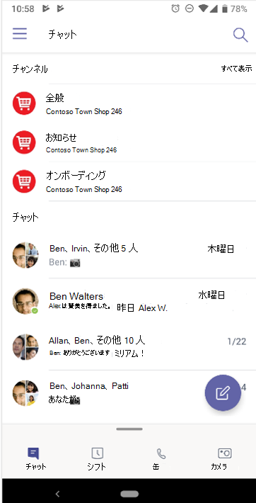

# Microsoft Teamsに移動する

組織固有のパスとニーズを明確に理解できたので、次は、Microsoft Teamsとの強力なコラボレーションへの道のりを始めましょう。 次のセクションを使用して、Teams内で補完されるKaizalaの機能を移動する方法について説明します。

| Kaizalaから | Teamsするには |
|---------|-----------------------|
| 作業の開始 - サインインとプロファイルの設定| [Teams の使用を開始する](#getting-started) |
| 新しいチャットの開始、1:1 の音声通話とビデオ通話 | [Teams、オーディオ、ビデオ通話でのチャット](#starting-new-chats-11-audio-and-video-calls) |
| Kaizala グループ| [Kaizala グループをTeamsに移動する](#moving-your-kaizala-groups-to-microsoft-teams) |
| コンシューマー アプリ のメッセージング エクスペリエンスを模倣する| [コンシューマー アプリ のメッセージング エクスペリエンスを模倣する](#mimic-the-consumer-app-messaging-experience) |
| Out Of Box アクション カード |  [Teamsで作業を完了する](#getting-work-done-in-teams) |
| 投票、アンケート、チェックリスト| [Teamsでのポーリング、アンケート、チェックリストの実行](#polls-surveys-and-checklists-in-teams) |
| 会議 - アクション カード| [会議を行う – Teamsでの会議](#getting-work-done-in-teams) |
| お知らせ - アクション カード| [Teamsのお知らせ](#announcements-in-teams) |
| フォト チェックイン アクション カード| [Teamsでの写真チェックイン](#photo-check-ins)
| クイズ - アクション カード| [Teamsのクイズ](#quiz-in-teams)
| トレーニング - アクション カード| [Teamsでのトレーニング](#training-in-teams) |
| カスタム アクション カード | [Teamsのカスタム ソリューション](#moving-kaizala-custom-solutions-to-microsoft-teams) |
| Kaizala管理ポータル| [IT 担当者向け](#it-professionals) |
| | [エンド ユーザーの場合](#end-user-guidance) |
| Kaizala グループの分解| [Kaizala グループの分解](#kaizala-group-dissolution) |
| テナント データのエクスポートをKaizalaする| [テナント データKaizalaエクスポートする](#export-kaizala-tenant-data)  |
| 外部ユーザー (ベンダー/仕入先/パートナー) との共同作業| [Teams組織外のユーザーをチャットに追加または招待する](#collaborating-with-external-usersvendorssupplierspartners) |

## はじめに

KaizalaからTeamsへの移行の開始は、作業の開始ガイドを使用する方がこれまで以上に簡単です。 Microsoft Teams体験の開始の詳細については、「[Teamsの概要](https://support.microsoft.com/office/start-and-pin-chats-a864b052-5e4b-4ccf-b046-2e26f40e21b5?wt.mc_id=otc_microsoft_teams&ui=en-us&rs=en-us&ad=us)」を参照してください。

## 新しいチャットの開始、1:1 の音声通話とビデオ通話

小規模なグループと共同作業したり、Teams内でプライベートに話したりするために、1 対 1 またはグループ チャットを作成します。 チャットをピン留めし、メッセージを保存してすばやくアクセスできます。 リッチ テキストの書式設定、絵文字、GIF でチャットを開始するには、「[Teamsでのチャット](https://support.microsoft.com/office/start-and-pin-chats-a864b052-5e4b-4ccf-b046-2e26f40e21b5?wt.mc_id=otc_microsoft_teams&ui=en-us&rs=en-us&ad=us)」を参照してください。

組織内のすべてのユーザーと 1 対 1 またはグループ通話を開始して効率的に通信します。 Teamsを使用すると、音声通話とビデオ通話の両方を柔軟に行うことができます。  開始するには、「 [呼び出しを行う」を](https://www.microsoft.com/videoplayer/embed/RE4rxv0?pid=ocpVideo0-innerdiv-oneplayer&postJsllMsg=true&maskLevel=20&market=en-us)参照してください。

Kaizala グループからMicrosoft Teamsに移行するには、TeamsでTeams、チャネル、グループ チャットを作成します。

Teamsは、組織内のさまざまなプロジェクトや成果を取り巻く人、コンテンツ、ツールのコレクションです。

Teamsは、チーム メンバーとのトピック固有の会話である **チャネル** で構成されます。 各チャネルは、特定のトピック、部署、またはプロジェクト専用です。 チャネルは、アプリケーションで拡張する場合に最も役立ちます。 詳細については、 [チャネルでの作業に関するページを](https://support.microsoft.com/office/teams-and-channels-df38ae23-8f85-46d3-b071-cb11b9de5499?ui=en-us&rs=en-us&ad=us#ID0EAABAAA=Work_in_channels)参照してください。

**グループ チャット** を使用すると、同僚のクイック ハドルをインスタント メッセージングで収集できます。

### Teams チャットとチーム チャネルの会話

|チャットでの会話 | チーム チャネルでの会話 |
|---------|---------|
|軽量の会話の場合は、受信者に直接メッセージを送信します。   | オープンスペースで複数のトピックについて説明する対話の場合。  |
|プライベート チャットは、チャット内のユーザーにのみ表示されます     | チーム内のすべてのユーザーに表示される        |
|1 つの継続的な読み取りのない会話     | 構造化された複数のスレッド化された会話        |
|最大 250 人     | 最大 25,000 人        |
|新しいチャット参加者とチャット履歴を共有するかどうかを選択する     | 履歴は、すべての新しいチーム メンバーと共有されます        |
|新しいチャット受信者は、チャットに既に参加しているユーザーが追加する必要があります     | ユーザーは、検索してチームに参加できます。 プライベート Teamsでは、Teams管理者が新しいメンバーを承認します。 チャネル メンバーは、新しいメンバーが管理者の承認なしに直接参加できるようにするコードを生成できます。        |
|スポット画面で共有し、音声とビデオの通話を行います。 すべてのチャット参加者とTeams会議の簡単なスケジュール設定     | その場で、スケジュールされた音声とビデオの通話        |
|アプリを使用した一部の機能拡張     | アプリを使用した完全な拡張性とカスタマイズ        |

Teams、チャネル、グループ チャットの概要については、[Microsoft Teamsのチームとチャネルに](teams-channels-overview.md)関するページを参照してください。

## Kaizala グループをMicrosoft Teamsに移動する

Kaizalaでは、グループはユーザーのコレクションです。 Kaizala内には、フラット グループ、階層グループ、ブロードキャスト グループの 3 種類のグループ構造があります。 Microsoft Teamsに移行するときに、Teams、チャネル、およびグループ チャットを使用して、組織の同様のコミュニケーション構造を作成できます。

グループからTeams、チャネル、グループ チャットへの切り替え手順については、次のガイダンスを参照してください。

Kaizalaフラット グループをTeamsに移動するには、次の 2 つの方法があります。

- オプション 1: Kaizala フラット グループからTeamsのグループ チャットに切り替える

- オプション 2: Kaizala フラット グループからTeams チームに切り替える

**オプション 1: Kaizalaフラット グループからTeamsのグループ チャットに切り替えます。**

Teams グループ チャットを作成して、最大 250 人の参加者とすばやくハドルや一時的な会話を行うことができます。 グループ チャットを使用すると、組織内のユーザーは、誰でもチャットに追加できるオープンな会話の中央の場所を確保できます。

1. グループ チャットを開始して名前を付けます。

    

    グループ チャットにアクセスできるすべてのユーザーは [、メッセージを送信](https://support.microsoft.com/office/send-and-read-messages-in-teams-b29e60ec-76af-4d97-8c3c-a4e36f2b64aa?ui=en-us&rs=en-us&ad=us)できます。

2. 会話にユーザーを追加します。

    

   グループ チャット (1 対 1 ではない) に他のユーザーを追加する場合は、 **チャット履歴** と共有する **履歴の期間** を含めることができます。

3. グループ チャットを管理します。
  
    

   グループ チャットに参加しているユーザーを確認するには、チャット ヘッダーの参加者の数にマウス ポインターを合わせて、全員の名前の一覧を表示します。

**オプション 2: Kaizala フラット グループからTeams チームに切り替えます。**

ターゲットを絞った大規模なグループ通信の場合は、フラット グループのチームを作成できます。 最大 25,000 人のメンバーを追加して、スレッド化された会話で構造化された通信を行うことができます。 この種類の通信により、モデレートロールと管理ロールを使用して、物事がスムーズに実行されるようにすることができます。

1. チームを作成する: Teamsで起動して実行するには、チームを作成し、ユーザーを追加し、チャネルを追加する必要があります。 詳細については、 [最初のチームを参照してください](get-started-with-teams-create-your-first-teams-and-channels.md)。
2. チーム所有者向けのガイドを確認します。

   [チーム所有者](https://support.microsoft.com/office/go-to-guide-for-team-owners-92d238e6-0ae2-447e-af90-40b1052c4547?ui=en-us&rs=en-us&ad=us)は、新しいメンバーとゲストを追加したり、メンバーを所有者に変更したり、チャネルや設定を管理したり、使用されなくなったチームをアーカイブしたりできます。

3. チームに一括メンバーを追加する:

    チーム所有者の場合は、チームの一覧のチーム名に移動し、[ **その他のオプション** ] ボタン> [メンバーの **追加]** を選択します。

    

    配布リスト、セキュリティ グループ、またはMicrosoft 365 グループの入力を開始して、チームに追加できます。 詳細については、「[Teamsのチームにメンバーを追加する](https://support.microsoft.com/office/add-members-to-a-team-in-teams-aff2249d-b456-4bc3-81e7-52327b6b38e9?ui=en-us&rs=en-us&ad=us)」を参照してください。

### コンシューマー アプリのメッセージング エクスペリエンスを模倣する

ユーザーのエクスペリエンスを簡略化する場合は、組織のTeams エクスペリエンスを構成して、ユーザーが既に使用しているコンシューマー ツールを模倣することを選択できます。

**チャットでお気に入りのチャネルを表示** する機能を有効にして、コミュニケーションとシフトを簡略化する (省略可能) Kaizala ユーザーのTeams体験を開始することをお勧めします。

**Shifts** を使用したチームのインターフェイスの例を次に示します。

**Shifts を使用しない** チームのインターフェイスの例を次に示します。

 

> [!NOTE]
> [Teams] ボタンへのアクセス権を削除すると、チャットの上に強調表示されたチャネルのみが表示される Frontline worker の簡略化されたインターフェイスを作成できます。 詳細については、「[Teamsでのメッセージング ポリシーの管理](messaging-policies-in-teams.md)」を参照してください。

### Teamsとチャネルを使用して階層グループ構造を作成する

Kaizalaでは、階層グループを使用すると、組織はメンバー間の通信の種類に応じて異なるグループ構造で対話できます。  Teamsでは、組織図に一致するTeamsとチャネルを作成し、階層ベースの通信を設定できます。 Teams内の階層構造を使用して、必要なアクション、重要なニュース、更新プログラムのメンバーにアラートを送信できます。

詳細については、[Microsoft Teamsでチームを編成するためのベスト プラクティス](best-practices-organizing.md)を参照してください。

### Teamsとチャネルを使用して重要なニュースをブロードキャストする

Kaizalaブロードキャスト グループでは、管理者はターゲット グループにメッセージとアクションを送信できます。 同様に、複数のチャネルに投稿して、Teamsでメッセージをブロードキャストできます。 重要なメッセージに注意を向けるには、お知らせの投稿を作成します。

チャネル モデレーションを使用すると、メッセージを投稿して返信できるユーザーを制御できます。 ブロードキャスト配信者が多くのユーザーにアクセスできるように、チャネルをチーム全体で選択できます。 お知らせに対する対話を制限できるのは、選択した管理者とモデレーターに返信する機能を許可することだけです。 次の手順に従って、Teams チャネル内でチャネル モデレーションを確立します。

**手順 1**: チャネル モデレーションを設定します。

- ブロードキャストのチャネルを選択する

- モデレーションを設定する **チャネル設定** を選択する

- [モデレーターはWhoですか?] に移動します。 チャネルのモデレーターを手動で選択するには

**手順 2**: メッセージを書式設定します。
重要なニュースやアクションをチーム メンバーに通知するアナウンスを作成します。

   

- チャネルで、メッセージを入力するボックスの下にある [書式] を選択します。

- 表示されるボックスの上部にある [新しい会話>お知らせ] の横にある矢印を選択します。

- 見出しを入力するか、背景色を変更するか、見出し領域の背景イメージを追加します。

- [サブヘッドの追加] 領域にアナウンスの件名を入力し、メッセージの本文を入力し、[送信] ボタンを選択します。

    

**手順 3**: メッセージ ブロードキャストのチャネルを選択します。

大規模なユーザー グループに連絡する必要がある重要なお知らせや情報がある場合は、複数のTeamsとチャネル間でクロスポストできます。

  

詳細については、「[Teamsでチャネル会話をクロスポストする](https://support.microsoft.com/office/cross-post-a-channel-conversation-in-teams-9c1252a3-67ef-498e-a7c1-dd7147b3d295?ui=en-us&rs=en-us&ad=us)」を参照してください。

## Teamsで作業を完了する

作業の完了に関しては、適切なツールを使用して効率を高めることができます。 Kaizalaでは、[Out-Of-Box (OOB) アクション カード](/kaizala/partnerdocs/kaizalaactioncards)を使用して、毎日の作業管理を簡単かつ効率的にすることができます。
Microsoft Teamsには、Kaizalaの Out of Box Action カードに対するいくつかの機能とソリューションが用意されています。

Teams プラットフォームを使用すると、すぐに使用できるMicrosoft 365 アプリケーションやサードパーティのアプリと共に、Microsoft Teamsに統合することで、既存の組織ツールを使用できます。 現在、Microsoft Teamsには 800 を超える外部アプリケーションが用意されています。

### Teamsの投票、アンケート、チェックリスト

[投票](https://github.com/OfficeDev/microsoft-teams-apps-poll/wiki)、アンケート、[チェックリスト](https://github.com/OfficeDev/microsoft-teams-app-checklist)[の](https://github.com/OfficeDev/microsoft-teams-apps-survey)アクション カードは、GitHubにメッセージ拡張機能アプリ テンプレート[Teams](/microsoftteams/platform/messaging-extensions/what-are-messaging-extensions)すぐにインストールできるようになりました。

**投票** を使用すると、ユーザーはチームの意見を知るために、チャットまたはチャネルで投票をすばやく作成して送信できます。 ポーリング アプリは、デスクトップ、ブラウザー、iOS、Android クライアントTeams、すべてのプラットフォームでサポートされています。 既存のMicrosoft 365 サブスクリプションの一部としてデプロイする準備が整いました

**アンケート** を使用すると、ユーザーはチャットまたはチャネルでアンケートを作成し、一連の質問をしたり、実用的な分析情報を得ることができます。 アンケートを使用して、登録、登録、フィードバック、声、リード キャプチャ、レポート、苦情、評価を行います。 アンケート アプリは、デスクトップ、ブラウザー、iOS、Android クライアントTeams、すべてのプラットフォームでサポートされています。 既存のMicrosoft 365 サブスクリプションの一部としてデプロイする準備が整いました。

**チェックリスト** を使用すると、チャットまたはチャネルで共有チェックリストを作成してチームと共同作業できます。 チェックリスト アプリは、デスクトップ、ブラウザー、iOS、Android クライアントTeams、すべてのプラットフォームでサポートされています。 既存のMicrosoft 365 サブスクリプションの一部としてデプロイする準備が整いました。

また、既存のMicrosoft 365やサードパーティのアプリを使用して、迅速な投票、アンケート、チェックリストをチームに即座に送信することもできます。

[Microsoft Forms](https://techcommunity.microsoft.com/t5/microsoft-forms-blog/microsoft-forms-works-great-with-microsoft-teams/ba-p/109915)を使用すると、情報を収集し、意思決定を迅速に行うことができます。 フォームをTeamsに統合すると、フォーム タブを簡単に設定したり、フォームの通知を作成したり、クイック投票を行うことができます。 方法については、「[Microsoft Teamsでフォームを作成、編集、レビュー](https://support.microsoft.com/office/work-with-colleagues-to-create-edit-and-review-forms-in-microsoft-teams-333b97a3-41d9-48bc-a1cb-84a96bd44e14#:~:text=1%20In%20Teams%2C%20go%20to%20the%20channel%20you,name%20for%20your%20new%20form.%20More%20items...%20)する」を参照してください。

Polly や SurveyMonkey などのサード パーティ製アプリを使用すると、Teamsを使用して投票やアンケートをさらに実施できます。

- **Polly**  を使用すると、リアルタイムの投票分析情報を得て、ビジネス上の意思決定を改善し、包括的なダッシュボード ビューを通じて投票全体のチームエンゲージメントを測定できます。

- **SurveyMonkey** を使用すると、Microsoft Teamsで既にビジネスを行っている場所にアンケートが表示され、毎日のワークフローにアンケートを簡単に追加できます。 Microsoft Teams内から簡単な 1 質問の投票を書いて送信し、結果がチームメイトから得られます。

### Teamsのジョブ

**[Microsoft Planner](https://support.microsoft.com/office/organize-your-team-s-tasks-in-microsoft-planner-c931a8a8-0cbb-4410-b66e-ae13233135fb?ui=en-us&rs=en-us&ad=us)** を使用して、Teamsでジョブを実行します。 チームとプロジェクトで共同作業したり、進行状況レポートを表示したり、個々の割り当てを追跡したりできます。

Microsoft Teamsを使用しているときに、1 つ以上の Planner タブをチーム チャネルに追加することで、タスクを整理できます。 その後、Teamsまたは Planner for Web からプランを操作したり、プランを削除または削除したり、Planner でタスクが割り当てられたときにTeamsで通知を受け取ることができます。

### Teamsのお知らせ

[会社のコミュニケーター](/microsoftteams/platform/samples/app-templates#company-communicator) アプリを使用して、複数のチームまたは多数の従業員を対象としたメッセージを作成して送信します。 その簡単なインターフェイスにより、指定されたユーザーは、ターゲットを絞った方法でメッセージを作成、プレビュー、共同作業、送信できます。 管理上の決定に直接関連する分析情報を使用して、メッセージを確認または操作したユーザーの数に関するカスタム個人データなどのカスタムターゲット通信機能を構築します。

### フォト チェックイン

Teams Smart カメラを使用して、注釈付きの画像をキャプチャしてチームと共有します。 チームの把握を維持するために、正確に場所を簡単に共有できます。 Kaizala機能をTeamsにマップする方法を伝えるために、より多くの情報が必要です。 スライド デッキからドキュメントにできる限り多くの情報が含まれているのは間違いありません。

[スタッフ チェックイン アプリ テンプレートを使用して](/microsoftteams/platform/samples/app-templates#staff-check-ins)、フロント ライン スタッフがスケジュールされた、またはアドホックベースでTeamsから直接、タイム クリティカルな情報と状態の更新を簡単に提供できるようにします。 アプリでは、リアルタイムの場所、写真、メモ、リマインダー通知、自動化されたワークフローがサポートされます。

### Teamsのクイズ

Quiz はカスタム [Teams メッセージング拡張機能](/microsoftteams/platform/messaging-extensions/what-are-messaging-extensions)です。これにより、チャット内またはチャネル内でナレッジ チェックと瞬時の結果を得るためのクイズを作成できます。 クイズは、クラス内およびオフラインの試験、チーム内のナレッジ チェック、チーム内の楽しいクイズに使用できます。 テスト アプリは、デスクトップ、ブラウザー、iOS、Android クライアントなどの複数のプラットフォームTeamsでサポートされています。 このアプリは、既存のMicrosoft 365 サブスクリプションの一部としてデプロイする準備が整いました。

[GitHubで入手する](https://github.com/OfficeDev/microsoft-teams-apps-quiz)

  

### Teamsでのトレーニング

[スタッフ チェックイン アプリ テンプレートを使用すると](/microsoftteams/platform/samples/app-templates#staff-check-ins)、フロント ライン スタッフは、スケジュールされた、またはアドホックベースでTeamsから直接、タイム クリティカルな情報と状態の更新を簡単に提供できます。 アプリでは、リアルタイムの場所、写真、メモ、リマインダー通知、自動化されたワークフローがサポートされます。

Teamsを使用して、組織のトレーニングを簡単にします。 トレーニングは、ユーザーがオフラインのナレッジ共有とスキルアップのためにチャットまたはチャネル内でトレーニングを公開できるようにするカスタム Teams [メッセージング拡張機能](/microsoftteams/platform/messaging-extensions/what-are-messaging-extensions?tabs=dotnet)アプリです。 このアプリは、デスクトップ、ブラウザー、iOS、Androidなど、複数のTeams プラットフォーム クライアントでサポートされています。 このアプリは、Microsoft 365 サブスクリプションの一部としてデプロイする準備が整いました。

[GitHubで入手する](https://github.com/OfficeDev/microsoft-teams-apps-training)

コンテキスト情報へのアクセスを提供することで、オンボードを簡略化できます。  スキルを通じて組織を強化するために、従業員のガイド、トレーニング、およびより簡単に最新の情報を入手できるようにします。 トレーニング シナリオの詳細については、「 [新入社員のオンボード](https://support.microsoft.com/office/effectively-onboard-new-employees-691faccd-1d1a-4f47-99ac-b6c82973f5ee)」を参照してください。

## カスタム ソリューションKaizala Microsoft Teamsに移動する

ソリューションをMicrosoft Teamsするには、次の 3 つの手順に従います。

1. ソリューションの使用と頻度を検討してください。

    ソリューションの使用率と頻度が高い場合は、カスタム開発のケースが強力になります。

2. ソリューションの複雑さを考慮してください。

    複雑さが高いソリューションでは、カスタム開発のケースが強化される可能性があります。

3. 使用頻度と複雑さごとに、次の方法を調べます。

    - ネイティブ Microsoft Teams機能を活用する

    - [サード パーティのアプリ統合を使用してアプリ ストアを探索する](deploy-apps-microsoft-teams-landing-page.md)

    - [アプリ テンプレートを検出する](/microsoftteams/platform/samples/app-templates)

    - [Teams プラットフォームを使用してカスタム アプリを](/microsoftteams/platform/overview)ビルドする

## Microsoft Teamsの管理

### IT プロフェッショナル

Kaizala管理ポータルから Microsoft Teams 管理 センターへの管理の移行を行います。 Teams管理センターは、主に管理者ロールのみを使用します。

管理者は Teams 全体のワークロードを管理できる場合もあれば、通話品質の問題のトラブルシューティングや組織のテレフォニーのニーズを管理するために委任されたアクセス許可を持つ場合もあります。

管理センターを移動するには、[Microsoft Teams 管理 センターにアクセスします](https://admin.teams.microsoft.com/)。

[Microsoft Purview コンプライアンス ポータル](/microsoft-365/compliance/microsoft-365-compliance-center)と [Microsoft Security Center](/microsoft-365/security/defender/overview-security-center) を使用して、Microsoft 365全体で組織のセキュリティとコンプライアンスを監視できます。

ビジネスを保護し、[Azure Active Directory管理センター](https://aad.portal.azure.com/#@microsoft.onmicrosoft.com/dashboard/private/c7736064-7b28-4f3d-b366-2740a8d48020)でユーザーを強化し、グループ、ID、ライセンス、Microsoft 365全体のアクセスを確認できます。

## Teams 管理 センターへのKaizala 管理ポータル

### エンド ユーザー ガイダンス

次の表を使用して、Kaizala管理ポータルからMicrosoft Teamsの対応する機能を移動します。

| Kaizala 管理ポータル | Microsoft Teams アプリ|
|---------|-----------------------|
| グループの作成 (組織に接続) | デスクトップ またはモバイル アプリを使用して **チームを作成** する |
| ユーザーを一括で追加する | チームに一括でユーザーを追加する場合は、O365 グループ、O365 DLs、またはセキュリティ グループを使用してチームを作成することを検討してください |
| ディレクトリ | チームの **検索バー** を使用して、組織内のすべてのユーザーを検索します。 検索結果には、ファイル、メッセージ、投稿も返されます |
| Analytics (アクション カード) | **投票**、 **アンケート**、 **チェックリスト** には、ダウンロード可能なデータを含むレポートが組み込まれています。 ジョブは、ユーザーが利用できるTeamsのタスク アプリの助けを借りて割り当てることもできます。 その他のシナリオでは、**Trello**、**Asana** などのサードパーティ製アプリをTeams内で使用することもできます。 |
| 拡張機能 – コネクタ | **コネクタ** が必要なチャネルのメニュー (...) からコネクタ オプションを使用します。 |
| [分析 (利用状況) 導入レポート](teams-analytics-and-reports/view-analytics.md)、 [使用状況レポート](teams-analytics-and-reports/teams-usage-report.md)、 [アクティビティ レポート](teams-analytics-and-reports/user-activity-report.md) | チームの所有者は、メニュー (...) から移動してチーム **分析** を **管理することで、チーム** > のレポートにアクセスできます。 |

> [!NOTE]
> Teamsエンド ユーザーは、デスクトップまたはモバイルでTeamsを使用して個々のチームとチャネルを管理でき、Teams 管理 センターにアクセスする必要はありません。

## Kaizala グループの分解

Teams チャネルとチャットに移行する際に、組織がコミュニケーションの中心的な場所を 1 つ確保するために、グループの分解Kaizala検討する場合があります。 Kaizala グループを削除すると、チャットの一覧からグループが削除されます。 グループ内で唯一の管理者である場合は、削除する前に、グループ内の少なくとも 1 人のユーザーに管理者ロールを割り当てる必要があります。

### Kaizala グループをTeamsに移動するには

 1. Kaizala グループ メンバーとTeamsティザーを共有する

 2. Teams サイトを設定する

 3. Teamsにユーザーを追加する

 4. すべてのKaizala グループ メンバーへの切り替えを発表する

 5. 設定で、Kaizala グループを **読み取り専用** に [切り替えます](#to-switch-to-kaizala-group-to-read-only)

 6. Kaizala グループ メンバーを使用して、Teamsが優れたオプションである理由を共有する

 7. Teamsがいつ利用可能になるか、Teamsを使用する方法など、ガイドラインを共有する

 8. エンゲージメント コンテストを開始する

 9. リーダーシップの参加を設定する

 10. メンバーからのフィードバックを求める

 11. コンテンツ カレンダーに従う

 12. [グループKaizala削除する](#to-delete-a-group)

### Kaizala **グループに切** り替えるには

1. Kaizala管理ポータルにサインインします。

2. 左側のナビゲーション パネルで [ **グループ** ] タブを選択し、 **読み取り専用** として設定するグループを選択します。

    

3. ドロップダウン リストから [ **ポリシーの編集]** を選択します。
  
    

4. **グループ ポリシー** ウィンドウで、次のオプションをオフにします。

     - 新しい参加者にチャット履歴の表示を許可します。 これから送信されたメッセージが表示されます。

     - メンバーがメッセージと添付ファイルを送信できるようにします。

       

     > [!NOTE]
     > 管理者は引き続きグループに投稿できます。

### グループを削除するには

1. [チャット] ボックスの一覧で、グループの会話を長押しします。

2. [グループの削除] をタップします。

## テナント データKaizalaエクスポートする

Kaizala テナント管理者/グローバル管理者は、Kaizala管理ポータルからKaizalaテナント データをエクスポートできます。 Teamsを使用している間も、Kaizalaで企業データの制御を維持できます。 詳細については、「 [管理ポータルからテナント データをエクスポートする」を参照してください](/office365/kaizala/export-or-delete-your-data)。

### データをエクスポートするには

 1. 左側のナビゲーション パネルで [ **分析** ] タブを選択し、[ **テナント データのエクスポート**] を選択します。
  
    

 2. [ **エクスポート**] を選択します。

    

 3. テナント メッセージ ファイルを使用します。グループ名/タイムスタンプのフィルターを使用して、グループ レベルのチャット データにアクセスします。

    

## Kaizala グループの削除

Kaizala グループを削除すると、チャットの一覧からグループが削除されます。 グループ内で唯一の管理者である場合は、削除する前に、グループ内の少なくとも 1 人のユーザーに管理者ロールを割り当てる必要があります。

グループを削除するには:

- [チャット] ボックスの一覧で、グループの会話を長押しします。

- [グループの削除] をタップします。

## テナント データのエクスポートをKaizalaする

Teamsを使用している間も、Kaizalaで企業データの制御を維持できます。 詳細については、「 [管理ポータルからテナント データをエクスポートする」を参照してください](/office365/kaizala/export-or-delete-your-data)。

## 外部ユーザーとの共同作業 (Vendors/suppliers/Partners)

Microsoft Teamsは、外部の関係者と共同作業するための安全なソリューションを提供します。また、Microsoft Teams Connectを使用すると、組織外のユーザーとの共同作業がさらに簡単になります。 Teamsは、商用ユーザーが外部の商用ユーザー (つまり他の組織の商用ユーザー) とチャットできるようにします。 この特権を基に、組織外のチーム メンバーとチャットすることができます(個人アカウントTeams使用している場合でも)。 これらのアカウントは SMB によって頻繁に使用されるため、この新しい機能は外部パートナーとの関係を強化するのに役立ちます。

[Ignite](https://techcommunity.microsoft.com/t5/microsoft-teams-blog/microsoft-ignite-fall-2021-innovations-coming-to-microsoft-teams/ba-p/2824127) で既に発表したように、任意のTeams ユーザーに連絡する完全なメール アドレスまたは電話番号を入力してチャットに招待し、テナントの切り替えを必要とせずに、Microsoft 個人アカウントを持つすべてのユーザーと 1 対 1 またはグループ チャットを開始できます。

テナントを切り替える必要なく外部ユーザーとチャットすると、必要な結果を迅速に取得できます。 動作について詳しく見てみましょう。

組織とTeams個人アカウント ユーザーの管理設定に応じて、外部Teams個人アカウント ユーザーとの会話を開始でき、外部Teams個人アカウント ユーザーは職場のユーザーでTeamsとの会話を開始できます。

組織で管理されているTeamsユーザーは、完全なメール アドレスまたは電話番号を入力して、チャットする個人アカウント ユーザー Teams招待できます。 個人ユーザー Teams、連絡するユーザーの正確な組織の電子メール アドレスを入力し、チャットを開始することができます。

チャットするユーザーがまだTeamsされていない場合は、個人用アカウントを使用して会話に参加するよう招待する電子メールまたはテキスト メッセージが届きます。 Teams個人アカウントに登録してサインインすると、チャットに参加できるようになります。

招待したユーザーが招待を承諾したら、新しい 1 対 1 またはグループ チャットを開始することも、既存の外部グループ チャットに追加することもできます。 このチャット スレッドは他のチャットと共に表示され、チャットを表示するためにテナントの切り替えは必要ありません。

チャットの一環として、豊富なメッセージ、GIF、メディアを送受信することで、自分自身を表現できます。

自分が参加する会話にのみ残ることを選択できます。 外部ユーザーからのメッセージをブロックしたり、グループ チャットを終了したりできます。

組織によって管理Teamsユーザーと個人アカウントTeamsユーザーは、外部招待を拒否できます。 外部ユーザーが受け入れる前に最大 10 回メッセージを送信できますが、10 件のメッセージの後に受け入れがない場合は、このユーザーに追加のメッセージを送信することはできません。

[サポート ページ](https://support.microsoft.com/en-us/office/add-or-invite-people-outside-your-teams-org-to-a-chat-6897ab47-9f60-4db6-8b95-18599714fe57)を表示し、[ブログ](https://techcommunity.microsoft.com/t5/microsoft-teams-blog/microsoft-teams-users-can-now-chat-with-any-teams-user-outside/ba-p/3070832)を読んで、信頼できるTeams ワークスペースの安全性とセキュリティ内で外部の顧客やパートナーとシームレスに共同作業Teams方法の詳細を確認します。

## 次のステップ

[フロントライン ワーカーのMicrosoft Teams](/MicrosoftTeams/drive-adoption-optimize-kaizala)
