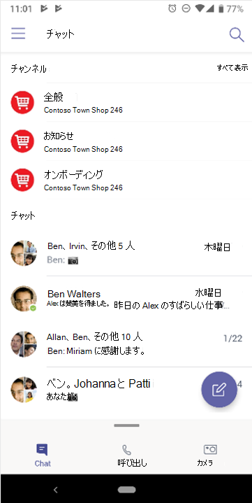

# ナビゲーションMicrosoft Teams

組織固有のパスとニーズを明確に理解したので、次は、Microsoft Teams との強力なコラボレーションに取りかかります。 次のセクションを使用して、Kaziala の機能を各セクション内で強化する方法Teams。

| Kaizala | 設定Teams |
|---------|-----------------------|
| 概要 - サインインとプロファイルのセットアップ| [Teams の使用を開始する](#getting-started) |
| 新しいチャットの開始、1 対 1 の音声通話とビデオ通話 | [音声通話Teamsビデオ通話でのチャット](#starting-new-chats-11-audio-and-video-calls) |
| グループKaizalaグループ| [グループをKaizalaに移動Teams](#moving-your-kaizala-groups-to-microsoft-teams) |
| コンシューマー アプリのメッセージング エクスペリエンスを模倣する| [コンシューマー アプリのメッセージング エクスペリエンスを模倣する](#mimic-the-consumer-app-messaging-experience) |
| Out of Box アクション カード |  [Teams で作業を完了Teams](#getting-work-done-in-teams) |
| 投票、アンケート、チェックリスト| [アンケート、アンケート、チェックリストを実行Teams](#polls-surveys-and-checklists-in-teams) |
| 会議 - アクション カード| [Let's Meet – 会議のTeams](#getting-work-done-in-teams) |
| お知らせ - アクション カード| [Teams のお知らせ](#announcements-in-teams) |
| 写真チェックイン アクション カード| [写真のチェックイン (Teams](#photo-check-ins)
| クイズ - アクション カード| [テストのTeams](#quiz-in-teams)
| トレーニング - アクション カード| [Teams でのトレーニング](#training-in-teams) |
| カスタム アクション カード | [カスタム ソリューション (Teams](#moving-kaizala-custom-solutions-to-microsoft-teams) |
| Kaizala管理ポータル| [IT のプロ向け](#it-professionals) |
| | [エンド ユーザー向け](#end-user-guidance) |
| Kaizalaグループの選択| [Kaizalaグループの選択](#kaizala-group-dissolution) |
| Kaizala データのエクスポート| [テナント データKaizalaエクスポートする](#export-kaizala-tenant-data)  |
| 外部ユーザー (ベンダー/サプライヤー/パートナー) との共同作業| [個人Teamsの相互運用性のためにTeamsと作業に使用する](#collaborating-with-external-usersvendorssupplierspartners) |

## はじめに

作業の開始ガイドでは、KaizalaからTeamsの移行をこれまでよりも簡単に開始できます。 新しい体験の開始の詳細については、「Microsoft Teamsの概要[」を参照Teams](https://support.microsoft.com/office/start-and-pin-chats-a864b052-5e4b-4ccf-b046-2e26f40e21b5?wt.mc_id=otc_microsoft_teams&ui=en-us&rs=en-us&ad=us)。

## 新しいチャットの開始、1 対 1 の音声通話とビデオ通話

1 対 1 またはグループ チャットを作成して、小規模なグループと共同作業したり、グループ内でプライベートTeams。 チャットをピン留めし、メッセージを保存してすばやくアクセスできます。 リッチ テキストの書式設定、絵文字、GIF を使ったチャットを開始するには、「Teams でのチャット」[を参照してください](https://support.microsoft.com/office/start-and-pin-chats-a864b052-5e4b-4ccf-b046-2e26f40e21b5?wt.mc_id=otc_microsoft_teams&ui=en-us&rs=en-us&ad=us)。

組織内のユーザーと 1 対 1 またはグループ通話を開始することで、効率的に通信できます。 このTeams、音声通話とビデオ通話の両方を柔軟に行える。  開始するには、「通話を行 [う」を参照してください](https://www.microsoft.com/videoplayer/embed/RE4rxv0?pid=ocpVideo0-innerdiv-oneplayer&postJsllMsg=true&maskLevel=20&market=en-us)。

グループからグループKaizala、Microsoft Teams、チャネル、グループ チャットTeams作成を通じて、Teams。

Teamsは、組織内のさまざまなプロジェクトや結果を取り巻く人、コンテンツ、ツールのコレクションです。

Teamsチャネルで構成されます。チャネルは、チーム メイトとのトピック固有の会話です。 各チャネルは、特定のトピック、部門、またはプロジェクト専用です。 チャネルは、アプリケーションを使用して拡張する場合に最も重要です。 詳細については、「チャネルでの作業 [」を参照してください](https://support.microsoft.com/office/teams-and-channels-df38ae23-8f85-46d3-b071-cb11b9de5499?ui=en-us&rs=en-us&ad=us#ID0EAABAAA=Work_in_channels)。

**グループ チャットを使用** すると、インスタント メッセージングを使って同僚を簡単に集めできます。

### チャットとチーム チャネルTeamsでの会話

|チャットでの会話 | チーム チャネルでの会話 |
|---------|---------|
|受信者に直接メッセージを送信する軽量な会話の場合。   | オープン スペースで複数のトピックについて説明する対話用。  |
|プライベート チャットは、チャット内のユーザーにのみ表示されます。     | チーム内のすべてのユーザーに表示される        |
|1 つの継続的な未読の会話     | 構造化された複数のスレッド化された会話        |
|最大 250 人     | 最大 25,000 人        |
|新しいチャット参加者とチャット履歴を共有する場合の選択     | 履歴は、すべての新しいチーム メンバーと共有されます        |
|新しいチャットの受信者は、既にチャットに参加しているユーザーによって追加される必要があります     | ユーザーは、チームを検索してチームに参加できます。 プライベート アカウントではTeams管理者Teams新しいメンバーを承認します。 チャネル メンバーは、新しいメンバーが管理者の承認なしで直接参加できるコードを生成できます。        |
|スポット 画面共有、音声通話、ビデオ通話。 すべてのチャット参加者とのTeamsの簡単なスケジュール設定     | その場で予定されている音声通話とビデオ通話        |
|アプリの一部の機能拡張     | アプリを使用した完全な拡張性とカスタマイズ        |

チャット、チャネル、Teamsチャットの概要については、「[チームとチャネル](teams-channels-overview.md)」を参照Microsoft Teams。

## グループをKaizalaに移動Microsoft Teams

このKaizalaグループはユーザーのコレクションです。 グループ内には、フラット グループ、階層グループKaizalaブロードキャスト グループの 3 種類のグループ構造があります。 Microsoft Teamsに移行すると、Teams、チャネル、グループ チャットを使用して、組織の同様の通信構造を作成できます。

グループからグループ チャット、チャネル、グループ チャットに切り替えるTeamsガイダンスを使用します。

フラット グループをフラット グループにKaizala方法は 2 Teams。

- オプション 1: フラット グループからKaizalaグループ チャットに切り替Teams

- オプション 2: フラット グループKaizalaチームに切りTeamsする

**オプション 1: フラット グループからKaizalaグループ チャットに切り替Teams**

最大 250 人のTeams簡単なチャットや一時的な会話を行うグループ チャットを作成できます。 グループ チャットを使用すると、組織内のユーザーは、誰でもチャットに追加できる、開いている会話の中心的な場所を持つことになります。

1. グループ チャットを開始して名前を付けします。

    

    グループ チャットにアクセスできるすべてのユーザーがメッセージ [を送信できます](https://support.microsoft.com/office/send-and-read-messages-in-teams-b29e60ec-76af-4d97-8c3c-a4e36f2b64aa?ui=en-us&rs=en-us&ad=us)。

2. 会話にユーザーを追加します。

    
    
   (1 対 1 ではなく) グループ チャットに他のユーザーを追加する場合は、共有するチャット履歴と履歴の期間を含めできます。

3. グループ チャットを管理します。
  
    
    
   グループ チャットに参加しているユーザーを確認するには、チャット ヘッダーの参加者数をポイントして、全員の名前の一覧を表示します。

**オプション 2: フラット グループKaizalaチームに切りTeamsする**
   
対象を絞った大規模なグループ通信の場合は、フラット グループのチームを作成できます。 スレッド化された会話と構造化された通信を行う最大 25,000 人のメンバーを追加できます。 この種類の通信では、モデレーションロールと管理ロールを使用して、スムーズに動作します。

1. チームを作成する: Teams で立ち上げ、実行するには、チームの作成、ユーザーの追加、チャネルの追加を行う必要があります。 詳細については、最初のチーム [を参照してください](get-started-with-teams-create-your-first-teams-and-channels.md)。
2. チーム所有者向けガイドを確認します。

チームの [所有者は](https://support.microsoft.com/office/go-to-guide-for-team-owners-92d238e6-0ae2-447e-af90-40b1052c4547?ui=en-us&rs=en-us&ad=us)、新しいメンバーとゲストを追加し、メンバーを所有者に変更し、チャネルと設定を管理し、使用されなくなったチームをアーカイブすることができます。

3. チームに一括メンバーを追加する:

    チームの所有者である場合は、チームの一覧でチーム名に移動し、[その他のオプション] ボタンを選択>メンバーを追加 **します**。

    

    配布リスト、セキュリティ グループ、またはチームに追加するMicrosoft 365グループの入力を開始できます。 詳細については、「チームにメンバーを追加[する」を参照Teams](https://support.microsoft.com/office/add-members-to-a-team-in-teams-aff2249d-b456-4bc3-81e7-52327b6b38e9?ui=en-us&rs=en-us&ad=us)。

### コンシューマー アプリのメッセージング エクスペリエンスを模倣する

ユーザーのエクスペリエンスを簡素化する場合は、組織の Teams エクスペリエンスを構成して、ユーザーが既に使用しているコンシューマー ツールを模倣することができます。

簡単な Teamsコミュニケーションとシフト (省略可能) Kaizalaで [チャットでお気に入りのチャネルを表示する] を使用して、Kaizala ユーザーの新しい体験を開始することをお勧めします。

Shifts を使用したチームのインターフェイスの例を次に **示します**。

Shifts を使用しない Team のインターフェイスの **例を次に示します**。

 

> [!NOTE]
> [チャット] ボタンへのアクセスTeams、チャットの上に表示されているチャネルだけが強調表示されている、Frontline worker の簡略化されたインターフェイスを作成できます。 詳細については、「Manage [messaging policies in Teams」を参照してください](messaging-policies-in-teams.md)。

### [Teams チャネル] を使用して階層構造のグループ構造を作成する

階層Kaizalaグループを使用すると、メンバー間の通信の種類に応じて、組織が異なるグループ構造で対話できます。  このTeams、組織図Teams一致するチャネルとチャネルを作成し、階層ベースの通信を設定できます。 必要なアクション、重要なニュース、更新Teamsメンバーに通知するために、階層構造を使用できます。

詳細については、Microsoft Teams でチームを編成するためのベスト [プラクティスを参照してください](best-practices-organizing.md)。

### 重要Teamsニュースをブロードキャストするには、チャネルとチャネルを使用します。

配信グループKaizala管理者は、対象のグループにメッセージとアクションを送信できます。 同様に、複数のチャネルに投稿して、複数のチャネルでメッセージをブロードキャストTeams。 重要なメッセージに注意を向け、お知らせの投稿を作成します。

チャネル モデレーションを使用すると、メッセージを投稿および返信できるユーザーを制御できます。 チャネルは、配信者がより多くの対象ユーザーに到達するために、チーム全体で選択できます。 お知らせのやり取りを制限できるのは、選択した管理者とモデレーターに対して返信を許可する機能のみです。 次の手順に従って、チャネル モデレーションをTeamsします。

**手順 1**: チャネル モデレーションを設定します。

- ブロードキャストのチャネルを選択する

- [ **チャネル設定] を** 選択してモデレーションを設定する

- [Whoは司会者ですか?] に移動します。 チャネルのモデレーターを手動で選択するには

**手順 2**: メッセージを書式設定する。
重要なニュースやアクションについてチーム メンバーに通知するアナウンスを作成します。

   

- チャネルで、メッセージを入力するボックスの下にある [書式] を選択します。

- 表示されるボックスの上部で、[新しい会話] の横にある矢印を選択し、[お知>します。

- 見出しを入力したり、背景色を変更したり、見出し領域の背景画像を追加したりします。

- [小ヘッドの追加] 領域にアナウンスの件名を入力し、メッセージの本文を入力し、[送信] ボタンを選択します。
    

**手順 3**: メッセージ配信のチャネルを選択します。

大規模なグループのユーザーに到達するために必要Teamsのお知らせや情報がある場合は、複数のグループとチャネルをまたがって投稿できます。

  

詳細については、「チャネル会話を[クロスポスト](https://support.microsoft.com/office/cross-post-a-channel-conversation-in-teams-9c1252a3-67ef-498e-a7c1-dd7147b3d295?ui=en-us&rs=en-us&ad=us)する」を参照Teams。

## Teams で作業を完了Teams

作業の完了に関しては、適切なツールを使用して効率を高めることができます。 このKaizala、[Out-of-box (OOB)](/kaizala/partnerdocs/kaizalaactioncards) アクション カードを使用して、毎日の作業管理を簡単かつ効率的にすることができます。
Microsoft Teamsでは、さまざまな機能とソリューションを提供しています。この機能は、Kaizala。

Teams プラットフォームでは、すぐに使用できる Microsoft 365 アプリケーションやサード パーティ製アプリと共に Microsoft Teams に統合することで、既存の組織ツールを使用できます。 現在、300 を超える外部アプリケーションが現在、Microsoft Teams。

### アンケート、アンケート、チェックリスト (Teams

[ポーリング、](https://github.com/OfficeDev/microsoft-teams-apps-poll/wiki)[アンケート、](https://github.com/OfficeDev/microsoft-teams-apps-survey)およびチェックリストアクション カードは、Teams のメッセージ拡張機能アプリ テンプレートとしてすぐにインストールGitHub。

**[** 投票] を使用すると、ユーザーはチャットまたはチャネルですばやく投票を作成して送信し、チームの意見を知る必要があります。 ポーリング アプリは、デスクトップ、ブラウザー、iOS、Android Teamsのすべてのプラットフォームでサポートされています。 既存のサブスクリプションの一部としてデプロイするMicrosoft 365です

**アンケート** を使用すると、ユーザーはチャットまたはチャネルでアンケートを作成して、一連の質問を行い、アクションの可能な分析情報を取得できます。 登録、登録、フィードバック、声、リード キャプチャ、レポート、苦情、評価のアンケートを使用します。 アンケート アプリは、デスクトップ、ブラウザー、iOS、Android Teamsのすべてのプラットフォームでサポートされています。 既存のサブスクリプションの一部としてデプロイMicrosoft 365です。

**チェックリスト** を使用すると、チャットまたはチャネルで共有チェックリストを作成することで、チームと共同作業できます。 チェックリスト アプリは、デスクトップ、ブラウザー、iOS、Android Teamsのすべてのプラットフォームでサポートされています。 既存のサブスクリプションの一部としてデプロイMicrosoft 365です。

また、既存のアプリやサード パーティ製アプリを使用して、すばやく投票、アンケート、チェックリストをチームMicrosoft 365送信することもできます。

[Microsoft Forms では](https://techcommunity.microsoft.com/t5/microsoft-forms-blog/microsoft-forms-works-great-with-microsoft-teams/ba-p/109915) 、情報を収集し、意思決定を迅速に行います。 フォームを Teamsに統合すると、[フォーム] タブを簡単に設定し、フォームの通知を作成して、簡単に投票を行うことができます。 方法については、「フォームを作成、編集、レビューする」を[参照Microsoft Teams](https://support.microsoft.com/office/work-with-colleagues-to-create-edit-and-review-forms-in-microsoft-teams-333b97a3-41d9-48bc-a1cb-84a96bd44e14#:~:text=1%20In%20Teams%2C%20go%20to%20the%20channel%20you,name%20for%20your%20new%20form.%20More%20items...%20)。

Polly や SurveyMonkey のようなサード パーティ製アプリを使用すると、アンケートやアンケートをさらに実施Teams。

- **Polly を**  使用すると、リアルタイムの投票分析情報を得て、ビジネス上の意思決定を向上し、包括的なダッシュボード ビューを通じて投票全体のチームエンゲージメントを測定できます。

- **SurveyMonkey を** 使用すると、Microsoft Teams で既にビジネスを行っている場所にアンケートが表示されます。これにより、日常的なワークフローにアンケートを簡単に追加できます。 チーム 内から簡単な 1 質問投票を作成して送信Microsoft Teams、チーム メイトから結果が得られたのを確認します。

### ジョブのTeams

**[Microsoft Planner を使用](https://support.microsoft.com/office/organize-your-team-s-tasks-in-microsoft-planner-c931a8a8-0cbb-4410-b66e-ae13233135fb?ui=en-us&rs=en-us&ad=us)** して、Teams でジョブを実行します。 チームでプロジェクトで共同作業を行い、進捗状況レポートを表示し、個々の割り当てを追跡できます。

チーム チャネルMicrosoft Teams、1 つ以上の Planner タブを追加してタスクを整理できます。 その後、Teams 内または Web 向け Planner からプランを作業し、プランを削除または削除し、Planner でタスクが割り当てられたときに Teams で通知を受け取る。

### Teams のお知らせ

会社の Communicator アプリとのチャットを通して、複数のチームまたは多数の従業員を対象としたメッセージ [を作成して送信](/microsoftteams/platform/samples/app-templates#company-communicator) します。 簡単なインターフェイスにより、指定されたユーザーは、対象を絞った方法でメッセージを作成、プレビュー、共同作業、送信できます。 管理の決定に直接関連する洞察を持つメッセージを受信または操作したユーザーの数に関するカスタムの個人データなどのカスタムの対象を絞った通信機能を構築します。

### 写真のチェックイン

[Smart Camera Teamsを使用して、注釈付き画像をキャプチャしてチームと共有します。 正確に位置情報を簡単に共有して、チームを常に知ることができます。 新しい機能がどのようにマップされるのか、さらに詳しい情報Kaizala必要があります。Teams。 スライド デッキの情報は、ドキュメントにできる限り多くの情報を含む必要があります。

[スタッフ チェックイン アプリ](/microsoftteams/platform/samples/app-templates#staff-check-ins) テンプレートを使用すると、フロント ラインスタッフがスケジュールされた情報や状況の更新を、スケジュール済みまたは臨時に、Teams から直接簡単に提供できます。 このアプリは、リアルタイムの場所、写真、メモ、アラーム通知、自動ワークフローをサポートします。

### テストのTeams

クイズは、チャット[Teams](/microsoftteams/platform/messaging-extensions/what-are-messaging-extensions)、ナレッジ チェックと瞬時の結果を得るチャネル内でテストを作成できるカスタム テスト メッセージング拡張機能です。 クイズは、クラス内およびオフラインの試験、チーム内のナレッジ チェック、およびチーム内の楽しいテストに使用できます。 テスト アプリは、デスクトップ、ブラウザー、iOS、Android Teamsプラットフォーム間でサポートされています。 このアプリは、既存のサブスクリプションの一部としてデプロイMicrosoft 365です。

[この情報は、GitHub](https://github.com/OfficeDev/microsoft-teams-apps-quiz)

  

### Teams でのトレーニング

[スタッフ チェックイン アプリ](/microsoftteams/platform/samples/app-templates#staff-check-ins) テンプレートを使用して、フロント ラインスタッフがスケジュールされた情報や状況の更新を、スケジュール済みまたは臨時に、Teams から直接簡単に提供できます。 このアプリは、リアルタイムの場所、写真、メモ、アラーム通知、自動ワークフローをサポートします。

組織Teamsトレーニングを簡単に行う場合は、このツールを使用します。 トレーニングは、ユーザーが[チャットTeams](/microsoftteams/platform/what-are-messaging-extensions)チャネル内でトレーニングを公開し、オフラインでのナレッジ共有とスキルアップを可能にするカスタム のメッセージング拡張機能アプリです。 このアプリは、デスクトップ、ブラウザー Teams iOS、Android など、複数のプラットフォーム クライアントでサポートされています。 このアプリは、サブスクリプションの一部としてデプロイMicrosoft 365です。

[この情報は、GitHub](https://github.com/OfficeDev/microsoft-teams-apps-training)

コンテキスト情報へのアクセスを提供することで、オンボードを簡略化できます。  従業員ガイド、トレーニング、より簡単かつ最新の情報を提供し、スキルを通じて組織を強化します。 トレーニング シナリオの詳細については、「新しい従業員のオンボード [」を参照してください](https://support.microsoft.com/office/effectively-onboard-new-employees-691faccd-1d1a-4f47-99ac-b6c82973f5ee)。

## カスタム Kaizalaソリューションを新しいソリューションにMicrosoft Teams

次の 3 つの手順に従って、ソリューションを開発Microsoft Teams。

1. ソリューションの使用状況と頻度を検討します。

    ソリューションの使用率と頻度が高くなると、カスタム開発のケースが強くなるというメリットがあります。

2. ソリューションの複雑さを考慮してください。

    複雑度が高いソリューションでは、カスタム開発のケースが強くなる可能性があります。

3. 使用頻度と複雑さごとに、次のアプローチについて説明します。

    - ネイティブ機能を使用して[回避策Microsoft Teams確認する](/microsoftteams/platform/concepts/capabilities-overview)

    - [3P アプリ統合を使用する](deploy-apps-microsoft-teams-landing-page.md)

    - アプリ [テンプレートの検出](/microsoftteams/platform/samples/app-templates)

    - カスタム [ソリューション開発のビルド](/microsoftteams/platform/overview)

## 管理のMicrosoft Teams

### IT プロフェッショナル

管理ポータルから管理Kaizala管理センターにMicrosoft Teamsします。 管理Teamsは、主に管理者ロールのみを使用します。

管理者は Teams 全体のワークロードを管理できる場合もあれば、通話品質の問題のトラブルシューティングや組織のテレフォニーのニーズを管理するために委任されたアクセス許可を持つ場合もあります。

管理センターに移動するには、管理[センター Microsoft Teamsアクセスします](https://admin.teams.microsoft.com/)。

コンプライアンス センターと Security Center を使用して、組織のセキュリティMicrosoft 365コンプライアンスMicrosoft 365[を](/microsoft-365/compliance/microsoft-365-compliance-center)[監視できます](/microsoft-365/security/defender/overview-security-center)。

組織全体でグループ、ID[、ライセンス、](https://aad.portal.azure.com/#@microsoft.onmicrosoft.com/dashboard/private/c7736064-7b28-4f3d-b366-2740a8d48020)アクセスを確認できる Azure Active Directory 管理センターで、ビジネスを保護し、ユーザーを強化Microsoft 365。

## Kaizala 管理ポータル管理センター Teamsに移動する

### エンド ユーザー ガイダンス

次の表を使用して、管理ポータルから Microsoft Teams対応する機能Kaizala移動します。

| Kaizala 管理ポータル | Microsoft Teams アプリ|
|---------|-----------------------|
| グループの作成 (組織に接続) | **デスクトップアプリまたは** モバイル アプリを使用してチームを作成する |
| ユーザーを一括で追加する | ユーザーをチームに一括で追加する場合 - O365 グループ、O365 の DLL、またはセキュリティ グループを使用してチームを作成する |
| ディレクトリ | チームの検索バーを使用して、組織内 **のすべてのユーザー** を検索します。 検索結果には、ファイル、メッセージ、投稿も返されます。 |
| Analytics (アクション カード) | **アンケート、****アンケート、** およびChecklistsは、ダウンロード **可能なデータを含む組み込みのレポートを作成します。ジョブは、** Tasksin Planner のヘルプを使用して **割り当て可能です。その他のサード パーティ製アプリ (** Trello **、** Wrike** など) も、簡単に使用Microsoft Teams |
| 拡張機能 – コネクタ | コネクタが **必要** なチャネルには、メニュー (...) の [コネクタ] オプションを使用します。 |
| 分析 (利用状況) 導入レポート、使用状況レポート、アクティビティ レポート | チーム所有者は、メニュー (...) から移動して **teamanalytics** >  を管理することで、チームのレポートにアクセスできます。 |

> [!NOTE]
> Teams ユーザーは、デスクトップまたはモバイル上の Teams を使用して個々のチームとチャネルを管理できます。また、Teams管理センターにアクセスする必要が生じます。

## Kaizalaグループの選択

チャネルとチャットTeams移行する際に、組織がコミュニケーションの 1 つの中心的な場所をKaizalaグループへの参加を検討できます。 グループを削除Kaizala、そのグループが [チャット] リストから削除されます。 グループ内の唯一の管理者である場合は、削除する前に、グループ内の少なくとも 1 人のユーザーに管理者ロールを割り当てる必要があります。

### グループを別のKaizalaに移動Teams

 1. グループ メンバーとTeamsを共有Kaizalaする

 2. サイトをTeamsする

 3. ユーザーを他のユーザーにTeams

 4. すべてのグループ メンバーへの切り替Kaizala発表する

 5. 設定で、グループ [を読みKaizalaに](#to-switch-to-kaizala-group-to-read-only)**切り替えます。**

 6. グループ メンバーとの間で、Teamsが優れたオプションである理由Kaizala共有します

 7. ガイドラインを共有します。たとえば、使用できる時間Teams、使用する方法などTeams

 8. エンゲージメント コンテストを開始する

 9. リーダーシップの参加を設定する

 10. メンバーからのフィードバックを求める

 11. コンテンツ カレンダーをフォローする

 12. [グループKaizala削除する](#to-delete-a-group)

### グループを読み取りKaizalaに **切り替える方法**

1. 管理ポータルKaizalaサインインします。

2. 左側 **のナビゲーション** パネルで [グループ] タブを選択し、読み取り専用に設定するグループ **を選択します**。

    

3. ドロップダウン リストから 、[ポリシーの編集] **を選択します**。
  
    

4. [ **グループ ポリシー] ウィンドウ** で、次のオプションをオフにします。

     - 新しい参加者にチャット履歴の表示を許可します。 今後送信されたメッセージは、そのメッセージに表示されます。

     - メンバーがメッセージと添付ファイルを送信できます。

       

     > [!NOTE]
     > 管理者は引き続きグループに投稿できます。

### グループを削除するには

1. [チャット] リストで、グループ会話を長押しします。

2. [グループの削除] をタップします。

## テナント データKaizalaエクスポートする

テナント管理者Kaizala管理者またはグローバル管理者として、Kaizala管理ポータルからテナント データKaizalaエクスポートできます。 アプリケーションを使用Teams、引き続き企業データの管理を管理Kaizala。 詳細については、「管理ポータルから [テナント データをエクスポートする」を参照してください](/office365/kaizala/export-or-delete-your-data)。

### データをエクスポートするには

 1. 左側の **ナビゲーション パネルで** [分析] タブを選択し、[テナント データの **エクスポート] を選択します**。
  
    

 2. [エクスポート] **を選択します**。

    

 3. テナント メッセージ ファイルを使用する – グループ名/タイムスタンプのフィルターを使用して、グループ レベルのチャット データにアクセスします。

    

## グループのKaizala削除

グループを削除Kaizala、そのグループが [チャット] リストから削除されます。 グループ内の唯一の管理者である場合は、削除する前に、グループ内の少なくとも 1 人のユーザーに管理者ロールを割り当てる必要があります。

グループを削除するには:

- [チャット] リストで、グループ会話を長押しします。

- [グループの削除] をタップします。

## Kaizala データのエクスポート

アプリケーションを使用Teams、引き続き企業データの管理を管理Kaizala。 詳細については、「管理ポータルから [テナント データをエクスポートする」を参照してください](/office365/kaizala/export-or-delete-your-data)。

## 外部ユーザーとの共同作業 (ベンダー/サプライヤー/パートナー)

ベンダー、サプライヤー、パートナー、その他の外部ユーザーとの共同作業は、これまで以上に簡単Microsoft Teams。 このTeams、ユーザーは電話番号を持つ外部ユーザーを追加できます。 これは、Microsoft Teams Connect でサポートされています。 組織内のユーザーは、個人アカウントの相互運用性のために、Teamsを使用してTeams外部ユーザーと通信できます。 ゲスト アクセスを使用Teamsの外部ユーザーコラボレーションは、個人または公式の電子メールを使用して実行できます。 チーム間およびチャネル間でのアナウンスのクロスポスティングは、Teams。 たとえば、仕入先とベンダーは、チャネルまたはチームごとにお知らせTeams送信できます。 「[チャネルにアナウンスを送信する」を](https://support.microsoft.com/office/send-an-announcement-to-a-channel-8f244ea6-235a-4dcc-9143-9c5b801b4992)参照して、マイクロソフトがサポートする機能の詳細については、「Teams。

## 外部アクセスとは何Teams?

外部アクセスとは、ドメイン全体における Teams ユーザーが Teams で会議の検索、呼び出し、チャット、設定を行うための手段です。 外部アクセスの管理の詳細については、「外部アクセスの管理 [」を参照してください](/microsoftteams/manage-external-access)。

## ゲスト アクセスとは何Teams?

ゲスト [アクセスを](/MicrosoftTeams/guest-access)使用すると、組織外のユーザーにチーム、チャネル内のドキュメント、リソース、チャット、アプリケーションへのアクセスを提供しながら、企業データの制御を維持できます。 ゲストをゲスト に追加するために、追加のライセンスはTeams。

## WhoゲストになTeams?

ゲストとは、従業員または組織のメンバーではないユーザーです。 組織の仕事用アカウントを持つユーザーはいます。 たとえば、ゲストにはパートナー、製造元、供給元、コンサルタントなどが含まれます。
組織の一部ではないユーザーは、ゲストとしてゲストとして追加[Teams。](/MicrosoftTeams/guest-access#how-a-guest-becomes-a-member-of-a-team) つまり、ビジネス アカウント (Azure Active Directory アカウント) またはコンシューマーメール アカウント (outlook.com、gmail.com など) を持つすべてのユーザーが、チームやチャネルエクスペリエンスにアクセスできる Teams のゲストとして参加できます。

## 次のステップ

[Microsoft Teamsの作業員向け](/MicrosoftTeams/drive-adoption-optimize-kaizala)
