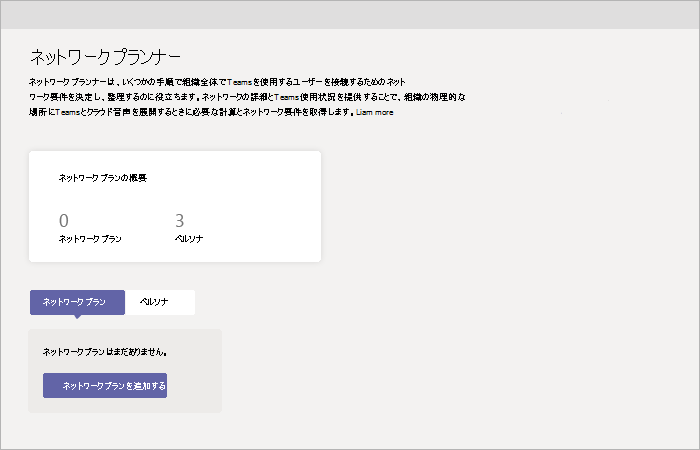

# Microsoft Teams で Network Planner を使用するUse the Network Planner for Microsoft Teams

Network Planner は、Teams 管理センターで利用できる新しいツールです。Network Planner is a new tool that is available in the Teams admin center. これは、**プランナー**  >  **Network Planner** でアクセスできます。It can be found by going to **Planner** > **Network planner**. ほんの少しの手順で、Network Planner では組織全体で Microsoft Teams ユーザーに接続するためのネットワーク要件を決定し、整理できます。In just a few steps, the Network Planner can help you determine and organize network requirements for connecting Microsoft Teams users across your organization. ネットワークの詳細と Teams の使用状況を提示すると、Network Planner は、組織の物理的な場所で Teams とクラウドの音声を展開するためのネットワーク要件を計算します。When you provide your network details and Teams usage, the Network Planner calculates your network requirements for deploying Teams and cloud voice across your organization's physical locations.

Network Planner では次のことができます。Network Planner allows you to:

- サイトと Microsoft 推奨のペルソナ (オフィス ワーカー、リモート ワーカー、Teams ルーム システム) を使用して組織の表現を作成します。Create representations of your organization using sites and Microsoft recommended personas (office workers, remote workers, and Teams room system).

    > [!NOTE]
    > 推奨されるペルソナは、Teams の最適な使用シナリオと一般的な使用パターンに基づいて開発されました。The recommended personas were developed based on data from Teams best use scenarios and typical usage patterns. ただし、推奨される3つのペルソナに加えて、最大3つのカスタム ペルソナを作成できます。However, you can create up to three custom personas in addition to the three recommended personas.

- Teams の使用状況の帯域幅要件に関するレポートを作成し計算します。Generate reports and calculate bandwidth requirements for Teams usage.

Network Planner を使用するには、グローバル管理者、Teams サービス管理者、または Teams 通信管理者である必要があります。To use Network Planner, you must be a Global Administrator, Teams Service Administrator, or Teams Communications Administrator.

## カスタム ペルソナを作成するCreate a custom persona

カスタム レポートを作成するには、次の手順に従います。Follow these steps to create a custom persona:

1. Microsoft Teams 管理センターの Network Planner にアクセスします。Go to the Network Planner in the Microsoft Teams admin center.

2. [**ペルソナ**] タブで、[**+ カスタム ペルソナ**] をクリックします。On the **Personas** tab, click **+ Custom persona**. 

3. **新しいカスタム ペルソナ** ウィンドウで、新しいペルソナの名前と説明を入力します。In the **New custom persona** pane, add a name and description for the new persona.

4. このペルソナが組織内で使用するアクセス権を選択します。Select the permissions that this persona will use within the organization.

5. [**保存**] をクリックします。Click **Save**.

## プランを作成するBuild your plan

ネットワーク プランを作成するには、次の手順を実行します。Follow these steps to begin building your network plan:

1. Microsoft Teams 管理センターの Network Planner にアクセスします。Go to the Network Planner in the Microsoft Teams admin center.

2. [**ネットワーク プラン**] タブで、[**ネットワーク プランの追加**] をクリックします。On the **Network Plan** tab, click **Add a network plan**.

3. 新しいネットワーク プランの名前と説明を入力してください。Enter a name and description for your network plan. 使用可能なプランのリストにネットワーク プランが表示されます。The network plan will appear in the list of available plans.

4. プラン名をクリックして新しいプランを選択します。Click the plan name to select the new plan.

5. 組織のネットワーク セットアップを作成するには、サイトを追加します。Add sites to create a representation of your organization's network setup.

    組織のネットワークによっては、ビル、オフィスの位置、またその他を表現するのにサイトを使用したい場合があるでしょう。Depending on your organization's network, you may want to use sites to represent a building, an office location, or something else. サイトは WAN によって接続され、インターネットや PSTN の接続が共有できるようになっている場合があります。Sites might be connected by a WAN to allow sharing of internet and/or PSTN connections. 最良の結果を得るには、インターネットまたは PSTN にリモート接続するサイトを作成する前に、ローカル接続を使用してサイトを作成します。For best results, create sites with local connections before you create sites that remotely connect to the internet or PSTN.

    サイトを作成するTo create a site:

    1. サイトの名前と説明を追加します。Add a name and description for your site.

    2. [**ネットワーク設定**] の下に、そのサイトのネットワーク ユーザー数を追加します (必須)。Under **Network settings**, add the number of network users at that site (required).

    3. ネットワークの詳細を追加します。WAN 対応、WAN 容量、インターネット エグレス (**ローカル** または **リモート**)、PSTN エグレス (なし、ローカル、またはリモート)。Add network details: WAN-enabled, WAN capacity, internet egress (**Local** or **Remote**), and PSTN egress (none, local, or remote).

      > [!NOTE]
      > レポートを生成するときに、特定の帯域幅の推奨値を表示するには、WAN およびインターネットの容量を追加する必要があります。You must add WAN and internet capacity numbers to see specific bandwidth recommendations when you generate a report.

    4. [**保存**] をクリックします。Click **Save**.

## レポートを作成するCreate a report

すべてのサイトを追加したら、次のようにレポートを作成できます。After you add all sites, you can create a report, as follows.

1. [**レポート**] タブで、[**レポートを開始**] をクリックします。On the **Reports** tab, click **Start a report**.

2. 作成する各サイトについて、使用可能なペルソナにユーザー数を分配します。For each site you create, distribute the number of users across the available personas. Microsoft が推奨するペルソナを使用している場合、この数字は自動的に分配されます (オフィス ワーカーが 80% で、リモートワーカーが 20%)。If you use the Microsoft recommended personas, the number will be distributed automatically (80% office worker and 20% remote worker).

3. 分配が完了したら、**レポートの作成**をクリックします。After you complete the distribution, click **Generate report**.

    生成されたレポートには、次のようなさまざまなビューの帯域幅要件が表示されるので、出力を正確に理解できます。The generated report will show the bandwidth requirements in several different views so that you can clearly understand the output:
    - 個々の計算を含むテーブルには、許可されている各アクティビティの帯域幅要件が表示されます。A table with individual calculations will display bandwidth requirements for each permitted activity.
    - 追加のビューには、推奨事項による全体的な帯域幅ニーズが表示されます。An additional view will show the overall bandwidth needs with recommendations.

4. [**保存**] をクリックします。Click **Save**. レポートはレポート リストで、後で表示できます。Your report will be available on the reports list for later viewing.

## シナリオ例Example scenario

Network Planner を使用してネットワーク プランをセットアップし、これらの手順でレポートを生成する方法の例を見るには、[Network Planner の使用方法に関する PowerPoint デック](https://github.com/MicrosoftDocs/OfficeDocs-SkypeForBusiness/blob/live/Teams/downloads/network-planner-how-to.pptx?raw=true)　(英語のみ) をダウンロードしてください。For an example of how to use the Network Planner to set up a network plan and generate a report using these steps, download the [Network Planner How-To PowerPoint deck](https://github.com/MicrosoftDocs/OfficeDocs-SkypeForBusiness/blob/live/Teams/downloads/network-planner-how-to.pptx?raw=true) (English only).
