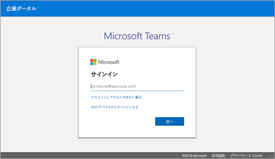
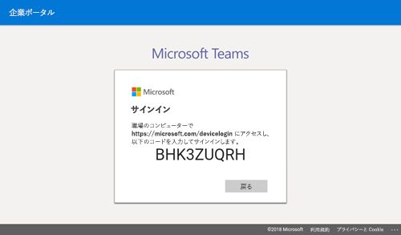
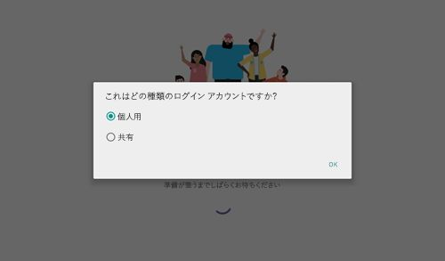
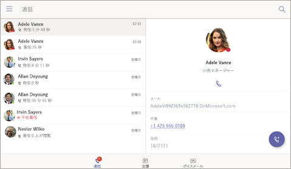
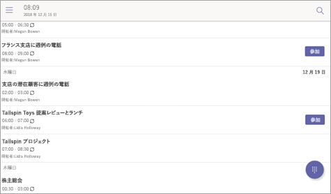
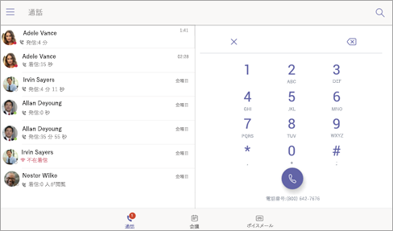
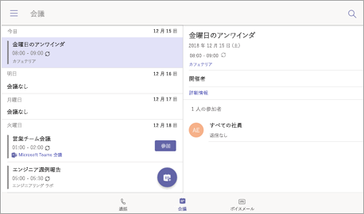
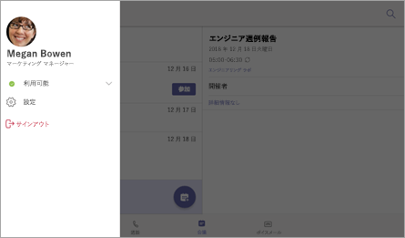
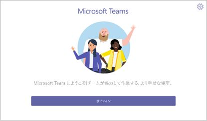

# Microsoft Teams 用の電話機Phones for Microsoft Teams

マイクロソフトのチームでは、従来の電話の経験を必要とするユーザーのデスクの電話のポートフォリオをサポートしています。Microsoft Teams supports a portfolio of desk phones for users who require a traditional phone experience. この資料では、マイクロソフトのチームとチームの Microsoft 認定電話でサポートされる機能に認定されている電話の一覧について説明します。This article covers the list of phones that are certified for Microsoft Teams and the features supported in the phones certified for Microsoft Teams. チームが認定済みデバイスの最新の最新の状態情報を取得するには、[チームのマーケットプ レース](http://office.com/teamsdevices)に移動します。To get the latest and up-to-date information on Teams certified devices, go to [Teams Marketplace](http://office.com/teamsdevices).

## IP 電話の認定チームTeams certified IP phones 

電話で、高品質で信頼性の高いマイクロソフト チームの経験を提供するには提携、Yealink、Crestron、ポリコムとを開発し、デスクの電話や会議室のオーディオ デバイスの幅広いポートフォリオを認定するのには積極的に操作します。To deliver a high-quality and reliable Microsoft Teams experience on phones, we are partnering and actively working with Yealink, Crestron, Polycom, and Audiocodes to develop and certify a wide portfolio of desk phones and conference room audio devices. 現在サポートされているデバイスの[IP 電話を現在認定](/SfbPartnerCertification/certification/teams-ip-phones.md#currently-certified-ip-phones?toc=/MicrosoftTeams/toc.json&bc=/microsoftteams/breadcrumb/toc.json)を参照してください。See [Currently certified IP Phones](/SfbPartnerCertification/certification/teams-ip-phones.md#currently-certified-ip-phones?toc=/MicrosoftTeams/toc.json&bc=/microsoftteams/breadcrumb/toc.json) for current supported devices.

## マイクロソフトのチームは電話の機能セットMicrosoft Teams phones feature set

IP 電話の認定チームでサポートされる機能の高度な設定は、次の表に使用できます。A high-level set of features supported in Teams certified IP phones is available in the following table.

|機能Features |デスクの電話 (個人用モード)Desk Phone (Personal Mode) |会議室電話 (共有モード)Conference Room Phone (Shared Mode)|
|---------|---------|---------|
|**認証****Authentication** | |  |
|ユーザー資格情報でのサイン インSign in with user credentials |  可Yes | はいYes|
|PC とスマート フォンを使用してサインインします。Sign in using PC/Smartphone  | 可Yes |ありYes|
|先進認証Modern Authentication | 可Yes |はいYes |
|電話のロック/ロック解除Phone lock/unlock | はいYes |なしNo |
|**通話****Calling** |  |  |
|P2P の着信または発信の呼び出しIncoming/Outgoing P2P calls | 可Yes  |はいYes |
|呼び出しで UI (ミュート、保留/再開、転送、通話の終了) を使用してコントロールIn-call controls via UI (Mute, hold/resume, transfer, end call)| 可Yes  |はいYes |
|PSTN の呼び出しPSTN calls| 可Yes  |はいYes |
|ビジュアル ボイスメールVisual Voicemail | はいYes | なしNo |
|911 のサポート911 support  | 可Yes  |はいYes |
|**カレンダーとプレゼンス****Calendar and Presence**|   | |
|カレンダーへのアクセスおよび会議の詳細Calendar Access and Meeting Details|可Yes |はいYes|
|プレゼンス統合Presence Integration |ありYes|はいYes|
|Exchange 予定表の統合Exchange Calendar Integration |可Yes|はいYes|
|連絡先の写真の統合Contact Picture Integration  |可Yes|はいYes|
|企業ディレクトリのアクセスCorporate Directory Access | 可Yes|はいYes|
|**会議****Meetings**|   ||
|会議の 1 回のクリックの結合One-click Join for Meetings  | 可Yes  |はいYes |
|Skype をビジネス ・ ミーティングに参加します。Join Skype for Business meetings | 可Yes  | はいYes|
|会議電話のコントロール (ミュート/ミュート解除、保留/再開、ハングアップ、参加者の追加と削除)Meeting Call controls (Mute/unmute, hold/resume, hang up, add/remove participant)|可Yes|はいYes|
|会議の詳細Meeting Details|はいYes|なしNo|

皆様のご利用の電話にチーム感を高めるための機能を継続的に追加します。We are working to continuously add features to help our users enhance their Teams experience on phones. 下のスクリーン ショットでは、現在サポートの経験のいくつかについて説明します。The screen shots below illustrate some of the experiences we support today.

## サインイン処理Sign-in experience

チームで [サインイン] ボタンをクリックすると、企業ポータルを使用してサインインが開始されます。When a user clicks the sign-in button in Teams, sign-in is started via the Company Portal. ユーザーには、携帯電話のユーザーの資格情報を入力して、または別のデバイスからサインインすることによりにサインインするオプションがあります。The user has the option to sign in by entering user credentials on the phone or by choosing to sign in from another device. 別のデバイスからサインインすると、ユーザーは、PC やスマート フォンからの認証を完了できます。If the user chooses to sign in from another device, the user can complete authentication from their PC or smartphone.

**ユーザーのサインイン資格情報を持つ****User sign-in with credentials**

**ユーザーの PC とスマート フォンを使用して****User sign-in via PC/smartphone**

## 個人用または共有モードPersonal/shared mode

正しくサインインした後、ユーザーは個人使用または共有の会議室で、デバイスを使用するかを選択できます。After successful sign-in, the user can choose whether the device will be used for personal use or in a shared conference room.

チームの電話の経験は、ユーザーの選択に基づいて最適化されています。The Teams phone experience is optimized based on the user's selection.

**パーソナル モード****Personal mode**

**共有モード****Shared mode**

## 経験を呼び出すCalling experience

マイクロソフト チームのユーザーは、受話器または呼び出し元の画面でダイヤル パッドを起動するのには [スピーカー] ボタンを押します。The Microsoft Teams user can lift the handset or press the speaker button to launch the dial pad on the calling screen. または、ユーザー ボタンを使用、ハードウェア (該当する場合)、番号をダイヤルします。Alternatively, the user can use the hardware buttons (if available) to dial out a number.

**パッドを画面に表示されるダイヤルします。****On-screen dial pad**

**通話画面****Calling screen**

## ミーティングMeeting experience

マイクロソフトのチームのユーザーは、その会議を表示し、**参加**] ボタンを使用して、チームのミーティングに参加する会議] タブに移動できます。The Microsoft Teams user can navigate to the meetings tab to view their meetings and use the **Join** button to join their Teams meetings.

**予定表ビュー****Calendar view**

**会議の結合の表示****Meeting join view**

## ボイスメールVoicemail

[**ボイス メール**] タブに移動するとき、マイクロソフトのチームのユーザーは、ボイス メールにアクセスできます。The Microsoft Teams user can access their voicemail when they navigate to the **Voicemail** tab.

![[ボイス メール] タブ](media/voicemail-tab.png)

## ユーザーのサインアウトUser sign-out

チーム電話ユーザーは、一番上の左側のメニューから**サインアウト**オプションを選択してサイン アウトする選択できます。The Teams phone user can choose to sign out by selecting the **Sign Out** option from the top left menu.

## モバイル デバイスのファームウェアのバージョンを検索します。Finding the Firmware version on a mobile device

最小のファームウェアのバージョンは、右上隅で、[**設定**] アイコンを選択して、**後**でチームのサインイン ページで確認できます。The minimum firmware version can be checked on the Teams sign-in page by choosing the **Settings** icon in the top-right corner and then clicking **About**.

**チーム サインイン ページ****Teams sign-in page**

**設定] ページ****Settings page**

![チームの設定] ページ](media/teams-settings-page.jpg)

## 必要なライセンスRequired Licenses

[Office 365 サブスクリプション](Office-365-licensing.md)の一部として、マイクロソフトのチームのライセンスを購入できます。Microsoft Teams licenses can be purchased as part of their [Office 365 subscriptions](Office-365-licensing.md). 電話でマイクロソフトのチームを使用するため、必要なライセンスの詳細については、利用可能な[電話システムのライセンス](https://products.office.com/en-us/microsoft-teams/voice-calling)を参照してください。To learn more about the required licenses for using Microsoft Teams on phones, see available [phone system licenses](https://products.office.com/en-us/microsoft-teams/voice-calling).

チームを取得する方法については、チェック アウト[マイクロソフトのチームへのアクセスを取得する方法ですか?](https://support.office.com/article/fc7f1634-abd3-4f26-a597-9df16e4ca65b)For more information about getting Teams, check out [How do I get access to Microsoft Teams?](https://support.office.com/article/fc7f1634-abd3-4f26-a597-9df16e4ca65b)

## 関連項目See also

[チームの市場Teams Marketplace](http://office.com/teamsdevices)

[IP 電話IP Phones](/skypeforbusiness/certification/devices-ip-phones?toc=/MicrosoftTeams/toc.json&bc=/microsoftteams/breadcrumb/toc.json)