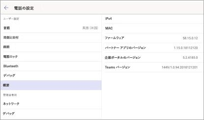

# Microsoft Teams 用の電話機

Microsoft Teams では、従来の電話機エクスペリエンスを必要とするユーザー向けに卓上電話機製品をサポートしています。 この記事では、Microsoft Teams 用に認定されている電話機と、それらの電話機でサポートされている機能のリストを取り上げています。 Teams 認定デバイスの最新情報を取得するには、[Teams Marketplace](https://office.com/teamsdevices) にアクセスしてください。

## Teams 認定 IP 電話機

電話機において高品質で信頼できる Microsoft Teams エクスペリエンスを提供するため、Yealink、Crestron、Polycom、Audiocodes と Microsoft はパートナー関係を締結し、幅広い卓上電話機と会議室用オーディオ デバイスの製品ラインを開発して認定するよう積極的に取り組んでいます。 現在サポートしているデバイスについては、「[現在認定されている IP 電話](teams-ip-phones.md#currently-certified-ip-phones)」を参照してください。

## Microsoft Teams 電話機の機能セット

次の表では、Teams 認定 IP 電話でサポートされている機能セットの概要をまとめています。

|機能 |卓上電話機 (個人モード) |会議室用電話機 (共有モード)|
|---------|---------|---------|
|**認証** | |  |
|ユーザー資格情報でのサイン イン |  はい | はい|
|PC/スマートフォンを使用したサインイン  | はい |はい|
|先進認証 | はい |はい |
|電話機のロック/ロック解除 | はい |いいえ |
|**通話** |  |  |
|P2P 通話の送信/受信 | はい  |はい |
|UI による通話中の制御 (通話のミュート、保留/再開、転送、終了)| はい  |はい |
|PSTN 通話| はい  |はい |
|ビジュアル ボイスメール | はい | いいえ |
|911 サポート  | はい  |はい |
|**予定表とプレゼンス**|   | |
|予定表へのアクセスと会議の詳細|はい |はい|
|プレゼンス統合 |はい|はい|
|Exchange の予定表の統合 |はい|はい|
|連絡先の写真の統合  |はい|はい|
|会社のディレクトリ アクセス | はい|はい|
|**会議**|   ||
|会議へのワンクリック参加  | はい  |はい |
|Skype for Business 会議への参加 | はい  | はい|
|会議通話の制御 (ミュート/ミュート解除、保留/再開、通話終了、参加者の追加/削除)|はい|はい|
|会議の詳細|はい|いいえ|

電話機におけるユーザーの Teams エクスペリエンスを強化するため、継続的に機能追加できるように努めています。 次のスクリーンショットでは、現在サポートしているエクスペリエンスの一部を示しています。

## サインイン エクスペリエンス

ユーザーが Teams でサインイン ボタンをクリックすると、企業ポータルでサインインが開始されます。 ユーザーは、電話機でユーザー資格情報を入力してサインインするか、別のデバイスからサインインするよう選択することができます。 別のデバイスからサインインすることを選択する場合、ユーザーは PC またはスマートフォンから認証を完了できます。

**資格情報でのユーザー サインイン**

**PC/スマートフォンによるユーザー サインイン**

## 個人モード/共有モード

サインインが成功したら、ユーザーはデバイスを個人的に使用するか、共有の会議室で使用するかを選択できます。

Teams 電話機のエクスペリエンスはユーザーの選択に基づいて最適化されます。

**個人モード**

**共有モード**

## 通話エクスペリエンス

Microsoft Teams ユーザーは受話器を持ち上げるか、[スピーカー] ボタンを押して、通話画面のダイヤルパッドを起動できます。 または、(使用可能な場合) ハードウェア ボタンを使用して、番号をダイヤルアウトすることができます。

**画面に表示されるダイヤルパッド**

**通話画面**

## 会議エクスペリエンス

Microsoft Teams ユーザーは [会議] タブに移動すると、自分の会議を表示し、**[参加]** ボタンを使用して Teams 会議に参加できます。

**予定表ビュー**

**会議参加ビュー**

## ボイスメール

Microsoft Teams ユーザーは、**[ボイスメール]** タブに移動すると、ボイスメールにアクセスできます。

![[ボイスメール] タブのスクリーンショット](media/voicemail-tab.png)

## ユーザーのサインアウト

Teams 電話機のユーザーは、左上にあるメニューから **[サインアウト]** オプションを選択すると、サインアウトできます。

## モバイル デバイスでファームウェア バージョンを見つける

最小ファームウェア バージョンは Teams のサインイン ページで、右上隅にある **[設定]** アイコンを選択し、**[バージョン情報]** をクリックすると、確認できます。

**Teams のサインイン ページ**

**設定ページ**

## 必要なライセンス

Microsoft Teams ライセンスは、 [microsoft 365 および Office 365 サブスクリプション](Office-365-licensing.md)の一部として購入できます。 電話で Microsoft Teams を使用するために必要なライセンスの詳細については、利用可能な[電話システムライセンス](https://products.office.com/microsoft-teams/voice-calling)を参照してください。

Teams の入手方法については[Microsoft Teams へのアクセス権を取得するにはどうしたらよいですか?](https://support.office.com/article/fc7f1634-abd3-4f26-a597-9df16e4ca65b)を参照してください。

## 関連項目

[Teams Marketplace](https://office.com/teamsdevices)

[Microsoft Teams 認定 IP 電話](teams-ip-phones.md)
