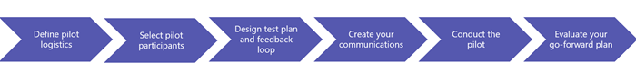

Skype for Business がある環境でのパイロット Microsoft チームPilot Microsoft Teams alongside Skype for Business
============================================

ビジネスと Office 365 のお客様の既存の Skype、組織は既にモダンなワークプ レースの移動は、ユーザーが、クリエイティブなで画期的な機能、および生産性を向上を支援の一部であります。Microsoft のチームをさらには、可能であれば、チーム作業に対応、アプリの統合、およびファイル記憶域のコラボレーション ハブなどの機能を追加した機能を展開します。チームの付加価値と共に向け Skype の現在の機能を表示すると、強力なコミュニケーションとユーザーがどのように機能が一変コラボレーション ソリューションがあります。As an existing Skype for Business and Office 365 customer, your organization is already a part of the modern workplace movement, empowering your users to be more creative, innovative, and productive. Microsoft Teams further expands what’s possible, with added functionality, such as collaboration hubs for teamwork, app integration, and file storage. When you bring the current functionality of Skype for Business together with the value-add of Teams, you have a powerful communication and collaboration solution that can revolutionize how users work.

チームの旅に、今後の推奨事項は、パイロットの結果に基づきます。Skype for Business を活用しながら、これらをお勧めしてみる、組織に接続するすべてのチームが提供することができます。チームと Skype for Business の重複する一部の機能がないためには、ユーザーのパイロットで始まる必要があります。パイロットが小規模の展開を実現する環境での Skype for Business と相互運用性を検証するし、エンドユーザーが両方の製品を実行するいると、混乱を最小限に抑えるの生産性を向上する方法を理解します。サイド バイ サイドします。Your Teams journey, as well as go-forward recommendations, is based on the outcome of your pilot. While you continue to utilize Skype for Business, we encourage you explore all that Teams can offer to your organization. Since there is some overlapping functionality between Teams and Skype for Business, it is important to begin with a user pilot. The pilot is a small-scale deployment that enables you to validate the interoperability with Skype for Business in your environment as well as understand how your endusers can maximize their productivity while minimizing confusion with both products running side-by-side.

このリソースは、現在 skype for Business ユーザー合わせて、ガイダンスやへの旅に着手するためのベスト プラクティスを提供します。Tailored for current Skype for Business customers, this resource provides guidance and best practices to start you on your journey to:

-   操作手順と推奨事項、組織のプロファイルに合わせてカスタマイズできます。Personalize the action steps and recommendations to best meet your organizational profile.

-   ダウンロードして、そのことを確認するメッセージが、エンドユーザーに対処する[パイロット Essentials のリソース](https://go.microsoft.com/fwlink/?linkid=859067)については、コミュニケーションとフィードバックのテンプレートをカスタマイズします。Download and customize the communication and feedback templates found in the [Pilot Essentials Resources](https://go.microsoft.com/fwlink/?linkid=859067) to ensure your message resonates with your endusers.

作業の開始 - Japanese for Get startedGet started
===========

組織の準備状況確認のために設計されており、パイロットは、リソースと拡大、組織全体で使う導入前に必要な手順の現実的な検証です。 最も現実的な結果を得るには、ユーザーのコミュニケーションや共同作業を行う、Business および Microsoft チームの Skype での最適な配置のシナリオを確認パイロット プログラムに似た効果作成する必要があります。Skype for Business とチーム サイド バイ サイドまたはに移行する際のチーム将来の時点で、組織を検討しているかどうか、右方向の組織を特定するパイロットに役立ちます。*では、始めましょう*。Designed to confirm organizational readiness, a pilot is a realistic validation of the resources and procedures needed on a larger scale prior to your organization-wide rollout.  To achieve the most realistic results, the pilot program should mimic how users communicate and collaborate today, verifying the ideal deployment scenario with Skype for Business and Microsoft Teams. Whether your organization is considering running Skype for Business and Teams side-by-side or transitioning to Teams at a future point in time, a pilot can help identify the right path forward for your organization. *Let’s get started!*

## 手順 1: パイロット プログラム手配を定義します。Step One: Define your Pilot Program Logistics

正式なパイロット必要がある転送、対象のパスを定義しており、プロジェクト チーム、[スマート](https://wikipedia.org/wiki/SMART_criteria)目標、設定されたタイムライン、関節テスト プランでは、フィードバック メカニズムします。パイロット プログラムの手配、アウトラインのために、このような質問に対処する時間がかかる場合。A formal pilot should define your targeted path forward and include a project team, [SMART](https://wikipedia.org/wiki/SMART_criteria) goals, a set timeline, an articulated test plan, and feedback mechanisms. Take time to address these questions to help outline your pilot program logistics:

-   パイロットのプロジェクト関係者自分はだれですか。Who are the project stakeholders for your pilot?

    -   関係者には、パイロット成功に対する責任の担当者が含まれます。例をいくつか示します。Stakeholders should include representatives with accountability for pilot success. Here are a few examples:

        -   **エグゼクティブ スポンサー:**組織内のグループ作業とコミュニケーションのソリューションの導入を成功の全体的な責任します。**Executive Sponsor:** Overall accountability for collaboration and communications solutions’ success in your organization.

        -   **プロジェクト (パイロット) 潜在顧客:**パイロット、関係者の調整のための手配を管理します。**Project (Pilot) Lead:** Manages logistics for the pilot, coordinating stakeholders.

        -   **IT Pro:**ネットワークの準備状況をチーム パイロットようにします。**IT Pro:** Ensures network readiness for your Teams pilot.

        -   **潜在顧客のサポート:**チームのヘルプデスクを準備する責任を負います。**Support Lead:** Accountable for readying the helpdesk for Teams.

        -   **マーケティング/通信潜在顧客:**すべての周知とトレーニングの通信を担当します。**Marketing/Communications Lead:** Responsible for all awareness and training communications.

<!-- -->

-   チームと Skype for Business for business シナリオとはWhat are your business scenarios for Teams and Skype for Business?

    -   利用状況と使用の場合は、通知のテスト プランに役立ちます。Skype for Business の現在の[利用状況レポート](https://support.office.com/article/Active-user-in-Office-365-usage-reports-093A6D0D-890B-489E-9F46-B15687D3FE4F)を確認する。 または、現在の共同作業とコミュニケーションのシナリオを理解するために、上位 Skype for Business ユーザーにフォーカス グループを実行します。Usage and use cases will help inform your test plan. Review your current [usage reports](https://support.office.com/article/Active-user-in-Office-365-usage-reports-093A6D0D-890B-489E-9F46-B15687D3FE4F) for Skype for Business and/or conduct a focus group with your top Skype for Business users to better understand their current collaboration and communication scenarios.

-   チームのロードマップに慣れてますか。Are you familiar with the Teams Roadmap?

    -   詳細については、チーム[ロードマップ](https://go.microsoft.com/fwlink/?linkid=859047)スコープ、パイロットのタイミングを通知するために時間がかかります。時間、パイロット環境や機能/シナリオの適用、組織内の現実的な入力規則を確実に適切にテストします。Take time to understand the Teams [roadmap](https://go.microsoft.com/fwlink/?linkid=859047), to help inform your scope and timing for your pilot. Time your pilot and feature/scenario testing accordingly to ensure realistic validation of applicability within your organization.

-   目標とチーム パイロットの成功の抽出条件とはWhat are your goals and success criteria for your Teams pilot?

    -   明確な目標を設定すると、成功の評価し、移行、最適なパスを定義するメカニズムを提供します。[パイロット Essentials のリソース](https://go.microsoft.com/fwlink/?linkid=859067)には、サンプルの目標と成功基準が提供されます。Setting clear goals will provide a mechanism from which to measure success and define your best path forward. Sample goals and success criteria are provided in the [Pilot Essentials Resources](https://go.microsoft.com/fwlink/?linkid=859067).

-   パイロット タイムラインとは何ですか。What is your pilot timeline?

    -   クリア開始と終了日の最初の勢いを維持し、影響を評価する時間を許可するパイロットを定義します。最小値 30 日間 pilot」をお勧めします。小規模および反復処理するその他のワークロード/機能または他のユーザー、結果を評価すると、パイロットを調整するのには時間を作成するかどうかに該当する情報: パイロットに追加します。ロードマップあたり新しいチームの機能がリリースされると、後続のパイロットを実行する選択することがあります。Define a clear start and end-date for your pilot to maintain momentum and allow time to assess impact. A minimum 30-day pilot is recommended. Start small and add to your pilot as appropriate – whether additional workloads/features or additional users, making time to assess results and adjust your pilot as you iterate. You may even opt to run subsequent pilots as new Teams’ features are released per the roadmap.

> [!TIP]
> 最適な結果を得るのための運用環境では、パイロットを実施する必要があります。すべての技術的前提条件がためには、パイロット ユーザーが新しいチームとチャネルを作成する機能など、パイロットを開始する前に完了したことを確認します。Your pilot should be conducted in your production environment for optimal results. Confirm all technical prerequisites are completed prior to beginning your pilot such as ensuring your pilot users have the ability to create new teams and channels.

<table>
<thead>
<tr class="header">
<td align="left">

</td>
<td align="left"><strong>次の操作:</strong><strong>Next Actions:</strong><ul><li>パイロット プログラム チームを参加します。Enlist your pilot program team</li><li>ビジネス シナリオとパイロットの一部としては、テストの機能Articulate the business scenarios and features you will test as part of your pilot</li><li>成功の評価基準と目標を仕上げるFinalize your success criteria and goals</li><li>パイロット タイムラインを確立します。Establish your pilot timeline</li></ul></td>
</tr>
</thead>
<tbody>
</tbody>
</table>

## 手順 2: パイロット、参加者を選択します。Step Two: Select your Pilot Participants

パイロット計画の最も重要なタスクの 1 つは、慎重参加者選択です。理想的なのパイロット グループには、機能セットのシナリオが組織の要件を検証するために設計されており、意図したとおりのすべての利用状況のユーザーが使用して担当者が含まれています。 (該当する場合)、さまざまな役割 (実行の管理、管理、プロジェクト マネージャー、会議のパワー ユーザー) は、組織、異なる部門/部署、複数の領域内からの担当者が含まれます。パイロットのキーの相手に拡張する必要がある IT、トレーニング、ヘルプデスクします。 これにより、プロジェクト管理のリソースの最適化を完全に十分な検証します。One of the most important tasks of pilot planning is thoughtful participant selection. An ideal pilot group includes representative users of all usage scenarios designed to validate the organization's requirements and intended use of feature sets.  This includes representatives from a variety of roles within your organization (exec admin, management, project manager, conferencing power users), different departments/business units, multiple regions (if applicable). The pilot should extend to key people in IT, training and helpdesk.  This allows a thorough validation while fully optimizing project management resources.

最適な入力規則、外観が約 2 ~ 5%、ユーザー、または最低 50 人のユーザーを追加するのには、組織のほとんどの代表者方がします。パイロット タイムライン、によって small を起動し、時間経過パイロット ユーザーを追加] を展開することも可能性があります。For optimal validation, look to include approximately 2-5% of your user base, or a minimum of 50 users, whichever is most representative of your organization. Depending on your pilot timeline, you may opt to start small and expand to additional pilot users over time.

> [!TIP]
> チームを選択すると、グループの参加者がパイロット、場合は、Business とチームのチーム作業に対応ハブ機能メリットがあるユーザー/グループの Skype の両方高採用を含めることを確認します。パイロット ユーザーの選択と併せて、テスト プラン現実的なユース ケースの現在のチーム プロジェクト間ワーク ストリームを使用してください。When selecting your Teams pilot group participants, be sure to include both high-adopters of Skype for Business as well as users/groups who would benefit from the teamwork hub capabilities of Teams. Consider using a current cross-team project workstream for pilot user selection as well as a realistic use case for your test plan.

<table>
<thead>
<tr class="header">
<td align="left">

</td>
<td align="left"><strong>に次の動作:</strong>自分のパイロット テスト グループを特定します。<strong>Next Action:</strong> Identify your pilot test group(s).</td>
</tr>
</thead>
<tbody>
</tbody>
</table>

## 手順 3: テスト計画、アンケートをデザインします。Step Three: Design your Test Plan and Feedback Survey

成功パイロット エクスペリエンスでは、完了するには、フィードバックと明確に定義されたタスクで、参加者を提供します。グループ タスクを日常的な自分に関連性を示す、ユーザーにプレゼンテーションの実際のシナリオをまとめてします。組織のすべての機能を一度にパイロットが、(パイロットの最初のグループ作業し、会議、[チャットと通話など) の段階的アプローチを活用します。進捗状況を追跡し、結果を評価する場合を開いているフィードバック チャンネルがあることを確認します。定義済みのアンケートを取得し、結果を評価する簡単な方法は、し、テスト計画のシナリオと機能を設計すます。A successful pilot experience provides your participants with clearly defined tasks to complete, along with a feedback loop. Group tasks together to present real-world scenarios to your users, demonstrating relevancy to their daily activities. Your organization may opt to pilot all functionality at once, or leverage a gradual approach (for example, first pilot collaboration, then meetings, then chat and calling). Ensure you have an open feedback channel to track progress and measure outcomes. A pre-defined survey is an easy way to capture and assess pilot results and should be designed based on the scenarios and features in your test plan.

<table>
<thead>
<tr class="header">
<td align="left">

</td>
<td align="left"><strong>に次の動作:</strong>ユース ケースと機能をテストに基づいて、<a href="https://go.microsoft.com/fwlink/?linkid=859067">パイロット Essentials のリソース</a>については、サンプル テスト プランとフィードバック アンケートを調整します。<strong>Next Action:</strong> Tailor the sample test plan and feedback survey found in the <a href="https://go.microsoft.com/fwlink/?linkid=859067">Pilot Essentials Resources</a> based on the use cases and features you will be testing.</td>
</tr>
</thead>
<tbody>
</tbody>
</table>

## 手順 4: 通信を作成します。Step Four: Create your Communications

教育のメッセージを入力と、それらの期待されるだけでなく、パイロット参加者は、パイロットの成功に重要です。ドライブのいようと最大値への参加するエンドユーザー値が、パイロットの参加者と通信するときにメッセージを含めることを確認します。さらに、必ず、通信は、トレーニングとサポートへのリンクを含めるパイロットを操作するときに、ユーザーでその他の情報にアクセスできます。Educating your pilot participants on what is happening, when and why, as well as what is expected of them, is crucial to the success of your pilot. To drive excitement and maximum participation, be sure to include end-user value messaging when communicating with your pilot participants. In addition, be sure your communications include links to training and support where users can get additional information as they progress through the pilot.

<table>
<thead>
<tr class="header">
<td align="left">

</td>
<td align="left"><strong>に次の動作:</strong>ユース ケースと機能をテストに基づいて、テンプレート<a href="https://go.microsoft.com/fwlink/?linkid=859067">の基礎知識リソースの「Pilot」</a>を参照するサンプル メールをカスタマイズします。<strong>Next Action:</strong> Customize the sample email templates found in the <a href="https://go.microsoft.com/fwlink/?linkid=859067">Pilot Essentials Resources</a> based on the use cases and features you will be testing.</td>
</tr>
</thead>
<tbody>
</tbody>
</table>

## 手順 5: パイロットを実施します。Step Five: Conduct your Pilot 

インプレース手配すべての準備が整いましたパイロットを開始します。パイロットを行うには、正常な参加者からのフィードバックの収集とヘルプ デスクのチケット チームに関連した質問の確認は、ネットワーク/使用状況の監視、ネットワークと品質を確認するパイロット ユーザーへの通信が含まれます。With all the logistics in place, you are now ready to begin your pilot. Conducting your pilot includes communicating to your pilot users, monitoring your network/usage to ensure your network and quality remains healthy, gathering feedback from participants, and reviewing help desk tickets for questions related to Teams.

> [!IMPORTANT]
> チームが有効で、既定では、「pilot」を開始する前に、チームが有効なすべてのパイロット ユーザーを確認していますください。この方法については、 [Office 365 の組織で Microsoft チームを有効にする機能](enable-features-office-365.md)を説明します。Teams is turned on by default, but before you begin your pilot, check to be sure all your pilot users are enabled for Teams. For help doing this, read [Enable Microsoft Teams features in your Office 365 organization](enable-features-office-365.md).
> 

30 日間パイロットの候補のタイムラインを示します。Here's a suggested timeline for a 30-day pilot:

-   テスト導入期間の開始前の 1 週間オフ: 最初の通信をパイロット ユーザーに送信します。One week prior to Pilot kick off: Send initial communication to pilot users

-   1 日目: キックオフ コミュニケーションをパイロット ユーザーに送信します。Day 1: Send kick-off communication to pilot users

-   7 日目: 毎週のプロジェクト チーム チェック ポイント (パイロット プロジェクト チームと校閲ユーザーからのフィードバック、利用状況のデータ ネットワーク データとヘルプ デスクのチケットで会議パイロットがスムーズに実行されていることを確認します。必要に応じて調整を確認します)Day 7: Weekly project team check-point (Meet with your pilot project team and review user feedback, usage data, network data and help desk tickets to ensure your pilot is running smoothly. Make any adjustments as needed)

-   14 日目: パイロット ユーザー、毎週プロジェクト チーム チェック ポイントに中間点の通信を送信します。Day 14: Send mid-point communication to your pilot users, weekly project team check-point

-   プロジェクト チーム チェック ポイント毎週の 21 日目。Day 21: Weekly project team check-point

-   [エンタープライズ日付 30 日目: 最終的なコミュニケーションをパイロット ユーザーに送信します。Day 30: Send final communication to your pilot users

<table>
<thead>
<tr class="header">
<td align="left">

</td>
<td>
<strong>に次の動作:</strong>パイロット タイムラインに基づいてタイムラインの操作をカスタマイズします。<strong>Next Action:</strong> Tailor the timeline actions based on your pilot timeline.
</td>
</tr>
</thead>
<tbody>
</tbody>
</table>

## 手順 6: な学習項目を評価し、今後の計画の評価Step Six: Assess Learnings and Evaluate Go-Forward Plan

パイロットが完了したら、すべてのフィードバック アンケート、最終的なネットワークの統計情報を収集し、サポート チケットの今後のプランの決定、目標に対する分析に時間です。Once your pilot is complete, it’s time to gather all feedback surveys, final network stats and support tickets for analysis against your goals and determination of your go-forward plan.

結果に基づきは次のいくつかの推奨されるパスが、Skype for Business からチームへの旅を続ける場合、組織がかかる場合があります。Based on your outcomes, here are a few recommended paths your organization may take as you continue your journey from Skype for Business to Teams:

<table>
<thead>
<tr class="header">
<th align="left">前方の推奨事項を移動します。Go Forward Recommendations</th>
<th align="left"></th>
</tr>
</thead>
<tbody>
<tr class="odd">
<td align="left"><strong>IF</strong>パイロットの結果を示す<strong>IF</strong> your pilot results indicate</td>
<td align="left"><strong>[</strong>検討します。<strong>THEN</strong> you might consider</td>
</tr>
<tr class="even">
<td align="left"><ul><li>80% 以上同意チームを簡単に Skype for Business がある環境で利用できますか80% or higher agree that Teams can be easily utilized alongside Skype for Business</li>
 (と)-and-  
<li>ケースとシナリオを使用してチームが Skype for Business 現在に基づいてを置き換えることができます 80% 契約書未満Less than 80% user agreement that Teams can replace Skype for Business based on current use cases and scenarios</li>
 (と)-and-  
<li>十分なネットワークの正常性Satisfactory network health</li></ul></td>
<td align="left">
チームと Skype for Business サイド バイ サイドの一部またはすべての利用可能なシナリオを展開します。習得させるために、強くお勧めすべて同時に方法を使用せずに、時間経過機能を展開します。Deploying Teams and Skype for Business side-by-side for some/all available scenarios. To facilitate the learning curve, we strongly encourage rolling out features over time, in lieu of an all-at-once approach.

[Skype for Business とチーム サイド バイ サイドの実行](guidance-SkypeforBusiness.md)の詳細を表示します。Learn more about [running Skype for Business and Teams side-by-side](guidance-SkypeforBusiness.md).

新しいサイドバイ サイド インストール経験について、エンドユーザーとの通信を容易にする<a href="https://go.microsoft.com/fwlink/?linkid=859044">ユーザーの準備ができてテンプレート</a>をダウンロードします。Download <a href="https://go.microsoft.com/fwlink/?linkid=859044">user readiness templates</a> to facilitate communication with your end-users about their new side-by-side experience.
</td>
</tr>
<tr class="odd">
<td align="left"><ul><li>80% またはチーム以上のユーザー契約は、Skype for Business の現在のユース ケースのシナリオに基づくを置き換えることができます。80% or higher user agreement that Teams can replace Skype for Business based on current use cases and scenarios</li>
 (と)-and-  
<li>十分なネットワークの正常性Satisfactory network health</li></ul></td>
<td align="left">
展開チームと「Skype for Business - サイド バイ場合ユーザーが可能な場合は、チームと潜在顧客を促進します。さらに、自分のアカウント チームにしたメッセージの送信またはチームに移動する準備が Microsoft のサポートに連絡し、組織があります。Deploying Teams and Skype for Business side-by-side for all scenarios, encouraging users to lead with Teams where feasible. In addition, reach out to your account team or Microsoft Support to let them know your organization may be ready to go to Teams.

[Skype for Business とチーム サイド バイ サイドの実行](guidance-SkypeforBusiness.md)の詳細を表示します。Learn more about [running Skype for Business and Teams side-by-side](guidance-SkypeforBusiness.md).

新しいサイドバイ サイド インストール経験についてユーザーとのコミュニケーションを促進する<a href="https://go.microsoft.com/fwlink/?linkid=859044">ユーザーの準備ができてテンプレート</a>をダウンロードします。Download <a href="https://go.microsoft.com/fwlink/?linkid=859044">user readiness templates</a> to facilitate communication with your users about their new side-by-side experience.
</td>
</tr>
<tr class="even">
<td align="left"><ul><li>80% 以下チームを簡単に Skype for Business がある環境で利用できることに同意します。Less than 80% agree that Teams can be easily utilized alongside Skype for Business</li>
 (と)-and-  
<li>ケースとシナリオを使用してチームが Skype for Business 現在に基づいてを置き換えることができます 80% 契約書未満Less than 80% user agreement that Teams can replace Skype for Business based on current use cases and scenarios</li></ul></td>
<td align="left">チームの最新のグループ作業機能 (たとえば、チーム/チャネル) を使用するときに Skype for Business とコミュニケーション (IM、通話、会議など) を続行します。あたりの新機能がリリースされると、通信機能を確認するチーム パイロットに戻って<a href="https://go.microsoft.com/fwlink/?linkid=859047">ロードマップ</a>。Continuing with Skype for Business for communication (e.g. IM, Meetings, Calling) while utilizing the modern collaboration functionality (e.g., Teams/Channels) of Teams. Revisit a Teams pilot to verify communications functionality as new features are released per <a href="https://go.microsoft.com/fwlink/?linkid=859047">roadmap.</a></td>
</tr>
</tbody>
</table>

> [!NOTE]
> 必ず[エキスパート](https://go.microsoft.com/fwlink/?linkid=859068)を宣伝するために、オンボードの新しいユーザーをチームとパイロット、参加者を活用してください。Be sure to leverage your pilot participants as [Champions](https://go.microsoft.com/fwlink/?linkid=859068) to help evangelize and onboard new users to Teams.

<table>
<thead>
<tr class="header">
<td align="left">

</td>
<td align="left">

<strong>次の操作:</strong><strong>Next Actions:</strong>
<ul><li>な学習、パイロットの項目を分析し、[転送、パスを決定します。Skype for Business とチームを配置する場合は、必ず、開始させるために、[ユーザーの準備ができてテンプレート](https://go.microsoft.com/fwlink/?linkid=859044)を活用してください。Analyze your pilot learnings and determine your path forward. If you opt to deploy Teams alongside Skype for Business, be sure to leverage the [user readiness templates](https://go.microsoft.com/fwlink/?linkid=859044) to help get your started.</li><li>表示して、[チームのロードマップ](https://go.microsoft.com/fwlink/?linkid=859047)のブックマークを設定します。View and bookmark the [Teams roadmap](https://go.microsoft.com/fwlink/?linkid=859047).</li>
<li>パイロット、結果を示すユーザーがチーム、[チームを有効にするサイド バイ サイド組織用](continue-journey.md)に進む準備ができたらです。Once your pilot results indicate users are ready for Teams, [Enable Teams side-by-side for your organization](continue-journey.md).</li></ul></td>
</tr>
</thead>
<tbody>
</tbody>
</table>

