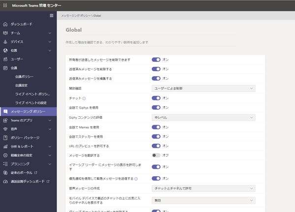
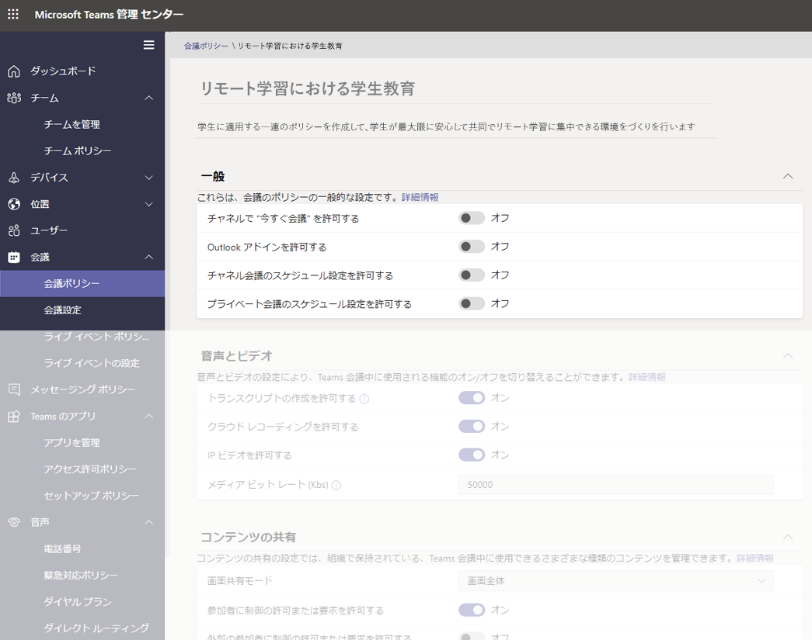
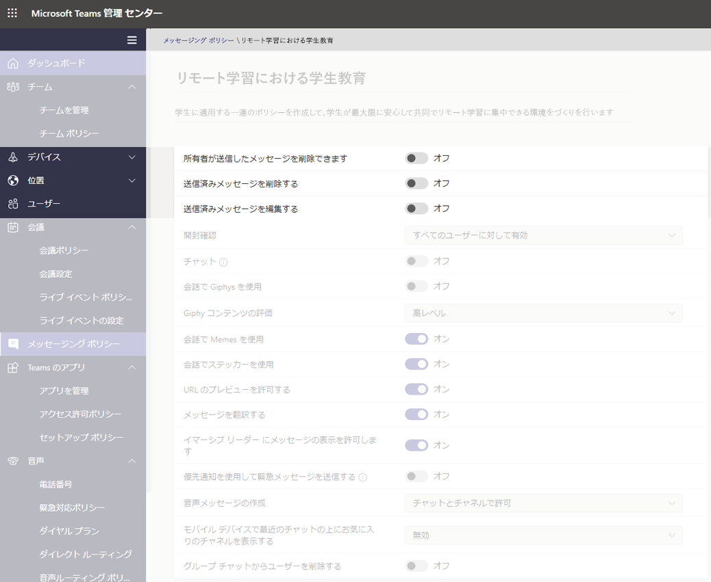
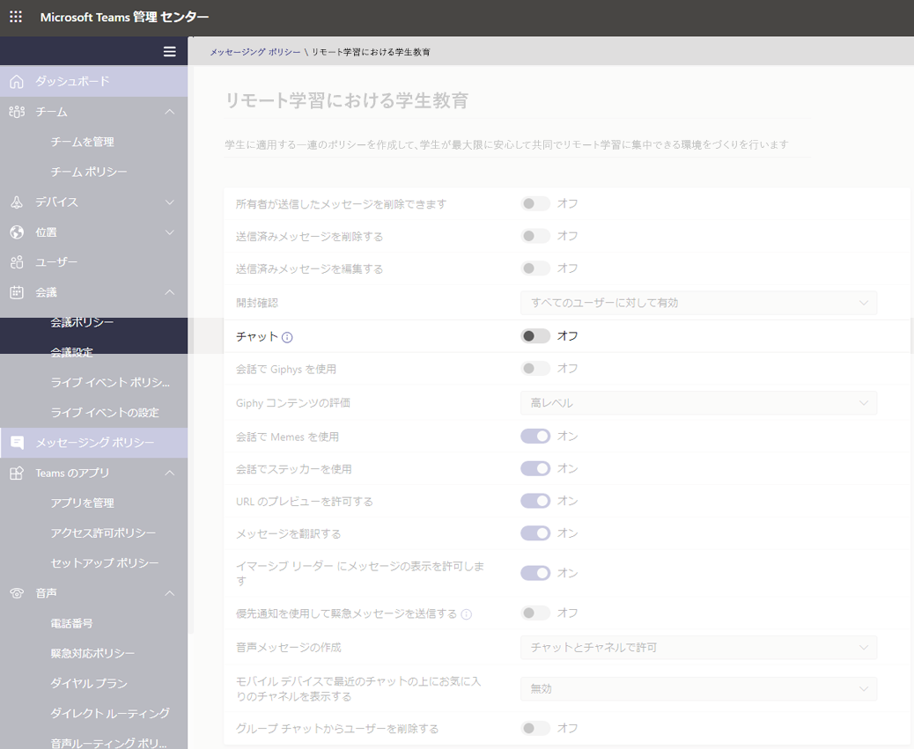
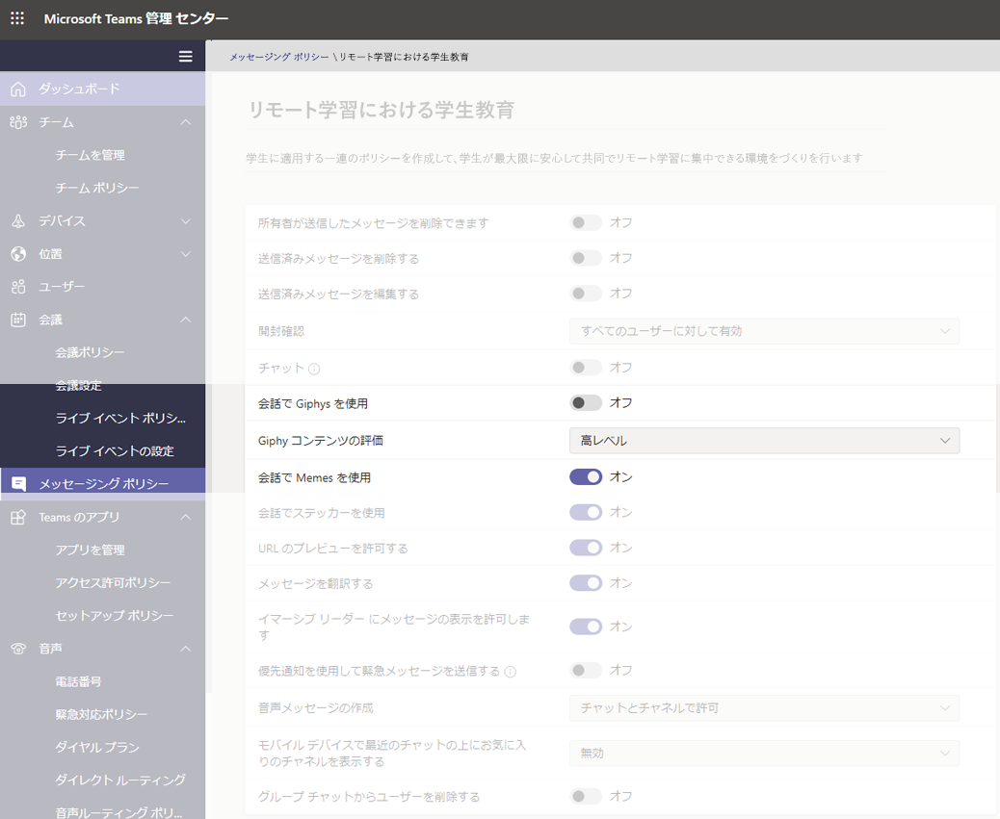
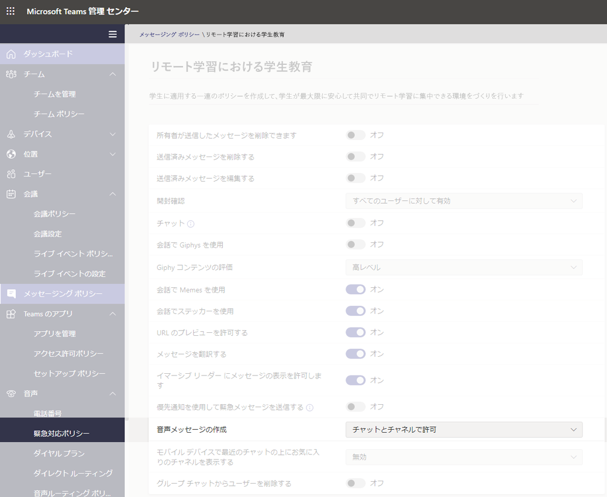
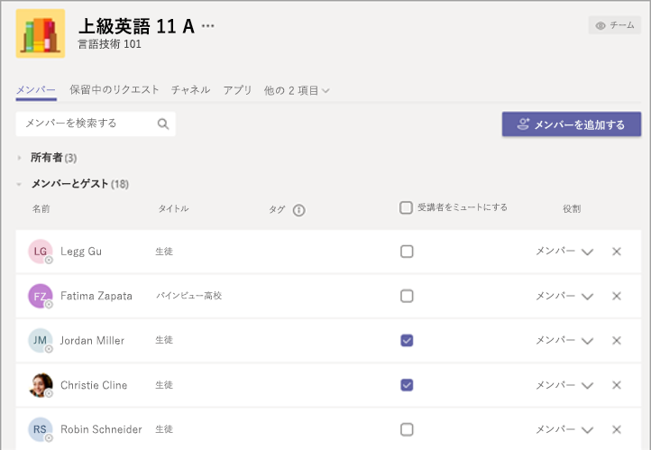

# 境域機関向け Teams ポリシーおよびポリシー パッケージ

> [!NOTE]
> Microsoft Teams のポリシーの大規模な事例については、「[Microsoft Teams でユーザーにポリシーを割り当てる](assign-policies.md)」をご確認ください。

この記事では、Teams 内のユーザーにポリシーを割り当てる複数の方法を説明していることに注意してください。

- 個別のユーザーに手動で割り当てる。
- PowerShell を使用して複数のユーザーに一括で割り当てる。
- 個別のユーザーまたは複数のユーザーにポリシー パッケージを割り当てる。

これらのアプローチの長所と短所は、各教育機関の個別のニーズにより異なります。

## 管理者: Microsoft Teams のポリシー管理の概要

Microsoft Teams の主な機能は、ユーザーが会議やライブイベントに移動したり、チャットしたり、通話を行ったり、アプリを使用したできるようにすることです。 また、適切な Microsoft Teams 管理ポリシーを設定することは、Teams 内の学生に対して安全な学習環境を構築するための重要なステップです。 管理者は、ポリシーを使用して、教育機関のユーザーが利用できる Teams 機能を制御できます。

Microsoft Teams 内のポリシー領域の一覧は次のとおりです。

- 会議
- ライブ イベント
- 通話
- メッセージング
- Teams
- アプリのアクセス許可

:::image type="content" source="media/edu-admin-center-users.png" alt-text="ポリシーが適用されているユーザーのスクリーンショット。":::

管理者の資格情報でサインインすることにより、[Microsoft Teams 管理センター](https://admin.teams.microsoft.com)で、Teams のすべてのポリシーを簡単に管理できます。

### Microsoft Teams ポリシーへのアクセス方法

Teams 管理センターにログインすると、Teams 管理センターの左側のナビゲーションにある [ポリシー] オプションをクリックして、管理する必要がある Teams のあらゆる領域のポリシー設定に移動できます。 メッセージング ポリシーの場所のスクリーンショットが含まれています。

:::image type="content" source="media/edu-messaging-policies.png" alt-text="Teams 管理センター内のメッセージング ポリシーの場所。":::

### ポリシー定義を作成して更新する方法

ユーザーにポリシーを割り当てる前に、Teams を使って、各機能領域のポリシー定義を追加および作成する必要があります。

> [!NOTE]
> 学生と教師には、異なるポリシー定義を設定することをお勧めします。

既定では、すべての新しいユーザー (学生または教師) に各機能領域に対してグローバル (組織全体の既定) ポリシー定義が割り当てられます。 次の手順を実行することをお勧めします。

1. Teams の各機能領域に対してカスタム ポリシー定義を作成し、教師に割り当てます (この手順を実行しないと、教師に独自のポリシーを割り当てるまで、グローバル ポリシーを変更すると、教師を制限することになります)。
1. この新しいポリシー定義に教師を割り当てます。
1. グローバル (組織全体の既定) ポリシー定義を更新し、学生に割り当てます。

ポリシー定義を作成または編集するには、作業するポリシー機能領域 (メッセージング ポリシーなど) に移動します。 新しいカスタム ポリシーの定義を作成する場合は、**[追加]** を選択します (教師用に作成するカスタム ポリシー定義を対象にします)。 それ以外の場合、既存のポリシー定義を変更するには、**[編集]** を選択します (学生用のグローバル ポリシーを更新する場合に実行します)。

:::image type="content" source="media/edu-messaging-policies-add-closeup.png" alt-text="[追加] ボタンを表示した状態での [メッセージング ポリシー] セクションのクローズアップ。":::

ポリシー定義を追加するか編集するかを選択したどうかにかかわらず、このポリシー領域に関連付けられているすべてのポリシー オプションが一覧表示されるビューに移動します。 このリストを使用して、ポリシー定義に設定する値を選択します。

> [!IMPORTANT]
> ページから移動する前に、**[保存]** を必ず選択してください。

### ユーザーにポリシー定義を割り当てる方法

> [!NOTE]
> ポリシー定義を割り当てると、すべてのユーザーとクライアントに反映されるのにしばらく時間がかかる場合があります。 Azure/M365 にユーザー アカウントを初めて作成するとき、教育機関に新しい学生が参加するときに、この操作を行うことが必要となる場合があります。

ポリシー定義を作成または更新した後、[ポリシー] ページの **[ユーザーの管理]** を選択し、希望のユーザーを検索して、ポリシーを割り当てることにより、ユーザーにポリシー定義を割り当てることができます。

![[メッセージング ポリシー] ページの上部の右側にある [ユーザー] パネルを管理します。](media/edu-manage-users-pane.png)

また、[ユーザー] に移動し、ポリシーを更新するユーザーを選択し、[ポリシー] を選択してから [編集] を選択することにより、ユーザーにポリシーを割り当てることができます。 ここから、各機能領域に対してユーザーに割り当てるポリシー定義を選択できます。

> [!IMPORTANT]
> お客様が大規模な教育機関の一員である場合、Microsoft Teams 管理ポータルを使用して各ユーザーのポリシーを設定するのが難しい場合があります。 このような場合は、PowerShell を使用してポリシーを一括で割り当てる方が適切です。 [教育機関の大規模なユーザーにポリシーを割り当てる](batch-policy-assignment-edu.md)方法については、EDU に固有の情報があります。この情報を必要とする場合は、ポリシー パッケージの以下のセクションをご確認ください。これは、ユーザーの大規模グループに対してポリシーや設定を管理するための別な優れた方法です。

![[割り当てられているポリシー] ページの右側にある [ユーザー ポリシーの編集] ウィンドウ。](media/edu-edit-user-policies-pane.png)

### Microsoft Teams のポリシー パッケージ

Teams 内のポリシー パッケージは、上記で説明したように事前に定義されたポリシーおよびポリシー設定を収集し、それらを教育機関内の同様の役割を持つユーザーに割り当てます。 ポリシー パッケージにより、ポリシー管理を簡素化し、合理化し、一貫性を高めることができます。 通常の方法では、各ユーザーにポリシーパッケージを割り当て、そのユーザー グループのニーズに合わせて、各パッケージのポリシーを再定義します。 パッケージの設定を更新すると、そのパッケージに割り当てられているすべてのユーザーが一括更新として変更されます。

一般に、教育機関には、学生の年齢や成熟度によって異なる固有のニーズを持つ多くのユーザーが存在します。 たとえば、教師やスタッフが Microsoft Teams にフルアクセスできるようにする一方で、安全で集中できる学習環境を構築するために、学生に対する Microsoft Teams の機能を制限したい場合があります。 教育機関コミュニティにおける異なるコーホートのニーズに基づいて、ポリシー パッケージを使用して設定を調整できます。

> [!NOTE]
> 詳細については、「[Microsoft Teams でポリシー パッケージを管理する](manage-policy-packages.md)」をご確認ください。1 人のユーザーにパッケージを割り当てる方法、最大 5000 人のユーザーにパッケージを一括で割り当てる方法、各パッケージに関連付けられたポリシーの管理と更新を行う方法を紹介しています。

この記事で前述したポリシー一覧と同様に、ポリシーパッケージでは、次のようなポリシーが事前に定義されています。

- 会議
- ライブ イベント
- 通話
- メッセージング
- Teams
- アプリのアクセス許可

Microsoft Teams には現在、次のポリシー パッケージが含まれます。

|Microsoft Teams 管理センターで一覧表示されるパッケージ名 |以下の目的での使用に最適です  |説明 |
|:--- |:--- |:--- |
|**Education_Teacher**| 教師およびスタッフ| この一連のポリシーおよびポリシー設定を使用して、Microsoft Teams を通して、組織内の教師およびスタッフがチャット、通話、会議にフルアクセスできるようにします。 |
|**Education_PrimaryStudent**| 小学生  | 教育機関における小学生の場合、Microsoft Teams 内での更なる制限が必要になる場合があります。 この一連のポリシーおよびポリシー設定を使用して、会議の作成と管理、チャット管理、個人的な通話などの機能を制限します。 |
|**Education_SecondaryStudent**| 中学生 | 教育機関における中学生の場合、Microsoft Teams 内での更なる制限が必要になる場合があります。 この一連のポリシーおよびポリシー設定を使用して、会議の作成と管理、チャット管理、個人的な通話などの機能を制限します。 |
|**Education_HigherEducationStudent**| 高校生 | 教育機関における高校生の場合、小中学生に比べて制限は少なくなりますが、ある程度の制限が必要になる場合があります。 この一連のポリシーおよびポリシー設定のセットを使用して、組織内でのチャット、通話、会議へのアクセス権を与えることができます。ただし、学生が外部参加者と共に Microsoft Teams を使用する方法を制限します。 |
|**Education_PrimaryTeacher_RemoteLearning**| 教師およびスタッフ | 小学校教師に適用する一連のポリシーを作成して、学生が最大限に安心して共同でリモート学習に集中できる環境づくりを行います。 |
|**Education_PrimaryStudent_RemoteLearning**| 小学生| 小学生に適用する一連のポリシーを作成して、学生が最大限に安心して共同でリモート学習に集中できる環境づくりを行います。
|||

:::image type="content" source="media/edu-policy-packages-list.png" alt-text="ポリシー パッケージ ページと選択するポリシーパッケージの一覧。":::

ポリシーパッケージにリンクされているポリシーを容易に識別できるように、個々のポリシーにはポリシー パッケージ名が付けられます。 たとえば、教育機関の教師に Education_Teacher ポリシー パッケージを割り当てると、パッケージ内の各ポリシーに対して Education_Teacher という名前のポリシーが作成されます。

> [!NOTE]
> 教師と管理サポート スタッフが異なるポリシーを必要としていると判断した場合は、既存のパッケージを転用できます。現在使用していないパッケージを特定し、そのグループに合わせて設定を変更します。 どのグループにどのパッケージがあるかを確認することが必要になる場合がありますが、これはパッケージの転用における唯一の障害です。

## 学生の安全を確保するために割り当てるべきポリシー

### 会議ポリシー

#### 会議を作成および開始する機能をオフにする

学生が会議を無断でスケジュールすることができないようにするために、会議ポリシーで、次のような全般設定を使用して、会議作成機能を**オフ**に設定します。

- **チャネルで今すぐ会議を許可する**: オフ
- **Outlook アドインを許可する**: オフ
- **チャネルの会議スケジュールを許可する**: オフ
- **プライベート会議のスケジュールを許可する**: オフ

- 同じページにある [会議の参加者とゲスト] セクションで、**プライベート会議で今すぐ会議を許可する**: オフ

![参加者とゲストセクション ([プライベート会議で今すぐ会議を許可する] オプションが [オフ] に設定されています)。](media/edu-participants-and-guests.png)

#### 学生が通話や会議中にビデオを共有できるかどうかを制御する

[会議ポリシー] セクションで、学生に設定した音声の値や視覚的な値が教育機関のガイドライン、および学生、教師、保護者の要望に沿っていることを確認します (**[クラウド記録を許可する]** を除き、**[オフ]** に設定することをお勧めします)。 

次のオプションがあります。

- **文字起こしを許可する**: オフ/オン
- **クラウド記録を許可する**: **オフ**
- **IP ビデオを許可する**: オフ/オン

:::image type="content" source="media/edu-policy-list-b.png" alt-text="リモート学習における学生教育 (ビデオ オプションと共に表示)。":::

### ライブ イベント ポリシー

#### ライブ イベントを作成および開始する機能をオフにする

学生がライブ イベントを無断でスケジュールできないようにするために、学生に対する **[スケジュールを許可する]** ポリシーを **[オフ]** に設定して無効にします。

:::image type="content" source="media/edu-allow-scheduling-off.png" alt-text="リモート学習における学生教育 (スケジュール許可オプションを無効にした状態)。":::

### 通話ポリシー

#### プライベート通話を行う機能を無効にする

学生が他の学生や教師とプライベート通話を行えないようにするために、学生に対する **[プライベート通話をする]** ポリシーを **[オフ]** に設定して無効にします。

:::image type="content" source="media/edu-private-calls-off.png" alt-text="リモート学習における学生教育 ([プライベート通話をする] をオフに設定した状態)。":::

### メッセージング ポリシー

#### 送信したメッセージを削除または編集する機能を無効にする

- 学生の場合: 学生が送信したメッセージが削除または変更できないようにするために、学生の次の設定を**オフ**にする必要があります。
  - **送信済みメッセージを削除する**
  - **送信済みメッセージを編集する**
- 教師の場合: 教師が生徒が送信した不適切なメッセージをモデレートしたり、削除したりできるようにするために、教師の次の設定を**オン**にする必要があります。
  - **所有者が送信したメッセージを削除できます** (この設定により、教師は不適切な学生のメッセージを削除できます)
  - **送信済みメッセージを削除する**
  - **送信済みメッセージを編集する**

> [!NOTE]
> このトピックの詳細については、「[クラス チームの学生のコメントをミュートする](https://support.office.com/article/Mute-student-comments-in-a-class-team-a378de16-ffc0-420c-b08d-e17ec08e7c17)」をご確認ください。

#### 学生がプライベート チャットできるかどうかを制御する

学生に対して設定した **[チャットのオン/オフ]** の値が教育機関のガイドラインおよび学生や教師の要望に沿っていることを確認します。 このコントロールは、Teams 内でユーザー 1:1 のチャットやグループ チャットを使用してプライベートで会話する機能を有効または無効にします。

#### 学生が自分自身のメッセージをカスタマイズできるかどうかを制御する

学生に対して設定した値が、教育機関のガイドラインに加えて、学生、教師、保護者の要望に沿っていることを確認します。 **[学生に対する Giphy]** を **[オフ]** に設定し、**[ミームとステッカー]** を **[オン]** のままに維持することをお勧めします。

#### 学生が音声メッセージを送信できるかどうかを制御する

学生に対して設定した **[音声メッセージの作成]** の値が教育機関のガイドラインおよび学生や教師の要望に沿っていることを確認します。

#### 学生がチャットからユーザーを削除する機能を無効にする

学生には、彼らが参加しているチャットから他のユーザーを削除する機能は付与するべきではありません。 **[グループ チャットからユーザーを削除する]** の設定を **[オフ]** に設定する必要があります。

![リモート学習における学生教育 ([グループ チャットからユーザーを削除する] オプションを [オフ] に設定した状態)。](media/edu-remove-users-from-chat-for-students.png)

### Teams ポリシー

#### プライベート チャネルを検出して作成する機能を無効にする

学生が監視なく会話できるパーソナル スペースとしてプライベート チャネルを作成できないようにするために、学生に対する **[プライベート チャネルを作成する]** ポリシーを **[オフ]** に設定します。

![Teams ポリシー ページ (ページの右側に新しい Teams ポリシー パネルが重なった状態、パネルで [プライベート チャネルを作成する] は [オフ] に設定されています)。](media/edu-private-channels.png)

> [!IMPORTANT]
> また、学生に Microsoft Teams で新しいチームを作成する機能がないことを確認することが必要となる場合があります。 これは実際には M365 グループの設定です。詳細については、[こちら](https://docs.microsoft.com/microsoft-365/admin/create-groups/manage-creation-of-groups)をお読みください。

### アプリのアクセス許可ポリシー

#### 学生が Teams 内にアプリを追加できるかどうかを制御する

学生に対して設定した値が教育機関のガイドラインに沿っていることを確認します。 たとえば、学生が承認したアプリを公開できるようにする場合は、次のように選択します。

- **Microsoft アプリ**: **すべてのアプリを許可する**
- **サードパーティ製のアプリの場合**: **特定のアプリを許可し、他のすべてのアプリを禁止する**
- **テナント アプリの場合**: **特定のアプリを許可し、他のすべてのアプリを禁止する**

:::image type="content" source="media/edu-policies-apps.png" alt-text="リモート学習における学生教育 (アプリ ポリシー オプションと共に表示)。":::

> [!NOTE]
> これは例ですが、前述したように、教育機関のガイドラインに従って、これらのポリシーを設定する必要があります。

## 教師向けに割り当てるべきポリシー

これらは、管理者が学生に対して安全なクラス環境を実現できるように、教師向けに適用が推奨されるポリシー設定です。

> [!NOTE]
> 学生向けポリシーの推奨事項には、以下に示す教師向けセクションよりも多くの情報が含まれます。 教育機関独自のポリシーおよび手順に準拠してポリシー設定を行うこともできますが、ここで説明する推奨事項は、学生の安全とセキュリティに関してのみ関連します。

### 会議ポリシー

これらの設定により、教師は会議に対するアクセスを制御できます。

- **匿名ユーザーが会議を開始できるようにする**: **オフ**
- **ユーザーの参加を自動的に許可する**: **組織内のすべてのユーザー**
- **ダイヤルイン ユーザーによるロビーのバイパスを許可する**: **オフ**
- 1**DesignatedPresenterRoleMode**: **OrganizerOnlyUserOverride**

1 この設定は、Microsoft Teams 管理センターにはないので、[Set-CsTeamsMeetingPolicy](https://docs.microsoft.com/powershell/module/skype/set-csteamsmeetingpolicy) または [New-CsTeamsMeetingPolicy](https://docs.microsoft.com/powershell/module/skype/new-csteamsmeetingpolicy) コマンドレットを使用して、**DesignatedPresenterRoleMode** パラメーターを設定するために、PowerShell を使用する必要があります。 これにより、Teams の **[会議]** オプションの **[発表者となるユーザー]** 設定の既定値を **[自分のみ]** に設定します。 この設定では、会議の開催者のみが発表者となり、他のすべての会議参加者が出席者として指定されます。 詳細については、「[会議ポリシーの設定 - 指定された発表者役割モード](meeting-policies-in-teams.md#meeting-policy-settings---designated-presenter-role-mode)」をご覧ください。

> [!NOTE]
> 教師ではないスタッフの場合、パラメーターを **EveryoneUserOverride** (Teams の **[すべてのユーザー]** 設定に対応) または **EveryoneInCompanyUserOverride** (Teamsの **[自分の組織内のユーザー]** 設定に対応) に設定することが必要となる場合があります。

### メッセージング ポリシー

**[所有者が送信したメッセージを削除できます]** を **[オン]** に設定することで、教師は、チャット セッションを監視し、チャット メッセージ内の不適切なメッセージを削除できます。

> [!NOTE]
> これにより、教師は、チャネル内で会議を作成するときにクラス チャットで不適切なメッセージを削除したり、チャネル内のメッセージを削除したりできます。

## 学生を保護するために教師ができること

当然ですが、Teams 設定におけるポリシー設定は、管理者が積極的に学生を保護するのに最適な方法です。また、教師は定期的に学生と交流し、学生の安全を守るために重要な役割を果たします。 管理者は、次の情報について、協働する教師と話し合うことが必要となる場合があります。

### 会議のオプションを使用して会議の役割を設定する

会議オプションにより、会議の参加者が出席者または発表者として会議に参加するかどうかを制御できます。 オプションは次のとおりです。

- **[予定表]** に移動して、更新する会議に移動します。 [会議参加] リンクの近くにの **[会議オプション]** をクリックまたはタップして、**[会議オプション]** を開きます。

![Microsoft Teams 会議出席依頼 (会議オプションは、[招待] リンクの下の右端にあります)。](media/edu-join-meeting-options.png)

- **[ロビーをバイパスできる人]** 選択を使用して、会議に直接参加できるユーザーを制御します。 これを **[自分の組織内のユーザー]** に設定すると、外部ユーザーが会議に参加できるかどうかのオプションを維持することになります。**[常に発信者にロビーをバイパスさせる]** を **[オフ]** にすると、直ちに参加するのではなく、参加者に会議への参加を待機してもらうことになります。 また、**[発信者が会議に参加または会議から退出したときに通知する]** オプションがあります。これを **[オン]** に設定すると、会議に参加しているユーザーを常に把握できます。
- 会議に参加するユーザーが発表者または出席者であるかどうかを制御します。 他のすべての参加者に出席者を指定するには、**[自分のみ]** 選択します。 これは、教室設定での会議の最も安全なセットアップです。
  - 会議に複数の発表者が参加していることが予想される場合は、**[特定のユーザー]** を選択し、発表者として参加する他の参加者を選びます。 すべての参加者に発表者として出席を依頼する場合は、**[すべてのユーザー]** を選択します。

:::image type="content" source="media/edu-meeting-options.png" alt-text="[ロビーをバイパスできるユーザー] ドロップダウン ([自分の組織内のユーザー] を選択した状態)、および [発表者となるユーザー] ドロップダウン ([自分のみ] を選択した状態)。":::

### オンライン会議における役割

会議の参加者全員に発表者または出席者としての役割が割り当てられます。 参加者の役割は、会議でできることを制御します。 以下の表を参照してください。

|機能  |主催者/発表者  |出席者  |
|---------|---------|---------|
|話す、ビデオを共有する     |     Y     |     Y     |
|会議のチャットに参加する     |     Y     |     Y     |
|別のユーザーによって共有されている PowerPoint ファイルをプライベートで表示する     |     Y     |     Y     |
|コンテンツを共有する     |     Y     |     N     |
|他の参加者をミュートする|     Y     |     N     |
|参加者を削除する      |     Y     |     N     |
|ロビーの参加者を許可する|     Y     |     N     |
|他の参加者の役割を変更する     |     Y     |     N     |
|録画を開始または停止する     |     Y     |     N     |

### 会議中に役割を変更する

会議の参加者全員に発表者または出席者としての役割が割り当てられます。 参加者の役割は、会議中にできることを制御します。

- 参加者の役割を変更するには、通話コントロールの **[参加者の表示]** をクリックまたはタップします。 役割を変更する必要がある参加者を右クリックし、**[出席者にする]** または **[発表者にする]** を選択します。

![[ユーザー] バー (メニュー オプションと共に表示。 [出席者] をメニューの 4 番目のオプションにします)。](media/edu-make-attendee-menu.png)

- 会議オプションにすばやくアクセスし、現在の参加者と将来の出席者の両方の会議の役割の設定を変更するには、通話コントロールの **[その他のアクション]** をクリックまたはタップしてから、**[会議の詳細を表示]** をクリックまたはタップします。 [会議参加] リンクの近くに、**[会議オプション]** リンクが表示されます。

:::image type="content" source="media/edu-meeting-details.png" alt-text="会議ウィンドウ (右側の会議詳細ウィンドウと共に表示)。":::

### 学生のコメントをミュートする

会議の後に、チャネル会議をスケジュールした場合、学生のコメントを禁止できます。

#### 特定の会議の場合

チャネルで会議をスケジュールすると、会議自体がチャネル投稿になり、会議チャットは投稿のレプリカになります。 チームの所有者である場合は、その投稿の **[その他のオプション]** をクリックまたはタップして、**[編集]** をクリックします。

:::image type="content" source="media/edu-meeting-edit.png" alt-text="チャネル投稿上で [その他のオプション] を選択し、ポップアップ メニュー上の 2 番目のオプションとして [編集] メニューが表示されています。":::

[編集] ウィンドウには、ドロップダウン オプションが表示されます。**[自分とモデレーターが返信できる]** ようにこのオプションを設定できます。

![[編集] メニューで、[全員が返信できる] オプションが表示され、 [自分とモデレーターが返信できる] オプションの横のマークにチェックが入れられています。](media/edu-you-and-mods-reply.png)

### チームのすべての会議と投稿の場合

クラス チームや会議チャットで学生が投稿および返信できる日時を制御できます。 チームの **[その他のアクション]** をタップまたはクリックして、**[チームの管理]** をクリックして、**[メンバー]** に移動して、ミュートする個別のユーザーを選択するか、**[学生全員をミュートにします]** を選択します。

## 参考資料

学生の保護に関する詳細については、「[遠隔学習のためにTeams の会議を使用しながら学生を安全に維持する](https://support.office.com/article/keeping-students-safe-while-using-meetings-in-teams-for-distance-learning-f00fa399-0473-4d31-ab72-644c137e11c8)」をご確認ください。
