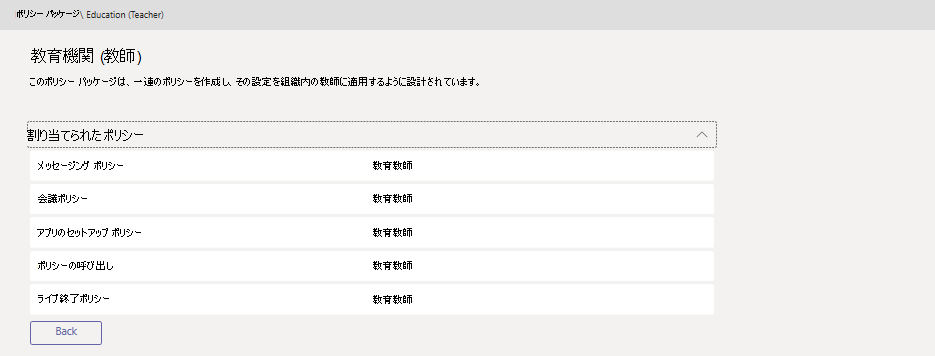

# EDU 管理者向けの Microsoft Teams ポリシー パッケージ

Microsoft Teams のポリシーパッケージでは、組織内で同様の役割を持つユーザーに割り当てることができる定義済みのポリシーおよびポリシー設定を収集します。 ポリシーパッケージは、ポリシーを管理する際の一貫性を高めるために簡素化、合理化、および支援します。 通常の方法では、各ユーザーにポリシーパッケージを割り当て、必要に応じて各パッケージのポリシーをそのユーザーグループのニーズに合わせて再定義します。 パッケージの設定を更新すると、そのパッケージに割り当てられているすべてのユーザーが一括更新として変更されます。

一般に教育機関には、学生の年齢と成熟度によって、固有のニーズを持つさまざまな種類のユーザーが含まれています。 たとえば、学生やスタッフに Microsoft Teams へのフルアクセスを許可することもできますが、学生が安全で優先的な学習環境を奨励できるように Microsoft Teams の機能を制限することをお勧めします。 ポリシーパッケージを使用して、学校コミュニティのさまざまな cohorts のニーズに基づいて設定を調整できます。

## ポリシーパッケージとは

ポリシーパッケージを使用すると、microsoft teams の機能を制御し、組織内の特定のユーザーのセットに対して Microsoft Teams での使用を許可または制限することができます。 各ポリシーパッケージは、ユーザーロールに基づいて設計されています。定義済みのポリシーとポリシー設定が含まれており、その役割の一般的なアクティビティをサポートします。

ポリシーパッケージは、次のためのポリシーを定義します。
- メッセージング 
- 会議
- アプリのセットアップ
- 通話
- ライブ イベント

Microsoft Teams には現在、次のポリシーパッケージが含まれています。

|Microsoft Teams 管理センターに一覧表示されたパッケージ名 |最適な用途  |説明 |
|:--- |:--- |:--- |
|Education_Teacher| 教員および職員| この一連のポリシーとポリシー設定を使用して、組織内の教育者やスタッフに、Microsoft Teams を通じてチャット、通話、会議へのフルアクセスを許可します。 |
|Education_PrimaryStudent | 学校のプライマリ学生  | お客様の組織内で、学生の学校の期限が切れている生徒は、Microsoft Teams 内で制限を超える必要がある場合があります。 この一連のポリシーとポリシー設定を使用して、会議の作成と管理、チャット管理、プライベート通話などの機能を制限します。 |
|Education_SecondaryStudent| 学生が期限切れになった第2学校 | お客様の組織内で期限切れになっている第1の学生は、Microsoft Teams 内で制限を超える必要があります。 この一連のポリシーとポリシー設定を使用して、会議の作成と管理、チャット管理、プライベート通話などの機能を制限します。 |
|Education_HigherEducationStudent | 高等教育の学生 | Intuition のより高い教育機関では、お客さまの生徒よりも制限が少なくなります。ただし、いくつかの制限があります。 この一連のポリシーとポリシー設定を使用して、組織内のチャット、通話、会議へのアクセス権を付与することができます。ただし、学生が外部の参加者と Microsoft Teams を使用する方法は制限されます。 |
|||

個々のポリシーには、ポリシーパッケージの名前が割り当てられているため、ポリシーパッケージにリンクされたポリシーを簡単に識別することができます。 たとえば、学校の教師に Education_Teacher ポリシーパッケージを割り当てると、Education_Teacher という名前のポリシーがパッケージ内の各ポリシーに対して作成されます。

> [!NOTE]
> 教師と管理サポートスタッフがさまざまなポリシーを必要とする場合は、既存のパッケージを転用することができます。現在使用していないパッケージを特定し、そのグループに適した設定に変更します。 どのグループにどのパッケージを所有しているのか、またパッケージを転用する唯一の障害となります。

## ポリシーパッケージを使用する理由

組織内のユーザー数が数百人以上の場合は、「1つのパッケージを割り当てるか、それともすべてのユーザーに割り当てる必要があるのはなぜですか?」とたずねられます。

数百ものユーザーにパッケージを割り当てることは、管理時間については問題ありません。 投資に関する重要なことは、すぐにではなく、時間の経過と共に支払われることです。

教育環境では、同じまたは類似した役割を持つユーザーが数多く存在します。 同じ方法でユーザーエクスペリエンスを管理すると、時間の経過と共に手間がかかります。 [パッケージ] 機関のさまざまな役割に固有の一連のポリシーをグループ化します。 同じライセンスを持っているが、異なる役割を持つユーザーは、役割に基づいて関連性のあるポリシーを割り当てることができます。これは、個々のユーザーの調整ポリシーよりも効率的です。

組織内のすべてのユーザーをグループに分類して、パッケージを適用すると、パッケージに割り当てられているすべてのユーザーについてパッケージ設定を1回変更するだけで済みます。 パッケージにユーザーを割り当てる前または後に、パッケージ内のポリシーを微調整することを選ぶことができます。

1人のユーザーにパッケージを割り当てる方法、複数のユーザーにパッケージを一括で割り当てる方法、各パッケージにリンクされたポリシーを管理および更新する方法については、「 [Microsoft Teams でポリシーパッケージを管理](manage-policy-packages.md)する」を参照してください。
