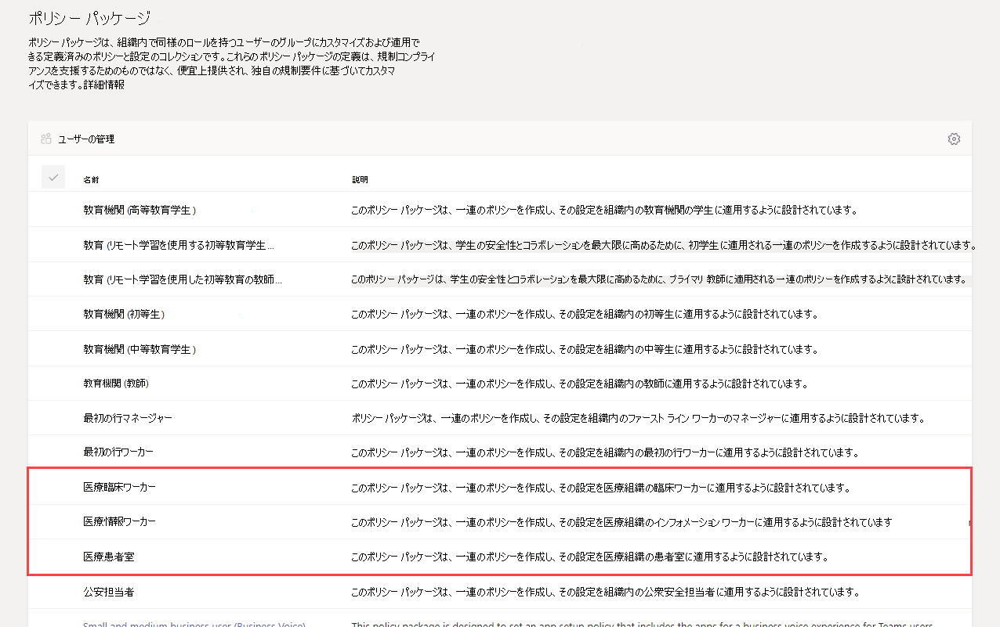
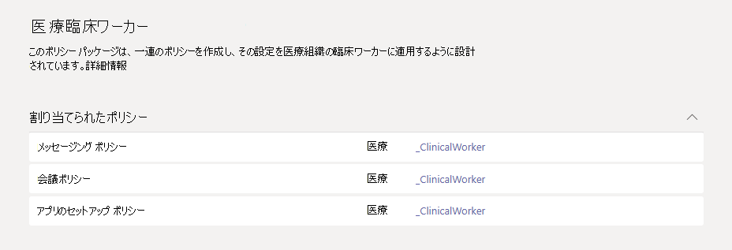
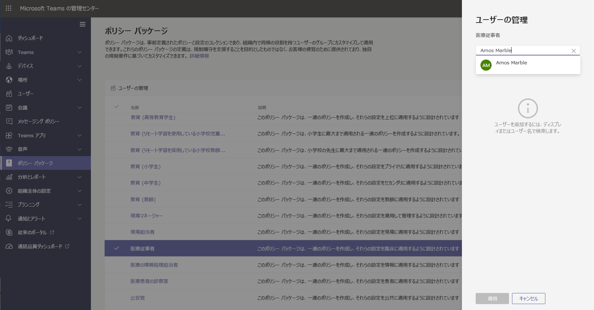

# 医療向け Teams ポリシー パッケージ

## 概要

Microsoft Teams [の](manage-policy-packages.md) ポリシー パッケージは、組織内で同様の役割を持つユーザーに割り当て可能な定義済みのポリシーとポリシー設定のコレクションです。 ポリシー パッケージにより、ポリシー管理を簡素化し、合理化し、一貫性を高めることができます。 ユーザーのニーズに合わせて、パッケージ内のポリシーの設定をカスタマイズできます。 ポリシー パッケージのポリシーの設定を変更すると、そのパッケージに割り当てられているすべてのユーザーに更新された設定が適用されます。 Microsoft Teams 管理センターまたは PowerShell を使用して、ポリシー パッケージを管理できます。

> [!VIDEO https://www.microsoft.com/videoplayer/embed/RE4Ht2o]

ポリシー パッケージは、パッケージに応じて、次のポリシーを事前に定義します。

- Messaging
- 会議
- 通話
- アプリのセットアップ
- ライブ イベント

Teams には現在、次の医療ポリシー パッケージが含まれています。

|Microsoft Teams 管理センターのパッケージ名|以下の目的での使用に最適です|説明 |
|---------|---------|---------|
|医療クリニカル ワーカー  |医療組織の医療従事者  |一連のポリシーとポリシー設定を作成し、登録された看護師、看護師、医師、ソーシャル ワーカーなどの臨床作業員にチャット、通話、シフト管理、会議へのフル アクセスを許可します。 |
|医療情報の従業員  |医療組織の情報提供者 |IT 担当者、スタッフ、財務担当者、コンプライアンス責任者などの情報ワーカー、チャット、通話、会議へのフル アクセスを提供するポリシーとポリシー設定のセットを作成します。|
|医療患者の部屋  |患者室のデバイス|医療組織の患者室に適用されるポリシーとポリシー設定のセットを作成します。|

ポリシー パッケージにリンクされているポリシーを簡単に識別できるよう、個々のポリシーにはポリシー パッケージの名前が付けされます。 たとえば、医療クリニカル ワーカー ポリシー パッケージを組織内の診療所に割り当てると、パッケージ内のポリシーごとに Healthcare_ClinicalWorker という名前のポリシーが作成されます。

## ポリシー パッケージの使用を開始する

医療ポリシー パッケージの使用を開始するには、Microsoft 管理センターのオンボーディング ハブで [ **医療**] を選択し、[役割別にポリシー設定を割り当てる] **を選択します**。 開始する準備ができたら、組織内の個人に割り当てるポリシー パッケージを決定します。

[ **ポリシーの詳細の表示]** を選択して、パッケージ内の特定のポリシーとその設定の詳細を確認します。 これらは [、Teams 管理センターでの](manage-policy-packages.md#customize-policies-in-a-policy-package) 割り当て後にカスタマイズできます。

割り当てるパッケージを 1 つ以上選択し、[次へ] を **クリックします**。 ユーザーの役割に最も適したポリシー パッケージを検索して追加できます。 1 人のユーザーを複数のポリシー パッケージに同時に割り当てられていない。

適切なポリシー パッケージにユーザーを追加すると、[完了] **で選択内容** が最終決定されます。 Microsoft Teams 管理センターでは、引き続きポリシー パッケージをカスタマイズおよび管理できます。

## ポリシー パッケージを管理する

### 表示

パッケージを割り当てる前に、ポリシー パッケージ内の各ポリシーの設定を表示します。 Microsoft Teams 管理センターの左側のナビゲーションで、[ポリシーパッケージ] に移動し、パッケージ名を選択して、ポリシー名を選択します。

事前に定義された値が組織に適しているかどうか、または組織のニーズに基づいてより厳しくあるいは緩めにユーザーをカスタマイズする必要があるかどうかを判断します。

### カスタマイズ

組織のニーズに合わせてポリシー パッケージのポリシーの設定をカスタマイズします。 ポリシー設定の変更は、パッケージが割り当てられているユーザーに自動的に適用されます。 ポリシー パッケージ内のポリシーの設定を編集するには、Microsoft Teams 管理センターの左側のナビゲーションで[ポリシーパッケージ] に移動し、ポリシー パッケージを選択し、編集するポリシーの名前を選択して、[編集] を選択します。

ポリシー パッケージを割り当てると、パッケージ内のポリシーの設定を変更することもできます。 詳細については、[「ポリシー パッケージのポリシーをカスタマイズする」](manage-policy-packages.md#customize-policies-in-a-policy-package)を参照してください。

### 割り当て

ユーザーにポリシー パッケージを割り当てる。 ユーザーにポリシーが割り当てられている場合は、別のポリシーを割り当てると、最新の割り当てが優先されます。

#### 1 人または複数のユーザーにポリシー パッケージを割り当てる

1 人または複数のユーザーにポリシー パッケージを割り当てるには、Microsoft Teams 管理センターの左側のナビゲーションから、[**ポリシー パッケージ**] に移動し、[**ユーザーの管理**] を選択します。  

詳細については、[「ポリシー パッケージを割り当てる」](manage-policy-packages.md#assign-a-policy-package)を参照してください。

ユーザーにポリシーが割り当てられている場合は、別のポリシーを割り当てると、最新の割り当てが優先されます。

#### ポリシー パッケージをグループに割り当てる

**この機能はプライベート プレビューです**

グループにポリシー パッケージを割り当てると、セキュリティ グループや配布リストなど、ユーザーのグループに複数のポリシーを割り当てることができます。 ポリシーの割り当ては、優先規則に従ってグループのメンバーに反映されます。 グループのメンバーが追加または削除されると、それに応じて継承されたポリシーの割り当てが更新されます。 この方法は、最大 50,000 ユーザーのグループに推奨されますが、より大きなグループでも機能します。

詳細については、[「グループにポリシー パッケージを割り当てる」](assign-policies.md#assign-a-policy-package-to-a-group)を参照してください。

#### ポリシー パッケージを多数 (一群) のユーザー セットに割り当てる

バッチ ポリシーパッケージの割り当てを使用して、多数のユーザー セットに同時にポリシーパッケージを割り当てることができます。 [New-CsBatchPolicyPackageAssignmentOperation](https://docs.microsoft.com/powershell/module/teams/new-csbatchpolicypackageassignmentoperation) コマンドレットを使用して、割り当てたい一群のユーザーおよびポリシー パッケージを送信します。 割り当てはバックグラウンド操作として処理され、各バッチの操作 ID が生成されます。

バッチには最大 5,000 のユーザーを含めることができます。 ユーザーをオブジェクト ID、UPN、SIP アドレス、またはメール アドレスで指定できます。 詳細については、[「一群のユーザーにポリシー パッケージを割り当てる」](assign-policies.md#assign-a-policy-package-to-a-batch-of-users)を参照してください。

## 関連項目

[Teams でポリシー パッケージを管理する](manage-policy-packages.md)

[ Teams でユーザーにポリシーを割り当てる](assign-policies.md)
