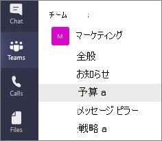
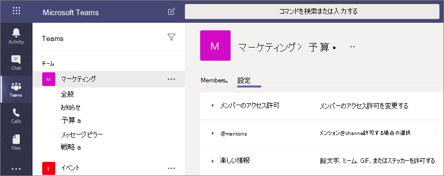

# Microsoft Teams のプライベート チャネル

Microsoft Teams のプライベート チャネルは、チーム内でのコラボレーションのための集中スペースを作成します。 プライベート チャネルの所有者またはメンバーであるチームのユーザーのみがチャネルにアクセスできます。 既にチームのメンバーである限り、ゲストを含む全てのユーザーをプライベート チャネルのメンバーとして追加できます。

知る必要があるユーザーにコラボレーションを限定したい場合、または管理する追加のチームを作成せずに特定のプロジェクトに割り当てられたユーザーのグループの間のコミュニケーションを促進したい場合は、プライベート チャネルの使用がお勧めです。

たとえば、プライベート チャネルは以下のようなシナリオで役立ちます。

- チーム内のユーザーのグループが、別のチームを作成せずにコラボレーションするための集中スペースを必要としている。
- チームの一部のユーザーが、予算、リソース、戦略的ポジショニングなどの機密情報について話し合うためのプライベート チャネルを必要としている。

ロックのアイコンはプライベート チャネルであることを示しています。プライベート チャネルのメンバーのみが、自身が追加されたプライベート チャネルを表示して参加できます。

プライベート チャネルは作成されると親チームにリンクされ、別のチームに移動させることはできません。 また、プライベート チャネルを標準チャネルに変換することはできません。

## プライベート チャネルの作成

規定では、チーム所有者またはチーム メンバーがプライベート チャネルを作成できます。 ゲストは作成できません。 プライベート チャネルを作成する機能は、チーム レベルおよび組織レベルで管理できます。 管理者は[ポリシー](teams-policies.md)を使用して、組織内のどのユーザーにプライベート チャネルの作成を許可するかを制御できます。 ポリシーを設定したら、チーム所有者はチームの [**設定**] タブで、メンバーがプライベート チャネルを作成する機能をオンまたはオフにできます。

プライベート チャネルを作成する人はプライベート チャネルの所有者であり、プライベート チャネルの所有者のみが直接チャネルにユーザーを追加または削除できます。 プライベート チャネルの所有者は、ゲストを含み作成したプライベート チャネルにチーム メンバーを追加できます。 プライベート チャネルのメンバーには安全な会話スペースがあり、新しいメンバーが追加されると、そのプライベート チャネルのすべての会話 (古い会話も含む) を見ることができます。

チーム所有者は、チーム内のすべてのプライベート チャネルの名前を確認でき、チーム内のプライベート チャネルを削除することもできます。 (削除されたプライベート チャネルは、削除されてから 30 日以内に復元できます)。 チーム所有者は、プライベート チャネルのファイル、またはプライベート チャネルの会話およびメンバー リストを、そのプライベート チャネルのメンバーでない限り表示できません。

チーム メンバーが見ることができるのは、自分が追加されているプライベート チャネルのみです。

## 所有者とメンバーの追加と削除

プライベート チャネルの所有者は、1 つ以上のプライベート チャネルの最後の所有者である場合、Teams クライアントから削除できません。

プライベート チャネルの所有者が組織を脱退した場合、またはチームに関連付けられた Microsoft 365 グループから削除された場合、プライベート チャネルのメンバーの 1 人が自動的にプライベート チャネルの所有者に昇格します。

チーム メンバーがチームを脱退する、またはチームから削除されると、そのユーザーはチーム内すべてのプライベート チャネルからも脱退、またはそこから削除されます。 ユーザーがチームに再び追加された場合、チームのプライベート チャネルに再度追加する必要があります。

## チャネル所有者の設定

各プライベート チャネルには、メンバーの追加と削除、タブの追加、チャネル全体の @mentioningなどの機能を含む独自の設定があり、チャネル所有者が管理します。 これらの設定は親チームの設定には依存しません。 プライベート チャネルが作成されると、親チームから設定を継承します。その後、親チームの設定とは無関係に設定を変更できます。

プライベート チャネルの所有者は [**チャネルの管理**] をクリックし、[**メンバー**] および [**設定**] タブを使用してメンバーを追加または削除し、設定を編集できます。

## プライベート チャネルの所有者とメンバーのアクション

以下の表は、所有者、メンバー、ゲストがプライベート チャネルで実行できるアクションの概要を示しています。

|アクション  |チーム所有者|チーム メンバー|チームのゲスト|プライベート チャネルの所有者|プライベート チャネル メンバー|プライベート チャネルのゲスト|
|---------|---------|---------|---------|---------|---------|---------|
|プライベート チャネルを作成する|管理者による制御|管理者とチームの所有者の制御|いいえ|該当なし|該当なし|該当なし|
|プライベート チャネルを削除する|はい|いいえ|いいえ|はい|いいえ|いいえ|
|プライベート チャネルを脱退する|該当なし|該当なし|該当なし|[はい]-最後の所有者でない場合|はい|はい|
|プライベート チャネルを編集する|いいえ|該当なし|該当なし|はい|いいえ|いいえ|
|削除されたプライベート チャネルを復元する|はい|いいえ|いいえ|はい|いいえ|いいえ|
|メンバーを追加する|いいえ|該当なし|該当なし|はい|いいえ|いいえ|
|編集を設定する|いいえ|該当なし|該当なし|はい|いいえ|いいえ|
|タブとアプリを管理する|いいえ|該当なし|該当なし|はい、アプリがチームにインストールされている必要があります|チャンネルの所有者の制御|いいえ|

## プライベート チャネルのライフ サイクルを管理する

組織内のプライベート チャネルのライフ サイクルを管理する方法については、「[Teams でプライベート チャネルのライフ サイクルを管理する](private-channels-life-cycle-management.md)」をご覧ください。 これには、組織内のユーザーがプライベート チャネルを作成できるかどうかを制御する方法、チーム所有者に代わってプライベート チャネルを作成する方法、アーカイブおよび監査目的ですべてのプライベート チャネル メッセージのリストを取得する方法、およびその他の管理タスクが含まれています。  

## プライベート チャネル SharePoint サイト

各プライベート チャネルには、独自の SharePoint サイトがあります。 個別のサイトは、プライベート チャネル ファイルへのアクセスがプライベート チャネルのメンバーのみに制限されることを確保するためにあります。 これらのサイトは規定でドキュメント ライブラリを使用して作成され、[サイト管理インターフェイス](https://support.office.com/article/A2F2A5C2-093D-4897-8B7F-37F86D83DF04)を介してフル機能のサイトへと簡単に拡張できます。 各サイトは、親チームのサイトと同じ地理的な場所に作成されます。 これらの軽量サイトは、PowerShell および Graph API による管理を容易にするためのカスタム テンプレート ID "TEAMCHANNEL#0" を持っています。 

>[!NOTE]
>プライベート チャネルの SharePoint サイトは、新しい SharePoint 管理センターのアクティブ サイト ページには含まれていません。
>2021 年 6 月 28 日以降に作成されたプライベート チャネル SharePoint サイトには、カスタム テンプレート ID TEAMCHANNEL#1 が含まれます。

プライベート チャネル サイトはデータ分類を同期し、親チームのサイトからゲスト アクセス許可を継承します。 サイトの所有者およびメンバー グループのメンバーシップは、Teams 内のプライベート チャネルのメンバーシップと同期します。 SharePoint 内の所有者またはメンバー グループのメンバーシップに対する変更は、4 時間以内にプライベート チャネル メンバーシップに自動的に戻されます。 特定のユーザーがプライベート チャネル メッセージにアクセスせずにドキュメントにアクセスする必要があるシナリオでは、そのユーザーをドキュメントとライブラリのビジター グループに追加するか、所有者およびメンバーとは別の新しいグループに追加します。

Teams は、プライベート チャネル サイトのライフ サイクルを管理します。 サイトが Teams 外で削除された場合、プライベート チャネルがアクティブである限り、バックグラウンド ジョブが 4 時間以内にサイトを復元します。 サイトが恒久的な削除をされた場合、プライベート チャネル用に新しいサイトがプロビジョニングされます。

プライベート チャネルまたはプライベート チャネルを含むチームが復元されると、サイトも復元されます。 プライベート チャネル サイトが復元され、プライベート チャネルの 30 日間のソフト削除ウィンドウを超えている場合、サイトはスタンドアロン サイトとして動作します。

## プライベート チャネル メッセージのコンプライアンス レコード

プライベート チャネルで送信されたメッセージのレコードは、グループのメールボックスではなく、すべてのプライベート チャネル メンバーのメールボックスに配信されます。 レコードのタイトルは、送信元のプライベート チャネルが示されるように書式設定されています。

プライベート チャネル メッセージの電子情報開示検索の実行の詳細については、「[プライベート チャネルの電子情報開示](ediscovery-investigation.md#ediscovery-of-private-channels)」を参照してください。

## プライベート チャネルでのファイル アクセスに関する考慮事項

プライベート チャネルで新しい OneNote ノートブックを作成する場合、動作はプライベート チャネル SharePoint サイトのその他のアイテムへのアクセスをユーザーと共有するのと同じであるため、追加のユーザーは引き続きノートブックにアクセスできます。

ユーザーが SharePoint 経由でプライベート チャネル内のノートブックへのアクセスを許可されている場合、チームまたはプライベート チャネルからユーザーを削除しても、ユーザーのノートブックへのアクセスは削除されません。

既存のノートブックがタブとしてプライベート チャネルに追加された場合、プライベート チャネルへのアクセスは変更されません。ノートブックは既存のアクセス権限を維持します。

## プライベート チャネルの制限

現在、プライベート チャネルはコネクタおよびタブをサポートしています (Stream、Planner、および Forms を除く)。 メッセージングの拡張機能やボットなど、プライベート チャネルのすべてのアプリのサポートに取り組んでいます。

各チームは最大 30 のプライベート チャネルを持つことができ、各プライベート チャネルには最大 250 のメンバーを含めることができます。 30 というプライベート チャネルの制限は、チームごとに 200 という標準チャネルの上限に追加されます。 

既存のチームからチームを作成する場合、既存のチームのプライベートチャネルは上書きされません。

現時点では、プライベート チャネルからの通知は、見逃したアクティビティ メールには含まれません。

プライベート チャネルのメッセージに対して、保持ポリシーはサポートされていません。

## 関連項目

[Teams でのチームとチャネルの概要](teams-channels-overview.md)

[Teams での PowerShell の概要](teams-powershell-overview.md)

[Microsoft Graph API を使用して Teams で作業する](/graph/api/resources/teams-api-overview)
