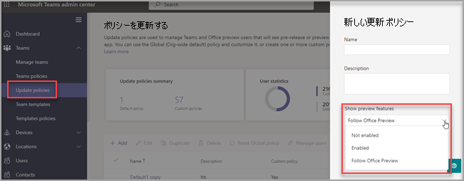

# Microsoft Teams パブリック プレビュー

> [!NOTE] 
> プレビューに含まれている機能は完全でないため、一般公開前に変更される場合があります。これらは、評価と調査のみを目的としています。Office 365 Government コミュニティ クラウド (GCC) でのプレビュー機能はサポートされていません。

Microsoft Teams のパブリック プレビューを使用すると、Teams の未公開機能にいち早くアクセスできます。プレビューでは、今後加えられる機能を探したり、テストしたりできます。パブリック プレビューのあらゆる機能に関するフィードバックをお待ちしております。パブリック プレビューは、それぞれのチーム ユーザーごとに有効になっているので、組織全体への影響を心配する必要はありません。

Teams パブリック プレビューで利用可能な機能の一覧については、[Microsoft Teams パブリック プレビュー テクニカル ノート](https://techcommunity.microsoft.com/t5/microsoft-teams-public-preview/bd-p/MicrosoftTeamsPublicPreview)、[Teams 管理者機能のリリースノート](/OfficeUpdates/teams-admin)、[Teams の新機能](https://support.microsoft.com/office/what-s-new-in-microsoft-teams-d7092a6d-c896-424c-b362-a472d5f105de)にアクセスしてください。

## 更新ポリシーを設定する

パブリック プレビューは、ユーザー単位で有効になっています。また、パブリック プレビューを有効にするオプションは管理者ポリシーで制御されます。更新ポリシーは、Teams アプリのプレリリースやプレビュー機能を表示する Teams や Office Preview ユーザーを管理するために使用されます。グローバル (組織全体の既定) ポリシーを使用してカスタマイズすることも、ユーザー用に 1 つまたは複数のカスタム ポリシーを作成することもできます。このポリシーは、グローバル ポリシーを上書きしないため、特定のユーザーに割り当てる必要があります。

1. 管理センターにサインインします。

2. **[Teams]**、 > **[更新ポリシー]** の順に選択して、**[更新ポリシー]** オプションを選択します。

1. **[追加]** を選択して新しいポリシーを作成するか、既存のポリシーを選択して **[更新ポリシー]** を開きます。

2. 更新ポリシーに名前を付け、説明を追加し **[プレビュー機能の表示]** の設定を選択します。

   -   **Office Preview をフォローする** (既定): この新しい既定のオプションでは、Office 最新チャネル (プレビュー) に登録されているすべてのユーザーに対して、Teams パブリック プレビュー機能を自動的に有効にします。 エンド ユーザーが必要とするアクションはもうありません。
   -   **有効**: このオプションは、ユーザーが Office 最新機能提供チャネル (プレビュー) に登録しているかどうかに関わらず、Teams パブリック プレビューを有効にします。 エンド ユーザーは、Teams アプリで Teams パブリック プレビューに参加することも必要です。

   > [!NOTE]  
   > Teams パブリック プレビューに存在する既存のユーザーで、**最新機能提供チャネル (プレビュー)** に存在しない場合、IT 管理者は、既定の **[Office Preview をフォローする]** から **[有効]** に切り替える必要があります。
 
   - **無効**: エンド ユーザーは Teams パブリック プレビュー機能を使用できません。

      

また、`-AllowPublicPreview` パラメーターを含む PowerShell `Set-CsTeamsUpdateManagementPolicy` コマンドレットを使用してポリシーを設定することもできます。

> [!NOTE]   
> AllowPreview パラメーターは間もなく使用されなくなります。

## パブリック プレビューを有効にする

デスクトップまたは Web クライアントでパブリック プレビューを有効にするには、次のタスクを完了する必要があります。

1. プロフィールの左側にある 3 つのドットを選択して、[Teams] メニューを表示します。
2. **[情報]** > **[パブリック プレビュー]** を選択します。
3. **[パブリック プレビューに切り替える]** を選択します。

> [!NOTE]  
> このオプションは、**[プレビュー機能の表示]** が **[有効]** に設定されている場合のみ利用可能です。

## Office Preview ユーザーを Teams がフォロー

新しいグローバル ポリシーの既定である **[Office Preview をフォローする]** は、Windows の Office 365 クライアントの最新機能提供チャネル (プレビュー) にユーザーが存在する場合、ユーザーは自動的に Teams のパブリック プレビュー チャネル参加するることができます。

Microsoft Office は引き続き最新機能提供チャネル (プレビュー) から、Teams クライアントはパブリック プレビュー チャネルから更新プログラムを受け取ります。 このポリシーは、Teams チャネルに基づいて Office チャネルを切り替えるものではありません。 

**Office 最新機能提供チャネル (プレビュー) を使用していない Teams の既存のプレビュー ユーザーを保持するにはどうすればいいですか?**

Teams パブリック プレビューへのオプトインまたはオプトアウトできる既存のユーザーで、その設定を現在の形のまま維持したい場合は、新しい既定の **[Office Preview をフォローする]** を **[有効]** に変更する必要があります ([更新ポリシーの設定](#set-the-update-policy)を参照してください)

**この設定をオプトアウトするにはどうすればいいですか?**

Teams 管理センターで、**[Office Preview をフォローする]** から **[無効]** にして、設定を無効にすることができます ([更新ポリシーの設定](#set-the-update-policy)を参照してください)

## 既知の問題

Office 最新機能提供チャネル (プレビュー) ユーザーは、更新ポリシーが **[Office Preview をフォローする]** に設定されている場合、Teams クライアントの [その他] メニューを通して Teams パブリック プレビューを終了することができます。 この機能は意図されたものではなく、将来的に削除される予定です。 Teams クライアントは、Office の最新機能提供チャネル (プレビュー) にユーザーが存在する場合、次回デバイスがアイドル状態になると、自動的にパブリック プレビューに戻る場合があります。

## 関連項目

[開発者向けパブリック プレビュー](/microsoftteams/platform/resources/dev-preview/developer-preview-intro)
