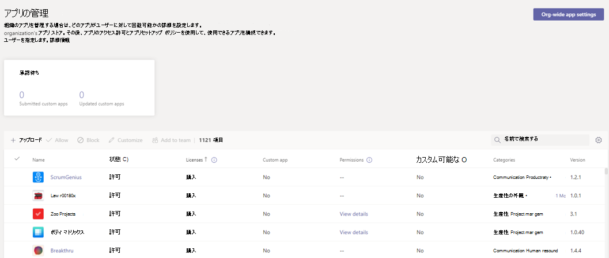

# Teams 用のサードパーティ製アプリを購入する

Teams アプリは無料でインストールでき、アプリの完全な機能とスコープを体験するためにサービス サブスクリプションの購入が必要になる場合があります。 これらのサービス サブスクリプションは、サービスとしてのソフトウェア (SaaS) オファーと呼ばれ、 [AppSource](https://appsource.microsoft.com/) から、現在は [ Microsoft Teams 管理センター](https://admin.teams.microsoft.com)から購入できます。

Microsoft Teams 管理センターの [[アプリの管理]](manage-apps.md) は、管理者が組織用のすべての Teams アプリを表示および管理できる場所です。 たとえば、アプリの組織レベルの状態とプロパティの表示、組織のアプリ ストアへの新しいカスタム アプリのアップロード、組織レベルでのアプリのブロックまたは許可、組織全体のアプリ設定の管理を行うことができます。

ここでは、組織内のユーザーに対してサード パーティ製アプリによって提供されるサービスのライセンスを購入することもできます。 表の **[ライセンス]** 列は、アプリで購入用の SaaS サブスクリプションを提供するかどうかを示します。 エンド ユーザーは、クレジット カード、デビット カード、または請求書の請求を使用してアプリを購入できます。

## Teams 管理センターでアプリを購入する

Teams 管理センターでアプリを購入するには、次の手順に従います:

1. Teams 管理センターにサインインし、**Teams アプリ** の **[管理アプリ](https://admin.teams.microsoft.com/policies/manage-apps)** > にアクセスします。 ページにアクセスするには、グローバル管理者または Teams サービス管理者である必要があります。

1. 目的のアプリを名前で検索します。 有料 SaaS サブスクリプションを持つアプリを特定するには、**ライセンス** 列を確認します。 各アプリには、次のいずれかの値があります:
    * **今すぐ購入**: このアプリは SaaS サブスクリプションを提供しており、購入が可能です。  
    * **購入済み**: このアプリは SaaS サブスクリプションを提供しており、そのライセンスを購入済みです。
    * **- -**: このアプリは SaaS サブスクリプションを提供していません。

1. アプリが見つかると、**[購入]** を選択して、アプリの詳細ページの **[プランと価格]** タブに移動します。 アプリの SaaS オファーのプランと価格情報を確認します。 詳細情報が必要な場合は、 **[詳細情報]** を選択して [AppSource](https://appsource.microsoft.com/)のアプリのページに移動します。

   > [!NOTE]
   > プライベート プランは購入用に一覧表示される場合もあります。これには、組織が個別にアプリ開発者と交渉できる特別価格が含まれます。 このようなプランには、プラン名の下に **プライベート プラン** というラベルが付けられます。

1. アプリをサブスクライブするには、目的のプランを選択し、**[購入]** を選択します。 チェックアウト フローは、Teams 管理センターで直接開きます。

1. 購入するユーザー ライセンスの数を選択します。

1. 請求先アカウントと販売先住所が正しいことを確認します。 まだお持ちでない場合は、**[追加]** を選択します。 課金アカウントの詳細については、 [「課金アカウントについて」](/microsoft-365/commerce/manage-billing-accounts)を参照してください。

   > [!NOTE]
   > グローバル管理者のみが新しい課金アカウントを追加できます。

1. 正しい課金プロファイルが選択されていることを確認します。 まだお持ちでない場合は、**[新規追加]** を選択します。 クレジット カード、デビット カード、または [請求書の請求](#invoice-billing)で支払うオプションがあります。 課金プロファイルでは、後で注文を識別する発注書番号を追加することもできます。 課金プロファイルに関する詳細については、[「課金プロファイルを理解する」](/microsoft-365/commerce/billing-and-payments/manage-billing-profiles)を参照してください。

1. **[注文]** を選択します。

1. **[設定]** を選択して、アプリ開発者の Web サイトでサブスクリプションをアクティブ化します。 購入後にサブスクリプションを設定していない場合は、後で **[ライセンスの管理]** を選択して設定できます。

Teams アプリに関連付けられている SaaS オファーを購入したら、アプリの詳細ページの **[プランと価格]** タブで次の購入の詳細を表示できます。

* **ライセンスのアクティブ化日**: ライセンスがアクティブ化された日付。 アカウントがまだ設定されていない場合は、 **アクティブ化が保留中のサブスクリプション** として表示されます。
* **ライセンス**: 購入したライセンスの数。

:::image type="content" source="media/purchase-third-party-apps-details-page.png" alt-text=" Teams 管理センターのアプリの詳細ページにある [プランと価格]タブのスクリーンショット":::

**[ライセンスの管理]** を選択して Microsoft 365 管理センターに移動し、購入したライセンスを表示および管理します。

グローバル管理者は、組織内のすべてのユーザーが行った購入に対して、ライセンスの追加、ライセンスの削除、サブスクリプションの取り消しを行うことができます。 Teams サービス管理者は、自分自身で行った購入に対して同じアクションを実行できます。 ただし、Teams サービス管理者にも課金管理者ロールがある場合は、組織内のすべてのユーザーが行った購入を管理できます。

> [!NOTE]
> グローバル管理者が別のグローバル管理者が購入したサブスクリプションを管理する場合は、同じ課金アカウントに属している必要があります。 購入したサブスクリプションへの別のグローバル管理者アクセス権を付与するには、[Microsoft 365 管理センター](https://admin.microsoft.com)でアプリを選択します。 管理センターで、**[課金プロファイルの表示]** > **[課金アカウントの選択]** > **[ロールの割り当て]** > **[他のグローバル管理者の追加]** にアクセスします。

> [!IMPORTANT]
> アプリの購入を有効にすると、アプリ内購入も有効になります。 ユーザーには、アプリ開発者によって制御されるアプリ内購入オファーが表示される場合があります。 ユーザーがアプリの購入できないようにする場合は、アプリをブロックする必要があります。

### 請求書の請求

* 請求書の請求は、一部のトランザクションの支払いオプションとして使用できます。
* 請求書の請求を初めて使用するときは、与信審査が必要で、承認には最大 24 ~ 48 時間かかる場合があります。 請求書の請求は、与信審査が完了するまで利用できません。 クレジット カードで注文を行うか、クレジット レビューが承認された後でもう一度お試しください。
* 請求書の請求は、全体管理者または Teams サービス管理者と課金管理者の両方のアクセス許可を持つ管理者のみが使用できます。
* 30 日間の無料試用版でプランを購入する場合、請求書の請求は利用できません。

## Teams アプリの SaaS オファーの一覧表示と販売

開発者は、Teams アプリに関連付けられた SaaS オファーを作成できます。 これらのオファーは、[パートナー センター](https://partner.microsoft.com) を通じて公開され、組織は [AppSource](https://appsource.microsoft.com/) および Microsoft Teams 管理センターを通じて購入できます。

サード パーティ製アプリ開発者向けの詳細については[ SaaS オファーの作成](/azure/marketplace/partner-center-portal/create-new-saas-offer)を参照してください。

## 関連記事

* [Microsoft Teams 管理センターで、Teams アプリの組織向けアプリを管理します。](manage-apps.md)
* [ SaaS オファーを作成します](/azure/marketplace/partner-center-portal/create-new-saas-offer)
* [Azure Active Directory 組み込みロール](/azure/active-directory/roles/permissions-reference)
* [Microsoft 365 管理者ロール](/microsoft-365/admin/add-users/about-admin-roles)
