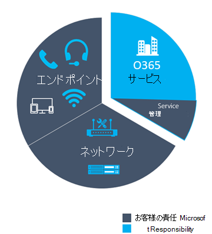
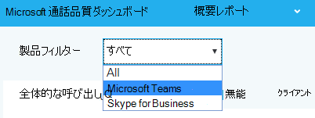
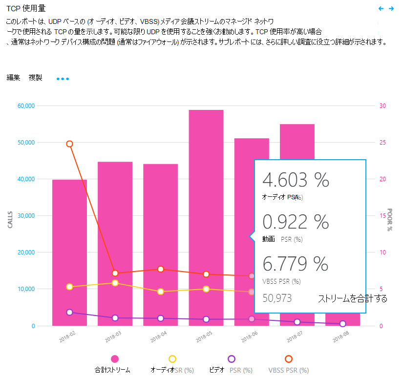
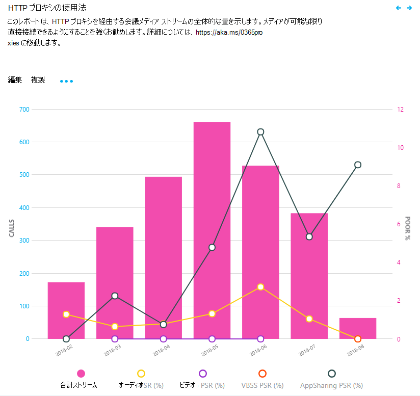

#  <a name="use-cqd-to-manage-call-and-meeting-quality-in-microsoft-teams"></a><span data-ttu-id="fbc8b-103">CQD を使用して、通話と会議の品質を管理Microsoft Teams</span><span class="sxs-lookup"><span data-stu-id="fbc8b-103">Use CQD to manage call and meeting quality in Microsoft Teams</span></span> 

<span data-ttu-id="fbc8b-104">この記事は、Teams の管理者またはサポートおよびヘルプデスク エンジニアが、Microsoft Teams 通話品質ダッシュボード (CQD) を使用して、組織の通話と会議の品質を監視および維持するためのプロセスを開発するのに役立ちます。</span><span class="sxs-lookup"><span data-stu-id="fbc8b-104">This article will help you - the Teams admin or support and helpdesk engineer - to develop a process for monitoring and maintaining call and meeting quality for your organization by using Microsoft Teams Call Quality Dashboard (CQD).</span></span> <span data-ttu-id="fbc8b-105">このガイダンスでは、オーディオ エクスペリエンスを向上させるために行ったネットワークの改善がビデオと共有の改善に役立つため、オーディオ品質のシナリオを強調しています。</span><span class="sxs-lookup"><span data-stu-id="fbc8b-105">Our guidance emphasizes audio-quality scenarios because any network improvements you make to improve the audio experience will translate to improvements in video and sharing.</span></span>

<span data-ttu-id="fbc8b-106">このガイダンスの鍵となるのは、2 つのキュリート [された CQD](https://aka.ms/QERtemplates) テンプレートです。この記事のガイダンスを確認する前に、テンプレートをダウンロードすることをお勧めします。</span><span class="sxs-lookup"><span data-stu-id="fbc8b-106">Key to this guidance are the two [curated CQD templates](https://aka.ms/QERtemplates) - we recommend that you download them before you go through the guidance in this article.</span></span>

<span data-ttu-id="fbc8b-107">この記事では、CQD を既 [に設定済みである前提とします](turning-on-and-using-call-quality-dashboard.md)。</span><span class="sxs-lookup"><span data-stu-id="fbc8b-107">This article assumes that you've already [set up CQD](turning-on-and-using-call-quality-dashboard.md).</span></span>


## <a name="categories-to-monitor-and-maintain"></a><span data-ttu-id="fbc8b-108">監視と保守を行うカテゴリ</span><span class="sxs-lookup"><span data-stu-id="fbc8b-108">Categories to monitor and maintain</span></span>

<span data-ttu-id="fbc8b-109">会議や音声を展開したらTeams、継続的な監視とメンテナンスを行う計画が必要になります。</span><span class="sxs-lookup"><span data-stu-id="fbc8b-109">Once you've rolled out meetings and voice in Teams, you'll need a plan for ongoing monitoring and maintenance.</span></span> <span data-ttu-id="fbc8b-110">そうすることで、常にTeamsが実行されます。</span><span class="sxs-lookup"><span data-stu-id="fbc8b-110">Doing so will ensure that Teams is always running optimally.</span></span> <span data-ttu-id="fbc8b-111">このプランには、以下に示す重要な領域を含める必要があります。</span><span class="sxs-lookup"><span data-stu-id="fbc8b-111">This plan should include the key areas listed below.</span></span> <span data-ttu-id="fbc8b-112">また、品質メトリックのターゲットと、問題が発生した場合のトラブルシューティングと分離のための計画も確立する必要があります。</span><span class="sxs-lookup"><span data-stu-id="fbc8b-112">You should also establish targets for quality metrics and a plan for troubleshooting and isolating problems when they happen.</span></span>

<table>
<thead>
<tr class="header">
<th><span data-ttu-id="fbc8b-113">カテゴリ</span><span class="sxs-lookup"><span data-stu-id="fbc8b-113">Category</span></span></th>
<th><span data-ttu-id="fbc8b-114">説明</span><span class="sxs-lookup"><span data-stu-id="fbc8b-114">Description</span></span></th>
</tr>
</thead>
<tbody>
<tr class="odd">
<td><span data-ttu-id="fbc8b-115"><strong>通話品質</strong></span><span class="sxs-lookup"><span data-stu-id="fbc8b-115"><strong>Call quality</strong></span></span></td>
<td>
<p><span data-ttu-id="fbc8b-116">内部呼び出し (VPN、WiFi、有線通話など) または外部呼び出しによってメトリックを分析する</span><span class="sxs-lookup"><span data-stu-id="fbc8b-116">Break down the metrics by internal calls (within your organization, such as VPN, WiFi, wired) or external calls</span></span></p>
<p><span data-ttu-id="fbc8b-117">メトリックを構築またはネットワークで分析する</span><span class="sxs-lookup"><span data-stu-id="fbc8b-117">Break down the metrics by building or network</span></span></p>
<p><span data-ttu-id="fbc8b-118">VPN 呼び出し</span><span class="sxs-lookup"><span data-stu-id="fbc8b-118">VPN calls</span></span></p>
<p><span data-ttu-id="fbc8b-119">TCP、UDP、またはプロキシを使用した呼び出し</span><span class="sxs-lookup"><span data-stu-id="fbc8b-119">Calls using TCP, UDP, or proxy</span></span></p>
</td>
</tr>
<tr class="even">
<td><span data-ttu-id="fbc8b-120"><strong>通話の信頼性</strong></span><span class="sxs-lookup"><span data-stu-id="fbc8b-120"><strong>Call reliability</strong></span></span></td>
<td><p><span data-ttu-id="fbc8b-121">ネットワークまたはファイアウォールの問題を特定して修復する</span><span class="sxs-lookup"><span data-stu-id="fbc8b-121">Identify and remediate any network or firewall problems</span></span></p>
<p><span data-ttu-id="fbc8b-122">通話のセットアップとドロップの失敗の割合に関する洞察を得る</span><span class="sxs-lookup"><span data-stu-id="fbc8b-122">Gain insights into the percentages of call setup and drop failures</span></span></p>
<p><span data-ttu-id="fbc8b-123">通話のセットアップとドロップの失敗の大部分が発生する場所を確認する</span><span class="sxs-lookup"><span data-stu-id="fbc8b-123">Learn where the majority of call setup and drop failures occur</span></span></p>
</td>
</tr>
<tr class="odd">
<td><span data-ttu-id="fbc8b-124"><strong>ユーザーアンケート</strong></span><span class="sxs-lookup"><span data-stu-id="fbc8b-124"><strong>User survey</strong></span></span></td>
<td>
<p><span data-ttu-id="fbc8b-125">Rate My Call データを使用して、ユーザーの実際のエクスペリエンスについて学習する</span><span class="sxs-lookup"><span data-stu-id="fbc8b-125">Use Rate My Call data to learn about users' actual experience</span></span></p>
<p><span data-ttu-id="fbc8b-126">低品質のエクスペリエンスはどこで発生していますか?</span><span class="sxs-lookup"><span data-stu-id="fbc8b-126">Where are the poor experiences occurring?</span></span></p>
<p><span data-ttu-id="fbc8b-127">低品質のエクスペリエンスと通話品質、信頼性、デバイスを関連付ける</span><span class="sxs-lookup"><span data-stu-id="fbc8b-127">Correlate the poor experience with call quality, reliability, and devices</span></span></p>
</td>
</tr>
<tr class="even">
<td><span data-ttu-id="fbc8b-128"><strong>Devices</strong></span><span class="sxs-lookup"><span data-stu-id="fbc8b-128"><strong>Devices</strong></span></span></td>
<td><p><span data-ttu-id="fbc8b-129">最も一般的に使用されているマイクとスピーカーと、通話品質への影響について学習する</span><span class="sxs-lookup"><span data-stu-id="fbc8b-129">Learn which microphones and speakers are most commonly used and their impact on call quality</span></span></p>
<p><span data-ttu-id="fbc8b-130">サポートされているオーディオ、ビデオ、USB、WiFi ドライバーは定期的に修正プログラムが適用されていますか?</span><span class="sxs-lookup"><span data-stu-id="fbc8b-130">Are the supporting audio, video, USB, and WiFi drivers being regularly patched?</span></span></p>
</td>
</tr>
<tr class="odd">
<td><span data-ttu-id="fbc8b-131"><strong>クライアント</strong></span><span class="sxs-lookup"><span data-stu-id="fbc8b-131"><strong>Clients</strong></span></span></td>
<td>
<p><span data-ttu-id="fbc8b-132">使用されているクライアントの種類とバージョンと、呼び出しの品質と信頼性への影響について説明します</span><span class="sxs-lookup"><span data-stu-id="fbc8b-132">Learn which client types and versions are being used and their impact on call quality and reliability</span></span>  </p>
</ol></td>
</tr>
</tbody>
</table>

<span data-ttu-id="fbc8b-133">この記事で説明する領域を継続的に評価して修復することで、ユーザーに悪影響を与える可能性を減らします。</span><span class="sxs-lookup"><span data-stu-id="fbc8b-133">By continually assessing and remediating the areas described in this article, you can reduce their potential to negatively affect your users.</span></span> <span data-ttu-id="fbc8b-134">ほとんどのユーザーの問題は、次のカテゴリにグループ化できます。</span><span class="sxs-lookup"><span data-stu-id="fbc8b-134">Most user problems can be grouped into the following categories:</span></span>

-   <span data-ttu-id="fbc8b-135">不完全なファイアウォールまたはプロキシの構成</span><span class="sxs-lookup"><span data-stu-id="fbc8b-135">Incomplete firewall or proxy configuration</span></span>
-   <span data-ttu-id="fbc8b-136">貧弱な Wi-Fi の有効範囲</span><span class="sxs-lookup"><span data-stu-id="fbc8b-136">Poor Wi-Fi coverage</span></span>
-   <span data-ttu-id="fbc8b-137">不十分な帯域幅</span><span class="sxs-lookup"><span data-stu-id="fbc8b-137">Insufficient bandwidth</span></span>
-   <span data-ttu-id="fbc8b-138">VPN</span><span class="sxs-lookup"><span data-stu-id="fbc8b-138">VPN</span></span>
-   <span data-ttu-id="fbc8b-139">一貫性のない、または古いクライアントのバージョンとドライバー</span><span class="sxs-lookup"><span data-stu-id="fbc8b-139">Inconsistent or outdated client versions and drivers</span></span>
-   <span data-ttu-id="fbc8b-140">最適化されていない、または組み込みのオーディオ デバイス</span><span class="sxs-lookup"><span data-stu-id="fbc8b-140">Unoptimized or built-in audio devices</span></span>
-   <span data-ttu-id="fbc8b-141">問題のあるサブネットまたはネットワーク デバイス</span><span class="sxs-lookup"><span data-stu-id="fbc8b-141">Problematic subnets or network devices</span></span>

<span data-ttu-id="fbc8b-142">Teams または Skype for Business Online を展開する前に適切な計画と設計を行って、高品質のエクスペリエンスを維持するために必要な労力を削減できます。</span><span class="sxs-lookup"><span data-stu-id="fbc8b-142">Through proper planning and design before deploying Teams or Skype for Business Online, you can reduce the amount of effort that will be required to maintain high-quality experiences.</span></span>

<span data-ttu-id="fbc8b-143">この記事では、導入と影響を最大化するためにオーディオに特に重点を置いて、各領域をレポートおよび調査するための主要なツールとして通話品質ダッシュボード (CQD) Online を使用する方法について説明します。</span><span class="sxs-lookup"><span data-stu-id="fbc8b-143">This article focuses on using the Call Quality Dashboard (CQD) Online as the primary tool to report and investigate each area, with a special emphasis on audio to maximize adoption and impact.</span></span> <span data-ttu-id="fbc8b-144">オーディオ エクスペリエンスを向上させるためにネットワークに対して行われた改善は、ビデオとデスクトップ共有の改善にも直接変換されます。</span><span class="sxs-lookup"><span data-stu-id="fbc8b-144">Any improvements made to the network to improve the audio experience will also directly translate to improvements in video and desktop sharing.</span></span>

<span data-ttu-id="fbc8b-145">評価を加速するために、2 つのキュリング [された CQD](https://aka.ms/qertemplates) テンプレートが提供されます。1 つはすべてのネットワークを管理するためのテンプレートで、もう 1 つは管理された (内部) ネットワークでのみフィルター処理されます。</span><span class="sxs-lookup"><span data-stu-id="fbc8b-145">To accelerate your assessment, [two curated CQD templates](https://aka.ms/qertemplates) are provided: one is for managing all networks and the other is filtered for managed (internal) networks only.</span></span> <span data-ttu-id="fbc8b-146">[すべてのネットワーク] テンプレート レポートは建物とネットワーク情報を表示するように構成されているが、建物情報の収集とアップロードに取り組む間は引き続き使用できます。</span><span class="sxs-lookup"><span data-stu-id="fbc8b-146">Although the All Networks template reports are configured to display building and network information, they can still be used while you work toward collecting and uploading building information.</span></span> <span data-ttu-id="fbc8b-147">CQD に建物情報をアップロードすると、サービスは、外部サブネットから内部的に区別しながら、カスタムの建物、ネットワーク、場所の情報を追加することで、レポートを強化できます。</span><span class="sxs-lookup"><span data-stu-id="fbc8b-147">Uploading building information into CQD enables the service to enhance reporting by adding custom building, network, and location information while differentiating internal from external subnets.</span></span> <span data-ttu-id="fbc8b-148">詳細については、マッピングの構築に関 [するページを参照してください](CQD-building-mapping.md)。</span><span class="sxs-lookup"><span data-stu-id="fbc8b-148">For more information, read [Building mapping](CQD-building-mapping.md).</span></span>

### <a name="intended-audience"></a><span data-ttu-id="fbc8b-149">対象ユーザー</span><span class="sxs-lookup"><span data-stu-id="fbc8b-149">Intended audience</span></span>

<span data-ttu-id="fbc8b-150">この記事は、コラボレーション リード/アーキテクト、コンサルタント、変更管理/導入スペシャリスト、サポート/ヘルプ デスク リード、ネットワーク リード、デスクトップ リード、IT 管理者などの役割を持つパートナーおよび顧客の関係者が使用することを目的とします。</span><span class="sxs-lookup"><span data-stu-id="fbc8b-150">This article is intended to be used by partner and customer stakeholders with roles such as Collaboration Lead/Architect, Consultant, Change Management/Adoption Specialist, Support/Help Desk Lead, Network Lead, Desktop Lead, and IT Admin.</span></span>

<span data-ttu-id="fbc8b-151">この記事は、指定された品質のチャンピオンが使用することを目的としています。</span><span class="sxs-lookup"><span data-stu-id="fbc8b-151">This article is also intended to be used by the designated quality champion(s).</span></span> <span data-ttu-id="fbc8b-152">詳細については、品質チャンピオン ロール [に関するページを参照してください](4-envision-plan-my-service-management.md#the-quality-champion-role)。</span><span class="sxs-lookup"><span data-stu-id="fbc8b-152">For more information, see [the Quality Champion role](4-envision-plan-my-service-management.md#the-quality-champion-role).</span></span>


## <a name="what-is-quality"></a><span data-ttu-id="fbc8b-153">品質とは</span><span class="sxs-lookup"><span data-stu-id="fbc8b-153">What is quality?</span></span>

<span data-ttu-id="fbc8b-154">このコンテキストでは、品質はサービス メトリックとユーザー エクスペリエンスの組み合わせです。</span><span class="sxs-lookup"><span data-stu-id="fbc8b-154">In this context, quality is a combination of service metrics and user experience.</span></span>


### <a name="service-metrics"></a><span data-ttu-id="fbc8b-155">サービス メトリック</span><span class="sxs-lookup"><span data-stu-id="fbc8b-155">Service metrics</span></span>

<span data-ttu-id="fbc8b-156">サービス メトリックは、特定のクライアント ベースのメトリックで構成されます。</span><span class="sxs-lookup"><span data-stu-id="fbc8b-156">Service metrics consist of specific client-based metrics.</span></span> <span data-ttu-id="fbc8b-157">各呼び出し中、クライアントは呼び出しのテレメトリを収集し、後で CQD またはユーザーごとの呼び出し分析でアクセスできる各呼び出しの最後にレポートを [送信](set-up-call-analytics.md)します。</span><span class="sxs-lookup"><span data-stu-id="fbc8b-157">During each call, the client collects telemetry for the call and submits a report at the end of each call that can later be accessed in CQD or in [per-user call analytics](set-up-call-analytics.md).</span></span> <span data-ttu-id="fbc8b-158">これらのメトリックには、次のものが含まれます (ただし、これらに限定されるのではなく)。</span><span class="sxs-lookup"><span data-stu-id="fbc8b-158">These metrics include (but aren't limited to):</span></span>

-   <span data-ttu-id="fbc8b-159">低品質ストリーム (受信および送信)</span><span class="sxs-lookup"><span data-stu-id="fbc8b-159">Poor Stream (incoming and outgoing)</span></span>
-   <span data-ttu-id="fbc8b-160">セットアップの失敗率</span><span class="sxs-lookup"><span data-stu-id="fbc8b-160">Setup Failure Rate</span></span>
-   <span data-ttu-id="fbc8b-161">ドロップ エラー率</span><span class="sxs-lookup"><span data-stu-id="fbc8b-161">Drop Failure Rate</span></span>


#### <a name="poor-stream-rate"></a><span data-ttu-id="fbc8b-162">低品質のストリーム レート</span><span class="sxs-lookup"><span data-stu-id="fbc8b-162">Poor stream rate</span></span>

<span data-ttu-id="fbc8b-163">低品質ストリーム レート (PSR) は、品質が低いストリームに対する組織の全体的な割合を表します。</span><span class="sxs-lookup"><span data-stu-id="fbc8b-163">The poor stream rate (PSR) represents the organization's overall percentage of streams that have poor quality.</span></span> <span data-ttu-id="fbc8b-164">このメトリックは、この値の削減とユーザー エクスペリエンスの向上に最も強い影響を与える取り組みを組織が集中できる領域を[](#managed-versus-unmanaged-networks)強調することを目的としています。これが、PSR を見る際にマネージド ネットワークが主な焦点である理由です。</span><span class="sxs-lookup"><span data-stu-id="fbc8b-164">This metric is meant to highlight areas where your organization can concentrate effort to have the strongest impact toward reducing this value and improving the user experience, which is why [managed networks](#managed-versus-unmanaged-networks) are the primary focus when looking at PSR.</span></span> <span data-ttu-id="fbc8b-165">外部ユーザーも重要ですが、調査は組織ごとに異なります。</span><span class="sxs-lookup"><span data-stu-id="fbc8b-165">External users are important too, but investigation differs on an organizational basis.</span></span> <span data-ttu-id="fbc8b-166">外部ユーザーにベスト プラクティスを提供し、組織全体から独立して外部呼び出しを調査します。</span><span class="sxs-lookup"><span data-stu-id="fbc8b-166">Consider providing best practices for external users, and investigate external calls independently from the overall organization.</span></span>

<span data-ttu-id="fbc8b-167">CQD での実際の測定はワークロードによって異なりますが、この記事では、主に Audio Poor Percentage の測定 _に重点を置_ います。</span><span class="sxs-lookup"><span data-stu-id="fbc8b-167">The actual measurement in CQD varies by workload, but for the purposes of this article, we focus primarily on the _Audio Poor Percentage_ measurement.</span></span> <span data-ttu-id="fbc8b-168">PSR は、次の表で説明されている 5 つのネットワーク メトリック平均で構成されています。</span><span class="sxs-lookup"><span data-stu-id="fbc8b-168">PSR is made up of the five network metric averages described in the following table.</span></span> <span data-ttu-id="fbc8b-169">ストリームを低品質として分類するには、定義されたしきい値を超える必要があるメトリックは 1 つのみです。</span><span class="sxs-lookup"><span data-stu-id="fbc8b-169">For a stream to be classified as poor, only one metric needs to exceed the defined threshold.</span></span> <span data-ttu-id="fbc8b-170">CQD は"Poor Due To.." を提供します。測定値を使用して、ストリームが低品質として分類される原因となる条件をよりよく理解できます。</span><span class="sxs-lookup"><span data-stu-id="fbc8b-170">CQD provides the "Poor Due To…" measurements to better understand what condition caused the stream to be classified as poor.</span></span> <span data-ttu-id="fbc8b-171">詳細については [、「CQD のストリーム分類」を参照してください](stream-classification-in-call-quality-dashboard.md)。</span><span class="sxs-lookup"><span data-stu-id="fbc8b-171">To learn more, read [Stream classification in CQD](stream-classification-in-call-quality-dashboard.md).</span></span>

> [!Note]
> <span data-ttu-id="fbc8b-172">CQD は"Poor due to.." を提供します。測定値を使用して、ストリームが低品質として分類される原因となる条件をよりよく理解できます。</span><span class="sxs-lookup"><span data-stu-id="fbc8b-172">CQD provides the "Poor due to…" measurements to better understand what condition caused the stream to be classified as poor.</span></span>


##### <a name="audio-poor-quality-metrics"></a><span data-ttu-id="fbc8b-173">オーディオ品質の低いメトリック</span><span class="sxs-lookup"><span data-stu-id="fbc8b-173">Audio poor quality metrics</span></span>

| <span data-ttu-id="fbc8b-174">メトリックの平均</span><span class="sxs-lookup"><span data-stu-id="fbc8b-174">Metric average</span></span>     | <span data-ttu-id="fbc8b-175">説明</span><span class="sxs-lookup"><span data-stu-id="fbc8b-175">Description</span></span>     | <span data-ttu-id="fbc8b-176">ユーザー エクスペリエンス</span><span class="sxs-lookup"><span data-stu-id="fbc8b-176">User experience</span></span> |
|-------------|-----------------|-----------------|
| <span data-ttu-id="fbc8b-177">ジ \> ッター 30 ミリ秒</span><span class="sxs-lookup"><span data-stu-id="fbc8b-177">Jitter \>30 ms</span></span>        | <span data-ttu-id="fbc8b-178">これは、連続するパケット間の遅延の平均変化です。</span><span class="sxs-lookup"><span data-stu-id="fbc8b-178">This is the average change in delay between successive packets.</span></span> <span data-ttu-id="fbc8b-179">TeamsとSkype for Businessバッファリングを通じて、一部のレベルのジッターに適応できます。</span><span class="sxs-lookup"><span data-stu-id="fbc8b-179">Teams and Skype for Business can adapt to some levels of jitter through buffering.</span></span> <span data-ttu-id="fbc8b-180">参加者がジッターの影響に気付くのは、ジッターがバッファリングを超えた場合のみです。</span><span class="sxs-lookup"><span data-stu-id="fbc8b-180">It's only when the jitter exceeds the buffering that a participant notices the effects of jitter.</span></span>      | <span data-ttu-id="fbc8b-181">異なる速度で到着するパケットは、スピーカーの音声がロボット音を鳴らします。</span><span class="sxs-lookup"><span data-stu-id="fbc8b-181">The packets arriving at different speeds cause a speaker's voice to sound robotic.</span></span>   |
| <span data-ttu-id="fbc8b-182">パケット損失率 \> 10% または 0.1</span><span class="sxs-lookup"><span data-stu-id="fbc8b-182">Packet loss rate \>10% or 0.1</span></span>        | <span data-ttu-id="fbc8b-183">これは、多くの場合、失われたパケットの割合として定義されます。</span><span class="sxs-lookup"><span data-stu-id="fbc8b-183">This is often defined as a percentage of packets that are lost.</span></span> <span data-ttu-id="fbc8b-184">パケット損失は、オーディオの品質に直接影響します。小さな個々の損失パケットから、オーディオが完全に切り取る原因となるバック 対バックバースト損失にほとんど影響しません。</span><span class="sxs-lookup"><span data-stu-id="fbc8b-184">Packet loss directly affects audio quality—from small, individual lost packets that have almost no impact to back-to-back burst losses that cause audio to cut out completely.</span></span>     | <span data-ttu-id="fbc8b-185">パケットがドロップされ、目的の宛先に到着しない場合、メディアにギャップが生じ、その結果、スイブルと単語が欠落し、ビデオと共有が途切れになります。</span><span class="sxs-lookup"><span data-stu-id="fbc8b-185">The packets being dropped and not arriving at their intended destination cause gaps in the media, resulting in missed syllables and words, and choppy video and sharing.</span></span> |
| <span data-ttu-id="fbc8b-186">ラウンドトリップ時間 \> 500 ミリ秒</span><span class="sxs-lookup"><span data-stu-id="fbc8b-186">Round-trip time \>500 ms</span></span>        | <span data-ttu-id="fbc8b-187">これは、ポイント A からポイント B まで、ポイント A に戻って IP パケットを取得するのにかかる時間です。このネットワーク伝達遅延は、2 つのポイント間の物理的な距離と光の速度に関連付けられます。また、ネットワーク パス内のさまざまなデバイスによって発生する追加のオーバーヘッドも含まれます。</span><span class="sxs-lookup"><span data-stu-id="fbc8b-187">This is the time it takes to get an IP packet from point A to point B and back to point A. This network propagation delay is tied to the physical distance between the two points and the speed of light, and includes additional overhead taken by the various devices in the network path.</span></span>      | <span data-ttu-id="fbc8b-188">パケットの宛先への到着に時間がかかっている場合、walkie-talkie 効果が発生します。</span><span class="sxs-lookup"><span data-stu-id="fbc8b-188">The packets taking too long to arrive at their destination cause a walkie-talkie effect.</span></span>   |
| <span data-ttu-id="fbc8b-189">NMOS の低下平均 \> 1.0</span><span class="sxs-lookup"><span data-stu-id="fbc8b-189">NMOS degradation average \>1.0</span></span>         | <span data-ttu-id="fbc8b-190">ストリーム [の平均ネットワーク平均オピニオン スコア (NMOS)](/previous-versions/office/communications-server/bb894481(v=office.12)#network-mos) の低下。</span><span class="sxs-lookup"><span data-stu-id="fbc8b-190">Average [Network Mean Opinion Score (NMOS)](/previous-versions/office/communications-server/bb894481(v=office.12)#network-mos) degradation for the stream.</span></span> <span data-ttu-id="fbc8b-191">NMOS が 1 ポイント以上低下する原因となる受信オーディオの品質に、ネットワーク損失とジッターがどれだけ影響を与えたかを表します。</span><span class="sxs-lookup"><span data-stu-id="fbc8b-191">Represents how much the network loss and jitter has affected the quality of received audio that caused the NMOS to drop by more than one point.</span></span> | <span data-ttu-id="fbc8b-192">これは、ジッター、パケット損失、およびラウンドトリップ時間の増加の組み合わせです。</span><span class="sxs-lookup"><span data-stu-id="fbc8b-192">This is a combination of jitter, packet loss, and—to a lesser degree—increased round-trip time.</span></span> <span data-ttu-id="fbc8b-193">ユーザーにこれらの症状の組み合わせが発生している可能性があります。</span><span class="sxs-lookup"><span data-stu-id="fbc8b-193">The user might be experiencing a combination of these symptoms.</span></span>   |
| <span data-ttu-id="fbc8b-194">隠しサンプルの平均 \> 比率 7% または 0.07</span><span class="sxs-lookup"><span data-stu-id="fbc8b-194">Average ratio of concealed samples \>7% or 0.07</span></span> | <span data-ttu-id="fbc8b-195">パケット損失の回復によって生成された隠蔽されたサンプルを含むオーディオ フレームの数とオーディオ フレームの総数の平均比率。</span><span class="sxs-lookup"><span data-stu-id="fbc8b-195">Average ratio of the number of audio frames with concealed samples generated by packet loss healing to the total number of audio frames.</span></span> <span data-ttu-id="fbc8b-196">隠しオーディオ サンプルは、ネットワーク パケットのドロップによって通常発生する突然の遷移を滑らかにするために使用される手法です。</span><span class="sxs-lookup"><span data-stu-id="fbc8b-196">A concealed audio sample is a technique used to smooth out the abrupt transition that would usually be caused by dropped network packets.</span></span>      | <span data-ttu-id="fbc8b-197">値が高い場合、損失の隠蔽のかなりのレベルが適用され、オーディオが歪みまたは失われた結果を示します。</span><span class="sxs-lookup"><span data-stu-id="fbc8b-197">High values indicate that significant levels of loss concealment were applied and resulted in distorted or lost audio.</span></span>     |

##### <a name="why-do-we-prefer-to-use-streams-instead-of-calls"></a><span data-ttu-id="fbc8b-198">呼び出しの代わりにストリームを使用する理由</span><span class="sxs-lookup"><span data-stu-id="fbc8b-198">Why do we prefer to use streams instead of calls?</span></span>

<span data-ttu-id="fbc8b-199">ストリームの特定の足が低品質 (発信または着信) をお知らせします。</span><span class="sxs-lookup"><span data-stu-id="fbc8b-199">Streams let us know which particular leg of the call was poor - outgoing or incoming.</span></span> <span data-ttu-id="fbc8b-200">通話の分析で低品質の通話を確認する場合は、低品質の呼び出しが、その呼び出し元のストリーム (送信) または呼び出し先のストリーム (受信) に起因するかどうかを判断します。</span><span class="sxs-lookup"><span data-stu-id="fbc8b-200">When you're looking at call analytics for a poor call, determine whether the poor call was due to that caller's stream (outbound) or callee's stream (inbound).</span></span> <span data-ttu-id="fbc8b-201">通話品質に影響を与えるストリームを特定することが、電話会議にとってさらに重要です。</span><span class="sxs-lookup"><span data-stu-id="fbc8b-201">Determining which stream is impacting call quality is even more important for conferences.</span></span> <span data-ttu-id="fbc8b-202">通話データのみを見ている場合は、1 人のユーザーが参加している電話会議の数が表示されますが、最も多くの画面共有を行っているアクティブなスピーカーは表示できません。</span><span class="sxs-lookup"><span data-stu-id="fbc8b-202">If you're only looking at call data, you'll see how many conferences a person participates in, but you won't see which people are active speakers, doing the most screen sharing.</span></span>

<span data-ttu-id="fbc8b-203">通話データは使用状況のメトリックを提供しますが、必ずしも低品質の通話の根本原因につながるとは限りません。</span><span class="sxs-lookup"><span data-stu-id="fbc8b-203">Call data gives you usage metrics, but it won't necessarily lead you to the root cause for poor call quality.</span></span> <span data-ttu-id="fbc8b-204">ストリームの方向を見て、管理されたネットワーク上に存在しない通話、従業員以外からの通話 (ベンダーや別のネットワーク上の人など) などの要因を識別できます。</span><span class="sxs-lookup"><span data-stu-id="fbc8b-204">By looking at stream direction, you can identify factors such as a call that's not on a managed network, a call from a non-employee (e.g., a vendor or someone on a different network).</span></span> <span data-ttu-id="fbc8b-205">このような場合、相手のネットワーク接続が悪かった場合、呼び出し全体に低品質としてフラグが設定されます。</span><span class="sxs-lookup"><span data-stu-id="fbc8b-205">In these cases, if the other person's network connection was poor, the entire call will be flagged as poor.</span></span> <span data-ttu-id="fbc8b-206">外部要因については何もできないので、このデータは役に立たません。</span><span class="sxs-lookup"><span data-stu-id="fbc8b-206">You can't do  anything about external factors, so this data isn't helpful.</span></span>

<span data-ttu-id="fbc8b-207">ストリームの方向は、問題のあるデバイスやクライアントを特定するのにも役立ちます。</span><span class="sxs-lookup"><span data-stu-id="fbc8b-207">Stream direction can also help you identify problematic devices or clients.</span></span>

 - <span data-ttu-id="fbc8b-208">たとえば、デバイスの予算が限られている場合に、高負荷のオーディオ ユーザーにのみデバイスを提供する場合は、音声使用状況レポート (VoIP) を使用し、送信ストリームと会議にフィルターを適用します。</span><span class="sxs-lookup"><span data-stu-id="fbc8b-208">For example, If you have a limited budget for devices and want to provide devices only for heavy audio users, use the audio usage report (VoIP) and filter for outbound streams and conferencing.</span></span> <span data-ttu-id="fbc8b-209">組み込みのマイクに話している高音量のオーディオ ユーザーを探します。これらは低品質の通話品質に関連する可能性があります (また、これらのユーザーにオーディオ デバイスを提供することもできます)。</span><span class="sxs-lookup"><span data-stu-id="fbc8b-209">Look for high-volume audio users who are speaking into built-in microphones - these may correlate to poorer call quality (and you might want to provide audio devices for these people).</span></span> <span data-ttu-id="fbc8b-210">わかりやすくするために、パケット使用率をフィルター処理して、特に高音量のオーディオ ユーザーをターゲットにできます。</span><span class="sxs-lookup"><span data-stu-id="fbc8b-210">For added clarity, you could filter for packet utilization, which will let you target especially high-volume audio users.</span></span> 

  - <span data-ttu-id="fbc8b-211">もう 1 つの例として、画面の共有があります。</span><span class="sxs-lookup"><span data-stu-id="fbc8b-211">Another example involves screen sharing.</span></span> <span data-ttu-id="fbc8b-212">顧客が古いクライアントを使用Teams、画面共有のパフォーマンスが影響を受ける可能性があります。</span><span class="sxs-lookup"><span data-stu-id="fbc8b-212">If a customer is using an old Teams client, screen sharing performance may be affected.</span></span> <span data-ttu-id="fbc8b-213">この問題に対処するには、多くの画面共有を行うユーザーに対してクライアントのアップグレードを優先順位付けします。</span><span class="sxs-lookup"><span data-stu-id="fbc8b-213">You could address this problem by prioritizing client upgrades for people who do a lot of screen sharing.</span></span>

 - <span data-ttu-id="fbc8b-214">低品質の原因となっているストリームの方向を特定することで、QoS または帯域幅関連の問題が発生したかどうかを判断できます。</span><span class="sxs-lookup"><span data-stu-id="fbc8b-214">By identifying which direction of a stream is causing poor call quality, you can determine whether you've got a QoS or bandwidth-related problem.</span></span> <span data-ttu-id="fbc8b-215">QoS を完全に実装していない場合、または受信ストリームではなくクライアントでパケットのみをマークした場合は、低品質の呼び出しが表示される可能性があります。</span><span class="sxs-lookup"><span data-stu-id="fbc8b-215">If you haven't fully implemented QoS, or if you only mark packets at the client and not at the inbound stream, you might see poorer call quality.</span></span> <span data-ttu-id="fbc8b-216">ストリームの方向を見て、特定の方向のパケット損失、待機時間、またはジッターのより詳細なビューを取得できます。</span><span class="sxs-lookup"><span data-stu-id="fbc8b-216">By looking at stream direction, you can get a more granular view of packet loss, latency, or jitter in a specific direction.</span></span> 

   - <span data-ttu-id="fbc8b-217">たとえば、ユーザーが有線接続 (ジッター) でロボットオーディオを不平を言ったとします。</span><span class="sxs-lookup"><span data-stu-id="fbc8b-217">For example, let's say a user complains of robotic audio while on a wired connection (jitter).</span></span> <span data-ttu-id="fbc8b-218">ストリームと方向を見ると、特定のサブネット セットについてのみ、受信ストリームで問題が発生したと判断できます。</span><span class="sxs-lookup"><span data-stu-id="fbc8b-218">By looking at stream and direction, you can determine that the problem happens on the inbound stream, only for a specific set of subnets.</span></span> <span data-ttu-id="fbc8b-219">この情報をネットワーク チームに提供すると、メディア トラフィックをバイパスしていない構成が正しく設定されていない WAN アクセラレータまで追跡できます。</span><span class="sxs-lookup"><span data-stu-id="fbc8b-219">After you give this information to your networking team, they can track it down to a misconfigured WAN accelerator that was not bypassing media traffic.</span></span> <span data-ttu-id="fbc8b-220">ネットワーク チームが WAN アクセラレータを再構成すると、ジッターが消え、通話品質が向上します。</span><span class="sxs-lookup"><span data-stu-id="fbc8b-220">Once the network team reconfigures the WAN accelerator, jitter disappears and call quality improves.</span></span> 


#### <a name="setup-failure-rate"></a><span data-ttu-id="fbc8b-221">セットアップの失敗率</span><span class="sxs-lookup"><span data-stu-id="fbc8b-221">Setup Failure Rate</span></span>

<span data-ttu-id="fbc8b-222">セットアップエラー率 (CQD での呼び出しセットアップエラーの割合の合計) 測定と呼ばれる場合は、呼び出しの開始時にエンドポイント間でメディア パスを確立できなかったストリームの数です。</span><span class="sxs-lookup"><span data-stu-id="fbc8b-222">The setup failure rate, otherwise known as the _Total Call Setup Failure Percentage_ measurement in CQD, is the number of streams where the media path couldn't be established between the endpoints at the start of the call.</span></span>

<span data-ttu-id="fbc8b-223">これは、確立できなかったメディア ストリームを表します。</span><span class="sxs-lookup"><span data-stu-id="fbc8b-223">This represents any media stream that couldn't be established.</span></span> <span data-ttu-id="fbc8b-224">この問題がユーザー エクスペリエンスに及ぼす影響の重大度を考えると、目標は、この値を可能な限りゼロに近くに減らすことです。</span><span class="sxs-lookup"><span data-stu-id="fbc8b-224">Given the severity of the impact of this problem on the user experience, the goal is to reduce this value to as close to zero as possible.</span></span> <span data-ttu-id="fbc8b-225">このメトリックの値が高い方が、ファイアウォール規則が不完全な新しいデプロイでは、成熟したデプロイよりも一般的ですが、定期的に監視することが重要です。</span><span class="sxs-lookup"><span data-stu-id="fbc8b-225">A high value for this metric is more common in new deployments with incomplete firewall rules than a mature deployment, but it's still important to watch on a regular basis.</span></span>

<span data-ttu-id="fbc8b-226">このメトリックは、設定に失敗したストリームの総数を、成功した呼び出し詳細レコード (CDR) を送信したストリームの総数で割って計算されます。</span><span class="sxs-lookup"><span data-stu-id="fbc8b-226">This metric is calculated by taking the total number of streams that failed to set up divided by the total number of streams that submitted a successful call detail record (CDR):</span></span>

-   <span data-ttu-id="fbc8b-227">**セットアップエラー率** = 呼び出しの合計セットアップ失敗ストリーム数/CDR 使用可能なストリーム数の合計</span><span class="sxs-lookup"><span data-stu-id="fbc8b-227">**Setup Failure Rate** = Total Call Setup Failed Stream Count / Total CDR Available Stream Count</span></span>

#### <a name="drop-failure-rate"></a><span data-ttu-id="fbc8b-228">ドロップ エラー率</span><span class="sxs-lookup"><span data-stu-id="fbc8b-228">Drop Failure Rate</span></span>

<span data-ttu-id="fbc8b-229">ドロップエラー率 (CQD での呼び出し破棄エラーの割合の合計) 測定と呼ばれる値は、メディア パスが正常に終了しなかった正常に確立されたストリームの割合です。</span><span class="sxs-lookup"><span data-stu-id="fbc8b-229">The drop failure rate, otherwise known as the _Total Call Dropped Failure Percentage_ measurement in CQD, is the percentage of successfully established streams where the media path didn't terminate normally.</span></span>

<span data-ttu-id="fbc8b-230">これは、予期せず終了したメディア ストリームを表します。</span><span class="sxs-lookup"><span data-stu-id="fbc8b-230">This represents any media stream that terminated unexpectedly.</span></span> <span data-ttu-id="fbc8b-231">この影響は、設定に失敗したストリームほど深刻ではないが、ユーザー エクスペリエンスに悪影響を及ぼす。</span><span class="sxs-lookup"><span data-stu-id="fbc8b-231">Although the impact of this isn't as severe as a stream that failed to set up, it still negatively affects the user experience.</span></span> <span data-ttu-id="fbc8b-232">メディアの急激な低下や頻繁なメディアの低下は、ユーザー エクスペリエンスに重大な影響を与えるだけでなく、ユーザーが再接続する必要が生じ、生産性が低下します (フラストレーションは言うまでもなく)。</span><span class="sxs-lookup"><span data-stu-id="fbc8b-232">Sudden and frequent media drops not only can have a severe impact on the user experience, they result in the need for users to reconnect, resulting in lost productivity (not to mention frustration).</span></span>

<span data-ttu-id="fbc8b-233">メトリックは、ドロップされたストリームの総数を、正常に設定されたストリームの総数で割って計算されます。</span><span class="sxs-lookup"><span data-stu-id="fbc8b-233">The metric is calculated by taking the total number of dropped streams divided by the total count of streams that set up successfully:</span></span>

-   <span data-ttu-id="fbc8b-234">**Drop Failure Rate** = Total Call Dropped Stream Count / Total Call Setup Succeeded Stream Count</span><span class="sxs-lookup"><span data-stu-id="fbc8b-234">**Drop Failure Rate** = Total Call Dropped Stream Count / Total Call Setup Succeeded Stream Count</span></span>

### <a name="define-your-target-metrics"></a><span data-ttu-id="fbc8b-235">ターゲット メトリックを定義する</span><span class="sxs-lookup"><span data-stu-id="fbc8b-235">Define your target metrics</span></span>

<span data-ttu-id="fbc8b-236">このセクションでは、サービスの正常性を評価するために使用する主要なサービス メトリックの一部について説明します。</span><span class="sxs-lookup"><span data-stu-id="fbc8b-236">This section discusses some of the core service metrics that we use to assess the health of the services.</span></span> <span data-ttu-id="fbc8b-237">これらのメトリックを定義された目標を下回る状態に保つ取り組みを継続的に評価し、推進することで、ユーザーが一貫した信頼性の高い通話品質を確実に体験できます。</span><span class="sxs-lookup"><span data-stu-id="fbc8b-237">By continually assessing and driving efforts to keep these metrics below their defined targets, you'll help ensure that your users experience consistent, reliable call quality.</span></span> <span data-ttu-id="fbc8b-238">開始点として、次の表で推奨されるターゲットを使用します。</span><span class="sxs-lookup"><span data-stu-id="fbc8b-238">As a starting point, use the suggested targets in the table below.</span></span> <span data-ttu-id="fbc8b-239">ビジネス目標を達成するために、必要に応じて目標を調整します。</span><span class="sxs-lookup"><span data-stu-id="fbc8b-239">Adjust the targets as needed to meet your business objectives.</span></span>

<table>
<tr>
<th rowspan="2" colspan="2" valign="center"><span data-ttu-id="fbc8b-240">ネットワークの種類</span><span class="sxs-lookup"><span data-stu-id="fbc8b-240">Network type</span></span></th><th rowspan="1"><span data-ttu-id="fbc8b-241">品質ターゲット</span><span class="sxs-lookup"><span data-stu-id="fbc8b-241">Quality targets</span></span></th><th colspan="2"><span data-ttu-id="fbc8b-242">信頼性のターゲット</span><span class="sxs-lookup"><span data-stu-id="fbc8b-242">Reliability targets</span></span></th></tr>
<tr><th><span data-ttu-id="fbc8b-243">Audio Poor Stream Rate</span><span class="sxs-lookup"><span data-stu-id="fbc8b-243">Audio Poor Stream Rate</span></span></th><th><span data-ttu-id="fbc8b-244">セットアップの失敗率</span><span class="sxs-lookup"><span data-stu-id="fbc8b-244">Setup Failure Rate</span></span></th><th><span data-ttu-id="fbc8b-245">ドロップ エラー率</span><span class="sxs-lookup"><span data-stu-id="fbc8b-245">Drop Failure Rate</span></span></th></tr>
<tr><td rowspan="2"><span data-ttu-id="fbc8b-246"><strong>すべての</strong></span><span class="sxs-lookup"><span data-stu-id="fbc8b-246"><strong>All</strong></span></span></td><td><span data-ttu-id="fbc8b-247">内部</span><span class="sxs-lookup"><span data-stu-id="fbc8b-247">Internal</span></span></td><td><span data-ttu-id="fbc8b-248">2.0%</span><span class="sxs-lookup"><span data-stu-id="fbc8b-248">2.0%</span></span></td><td><span data-ttu-id="fbc8b-249">0.5%</span><span class="sxs-lookup"><span data-stu-id="fbc8b-249">0.5%</span></span></td><td><span data-ttu-id="fbc8b-250">2.0%</span><span class="sxs-lookup"><span data-stu-id="fbc8b-250">2.0%</span></span></td></tr>
<tr><td><span data-ttu-id="fbc8b-251">全体</span><span class="sxs-lookup"><span data-stu-id="fbc8b-251">Overall</span></span></td><td><span data-ttu-id="fbc8b-252">3.0%</span><span class="sxs-lookup"><span data-stu-id="fbc8b-252">3.0%</span></span></td><td><span data-ttu-id="fbc8b-253">1.0%</span><span class="sxs-lookup"><span data-stu-id="fbc8b-253">1.0%</span></span></td><td><span data-ttu-id="fbc8b-254">3.0%</span><span class="sxs-lookup"><span data-stu-id="fbc8b-254">3.0%</span></span></td></tr>
<tr><td rowspan="5"><span data-ttu-id="fbc8b-255"><strong>会議</strong></span><span class="sxs-lookup"><span data-stu-id="fbc8b-255"><strong>Conferencing</strong></span></span></td><td><span data-ttu-id="fbc8b-256">内部</span><span class="sxs-lookup"><span data-stu-id="fbc8b-256">Internal</span></span></td><td><span data-ttu-id="fbc8b-257">2.0%</span><span class="sxs-lookup"><span data-stu-id="fbc8b-257">2.0%</span></span></td><td><span data-ttu-id="fbc8b-258">0.5%</span><span class="sxs-lookup"><span data-stu-id="fbc8b-258">0.5%</span></span></td><td><span data-ttu-id="fbc8b-259">2.0%</span><span class="sxs-lookup"><span data-stu-id="fbc8b-259">2.0%</span></span></td></tr>
<tr><td><span data-ttu-id="fbc8b-260">有線内部</span><span class="sxs-lookup"><span data-stu-id="fbc8b-260">Wired internal</span></span></td><td><span data-ttu-id="fbc8b-261">1.0%</span><span class="sxs-lookup"><span data-stu-id="fbc8b-261">1.0%</span></span></td><td><span data-ttu-id="fbc8b-262">0.5%</span><span class="sxs-lookup"><span data-stu-id="fbc8b-262">0.5%</span></span></td><td><span data-ttu-id="fbc8b-263">1.0%</span><span class="sxs-lookup"><span data-stu-id="fbc8b-263">1.0%</span></span></td></tr>
<tr><td><span data-ttu-id="fbc8b-264">Wi-Fi 5 GHz 内部</span><span class="sxs-lookup"><span data-stu-id="fbc8b-264">Wi-Fi 5 GHz internal</span></span></td><td><span data-ttu-id="fbc8b-265">1.0%</span><span class="sxs-lookup"><span data-stu-id="fbc8b-265">1.0%</span></span></td><td><span data-ttu-id="fbc8b-266">0.5%</span><span class="sxs-lookup"><span data-stu-id="fbc8b-266">0.5%</span></span></td><td><span data-ttu-id="fbc8b-267">1.0%</span><span class="sxs-lookup"><span data-stu-id="fbc8b-267">1.0%</span></span></td></tr>
<tr><td><span data-ttu-id="fbc8b-268">Wi-Fi 2.4 GHz 内部</span><span class="sxs-lookup"><span data-stu-id="fbc8b-268">Wi-Fi 2.4 GHz internal</span></span></td><td><span data-ttu-id="fbc8b-269">2.0%</span><span class="sxs-lookup"><span data-stu-id="fbc8b-269">2.0%</span></span></td><td><span data-ttu-id="fbc8b-270">0.5%</span><span class="sxs-lookup"><span data-stu-id="fbc8b-270">0.5%</span></span></td><td><span data-ttu-id="fbc8b-271">2.0%</span><span class="sxs-lookup"><span data-stu-id="fbc8b-271">2.0%</span></span></td></tr>
<tr><td><span data-ttu-id="fbc8b-272">全体</span><span class="sxs-lookup"><span data-stu-id="fbc8b-272">Overall</span></span></td><td><span data-ttu-id="fbc8b-273">2.0%</span><span class="sxs-lookup"><span data-stu-id="fbc8b-273">2.0%</span></span></td><td><span data-ttu-id="fbc8b-274">0.5%</span><span class="sxs-lookup"><span data-stu-id="fbc8b-274">0.5%</span></span></td><td><span data-ttu-id="fbc8b-275">3.0%</span><span class="sxs-lookup"><span data-stu-id="fbc8b-275">3.0%</span></span></td></tr>
<tr><td rowspan="4"><span data-ttu-id="fbc8b-276"><strong>P2P</strong></span><span class="sxs-lookup"><span data-stu-id="fbc8b-276"><strong>P2P</strong></span></span></td><td><span data-ttu-id="fbc8b-277">内部</span><span class="sxs-lookup"><span data-stu-id="fbc8b-277">Internal</span></span></td><td><span data-ttu-id="fbc8b-278">2.0%</span><span class="sxs-lookup"><span data-stu-id="fbc8b-278">2.0%</span></span></td><td><span data-ttu-id="fbc8b-279">0.5%</span><span class="sxs-lookup"><span data-stu-id="fbc8b-279">0.5%</span></span></td><td><span data-ttu-id="fbc8b-280">2.0%</span><span class="sxs-lookup"><span data-stu-id="fbc8b-280">2.0%</span></span></td></tr>
<tr><td><span data-ttu-id="fbc8b-281">有線/Wi-Fi 5 GHz 内部</span><span class="sxs-lookup"><span data-stu-id="fbc8b-281">Wired/Wi-Fi 5 GHz internal</span></span></td><td><span data-ttu-id="fbc8b-282">1.0%</span><span class="sxs-lookup"><span data-stu-id="fbc8b-282">1.0%</span></span></td><td><span data-ttu-id="fbc8b-283">0.5%</span><span class="sxs-lookup"><span data-stu-id="fbc8b-283">0.5%</span></span></td><td><span data-ttu-id="fbc8b-284">1.0%</span><span class="sxs-lookup"><span data-stu-id="fbc8b-284">1.0%</span></span></td></tr>
<tr><td><span data-ttu-id="fbc8b-285">有線/Wi-Fi 5 GHz 全体</span><span class="sxs-lookup"><span data-stu-id="fbc8b-285">Wired/Wi-Fi 5 GHz overall</span></span></td><td><span data-ttu-id="fbc8b-286">2.0%</span><span class="sxs-lookup"><span data-stu-id="fbc8b-286">2.0%</span></span></td><td><span data-ttu-id="fbc8b-287">1.0%</span><span class="sxs-lookup"><span data-stu-id="fbc8b-287">1.0%</span></span></td><td><span data-ttu-id="fbc8b-288">1.0%</span><span class="sxs-lookup"><span data-stu-id="fbc8b-288">1.0%</span></span></td></tr>
<tr><td><span data-ttu-id="fbc8b-289">全体</span><span class="sxs-lookup"><span data-stu-id="fbc8b-289">Overall</span></span></td><td><span data-ttu-id="fbc8b-290">2.0%</span><span class="sxs-lookup"><span data-stu-id="fbc8b-290">2.0%</span></span></td><td><span data-ttu-id="fbc8b-291">1.0%</span><span class="sxs-lookup"><span data-stu-id="fbc8b-291">1.0%</span></span></td><td><span data-ttu-id="fbc8b-292">3.0%</span><span class="sxs-lookup"><span data-stu-id="fbc8b-292">3.0%</span></span></td></tr>
</table>

### <a name="user-experience"></a><span data-ttu-id="fbc8b-293">ユーザー エクスペリエンス</span><span class="sxs-lookup"><span data-stu-id="fbc8b-293">User experience</span></span>

<span data-ttu-id="fbc8b-294">ここで収集したメトリックは、ネットワークやサービスに問題があるという意味ではなく、ユーザーが問題を認識しているという意味を持つため、ユーザー エクスペリエンスの分析はサイエンスよりもアートです。</span><span class="sxs-lookup"><span data-stu-id="fbc8b-294">Analyzing the user experience is more art than science, because the metrics gathered here don't always mean that there's a problem with the network or service but rather, they simply indicate that the user perceives a problem.</span></span> <span data-ttu-id="fbc8b-295">CQD には、全体的なユーザー エクスペリエンスの測定に役立つ組み込みのアンケート メカニズム (通話率 (RMC)) が含まれています。</span><span class="sxs-lookup"><span data-stu-id="fbc8b-295">CQD includes a built-in survey mechanism — Rate My Call (RMC) — to help gauge overall user experience.</span></span> <span data-ttu-id="fbc8b-296">RMC は、ユーザーの観点から次の質問に対する洞察を提供します。</span><span class="sxs-lookup"><span data-stu-id="fbc8b-296">RMC will give you insight into the following questions from the perspective of your users:</span></span>

-   <span data-ttu-id="fbc8b-297">ソリューションの使い方を知っていますか?</span><span class="sxs-lookup"><span data-stu-id="fbc8b-297">Do I know how to use the solution?</span></span>
-   <span data-ttu-id="fbc8b-298">このソリューションは使いやすく直感的で、私の毎日のコミュニケーションニーズをサポートしていますか?</span><span class="sxs-lookup"><span data-stu-id="fbc8b-298">Is the solution easy to use and intuitive, and does it support my day-to-day communication needs?</span></span>
-   <span data-ttu-id="fbc8b-299">このソリューションは、仕事の完了に役立ちますか?</span><span class="sxs-lookup"><span data-stu-id="fbc8b-299">Does the solution help me get my job done?</span></span>
-   <span data-ttu-id="fbc8b-300">ソリューションに対する全体的な認識は何ですか?</span><span class="sxs-lookup"><span data-stu-id="fbc8b-300">What's my overall perception of the solution?</span></span>
-   <span data-ttu-id="fbc8b-301">現在の場所に関係なく、任意の時点でソリューションを使用できますか。</span><span class="sxs-lookup"><span data-stu-id="fbc8b-301">Can I use the solution at any point in time, regardless of where I am?</span></span>
-   <span data-ttu-id="fbc8b-302">通話を設定して維持できますか?</span><span class="sxs-lookup"><span data-stu-id="fbc8b-302">Can I set up and maintain a call?</span></span>

#### <a name="rate-my-call"></a><span data-ttu-id="fbc8b-303">通話の評価</span><span class="sxs-lookup"><span data-stu-id="fbc8b-303">Rate My Call</span></span> 

<span data-ttu-id="fbc8b-304">Rate My Call (RMC) は、Teams および Skype for Business。</span><span class="sxs-lookup"><span data-stu-id="fbc8b-304">Rate My Call (RMC) is built into Teams and Skype for Business.</span></span> <span data-ttu-id="fbc8b-305">10 回の呼び出しごとに 1 回、または 10% の後に自動的にポップアップ表示されます。</span><span class="sxs-lookup"><span data-stu-id="fbc8b-305">It automatically pops up after one in every 10 calls, or 10 percent.</span></span> <span data-ttu-id="fbc8b-306">この簡単なアンケートでは、通話を評価し、通話品質が低下した理由について少しコンテキストを提供する必要があります。</span><span class="sxs-lookup"><span data-stu-id="fbc8b-306">This brief survey asks the user to rate the call and provide a little context for why the call quality might have been poor.</span></span> <span data-ttu-id="fbc8b-307">1~2 つのレーティングは低品質と見なされ、3 ~ 4 は良好で、5 は優れています。</span><span class="sxs-lookup"><span data-stu-id="fbc8b-307">A one or two rating is considered poor, three to four is good, and five is excellent.</span></span> <span data-ttu-id="fbc8b-308">これは多少遅れたインジケーターですが、これはサービス メトリックが見逃す可能性がある問題を明らかにするために役立つメトリックです。</span><span class="sxs-lookup"><span data-stu-id="fbc8b-308">Although it's somewhat of a lagging indicator, this is a useful metric for uncovering issues that service metrics can miss.</span></span>

> [!Note]
> <span data-ttu-id="fbc8b-309">人的要因: 通話品質が良い場合、ユーザーはアンケートを無視し、通話品質が悪い場合はアンケートに記入します。</span><span class="sxs-lookup"><span data-stu-id="fbc8b-309">The human factor: Users often ignore the survey when call quality is good, and they fill it out when call quality is bad.</span></span> <span data-ttu-id="fbc8b-310">その結果、サービス メトリックが良好な場合でも、RMC レポートが低品質側に偏っている可能性があります。</span><span class="sxs-lookup"><span data-stu-id="fbc8b-310">As a result, your RMC reports might be skewed to the poor side even while service metrics are good.</span></span>

<span data-ttu-id="fbc8b-311">CQD を使用して RMC ユーザーの応答をレポートできます。サンプル レポートは CQD テンプレートに含まれています。</span><span class="sxs-lookup"><span data-stu-id="fbc8b-311">You can use CQD to report on RMC user responses, and sample reports are included in the CQD template.</span></span> <span data-ttu-id="fbc8b-312">ただし、この記事では詳しく説明されません。</span><span class="sxs-lookup"><span data-stu-id="fbc8b-312">However, they aren't discussed in detail in this article.</span></span> 

#### <a name="client-and-device-readiness"></a><span data-ttu-id="fbc8b-313">クライアントとデバイスの準備</span><span class="sxs-lookup"><span data-stu-id="fbc8b-313">Client and device readiness</span></span>

<span data-ttu-id="fbc8b-314">ユーザーが一貫した肯定的なユーザー エクスペリエンスを持つには、クライアントとデバイスの確固た戦略が必要です。</span><span class="sxs-lookup"><span data-stu-id="fbc8b-314">You need a solid client and device strategy to help ensure that your users have a consistent and positive user experience.</span></span> <span data-ttu-id="fbc8b-315">いくつかの主要な原則によって、各準備戦略が推進されます。</span><span class="sxs-lookup"><span data-stu-id="fbc8b-315">A few key principles drive each readiness strategy.</span></span>

##### <a name="client-readiness"></a><span data-ttu-id="fbc8b-316">クライアントの準備</span><span class="sxs-lookup"><span data-stu-id="fbc8b-316">Client readiness</span></span>

<span data-ttu-id="fbc8b-317">クライアントのTeamsを最新の状態に保つことで、ユーザーは常に最適なエクスペリエンスを得る必要があります。</span><span class="sxs-lookup"><span data-stu-id="fbc8b-317">Keeping the Teams client up-to-date ensures that your users are always getting the best-possible experience.</span></span> <span data-ttu-id="fbc8b-318">Microsoft は[、Teams](teams-client-update.md)クライアントの頻繁な更新プログラムをリリースします (この機能をオフにしない限り、更新プログラムはバックグラウンドでインストールされます。これはお勧めしません)。</span><span class="sxs-lookup"><span data-stu-id="fbc8b-318">Microsoft releases frequent [updates to the Teams client](teams-client-update.md) (the update installs itself in the background unless you've turned off this functionality - which we don't recommend).</span></span> <span data-ttu-id="fbc8b-319">また、ネットワーク、ビデオ、USB、オーディオ ドライバーにパッチを適用することが重要です。これは、多くの場合、見過ごされ、通話や会議の品質に影響を与える可能性があります。</span><span class="sxs-lookup"><span data-stu-id="fbc8b-319">It's also important to remember to patch network, video, USB, and audio drivers, because they're often overlooked and can affect call and meeting quality.</span></span> <span data-ttu-id="fbc8b-320">ネットワーク、Wi-Fi、ビデオ、USB、オーディオ ドライバーを現在のパッチ管理プロセスに追加します。</span><span class="sxs-lookup"><span data-stu-id="fbc8b-320">Consider adding network, Wi-Fi, video, USB, and audio drivers to your current patch management process.</span></span>


##### <a name="device-readiness"></a><span data-ttu-id="fbc8b-321">デバイスの準備</span><span class="sxs-lookup"><span data-stu-id="fbc8b-321">Device readiness</span></span>

<span data-ttu-id="fbc8b-322">デバイスの準備戦略以上に、1 つの戦略がユーザー エクスペリエンスに影響を与える可能性はありません。</span><span class="sxs-lookup"><span data-stu-id="fbc8b-322">No one single strategy can affect the user experience more than your device readiness strategy.</span></span> <span data-ttu-id="fbc8b-323">たとえば、ノート PC のスピーカーとマイクを使用するユーザーは、通話や会議で多くの背景ノイズが発生します。</span><span class="sxs-lookup"><span data-stu-id="fbc8b-323">For example, users who rely on their laptop speakers and microphone will experience a lot of background noise in calls and meetings.</span></span> <span data-ttu-id="fbc8b-324">Teamsほぼすべてのデバイスで動作するように設計されています。ただし、デバイス関連の問題が発生している場合は[、「電話」をTeams。](./devices/phones-for-teams.md)</span><span class="sxs-lookup"><span data-stu-id="fbc8b-324">Teams is designed to work with almost any device, but if you're having device-related problems, check out [Phone for Teams](./devices/phones-for-teams.md).</span></span>


### <a name="categories-of-quality"></a><span data-ttu-id="fbc8b-325">品質のカテゴリ</span><span class="sxs-lookup"><span data-stu-id="fbc8b-325">Categories of quality</span></span>

<span data-ttu-id="fbc8b-326">一連の品質管理プラクティスを運用化する - これにより、通話や会議の品質が良い可能性が高い。</span><span class="sxs-lookup"><span data-stu-id="fbc8b-326">Operationalize a set of quality-management practices - this gives you the best chance of good call and meeting quality.</span></span> <span data-ttu-id="fbc8b-327">優れた品質管理プランでは、次のカテゴリに取り上がっています。</span><span class="sxs-lookup"><span data-stu-id="fbc8b-327">A good quality management plan addresses these categories:</span></span>

-   <span data-ttu-id="fbc8b-328">**ネットワーク:** オーディオ品質は、低品質ストリーム比 (PSR) メトリック、TCP 使用量、有線およびワイヤレス サブネット、および HTTP プロキシと VPN の使用の識別に重点を置いて</span><span class="sxs-lookup"><span data-stu-id="fbc8b-328">**Network:** Audio quality focused on the Poor Stream Ratio (PSR) metric, TCP usage, wired and wireless subnets, and identifying the use of HTTP proxies and VPN</span></span>

-   <span data-ttu-id="fbc8b-329">**エンドポイント:** オーディオ デバイスと最新のクライアント</span><span class="sxs-lookup"><span data-stu-id="fbc8b-329">**Endpoints:** Audio devices and up-to-date clients</span></span>

-   <span data-ttu-id="fbc8b-330">**サービス管理:** このカテゴリは、次の 2 つのセクションで構成されます。</span><span class="sxs-lookup"><span data-stu-id="fbc8b-330">**Service Management:** This category comprises two sections:</span></span>

    -   <span data-ttu-id="fbc8b-331">1 つ目は、Microsoft がオンライン サービスの管理と管理Teams管理Skype for Business責任です。</span><span class="sxs-lookup"><span data-stu-id="fbc8b-331">First is Microsoft's responsibility to manage and maintain the Teams and Skype for Business Online services.</span></span>

    -   <span data-ttu-id="fbc8b-332">2 つ目は、インフラストラクチャがサービスに追加される新しい Office 365 IP アドレスの建物情報の更新やファイアウォールの維持など、サービスへの信頼性の高いアクセスを確保するために組織が管理するタスクです。</span><span class="sxs-lookup"><span data-stu-id="fbc8b-332">Second are tasks your organization manages to ensure reliable access to the service, such as updating building information and maintaining firewalls for new Office 365 IP addresses as infrastructure is added to the service.</span></span>

<span data-ttu-id="fbc8b-333"></span><span class="sxs-lookup"><span data-stu-id="fbc8b-333"></span></span>

<span data-ttu-id="fbc8b-334">品質を維持するために推奨される次のタスクの一覧を確認します。</span><span class="sxs-lookup"><span data-stu-id="fbc8b-334">Review the following list of tasks recommended to maintain quality.</span></span> <span data-ttu-id="fbc8b-335">これらのタスクは、毎週など、定期的に実行する必要があります。</span><span class="sxs-lookup"><span data-stu-id="fbc8b-335">You should perform these tasks regularly - for example, weekly.</span></span>

#### <a name="service-management-tasks"></a><span data-ttu-id="fbc8b-336">サービス管理タスク</span><span class="sxs-lookup"><span data-stu-id="fbc8b-336">Service management tasks</span></span>

<span data-ttu-id="fbc8b-337">これらのタスクは、インターネット リンクを飽和状態にすることなくサービスに到達するための十分な帯域幅を確保し、すべての管理されたネットワーク領域でサービス品質 (QoS) が適用され、ファイアウォールで[Office 365 IP](/microsoft-365/enterprise/urls-and-ip-address-ranges)範囲の上に残るなどです。</span><span class="sxs-lookup"><span data-stu-id="fbc8b-337">These tasks range from ensuring there is sufficient bandwidth to reach the service without saturating internet links, validating that quality of service (QoS) is in place on all managed network areas, and staying on top of [Office 365 IP ranges on firewalls](/microsoft-365/enterprise/urls-and-ip-address-ranges).</span></span>

#### <a name="network-tasks"></a><span data-ttu-id="fbc8b-338">ネットワーク タスク</span><span class="sxs-lookup"><span data-stu-id="fbc8b-338">Network tasks</span></span>

<span data-ttu-id="fbc8b-339">ネットワーク タスクには、信頼性と品質という 2 つのカテゴリがあります。</span><span class="sxs-lookup"><span data-stu-id="fbc8b-339">There are two categories of network tasks: reliability and quality.</span></span> <span data-ttu-id="fbc8b-340">信頼性は、通話を正常に行い、接続を確保するユーザーの能力の測定に重点を当ててはっています。</span><span class="sxs-lookup"><span data-stu-id="fbc8b-340">Reliability focuses on measuring the user's ability to make calls successfully and stay connected.</span></span> <span data-ttu-id="fbc8b-341">品質は、呼び出し中および終了後にユーザーのクライアントによって Teams および Skype for Business Online に送信される集計テレメトリに焦点を当て、</span><span class="sxs-lookup"><span data-stu-id="fbc8b-341">Quality focuses on the aggregated telemetry sent to Teams and Skype for Business Online by the user's client during the call and after it has ended.</span></span> 

<span data-ttu-id="fbc8b-342">信頼性がユーザー エクスペリエンスに与える重大な影響を考慮して、品質を確認する前に信頼性メトリックを評価して調査することをお勧めします。</span><span class="sxs-lookup"><span data-stu-id="fbc8b-342">Given the critical impact that reliability has on the user experience, we recommend that you assess and investigate reliability metrics before you dive into quality.</span></span> 

#### <a name="endpoints-tasks"></a><span data-ttu-id="fbc8b-343">エンドポイント タスク</span><span class="sxs-lookup"><span data-stu-id="fbc8b-343">Endpoints tasks</span></span>

<span data-ttu-id="fbc8b-344">このカテゴリの主なタスクは、クライアントの定期的な更新に対[するTeamsを削除します](teams-client-update.md)。</span><span class="sxs-lookup"><span data-stu-id="fbc8b-344">The main task in this category removing any obstacles to regular [Teams client updates](teams-client-update.md).</span></span> <span data-ttu-id="fbc8b-345">既定では、Teams自動的に更新されます (この設定をオフにしない限り、推奨されません)。</span><span class="sxs-lookup"><span data-stu-id="fbc8b-345">By default, Teams automatically updates regularly (unless you turn off that setting, which we don't recommend).</span></span> 

<span data-ttu-id="fbc8b-346">また、デバイスに関連する問題を特定するたびに、デバイスを監視し、更新プログラムを提供する必要があります。</span><span class="sxs-lookup"><span data-stu-id="fbc8b-346">You should also monitor devices and provide updates whenever you identify problems related to a device.</span></span>

## <a name="use-cqd-to-manage-call-quality"></a><span data-ttu-id="fbc8b-347">CQD を使用して通話品質を管理する</span><span class="sxs-lookup"><span data-stu-id="fbc8b-347">Use CQD to manage call quality</span></span>

<span data-ttu-id="fbc8b-348">[CQD](turning-on-and-using-call-quality-dashboard.md)を設定したら、それを使用して組織の通話と会議の品質を管理する準備が整います。</span><span class="sxs-lookup"><span data-stu-id="fbc8b-348">Once you've [set up CQD](turning-on-and-using-call-quality-dashboard.md), you're ready to start using it to manage call and meeting quality for your organization.</span></span>

<span data-ttu-id="fbc8b-349">パフォーマンスに関するTeamsは、次のカテゴリに分類されます。</span><span class="sxs-lookup"><span data-stu-id="fbc8b-349">Most problems with Teams performance fall into the following categories:</span></span>

-   <span data-ttu-id="fbc8b-350">不完全なファイアウォールまたはプロキシの構成</span><span class="sxs-lookup"><span data-stu-id="fbc8b-350">Incomplete firewall or proxy configuration</span></span>
-   <span data-ttu-id="fbc8b-351">貧弱な Wi-Fi の有効範囲</span><span class="sxs-lookup"><span data-stu-id="fbc8b-351">Poor Wi-Fi coverage</span></span>
-   <span data-ttu-id="fbc8b-352">不十分な帯域幅</span><span class="sxs-lookup"><span data-stu-id="fbc8b-352">Insufficient bandwidth</span></span>
-   <span data-ttu-id="fbc8b-353">VPN</span><span class="sxs-lookup"><span data-stu-id="fbc8b-353">VPN</span></span>
-   <span data-ttu-id="fbc8b-354">一貫性のない、または古いクライアントのバージョンとドライバー</span><span class="sxs-lookup"><span data-stu-id="fbc8b-354">Inconsistent or outdated client versions and drivers</span></span>
-   <span data-ttu-id="fbc8b-355">最適化されていない、または組み込みのオーディオ デバイス</span><span class="sxs-lookup"><span data-stu-id="fbc8b-355">Unoptimized or built-in audio devices</span></span>
-   <span data-ttu-id="fbc8b-356">問題のあるサブネットまたはネットワーク デバイス</span><span class="sxs-lookup"><span data-stu-id="fbc8b-356">Problematic subnets or network devices</span></span>

<span data-ttu-id="fbc8b-357">これらの領域を評価し、欠陥を修復するために Teams を展開する前に時間がかかる場合は、すべてのユーザーに高品質の Teams エクスペリエンスを維持するために必要な労力を減らします。</span><span class="sxs-lookup"><span data-stu-id="fbc8b-357">If you take the time before you roll out Teams to assess these areas and remediate any deficiencies, you'll reduce the amount of effort needed to maintain a high-quality Teams experience for all your users.</span></span> <span data-ttu-id="fbc8b-358">ネットワークのロールアウトに備えてネットワークを評価する方法については、「Teams Advisor [for Teams」](use-advisor-teams-roll-out.md)および「ネットワークを準備する」[を](prepare-network.md)Teams。</span><span class="sxs-lookup"><span data-stu-id="fbc8b-358">For help assessing your network in preparation for your Teams rollout, read [Advisor for Teams](use-advisor-teams-roll-out.md) and [Prepare your network for Teams](prepare-network.md).</span></span>

### <a name="expectations-using-cqd"></a><span data-ttu-id="fbc8b-359">CQD の使用に関する期待</span><span class="sxs-lookup"><span data-stu-id="fbc8b-359">Expectations using CQD</span></span>

<span data-ttu-id="fbc8b-360">通話品質ダッシュボード (CQD) を使用して、サービスとサービスを使用して通話の品質をTeams Skype for Businessします。</span><span class="sxs-lookup"><span data-stu-id="fbc8b-360">Use the Call Quality Dashboard (CQD) to gain insight into the quality of calls made by using Teams and Skype for Business services.</span></span> <span data-ttu-id="fbc8b-361">CQD は、Teams 管理者と Skype for Business の管理者とネットワーク エンジニアがネットワークを最適化し、品質、信頼性、ユーザー エクスペリエンスを常に把握するのに役立ちます。</span><span class="sxs-lookup"><span data-stu-id="fbc8b-361">CQD is designed to help Teams and Skype for Business admins and network engineers optimize the network and keep a close eye on quality, reliability, and the user experience.</span></span> <span data-ttu-id="fbc8b-362">CQD は、全体的なパターンが明らかになる可能性がある組織全体の集計テレメトリを確認します。これにより、情報に基づいた評価を行い、修復を計画できます。</span><span class="sxs-lookup"><span data-stu-id="fbc8b-362">CQD looks at aggregate telemetry for an entire organization, where overall patterns can become apparent; this lets you make informed assessments and plan remediation.</span></span> <span data-ttu-id="fbc8b-363">CQD は、全体的な品質、信頼性、およびユーザー エクスペリエンスに関する洞察を提供するメトリックのレポートを提供します。</span><span class="sxs-lookup"><span data-stu-id="fbc8b-363">CQD provides reports of metrics that provide insight into overall quality, reliability, and user experience.</span></span>

<span data-ttu-id="fbc8b-364">CQD は傾向やサブネットの分析に役立ちますが、特定のシナリオに特定の原因を提供するとは限らない。</span><span class="sxs-lookup"><span data-stu-id="fbc8b-364">CQD, although useful for analyzing trends and subnets, doesn't always provide a specific cause for a given scenario.</span></span> <span data-ttu-id="fbc8b-365">CQD を使用する場合は、これを理解し、正しい期待値を設定することが重要です。</span><span class="sxs-lookup"><span data-stu-id="fbc8b-365">It's important to understand this and set the correct expectation when using CQD:</span></span>

-   <span data-ttu-id="fbc8b-366">CQD では、すべてのシナリオの根本原因が提供されるとは言え</span><span class="sxs-lookup"><span data-stu-id="fbc8b-366">CQD won't provide the root cause for every scenario</span></span>
-   <span data-ttu-id="fbc8b-367">CQD には、電話会議または電話電話システムストリームが含まれる</span><span class="sxs-lookup"><span data-stu-id="fbc8b-367">CQD won't contain Phone System or Audio Conferencing streams</span></span>
-   <span data-ttu-id="fbc8b-368">CQD は、傾向に基づいてさらに調査する領域を呼び出します</span><span class="sxs-lookup"><span data-stu-id="fbc8b-368">CQD will call out areas for further investigation based on trends</span></span>

### <a name="cqd-reports-overview"></a><span data-ttu-id="fbc8b-369">CQD レポートの概要</span><span class="sxs-lookup"><span data-stu-id="fbc8b-369">CQD reports overview</span></span>

<span data-ttu-id="fbc8b-370">画面の上部にあるドロップダウン メニューを使用して、レポートを開きます。</span><span class="sxs-lookup"><span data-stu-id="fbc8b-370">Use the drop-down menu at the top of the screen to open a report.</span></span> <span data-ttu-id="fbc8b-371">各レポートで提供されるデータの一覧については、「CQD レポートで使用可能なデータ [」を参照してください](CQD-data-and-reports.md#data-available-in-cqd-reports)。</span><span class="sxs-lookup"><span data-stu-id="fbc8b-371">For a list of the data provided in each report, read [Data available in CQD reports](CQD-data-and-reports.md#data-available-in-cqd-reports).</span></span>

<span data-ttu-id="fbc8b-372">2020 年 1 月の新機能: [CQD Power BIテンプレートをダウンロードします](https://github.com/MicrosoftDocs/OfficeDocs-SkypeForBusiness/blob/live/Teams/downloads/CQD-Power-BI-query-templates.zip?raw=true)。</span><span class="sxs-lookup"><span data-stu-id="fbc8b-372">New in January 2020: [Download Power BI query templates for CQD](https://github.com/MicrosoftDocs/OfficeDocs-SkypeForBusiness/blob/live/Teams/downloads/CQD-Power-BI-query-templates.zip?raw=true).</span></span> <span data-ttu-id="fbc8b-373">カスタマイズ可能Power BI、CQD データの分析とレポートに使用できるテンプレートです。</span><span class="sxs-lookup"><span data-stu-id="fbc8b-373">Customizable Power BI templates you can use to analyze and report your CQD data.</span></span>


### <a name="teams-vs-skype-for-business"></a><span data-ttu-id="fbc8b-374">Teams 対 Skype for Business</span><span class="sxs-lookup"><span data-stu-id="fbc8b-374">Teams vs. Skype for Business</span></span>

<span data-ttu-id="fbc8b-375">CQD は、両方のレポートをTeamsとSkype for Business。</span><span class="sxs-lookup"><span data-stu-id="fbc8b-375">CQD can report on both Teams and Skype for Business.</span></span> <span data-ttu-id="fbc8b-376">ただし、レポートを作成して、他のテレメトリと異なるテレメトリTeamsする場合Skype for Business。</span><span class="sxs-lookup"><span data-stu-id="fbc8b-376">However, there might be times when you want to develop a report to look at Teams telemetry separate from Skype for Business.</span></span>

#### <a name="summary-reports"></a><span data-ttu-id="fbc8b-377">サマリー レポート</span><span class="sxs-lookup"><span data-stu-id="fbc8b-377">Summary reports</span></span>

<span data-ttu-id="fbc8b-378">概要レポート ページを変更して Teams または Skype for Business のみを表示するには、画面の上部にある[製品フィルター] ドロップダウン メニューを選択し、目的の製品を選択します。</span><span class="sxs-lookup"><span data-stu-id="fbc8b-378">To modify the summary reports page to look at only Teams or Skype for Business, select the **Product Filter** drop-down menu from the top of the screen, and then select the product you want.</span></span>



#### <a name="detailed-reports"></a><span data-ttu-id="fbc8b-380">詳細レポート</span><span class="sxs-lookup"><span data-stu-id="fbc8b-380">Detailed reports</span></span>

<span data-ttu-id="fbc8b-381">すべての詳細レポートをフィルター処理するには、ブラウザー バーで、URL の末尾に次のコードを追加します。</span><span class="sxs-lookup"><span data-stu-id="fbc8b-381">To filter all detailed reports, in the browser bar, append the following to the end of the URL:</span></span>

```PowerShell
/filter/[AllStreams].[Is Teams]|[FALSE]
```

<span data-ttu-id="fbc8b-382">**例:**</span><span class="sxs-lookup"><span data-stu-id="fbc8b-382">**Example:**</span></span>

```https://cqd.teams.microsoft.com/cqd/#/1234567/2018-5/filter/[AllStreams].[Is Teams]|[FALSE]```

<span data-ttu-id="fbc8b-383">URL フィルターの詳細については、このセクションの [後半にある「レポートの](CQD-data-and-reports.md#report-filters) フィルター処理」を参照してください。</span><span class="sxs-lookup"><span data-stu-id="fbc8b-383">For more information about URL filters, read [Filtering reports](CQD-data-and-reports.md#report-filters) later in this section.</span></span>

<span data-ttu-id="fbc8b-384">個々の詳細レポートをフィルター処理するには、レポートにフィルターを追加し、True または ``Is Teams`` False に設定します。</span><span class="sxs-lookup"><span data-stu-id="fbc8b-384">To filter an individual detailed report, add the filter ``Is Teams`` to the report and set it to True or False.</span></span>

![[フィルターの追加] ページのスクリーンショット](media/qerguide-image-addteamsfilter.png)

### <a name="managed-versus-unmanaged-networks"></a><span data-ttu-id="fbc8b-386">管理ネットワークと非管理対象ネットワーク</span><span class="sxs-lookup"><span data-stu-id="fbc8b-386">Managed versus unmanaged networks</span></span>

<span data-ttu-id="fbc8b-387">既定では、CQD のすべてのエンドポイントは外部として分類されます。</span><span class="sxs-lookup"><span data-stu-id="fbc8b-387">By default, all endpoints in CQD are classified as external.</span></span> <span data-ttu-id="fbc8b-388">建物ファイルが導入され次第、マネージド エンドポイント データの確認を開始できます。</span><span class="sxs-lookup"><span data-stu-id="fbc8b-388">As soon as a building file is introduced, we can begin to look at managed endpoint data.</span></span> <span data-ttu-id="fbc8b-389">前に説明したように、CQD のネットワークは次のように定義されています。</span><span class="sxs-lookup"><span data-stu-id="fbc8b-389">As previously discussed, networks in CQD are defined as:</span></span>

-   <span data-ttu-id="fbc8b-390">内部 _または内部と_ 呼ばれることが多いマネージド ネットワークは、組織によって影響を受け、制御できます。</span><span class="sxs-lookup"><span data-stu-id="fbc8b-390">A _managed network_, often referred to as internal or inside, can be influenced and controlled by the organization.</span></span> <span data-ttu-id="fbc8b-391">これには、内部 LAN、リモート WAN、VPN が含まれます。</span><span class="sxs-lookup"><span data-stu-id="fbc8b-391">This includes the internal LAN, the remote WAN, and VPN.</span></span>
-   <span data-ttu-id="fbc8b-392">外部 _または外部と_ 呼ばれることが多い非管理対象ネットワークは、組織の影響を受け、制御できない。</span><span class="sxs-lookup"><span data-stu-id="fbc8b-392">An _unmanaged network_, often referred to as external or outside, can't be influenced or controlled by the organization.</span></span> <span data-ttu-id="fbc8b-393">管理されていないネットワークの例として、ホテルまたは空港ネットワークがあります。</span><span class="sxs-lookup"><span data-stu-id="fbc8b-393">An example of an unmanaged network is a hotel or airport network.</span></span>

### <a name="dimensions-measures-and-filters"></a><span data-ttu-id="fbc8b-394">ディメンション、メジャー、フィルター</span><span class="sxs-lookup"><span data-stu-id="fbc8b-394">Dimensions, measures, and filters</span></span>

<span data-ttu-id="fbc8b-395">整形式の CQD クエリには、次の 3 つのパラメーターすべてが含まれています。</span><span class="sxs-lookup"><span data-stu-id="fbc8b-395">A well-formed CQD query contains all three of the following parameters:</span></span>

-   <span data-ttu-id="fbc8b-396">**ディメンション:** データをピボットする方法。</span><span class="sxs-lookup"><span data-stu-id="fbc8b-396">**Dimension:** How I want to pivot on the data.</span></span>

-   <span data-ttu-id="fbc8b-397">**メジャー:** 報告したい情報。</span><span class="sxs-lookup"><span data-stu-id="fbc8b-397">**Measure:** What I want to report on.</span></span>

-   <span data-ttu-id="fbc8b-398">**フィルター:** クエリが返すデータセットを減らす方法。</span><span class="sxs-lookup"><span data-stu-id="fbc8b-398">**Filter:** How I want to reduce the dataset the query returns.</span></span>

<span data-ttu-id="fbc8b-399">これを見るもう 1 つの方法は、ディメンションがグループ化関数、メジャーが関心のあるデータ、フィルターがクエリに関連する結果に絞り込む方法です。 </span><span class="sxs-lookup"><span data-stu-id="fbc8b-399">Another way to look at this is that a _dimension_ is the grouping function, a _measure_ is the data I'm interested in, and a _filter_ is how I want to narrow down the results to those that are relevant to my query.</span></span>

<span data-ttu-id="fbc8b-400">整形式のクエリの例として、Building 6 の [フィルター] ストリーム [ディメンション] で **[Measure]** を表示します。</span><span class="sxs-lookup"><span data-stu-id="fbc8b-400">An example of a well-formed query is **Show me Poor Streams [Measure] by Subnet [Dimension] for Building 6 [Filter]**.</span></span> <span data-ttu-id="fbc8b-401">詳細については [、CQD で使用可能なディメンションとメジャーに関するページを参照してください](./dimensions-and-measures-available-in-call-quality-dashboard.md)。</span><span class="sxs-lookup"><span data-stu-id="fbc8b-401">For more information, see [Dimensions and measures available in CQD](./dimensions-and-measures-available-in-call-quality-dashboard.md).</span></span>

### <a name="first-vs-second"></a><span data-ttu-id="fbc8b-402">1 番目と 2 番目</span><span class="sxs-lookup"><span data-stu-id="fbc8b-402">First vs. second</span></span> 

<span data-ttu-id="fbc8b-403">CQD のディメンションとメジャーの多くは、1 番目または 2 番目に分類されます。</span><span class="sxs-lookup"><span data-stu-id="fbc8b-403">Many of the dimensions and measures in CQD are classified as first or second.</span></span> <span data-ttu-id="fbc8b-404">CQD では、呼び出し元/呼び出し先フィールドは使用されません。これらは、呼び出し元と呼び出し先の間に介入する手順が存在するために、最初と 2 番目に名前が変更されました。</span><span class="sxs-lookup"><span data-stu-id="fbc8b-404">CQD doesn't use caller/callee fields—these have been renamed _first_ and _second_ because there are intervening steps between the caller and callee.</span></span> <span data-ttu-id="fbc8b-405">次のロジックは、関連するエンドポイントが最初にラベル付けされるかどうかを決定します。</span><span class="sxs-lookup"><span data-stu-id="fbc8b-405">The following logic determines which endpoint involved is labeled as first:</span></span>

-   <span data-ttu-id="fbc8b-406">**サーバー** がストリームまたは呼び出しに関与している場合、最初は常にサーバー エンドポイント (会議サーバー、仲介サーバーなど) になります。</span><span class="sxs-lookup"><span data-stu-id="fbc8b-406">**First** will always be a server endpoint (Conference Server, Mediation Server, and so on) if a server is involved in the stream or call.</span></span>

-   <span data-ttu-id="fbc8b-407">**ストリーム** が 2 つのサーバー エンドポイント間にある場合を限り、2 つ目は常にクライアント エンドポイントになります。</span><span class="sxs-lookup"><span data-stu-id="fbc8b-407">**Second** will always be a client endpoint unless the stream is between two server endpoints.</span></span>

-   <span data-ttu-id="fbc8b-408">両方のエンドポイントが同じ種類の場合、最初に選択する方法は、ユーザー エージェント カテゴリの内部順序に基づいて行います。</span><span class="sxs-lookup"><span data-stu-id="fbc8b-408">If both endpoints are the same type, the choice of which is first is based on internal ordering of the user agent category.</span></span> <span data-ttu-id="fbc8b-409">これにより、順序付けに整合性が確保されます。</span><span class="sxs-lookup"><span data-stu-id="fbc8b-409">This ensures the ordering is consistent.</span></span>

<span data-ttu-id="fbc8b-410">第 1 または第 2 のエンドポイントが両方とも同じ場合に判断する方法の詳細については、CQD で使用可能なディメンションとメジャーに関する [ページを参照してください](./dimensions-and-measures-available-in-call-quality-dashboard.md)。</span><span class="sxs-lookup"><span data-stu-id="fbc8b-410">For more information about determining the first or second endpoint when they're both the same, see [Dimensions and measures available in CQD](./dimensions-and-measures-available-in-call-quality-dashboard.md).</span></span>

### <a name="stream-vs-call"></a><span data-ttu-id="fbc8b-411">ストリームと呼び出し</span><span class="sxs-lookup"><span data-stu-id="fbc8b-411">Stream vs. call</span></span>

<span data-ttu-id="fbc8b-412">CQD で確認するディメンションまたはメジャーを適切に選択するには、呼び出しとストリームの違いを理解する必要があります。</span><span class="sxs-lookup"><span data-stu-id="fbc8b-412">You need to understand the difference between a call and a stream to properly choose which dimensions or measures you'll be looking at in CQD.</span></span> <span data-ttu-id="fbc8b-413">CQD の主な焦点はストリームですが、呼び出しベースの測定も利用できます。</span><span class="sxs-lookup"><span data-stu-id="fbc8b-413">Although CQD's primary focus is on streams, call-based measurements are also available.</span></span>

-   <span data-ttu-id="fbc8b-414">**ストリーム:** ストリーム _は 2_ つのエンドポイント間にのみ存在します。</span><span class="sxs-lookup"><span data-stu-id="fbc8b-414">**Stream:** A _stream_ exists between only two endpoints.</span></span> <span data-ttu-id="fbc8b-415">方向ごとにストリームが 1 つしかありません。通信には 2 つのストリームが必要です。</span><span class="sxs-lookup"><span data-stu-id="fbc8b-415">There is only one stream for each direction, and two streams are required for communication.</span></span> <span data-ttu-id="fbc8b-416">ストリーム、ネットワーク、またはサブネットを調査する場合に便利です。</span><span class="sxs-lookup"><span data-stu-id="fbc8b-416">Streams are useful for investigating buildings, networks, or subnets.</span></span> <span data-ttu-id="fbc8b-417">場合によっては、呼び出しとストリームの両方が測定の名前で使用されます (たとえば、通話セットアップ ストリームや通話の破棄されたストリーム)。</span><span class="sxs-lookup"><span data-stu-id="fbc8b-417">In some cases, both call and stream are used in the measurement's name (for example, Call Setup Stream or Call Dropped Stream).</span></span> <span data-ttu-id="fbc8b-418">これらは引き続きストリームとして分類されます。</span><span class="sxs-lookup"><span data-stu-id="fbc8b-418">These are still classified as streams.</span></span>

-   <span data-ttu-id="fbc8b-419">**呼び出し:** 呼 _び出_ しとは、すべての参加者からのすべてのストリームをグループ化した呼び出しです。</span><span class="sxs-lookup"><span data-stu-id="fbc8b-419">**Call:** A _call_ is a grouping of all streams from all participants.</span></span> <span data-ttu-id="fbc8b-420">呼び出しは、少なくとも 2 つのストリームで構成されます。</span><span class="sxs-lookup"><span data-stu-id="fbc8b-420">A call consists of—at minimum—two streams.</span></span> <span data-ttu-id="fbc8b-421">1 回の呼び出しには少なくとも 2 つのエンドポイントが含まれます。各エンドポイントには、少なくとも 1 つのストリームがあります。</span><span class="sxs-lookup"><span data-stu-id="fbc8b-421">A single call will have at least two endpoints, each with a minimum of one stream.</span></span>

<span data-ttu-id="fbc8b-422">ディメンションまたはメジャーが呼び出しまたはストリームを参照するかどうかに関するその他のガイダンスについては[、「CQD](./dimensions-and-measures-available-in-call-quality-dashboard.md)で使用可能なディメンションとメジャー」を参照してください。</span><span class="sxs-lookup"><span data-stu-id="fbc8b-422">For additional guidance on whether the dimension or measure is referring to a call or a stream, see [Dimensions and measures available in CQD](./dimensions-and-measures-available-in-call-quality-dashboard.md)</span></span>

### <a name="good-poor-and-unclassified-calls"></a><span data-ttu-id="fbc8b-423">良好、低品質、未分類の呼び出し</span><span class="sxs-lookup"><span data-stu-id="fbc8b-423">Good, poor, and unclassified calls</span></span>

<span data-ttu-id="fbc8b-424">通話は、良好、低品質、または未分類として分類されます。</span><span class="sxs-lookup"><span data-stu-id="fbc8b-424">A call is categorized either as good, poor, or unclassified.</span></span> <span data-ttu-id="fbc8b-425">それぞれの詳細について少しお話ししましょう。</span><span class="sxs-lookup"><span data-stu-id="fbc8b-425">Let's take a moment to talk about each one in more detail.</span></span>

-   <span data-ttu-id="fbc8b-426">**良いまたは悪い:** 良好または低品質の呼び出しは、サービス メトリックの完全なセットを含む呼び出しで構成されます。この呼び出しでは、完全な QoE レポートが生成され、サービスによって受信されます。</span><span class="sxs-lookup"><span data-stu-id="fbc8b-426">**Good or poor:** A good or poor call consists of a call that contains a complete set of service metrics, for which a full QoE report was generated and received by the service.</span></span> <span data-ttu-id="fbc8b-427">ストリームが良好か低品質かを判断する方法については、この記事 [で前述しています](#poor-stream-rate)。</span><span class="sxs-lookup"><span data-stu-id="fbc8b-427">Determining whether a stream is good or poor is described [earlier in this article](#poor-stream-rate).</span></span>

-   <span data-ttu-id="fbc8b-428">**未分類:** 未分類ストリームには、サービス メトリックの完全なセットが含まれている必要があります。</span><span class="sxs-lookup"><span data-stu-id="fbc8b-428">**Unclassified:** An unclassified stream doesn't contain a full set of service metrics.</span></span> <span data-ttu-id="fbc8b-429">これらは、平均を計算できなかったり QoE レポートが生成されなかったりする短い呼び出し (通常は 60 秒未満) の場合があります。</span><span class="sxs-lookup"><span data-stu-id="fbc8b-429">These can be short calls—usually less than 60 seconds—where averages couldn't be computed and a QoE report wasn't generated.</span></span> <span data-ttu-id="fbc8b-430">呼び出しが分類解除される最も一般的な理由は、パケット使用率がほとんどまたは全く発生しなかったからです。</span><span class="sxs-lookup"><span data-stu-id="fbc8b-430">The most common reason for calls to be unclassified is that there was little to no packet utilization.</span></span> <span data-ttu-id="fbc8b-431">この例としては、ミュートで会議に参加し、話さない参加者が挙がっています。</span><span class="sxs-lookup"><span data-stu-id="fbc8b-431">An example of this would be a participant who joins a meeting on mute and never speaks.</span></span> <span data-ttu-id="fbc8b-432">参加者はメディアを受信しているが、送信していない。</span><span class="sxs-lookup"><span data-stu-id="fbc8b-432">The participant is receiving, but not transmitting, media.</span></span> <span data-ttu-id="fbc8b-433">メディアが送信されることなく、エンドポイントの送信メディア ストリームを分類するために CQD が使用できるメトリックは何も使用できません。</span><span class="sxs-lookup"><span data-stu-id="fbc8b-433">Without media being transmitted, there won't be any metrics available for CQD to use to classify the endpoint's outbound media stream.</span></span>

<span data-ttu-id="fbc8b-434">詳細については [、「CQD のストリーム分類」を参照してください](stream-classification-in-call-quality-dashboard.md)。</span><span class="sxs-lookup"><span data-stu-id="fbc8b-434">To learn more, read [Stream classification in CQD](stream-classification-in-call-quality-dashboard.md).</span></span>

### <a name="common-subnets"></a><span data-ttu-id="fbc8b-435">一般的なサブネット</span><span class="sxs-lookup"><span data-stu-id="fbc8b-435">Common subnets</span></span>

<span data-ttu-id="fbc8b-436">一般的なサブネットは、ホテル、ホーム ネットワーク、ホットスポット、および同様の領域で使用される特定のプライベート サブネットです。</span><span class="sxs-lookup"><span data-stu-id="fbc8b-436">Common subnets are specific private subnets that are used by hotels, home networks, hotspots, and similar areas.</span></span> <span data-ttu-id="fbc8b-437">これらのサブネットは、広範に使用されているのでトリアージが困難です。</span><span class="sxs-lookup"><span data-stu-id="fbc8b-437">These subnets are difficult to triage due to their widespread use.</span></span> <span data-ttu-id="fbc8b-438">組織でこれらの一般的なサブネットのいずれかを使用している場合は、そのネットワークを別のサブネットに移動することをお勧めします。</span><span class="sxs-lookup"><span data-stu-id="fbc8b-438">If your organization uses one of these common subnets, we recommend that you move that network to another subnet.</span></span> <span data-ttu-id="fbc8b-439">これにより、CQD でのレポートが容易になります。</span><span class="sxs-lookup"><span data-stu-id="fbc8b-439">This will make reporting easier in CQD.</span></span> <span data-ttu-id="fbc8b-440">[すべてのネットワーク] テンプレートのレポートは、低品質のソースとして除外するためにこれらのサブネットを除外するように構成されています。</span><span class="sxs-lookup"><span data-stu-id="fbc8b-440">When noted, reports in the All Networks template have been configured to exclude these subnets to eliminate them as a source of poor quality.</span></span> <span data-ttu-id="fbc8b-441">一般的なサブネットを以下に定義します。その影響は組織によって異なります。</span><span class="sxs-lookup"><span data-stu-id="fbc8b-441">Common subnets are defined below; their impact will vary by organization.</span></span>

-   <span data-ttu-id="fbc8b-442">10.0.0.0/24</span><span class="sxs-lookup"><span data-stu-id="fbc8b-442">10.0.0.0/24</span></span>
-   <span data-ttu-id="fbc8b-443">192.168.0.0/24</span><span class="sxs-lookup"><span data-stu-id="fbc8b-443">192.168.0.0/24</span></span>
-   <span data-ttu-id="fbc8b-444">192.168.1.0/24</span><span class="sxs-lookup"><span data-stu-id="fbc8b-444">192.168.1.0/24</span></span>
-   <span data-ttu-id="fbc8b-445">192.168.2.0/24</span><span class="sxs-lookup"><span data-stu-id="fbc8b-445">192.168.2.0/24</span></span>
-   <span data-ttu-id="fbc8b-446">172.20.10.0/24</span><span class="sxs-lookup"><span data-stu-id="fbc8b-446">172.20.10.0/24</span></span>
-   <span data-ttu-id="fbc8b-447">192.168.43.0/24</span><span class="sxs-lookup"><span data-stu-id="fbc8b-447">192.168.43.0/24</span></span>

<span data-ttu-id="fbc8b-448">共通のサブネットを使用するマネージド ネットワークを調査する場合は、2 番目の再帰ローカル IP ディメンションを使用してサブネットをグループ化する必要があります。</span><span class="sxs-lookup"><span data-stu-id="fbc8b-448">When investigating a managed network that uses a common subnet, you'll need to use the Second Reflexive Local IP dimension to group subnets.</span></span> <span data-ttu-id="fbc8b-449">このディメンションには、エンドポイントのパブリック IP アドレスが含まれている。</span><span class="sxs-lookup"><span data-stu-id="fbc8b-449">This dimension contains the endpoint's public IP address.</span></span>


## <a name="reliability-investigations"></a><span data-ttu-id="fbc8b-450">信頼性の調査</span><span class="sxs-lookup"><span data-stu-id="fbc8b-450">Reliability investigations</span></span>

<span data-ttu-id="fbc8b-451">品質を向上させる最初の手順は、組織全体の信頼性の状態を評価する方法です。</span><span class="sxs-lookup"><span data-stu-id="fbc8b-451">The first step to improving quality is to assess the state of reliability across the organization.</span></span> <span data-ttu-id="fbc8b-452">信頼性は肯定的なユーザー エクスペリエンスに不可欠なので、信頼性を測定する 2 つのコンポーネントから開始します。</span><span class="sxs-lookup"><span data-stu-id="fbc8b-452">Because reliability is vital to a positive user experience, we start with the two components that measure reliability:</span></span>

1.  <span data-ttu-id="fbc8b-453">**セットアップエラー:** 呼び出しを確立できなかった。</span><span class="sxs-lookup"><span data-stu-id="fbc8b-453">**Setup failures:** The call couldn't be established.</span></span>

2.  <span data-ttu-id="fbc8b-454">**ドロップ エラー:** 呼び出しが確立され、予期せず終了しました。</span><span class="sxs-lookup"><span data-stu-id="fbc8b-454">**Drop failures:** The call was established and unexpectedly terminated.</span></span>

<span data-ttu-id="fbc8b-455">このセクションでは、両方の領域を調査する方法について説明します。</span><span class="sxs-lookup"><span data-stu-id="fbc8b-455">Throughout this section, we'll cover methods to investigate both areas.</span></span>

> [!NOTE]
> <span data-ttu-id="fbc8b-456">この記事では、テンプレートに含まれるすべてのレポートについて説明する必要はありません。</span><span class="sxs-lookup"><span data-stu-id="fbc8b-456">Not all reports included in the templates are covered in this article.</span></span> <span data-ttu-id="fbc8b-457">ただし、以下で説明する調査方法は引き続き適用されます。</span><span class="sxs-lookup"><span data-stu-id="fbc8b-457">However, the methods of investigation explained below still apply.</span></span> <span data-ttu-id="fbc8b-458">詳細については、個々のレポートの説明を参照してください。</span><span class="sxs-lookup"><span data-stu-id="fbc8b-458">Please refer to the individual report description for more information.</span></span>


### <a name="setup-failures"></a><span data-ttu-id="fbc8b-459">セットアップエラー</span><span class="sxs-lookup"><span data-stu-id="fbc8b-459">Setup failures</span></span>

<span data-ttu-id="fbc8b-460">これらのエラーはユーザー エクスペリエンスに大きな悪影響を及ぼすため、まずこの領域でセットアップエラーの修復に優先順位を付ける。</span><span class="sxs-lookup"><span data-stu-id="fbc8b-460">Prioritize remediating setup failures in this area first, because these failures have a significant negative impact on the user experience.</span></span>

<span data-ttu-id="fbc8b-461">組織のセットアップエラー全体の割合を評価して調査を開始し、構築またはネットワークによって最も高い割合に基づいて調査の領域に優先順位を付ける。</span><span class="sxs-lookup"><span data-stu-id="fbc8b-461">Begin your investigation by assessing the percentage of overall setup failures for the organization, and then prioritize areas of investigation based on the highest percentage by building or network.</span></span> 

#### <a name="setup-failure-trend-analysis"></a><span data-ttu-id="fbc8b-462">障害傾向分析の設定</span><span class="sxs-lookup"><span data-stu-id="fbc8b-462">Setup failure trend analysis</span></span>

<span data-ttu-id="fbc8b-463">このレポートには、ストリームの合計量、ストリームのセットアップエラー、ストリームセットアップの失敗率が表示されます。</span><span class="sxs-lookup"><span data-stu-id="fbc8b-463">This report displays the total amount of streams, stream setup failures, and the stream setup failure rate.</span></span> <span data-ttu-id="fbc8b-464">個々の値を表示するには、任意の列をポイントします。</span><span class="sxs-lookup"><span data-stu-id="fbc8b-464">Point to any one of the columns to display its individual values.</span></span> 

##### <a name="analysis"></a><span data-ttu-id="fbc8b-465">分析</span><span class="sxs-lookup"><span data-stu-id="fbc8b-465">Analysis</span></span>

<span data-ttu-id="fbc8b-466">このレポートを使用すると、次の質問に回答し、次のアクションコースを決定できます。</span><span class="sxs-lookup"><span data-stu-id="fbc8b-466">By using this report, you can answer the following questions and determine your next course of action:</span></span>

-   <span data-ttu-id="fbc8b-467">当月の通話セットアップエラーの割合の合計は何ですか?</span><span class="sxs-lookup"><span data-stu-id="fbc8b-467">What is the total call setup failure percentage for the current month?</span></span>

-   <span data-ttu-id="fbc8b-468">呼び出し設定の失敗の割合の合計は、定義済みのターゲット メトリックより下または上ですか。</span><span class="sxs-lookup"><span data-stu-id="fbc8b-468">Is the total call setup failure percentage below or above the defined target metric?</span></span>

-   <span data-ttu-id="fbc8b-469">故障傾向は前月より悪いか良いか。</span><span class="sxs-lookup"><span data-stu-id="fbc8b-469">Is the failure trend worse or better than the previous month?</span></span>

-   <span data-ttu-id="fbc8b-470">障害の傾向は増加、安定、または減少していますか?</span><span class="sxs-lookup"><span data-stu-id="fbc8b-470">Is the failure trend increasing, steady, or decreasing?</span></span>

<span data-ttu-id="fbc8b-471">これらの質問に対する回答に関係なく、コンパニオン サブレポートを使用して、修復が必要になる可能性がある個々の建物やサブネットを探して、時間を取ってさらに調査してください。</span><span class="sxs-lookup"><span data-stu-id="fbc8b-471">Irrespective of your answers to these questions, take the time to investigate further by using the companion sub-reports to look for any individual buildings or subnets that might need remediation.</span></span> <span data-ttu-id="fbc8b-472">全体的な障害率が目標メトリックを下回っている可能性はあるが、1 つ以上のビルまたはネットワークの故障率がターゲット メトリックを上回り、調査が必要な場合があります。</span><span class="sxs-lookup"><span data-stu-id="fbc8b-472">Although the overall failure rate might be below the target metric, the failure rates for one or more buildings or networks might be above the target metric and need investigation.</span></span>

#### <a name="setup-failure-investigations"></a><span data-ttu-id="fbc8b-473">障害調査のセットアップ</span><span class="sxs-lookup"><span data-stu-id="fbc8b-473">Setup failure investigations</span></span> 

<span data-ttu-id="fbc8b-474">この概要レポートは、修復が必要になる可能性がある建物やネットワークを検出して分離するために使用されます。</span><span class="sxs-lookup"><span data-stu-id="fbc8b-474">This summary report is used to discover and isolate any buildings or networks that might need remediation.</span></span>

> [!NOTE]
> <span data-ttu-id="fbc8b-475">Month Year レポート フィルターは、必ず当月に合わせて調整してください。</span><span class="sxs-lookup"><span data-stu-id="fbc8b-475">Be sure to adjust the Month Year report filter to the current month.</span></span> <span data-ttu-id="fbc8b-476">[ **編集] を** 選択し、[月の年 **] レポート** フィルターを調整して、新しい既定の月を保存します。</span><span class="sxs-lookup"><span data-stu-id="fbc8b-476">Select **Edit**, and adjust the **Month Year** report filter to save the new default month.</span></span>

##### <a name="remediation"></a><span data-ttu-id="fbc8b-477">修復</span><span class="sxs-lookup"><span data-stu-id="fbc8b-477">Remediation</span></span> 

<span data-ttu-id="fbc8b-478">最初の修復作業は、障害の量が最も多い建物またはサブネットに重点を置く必要があります。</span><span class="sxs-lookup"><span data-stu-id="fbc8b-478">Focus your first remediation efforts on buildings or subnets that have the largest volume of failures.</span></span> <span data-ttu-id="fbc8b-479">これにより、ユーザー エクスペリエンスに最大の影響が及び、組織の通話セットアップエラーの割合をすばやく削減できます。</span><span class="sxs-lookup"><span data-stu-id="fbc8b-479">This will maximize impact on the user experience and help to quickly reduce the rate of organizational call setup failures.</span></span> <span data-ttu-id="fbc8b-480">次の表に、CQD によって報告されるセットアップ エラーの 2 つの理由を示します。</span><span class="sxs-lookup"><span data-stu-id="fbc8b-480">The following table lists the two reasons for setup failures as reported by CQD.</span></span>

| <span data-ttu-id="fbc8b-481">通話セットアップエラーの理由</span><span class="sxs-lookup"><span data-stu-id="fbc8b-481">Call Setup Failures reason</span></span>       | <span data-ttu-id="fbc8b-482">一般的な原因</span><span class="sxs-lookup"><span data-stu-id="fbc8b-482">Typical cause</span></span>                    |
|----------------------------------|----------------------------------|
| <span data-ttu-id="fbc8b-483">FW ディープ パケット インスペクションの除外規則が見つからない</span><span class="sxs-lookup"><span data-stu-id="fbc8b-483">Missing FW Deep Packet Inspection Exemption Rule</span></span> | <span data-ttu-id="fbc8b-484">パスに沿ったネットワーク機器が、ディープ パケット インスペクション ルールのためにメディア パスが確立されなかったかどうかを示します。</span><span class="sxs-lookup"><span data-stu-id="fbc8b-484">Indicates that network equipment along the path prevented the media path from being established due to deep packet inspection rules.</span></span> <span data-ttu-id="fbc8b-485">これは、ファイアウォール規則が正しく構成されていない可能性があります。</span><span class="sxs-lookup"><span data-stu-id="fbc8b-485">This is likely due to firewall rules not being correctly configured.</span></span> <span data-ttu-id="fbc8b-486">このシナリオでは、TCP ハンドシェイクは成功しましたが、SSL ハンドシェイクは成功しませんでした。</span><span class="sxs-lookup"><span data-stu-id="fbc8b-486">In this scenario, the TCP handshake succeeded but the SSL handshake didn't.</span></span>      |
| <span data-ttu-id="fbc8b-487">FW IP ブロック例外規則が見つからない</span><span class="sxs-lookup"><span data-stu-id="fbc8b-487">Missing FW IP Block Exception Rule</span></span>      | <span data-ttu-id="fbc8b-488">パスに沿ったネットワーク機器が、ネットワークまたはネットワークへのメディア パスを確立Microsoft 365またはOffice 365します。</span><span class="sxs-lookup"><span data-stu-id="fbc8b-488">Indicates that network equipment along the path prevented the media path from being established to the Microsoft 365 or Office 365 network.</span></span> <span data-ttu-id="fbc8b-489">これは、プロキシまたはファイアウォール規則が正しく構成されていない場合に、トラフィックの送信と送信に使用される IP アドレスとポートTeamsにSkype for Businessがあります。</span><span class="sxs-lookup"><span data-stu-id="fbc8b-489">This might be due to proxy or firewall rules not being correctly configured to allow access to IP addresses and ports used for Teams and Skype for Business traffic.</span></span> |

<span data-ttu-id="fbc8b-490">修復を開始すると、特定の建物またはサブネットに重点を置く作業を行います。</span><span class="sxs-lookup"><span data-stu-id="fbc8b-490">As you begin your remediation, you can focus your efforts on a particular building or subnet.</span></span> <span data-ttu-id="fbc8b-491">上記の表に示すように、これらの問題はファイアウォールまたはプロキシの構成が原因です。</span><span class="sxs-lookup"><span data-stu-id="fbc8b-491">As the preceding table shows, these issues are due to firewall or proxy configurations.</span></span> <span data-ttu-id="fbc8b-492">修復アクションについては、次の表のオプションを確認してください。</span><span class="sxs-lookup"><span data-stu-id="fbc8b-492">Review the options in the following table for remediation actions.</span></span>

|      <span data-ttu-id="fbc8b-493">修復</span><span class="sxs-lookup"><span data-stu-id="fbc8b-493">Remediation</span></span>      |<span data-ttu-id="fbc8b-494">ガイダンス</span><span class="sxs-lookup"><span data-stu-id="fbc8b-494">Guidance</span></span>  |
|-----------------------|----------|
| <span data-ttu-id="fbc8b-495">ファイアウォールを構成する</span><span class="sxs-lookup"><span data-stu-id="fbc8b-495">Configure firewalls</span></span> | <span data-ttu-id="fbc8b-496">ネットワーク チームと作業し、ファイアウォールの構成を IP アドレス一覧 Office 365[確認します](/microsoft-365/enterprise/urls-and-ip-address-ranges)。</span><span class="sxs-lookup"><span data-stu-id="fbc8b-496">Work with your network team and verify your firewalls configuration against [the Office 365 IP address list](/microsoft-365/enterprise/urls-and-ip-address-ranges).</span></span><br><br><span data-ttu-id="fbc8b-497">メディア サブネット [とポートが](https://support.office.com/article/Office-365-URLs-and-IP-address-ranges-8548a211-3fe7-47cb-abb1-355ea5aa88a2#bkmk_teams) ファイアウォール規則に含まれているか確認します。</span><span class="sxs-lookup"><span data-stu-id="fbc8b-497">Verify that the [media subnets](https://support.office.com/article/Office-365-URLs-and-IP-address-ranges-8548a211-3fe7-47cb-abb1-355ea5aa88a2#bkmk_teams) and ports are included in the firewall rules.</span></span> <br><br><span data-ttu-id="fbc8b-498">必要な [ポートがファイアウォール](prepare-network.md) で開いているか確認します。</span><span class="sxs-lookup"><span data-stu-id="fbc8b-498">Verify that the [necessary ports](prepare-network.md) are opened in the firewall.</span></span> <span data-ttu-id="fbc8b-499">TCP はオーディオ、ビデオ、ビデオベースの画面共有のフェールバック プロトコルと見なされ、その使用は通話の品質に影響を与えるので、UDP を優先する必要があります。</span><span class="sxs-lookup"><span data-stu-id="fbc8b-499">UDP should be given priority because TCP is considered a failback protocol for audio, video, and video-based screen sharing, and its use will affect the quality of the call.</span></span> <span data-ttu-id="fbc8b-500">従来の RDP アプリケーション共有では、TCP のみを使用します。</span><span class="sxs-lookup"><span data-stu-id="fbc8b-500">Legacy RDP application sharing uses TCP only.</span></span>|

### <a name="drop-failures"></a><span data-ttu-id="fbc8b-501">ドロップ エラー</span><span class="sxs-lookup"><span data-stu-id="fbc8b-501">Drop failures</span></span>

<span data-ttu-id="fbc8b-502">セットアップ エラー コードとは異なり、CQD にはドロップ エラーが発生した理由を示すドロップ エラー コードが含まれています。これにより、特定の根本原因を特定するのが困難になります。</span><span class="sxs-lookup"><span data-stu-id="fbc8b-502">Unlike setup failure codes, CQD has no drop failure code to indicate why drop failures occur, which makes it difficult to isolate a specific root cause.</span></span> <span data-ttu-id="fbc8b-503">トリアージ ドロップエラーを良くするには、推論されたアプローチを使用します。</span><span class="sxs-lookup"><span data-stu-id="fbc8b-503">To better triage drop failures, use an inferred approach.</span></span> <span data-ttu-id="fbc8b-504">メディアの関心領域を修復し、クライアントとドライバーにパッチを適用し、Teams と Skype for Business の認定デバイスの使用を推進することで、ドロップ エラーが減少する可能性があります。</span><span class="sxs-lookup"><span data-stu-id="fbc8b-504">By remediating any areas of interest for media, patching clients and drivers, and driving usage of certified devices for Teams and Skype for Business, you can expect drop failures to decline.</span></span>

#### <a name="drop-failure-trend-analysis"></a><span data-ttu-id="fbc8b-505">ドロップ エラー傾向分析</span><span class="sxs-lookup"><span data-stu-id="fbc8b-505">Drop failure trend analysis</span></span>

<span data-ttu-id="fbc8b-506">このレポートには、オーディオ ストリームの合計量、ドロップエラーの合計、ドロップエラー率が表示されます。</span><span class="sxs-lookup"><span data-stu-id="fbc8b-506">This report displays the total amount of audio streams, total drop failures, and the drop failure rate.</span></span> <span data-ttu-id="fbc8b-507">任意の列をポイントして、その値を表示します。</span><span class="sxs-lookup"><span data-stu-id="fbc8b-507">Point to any one of the columns to display its values.</span></span> 


##### <a name="analysis"></a><span data-ttu-id="fbc8b-508">分析</span><span class="sxs-lookup"><span data-stu-id="fbc8b-508">Analysis</span></span>

<span data-ttu-id="fbc8b-509">この種類のレポートを使用すると、次の質問に回答できます。</span><span class="sxs-lookup"><span data-stu-id="fbc8b-509">By using this type of report, you can answer the following questions:</span></span>

-   <span data-ttu-id="fbc8b-510">現在のドロップ エラー率は何ですか?</span><span class="sxs-lookup"><span data-stu-id="fbc8b-510">What is the current drop failure rate?</span></span>
-   <span data-ttu-id="fbc8b-511">ドロップエラー率は定義されたターゲット メトリックを下回っていますか。</span><span class="sxs-lookup"><span data-stu-id="fbc8b-511">Is the drop failure rate below the defined target metric?</span></span>
-   <span data-ttu-id="fbc8b-512">故障傾向は前月より悪いか良いか。</span><span class="sxs-lookup"><span data-stu-id="fbc8b-512">Is the failure trend worse or better than the previous month?</span></span>
-   <span data-ttu-id="fbc8b-513">障害の傾向は増加、安定、または減少していますか?</span><span class="sxs-lookup"><span data-stu-id="fbc8b-513">Is the failure trend increasing, steady, or decreasing?</span></span>

<span data-ttu-id="fbc8b-514">上記の質問に対する回答に関係なく、時間を取ってサブレポートを使用して調査し、修復が必要な可能性のある建物やネットワークを探します。</span><span class="sxs-lookup"><span data-stu-id="fbc8b-514">Irrespective of the answers to the questions above, take the time to investigate using the sub-reports to look for any buildings or networks that might need remediation.</span></span> <span data-ttu-id="fbc8b-515">全体的なドロップ 障害率がターゲット メトリックを下回っている可能性はあるが、1 つ以上のビルまたはネットワークのドロップ 障害率がターゲット メトリックを上回り、調査が必要な場合があります。</span><span class="sxs-lookup"><span data-stu-id="fbc8b-515">Although the overall drop failure rate might be below the target metric, the drop failure rate for one or more buildings or networks might be above the target metric and need investigation.</span></span>

#### <a name="drop-failure-investigations"></a><span data-ttu-id="fbc8b-516">障害の調査をドロップする</span><span class="sxs-lookup"><span data-stu-id="fbc8b-516">Drop failure investigations</span></span>

<span data-ttu-id="fbc8b-517">ここで報告されるエラーは、呼び出しが予期せず破棄され、ユーザー エクスペリエンスが低下した可能性を示します。</span><span class="sxs-lookup"><span data-stu-id="fbc8b-517">Failures reported here indicate that the call was dropped unexpectedly and resulted in a negative user experience.</span></span> <span data-ttu-id="fbc8b-518">トレンド レポートとは異なり、これらのレポートは、さらに調査する必要がある特定のサブネットに関する追加の分析情報を提供します。</span><span class="sxs-lookup"><span data-stu-id="fbc8b-518">Unlike the trending reports, these reports provide additional insights into specific subnets that need further investigation.</span></span>


##### <a name="remediation"></a><span data-ttu-id="fbc8b-519">修復</span><span class="sxs-lookup"><span data-stu-id="fbc8b-519">Remediation</span></span>

<span data-ttu-id="fbc8b-520">含まれているテーブル レポートを使用すると、ドロップ 率が定義したターゲット メトリックを上回るネットワーク内の問題領域を分離できます。</span><span class="sxs-lookup"><span data-stu-id="fbc8b-520">Using the included table reports, you can isolate problem areas in the network where the drop rate is above the target metric you've defined.</span></span> <span data-ttu-id="fbc8b-521">最初の修復作業は、最大の影響を与える最大の合計ストリーム数を持つ建物またはサブネットに重点を置く必要があります。</span><span class="sxs-lookup"><span data-stu-id="fbc8b-521">Focus your first remediation efforts on buildings or subnets that have the highest total stream count, to make the biggest impact.</span></span>

<span data-ttu-id="fbc8b-522">呼び出しの一般的な原因は次の点で低下します。</span><span class="sxs-lookup"><span data-stu-id="fbc8b-522">Common causes of call drops:</span></span>

-   <span data-ttu-id="fbc8b-523">プロビジョニングが過小なネットワークまたはインターネットエグレス</span><span class="sxs-lookup"><span data-stu-id="fbc8b-523">Under-provisioned network or internet egress</span></span>
-   <span data-ttu-id="fbc8b-524">制約付きネットワークで QoS が構成されていない</span><span class="sxs-lookup"><span data-stu-id="fbc8b-524">No QoS configured on constrained networks</span></span>
-   <span data-ttu-id="fbc8b-525">以前のクライアント バージョン</span><span class="sxs-lookup"><span data-stu-id="fbc8b-525">Older client versions</span></span>
-   <span data-ttu-id="fbc8b-526">ユーザーの動作</span><span class="sxs-lookup"><span data-stu-id="fbc8b-526">User behavior</span></span>

<span data-ttu-id="fbc8b-527">問題領域が見つかったら、ユーザーごとの[](use-call-analytics-to-troubleshoot-poor-call-quality.md)呼び出し分析を使用して、特定の問題についてそのビル内のユーザーをさらに確認できます。</span><span class="sxs-lookup"><span data-stu-id="fbc8b-527">After you discover your problem areas, you can use [per-user call analytics](use-call-analytics-to-troubleshoot-poor-call-quality.md) to further review users in that building for specific issues.</span></span> <span data-ttu-id="fbc8b-528">通話分析には追加の EUII データが含まれており、ドロップ エラーの潜在的な理由をさらに分離する場合に役立ちます。</span><span class="sxs-lookup"><span data-stu-id="fbc8b-528">Call analytics contains additional EUII data and can be useful for further isolating potential reasons for the drop failures.</span></span>

<span data-ttu-id="fbc8b-529">次の手順に関係なく、特定の建物またはサブネットで問題が検出された場合は、ヘルプデスクに通知することをお客様のヘルプデスクに通知してください。</span><span class="sxs-lookup"><span data-stu-id="fbc8b-529">Regardless of your next step, it's a good practice to notify your helpdesk that an issue has been discovered with specific buildings or subnets.</span></span> <span data-ttu-id="fbc8b-530">これにより、ヘルプデスクは着信通話にすばやく応答し、ユーザーを効率的にトリアージできます。</span><span class="sxs-lookup"><span data-stu-id="fbc8b-530">This lets the helpdesk quickly respond to incoming calls and triage users more efficiently.</span></span> <span data-ttu-id="fbc8b-531">フラグ付きユーザーは、さらに調査するためにエンジニアリング チームに報告できます。</span><span class="sxs-lookup"><span data-stu-id="fbc8b-531">Flagged users can then be reported back to the engineering team for further investigation.</span></span>

<span data-ttu-id="fbc8b-532">次の表に、ドロップ エラーを管理して修復するための一般的な方法を示します。</span><span class="sxs-lookup"><span data-stu-id="fbc8b-532">The following table lists some common methods to manage and remediate drop failures.</span></span>

| <span data-ttu-id="fbc8b-533">修復</span><span class="sxs-lookup"><span data-stu-id="fbc8b-533">Remediation</span></span>                              | <span data-ttu-id="fbc8b-534">ガイダンス</span><span class="sxs-lookup"><span data-stu-id="fbc8b-534">Guidance</span></span>                      |
|------------------------------------------|-------------------------------|
| <span data-ttu-id="fbc8b-535">**ネットワーク/インターネット**</span><span class="sxs-lookup"><span data-stu-id="fbc8b-535">**Network/internet**</span></span>                         | <span data-ttu-id="fbc8b-536">**輻** 輳: ネットワーク チームと連絡を取り、特定のビル/サブネットで帯域幅を監視し、過剰使用に問題が発生した場合の確認を行います。</span><span class="sxs-lookup"><span data-stu-id="fbc8b-536">**Congestion**: Work with your network team to monitor bandwidth at specific buildings/subnets to confirm that there are issues with overutilization.</span></span> <span data-ttu-id="fbc8b-537">ネットワークの輻輳が発生した場合は、その建物への帯域幅の増加または QoS の適用を検討してください。</span><span class="sxs-lookup"><span data-stu-id="fbc8b-537">If you do confirm that there is network congestion, consider increasing bandwidth to that building or applying QoS.</span></span> <span data-ttu-id="fbc8b-538">含まれている [Quality Poor Stream](#quality-investigations) の概要レポートを使用して、ジッター、待機時間、パケット損失に関する問題について問題のあるサブネットを確認します。これは、多くの場合、ストリームがドロップされる前に発生するためです。</span><span class="sxs-lookup"><span data-stu-id="fbc8b-538">Use the included [Quality Poor Stream summary reports](#quality-investigations) to review the problem subnets for issues with jitter, latency, and packet loss, because these will often precede a dropped stream.</span></span><br><br><span data-ttu-id="fbc8b-539">**QoS:** 帯域幅を増やすのが現実的で、コストが高い場合は、QoS の実装を検討してください。</span><span class="sxs-lookup"><span data-stu-id="fbc8b-539">**QoS**: If increasing bandwidth is impractical or cost-prohibitive, consider implementing QoS.</span></span> <span data-ttu-id="fbc8b-540">このツールは、混雑したトラフィックの管理に非常に効果的であり、管理されたネットワーク上のメディア パケットがメディア以外のトラフィックよりも優先される保証を受け取る場合があります。</span><span class="sxs-lookup"><span data-stu-id="fbc8b-540">This tool is very effective at managing congested traffic and can guarantee that media packets on the managed network are prioritized above non-media traffic.</span></span> <span data-ttu-id="fbc8b-541">または、帯域幅が原因である明確な証拠がない場合は、次の解決策を検討してください。</span><span class="sxs-lookup"><span data-stu-id="fbc8b-541">Alternatively, if there's no clear evidence that bandwidth is the culprit, consider these solutions:</span></span><ul><li>[<span data-ttu-id="fbc8b-542">Microsoft TeamsQoS ガイダンス</span><span class="sxs-lookup"><span data-stu-id="fbc8b-542">Microsoft Teams QoS guidance</span></span>](qos-in-teams.md)</li></ul><br><span data-ttu-id="fbc8b-543">**ネットワーク** 準備評価の実行: ネットワーク評価では、予想される帯域幅の使用状況、帯域幅とネットワークの変更に対処する方法、および Teams および Skype for Business の推奨されるネットワーク プラクティスに関する詳細が提供されます。</span><span class="sxs-lookup"><span data-stu-id="fbc8b-543">**Perform a network readiness assessment**: A network assessment provides details about expected bandwidth usage, how to cope with bandwidth and network changes, and recommended networking practices for Teams and Skype for Business.</span></span> <span data-ttu-id="fbc8b-544">上記の表をソースとして使用すると、評価の候補として最適な建物またはサブネットの一覧が表示されます。</span><span class="sxs-lookup"><span data-stu-id="fbc8b-544">Using the preceding table as your source, you have a list of buildings or subnets that are excellent candidates for an assessment.</span></span><ul><li>[<span data-ttu-id="fbc8b-545">Teams 用に組織のネットワークを準備する</span><span class="sxs-lookup"><span data-stu-id="fbc8b-545">Prepare your organization's network for Teams</span></span>](prepare-network.md)</li></ul> |
| <span data-ttu-id="fbc8b-546">**クライアント (Skype for Business オンラインのみ)**</span><span class="sxs-lookup"><span data-stu-id="fbc8b-546">**Clients (Skype for Business Online only)**</span></span> | <span data-ttu-id="fbc8b-547">一部のSkype for Businessクライアントは、メディアの信頼性に関する既知の文書化された問題を持っています。</span><span class="sxs-lookup"><span data-stu-id="fbc8b-547">Some older Skype for Business clients have known, documented issues with media reliability.</span></span> <span data-ttu-id="fbc8b-548">影響を受ける複数のユーザーからの Call Analytics レポートを確認するか、特定のビルまたはサブネットにフィルター処理されたカスタム クライアント バージョン テーブル レポートを CQD で作成し、総呼び出し破棄エラー % メジャーを使用します。</span><span class="sxs-lookup"><span data-stu-id="fbc8b-548">Review the Call Analytics reports from multiple affected users, or create a custom Client Version table report in CQD filtered to specific buildings or subnets with Total Call Dropped Failure % measure.</span></span> <span data-ttu-id="fbc8b-549">この情報は、呼び出しが特定のビル内のドロップとクライアントの特定のバージョンの間に存在するかどうかを理解するのに役立ちます。</span><span class="sxs-lookup"><span data-stu-id="fbc8b-549">This information will help you understand whether a relationship exists between call drops in that specific building and a specific version of the client.</span></span>     |
| <span data-ttu-id="fbc8b-550">**Devices**</span><span class="sxs-lookup"><span data-stu-id="fbc8b-550">**Devices**</span></span>                                  |<span data-ttu-id="fbc8b-551">デバイスが通話品質の問題の原因である場合は、問題のあるデバイスの更新を検討してください。</span><span class="sxs-lookup"><span data-stu-id="fbc8b-551">If devices are the culprit in call-quality problems, consider updating offending devices.</span></span> <span data-ttu-id="fbc8b-552">詳細[については、「電話」Teams](./devices/phones-for-teams.md)を参照してください。</span><span class="sxs-lookup"><span data-stu-id="fbc8b-552">Read [Phones for Teams](./devices/phones-for-teams.md) to learn more.</span></span> |
| <span data-ttu-id="fbc8b-553">**ユーザーの動作**</span><span class="sxs-lookup"><span data-stu-id="fbc8b-553">**User behavior**</span></span>                            | <span data-ttu-id="fbc8b-554">ネットワーク、デバイス、またはクライアントのどちらも問題ではないと判断した場合は、ユーザーの導入戦略を策定して、会議への参加と退出を最適に行う方法をユーザーに教育します。</span><span class="sxs-lookup"><span data-stu-id="fbc8b-554">If you determine that neither network, devices, or clients are the issue, consider developing a user adoption strategy to educate users how to best join and exit meetings.</span></span> <span data-ttu-id="fbc8b-555">よりスマートなTeamsユーザー Skype for Business、会議のすべての参加者のユーザー エクスペリエンスが向上します。</span><span class="sxs-lookup"><span data-stu-id="fbc8b-555">A smarter Teams and Skype for Business user will produce a better user experience for all participants in the meeting.</span></span> <span data-ttu-id="fbc8b-556">たとえば、会議を終了せずにノート PC をスリープ状態 (カバーを閉じる) ユーザーは、予期しない通話のドロップとして分類されます。</span><span class="sxs-lookup"><span data-stu-id="fbc8b-556">For example, a user who puts their laptop to sleep (by closing the lid) without exiting the meeting will be classified as an unexpected call drop.</span></span>   |

## <a name="quality-investigations"></a><span data-ttu-id="fbc8b-557">品質調査</span><span class="sxs-lookup"><span data-stu-id="fbc8b-557">Quality investigations</span></span>

<span data-ttu-id="fbc8b-558">組織全体のオーディオ品質の状態を評価する次の手順は、低品質ストリーム レート (PSR)、TCP、プロキシの使用状況を調査する方法です。</span><span class="sxs-lookup"><span data-stu-id="fbc8b-558">The next step to assess the state of audio quality across the organization is to investigate Poor Stream Rate (PSR), TCP, and proxy usage.</span></span> <span data-ttu-id="fbc8b-559">CQD データは特定の根本原因を提供するのではなく、修復アクティビティのために適切なチームとの共同作業を開始する可能性が高い問題領域を提供する点に注意することが重要です。</span><span class="sxs-lookup"><span data-stu-id="fbc8b-559">It's important to remember that CQD data doesn't provide you a specific root cause, but instead provides you with likely problem areas to begin a collaborative conversation with the appropriate teams for remediation activities.</span></span> 

> [!NOTE]
> <span data-ttu-id="fbc8b-560">この記事では、テンプレートに含まれるすべてのレポートについて説明する必要はありません。ただし、以下で説明する調査方法は引き続きこれらのレポートに適用されます。</span><span class="sxs-lookup"><span data-stu-id="fbc8b-560">Not all reports included in the templates are covered in this article; however, the methods of investigation explained below will still apply for those reports.</span></span> <span data-ttu-id="fbc8b-561">詳細については、個々のレポートの説明を参照してください。</span><span class="sxs-lookup"><span data-stu-id="fbc8b-561">Refer to the individual report description for more information.</span></span> 

### <a name="quality"></a><span data-ttu-id="fbc8b-562">品質</span><span class="sxs-lookup"><span data-stu-id="fbc8b-562">Quality</span></span>

<span data-ttu-id="fbc8b-563">PSR の割合は、組織が特定のフォーカス領域で定義されたメトリック ターゲットを達成するかどうかを示すために使用されます。</span><span class="sxs-lookup"><span data-stu-id="fbc8b-563">The PSR percentages are used to indicate whether the organization is meeting defined metric targets for a given focus area.</span></span> <span data-ttu-id="fbc8b-564">高レベルのパーセンテージが定義されたターゲット内にある場合でも、個々のサブネットまたは建物が定義されたターゲットを満たしていない可能性があります。そのため、さらに調査する必要があります。</span><span class="sxs-lookup"><span data-stu-id="fbc8b-564">It's important to note that even if the high-level percentages are within the defined target, individual subnets or buildings might not meet the defined targets and, therefore, need further investigation.</span></span> <span data-ttu-id="fbc8b-565">たとえば、サンプル ターゲットを満たす 4 月のオーディオ PSR の全体的な割合が 2% の場合、個々の建物とサブネットは、その 2% の全体的な分布に応じて、エクスペリエンスが低下している可能性があります。</span><span class="sxs-lookup"><span data-stu-id="fbc8b-565">For example, if the overall audio PSR percentage is 2 percent in April, which meets the sample target, individual buildings and subnets might still be having poor experiences, depending on the overall distribution of that 2 percent.</span></span> 

<span data-ttu-id="fbc8b-566">低品質ストリームの割合を評価するには、品質レポートを使用します。</span><span class="sxs-lookup"><span data-stu-id="fbc8b-566">To assess the percentage of poor streams, use the quality reports.</span></span> <span data-ttu-id="fbc8b-567">全体的なメトリック、会議、2 パーティ、PSTN 通話、VPN、会議室のメトリックを確認するために、さまざまな品質レポートが提供されます。</span><span class="sxs-lookup"><span data-stu-id="fbc8b-567">Various quality reports are provided to review metrics for overall, conferencing, two-party, PSTN calling, VPN, and meeting rooms.</span></span> <span data-ttu-id="fbc8b-568">このプロセスを支援するために、月単位、週単位、日単位のレポートが提供されます。</span><span class="sxs-lookup"><span data-stu-id="fbc8b-568">Monthly, weekly, and daily reports are provided to assist in this process.</span></span> <span data-ttu-id="fbc8b-569">週次および日次レポートは、有効性を高め、ノイズを減らすために、Managed Networks テンプレートに制限されます。</span><span class="sxs-lookup"><span data-stu-id="fbc8b-569">Weekly and daily reports are limited to the Managed Networks template to increase their effectiveness and reduce noise.</span></span> 

#### <a name="quality-trend-analysis"></a><span data-ttu-id="fbc8b-570">品質傾向分析</span><span class="sxs-lookup"><span data-stu-id="fbc8b-570">Quality trend analysis</span></span>

<span data-ttu-id="fbc8b-571">トレンド レポートには、時間の流れと続く品質情報が表示され、関心のある各領域内の品質の傾向を特定して理解するのに役立ちます。</span><span class="sxs-lookup"><span data-stu-id="fbc8b-571">Trending reports display quality information over time and are used to help identify and understand quality trends within each area of interest.</span></span> <span data-ttu-id="fbc8b-572">上で説明したように、品質を調査するためのレポート ツリーがテンプレートに含まれています。会議、2 パーティ、PSTN 通話、VPN、会議室。</span><span class="sxs-lookup"><span data-stu-id="fbc8b-572">As noted above, there are report trees included in the templates for investigating quality; conferencing, two-party, PSTN calling, VPN, and meeting rooms.</span></span> <span data-ttu-id="fbc8b-573">品質を分析する目的で、調査プロセスは同じです。</span><span class="sxs-lookup"><span data-stu-id="fbc8b-573">For the purposes of analyzing quality, the investigative process is the same.</span></span> <span data-ttu-id="fbc8b-574">ただし、会議の品質が向上すると、他のすべての領域にも積極的に影響を与えるので、最初に会議を開始することをお勧めします。</span><span class="sxs-lookup"><span data-stu-id="fbc8b-574">However, we recommend that you start with conferencing first, because any improvements in conference quality will also positively affect all other areas.</span></span> 

> [!Note]
> <span data-ttu-id="fbc8b-575">2 者間通話、PSTN 通話、会議室の調査は、会議の調査と似ています。</span><span class="sxs-lookup"><span data-stu-id="fbc8b-575">Investigating two-party, PSTN calling, and meeting rooms are similar to investigating conferencing.</span></span> <span data-ttu-id="fbc8b-576">焦点は、品質が最も低い建物またはサブネットを分離し、品質が低い理由を特定する方法です。</span><span class="sxs-lookup"><span data-stu-id="fbc8b-576">The focus is to isolate buildings or subnets that have the worst quality and identify the reason for the poor quality.</span></span>

> [!Important]
> <span data-ttu-id="fbc8b-577">VPN ベースのレポートは、第 2 の VPN ディメンションを使用してフィルター処理されます。</span><span class="sxs-lookup"><span data-stu-id="fbc8b-577">VPN-based reports are filtered by using the Second VPN dimension.</span></span> <span data-ttu-id="fbc8b-578">このディメンションでは、VPN ネットワーク アダプターをリモート アクセス アダプターとして正しく登録する必要があります。</span><span class="sxs-lookup"><span data-stu-id="fbc8b-578">This dimension requires that the VPN network adapter be properly registered as a Remote Access Adapter.</span></span> <span data-ttu-id="fbc8b-579">VPN ベンダーは、このフラグを確実に使用しないので、お客様の組織にデプロイされている VPN ベンダーによって走行距離が異なります。</span><span class="sxs-lookup"><span data-stu-id="fbc8b-579">VPN vendors don't reliably use this flag, and your mileage will vary depending on the VPN vendor deployed at your organization.</span></span> <span data-ttu-id="fbc8b-580">必要に [応じて](CQD-upload-tenant-building-data.md#vpn) 、建物またはネットワーク名を使用して VPN レポートを変更します。</span><span class="sxs-lookup"><span data-stu-id="fbc8b-580">Modify the [VPN](CQD-upload-tenant-building-data.md#vpn) reports if needed by using the building or network name.</span></span>

##### <a name="investigation"></a><span data-ttu-id="fbc8b-581">調査</span><span class="sxs-lookup"><span data-stu-id="fbc8b-581">Investigation</span></span>

<span data-ttu-id="fbc8b-582">これらのレポートを使用すると、次の質問に回答できます。</span><span class="sxs-lookup"><span data-stu-id="fbc8b-582">By using these reports, you can answer the following questions:</span></span>

-   <span data-ttu-id="fbc8b-583">当月の PSR の合計は何ですか?</span><span class="sxs-lookup"><span data-stu-id="fbc8b-583">What is the total PSR for the current month?</span></span>
-   <span data-ttu-id="fbc8b-584">PSR は定義されたターゲット メトリックを下回っていますか。</span><span class="sxs-lookup"><span data-stu-id="fbc8b-584">Is the PSR below the defined target metric?</span></span>
-   <span data-ttu-id="fbc8b-585">PSR は前月よりも悪いか良いですか?</span><span class="sxs-lookup"><span data-stu-id="fbc8b-585">Is PSR worse or better than the previous month?</span></span>
-   <span data-ttu-id="fbc8b-586">PSR の傾向は増加、安定、または減少していますか?</span><span class="sxs-lookup"><span data-stu-id="fbc8b-586">Is the PSR trend increasing, steady, or decreasing?</span></span>

<span data-ttu-id="fbc8b-587">上記の質問に対する回答に関係なく、時間を取ってサブレポートを使用して調査し、調査が必要になる可能性がある建物やサブネットを探します。</span><span class="sxs-lookup"><span data-stu-id="fbc8b-587">Irrespective of the answers to the questions above, take the time to investigate by using the sub-reports to look for any buildings or subnets that might need investigation.</span></span> <span data-ttu-id="fbc8b-588">全体的な PSR がターゲット メトリックを下回る場合は、多くの場合、1 つ以上のビルまたはネットワークの PSR がメトリックを上回り、修復が必要です。</span><span class="sxs-lookup"><span data-stu-id="fbc8b-588">Although the overall PSR might be below the target metric, often the PSR for one or more buildings or networks is above the metric and needs remediation.</span></span>

#### <a name="quality-investigations"></a><span data-ttu-id="fbc8b-589">品質調査</span><span class="sxs-lookup"><span data-stu-id="fbc8b-589">Quality investigations</span></span>

<span data-ttu-id="fbc8b-590">品質の概要レポートを使用すると、ストリームが低品質として分類される原因に関するより深い洞察が得られるので、管理されたネットワーク内の問題領域を分離するのに役立ちます。</span><span class="sxs-lookup"><span data-stu-id="fbc8b-590">The quality summary reports give you deeper insight into what contributed to the streams' being classified as poor and helps to isolate problem areas in the managed network.</span></span>

<span data-ttu-id="fbc8b-591">使用されるディメンションはレポートによって若干異なる場合があります。各レポートには、ストリームの合計、低品質のストリームの合計、PSR、および原因による低品質のメジャーが含まれます。</span><span class="sxs-lookup"><span data-stu-id="fbc8b-591">Although the dimensions used might differ slightly between report, each report will include measures for total streams, total poor streams, PSR, and poor quality due to.</span></span> <span data-ttu-id="fbc8b-592">会議、2 パーティ、PSTN 通話、VPN、会議室など、関心のある領域ごとにレポートが作成されています。</span><span class="sxs-lookup"><span data-stu-id="fbc8b-592">Reports have been created for each area of interest: conferencing, two-party, PSTN calling, VPN, and meeting rooms.</span></span> <span data-ttu-id="fbc8b-593">管理ネットワーク テンプレートには、建物ファイルを使用してアップロードされた場所情報を活用する追加のレポートが含まれています。</span><span class="sxs-lookup"><span data-stu-id="fbc8b-593">The Managed Network template includes additional reports to take advantage of the location information uploaded via the building file.</span></span>


> [!Note]
> <span data-ttu-id="fbc8b-594">一般的なサブネットは、その広範な用途のためにトリアージが困難です。</span><span class="sxs-lookup"><span data-stu-id="fbc8b-594">Common subnets are difficult to triage due to their widespread use.</span></span> <span data-ttu-id="fbc8b-595">共通ネットワークを使用するオフィスの修復を支援するために、クライアントのパブリック IP (Second Reive Local IP) を表示する別のレポートが All Networks テンプレートに追加されました。</span><span class="sxs-lookup"><span data-stu-id="fbc8b-595">A separate report that displays the client's public IP (Second Reflexive Local IP) has been added to the All Networks template to assist with remediating offices that use common networks.</span></span>


##### <a name="remediation"></a><span data-ttu-id="fbc8b-597">修復</span><span class="sxs-lookup"><span data-stu-id="fbc8b-597">Remediation</span></span>

<span data-ttu-id="fbc8b-598">影響を最大化し、ユーザー エクスペリエンスを迅速に向上させるのに役立つため、修復作業は、ストリームの量が最も多い建物またはサブネットに重点を置きます。</span><span class="sxs-lookup"><span data-stu-id="fbc8b-598">Focus your remediation efforts on buildings or subnets that have the largest volume of streams, because this will maximize impact and help to improve the user experience quickly.</span></span> <span data-ttu-id="fbc8b-599">ジッター、パケット損失、ラウンドトリップ時間 (RTT) 測定を使用して、品質の低下の原因を理解します (複数の問題が発生する可能性があります)。</span><span class="sxs-lookup"><span data-stu-id="fbc8b-599">Use the jitter, packet loss, and round-trip time (RTT) measurements to understand what's contributing to the poor quality (it's possible for there to be more than one problem):</span></span>

-   <span data-ttu-id="fbc8b-600">**ジ** ッター: メディア パケットが異なる速度で到着し、スピーカーがロボット音を鳴らします。</span><span class="sxs-lookup"><span data-stu-id="fbc8b-600">**Jitter**: Media packets are arriving at different speeds, which causes a speaker to sound robotic.</span></span>
-   <span data-ttu-id="fbc8b-601">**パケット損失**: メディア パケットが削除され、単語または読み取り可能な文字が欠落する効果が発生します。</span><span class="sxs-lookup"><span data-stu-id="fbc8b-601">**Packet loss**: Media packets are being dropped, which creates the effect of missing words or syllables.</span></span>
-   <span data-ttu-id="fbc8b-602">**RTT:** メディア パケットが宛先に移動するには時間がかかっています。この場合、Walkie-talkie 効果が作成されます。</span><span class="sxs-lookup"><span data-stu-id="fbc8b-602">**RTT**: Media packets are taking a long time to get to their destination, which creates a walkie-talkie effect.</span></span>

<span data-ttu-id="fbc8b-603">品質の問題の調査を支援するには、ユーザーごとの呼び出し [分析 を使用します](use-call-analytics-to-troubleshoot-poor-call-quality.md)。</span><span class="sxs-lookup"><span data-stu-id="fbc8b-603">To assist your investigation into quality issues, use [per-user call analytics](use-call-analytics-to-troubleshoot-poor-call-quality.md).</span></span> <span data-ttu-id="fbc8b-604">通話分析を使用すると、特定の電話会議またはユーザーの通話レポートを確認できます。</span><span class="sxs-lookup"><span data-stu-id="fbc8b-604">With Call Analytics, you can look at a specific conference or user's call report.</span></span> <span data-ttu-id="fbc8b-605">このレポートには EUII/PII データが含まれており、障害の原因を探している場合に役立ちます。</span><span class="sxs-lookup"><span data-stu-id="fbc8b-605">This report will contain EUII/PII data and is useful when you're looking for the cause of a failure.</span></span> <span data-ttu-id="fbc8b-606">影響を受けるビルがわかっている場合は、そのビルのユーザーを簡単に追跡する必要があります。</span><span class="sxs-lookup"><span data-stu-id="fbc8b-606">After you know which building is affected, it should be straightforward to track down users in that building.</span></span> 

<span data-ttu-id="fbc8b-607">これらのネットワークで品質の問題が発生しているという情報をヘルプデスクに忘れずに知らせ、迅速にトリアージし、着信通話に応答できます。</span><span class="sxs-lookup"><span data-stu-id="fbc8b-607">Don't forget to let your helpdesk know that these networks are experiencing quality issues, so they can quickly triage and respond to incoming calls.</span></span>

| <span data-ttu-id="fbc8b-608">修復</span><span class="sxs-lookup"><span data-stu-id="fbc8b-608">Remediation</span></span>                              | <span data-ttu-id="fbc8b-609">ガイダンス</span><span class="sxs-lookup"><span data-stu-id="fbc8b-609">Guidance</span></span>                         |
|------------------------------------------|----------------------------------|
| <span data-ttu-id="fbc8b-610">**ネットワーク**</span><span class="sxs-lookup"><span data-stu-id="fbc8b-610">**Networks**</span></span>                                 | <span data-ttu-id="fbc8b-611">**輻** 輳: 過剰に使用されたネットワークまたはプロビジョニングが不必要なネットワークは、メディア品質の問題を引き起こす可能性があります。</span><span class="sxs-lookup"><span data-stu-id="fbc8b-611">**Congestion**: An overused or under-provisioned network can cause issues with media quality.</span></span> <span data-ttu-id="fbc8b-612">ネットワーク チームと連絡を取り、ユーザーからインターネット出口ポイントへのネットワーク接続に、メディアをサポートするのに十分な帯域幅を持っているかどうかを判断します。</span><span class="sxs-lookup"><span data-stu-id="fbc8b-612">Work with the network team to determine whether the network connections from the user to the internet egress point has enough bandwidth to support media.</span></span> <br><br><span data-ttu-id="fbc8b-613">**ネットワーク** 準備評価の実行: ネットワーク評価では、予想される帯域幅の使用状況、帯域幅とネットワークの変更に対処する方法、および Teams および Skype for Business の推奨されるネットワーク プラクティスに関する詳細が提供されます。</span><span class="sxs-lookup"><span data-stu-id="fbc8b-613">**Perform a network readiness assessment**: A network assessment provides details about expected bandwidth usage, how to cope with bandwidth and network changes, and recommended networking practices for Teams and Skype for Business.</span></span> <span data-ttu-id="fbc8b-614">上記の表をソースとして使用すると、評価の候補として最適な建物またはサブネットの一覧が表示されます。</span><span class="sxs-lookup"><span data-stu-id="fbc8b-614">Using the preceding table as your source, you have a list of buildings or subnets that are excellent candidates for an assessment.</span></span><ul><li>[<span data-ttu-id="fbc8b-615">Teams 用に組織のネットワークを準備する</span><span class="sxs-lookup"><span data-stu-id="fbc8b-615">Prepare your organization's network for Teams</span></span>](prepare-network.md)</li></ul>|
| <span data-ttu-id="fbc8b-616">**サービスの品質 (QoS)**</span><span class="sxs-lookup"><span data-stu-id="fbc8b-616">**Quality of Service (QoS)**</span></span>  | <span data-ttu-id="fbc8b-617">QoS は、混雑したネットワーク上のパケットに優先順位を付けるのに役立つ実証済みのツールであり、パケットが宛先に無傷で時間通り確実に到着します。</span><span class="sxs-lookup"><span data-stu-id="fbc8b-617">QoS is a proven tool to help prioritize packets on a congested network to ensure they arrive at their destination intact and on time.</span></span> <span data-ttu-id="fbc8b-618">帯域幅が制限されているユーザー エクスペリエンスの品質を最大化するために、組織全体で QoS を実装します。</span><span class="sxs-lookup"><span data-stu-id="fbc8b-618">Consider implementing QoS across your organization to maximize the quality of the user experience where bandwidth is constrained.</span></span> <span data-ttu-id="fbc8b-619">QoS は、通常、高レベルのパケット損失と、ジッターやラウンドトリップ時間に関連する問題の解決に役立ちます。</span><span class="sxs-lookup"><span data-stu-id="fbc8b-619">QoS will help solve issues typically associated with high levels of packet loss, and—to a lesser degree—jitter and round-trip times.</span></span><ul><li>[<span data-ttu-id="fbc8b-620">TeamsQoS ガイダンス</span><span class="sxs-lookup"><span data-stu-id="fbc8b-620">Teams QoS guidance</span></span>](qos-in-teams.md)</li></ul> |
| <span data-ttu-id="fbc8b-621">**Wi-Fi**</span><span class="sxs-lookup"><span data-stu-id="fbc8b-621">**Wi-Fi**</span></span>               | <span data-ttu-id="fbc8b-622">Wi-Fi品質に大きな影響を与える可能性があります。</span><span class="sxs-lookup"><span data-stu-id="fbc8b-622">Wi-Fi can have a significant impact on call quality.</span></span> <span data-ttu-id="fbc8b-623">Wi-Fi、通常、VoIP サービスのネットワーク要件を考慮に入れ、低品質のソースです。</span><span class="sxs-lookup"><span data-stu-id="fbc8b-623">Wi-Fi deployments don't typically take into consideration the network requirements for VoIP services and are often a source of poor quality.</span></span> <span data-ttu-id="fbc8b-624">インフラストラクチャの最適化の詳細については、Wi-Fi計画に関するこの [記事Wi-Fiしてください](/skypeforbusiness/certification/plan-wifi)。</span><span class="sxs-lookup"><span data-stu-id="fbc8b-624">For more information about optimizing your Wi-Fi infrastructure, see [this article about Wi-Fi planning](/skypeforbusiness/certification/plan-wifi).</span></span><br><br><span data-ttu-id="fbc8b-625">**ワイヤレス ドライバー**: ワイヤレス ドライバーが最新の情報に更新されている必要があります。</span><span class="sxs-lookup"><span data-stu-id="fbc8b-625">**Wireless driver**: Ensure that wireless drivers are up to date.</span></span> <span data-ttu-id="fbc8b-626">これにより、古いドライバーに関連するユーザー エクスペリエンスの低下を軽減できます。</span><span class="sxs-lookup"><span data-stu-id="fbc8b-626">This will help mitigate any poor user experience related to an outdated driver.</span></span> <span data-ttu-id="fbc8b-627">多くの組織では、パッチ サイクルにワイヤレス ドライバーが含まれるので、これらのドライバーは何年もパッチを適用されません。</span><span class="sxs-lookup"><span data-stu-id="fbc8b-627">Many organizations don't include wireless drivers in their patch cycles, and these drivers can go unpatched for years.</span></span> <span data-ttu-id="fbc8b-628">多くのワイヤレスの問題は、ワイヤレス ドライバーを最新の情報にすることで解決されます。</span><span class="sxs-lookup"><span data-stu-id="fbc8b-628">Many wireless issues are solved by ensuring the wireless drivers are up to date.</span></span><br><br><span data-ttu-id="fbc8b-629">**WMM:** ワイヤレス マルチメディア拡張機能 (WMM) は、Wi-Fi マルチメディアとも呼ばれる)、ワイヤレス ネットワークに基本的な QoS 機能を提供します。</span><span class="sxs-lookup"><span data-stu-id="fbc8b-629">**WMM**: Wireless Multimedia Extensions (WMM), also known as Wi-Fi Multimedia, provides basic QoS features to wireless networks.</span></span> <span data-ttu-id="fbc8b-630">最新のワイヤレス ネットワークは、多くのデバイスをサポートする必要があります。</span><span class="sxs-lookup"><span data-stu-id="fbc8b-630">Modern wireless networks must support many devices.</span></span> <span data-ttu-id="fbc8b-631">これらのデバイスは帯域幅を競い合い、VoIP サービスの品質の問題につながる可能性があります。そこでは、速度と待機時間が不可欠です。</span><span class="sxs-lookup"><span data-stu-id="fbc8b-631">These devices compete for bandwidth and can lead to quality issues for VoIP services, where speed and latency are vital.</span></span> <span data-ttu-id="fbc8b-632">詳細については、ワイヤレス ベンダーに問い合わせください。また、ワイヤレス ネットワークに WMM を実装して、メディアの優先順位Skype for Businessし、Teams検討してください。</span><span class="sxs-lookup"><span data-stu-id="fbc8b-632">Consult your wireless vendor for specifics and consider implementing WMM on your wireless network to prioritize Skype for Business and Teams media.</span></span><br><br><span data-ttu-id="fbc8b-633">**アクセス ポイントの密度**: アクセス ポイントが離れすぎたり、理想的な場所にはない場合があります。</span><span class="sxs-lookup"><span data-stu-id="fbc8b-633">**Access point density**: Access points might be too far apart or not in an ideal location.</span></span> <span data-ttu-id="fbc8b-634">潜在的な干渉を最小限に抑えるために、会議室や、壁や信号が弱い他のオブジェクトによって遮らない場所に、追加のアクセス Wi-Fi配置します。</span><span class="sxs-lookup"><span data-stu-id="fbc8b-634">To minimize potential interference, place extra access points in conference rooms and in locations that aren't obstructed by walls or other objects where the Wi-Fi signal is weak.</span></span><br><br><span data-ttu-id="fbc8b-635">**2.4 GHz と 5 GHz:** 5 GHz ではバックグラウンドの干渉が少なく、速度が速くなります。Wi-Fi を使用して VoIP をデプロイする場合は優先順位を付ける必要があります。</span><span class="sxs-lookup"><span data-stu-id="fbc8b-635">**2.4 GHz versus 5 GHz**: 5 GHz provides less background interference and higher speeds, and should be prioritized when deploying VoIP over Wi-Fi.</span></span> <span data-ttu-id="fbc8b-636">ただし、5 GHz は 2.4 GHz ほど強く、壁を簡単に透過しません。</span><span class="sxs-lookup"><span data-stu-id="fbc8b-636">However, 5 GHz isn't as strong as 2.4 GHz and doesn't penetrate walls as easily.</span></span> <span data-ttu-id="fbc8b-637">建物のレイアウトを確認して、最適な接続に使用できる頻度を決定します。</span><span class="sxs-lookup"><span data-stu-id="fbc8b-637">Review your building layout to determine which frequency you can rely on for the best connection.</span></span> |
|<span data-ttu-id="fbc8b-638">**ネットワーク デバイス**</span><span class="sxs-lookup"><span data-stu-id="fbc8b-638">**Network device**</span></span> | <span data-ttu-id="fbc8b-639">大規模な組織では、ネットワーク全体に何百ものデバイスが分散している可能性があります。</span><span class="sxs-lookup"><span data-stu-id="fbc8b-639">Larger organizations might have hundreds of devices spread out across the network.</span></span> <span data-ttu-id="fbc8b-640">ネットワーク チームと一緒に、ユーザーからインターネットへのネットワーク デバイスが維持され、最新の状態に維持されます。</span><span class="sxs-lookup"><span data-stu-id="fbc8b-640">Work with your network team to ensure that the network devices from the user to the internet are maintained and up to date.</span></span> |
| <span data-ttu-id="fbc8b-641">**VPN**</span><span class="sxs-lookup"><span data-stu-id="fbc8b-641">**VPN**</span></span>  | <span data-ttu-id="fbc8b-642">VPN アプライアンスは、従来はリアルタイム メディア ワークロードを処理するように設計されたので、</span><span class="sxs-lookup"><span data-stu-id="fbc8b-642">VPN appliances aren't traditionally designed to handle real-time media workloads.</span></span> <span data-ttu-id="fbc8b-643">一部の VPN 構成では、UDP (メディアに推奨されるプロトコル) の使用を禁止し、TCP にのみ依存します。</span><span class="sxs-lookup"><span data-stu-id="fbc8b-643">Some VPN configurations prohibit the use of UDP (which is the preferred protocol for media) and rely on TCP only.</span></span> <span data-ttu-id="fbc8b-644">低品質のソースとして VPN を減らすのに役立つ VPN 分割トンネル ソリューションの実装を検討してください。</span><span class="sxs-lookup"><span data-stu-id="fbc8b-644">Consider implementing a VPN split-tunnel solution to help reduce VPN as a source of poor quality.</span></span> |
| <span data-ttu-id="fbc8b-645">**クライアント**</span><span class="sxs-lookup"><span data-stu-id="fbc8b-645">**Clients**</span></span> <br><span data-ttu-id="fbc8b-646">(Skype for Businessオンラインのみ)</span><span class="sxs-lookup"><span data-stu-id="fbc8b-646">(Skype for Business Online only)</span></span> | <span data-ttu-id="fbc8b-647">すべてのクライアントが定期的に更新されている必要があります。</span><span class="sxs-lookup"><span data-stu-id="fbc8b-647">Ensure all clients are being regularly updated.</span></span> |
| <span data-ttu-id="fbc8b-648">**Devices**</span><span class="sxs-lookup"><span data-stu-id="fbc8b-648">**Devices**</span></span> | <span data-ttu-id="fbc8b-649">デバイスが通話品質の問題の原因である場合は、問題のあるデバイスの更新を検討してください。</span><span class="sxs-lookup"><span data-stu-id="fbc8b-649">If devices are the culprit in call-quality problems, consider updating offending devices.</span></span> <span data-ttu-id="fbc8b-650">詳細[については、「電話」Teams](./devices/phones-for-teams.md)を参照してください。</span><span class="sxs-lookup"><span data-stu-id="fbc8b-650">Read [Phones for Teams](./devices/phones-for-teams.md) to learn more.</span></span> |
| <span data-ttu-id="fbc8b-651">**ドライバー**</span><span class="sxs-lookup"><span data-stu-id="fbc8b-651">**Drivers**</span></span> | <span data-ttu-id="fbc8b-652">パッチ適用ネットワーク (イーサネットおよび Wi-Fi)、オーディオ、ビデオ、USB ドライバーは、全体的なパッチ管理戦略の一部である必要があります。</span><span class="sxs-lookup"><span data-stu-id="fbc8b-652">Patching network (Ethernet and Wi-Fi), audio, video, and USB drivers should be part of your overall patch management strategy.</span></span> <span data-ttu-id="fbc8b-653">多くの品質の問題は、ドライバーを更新することで解決されます。</span><span class="sxs-lookup"><span data-stu-id="fbc8b-653">Many quality issues are solved by updating drivers.</span></span> |
| <span data-ttu-id="fbc8b-654">**Wi-Fi の会議室**</span><span class="sxs-lookup"><span data-stu-id="fbc8b-654">**Meeting rooms on Wi-Fi**</span></span> | <span data-ttu-id="fbc8b-655">1 Gbps 以上のイーサネット接続を使用して、会議室デバイスをネットワークに接続することを強くお勧めします。</span><span class="sxs-lookup"><span data-stu-id="fbc8b-655">We highly recommend that meeting room devices be connected to the network by using at least a 1-Gbps Ethernet connection.</span></span> <span data-ttu-id="fbc8b-656">会議室デバイスには、通常、複数のオーディオ ストリームとビデオ ストリーム、および画面共有などの会議コンテンツが含まれます。また、他の Teams や Skype for Business エンドポイントよりも高いネットワーク要件があります。</span><span class="sxs-lookup"><span data-stu-id="fbc8b-656">Meeting room devices typically include multiple audio and video streams, along with meeting content such as screen sharing, and have higher network requirements than other Teams or Skype for Business endpoints.</span></span> <span data-ttu-id="fbc8b-657">会議室は、定義上、固定デバイスで、Wi-Fiにのみメリットがあります。</span><span class="sxs-lookup"><span data-stu-id="fbc8b-657">Meeting rooms are, by definition, stationary devices where Wi-Fi affords a benefit only during installation.</span></span><br><br><span data-ttu-id="fbc8b-658">会議室は、これらのデバイスを使用するエクスペリエンスが期待を満たしたり上回りしたりするために、特別な注意と注意を払って扱う必要があります。</span><span class="sxs-lookup"><span data-stu-id="fbc8b-658">Meeting rooms need to be treated with extra care and attention to ensure that the experience using these devices is meeting or exceeding expectations.</span></span> <span data-ttu-id="fbc8b-659">会議室の品質の問題は、通常、上級レベルのスタッフが使用する場合が多いので、迅速にエスカレートされます。</span><span class="sxs-lookup"><span data-stu-id="fbc8b-659">Quality issues with meeting rooms are usually going to be escalated quickly, because they're often used by senior-level staff.</span></span><br><br><span data-ttu-id="fbc8b-660">(利便性とは別に) すべてが等しい場合、多Wi-Fi有線接続よりもパフォーマンスが低下します。</span><span class="sxs-lookup"><span data-stu-id="fbc8b-660">With all things being equal (apart from convenience), Wi-Fi performance is often less than a wired connection.</span></span> <span data-ttu-id="fbc8b-661">"デバイス持ち込み" ポリシーの台頭とノート PC の急増により、多くの場合、Wi-Fiアクセス ポイントは過剰に利用されます。</span><span class="sxs-lookup"><span data-stu-id="fbc8b-661">With the rise of "bring your own device" policies and the proliferation of laptops, Wi-Fi access points are often over-utilized.</span></span> <span data-ttu-id="fbc8b-662">リアルタイム メディアは、ネットワーク上で優先順位が設定Wi-Fi、ピーク時に品質の問題が発生する可能性があります。</span><span class="sxs-lookup"><span data-stu-id="fbc8b-662">Real-time media might not be prioritized on Wi-Fi networks, which can lead to quality issues during peak use times.</span></span> <span data-ttu-id="fbc8b-663">この負荷の高い使用は、出席者が数十人いる会議と一致する可能性があります。それぞれが自分のノート PC とスマートフォンを持ち、すべて会議室デバイスと同じ Wi-Fi アクセス ポイントに接続されています。</span><span class="sxs-lookup"><span data-stu-id="fbc8b-663">This heavy usage can coincide with a meeting where there might be a dozen people in attendance, each with their own laptop and smartphone, all connected to the same Wi-Fi access point as the meeting room device.</span></span><br><br><span data-ttu-id="fbc8b-664">Wi-Fi、モバイル インストールの場合、またはビジネス クラスのリアルタイム ベースのメディアをサポートするために Wi-Fi が適切にプロビジョニングされている場合にのみ、一時的なソリューションと見なす必要があります。</span><span class="sxs-lookup"><span data-stu-id="fbc8b-664">Wi-Fi should only be considered as a temporary solution, for a mobile installation, or when Wi-Fi has been properly provisioned to support business-class, real-time–based media.</span></span> |


### <a name="tcp"></a><span data-ttu-id="fbc8b-665">TCP</span><span class="sxs-lookup"><span data-stu-id="fbc8b-665">TCP</span></span> 

<span data-ttu-id="fbc8b-666">伝送制御プロトコル (TCP) は、リアルタイム メディアに必要なプライマリ トランスポートではなく、フェールバックトランスポートと見なされます。</span><span class="sxs-lookup"><span data-stu-id="fbc8b-666">Transmission Control Protocol (TCP) is considered a failback transport and not the primary transport you want for real-time media.</span></span> <span data-ttu-id="fbc8b-667">フェールバック トランスポートの理由は、TCP のステートフルな性質が原因です。</span><span class="sxs-lookup"><span data-stu-id="fbc8b-667">The reason it's a failback transport is due to the stateful nature of TCP.</span></span> <span data-ttu-id="fbc8b-668">たとえば、潜在的なネットワーク上で呼び出しが行われた場合にメディア パケットが遅延した場合、数秒前のパケット (もう役に立たなくなった) が受信側に接続するために帯域幅を競い合い、悪い状況が悪化する可能性があります。</span><span class="sxs-lookup"><span data-stu-id="fbc8b-668">For example, if a call is made on a latent network and media packets are delayed, then packets from a few seconds ago—which are no longer useful—compete for bandwidth to get to the receiver, which can make a bad situation worse.</span></span> <span data-ttu-id="fbc8b-669">これにより、オーディオ ヒーラーの接続とオーディオのストレッチが行い、結果として、多くの場合、ジッターの形で可聴アーティファクトが発生します。</span><span class="sxs-lookup"><span data-stu-id="fbc8b-669">This makes the audio healer stitch and stretch audio, resulting in audible artifacts, often in the form of jitter.</span></span>

<span data-ttu-id="fbc8b-670">このセクションのレポートでは、良好なストリームと低品質のストリームは区別されません。</span><span class="sxs-lookup"><span data-stu-id="fbc8b-670">The reports in this section don't make a distinction between good and poor streams.</span></span> <span data-ttu-id="fbc8b-671">UDP が推奨される場合、レポートでは、オーディオ、ビデオ、およびビデオベースの画面共有 (VBSS) に TCP を使用する必要があります。</span><span class="sxs-lookup"><span data-stu-id="fbc8b-671">Given that UDP is preferred, the reports look for the use of TCP for audio, video, and video-based screen sharing (VBSS).</span></span> <span data-ttu-id="fbc8b-672">UDP 品質と TCP 品質の比較に役立つ低いストリーム レートが提供されます。そのため、影響が最も大きな作業に集中できます。</span><span class="sxs-lookup"><span data-stu-id="fbc8b-672">Poor stream rates are provided to help compare UDP quality versus TCP quality so that you can focus your efforts where the impact is the greatest.</span></span> <span data-ttu-id="fbc8b-673">TCP の使用は、主に不完全なファイアウォール規則が原因です。</span><span class="sxs-lookup"><span data-stu-id="fbc8b-673">TCP usage is primarily caused by incomplete firewall rules.</span></span> <span data-ttu-id="fbc8b-674">Teams Online と Skype for Business Online のファイアウォール規則の詳細については、「Microsoft 365 URL と IP アドレスOffice 365[を参照してください](/microsoft-365/enterprise/urls-and-ip-address-ranges)。</span><span class="sxs-lookup"><span data-stu-id="fbc8b-674">For more information about firewall rules for Teams and Skype for Business Online, see [Microsoft 365 and Office 365 URLs and IP address ranges](/microsoft-365/enterprise/urls-and-ip-address-ranges).</span></span>

> [!Note]
> <span data-ttu-id="fbc8b-675">オーディオ、ビデオ、VBSS はすべて、プライマリ トランスポートとして UDP を優先します。</span><span class="sxs-lookup"><span data-stu-id="fbc8b-675">Audio, video, and VBSS all prefer UDP as their primary transport.</span></span> <span data-ttu-id="fbc8b-676">従来の RDP アプリケーション共有ワークロードでは、TCP のみを使用します。</span><span class="sxs-lookup"><span data-stu-id="fbc8b-676">The legacy RDP Application Sharing workload only uses TCP.</span></span>

#### <a name="tcp-usage"></a><span data-ttu-id="fbc8b-677">TCP の使用</span><span class="sxs-lookup"><span data-stu-id="fbc8b-677">TCP usage</span></span>

<span data-ttu-id="fbc8b-678">TCP レポートは、過去 7 か月間の TCP の全体的な使用状況を示します。</span><span class="sxs-lookup"><span data-stu-id="fbc8b-678">TCP reports indicates the overall TCP usage over the last seven months.</span></span> <span data-ttu-id="fbc8b-679">このセクションのそれ以上のレポートはすべて、TCP が最も一般的に使用される特定の建物とサブネットを絞り込む方法に重点を置いて説明します。</span><span class="sxs-lookup"><span data-stu-id="fbc8b-679">All further reports in this section will focus on narrowing down specific buildings and subnets where TCP is most commonly used.</span></span> <span data-ttu-id="fbc8b-680">会議ストリームと 2 者ストリームの両方で個別のレポートを使用できます。</span><span class="sxs-lookup"><span data-stu-id="fbc8b-680">Separate reports are available for both conferencing and two-party streams.</span></span>



##### <a name="investigation"></a><span data-ttu-id="fbc8b-682">調査</span><span class="sxs-lookup"><span data-stu-id="fbc8b-682">Investigation</span></span>

<span data-ttu-id="fbc8b-683">このレポートを使用すると、次の質問に回答できます。</span><span class="sxs-lookup"><span data-stu-id="fbc8b-683">By using this report, you can answer the following questions:</span></span>

-   <span data-ttu-id="fbc8b-684">当月の TCP ストリームの合計ボリュームは何ですか。</span><span class="sxs-lookup"><span data-stu-id="fbc8b-684">What is the total volume of TCP streams for the current month?</span></span>
-   <span data-ttu-id="fbc8b-685">前月よりも悪いですか、それとも良いですか?</span><span class="sxs-lookup"><span data-stu-id="fbc8b-685">Is it worse or better than the previous month?</span></span>
-   <span data-ttu-id="fbc8b-686">TCP 使用率の傾向は増加、安定、または減少していますか?</span><span class="sxs-lookup"><span data-stu-id="fbc8b-686">Is the TCP usage trend increasing, steady, or decreasing?</span></span>
-   <span data-ttu-id="fbc8b-687">TCP PSR は、私の全体的な PSR と同じですか?</span><span class="sxs-lookup"><span data-stu-id="fbc8b-687">Is the TCP PSR the same as my overall PSR?</span></span>

<span data-ttu-id="fbc8b-688">TCP 使用率の傾向が通常の月次使用量を上回っている場合は、サブレポートを使用して調査に時間を取り、修復が必要な可能性があるビルやネットワークを探します。</span><span class="sxs-lookup"><span data-stu-id="fbc8b-688">If you notice that the TCP usage trend is increasing or above normal monthly usage, take the time to investigate by using the sub-reports to look for any buildings or networks that might need remediation.</span></span> <span data-ttu-id="fbc8b-689">理想的には、マネージド ネットワーク上で可能な限り少ない TCP ベースのオーディオ セッションが必要です。</span><span class="sxs-lookup"><span data-stu-id="fbc8b-689">Ideally, you want as few TCP-based audio sessions as possible on the managed network.</span></span>

#### <a name="tcp-vs-udp"></a><span data-ttu-id="fbc8b-690">TCP と UDP</span><span class="sxs-lookup"><span data-stu-id="fbc8b-690">TCP vs. UDP</span></span>

<span data-ttu-id="fbc8b-691">このレポートは、音声、ビデオ、およびビデオベースの画面共有 (VBSS) に関する最新月の TCP と UDP の使用状況レポートの量を識別します。</span><span class="sxs-lookup"><span data-stu-id="fbc8b-691">This report identifies the volume of TCP versus UDP usage reporting on the latest month for audio, video, and video-based screen sharing (VBSS).</span></span> 


##### <a name="analysis"></a><span data-ttu-id="fbc8b-693">分析</span><span class="sxs-lookup"><span data-stu-id="fbc8b-693">Analysis</span></span>

<span data-ttu-id="fbc8b-694">TCP 使用率を可能な限り低くする必要がある場合でも、正常なデプロイでは TCP 使用量が少し表示される場合があります。</span><span class="sxs-lookup"><span data-stu-id="fbc8b-694">Although you want TCP usage to be as low as possible, you might see a bit of TCP usage in an otherwise healthy deployment.</span></span> <span data-ttu-id="fbc8b-695">TCP 自体は低品質の呼び出しに寄与しないので、TCP 使用率が低品質の原因であるかどうかを識別するためにストリーム レートが提供されます。</span><span class="sxs-lookup"><span data-stu-id="fbc8b-695">TCP by itself won't contribute to a poor call, so stream rates are provided to help identify whether TCP usage is a contributor to poor quality.</span></span> 

#### <a name="tcp-investigations"></a><span data-ttu-id="fbc8b-696">TCP 調査</span><span class="sxs-lookup"><span data-stu-id="fbc8b-696">TCP investigations</span></span>

<span data-ttu-id="fbc8b-697">提供されている CQD テンプレートで、[管理されたネットワーク] または [すべてのネットワーク] ストリームを使用して、[Building] および [Subnet] レポートによって TCP ストリーム に移動します。</span><span class="sxs-lookup"><span data-stu-id="fbc8b-697">In the provided CQD templates, navigate to the TCP Streams by Building and Subnet reports by using either the Managed Networks or All Networks template.</span></span> <span data-ttu-id="fbc8b-698">TCP の使用状況を調査する目的で、プロセスは同じなので、ここでは会議について説明します。</span><span class="sxs-lookup"><span data-stu-id="fbc8b-698">For the purpose of investigating TCP usage, the process is the same, so we'll focus the discussion here on conferencing.</span></span>


##### <a name="remediation"></a><span data-ttu-id="fbc8b-699">修復</span><span class="sxs-lookup"><span data-stu-id="fbc8b-699">Remediation</span></span>

<span data-ttu-id="fbc8b-700">このレポートは、TCP 使用量の量に影響を及している特定の建物とサブネットを識別します。</span><span class="sxs-lookup"><span data-stu-id="fbc8b-700">This report identifies specific buildings and subnets that are contributing to the volume of TCP usage.</span></span> <span data-ttu-id="fbc8b-701">不足しているファイアウォール規則を分離するために呼び出しで使用された Microsoft Relay IP を識別するための追加のレポートも含まれています。</span><span class="sxs-lookup"><span data-stu-id="fbc8b-701">An additional report is also included to identify the Microsoft Relay IP that was used in the call to help isolate missing firewall rules.</span></span> <span data-ttu-id="fbc8b-702">影響を最大化するために、TCP ストリームの量が最も多いビルに修復作業を集中します。</span><span class="sxs-lookup"><span data-stu-id="fbc8b-702">Focus your remediation efforts on those buildings that have the highest volume of TCP streams to maximize impact.</span></span>

<span data-ttu-id="fbc8b-703">TCP の使用の最も一般的な原因は、ファイアウォールまたはプロキシに例外規則が存在しません。</span><span class="sxs-lookup"><span data-stu-id="fbc8b-703">The most common cause of TCP usage is missing exception rules in firewalls or proxies.</span></span> <span data-ttu-id="fbc8b-704">次のセクションではプロキシについて説明します。そのため、今のところはファイアウォールに重点を置いて取り組む必要があります。</span><span class="sxs-lookup"><span data-stu-id="fbc8b-704">We'll be talking about proxies in the next section, so for now focus your efforts on the firewalls.</span></span> <span data-ttu-id="fbc8b-705">提供されている建物またはサブネットを使用して、更新する必要があるファイアウォールを決定できます。</span><span class="sxs-lookup"><span data-stu-id="fbc8b-705">By using the building or subnet provided, you can determine which firewall needs to be updated.</span></span>

| <span data-ttu-id="fbc8b-706">修復</span><span class="sxs-lookup"><span data-stu-id="fbc8b-706">Remediation</span></span>        | <span data-ttu-id="fbc8b-707">ガイダンス</span><span class="sxs-lookup"><span data-stu-id="fbc8b-707">Guidance</span></span>     |
|--------------------|--------------------------------------|
| <span data-ttu-id="fbc8b-708">ファイアウォールの構成</span><span class="sxs-lookup"><span data-stu-id="fbc8b-708">Configure firewall</span></span> | <span data-ttu-id="fbc8b-709">IP ポート[Microsoft 365またはOffice 365 IP ポートとアドレスが](/microsoft-365/enterprise/urls-and-ip-address-ranges)ファイアウォールから除外されていないことを確認します。</span><span class="sxs-lookup"><span data-stu-id="fbc8b-709">Verify that [Microsoft 365 or Office 365 IP ports and addresses](/microsoft-365/enterprise/urls-and-ip-address-ranges) are excluded from your firewall.</span></span> <span data-ttu-id="fbc8b-710">メディア関連の TCP の問題については、最初の取り組みを次に重点的に取り組む必要があります。</span><span class="sxs-lookup"><span data-stu-id="fbc8b-710">For media-related TCP issues, focus your initial efforts on the following:</span></span><ul><li><span data-ttu-id="fbc8b-711">クライアント メディア サブネット 13.107.64.0/18 および 52.112.0.0/14 がファイアウォール規則に含されていないことを確認します。</span><span class="sxs-lookup"><span data-stu-id="fbc8b-711">Verify that the client media subnets 13.107.64.0/18 and 52.112.0.0/14 are in your firewall rules.</span></span></li><li><span data-ttu-id="fbc8b-712">UDP ポート 3478 ~ 3481 は必須のメディア ポートであり、開く必要があります。それ以外の場合、クライアントは TCP ポート 443 にフェールバックします。</span><span class="sxs-lookup"><span data-stu-id="fbc8b-712">UDP ports 3478–3481 are the required media ports and must be opened, otherwise the client will fail back to TCP port 443.</span></span></li></ul> |
| <span data-ttu-id="fbc8b-713">確認</span><span class="sxs-lookup"><span data-stu-id="fbc8b-713">Verify</span></span>             | <span data-ttu-id="fbc8b-714">Microsoft[ネットワーク評価ツールを使用](https://www.microsoft.com/download/details.aspx?id=53885)して、影響を受ける建物またはサブネットからの特定の Microsoft 365 または Office 365 IP アドレスとポートへの接続に関する問題を確認します。</span><span class="sxs-lookup"><span data-stu-id="fbc8b-714">Use the [Microsoft Network Assessment Tool](https://www.microsoft.com/download/details.aspx?id=53885) to check for issues with connectivity to specific Microsoft 365 or Office 365 IP addresses and ports from the affected building or subnet.</span></span>    |

### <a name="http-proxy"></a><span data-ttu-id="fbc8b-715">HTTP プロキシ</span><span class="sxs-lookup"><span data-stu-id="fbc8b-715">HTTP proxy</span></span>

<span data-ttu-id="fbc8b-716">HTTP プロキシは、さまざまな理由でメディア セッションを確立するための優先パスではない。</span><span class="sxs-lookup"><span data-stu-id="fbc8b-716">HTTP proxies aren't the preferred path for establishing media sessions, for a multitude of reasons.</span></span> <span data-ttu-id="fbc8b-717">多くの場合、サービスへの接続が完了し、中断を引き起こすのを防ぐ可能性がある、詳細なパケット検査機能が含まれている。</span><span class="sxs-lookup"><span data-stu-id="fbc8b-717">Many contain deep packet inspection features that can prevent connections to the service from being completed and introduce disruptions.</span></span> <span data-ttu-id="fbc8b-718">さらに、ほぼすべてのプロキシが UDP を許可するのとは対照的に TCP を強制します。これは最適なオーディオ品質に推奨されます。</span><span class="sxs-lookup"><span data-stu-id="fbc8b-718">Additionally, almost all proxies force TCP as opposed to allowing UDP, which is recommended for optimal audio quality.</span></span>

<span data-ttu-id="fbc8b-719">常に、クライアントを構成して、サービスに直接接続し、Teams Skype for Business勧めします。</span><span class="sxs-lookup"><span data-stu-id="fbc8b-719">We always recommend that you configure the client to directly connect to Teams and Skype for Business services.</span></span> <span data-ttu-id="fbc8b-720">これは、メディア ベースのトラフィックに特に重要です。</span><span class="sxs-lookup"><span data-stu-id="fbc8b-720">This is especially important for media-based traffic.</span></span>


> [!IMPORTANT]
> <span data-ttu-id="fbc8b-721">プロキシの使用状況を [分析するときに外部](CQD-upload-tenant-building-data.md) のオーディオ ストリームと区別できるよう、有効な建物ファイルをアップロードすることをお勧めします。</span><span class="sxs-lookup"><span data-stu-id="fbc8b-721">We recommend that you upload a [valid building file](CQD-upload-tenant-building-data.md) so you can distinguish inside from outside audio streams when analyzing proxy usage.</span></span> 


#### <a name="http-proxy-usage"></a><span data-ttu-id="fbc8b-722">HTTP プロキシの使用</span><span class="sxs-lookup"><span data-stu-id="fbc8b-722">HTTP proxy usage</span></span>

<span data-ttu-id="fbc8b-723">テンプレートのこのセクションの HTTP プロキシ ストリーム レポートは、TCP レポートと似たものになります。</span><span class="sxs-lookup"><span data-stu-id="fbc8b-723">The HTTP proxy stream report in this section of the template is much like the TCP reports.</span></span> <span data-ttu-id="fbc8b-724">呼び出しが低品質か良好かは確認しませんが、呼び出しが HTTP を使用して接続されているかどうかを確認します。</span><span class="sxs-lookup"><span data-stu-id="fbc8b-724">It doesn't look at whether calls are poor or good, but whether the call is connected over HTTP.</span></span>



##### <a name="analysis"></a><span data-ttu-id="fbc8b-726">分析</span><span class="sxs-lookup"><span data-stu-id="fbc8b-726">Analysis</span></span>

<span data-ttu-id="fbc8b-727">可能な限り少数の HTTP メディア ストリームを表示する必要があります。</span><span class="sxs-lookup"><span data-stu-id="fbc8b-727">You want to see as few HTTP media streams as possible.</span></span> <span data-ttu-id="fbc8b-728">プロキシをトラバースするストリームがある場合は、ネットワーク チームに問い合わせ、クライアントが Teams または Skype for Business Online メディア サブネットに直接ルーティングされるので、適切な除外が適用されていないことを確認してください。</span><span class="sxs-lookup"><span data-stu-id="fbc8b-728">If you have streams traversing your proxy, consult your networking team to ensure that the proper exclusions are in place so that clients are directly routing to Teams or Skype for Business Online media subnets.</span></span>

<span data-ttu-id="fbc8b-729">組織内にインターネット プロキシが 1 つしかない場合は、URL と IP アドレス範囲Microsoft 365適切Office 365を確認[します](/microsoft-365/enterprise/urls-and-ip-address-ranges)。</span><span class="sxs-lookup"><span data-stu-id="fbc8b-729">If you have only one internet proxy in your organization, verify the proper [Microsoft 365 or Office 365 URLs and IP address range exclusions](/microsoft-365/enterprise/urls-and-ip-address-ranges).</span></span> <span data-ttu-id="fbc8b-730">組織で複数のインターネット プロキシが構成されている場合は、HTTP サブレポートを使用して、影響を受ける建物またはサブネットを分離します。</span><span class="sxs-lookup"><span data-stu-id="fbc8b-730">If more than one internet proxy is configured in your organization, use the HTTP sub-report to isolate which building or subnet is affected.</span></span>

<span data-ttu-id="fbc8b-731">プロキシをバイパスできない組織の場合、Skype for Business の記事で説明するように、プロキシの背後にある場合は、Skype for Business クライアントが正しくサインインするように構成されていることを確認します。直接接続を試みる代わりに、プロキシ サーバーを使用してサインインする必要[があります。](https://support.microsoft.com/help/3207112/skype-for-business-should-use-proxy-server-to-sign-in-instead-of-tryin)</span><span class="sxs-lookup"><span data-stu-id="fbc8b-731">For organizations that can't bypass the proxy, ensure that the Skype for Business client is configured to sign in properly when it's located behind a proxy, as outlined in the article [Skype for Business should use proxy server to sign in instead of trying direct connection](https://support.microsoft.com/help/3207112/skype-for-business-should-use-proxy-server-to-sign-in-instead-of-tryin).</span></span> 


#### <a name="http-proxy-investigations"></a><span data-ttu-id="fbc8b-732">HTTP プロキシ調査</span><span class="sxs-lookup"><span data-stu-id="fbc8b-732">HTTP proxy investigations</span></span>

<span data-ttu-id="fbc8b-733">このレポートは、HTTP の使用に関連する特定の建物とサブネットを識別します。</span><span class="sxs-lookup"><span data-stu-id="fbc8b-733">This report identifies specific buildings and subnets that are contributing to HTTP usage.</span></span>


##### <a name="remediation"></a><span data-ttu-id="fbc8b-734">修復</span><span class="sxs-lookup"><span data-stu-id="fbc8b-734">Remediation</span></span>

<span data-ttu-id="fbc8b-735">常[に](proxy-servers-for-skype-for-business-online.md)プロキシをバイパスして、Skype for Business、Teamsトラフィックをバイパスすることをお勧めします。</span><span class="sxs-lookup"><span data-stu-id="fbc8b-735">We [recommend](proxy-servers-for-skype-for-business-online.md) that you always bypass proxies for Skype for Business and Teams, especially media traffic.</span></span> <span data-ttu-id="fbc8b-736">プロキシはトラフィックが既Skype for Business暗号化済みなので、セキュリティを高め、セキュリティを確保しません。</span><span class="sxs-lookup"><span data-stu-id="fbc8b-736">Proxies don't make Skype for Business more secure, because its traffic is already encrypted.</span></span> <span data-ttu-id="fbc8b-737">パフォーマンス関連の問題は、待機時間とパケット損失によって環境に発生する可能性があります。</span><span class="sxs-lookup"><span data-stu-id="fbc8b-737">Performance-related problems can be introduced to the environment through latency and packet loss.</span></span> <span data-ttu-id="fbc8b-738">このような問題により、オーディオ、ビデオ、画面共有が悪影響を受け、リアルタイム ストリームが不可欠になります。</span><span class="sxs-lookup"><span data-stu-id="fbc8b-738">Issues such as these will result in a negative experience with audio, video and screen sharing, where real-time streams are essential.</span></span>

<span data-ttu-id="fbc8b-739">HTTP の使用の最も一般的な原因は、プロキシに例外規則が存在しません。</span><span class="sxs-lookup"><span data-stu-id="fbc8b-739">The most common cause of HTTP usage is missing exception rules in proxies.</span></span> <span data-ttu-id="fbc8b-740">提供されている建物またはサブネットを使用すると、メディア バイパス用に構成する必要があるプロキシをすばやく決定できます。</span><span class="sxs-lookup"><span data-stu-id="fbc8b-740">By using the building or subnet provided, you can quickly determine which proxy needs to be configured for media bypass.</span></span>

<span data-ttu-id="fbc8b-741">必要な[FQDN Microsoft 365またはOffice 365プロキシ](/microsoft-365/enterprise/urls-and-ip-address-ranges)の許可リストに追加します。</span><span class="sxs-lookup"><span data-stu-id="fbc8b-741">Verify that the required [Microsoft 365 or Office 365 FQDNs](/microsoft-365/enterprise/urls-and-ip-address-ranges) are add to an allowlist in your proxy.</span></span>

## <a name="endpoint-investigations"></a><span data-ttu-id="fbc8b-742">エンドポイント調査</span><span class="sxs-lookup"><span data-stu-id="fbc8b-742">Endpoint investigations</span></span>

<span data-ttu-id="fbc8b-743">このセクションでは、クライアント のバージョンと認定デバイスの使用に関するレポートを作成するタスクに重点を置いて説明します。</span><span class="sxs-lookup"><span data-stu-id="fbc8b-743">This section is focused on the tasks for reporting on client versions and the use of certified devices.</span></span> <span data-ttu-id="fbc8b-744">レポートは、クライアント のバージョン、クライアントの種類、デバイスとドライバーのキャプチャ (マイク)、ビデオ キャプチャ デバイス、および Wi-Fi ベンダーとドライバーのバージョンの使用状況の概要を示します。</span><span class="sxs-lookup"><span data-stu-id="fbc8b-744">Reports are available to outline usage for client versions, client type, capture devices and drivers (microphone), video capture devices, and Wi-Fi vendor and driver versions.</span></span>

> [!NOTE]
> <span data-ttu-id="fbc8b-745">この記事では、テンプレートに含まれるすべてのレポートについて説明する必要はありません。ただし、以下で説明する調査方法は引き続き適用されます。</span><span class="sxs-lookup"><span data-stu-id="fbc8b-745">Not all reports included in the templates are covered in this article; however, the methods of investigation explained below still apply.</span></span> <span data-ttu-id="fbc8b-746">詳細については、個々のレポートの説明を参照してください。</span><span class="sxs-lookup"><span data-stu-id="fbc8b-746">Refer to the individual report description for more information.</span></span>

### <a name="client-versions"></a><span data-ttu-id="fbc8b-747">クライアントのバージョン</span><span class="sxs-lookup"><span data-stu-id="fbc8b-747">Client versions</span></span>

<span data-ttu-id="fbc8b-748">これらのレポートは、使用Skype for Businessクライアント バージョンと環境内の相対的なボリュームの識別に重点を置いて行います。</span><span class="sxs-lookup"><span data-stu-id="fbc8b-748">These reports focus on identifying Skype for Business client versions in use and their relative volume in the environment.</span></span>

> [!IMPORTANT]
> <span data-ttu-id="fbc8b-749">現在、Teamsクライアントは Azure Content Delivery Network を通じて自動的に配布および更新され、サービスによって最新の状態に維持されます。</span><span class="sxs-lookup"><span data-stu-id="fbc8b-749">Currently, Teams clients are distributed and updated automatically through the Azure Content Delivery Network and will be kept up to date by the service.</span></span> <span data-ttu-id="fbc8b-750">そのため、(自動更新をオフにしない限り) Teams クライアント のバージョンを監視する必要があります。</span><span class="sxs-lookup"><span data-stu-id="fbc8b-750">As a result, you don't need to monitor Teams client versions (unless you turn off the auto updating, which we don't recommend).</span></span>

<span data-ttu-id="fbc8b-751">フェデレーション参加者データを除外しない限り、これらのレポートにはフェデレーション エンドポイントからのクライアント テレメトリが含まれます。</span><span class="sxs-lookup"><span data-stu-id="fbc8b-751">Unless you exclude federated participant data, these reports will include client telemetry from federated endpoints.</span></span> <span data-ttu-id="fbc8b-752">フェデレーション エンドポイントを除外するには、組織のテナント ID に設定された Second Tenant ID のクエリ フィルターを追加する [必要があります](CQD-data-and-reports.md#how-to-find-your-tenant-id)。</span><span class="sxs-lookup"><span data-stu-id="fbc8b-752">To exclude federated endpoints, you must add a query filter for Second Tenant ID set to your organization's [tenant ID](CQD-data-and-reports.md#how-to-find-your-tenant-id).</span></span> <span data-ttu-id="fbc8b-753">または、URL フィルターを使用 [して](CQD-data-and-reports.md#url-filters) 、フェデレーション参加者テレメトリを除外することもできます。</span><span class="sxs-lookup"><span data-stu-id="fbc8b-753">Alternatively, you can use a [URL filter](CQD-data-and-reports.md#url-filters) to exclude federated participant telemetry.</span></span>


#### <a name="remediation"></a><span data-ttu-id="fbc8b-754">修復</span><span class="sxs-lookup"><span data-stu-id="fbc8b-754">Remediation</span></span>

<span data-ttu-id="fbc8b-755">高品質のユーザー エクスペリエンスを推進する重要な部分は、サポートオーディオ、ビデオ、ネットワーク、USB ドライバーを最新の状態にだけでなく、マネージド クライアントが最新バージョンの Skype for Business を実行している必要があります。</span><span class="sxs-lookup"><span data-stu-id="fbc8b-755">A critical part of driving high-quality user experiences is ensuring that managed clients are running up-to-date versions of Skype for Business, in addition to ensuring the supporting audio, video, network, and USB drivers are up to date.</span></span> <span data-ttu-id="fbc8b-756">これには、次の利点があります。</span><span class="sxs-lookup"><span data-stu-id="fbc8b-756">This provides several benefits, among them:</span></span> 

-   <span data-ttu-id="fbc8b-757">いくつかのバージョンと多くのバージョンを管理する方が簡単です。</span><span class="sxs-lookup"><span data-stu-id="fbc8b-757">It's easier to manage a few versions versus many versions.</span></span>
-   <span data-ttu-id="fbc8b-758">エクスペリエンスの一貫性のレベルを提供します。</span><span class="sxs-lookup"><span data-stu-id="fbc8b-758">It provides a level of consistency of experience.</span></span>
-   <span data-ttu-id="fbc8b-759">これにより、通話品質と使いやすさに関する問題のトラブルシューティングが容易になります。</span><span class="sxs-lookup"><span data-stu-id="fbc8b-759">It makes it easier to troubleshoot problems with call quality and usability.</span></span>
-   <span data-ttu-id="fbc8b-760">Microsoft は、製品全体で一般的な改善と最適化を継続的に行っています。</span><span class="sxs-lookup"><span data-stu-id="fbc8b-760">Microsoft continually makes general improvements and optimizations across the product.</span></span> <span data-ttu-id="fbc8b-761">ユーザーがこれらの更新プログラムを確実に受信することで、既に解決されている問題が発生するリスクが軽減されます。</span><span class="sxs-lookup"><span data-stu-id="fbc8b-761">Ensuring that users receive these updates reduces their risk of running into a problem that has already been solved.</span></span>

<span data-ttu-id="fbc8b-762">デプロイを 6 か月未満のクライアント バージョンに制限すると、サポートする必要があるバージョンの数を減らすことで、全体的なユーザー エクスペリエンスが向上し、管理のしやすさが向上します。</span><span class="sxs-lookup"><span data-stu-id="fbc8b-762">Limiting your deployment to client versions that are less than six months old will improve the overall user experience and improve manageability by reducing the number of versions that need to be supported.</span></span>

<span data-ttu-id="fbc8b-763">アカウントのみを使用しているOffice クイック実行、6 か月のウィンドウ内に自動的に表示されます。</span><span class="sxs-lookup"><span data-stu-id="fbc8b-763">If you're using only Office Click-to-Run, you'll automatically be within the six-month window.</span></span> <span data-ttu-id="fbc8b-764">それ以上のアクションは必要ありません。</span><span class="sxs-lookup"><span data-stu-id="fbc8b-764">No further action is required.</span></span>

<span data-ttu-id="fbc8b-765">複数のパッケージとインストーラー クイック実行 (MSI) が混在している場合は、レポートを使用して、MSI クライアントが定期的に更新中であることを確認できます。</span><span class="sxs-lookup"><span data-stu-id="fbc8b-765">If you have a mix of Click-to-Run and installer packages (MSI), you can use the report to verify that the MSI clients are being updated regularly.</span></span> <span data-ttu-id="fbc8b-766">クライアントが遅れている場合は、Office 更新プログラムの管理を担当するチームと作業し、クライアントパッチを定期的に承認してデプロイしてください。</span><span class="sxs-lookup"><span data-stu-id="fbc8b-766">If you notice clients are falling behind, work with the team responsible for managing Office updates and ensure that they're approving and deploying client patches regularly.</span></span>

<span data-ttu-id="fbc8b-767">ネットワーク、ビデオ、USB、およびオーディオ ドライバーにもパッチが適用されるのを考慮し、確認することが重要です。</span><span class="sxs-lookup"><span data-stu-id="fbc8b-767">It's also important to consider and ensure that the network, video, USB, and audio drivers are being patched as well.</span></span> <span data-ttu-id="fbc8b-768">これらのドライバーを見落とし、パッチ管理戦略に含めないのは簡単です。</span><span class="sxs-lookup"><span data-stu-id="fbc8b-768">It can be easy to overlook these drivers and not include them in your patch management strategy.</span></span>

<span data-ttu-id="fbc8b-769">次のリンクSkype for Businessのバージョン番号を確認できます。</span><span class="sxs-lookup"><span data-stu-id="fbc8b-769">Version numbers for Skype for Business can be found via the links below:</span></span>

-   [<span data-ttu-id="fbc8b-770">更新プログラムのリリース情報Microsoft 365 Apps</span><span class="sxs-lookup"><span data-stu-id="fbc8b-770">Release information for updates to Microsoft 365 Apps</span></span>](/officeupdates/release-notes-office365-proplus)
-   [<span data-ttu-id="fbc8b-771">アプリケーションの更新履歴Microsoft 365 Apps for enterprise</span><span class="sxs-lookup"><span data-stu-id="fbc8b-771">Update history for Microsoft 365 Apps for enterprise</span></span>](/officeupdates/update-history-office365-proplus-by-date)
-   [<span data-ttu-id="fbc8b-772">Skype for Business のダウンロードと更新プログラム</span><span class="sxs-lookup"><span data-stu-id="fbc8b-772">Skype for Business downloads and updates</span></span>](/SkypeForBusiness/software-updates)

### <a name="devices"></a><span data-ttu-id="fbc8b-773">デバイス</span><span class="sxs-lookup"><span data-stu-id="fbc8b-773">Devices</span></span>

<span data-ttu-id="fbc8b-774">マイク デバイス レポートを利用するには、平均オピニオン スコア (MOS) の概念を理解する必要があります。</span><span class="sxs-lookup"><span data-stu-id="fbc8b-774">To make use of the microphone device report, we need to understand the concept of the mean opinion score (MOS).</span></span> <span data-ttu-id="fbc8b-775">MOS は、認識されたオーディオ品質を測定するためのゴールド標準の測定です。</span><span class="sxs-lookup"><span data-stu-id="fbc8b-775">MOS is the gold-standard measurement to gauge the perceived audio quality.</span></span> <span data-ttu-id="fbc8b-776">0 から 5 の整数レーティングとして表されます。</span><span class="sxs-lookup"><span data-stu-id="fbc8b-776">It's represented as an integer rating from 0 to 5.</span></span>

<span data-ttu-id="fbc8b-777">音声品質のすべての測定の基礎は、ユーザーが音声の品質を認識する方法です。</span><span class="sxs-lookup"><span data-stu-id="fbc8b-777">The basis of all measures of voice quality is how a person perceives the quality of speech.</span></span> <span data-ttu-id="fbc8b-778">人間の認識の影響を受けるので、本質的に主観的です。</span><span class="sxs-lookup"><span data-stu-id="fbc8b-778">Because it's affected by human perception, it's inherently subjective.</span></span> <span data-ttu-id="fbc8b-779">主観的なテストには、いくつかの異なる方法があります。</span><span class="sxs-lookup"><span data-stu-id="fbc8b-779">There are several different methodologies for subjective testing.</span></span> <span data-ttu-id="fbc8b-780">ほとんどの音声品質対策は、絶対分類レーティング (ACR) のスケールに基づいて行います。</span><span class="sxs-lookup"><span data-stu-id="fbc8b-780">Most voice quality measures are based on an absolute categorization rating (ACR) scale.</span></span>

<span data-ttu-id="fbc8b-781">ACR の主観的なテストでは、統計的に有意な数のユーザーが、1 (悪い) から 5 (優秀) のスケールで経験の質を評価します。</span><span class="sxs-lookup"><span data-stu-id="fbc8b-781">In an ACR subjective test, a statistically significant number of people rate their quality of experience on a scale of 1 (bad) to 5 (excellent).</span></span> <span data-ttu-id="fbc8b-782">スコアの平均は MOS です。</span><span class="sxs-lookup"><span data-stu-id="fbc8b-782">The average of the scores is the MOS.</span></span> <span data-ttu-id="fbc8b-783">結果の MOS は、グループに公開されたエクスペリエンスの範囲と、評価されるエクスペリエンスの種類によって異なります。</span><span class="sxs-lookup"><span data-stu-id="fbc8b-783">The resulting MOS depends on the range of experiences that were exposed to the group and to the type of experience being rated.</span></span>

<span data-ttu-id="fbc8b-784">ライブ 通信システムの音声品質の主観的なテストを実施する場合は実用的ではないので、Microsoft Teams と Skype for Business は高度なアルゴリズムを使用して主観的なテストの結果を客観的に予測することで MOS 値を生成します。</span><span class="sxs-lookup"><span data-stu-id="fbc8b-784">Because it's impractical to conduct subjective tests of voice quality for a live communication system, Microsoft Teams and Skype for Business generate MOS values by using advanced algorithms to objectively predict the results of a subjective test.</span></span>

<span data-ttu-id="fbc8b-785">利用可能な一連の MOS と関連するメトリックを使用すると、オーディオ デバイスによってユーザーに配信されるエクスペリエンスの品質を確認できます。</span><span class="sxs-lookup"><span data-stu-id="fbc8b-785">The available set of MOS and associated metrics provide a view into the quality of the experience being delivered to the users by an audio device.</span></span> 

<span data-ttu-id="fbc8b-786">Teams と Skype for Business の認定を受けたデバイスをユーザーに提供することで、デバイス自体 (たとえば、ノート PC のスピーカーとマイクが組み込みなど) によって否定的なエクスペリエンスが発生する可能性を減らします。</span><span class="sxs-lookup"><span data-stu-id="fbc8b-786">By supplying users with devices certified for Teams and Skype for Business, you reduce the likelihood of encountering negative experiences due to the device itself (which is more likely, for example, with built-in laptop speakers and microphones).</span></span> <span data-ttu-id="fbc8b-787">詳細については、認定プログラムとパートナー ソリューション カタログに関[するこれらの](/SkypeForBusiness/certification/overview)[記事を参照してください](https://partnersolutions.skypeforbusiness.com/solutionscatalog/personal-peripherals-pcs)。</span><span class="sxs-lookup"><span data-stu-id="fbc8b-787">For more information, see these articles on the [certification program](/SkypeForBusiness/certification/overview) and the [partner solutions catalog](https://partnersolutions.skypeforbusiness.com/solutionscatalog/personal-peripherals-pcs).</span></span>

<span data-ttu-id="fbc8b-788">デバイス レポートは、ボリュームと MOS スコア (オーディオのみ) 別にデバイスの使用状況を評価するために使用され、付属のテンプレートの [クライアントとデバイス&できます。</span><span class="sxs-lookup"><span data-stu-id="fbc8b-788">The device reports are used to assess device usage by volume and MOS score (audio only), and can be found in the accompanying templates under Clients & Devices.</span></span> 

> [!IMPORTANT]
> <span data-ttu-id="fbc8b-789">フェデレーション参加者データを除外しない限り、これらのレポートにはフェデレーション エンドポイントからのクライアント テレメトリが含まれます。</span><span class="sxs-lookup"><span data-stu-id="fbc8b-789">Unless you exclude federated participant data, these reports will include client telemetry from federated endpoints.</span></span> <span data-ttu-id="fbc8b-790">フェデレーション エンドポイントを除外するには、組織のテナント ID に設定された Second **Tenant ID** のクエリ フィルターを追加する [必要があります](CQD-data-and-reports.md#how-to-find-your-tenant-id)。</span><span class="sxs-lookup"><span data-stu-id="fbc8b-790">To exclude federated endpoints, you must add a query filter for **Second Tenant ID** set to your organization's [tenant ID](CQD-data-and-reports.md#how-to-find-your-tenant-id).</span></span> <span data-ttu-id="fbc8b-791">ALternative では [、URL](CQD-data-and-reports.md#url-filters) フィルターを使用して、フェデレーション参加者テレメトリを除外できます。</span><span class="sxs-lookup"><span data-stu-id="fbc8b-791">ALternatively, you can use a [URL filter](CQD-data-and-reports.md#url-filters) to exclude federated participant telemetry.</span></span>


> [!Note]
> <span data-ttu-id="fbc8b-792">このレポートを表示すると、同じデバイスが複数回報告されている場合があります。</span><span class="sxs-lookup"><span data-stu-id="fbc8b-792">You might notice when viewing this report that you see the same device reported multiple times.</span></span> <span data-ttu-id="fbc8b-793">これは、デバイスが CQD に報告される方法が原因です。</span><span class="sxs-lookup"><span data-stu-id="fbc8b-793">This is due to the way the device is reported being reported to CQD.</span></span> <span data-ttu-id="fbc8b-794">ハードウェアと OS のロケールの違いにより、デバイス データの報告方法が異なります。</span><span class="sxs-lookup"><span data-stu-id="fbc8b-794">Differences in hardware and OS locale cause differences in how device data is reported.</span></span>

##### <a name="remediation"></a><span data-ttu-id="fbc8b-795">修復</span><span class="sxs-lookup"><span data-stu-id="fbc8b-795">Remediation</span></span>

<span data-ttu-id="fbc8b-796">通常は、認定されていないデバイスを検出して段階的に切り替え、認定されたデバイスに置き換える必要があります。</span><span class="sxs-lookup"><span data-stu-id="fbc8b-796">Typically, you'll need to discover and phase out non-certified devices and replace them with certified devices.</span></span> <span data-ttu-id="fbc8b-797">デバイス レポートを確認する際の考慮事項は次のとおりです。</span><span class="sxs-lookup"><span data-stu-id="fbc8b-797">Some considerations when reviewing the device reports include:</span></span>

-   <span data-ttu-id="fbc8b-798">使用されているデバイスは、デバイスとデバイスのTeams認定Skype for Business?</span><span class="sxs-lookup"><span data-stu-id="fbc8b-798">Are the devices in use certified for Teams and Skype for Business?</span></span> 
-   <span data-ttu-id="fbc8b-799">特定のデバイスのユーザーを識別するには、ユーザーごとの呼び出し分析 [を使用します](use-call-analytics-to-troubleshoot-poor-call-quality.md)。</span><span class="sxs-lookup"><span data-stu-id="fbc8b-799">You can identify users of a specific device by using [per-user call analytics](use-call-analytics-to-troubleshoot-poor-call-quality.md).</span></span> <span data-ttu-id="fbc8b-800">最新のデバイス ドライバーがインストールされていることを確認し、デバイスが USB ハブまたはドッキング ステーションを介して接続されていないか確認します。</span><span class="sxs-lookup"><span data-stu-id="fbc8b-800">Check to make sure they have the latest device drivers and that their device isn't connected through a USB hub or docking station.</span></span> 
-   <span data-ttu-id="fbc8b-801">使用されているさまざまなドライバーのバージョンは何種類ですか?</span><span class="sxs-lookup"><span data-stu-id="fbc8b-801">How many different versions of various drivers are in use?</span></span> <span data-ttu-id="fbc8b-802">定期的に修正プログラムが適用されていますか?</span><span class="sxs-lookup"><span data-stu-id="fbc8b-802">Are they being patched regularly?</span></span> <span data-ttu-id="fbc8b-803">オーディオ、ビデオ、Wi-Fi ドライバーに定期的に修正プログラムを適用することで、品質の問題のソースとしてこれらを排除し、ユーザー エクスペリエンスをより予測可能で一貫性のあるものにするのに役立ちます。</span><span class="sxs-lookup"><span data-stu-id="fbc8b-803">Ensuring that audio, video, and Wi-Fi drivers are being patched regularly will help eliminate these as a source of quality issues and make the user experience more predictable and consistent.</span></span>

##### <a name="audio"></a><span data-ttu-id="fbc8b-804">オーディオ</span><span class="sxs-lookup"><span data-stu-id="fbc8b-804">Audio</span></span>

<span data-ttu-id="fbc8b-805">次のタスクでは、認定オーディオ デバイスの全体的 [な使用状況を決定します](https://partnersolutions.skypeforbusiness.com/solutionscatalog/personal-peripherals-pcs)。</span><span class="sxs-lookup"><span data-stu-id="fbc8b-805">The next task is to determine the overall usage of [certified audio devices](https://partnersolutions.skypeforbusiness.com/solutionscatalog/personal-peripherals-pcs).</span></span> <span data-ttu-id="fbc8b-806">すべてのオーディオ ストリームの少なくとも 80% が認定オーディオ デバイスを使用することをお勧めします。</span><span class="sxs-lookup"><span data-stu-id="fbc8b-806">We recommend that at least 80 percent of all audio streams use a certified audio device.</span></span> <span data-ttu-id="fbc8b-807">これは、認定または承認されたデバイスの使用量を計算Excelマイク デバイス レポートをエクスポートすることで最適です。</span><span class="sxs-lookup"><span data-stu-id="fbc8b-807">This is best accomplished by exporting the microphone devices report to Excel to calculate the usage of certified or approved devices.</span></span> <span data-ttu-id="fbc8b-808">通常、組織は承認されたデバイスの一覧を保持します。そのため、データのフィルター処理と並べ替えは簡単です。</span><span class="sxs-lookup"><span data-stu-id="fbc8b-808">Organizations typically keep a list of all approved devices, so filtering and sorting the data should be straightforward.</span></span>

##### <a name="video"></a><span data-ttu-id="fbc8b-809">ビデオ</span><span class="sxs-lookup"><span data-stu-id="fbc8b-809">Video</span></span>

<span data-ttu-id="fbc8b-810">ビデオ ドライバーは、更新を維持するためにも重要です。</span><span class="sxs-lookup"><span data-stu-id="fbc8b-810">Video drivers are important to keep updated as well.</span></span> <span data-ttu-id="fbc8b-811">ビデオ カードに定期的にパッチを適用すると、ビデオ ストリームの品質低下のソースとしてビデオ ドライバーを除外できます。</span><span class="sxs-lookup"><span data-stu-id="fbc8b-811">Ensuring that video cards are being regularly patched will help exclude video drivers as a source of poor quality for video streams.</span></span> <span data-ttu-id="fbc8b-812">認定 [されたビデオ デバイスを使用](https://partnersolutions.skypeforbusiness.com/solutionscatalog/personal-peripherals-pcs) すると、スムーズで高品質なユーザー エクスペリエンスを実現できます。</span><span class="sxs-lookup"><span data-stu-id="fbc8b-812">Using [certified video devices](https://partnersolutions.skypeforbusiness.com/solutionscatalog/personal-peripherals-pcs) will help ensure a smooth and high-quality user experience.</span></span> <span data-ttu-id="fbc8b-813">H.264 ネイティブ エンコードをサポートするビデオ デバイスは、ビデオ会議中の CPU 使用率を削減するために推奨されます。</span><span class="sxs-lookup"><span data-stu-id="fbc8b-813">Video devices that support H.264 native encoding are preferred, to reduce CPU usage during video conferencing.</span></span>

##### <a name="wi-fi"></a><span data-ttu-id="fbc8b-814">Wi-Fi</span><span class="sxs-lookup"><span data-stu-id="fbc8b-814">Wi-Fi</span></span>

<span data-ttu-id="fbc8b-815">Wi-Fiドライバーは、定期的な更新プログラムにもパッチを適用する必要があります。また、パッチ管理戦略に含める必要があります。</span><span class="sxs-lookup"><span data-stu-id="fbc8b-815">Wi-Fi drivers also need to be patched on a regular cadence as well and should be included in your patch management strategy.</span></span> <span data-ttu-id="fbc8b-816">最新のドライバーを維持することで、多くの品質の問題Wi-Fiできます。</span><span class="sxs-lookup"><span data-stu-id="fbc8b-816">Many quality issues can be corrected by maintaining up-to-date Wi-Fi drivers.</span></span> <span data-ttu-id="fbc8b-817">インフラストラクチャの最適化の詳細については、Wi-Fi計画に関するこの [記事Wi-Fiしてください](/skypeforbusiness/certification/networking-wifi)。</span><span class="sxs-lookup"><span data-stu-id="fbc8b-817">For more information about optimizing your Wi-Fi infrastructure, see [this article about Wi-Fi planning](/skypeforbusiness/certification/networking-wifi).</span></span>


## <a name="related-topics"></a><span data-ttu-id="fbc8b-818">関連トピック</span><span class="sxs-lookup"><span data-stu-id="fbc8b-818">Related topics</span></span>

[<span data-ttu-id="fbc8b-819">Advisor を使用してTeams</span><span class="sxs-lookup"><span data-stu-id="fbc8b-819">Use Advisor for Teams</span></span>](use-advisor-teams-roll-out.md)

[<span data-ttu-id="fbc8b-820">Teams 用に組織のネットワークを準備する</span><span class="sxs-lookup"><span data-stu-id="fbc8b-820">Prepare your network for Teams</span></span>](prepare-network.md)

[<span data-ttu-id="fbc8b-821">Office 365ネットワーク接続の原則</span><span class="sxs-lookup"><span data-stu-id="fbc8b-821">Office 365 Network Connectivity Principles</span></span>](/microsoft-365/enterprise/microsoft-365-network-connectivity-principles)

[<span data-ttu-id="fbc8b-822">Teams の分析とレポート</span><span class="sxs-lookup"><span data-stu-id="fbc8b-822">Teams analytics and reporting</span></span>](teams-analytics-and-reports/teams-reporting-reference.md)

[<span data-ttu-id="fbc8b-823">Teams でのデバイスの管理</span><span class="sxs-lookup"><span data-stu-id="fbc8b-823">Manage your devices in Teams</span></span>](./devices/device-management.md)

[<span data-ttu-id="fbc8b-824">Teams の通話品質の向上と監視</span><span class="sxs-lookup"><span data-stu-id="fbc8b-824">Improve and monitor call quality for Teams</span></span>](monitor-call-quality-qos.md)

[<span data-ttu-id="fbc8b-825">CQD とは</span><span class="sxs-lookup"><span data-stu-id="fbc8b-825">What is CQD?</span></span>](CQD-what-is-call-quality-dashboard.md)

[<span data-ttu-id="fbc8b-826">通話品質ダッシュボード (CQD) を設定する</span><span class="sxs-lookup"><span data-stu-id="fbc8b-826">Set up Call Quality Dashboard (CQD)</span></span>](turning-on-and-using-call-quality-dashboard.md)

[<span data-ttu-id="fbc8b-827">アップロードとデータの構築</span><span class="sxs-lookup"><span data-stu-id="fbc8b-827">Upload tenant and building data</span></span>](CQD-upload-tenant-building-data.md)

[<span data-ttu-id="fbc8b-828">CQD データとレポート</span><span class="sxs-lookup"><span data-stu-id="fbc8b-828">CQD data and reports</span></span>](CQD-data-and-reports.md)

[<span data-ttu-id="fbc8b-829">CQD で使用可能なディメンションとメジャー</span><span class="sxs-lookup"><span data-stu-id="fbc8b-829">Dimensions and measures available in CQD</span></span>](dimensions-and-measures-available-in-call-quality-dashboard.md)

[<span data-ttu-id="fbc8b-830">CQD のストリーム分類</span><span class="sxs-lookup"><span data-stu-id="fbc8b-830">Stream Classification in CQD</span></span>](stream-classification-in-call-quality-dashboard.md)

[<span data-ttu-id="fbc8b-831">CQD Power BI分析するには、次のコマンドを使用します。</span><span class="sxs-lookup"><span data-stu-id="fbc8b-831">Use Power BI to analyze CQD data</span></span>](CQD-Power-BI-query-templates.md)