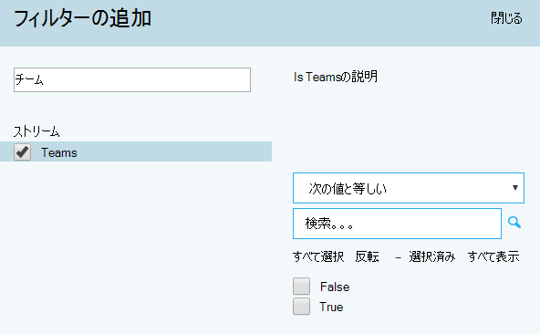

# <a name="quality-of-experience-review-guide"></a><span data-ttu-id="8f63b-103">レビュー ガイドの経験の質</span><span class="sxs-lookup"><span data-stu-id="8f63b-103">Quality of Experience Review Guide</span></span>

<span data-ttu-id="8f63b-104"><!-- Note that this link to the Word doc is intentionally NOT the aka.ms/qerquide link -->このガイドでは、マイクロソフトのチームとビジネス オンラインの Skype のドライブの値位相について。</span><span class="sxs-lookup"><span data-stu-id="8f63b-104"><!-- Note that this link to the Word doc is intentionally NOT the aka.ms/qerquide link --> This guide is about the Drive Value phase for Microsoft Teams and Skype for Business Online.</span></span> <span data-ttu-id="8f63b-105">このガイドの[Word のバージョンのダウンロード](https://github.com/MicrosoftDocs/OfficeDocs-SkypeForBusiness/blob/live/Teams/downloads/quality-of-experience-review-guide.docx?raw=true)を実行できます。</span><span class="sxs-lookup"><span data-stu-id="8f63b-105">You can [download a Word version](https://github.com/MicrosoftDocs/OfficeDocs-SkypeForBusiness/blob/live/Teams/downloads/quality-of-experience-review-guide.docx?raw=true) of this guide.</span></span>

## <a name="introduction"></a><span data-ttu-id="8f63b-106">はじめに</span><span class="sxs-lookup"><span data-stu-id="8f63b-106">Introduction</span></span>

<span data-ttu-id="8f63b-107">ユーザー エクスペリエンスの向上に大きな影響がある、組織は次の図に示されている主要な領域を運用する必要があります。</span><span class="sxs-lookup"><span data-stu-id="8f63b-107">To have the greatest impact on improving the user experience, organizations need to operationalize the key areas that are shown in the following figure.</span></span> <span data-ttu-id="8f63b-108">運用タスクを識別する、ターゲットの品質基準を確立するを使用して、組織の成功を測定する指標によって、必要に応じて、調査の領域を縮小、その他のエリアが含まれます。</span><span class="sxs-lookup"><span data-stu-id="8f63b-108">Additional areas include identifying operational tasks, establishing targets for quality metrics, ascertaining the metrics to use to gauge organizational success, and narrowing areas of investigation as needed.</span></span>


<span data-ttu-id="8f63b-109">![オーディオ、信頼性、ユーザー アンケート、デバイス、およびクライアントのユーザー エクスペリエンスの品質のキーの領域が含まれます]。(media/qerguide-image-keyareas.png "オーディオ、信頼性、ユーザー アンケート、デバイス、およびクライアントのユーザー エクスペリエンスの品質のキーの領域が含まれます")。</span><span class="sxs-lookup"><span data-stu-id="8f63b-109"></span></span>

<span data-ttu-id="8f63b-110">_図 1 - このガイドで対象となるキーの業務分野_</span><span class="sxs-lookup"><span data-stu-id="8f63b-110">_Figure 1 - Key operational areas covered throughout this guide_</span></span>

<span data-ttu-id="8f63b-111">によって継続的に評価し、このガイドで説明されている領域を得られるように、ユーザーのエクスペリエンスの品質に悪影響を与える可能性があるを減らすことができます。</span><span class="sxs-lookup"><span data-stu-id="8f63b-111">By continually assessing and remediating the areas described in this guide, you can reduce their potential to negatively affect the quality of your users’ experience.</span></span> <span data-ttu-id="8f63b-112">展開で発生したユーザー エクスペリエンスの問題の多くは、次のカテゴリに分類できます。</span><span class="sxs-lookup"><span data-stu-id="8f63b-112">Most user-experience problems encountered in a deployment can be grouped into the following categories:</span></span>

-   <span data-ttu-id="8f63b-113">不完全なファイアウォールまたはプロキシの構成</span><span class="sxs-lookup"><span data-stu-id="8f63b-113">Incomplete firewall or proxy configuration</span></span>
-   <span data-ttu-id="8f63b-114">Wifi カバレッジが低い</span><span class="sxs-lookup"><span data-stu-id="8f63b-114">Poor Wi-Fi coverage</span></span>
-   <span data-ttu-id="8f63b-115">十分な帯域幅</span><span class="sxs-lookup"><span data-stu-id="8f63b-115">Insufficient bandwidth</span></span>
-   <span data-ttu-id="8f63b-116">VPN</span><span class="sxs-lookup"><span data-stu-id="8f63b-116">VPN</span></span>
-   <span data-ttu-id="8f63b-117">一貫性のない、または古いクライアントのバージョンとドライバー</span><span class="sxs-lookup"><span data-stu-id="8f63b-117">Inconsistent or outdated client versions and drivers</span></span>
-   <span data-ttu-id="8f63b-118">最適化されていない、または組み込みのオーディオ デバイス</span><span class="sxs-lookup"><span data-stu-id="8f63b-118">Unoptimized or built-in audio devices</span></span>
-   <span data-ttu-id="8f63b-119">問題のあるサブネットまたはネットワーク デバイス</span><span class="sxs-lookup"><span data-stu-id="8f63b-119">Problematic subnets or network devices</span></span>

<span data-ttu-id="8f63b-120">適切な計画と設計チームや Skype のオンライン ビジネスの展開の前に、高品質のエクスペリエンスを維持するために必要な作業量を減らすことができます。</span><span class="sxs-lookup"><span data-stu-id="8f63b-120">Through proper planning and design before deploying Teams or Skype for Business Online, you can reduce the amount of effort that will be required to maintain high-quality experiences.</span></span>

<span data-ttu-id="8f63b-121">このガイドは、主要なツールとして呼び出し品質ダッシュ ボード (救難) オンラインを使用してオーディオを採用し、影響を最大化するために特別な重点を置きながら、各領域の調査、報告に焦点を当てます。</span><span class="sxs-lookup"><span data-stu-id="8f63b-121">This guide focuses on using the Call Quality Dashboard (CQD) Online as the primary tool to report and investigate each area, with a special emphasis on audio to maximize adoption and impact.</span></span> <span data-ttu-id="8f63b-122">オーディオ ・ エクスペリエンスを向上させるために、ネットワークに加えられたすべての改良は、ビデオ、およびデスクトップの共有の機能強化にも直接変換します。</span><span class="sxs-lookup"><span data-stu-id="8f63b-122">Any improvements made to the network to improve the audio experience will also directly translate to improvements in video and desktop sharing.</span></span>

<span data-ttu-id="8f63b-123">[Curated 救難の 2 つのテンプレート](https://aka.ms/qertemplates)が用意されている評価を促進する: 1 つは、すべてのネットワーク管理と管理 (内部) ネットワークの場合のみ、その他のフィルターは。</span><span class="sxs-lookup"><span data-stu-id="8f63b-123">To accelerate your assessment, [two curated CQD templates](https://aka.ms/qertemplates) are provided: one is for managing all networks and the other is filtered for managed (internal) networks only.</span></span> <span data-ttu-id="8f63b-124">構築およびネットワーク情報を表示するすべてのネットワーク ・ テンプレート ・ レポートの構成がまだ使えるを収集し、建物の情報をアップロードするための作業中に。</span><span class="sxs-lookup"><span data-stu-id="8f63b-124">Although the All Networks template reports are configured to display building and network information, they can still be used while you work toward collecting and uploading building information.</span></span> <span data-ttu-id="8f63b-125">建物救難に情報をアップロードするサブネットの外部から内部の区別をするときにカスタム構築、ネットワーク、および場所の情報を追加することによってレポートを強化するためにサービスを有効にします。</span><span class="sxs-lookup"><span data-stu-id="8f63b-125">Uploading building information into CQD enables the service to enhance reporting by adding custom building, network, and location information while differentiating internal from external subnets.</span></span> <span data-ttu-id="8f63b-126">詳細については、このガイドの[構成のマッピング](#building-mapping)を参照してください。</span><span class="sxs-lookup"><span data-stu-id="8f63b-126">For more information, see [Building mapping](#building-mapping) later in this guide.</span></span>

### <a name="intended-audience"></a><span data-ttu-id="8f63b-127">対象読者</span><span class="sxs-lookup"><span data-stu-id="8f63b-127">Intended audience</span></span>

<span data-ttu-id="8f63b-128">コラボレーションの潜在顧客と設計者、コンサルタント、変更管理と導入のスペシャ リスト、サポートとヘルプ デスクの潜在顧客、ネットワークの潜在顧客、デスクトップ潜在顧客、および IT 管理者などの役割を持つパートナーと顧客の関係者が使用するこのガイドが対象としています</span><span class="sxs-lookup"><span data-stu-id="8f63b-128">This guide is intended to be used by partner and customer stakeholders with roles such as Collaboration Lead/Architect, Consultant, Change Management/Adoption Specialist, Support/Help Desk Lead, Network Lead, Desktop Lead, and IT Admin.</span></span>

<span data-ttu-id="8f63b-129">このガイドは、指定した品質の champion(s) が使用するものではまた。</span><span class="sxs-lookup"><span data-stu-id="8f63b-129">This guide is also intended to be used by the designated quality champion(s).</span></span> <span data-ttu-id="8f63b-130">詳細については、[品質の支持者の役割](4-envision-plan-my-service-management.md#the-quality-champion-role)を参照してください。</span><span class="sxs-lookup"><span data-stu-id="8f63b-130">For more information, see [the Quality Champion role](4-envision-plan-my-service-management.md#the-quality-champion-role).</span></span>

## <a name="prerequisites"></a><span data-ttu-id="8f63b-131">前提条件</span><span class="sxs-lookup"><span data-stu-id="8f63b-131">Prerequisites</span></span>

<span data-ttu-id="8f63b-132">このガイドを使用する前に、救難をアクセスできるように、割り当てられた適切なテナント[の役割](https://support.office.com/article/About-Office-365-admin-roles-da585eea-f576-4f55-a1e0-87090b6aaa9d)があるを確認します。</span><span class="sxs-lookup"><span data-stu-id="8f63b-132">Before using this guide, make sure you have the proper tenant [roles](https://support.office.com/article/About-Office-365-admin-roles-da585eea-f576-4f55-a1e0-87090b6aaa9d) assigned so that you can access CQD.</span></span>

-   <span data-ttu-id="8f63b-133">**Office 365 のグローバル管理者ロール:** ビジネス用の Skype を含む計画で Office 365 のサービス群のすべての管理機能にアクセスします。</span><span class="sxs-lookup"><span data-stu-id="8f63b-133">**Office 365 Global Administrator role:** Accesses all administrative features in the Office 365 suite of services in your plan, including Skype for Business.</span></span>

-   <span data-ttu-id="8f63b-134">**Skype のビジネス管理者の役割:** 組織のビジネス用の Skype を構成し、Office 365 の管理センターのすべての[活動レポート](https://support.office.com/article/activity-reports-0d6dfb17-8582-4172-a9a9-aed798150263)を表示することがします。</span><span class="sxs-lookup"><span data-stu-id="8f63b-134">**Skype for Business Administrator role:** Configures Skype for Business for your organization and is able to view all the [activity reports](https://support.office.com/article/activity-reports-0d6dfb17-8582-4172-a9a9-aed798150263) in the Office 365 admin center.</span></span> <span data-ttu-id="8f63b-135">チームのみを配置した場合でも、このロールが必要です。</span><span class="sxs-lookup"><span data-stu-id="8f63b-135">This role is required even if you deploy only Teams.</span></span>

<span data-ttu-id="8f63b-136">または、レポート作成機能のみにアクセスできるようにするのには Office 365 のユーザー アカウントに次のロールを割り当てることができます。</span><span class="sxs-lookup"><span data-stu-id="8f63b-136">Alternatively, you can assign the following role to an Office 365 user account to allow access to reporting features only.</span></span>

-   <span data-ttu-id="8f63b-137">**リーダーの報告:** Office 365 の管理センターの[コンテンツ パックを Office 365 の導入](https://support.office.com/article/Office-365-Adoption-content-pack-77ff780d-ab19-4553-adea-09cb65ad0f1f)からのレポート、救難のレポートですべての[アクティビティのレポート](https://support.office.com/article/activity-reports-0d6dfb17-8582-4172-a9a9-aed798150263)を表示できます。</span><span class="sxs-lookup"><span data-stu-id="8f63b-137">**Reports Reader:** Can view all the [activity reports](https://support.office.com/article/activity-reports-0d6dfb17-8582-4172-a9a9-aed798150263) in the Office 365 admin center, any reports from the [Office 365 Adoption content pack](https://support.office.com/article/Office-365-Adoption-content-pack-77ff780d-ab19-4553-adea-09cb65ad0f1f), and CQD reports.</span></span>

## <a name="what-is-quality"></a><span data-ttu-id="8f63b-138">品質とは何ですか。</span><span class="sxs-lookup"><span data-stu-id="8f63b-138">What is quality?</span></span>

<span data-ttu-id="8f63b-139">チームとビジネス用の Skype の品質についての説明をすることが重要共通の認識を達成するために用語を定義します。</span><span class="sxs-lookup"><span data-stu-id="8f63b-139">When discussing quality in Teams and Skype for Business, it’s important to define the term to achieve a common understanding.</span></span> <span data-ttu-id="8f63b-140">品質、ここでは、定義されているサービス測定基準およびユーザー エクスペリエンスの組み合わせでは。</span><span class="sxs-lookup"><span data-stu-id="8f63b-140">Quality, as defined here, is a combination of service metrics and user experience.</span></span>

<span data-ttu-id="8f63b-141"><!-- Note: need to update graphic-->
![サービス メトリックスは、不適切なストリームの比率を信頼性、エンドポイントとデバイス、およびクライアントのバージョンで構成されています。ユーザー エクスペリエンスは、ユーザー側から見たサービスの品質で構成されています]。(media/qerguide-image-whatisquality.png "サービス メトリックスは、不適切なストリームの比率を信頼性、エンドポイントとデバイス、およびクライアントのバージョンで構成されています。ユーザー エクスペリエンスは、ユーザー側から見たサービスの品質で構成されています")。</span><span class="sxs-lookup"><span data-stu-id="8f63b-141"><!-- Note: need to update graphic-->
</span></span>

<span data-ttu-id="8f63b-142">_図 2 - 品質とは何ですか。_</span><span class="sxs-lookup"><span data-stu-id="8f63b-142">_Figure 2 - What is quality?_</span></span>

### <a name="service-metrics"></a><span data-ttu-id="8f63b-143">サービス メトリックス</span><span class="sxs-lookup"><span data-stu-id="8f63b-143">Service metrics</span></span>

<span data-ttu-id="8f63b-144">サービス メトリックスは、特定のクライアント ベースの測定値で構成されます。</span><span class="sxs-lookup"><span data-stu-id="8f63b-144">Service metrics consist of specific client-based metrics.</span></span> <span data-ttu-id="8f63b-145">呼び出すたびに、中には、クライアントは、呼び出しに関する遠隔測定の情報を収集し、救難や[分析機能の呼び出し](https://techcommunity.microsoft.com/t5/Skype-for-Business-Blog/Introducing-Call-Analytics/ba-p/57309)を後でアクセスできる各呼び出しの最後にレポートを送信します。</span><span class="sxs-lookup"><span data-stu-id="8f63b-145">During each call, the client collects telemetry information about the call and submits a report at the end of each call that can be later accessed through CQD or [Call Analytics](https://techcommunity.microsoft.com/t5/Skype-for-Business-Blog/Introducing-Call-Analytics/ba-p/57309).</span></span> <span data-ttu-id="8f63b-146">これらの測定基準は次のとおりです。</span><span class="sxs-lookup"><span data-stu-id="8f63b-146">These metrics include:</span></span>

-   <span data-ttu-id="8f63b-147">ストリームの低下率</span><span class="sxs-lookup"><span data-stu-id="8f63b-147">Poor Stream Rate</span></span>
-   <span data-ttu-id="8f63b-148">セットアップ エラーの発生率</span><span class="sxs-lookup"><span data-stu-id="8f63b-148">Setup Failure Rate</span></span>
-   <span data-ttu-id="8f63b-149">エラーの発生率をドロップします。</span><span class="sxs-lookup"><span data-stu-id="8f63b-149">Drop Failure Rate</span></span>


#### <a name="poor-stream-rate"></a><span data-ttu-id="8f63b-150">ストリームの低下率</span><span class="sxs-lookup"><span data-stu-id="8f63b-150">Poor Stream Rate</span></span>

<span data-ttu-id="8f63b-151">ストリームの低下率 (PSR) は、組織の低品質のストリームの全体に対する割合を表します。</span><span class="sxs-lookup"><span data-stu-id="8f63b-151">The poor stream rate (PSR) represents the organization’s overall percentage of streams that have poor quality.</span></span> <span data-ttu-id="8f63b-152">このメトリックは、組織が最も強力な影響がこの値を小さくして、その理由は、ユーザーの操作性を向上させるために労力を集中できる領域を強調表示するのには、PSR を見ると、主な目的は、[ネットワークを管理](#managed-vs-unmanaged-networks)します。</span><span class="sxs-lookup"><span data-stu-id="8f63b-152">This metric is meant to highlight areas where your organization can concentrate effort to have the strongest impact toward reducing this value and improving the user experience, which is why [managed networks](#managed-vs-unmanaged-networks) are the primary focus when looking at PSR.</span></span> <span data-ttu-id="8f63b-153">外部ユーザーは、重要ですが、調査は、組織ごとに異なります。</span><span class="sxs-lookup"><span data-stu-id="8f63b-153">External users are important too, but investigation differs on an organizational basis.</span></span> <span data-ttu-id="8f63b-154">外部のユーザーに対して、ベスト ・ プラクティスを提供することを検討し、組織全体とは別の外部の呼び出しを調査します。</span><span class="sxs-lookup"><span data-stu-id="8f63b-154">Consider providing best practices for external users, and investigate external calls independently from the overall organization.</span></span>

<span data-ttu-id="8f63b-155">救難の実際の測定値がワークロードによって異なりますが、品質の経験の確認のために_オーディオの低下率_の測定で主に説明します。</span><span class="sxs-lookup"><span data-stu-id="8f63b-155">The actual measurement in CQD varies by workload, but for the purposes of the Quality Experience Review we focus primarily on the _Audio Poor Percentage_ measurement.</span></span> <span data-ttu-id="8f63b-156">PSR は次の表に記載されている 5 つのネットワーク メトリック平均で構成されています。</span><span class="sxs-lookup"><span data-stu-id="8f63b-156">PSR is made up of the five network metric averages described in the following table.</span></span> <span data-ttu-id="8f63b-157">低下として分類されるためのストリーム、メトリックが 1 つだけ定義されているしきい値を超えている必要があります。</span><span class="sxs-lookup"><span data-stu-id="8f63b-157">For a stream to be classified as poor, only one metric needs to exceed the defined threshold.</span></span> <span data-ttu-id="8f63b-158">ストリームのクラス分けプロセスの詳細については、[この資料](stream-classification-in-call-quality-dashboard.md)を参照してください。</span><span class="sxs-lookup"><span data-stu-id="8f63b-158">For more information about the stream classification process, see [this article](stream-classification-in-call-quality-dashboard.md).</span></span>

> [!Note]
> <span data-ttu-id="8f63b-159">救難には、「低下する...」が用意されています。</span><span class="sxs-lookup"><span data-stu-id="8f63b-159">CQD provides the “Poor Due To…”</span></span> <span data-ttu-id="8f63b-160">測定値は、どのような条件の原因となった悪いとして分類されるストリームを理解します。</span><span class="sxs-lookup"><span data-stu-id="8f63b-160">measurements to better understand what condition caused the stream to be classified as poor.</span></span>


<span data-ttu-id="8f63b-161">_表 1 - 低いサービス メトリックス_</span><span class="sxs-lookup"><span data-stu-id="8f63b-161">_Table 1 - Poor service metrics_</span></span>

| <span data-ttu-id="8f63b-162">指標の平均値</span><span class="sxs-lookup"><span data-stu-id="8f63b-162">Metric average</span></span>     | <span data-ttu-id="8f63b-163">説明</span><span class="sxs-lookup"><span data-stu-id="8f63b-163">Description</span></span>     | <span data-ttu-id="8f63b-164">ユーザー エクスペリエンス</span><span class="sxs-lookup"><span data-stu-id="8f63b-164">User experience</span></span> |
|-------------|-----------------|-----------------|
| <span data-ttu-id="8f63b-165">ジッター \>30 ミリ秒</span><span class="sxs-lookup"><span data-stu-id="8f63b-165">Jitter \>30 ms</span></span>        | <span data-ttu-id="8f63b-166">これは、連続するパケットの遅延時間の平均の変更です。</span><span class="sxs-lookup"><span data-stu-id="8f63b-166">This is the average change in delay between successive packets.</span></span> <span data-ttu-id="8f63b-167">チームやビジネス用の Skype は、ジッター バッファーからのいくつかのレベルに適応できます。</span><span class="sxs-lookup"><span data-stu-id="8f63b-167">Teams and Skype for Business can adapt to some levels of jitter through buffering.</span></span> <span data-ttu-id="8f63b-168">だけ変位を超えた場合、バッファリングの参加者がジッタの影響を通知することをお勧めします。</span><span class="sxs-lookup"><span data-stu-id="8f63b-168">It’s only when the jitter exceeds the buffering that a participant notices the effects of jitter.</span></span>      | <span data-ttu-id="8f63b-169">異なる速度で到着するパケットには、ロボットの音を再生するのには、スピーカーの音声が発生します。</span><span class="sxs-lookup"><span data-stu-id="8f63b-169">The packets arriving at different speeds cause a speaker’s voice to sound robotic.</span></span>   |
| <span data-ttu-id="8f63b-170">パケット損失率\>10% または 0.1</span><span class="sxs-lookup"><span data-stu-id="8f63b-170">Packet loss rate \>10% or 0.1</span></span>        | <span data-ttu-id="8f63b-171">これは多くの場合、失われたパケットの割合として定義されます。</span><span class="sxs-lookup"><span data-stu-id="8f63b-171">This is often defined as a percentage of packets that are lost.</span></span> <span data-ttu-id="8f63b-172">パケットが失われる音質に直接影響 — から小規模で個人消失したパケットを連続バースト損失への影響がほとんどないその原因のオーディオを完全にカットします。</span><span class="sxs-lookup"><span data-stu-id="8f63b-172">Packet loss directly affects audio quality—from small, individual lost packets that have almost no impact to back-to-back burst losses that cause audio to cut out completely.</span></span>     | <span data-ttu-id="8f63b-173">目的地にドロップしていない到着をされているパケットには、ビデオ、および共有メディア、進入復行の音節と単語、結果と動作が不安定でギャップが発生します。</span><span class="sxs-lookup"><span data-stu-id="8f63b-173">The packets being dropped and not arriving at their intended destination cause gaps in the media, resulting in missed syllables and words, and choppy video and sharing.</span></span> |
| <span data-ttu-id="8f63b-174">往復時間\>500 ms</span><span class="sxs-lookup"><span data-stu-id="8f63b-174">Round-trip time \>500 ms</span></span>        | <span data-ttu-id="8f63b-175">これは、b、A 点に戻ると、A 点から IP パケットを取得するのにかかる時間このネットワーク伝播遅延は、2 つの点と光の速度との間の物理的な距離に関連付けられてし、ネットワーク パスにさまざまなデバイスで実行される追加のオーバーヘッドが含まれています。</span><span class="sxs-lookup"><span data-stu-id="8f63b-175">This is the time it takes to get an IP packet from point A to point B and back to point A. This network propagation delay is tied to the physical distance between the two points and the speed of light, and includes additional overhead taken by the various devices in the network path.</span></span>      | <span data-ttu-id="8f63b-176">時間がかかりすぎて、目的地に到着するパケットには、walkie-talkie 効果があります。</span><span class="sxs-lookup"><span data-stu-id="8f63b-176">The packets taking too long to arrive at their destination cause a walkie-talkie effect.</span></span>   |
| <span data-ttu-id="8f63b-177">NMOS の低下の平均値\>1.0</span><span class="sxs-lookup"><span data-stu-id="8f63b-177">NMOS degradation average \>1.0</span></span>         | <span data-ttu-id="8f63b-178">ストリームの平均[ネットワーク意味意見スコア (NMOS)](https://docs.microsoft.com/previous-versions/office/communications-server/bb894481(v=office.12)#network-mos)が低下します。</span><span class="sxs-lookup"><span data-stu-id="8f63b-178">Average [Network Mean Opinion Score (NMOS)](https://docs.microsoft.com/previous-versions/office/communications-server/bb894481(v=office.12)#network-mos) degradation for the stream.</span></span> <span data-ttu-id="8f63b-179">どのくらいネットワーク損失と揺れに影響している 2 つ以上のポイントを削除する NMOS の原因となった受信したオーディオの品質を表します。</span><span class="sxs-lookup"><span data-stu-id="8f63b-179">Represents how much the network loss and jitter has affected the quality of received audio that caused the NMOS to drop by more than one point.</span></span> | <span data-ttu-id="8f63b-180">ジッター、パケット損失の組み合わせは、これと -ほど-往復応答時間が増加します。</span><span class="sxs-lookup"><span data-stu-id="8f63b-180">This is a combination of jitter, packet loss, and—to a lesser degree—increased round-trip time.</span></span> <span data-ttu-id="8f63b-181">ユーザーには、これらの現象の組み合わせが発生している可能性があります。</span><span class="sxs-lookup"><span data-stu-id="8f63b-181">The user might be experiencing a combination of these symptoms.</span></span>   |
| <span data-ttu-id="8f63b-182">非表示の文字列のサンプルの平均比率\>7% または「0.07」</span><span class="sxs-lookup"><span data-stu-id="8f63b-182">Average ratio of concealed samples \>7% or 0.07</span></span> | <span data-ttu-id="8f63b-183">パケット損失のオーディオ フレームの合計数を治療によって生成される非表示の文字列のサンプルでのオーディオ フレームの数の平均の比率です。</span><span class="sxs-lookup"><span data-stu-id="8f63b-183">Average ratio of the number of audio frames with concealed samples generated by packet loss healing to the total number of audio frames.</span></span> <span data-ttu-id="8f63b-184">隠しオーディオ サンプルは、破棄されたネットワーク パケットによって発生する通常の急激な遷移を除去するために使用される手法です。</span><span class="sxs-lookup"><span data-stu-id="8f63b-184">A concealed audio sample is a technique used to smooth out the abrupt transition that would usually be caused by dropped network packets.</span></span>      | <span data-ttu-id="8f63b-185">高い値では、損失補填の重要なレベルが適用され、結果、オーディオがゆがんでいる、または失われたことを示します。</span><span class="sxs-lookup"><span data-stu-id="8f63b-185">High values indicate that significant levels of loss concealment were applied and resulted in distorted or lost audio.</span></span>     |

#### <a name="setup-failure-rate"></a><span data-ttu-id="8f63b-186">セットアップ エラーの発生率</span><span class="sxs-lookup"><span data-stu-id="8f63b-186">Setup Failure Rate</span></span>

<span data-ttu-id="8f63b-187">救難、_呼び出しのセットアップ失敗割合の合計_の数値とも呼ばれる、セットアップの障害発生率は、呼び出しの開始時にエンドポイント間でメディアのパスを確立することができませんでしたあるストリームの数です。</span><span class="sxs-lookup"><span data-stu-id="8f63b-187">The setup failure rate, otherwise known as the _Total Call Setup Failure Percentage_ measurement in CQD, is the number of streams where the media path couldn’t be established between the endpoints at the start of the call.</span></span>

<span data-ttu-id="8f63b-188">これは、確立することができませんでした任意のメディア ストリームを表します。</span><span class="sxs-lookup"><span data-stu-id="8f63b-188">This represents any media stream that couldn’t be established.</span></span> <span data-ttu-id="8f63b-189">影響の重大度を指定すると、ここで測定されるユーザー エクスペリエンスで、目標は、この値を小さくと可能な限りゼロに近いします。</span><span class="sxs-lookup"><span data-stu-id="8f63b-189">Given the severity of the impact on the user experience measured here, the goal is to reduce this value to as close to zero as possible.</span></span> <span data-ttu-id="8f63b-190">このメトリックの値が高いより完成度の高い配置では、不完全なファイアウォール規則の新しい展開で一般的なが、定期的に監視することも重要です。</span><span class="sxs-lookup"><span data-stu-id="8f63b-190">A high value for this metric is more common in new deployments with incomplete firewall rules than a mature deployment, but it’s still important to watch on a regular basis.</span></span>

<span data-ttu-id="8f63b-191">このメトリックは、呼び出しの成功の詳細記録 (CDR) を送信するストリームの合計数で割った値設定するのには失敗したストリームの合計数を取得して計算されます。</span><span class="sxs-lookup"><span data-stu-id="8f63b-191">This metric is calculated by taking the total number of streams that failed to set up divided by the total number of streams that submitted a successful call detail record (CDR):</span></span>

-   <span data-ttu-id="8f63b-192">**セットアップの障害発生率**= 合計呼び出しセットアップの障害が発生したストリームの数と合計の CDR が利用可能なストリームの数</span><span class="sxs-lookup"><span data-stu-id="8f63b-192">**Setup Failure Rate** = Total Call Setup Failed Stream Count / Total CDR Available Stream Count</span></span>

#### <a name="drop-failure-rate"></a><span data-ttu-id="8f63b-193">エラーの発生率をドロップします。</span><span class="sxs-lookup"><span data-stu-id="8f63b-193">Drop Failure Rate</span></span>

<span data-ttu-id="8f63b-194">救難、_呼び出す削除失敗割合の合計_の数値とも呼ばれる、ドロップの障害発生率は、正常に確立されたストリームのメディアのパスが正常に終了していない場所の割合です。</span><span class="sxs-lookup"><span data-stu-id="8f63b-194">The drop failure rate, otherwise known as the _Total Call Dropped Failure Percentage_ measurement in CQD, is the percentage of successfully established streams where the media path didn’t terminate normally.</span></span>

<span data-ttu-id="8f63b-195">これは、予期せずに終了するあらゆるメディア ストリームを表します。</span><span class="sxs-lookup"><span data-stu-id="8f63b-195">This represents any media stream that terminated unexpectedly.</span></span> <span data-ttu-id="8f63b-196">これの影響は、セットアップに失敗したストリームと同様に大きい、それに悪影響を及ぼすユーザー エクスペリエンスです。</span><span class="sxs-lookup"><span data-stu-id="8f63b-196">Although the impact of this isn’t as severe as a stream that failed to set up, it will negatively affect the user experience.</span></span> <span data-ttu-id="8f63b-197">突然、頻繁にメディアの削除だけでなくことが重大な影響を受けるユーザー エクスペリエンスでは、原因であることに再接続するにはユーザーの生産性の損失の結果としています。</span><span class="sxs-lookup"><span data-stu-id="8f63b-197">Sudden and frequent media drops not only can have a severe impact on the user experience, they result in the need for users to reconnect, resulting in a loss in productivity.</span></span>

<span data-ttu-id="8f63b-198">メトリックを計算するには、ドロップされたストリームが正常に設定するストリームの合計数で割った値の合計数を取得します。</span><span class="sxs-lookup"><span data-stu-id="8f63b-198">The metric is calculated by taking the total number of dropped streams divided by the total count of streams that set up successfully:</span></span>

-   <span data-ttu-id="8f63b-199">**エラーの発生率をドロップ**= 合計呼び出しストリームの数を削除すると合計呼び出しのセットアップには、ストリームの数が成功しました。</span><span class="sxs-lookup"><span data-stu-id="8f63b-199">**Drop Failure Rate** = Total Call Dropped Stream Count / Total Call Setup Succeeded Stream Count</span></span>

### <a name="define-your-target-metrics"></a><span data-ttu-id="8f63b-200">ターゲットの基準を定義します。</span><span class="sxs-lookup"><span data-stu-id="8f63b-200">Define your target metrics</span></span>

<span data-ttu-id="8f63b-201">このセクションでは、サービスが発生する正常性の評価に使用する主要なサービス測定基準の一部について説明します。</span><span class="sxs-lookup"><span data-stu-id="8f63b-201">This section discusses some of the core service metrics that we use to assess how services experience health.</span></span> <span data-ttu-id="8f63b-202">継続的に評価する、定義済みのターゲットの下のこれらの測定値を保持する取り組みを推進は、ユーザーが一貫した、信頼性の高い通話品質を発生することを確認してみましょう。</span><span class="sxs-lookup"><span data-stu-id="8f63b-202">By continually assessing and driving efforts to keep these metrics below their defined targets, you’ll help ensure that your users experience consistent, reliable call quality.</span></span> <span data-ttu-id="8f63b-203">撮影を開始するには、次のターゲットが用意されています。</span><span class="sxs-lookup"><span data-stu-id="8f63b-203">To get you started, the following targets are provided.</span></span>

<span data-ttu-id="8f63b-204">_表 2 - コア ・ ターゲット状態の評価指標_</span><span class="sxs-lookup"><span data-stu-id="8f63b-204">_Table 2 - Core target health assessment metrics_</span></span>
<table>
<tr>
<th rowspan="2" colspan="2" valign="center"><span data-ttu-id="8f63b-205">[ネットワークの種類]</span><span class="sxs-lookup"><span data-stu-id="8f63b-205">Network type</span></span></th><th rowspan="1"><span data-ttu-id="8f63b-206">品質目標</span><span class="sxs-lookup"><span data-stu-id="8f63b-206">Quality targets</span></span></th><th colspan="2"><span data-ttu-id="8f63b-207">信頼性の目標</span><span class="sxs-lookup"><span data-stu-id="8f63b-207">Reliability targets</span></span></th></tr>
<tr><th><span data-ttu-id="8f63b-208">不適切なオーディオのストリーミング速度</span><span class="sxs-lookup"><span data-stu-id="8f63b-208">Audio Poor Stream Rate</span></span></th><th><span data-ttu-id="8f63b-209">セットアップ エラーの発生率</span><span class="sxs-lookup"><span data-stu-id="8f63b-209">Setup Failure Rate</span></span></th><th><span data-ttu-id="8f63b-210">エラーの発生率をドロップします。</span><span class="sxs-lookup"><span data-stu-id="8f63b-210">Drop Failure Rate</span></span></th></tr>
<tr><td rowspan="2"><span data-ttu-id="8f63b-211">**すべての**</span><span class="sxs-lookup"><span data-stu-id="8f63b-211">**All**</span></span></td><td><span data-ttu-id="8f63b-212">内部</span><span class="sxs-lookup"><span data-stu-id="8f63b-212">Internal</span></span></td><td><span data-ttu-id="8f63b-213">2.0%</span><span class="sxs-lookup"><span data-stu-id="8f63b-213">2.0%</span></span></td><td><span data-ttu-id="8f63b-214">0.5%</span><span class="sxs-lookup"><span data-stu-id="8f63b-214">0.5%</span></span></td><td><span data-ttu-id="8f63b-215">2.0%</span><span class="sxs-lookup"><span data-stu-id="8f63b-215">2.0%</span></span></td></tr>
<tr><td><span data-ttu-id="8f63b-216">全体</span><span class="sxs-lookup"><span data-stu-id="8f63b-216">Overall</span></span></td><td><span data-ttu-id="8f63b-217">3.0%</span><span class="sxs-lookup"><span data-stu-id="8f63b-217">3.0%</span></span></td><td><span data-ttu-id="8f63b-218">1.0%</span><span class="sxs-lookup"><span data-stu-id="8f63b-218">1.0%</span></span></td><td><span data-ttu-id="8f63b-219">3.0%</span><span class="sxs-lookup"><span data-stu-id="8f63b-219">3.0%</span></span></td></tr>
<tr><td rowspan="5"><span data-ttu-id="8f63b-220">**会議**</span><span class="sxs-lookup"><span data-stu-id="8f63b-220">**Conferencing**</span></span></td><td><span data-ttu-id="8f63b-221">内部</span><span class="sxs-lookup"><span data-stu-id="8f63b-221">Internal</span></span></td><td><span data-ttu-id="8f63b-222">2.0%</span><span class="sxs-lookup"><span data-stu-id="8f63b-222">2.0%</span></span></td><td><span data-ttu-id="8f63b-223">0.5%</span><span class="sxs-lookup"><span data-stu-id="8f63b-223">0.5%</span></span></td><td><span data-ttu-id="8f63b-224">2.0%</span><span class="sxs-lookup"><span data-stu-id="8f63b-224">2.0%</span></span></td></tr>
<tr><td><span data-ttu-id="8f63b-225">内部のワイヤード (有線)</span><span class="sxs-lookup"><span data-stu-id="8f63b-225">Wired internal</span></span></td><td><span data-ttu-id="8f63b-226">1.0%</span><span class="sxs-lookup"><span data-stu-id="8f63b-226">1.0%</span></span></td><td><span data-ttu-id="8f63b-227">0.5%</span><span class="sxs-lookup"><span data-stu-id="8f63b-227">0.5%</span></span></td><td><span data-ttu-id="8f63b-228">1.0%</span><span class="sxs-lookup"><span data-stu-id="8f63b-228">1.0%</span></span></td></tr>
<tr><td><span data-ttu-id="8f63b-229">Wi-fi 5 GHz の内部</span><span class="sxs-lookup"><span data-stu-id="8f63b-229">Wi-Fi 5 GHz internal</span></span></td><td><span data-ttu-id="8f63b-230">1.0%</span><span class="sxs-lookup"><span data-stu-id="8f63b-230">1.0%</span></span></td><td><span data-ttu-id="8f63b-231">0.5%</span><span class="sxs-lookup"><span data-stu-id="8f63b-231">0.5%</span></span></td><td><span data-ttu-id="8f63b-232">1.0%</span><span class="sxs-lookup"><span data-stu-id="8f63b-232">1.0%</span></span></td></tr>
<tr><td><span data-ttu-id="8f63b-233">Wi-fi 2.4 GHz の内部</span><span class="sxs-lookup"><span data-stu-id="8f63b-233">Wi-Fi 2.4 GHz internal</span></span></td><td><span data-ttu-id="8f63b-234">4.0%</span><span class="sxs-lookup"><span data-stu-id="8f63b-234">4.0%</span></span></td><td><span data-ttu-id="8f63b-235">0.5%</span><span class="sxs-lookup"><span data-stu-id="8f63b-235">0.5%</span></span></td><td><span data-ttu-id="8f63b-236">2.0%</span><span class="sxs-lookup"><span data-stu-id="8f63b-236">2.0%</span></span></td></tr>
<tr><td><span data-ttu-id="8f63b-237">全体</span><span class="sxs-lookup"><span data-stu-id="8f63b-237">Overall</span></span></td><td><span data-ttu-id="8f63b-238">2.0%</span><span class="sxs-lookup"><span data-stu-id="8f63b-238">2.0%</span></span></td><td><span data-ttu-id="8f63b-239">0.5%</span><span class="sxs-lookup"><span data-stu-id="8f63b-239">0.5%</span></span></td><td><span data-ttu-id="8f63b-240">3.0%</span><span class="sxs-lookup"><span data-stu-id="8f63b-240">3.0%</span></span></td></tr>
<tr><td rowspan="4"><span data-ttu-id="8f63b-241">**P2P**</span><span class="sxs-lookup"><span data-stu-id="8f63b-241">**P2P**</span></span></td><td><span data-ttu-id="8f63b-242">内部</span><span class="sxs-lookup"><span data-stu-id="8f63b-242">Internal</span></span></td><td><span data-ttu-id="8f63b-243">2.0%</span><span class="sxs-lookup"><span data-stu-id="8f63b-243">2.0%</span></span></td><td><span data-ttu-id="8f63b-244">0.5%</span><span class="sxs-lookup"><span data-stu-id="8f63b-244">0.5%</span></span></td><td><span data-ttu-id="8f63b-245">2.0%</span><span class="sxs-lookup"><span data-stu-id="8f63b-245">2.0%</span></span></td></tr>
<tr><td><span data-ttu-id="8f63b-246">ワイヤード (有線) または Wi-fi 5 GHz の内部</span><span class="sxs-lookup"><span data-stu-id="8f63b-246">Wired/Wi-Fi 5 GHz internal</span></span></td><td><span data-ttu-id="8f63b-247">1.0%</span><span class="sxs-lookup"><span data-stu-id="8f63b-247">1.0%</span></span></td><td><span data-ttu-id="8f63b-248">0.5%</span><span class="sxs-lookup"><span data-stu-id="8f63b-248">0.5%</span></span></td><td><span data-ttu-id="8f63b-249">1.0%</span><span class="sxs-lookup"><span data-stu-id="8f63b-249">1.0%</span></span></td></tr>
<tr><td><span data-ttu-id="8f63b-250">ワイヤード (有線) または Wi-fi 5 GHz の全体的です</span><span class="sxs-lookup"><span data-stu-id="8f63b-250">Wired/Wi-Fi 5 GHz overall</span></span></td><td><span data-ttu-id="8f63b-251">2.0%</span><span class="sxs-lookup"><span data-stu-id="8f63b-251">2.0%</span></span></td><td><span data-ttu-id="8f63b-252">1.0%</span><span class="sxs-lookup"><span data-stu-id="8f63b-252">1.0%</span></span></td><td><span data-ttu-id="8f63b-253">1.0%</span><span class="sxs-lookup"><span data-stu-id="8f63b-253">1.0%</span></span></td></tr>
<tr><td><span data-ttu-id="8f63b-254">全体</span><span class="sxs-lookup"><span data-stu-id="8f63b-254">Overall</span></span></td><td><span data-ttu-id="8f63b-255">2.0%</span><span class="sxs-lookup"><span data-stu-id="8f63b-255">2.0%</span></span></td><td><span data-ttu-id="8f63b-256">1.0%</span><span class="sxs-lookup"><span data-stu-id="8f63b-256">1.0%</span></span></td><td><span data-ttu-id="8f63b-257">3.0%</span><span class="sxs-lookup"><span data-stu-id="8f63b-257">3.0%</span></span></td></tr>
</table>


<span data-ttu-id="8f63b-258">について説明し、お客様のビジネス目標を満たすために、組織の目標を定義するに重要です。</span><span class="sxs-lookup"><span data-stu-id="8f63b-258">It's important to discuss and define your organization’s targets to meet your business objectives.</span></span>

### <a name="user-experience"></a><span data-ttu-id="8f63b-259">ユーザー エクスペリエンス</span><span class="sxs-lookup"><span data-stu-id="8f63b-259">User experience</span></span>

<span data-ttu-id="8f63b-260">科学よりも多くのアートは、ユーザーの操作性の分析、測定値がここで得られたためネットワークまたはサービスの問題があるではなく、単にそれぞれのユーザーが問題を認識していることを意味しない常にします。</span><span class="sxs-lookup"><span data-stu-id="8f63b-260">Analyzing the user experience is more art than science, because the metrics gathered here don’t always mean that there’s a problem with the network or service but rather, they simply indicate that the user perceives a problem.</span></span> <span data-ttu-id="8f63b-261">マイクロソフトは、組み込みの調査方法を提供しています-としてレート自分を呼び出す (RMC) を呼ばれる-全体的なユーザー エクスペリエンスの測定に役立つようにします。</span><span class="sxs-lookup"><span data-stu-id="8f63b-261">Microsoft offers a built-in survey mechanism—known as Rate My Call (RMC)—to help gauge overall user experience.</span></span> <span data-ttu-id="8f63b-262">RMC では、ユーザーの観点から次の質問に回答できます。</span><span class="sxs-lookup"><span data-stu-id="8f63b-262">RMC will help you answer the following questions from your users’ perspective:</span></span>

-   <span data-ttu-id="8f63b-263">ソリューションを使用する方法を知っていますか。</span><span class="sxs-lookup"><span data-stu-id="8f63b-263">Do I know how to use the solution?</span></span>
-   <span data-ttu-id="8f63b-264">使いやすく、直感的なソリューションし、は、日常的なコミュニケーションのニーズをサポートしますか。</span><span class="sxs-lookup"><span data-stu-id="8f63b-264">Is the solution easy to use and intuitive, and does it support my day-to-day communication needs?</span></span>
-   <span data-ttu-id="8f63b-265">ソリューションに役立つ自分の業務を遂行しますか。</span><span class="sxs-lookup"><span data-stu-id="8f63b-265">Does the solution help me get my job done?</span></span>
-   <span data-ttu-id="8f63b-266">ソリューションの私の全体的な認識とは何ですか。</span><span class="sxs-lookup"><span data-stu-id="8f63b-266">What’s my overall perception of the solution?</span></span>
-   <span data-ttu-id="8f63b-267">使用できるソリューションの任意の時点で私は場所に関係なく、時間でしょうか。</span><span class="sxs-lookup"><span data-stu-id="8f63b-267">Can I use the solution at any point in time, regardless of where I am?</span></span>
-   <span data-ttu-id="8f63b-268">設定し、呼び出しを管理できますか。</span><span class="sxs-lookup"><span data-stu-id="8f63b-268">Can I set up and maintain a call?</span></span>

#### <a name="rate-my-call"></a><span data-ttu-id="8f63b-269">私の呼び出しを評価します。</span><span class="sxs-lookup"><span data-stu-id="8f63b-269">Rate My Call</span></span> 

<span data-ttu-id="8f63b-270">レート自分を呼び出す (RMC) はチームやビジネス用の Skype に組み込まれているし、10 個の呼び出し、または 10% ごとに 1 つの後、参加者に表示するのには自動的に構成します。</span><span class="sxs-lookup"><span data-stu-id="8f63b-270">Rate My Call (RMC) is built into Teams and Skype for Business and is automatically configured to be displayed to the participant after one in every 10 calls, or 10 percent.</span></span> <span data-ttu-id="8f63b-271">この簡単なアンケートでは、呼び出しを評価し、なぜ、通話の音質がありますが不十分の少ないコンテキストを提供するユーザーを確認します。</span><span class="sxs-lookup"><span data-stu-id="8f63b-271">This brief survey asks the user to rate the call and provide a little context for why the call quality might have been poor.</span></span> <span data-ttu-id="8f63b-272">1 つまたは 2 つの評価が低いと見なされます、3 ~ 4 が良いとは優れた 5。</span><span class="sxs-lookup"><span data-stu-id="8f63b-272">A one or two rating is considered poor, three to four is good, and five is excellent.</span></span> <span data-ttu-id="8f63b-273">ですが、多少の遅れが生じているインジケーターが、これは、サービス メトリックスを見逃すことがある問題を明らかに便利なメトリックです。</span><span class="sxs-lookup"><span data-stu-id="8f63b-273">Although it’s somewhat of a lagging indicator, this is a useful metric for uncovering issues that service metrics can miss.</span></span>

> [!Note]
> <span data-ttu-id="8f63b-274">ユーザーは通常、不良、応答だけでなく適切なフィードバックを与えることで、RMC のアンケートに返信する教育を受けるまでが圧倒的負の値として返されます。</span><span class="sxs-lookup"><span data-stu-id="8f63b-274">Until users are educated to respond to RMC surveys by giving good feedback in addition to bad, responses typically come back as overwhelmingly negative.</span></span> <span data-ttu-id="8f63b-275">ほとんどのユーザーは、通話の音質が低い場合にのみ応答します。</span><span class="sxs-lookup"><span data-stu-id="8f63b-275">Most users only respond when call quality is poor.</span></span> <span data-ttu-id="8f63b-276">このためはサービスのメトリックは、適切な中であってもに、RMC のレポートが低い側にゆがむ可能性があります。</span><span class="sxs-lookup"><span data-stu-id="8f63b-276">Because of this, your RMC reports might be skewed to the poor side even while service metrics are good.</span></span>

<span data-ttu-id="8f63b-277">救難を使用するには、RMC のユーザーの応答を報告して、救難テンプレートのサンプル レポートは含まれています。</span><span class="sxs-lookup"><span data-stu-id="8f63b-277">You can use CQD to report on RMC user responses, and sample reports are included in the CQD template.</span></span> <span data-ttu-id="8f63b-278">ただし、このガイドで詳しく説明していません。</span><span class="sxs-lookup"><span data-stu-id="8f63b-278">However, they aren’t discussed in detail in this guide.</span></span> <span data-ttu-id="8f63b-279">RMC の有用な応答を提供するユーザーを教育するためのガイダンスおよびオンライン ビジネスの Skype で RMC の詳細については、[このブログの投稿](https://blogs.technet.microsoft.com/jenstr/2015/05/05/rate-my-call-in-skype-for-business-2015/)を参照してください。</span><span class="sxs-lookup"><span data-stu-id="8f63b-279">For more information about RMC in Skype for Business Online and guidance for educating users to give useful RMC responses, see [this blog post](https://blogs.technet.microsoft.com/jenstr/2015/05/05/rate-my-call-in-skype-for-business-2015/).</span></span>

#### <a name="client-and-device-readiness"></a><span data-ttu-id="8f63b-280">クライアントとデバイスの準備</span><span class="sxs-lookup"><span data-stu-id="8f63b-280">Client and device readiness</span></span>

<span data-ttu-id="8f63b-281">ユーザーに一貫性があり、正のユーザーの経験があることを確実に強固なクライアントとデバイスの戦略が必要です。</span><span class="sxs-lookup"><span data-stu-id="8f63b-281">You need a solid client and device strategy to help ensure that your users have a consistent and positive user experience.</span></span> <span data-ttu-id="8f63b-282">いくつか重要な原則では、各対応戦略を推進します。</span><span class="sxs-lookup"><span data-stu-id="8f63b-282">A few key principles drive each readiness strategy.</span></span>

##### <a name="client-readiness"></a><span data-ttu-id="8f63b-283">クライアントの準備</span><span class="sxs-lookup"><span data-stu-id="8f63b-283">Client readiness</span></span>

<span data-ttu-id="8f63b-284">強力なクライアントの準備方法は、ユーザーが維持したまま、最高の経験では、最新バージョンのクライアント実行されているようにします。</span><span class="sxs-lookup"><span data-stu-id="8f63b-284">A strong client readiness strategy ensures that your users are running the most recent version of the client while enjoying the best experience possible.</span></span> <span data-ttu-id="8f63b-285">マイクロソフトは、ビジネス クライアント用の Skype を日常的にパッチします。保持すること、環境内の最新の状態を確保する、企業全体の成功に不可欠です。</span><span class="sxs-lookup"><span data-stu-id="8f63b-285">Microsoft routinely patches the Skype for Business client; ensuring that you keep it up to date in your environment is vital to your overall success.</span></span> <span data-ttu-id="8f63b-286">見落とされがちなされ、ユーザーのエクスペリエンスに影響を与えることができますので USB、ドライバーおよびオーディオ ドライバーは、ビデオ、修正プログラムのネットワークに注意してくださいもできます。</span><span class="sxs-lookup"><span data-stu-id="8f63b-286">It’s also important to remember to patch network, video, USB, and audio drivers, because they’re often overlooked and can affect the user’s experience.</span></span> <span data-ttu-id="8f63b-287">ネットワーク、Wi-fi、ビデオ、USB の追加を検討し、オーディオ ドライバー、現在の修正プログラム管理プロセスをします。</span><span class="sxs-lookup"><span data-stu-id="8f63b-287">Consider adding network, Wi-Fi, video, USB, and audio drivers to your current patch management process.</span></span>

<span data-ttu-id="8f63b-288">6 か月以上遅れることに、クライアントのバージョンをしないようにすることをお勧めします。</span><span class="sxs-lookup"><span data-stu-id="8f63b-288">We recommend that you not let your client versions fall behind by more than six months.</span></span> <span data-ttu-id="8f63b-289">Office のクイック実行を使用している場合をしている既にされている最新サービスによって。</span><span class="sxs-lookup"><span data-stu-id="8f63b-289">If you’re using Office Click-to-Run, you’re already being kept up to date by the service.</span></span> <span data-ttu-id="8f63b-290">このガイドで後述するようにこのプロセスを支援する含まれている[クライアントのバージョン](#client-versions)を使用します。</span><span class="sxs-lookup"><span data-stu-id="8f63b-290">Use the included [client versions](#client-versions), as described later in this guide, to assist you with this process.</span></span> <span data-ttu-id="8f63b-291">レート [呼び出しのサンプル レポート、クライアントの対応戦略を強化するためにも活用できます。</span><span class="sxs-lookup"><span data-stu-id="8f63b-291">You can also leverage the Rate My Call sample reports to further enhance your client readiness strategy.</span></span>

> [!IMPORTANT]
> <span data-ttu-id="8f63b-292">チームのクライアントが現在、分散、Azure コンテンツ配信ネットワークを自動的に更新が保持する最新サービスとします。</span><span class="sxs-lookup"><span data-stu-id="8f63b-292">Currently, Teams clients are distributed and updated automatically through the Azure Content Delivery Network and will be kept up to date by the service.</span></span> <span data-ttu-id="8f63b-293">このため、クライアントの準備と調査活動チームには適用されません。</span><span class="sxs-lookup"><span data-stu-id="8f63b-293">Due to this, client readiness and investigative activities aren’t applicable to Teams.</span></span>


##### <a name="device-readiness"></a><span data-ttu-id="8f63b-294">デバイスの準備</span><span class="sxs-lookup"><span data-stu-id="8f63b-294">Device readiness</span></span>

<span data-ttu-id="8f63b-295">1 つ 1 つの戦略は、ユーザーの操作性よりも、デバイスの準備方法に影響しません。</span><span class="sxs-lookup"><span data-stu-id="8f63b-295">No one single strategy can affect the user experience more than your device readiness strategy.</span></span> <span data-ttu-id="8f63b-296">ほとんどの組織は、ユーザー (たとえば、デスク携帯電話またはその他の専用のオーディオ デバイス) の不要なデバイスを削除するのには満足し、チームやビジネス用の Skype への切り替えに関する主要な業務の妥当性は多くの場合。</span><span class="sxs-lookup"><span data-stu-id="8f63b-296">Most organizations are happy to remove unnecessary devices (for example, desk phones or other dedicated audio devices) from users, and this is often a core business justification for switching to Teams or Skype for Business.</span></span> <span data-ttu-id="8f63b-297">ただし、これらの組織は同じ場合もありますお交換用のデバイスを提供する場合でも、これらのデバイスは、低コスト。</span><span class="sxs-lookup"><span data-stu-id="8f63b-297">However, those same organizations sometimes hesitate to provide replacement devices, even if those devices are less expensive.</span></span> <span data-ttu-id="8f63b-298">今日のラップトップと Pc では、内蔵マイクとスピーカー、装備もは用に最適化されたビジネス クラスのボイス オーバー IP (VoIP)。</span><span class="sxs-lookup"><span data-stu-id="8f63b-298">Modern-day laptops and PCs, though equipped with built-in microphone and speaker, aren’t optimized for business-class voice over IP (VoIP).</span></span> <span data-ttu-id="8f63b-299">これは、多くの場合は不十分な経験すべての参加者の雑音の多い環境では、スピーカーの場合は特に</span><span class="sxs-lookup"><span data-stu-id="8f63b-299">This often creates a poor experience for all participants, especially if the speaker is in a noisy environment.</span></span> <span data-ttu-id="8f63b-300">マイクロソフトのデバイスの認定プログラムは、チームやビジネス用の Skype の認定デバイスを使用して、電話の呼び出しでユーザーが参加すると、それが生成されることに認定されていないデバイスよりも優れた操作性を保証します。</span><span class="sxs-lookup"><span data-stu-id="8f63b-300">Microsoft’s device certification program ensures that when a user participates in a phone call by using any device certified for Teams or Skype for Business, it produces an experience that’s superior to a non-certified device.</span></span> 

<span data-ttu-id="8f63b-301">あるチームとビジネス ユーザーの Skype を使用して、認定ヘッドセットまたはスピーカー デスクトップ クライアントからの音声通話に参加しているときに常にお勧めします。</span><span class="sxs-lookup"><span data-stu-id="8f63b-301">We always recommend that Teams and Skype for Business users use a certified headset or speaker when participating in a voice call through the desktop client.</span></span> <span data-ttu-id="8f63b-302">マイクロソフト認定のデバイスの詳細については、[認定プログラム](/SkypeForBusiness/certification/overview)に関する以下の資料を確認して[パートナー ・ ソリューション ・ カタログ](https://partnersolutions.skypeforbusiness.com/solutionscatalog/personal-peripherals-pcs)を表示します。</span><span class="sxs-lookup"><span data-stu-id="8f63b-302">For more information about Microsoft certified devices, review these articles about the [certification program](/SkypeForBusiness/certification/overview) and view the [partner solutions catalog](https://partnersolutions.skypeforbusiness.com/solutionscatalog/personal-peripherals-pcs).</span></span> <span data-ttu-id="8f63b-303">[デバイスのレポート](#devices)で、デバイスを管理する方法について、このガイドの後半で説明を使用します。</span><span class="sxs-lookup"><span data-stu-id="8f63b-303">Use the [Devices report](#devices), described later in this guide, for assistance with managing your devices.</span></span>


### <a name="categories-of-quality"></a><span data-ttu-id="8f63b-304">品質のカテゴリ</span><span class="sxs-lookup"><span data-stu-id="8f63b-304">Categories of quality</span></span>

<span data-ttu-id="8f63b-305">高品質で信頼性の高い展開を任せていますの成功は、ビル運用の厳密さによって異なります。</span><span class="sxs-lookup"><span data-stu-id="8f63b-305">The success of operationalizing a high-quality and reliable deployment depends on your building operational rigor.</span></span> <span data-ttu-id="8f63b-306">具体的には、3 つのカテゴリを次の図に示すように特別な注意を払うこのガイドの主な目的があります。</span><span class="sxs-lookup"><span data-stu-id="8f63b-306">Specifically, pay special attention to the three categories illustrated in the following figure; these are the focus of this guide:</span></span>

-   <span data-ttu-id="8f63b-307">**ネットワーク:** オーディオの品質が低いストリーム比 (PSR) メトリック、TCP の使用状況、ワイヤード (有線) とワイヤレスのサブネットに重点を置いて、HTTP プロキシと VPN の使用を識別します。</span><span class="sxs-lookup"><span data-stu-id="8f63b-307">**Network:** Audio quality focused on the Poor Stream Ratio (PSR) metric, TCP usage, wired and wireless subnets, and identifying the use of HTTP proxies and VPN.</span></span>

-   <span data-ttu-id="8f63b-308">**エンドポイント:** オーディオ デバイスとクライアントのバージョン (Skype ビジネスのみ)。</span><span class="sxs-lookup"><span data-stu-id="8f63b-308">**Endpoints:** Audio devices and client versions (Skype for Business only).</span></span>

-   <span data-ttu-id="8f63b-309">**サービス管理:** このカテゴリには、2 つのセクションが構成されています。</span><span class="sxs-lookup"><span data-stu-id="8f63b-309">**Service Management:** This category comprises two sections:</span></span>

    -   <span data-ttu-id="8f63b-310">最初は、管理およびビジネスのオンライン サービスが、チームと Skype を維持するマイクロソフトの責任です。</span><span class="sxs-lookup"><span data-stu-id="8f63b-310">First is Microsoft’s responsibility to manage and maintain the Teams and Skype for Business Online services.</span></span>

    -   <span data-ttu-id="8f63b-311">建物の情報を更新し、インフラストラクチャがサービスに追加されると、新しい Office 365 の IP アドレスにファイアウォールを維持するなど、サービスへのアクセスを信頼できることを確認するのには、組織を管理する必要がありますタスクは、2 つ目。</span><span class="sxs-lookup"><span data-stu-id="8f63b-311">Second are tasks your organization must manage to ensure reliable access to the service, such as updating building information and maintaining firewalls for new Office 365 IP addresses as infrastructure is added to the service.</span></span>

<span data-ttu-id="8f63b-312">![組織内の品質のカテゴリ: 管理、エンドポイント、およびネットワーク サービスを提供します]。(media/qerguide-image-categories.png "組織内の品質のカテゴリ: 管理、エンドポイント、およびネットワーク サービスを提供します")。</span><span class="sxs-lookup"><span data-stu-id="8f63b-312"></span></span>

<span data-ttu-id="8f63b-313">_図 3 - チームと Skype のオンライン ビジネスの展開の重要なカテゴリ_</span><span class="sxs-lookup"><span data-stu-id="8f63b-313">_Figure 3 - Critical categories for Teams and Skype for Business Online deployment_</span></span>

<span data-ttu-id="8f63b-314">次の図では、カテゴリごとに実行する必要があるタスクについて説明します。</span><span class="sxs-lookup"><span data-stu-id="8f63b-314">The following graphic outlines the tasks you must execute for each category.</span></span> <span data-ttu-id="8f63b-315">実行することこれらのタスクを毎週 1 回、最低限をお勧めします。</span><span class="sxs-lookup"><span data-stu-id="8f63b-315">We recommend that you run these tasks once a week, at a minimum.</span></span>

<span data-ttu-id="8f63b-316">最初にこれらのタスクを実行するにはこれらのカテゴリの多くと、展開の構成を検証することが必要とするため、以降のイテレーションでは、以上の作業になります。</span><span class="sxs-lookup"><span data-stu-id="8f63b-316">The first time you perform these tasks will take more effort than subsequent iterations, because many of these categories require that you validate your deployment configurations.</span></span> <span data-ttu-id="8f63b-317">定義されているターゲットを達成する状態を実現した後、これらのタスクを実行して、その状態を維持できます。</span><span class="sxs-lookup"><span data-stu-id="8f63b-317">After you’ve achieved the state you want by meeting the targets you’ve defined, performing these tasks will help you maintain that state.</span></span>

<span data-ttu-id="8f63b-318"><!--  This is a net new graphic, never was included in the online article. OOPS! -->
</span><span class="sxs-lookup"><span data-stu-id="8f63b-318"><!--  This is a net new graphic, never was included in the online article. OOPS! -->
</span></span>

#### <a name="service-management-tasks"></a><span data-ttu-id="8f63b-319">サービス管理タスク</span><span class="sxs-lookup"><span data-stu-id="8f63b-319">Service management tasks</span></span>

<span data-ttu-id="8f63b-320">最初のクラウドの世界では、高品質のユーザー エクスペリエンスを維持するために特定のサービス管理タスクを実行する必要があります。</span><span class="sxs-lookup"><span data-stu-id="8f63b-320">In a cloud-first world, you must perform certain service management tasks to maintain high-quality user experiences.</span></span> <span data-ttu-id="8f63b-321">これらのタスクの範囲は、管理されたネットワーク上のすべての領域には、そのサービスの品質 (QoS) を検証する、インターネット リンクが飽和せず、サービスに到達するための十分な帯域幅を確保して、最後に-上の Office 365 の IP 範囲は[を熟知していることファイアウォール](https://aka.ms/o365ips)。</span><span class="sxs-lookup"><span data-stu-id="8f63b-321">These tasks range from ensuring there is sufficient bandwidth to reach the service without saturating internet links, validating that quality of service (QoS) is in place on all managed network areas, and—lastly—staying on top of [Office 365 IP ranges on firewalls](https://aka.ms/o365ips).</span></span>

#### <a name="network-tasks"></a><span data-ttu-id="8f63b-322">ネットワーク タスク</span><span class="sxs-lookup"><span data-stu-id="8f63b-322">Network tasks</span></span>

<span data-ttu-id="8f63b-323">ネットワークのタスクの 2 つのカテゴリがあります: 信頼性と品質。</span><span class="sxs-lookup"><span data-stu-id="8f63b-323">There are two categories of network tasks: reliability and quality.</span></span> <span data-ttu-id="8f63b-324">信頼性は、呼び出しを正常に行うし、接続を維持するユーザーの能力を測定することに重点を置いています。</span><span class="sxs-lookup"><span data-stu-id="8f63b-324">Reliability focuses on measuring the user’s ability to make calls successfully and stay connected.</span></span> <span data-ttu-id="8f63b-325">品質は、チームと Skype をビジネス オンラインのクライアントによって送信されたユーザーの呼び出し中に、終了すると、集約された「遠隔測定」について説明します。</span><span class="sxs-lookup"><span data-stu-id="8f63b-325">Quality focuses on the aggregated telemetry sent to Teams and Skype for Business Online by the user’s client during the call and after it has ended.</span></span> 

<span data-ttu-id="8f63b-326">ユーザーの操作性で信頼性のある重要な影響を与えることが重要ですを開始するのには評価し、品質を説明する前にこれらの指標を調査します。</span><span class="sxs-lookup"><span data-stu-id="8f63b-326">Given the critical impact that reliability has on the user experience, it’s important to begin assessing and investigating those metrics before diving into quality.</span></span> 

#### <a name="endpoints-tasks"></a><span data-ttu-id="8f63b-327">エンドポイントのタスク</span><span class="sxs-lookup"><span data-stu-id="8f63b-327">Endpoints tasks</span></span>

<span data-ttu-id="8f63b-328">このカテゴリの主なタスクは、最後の 6 か月に、ユーザーは、Skype のビジネス デスクトップのクライアントに対する継続的な最適化の利点を取得することを確認してから、デスクトップ ビルドでビジネス用の Skype を実行しているクライアントのバージョンを検証しています。</span><span class="sxs-lookup"><span data-stu-id="8f63b-328">The main task in this category is validating which client versions are running Skype for Business on desktop builds from the last six months, to ensure users are getting the benefit of the continual optimizations made to the Skype for Business desktop client.</span></span> <span data-ttu-id="8f63b-329">この全体的なクライアントの管理作業を効率化また、一貫したユーザー エクスペリエンスを提供します。</span><span class="sxs-lookup"><span data-stu-id="8f63b-329">Additionally, this simplifies overall client management tasks and provides a consistent user experience.</span></span>

<span data-ttu-id="8f63b-330">その他の重要な領域がデバイスは、展開で普及しているかを監視し、最高のユーザー エクスペリエンスを提供する認定済みのデバイスの使用を促進します。</span><span class="sxs-lookup"><span data-stu-id="8f63b-330">The other important area is monitoring which devices are prevalent in your deployment and driving the use of certified devices to provide the best user experience.</span></span>


> [!IMPORTANT]
> <span data-ttu-id="8f63b-331">チームのクライアントが現在、分散、Azure コンテンツ配信ネットワークを自動的に更新が保持する最新サービスとします。</span><span class="sxs-lookup"><span data-stu-id="8f63b-331">Currently, Teams clients are distributed and updated automatically through the Azure Content Delivery Network and will be kept up to date by the service.</span></span> <span data-ttu-id="8f63b-332">クライアントの準備と調査活動は、チームには適用されません。</span><span class="sxs-lookup"><span data-stu-id="8f63b-332">Client readiness and investigative activities aren’t applicable to Teams.</span></span>

## <a name="cqd-basics"></a><span data-ttu-id="8f63b-333">救難の基本</span><span class="sxs-lookup"><span data-stu-id="8f63b-333">CQD basics</span></span>

<span data-ttu-id="8f63b-334">このセクションでは、救難の操作の基礎について説明します。</span><span class="sxs-lookup"><span data-stu-id="8f63b-334">This section describes the fundamentals of working with CQD.</span></span> <span data-ttu-id="8f63b-335">ガイダンスは次のトピックでは、与えられました。</span><span class="sxs-lookup"><span data-stu-id="8f63b-335">Guidance is given for the following topics:</span></span>

-   <span data-ttu-id="8f63b-336">救難とは何ですか。</span><span class="sxs-lookup"><span data-stu-id="8f63b-336">What is CQD?</span></span>
-   <span data-ttu-id="8f63b-337">救難を使用しての期待</span><span class="sxs-lookup"><span data-stu-id="8f63b-337">Expectations using CQD</span></span>
-   <span data-ttu-id="8f63b-338">テナント ID を検索します。</span><span class="sxs-lookup"><span data-stu-id="8f63b-338">Finding your tenant ID</span></span>
-   <span data-ttu-id="8f63b-339">ビジネスの Skype ではなく、マイクロソフトのチームの報告</span><span class="sxs-lookup"><span data-stu-id="8f63b-339">Reporting on Microsoft Teams versus Skype for Business</span></span>
-   <span data-ttu-id="8f63b-340">最初の 2 つ目の分類との比較</span><span class="sxs-lookup"><span data-stu-id="8f63b-340">First versus second classifications</span></span>
-   <span data-ttu-id="8f63b-341">ディメンション、メジャー、およびフィルター</span><span class="sxs-lookup"><span data-stu-id="8f63b-341">Dimensions, measures, and filters</span></span>
-   <span data-ttu-id="8f63b-342">ストリームの呼び出しではなく</span><span class="sxs-lookup"><span data-stu-id="8f63b-342">Streams versus calls</span></span>
-   <span data-ttu-id="8f63b-343">良い、悪い、および未分類の呼び出し</span><span class="sxs-lookup"><span data-stu-id="8f63b-343">Good, poor, and unclassified calls</span></span>
-   <span data-ttu-id="8f63b-344">共通のサブネット</span><span class="sxs-lookup"><span data-stu-id="8f63b-344">Common subnets</span></span>

<span data-ttu-id="8f63b-345">詳細なトレーニングとリソースについては、[付録](#other-resources)を参照してください。</span><span class="sxs-lookup"><span data-stu-id="8f63b-345">For more in-depth training and resources, see the [Appendix](#other-resources).</span></span>

### <a name="what-is-cqd"></a><span data-ttu-id="8f63b-346">救難とは何ですか。</span><span class="sxs-lookup"><span data-stu-id="8f63b-346">What is CQD?</span></span>

<span data-ttu-id="8f63b-347">呼び出し品質ダッシュ ボード (救難) を使用するには、ビジネス ・ サービスのチームと Skype を使用して行われた通話の品質を把握します。</span><span class="sxs-lookup"><span data-stu-id="8f63b-347">You use the Call Quality Dashboard (CQD) to gain insight into the quality of calls made by using Teams and Skype for Business services.</span></span> <span data-ttu-id="8f63b-348">救難、Skype をビジネスおよびチームの管理者のために設計されていて、ネットワーク ・ エンジニアは、ネットワークを最適化し、品質、信頼性、およびユーザーの操作性に注目します。</span><span class="sxs-lookup"><span data-stu-id="8f63b-348">CQD is designed to help Skype for Business and Teams admins and network engineers optimize the network and keep a close eye on quality, reliability, and the user experience.</span></span> <span data-ttu-id="8f63b-349">救難は、組織全体の集計の遠隔測定、全体的なパターンが明らかになります、スタッフが十分な情報に基づいて評価を行い、計画への影響を最大化するための改善活動をできるようにします。</span><span class="sxs-lookup"><span data-stu-id="8f63b-349">CQD looks at aggregate telemetry for an entire organization where overall patterns can become apparent, allowing staff to make informed assessments and plan remediation activities to maximize impact.</span></span> <span data-ttu-id="8f63b-350">救難には、全体的な品質、信頼性、およびユーザー エクスペリエンスへの洞察を提供する測定基準のレポートが用意されています。</span><span class="sxs-lookup"><span data-stu-id="8f63b-350">CQD provides reports of metrics that provide insight into overall quality, reliability, and user experience.</span></span>

> [!Note]
> <span data-ttu-id="8f63b-351">救難には、個人を特定できる情報 (PII) が含まれていません。</span><span class="sxs-lookup"><span data-stu-id="8f63b-351">CQD doesn’t contain any personally identifiable information (PII).</span></span> <span data-ttu-id="8f63b-352">個人情報は、使用できる独自に、またはその他の情報を識別、取引先担当者、または 1 人のユーザーを検索するか、コンテキスト内の個人を識別する情報です。</span><span class="sxs-lookup"><span data-stu-id="8f63b-352">PII is information that can be used on its own or with other information to identify, contact, or locate a single person, or to identify an individual in context.</span></span>

<span data-ttu-id="8f63b-353">このガイドはビジネス オンラインのチームと Skype のユーザーの満足度の向上で行うことができますへの影響を最大限に高めるために救難の中核となる概念を理解するうえで役立ちます。</span><span class="sxs-lookup"><span data-stu-id="8f63b-353">This guide will help in understanding the core concepts of CQD to help maximize the impact you can make in improving your users’ experience with Teams or Skype for Business Online.</span></span> <span data-ttu-id="8f63b-354">救難の他のリソースは、[付録](#other-resources)を参照しています。</span><span class="sxs-lookup"><span data-stu-id="8f63b-354">Additional CQD resources can be found in the [Appendix](#other-resources).</span></span>

### <a name="expectations-using-cqd"></a><span data-ttu-id="8f63b-355">救難を使用しての期待</span><span class="sxs-lookup"><span data-stu-id="8f63b-355">Expectations using CQD</span></span>

<span data-ttu-id="8f63b-356">救難、サブネット、傾向の分析には役立ちますが常に提供しません原因を特定の特定のシナリオ。</span><span class="sxs-lookup"><span data-stu-id="8f63b-356">CQD, although useful for analyzing trends and subnets, doesn’t always provide a specific cause for a given scenario.</span></span> <span data-ttu-id="8f63b-357">これを理解し、救難を使用する場合は、適切な期待を設定する必要があります。</span><span class="sxs-lookup"><span data-stu-id="8f63b-357">It’s important to understand this and set the correct expectation when using CQD:</span></span>

-   <span data-ttu-id="8f63b-358">救難は、シナリオごとに根本的な原因を提供しません。</span><span class="sxs-lookup"><span data-stu-id="8f63b-358">CQD won’t provide the root cause for every scenario.</span></span>
-   <span data-ttu-id="8f63b-359">救難は、電話回線や電話会議のストリームを含めることはありません。</span><span class="sxs-lookup"><span data-stu-id="8f63b-359">CQD won’t contain Phone System or Audio Conferencing streams.</span></span>
-   <span data-ttu-id="8f63b-360">救難の傾向に基づいて、さらなる調査領域を呼び出します。</span><span class="sxs-lookup"><span data-stu-id="8f63b-360">CQD will call out areas for further investigation based on trends.</span></span>
-   <span data-ttu-id="8f63b-361">救難には、すべての PII が含まれていません。</span><span class="sxs-lookup"><span data-stu-id="8f63b-361">CQD doesn’t contain any PII.</span></span>

### <a name="report-editions"></a><span data-ttu-id="8f63b-362">レポートのエディション</span><span class="sxs-lookup"><span data-stu-id="8f63b-362">Report editions</span></span>

<span data-ttu-id="8f63b-363">救難オンラインの 2 つのレポートのエディションがある: 概要および詳細。</span><span class="sxs-lookup"><span data-stu-id="8f63b-363">There are two report editions in CQD Online: Summary and Detailed.</span></span> <span data-ttu-id="8f63b-364">画面の上部にある青色のバー内にあるドロップ ダウン メニューを使用して、レポートの版を開きます。</span><span class="sxs-lookup"><span data-stu-id="8f63b-364">Use the drop-down menu located in the blue bar at the top of the screen to open a report edition.</span></span> <span data-ttu-id="8f63b-365">画面の上部には、選択したレポートの発行物の名前が表示されます。</span><span class="sxs-lookup"><span data-stu-id="8f63b-365">The name of the selected report edition is displayed at the top of the screen.</span></span>

-   <span data-ttu-id="8f63b-366">サマリー ・ レポートは、静的なダウンロードされた、またはエクスポートされた、編集することはできません。</span><span class="sxs-lookup"><span data-stu-id="8f63b-366">Summary reports are static and can’t be edited, downloaded, or exported.</span></span> 
-   <span data-ttu-id="8f63b-367">詳細なレポートは、完全にカスタマイズ可能な CSV ファイルにエクスポート、またはクローンを作成するダウンロードすることができます。</span><span class="sxs-lookup"><span data-stu-id="8f63b-367">Detailed reports are fully customizable and can be downloaded to a CSV file, exported, or cloned.</span></span>

<span data-ttu-id="8f63b-368">2 つのエディションの違いの詳細については、[この資料](turning-on-and-using-call-quality-dashboard.md)を参照してください。</span><span class="sxs-lookup"><span data-stu-id="8f63b-368">For a full description of the difference between the two editions, see [this article](turning-on-and-using-call-quality-dashboard.md).</span></span>


<span data-ttu-id="8f63b-370">_図 4 - 救難レポートのカテゴリ_</span><span class="sxs-lookup"><span data-stu-id="8f63b-370">_Figure 4 - CQD report categories_</span></span>

<span data-ttu-id="8f63b-371">サマリー レポートは、4 つのカテゴリに分けられます。</span><span class="sxs-lookup"><span data-stu-id="8f63b-371">The summary reports are divided into four categories:</span></span>

-   <span data-ttu-id="8f63b-372">日単位、月単位、および品質の低下をあるサブネットを識別するためのテーブルのレポートで、品質の傾向の分析にフォーカスの**概要のレポート**です。</span><span class="sxs-lookup"><span data-stu-id="8f63b-372">**Summary Reports** focus on analyzing quality trends with daily, monthly, and table reports to assist with identifying subnets that have poor quality.</span></span> <span data-ttu-id="8f63b-373">これは、まず救難オンラインにサインインするときの既定のランディング ・ ページです。</span><span class="sxs-lookup"><span data-stu-id="8f63b-373">This is the default landing page when you first sign in to CQD Online.</span></span>
-   <span data-ttu-id="8f63b-374">**Location-Enhanced レポート**焦点位置情報に基づく品質の傾向を分析します。</span><span class="sxs-lookup"><span data-stu-id="8f63b-374">**Location-Enhanced Reports** focus on analyzing quality trends based on location information.</span></span> <span data-ttu-id="8f63b-375">これらのレポートを使用するには、必要がありますアップロードしたファイルを作成します。</span><span class="sxs-lookup"><span data-stu-id="8f63b-375">To use these reports, you must have uploaded a building file.</span></span>
-   <span data-ttu-id="8f63b-376">オーディオ、ビデオ、ビデオ ・ ベースの画面の共有 (VBSS)、およびアプリケーション共有の信頼性の傾向の分析にフォーカスの**信頼性に関するレポート**です。</span><span class="sxs-lookup"><span data-stu-id="8f63b-376">**Reliability Reports** focus on analyzing reliability trends for audio, video, video-based screen sharing (VBSS), and app sharing.</span></span>
-   <span data-ttu-id="8f63b-377">**経験レポートの品質**は、オーディオの品質と信頼性を分析するための主要分野に重点を置いて、"縮小"のバージョン詳細 QER テンプレートでは、です。</span><span class="sxs-lookup"><span data-stu-id="8f63b-377">**Quality of Experience Reports** are a “slimmed-down” version of the detailed QER templates, focusing on key areas for analyzing audio quality and reliability.</span></span>

### <a name="report-types"></a><span data-ttu-id="8f63b-378">レポートの種類</span><span class="sxs-lookup"><span data-stu-id="8f63b-378">Report types</span></span>

<span data-ttu-id="8f63b-379">救難のレポートによって、データを表示する方法の 2 種類から選択できます。</span><span class="sxs-lookup"><span data-stu-id="8f63b-379">You can choose from two types of reports in CQD, depending on how you want to view your data.</span></span> <span data-ttu-id="8f63b-380">このガイドでは、別のレポートの 1 つのタイプの作成の詳細をカバーしていません、QER 救難テンプレートは、使用するカスタマイズ可能なチャートとテーブルのレポートの両方を提供します。</span><span class="sxs-lookup"><span data-stu-id="8f63b-380">Although this guide doesn’t cover the specifics of creating one type of report over another, the QER CQD templates provide a mix of customizable chart and table reports for you to use:</span></span>

-   <span data-ttu-id="8f63b-381">グラフ ・ レポートでは、視覚的な形式のデータを表すバー グラフを作成します。</span><span class="sxs-lookup"><span data-stu-id="8f63b-381">Chart reports create graphical bar charts to represent data in a visual format.</span></span> <span data-ttu-id="8f63b-382">グラフ ・ レポートは、指定された期間にわたってデータを視覚化するのには適しています。</span><span class="sxs-lookup"><span data-stu-id="8f63b-382">Chart reports are best used to visualize data over a given time period.</span></span>
-   <span data-ttu-id="8f63b-383">テーブルのレポートは、レポートを Microsoft Excel で操作するための CSV ファイルにエクスポートすると、個々 の測定と寸法見るに便利です。</span><span class="sxs-lookup"><span data-stu-id="8f63b-383">Table reports are useful for looking at individual measurements and dimensions when you export the reports to CSV files for manipulation in Microsoft Excel.</span></span>

### <a name="tenant-id"></a><span data-ttu-id="8f63b-384">Tenant ID</span><span class="sxs-lookup"><span data-stu-id="8f63b-384">Tenant ID</span></span>

<span data-ttu-id="8f63b-385">救難レポートは、テナント ID にフィルターを含めることを必要としています。</span><span class="sxs-lookup"><span data-stu-id="8f63b-385">Some CQD reports require that you include a filter for your tenant ID.</span></span> <span data-ttu-id="8f63b-386">救難データを集計する方法、連携参加者の「遠隔測定」が含まれています。</span><span class="sxs-lookup"><span data-stu-id="8f63b-386">Due to the way CQD aggregates data, federated participant telemetry is included.</span></span> <span data-ttu-id="8f63b-387">このことは貴重な傾向を分析する場合、クライアントとデバイスのレポートでは、フェデレーション参加者の「遠隔測定」を除外するのには特定のテナント データをフィルター処理すること必要があります。</span><span class="sxs-lookup"><span data-stu-id="8f63b-387">Although this can prove valuable when analyzing trends, client and device reports require that you filter data to a specific tenant to exclude federated participant telemetry.</span></span> <span data-ttu-id="8f63b-388">テナント ID がわからない場合検索するのには次の方法のいずれかを使用できます。</span><span class="sxs-lookup"><span data-stu-id="8f63b-388">If you don’t know your tenant ID, you can use one of the following methods to find it.</span></span>

> [!Note]
> <span data-ttu-id="8f63b-389">これらのメソッドには、次のアクセス許可が必要です。</span><span class="sxs-lookup"><span data-stu-id="8f63b-389">These methods require the following permissions:</span></span><ul><li><span data-ttu-id="8f63b-390">グローバル管理者ロール</span><span class="sxs-lookup"><span data-stu-id="8f63b-390">Global Administrator Role</span></span></li><li><span data-ttu-id="8f63b-391">ビジネス管理者の役割の Skype</span><span class="sxs-lookup"><span data-stu-id="8f63b-391">Skype for Business Administrator Role</span></span></li></ul>

#### <a name="azure-portal"></a><span data-ttu-id="8f63b-392">Azure ポータル</span><span class="sxs-lookup"><span data-stu-id="8f63b-392">Azure portal</span></span>

1.  <span data-ttu-id="8f63b-393">Microsoft Azure ポータルにサインインします。<https://portal.azure.com></span><span class="sxs-lookup"><span data-stu-id="8f63b-393">Sign in to the Microsoft Azure portal: <https://portal.azure.com></span></span>

2.  <span data-ttu-id="8f63b-394">**Azure Active Directory**を選択します。</span><span class="sxs-lookup"><span data-stu-id="8f63b-394">Select **Azure Active Directory**.</span></span>

3.  <span data-ttu-id="8f63b-395">[**管理**] で [**プロパティ**] を選択します。</span><span class="sxs-lookup"><span data-stu-id="8f63b-395">Under **Manage**, select **Properties**.</span></span> <span data-ttu-id="8f63b-396">Tenant ID は、**ディレクトリ ID** ] ボックスに表示されます。</span><span class="sxs-lookup"><span data-stu-id="8f63b-396">The tenant ID is shown in the **Directory ID** box.</span></span>

#### <a name="azure-powershell"></a><span data-ttu-id="8f63b-397">Azure PowerShell</span><span class="sxs-lookup"><span data-stu-id="8f63b-397">Azure PowerShell</span></span>

1.  <span data-ttu-id="8f63b-398">[Microsoft Azure PowerShell のサービスの管理モジュールをインストール](https://docs.microsoft.com/powershell/azure/servicemanagement/install-azure-ps?view=azuresmps-4.0.0)します。</span><span class="sxs-lookup"><span data-stu-id="8f63b-398">[Install the Microsoft Azure PowerShell Service Management module](https://docs.microsoft.com/powershell/azure/servicemanagement/install-azure-ps?view=azuresmps-4.0.0).</span></span>

2.  <span data-ttu-id="8f63b-399">Azure の PowerShell コマンド ウィンドウを開くしが表示されたら、Office 365 の資格情報を入力する、次のスクリプトを実行します。</span><span class="sxs-lookup"><span data-stu-id="8f63b-399">Open an Azure PowerShell command window and run the following script, entering your Office 365 credentials when prompted:</span></span> 

  ```
  Login-AzureRmAccount
  ```

3.  <span data-ttu-id="8f63b-400">Tenant ID は、出力に表示されます。</span><span class="sxs-lookup"><span data-stu-id="8f63b-400">The tenant ID is listed in the output.</span></span>

#### <a name="skype-for-business-online-admin-center"></a><span data-ttu-id="8f63b-401">Skype ビジネス オンライン管理センターの</span><span class="sxs-lookup"><span data-stu-id="8f63b-401">Skype for Business Online Admin Center</span></span>

1.  <span data-ttu-id="8f63b-402"><https://portal.office.com>。</span><span class="sxs-lookup"><span data-stu-id="8f63b-402">Go to <https://portal.office.com>.</span></span>

2.  <span data-ttu-id="8f63b-403">テナント管理者の組織のアカウントでサインインします。</span><span class="sxs-lookup"><span data-stu-id="8f63b-403">Sign in with your tenant administrator organizational account.</span></span>

3.  <span data-ttu-id="8f63b-404">**センターの管理**下にある**ビジネス向け Skype**を選択します。</span><span class="sxs-lookup"><span data-stu-id="8f63b-404">Select **Skype for Business** under **Admin Centers**.</span></span>

4.  <span data-ttu-id="8f63b-405">Tenant ID は、[ようこそ] ページで、**組織の ID**として表示されます。</span><span class="sxs-lookup"><span data-stu-id="8f63b-405">The tenant ID is listed as **Organization ID** on the Welcome page.</span></span>

#### <a name="skype-for-business-online-using-powershell"></a><span data-ttu-id="8f63b-406">PowerShell を使用してビジネス オンラインの Skype</span><span class="sxs-lookup"><span data-stu-id="8f63b-406">Skype for Business Online using PowerShell</span></span>

1.  <span data-ttu-id="8f63b-407">[Windows PowerShell には、コンピューターを設定](/SkypeForBusiness/set-up-your-computer-for-windows-powershell/set-up-your-computer-for-windows-powershell)します。</span><span class="sxs-lookup"><span data-stu-id="8f63b-407">[Set up your computer for Windows PowerShell](/SkypeForBusiness/set-up-your-computer-for-windows-powershell/set-up-your-computer-for-windows-powershell).</span></span>

2.  <span data-ttu-id="8f63b-408">次のコマンドを実行します。</span><span class="sxs-lookup"><span data-stu-id="8f63b-408">Run the following command:</span></span>

  ```
  (Get-cstenant).tenantid
  ```

3.  <span data-ttu-id="8f63b-409">Tenant ID が GUID として表示されます。</span><span class="sxs-lookup"><span data-stu-id="8f63b-409">The tenant ID is displayed as a GUID.</span></span>

### <a name="teams-vs-skype-for-business"></a><span data-ttu-id="8f63b-410">チームと Skype のビジネス</span><span class="sxs-lookup"><span data-stu-id="8f63b-410">Teams vs. Skype for Business</span></span>

<span data-ttu-id="8f63b-411">救難は、ビジネスの遠隔測定のチームと Skype の両方で報告できます。</span><span class="sxs-lookup"><span data-stu-id="8f63b-411">CQD can report on both Teams and Skype for Business telemetry.</span></span> <span data-ttu-id="8f63b-412">ただし、チームの遠隔測定のビジネス用の Skype とは別で検索するレポートを作成する場合があります。</span><span class="sxs-lookup"><span data-stu-id="8f63b-412">However, there might be times when you want to develop a report to look at Teams telemetry separate from Skype for Business.</span></span>

#### <a name="summary-reports"></a><span data-ttu-id="8f63b-413">サマリー ・ レポート</span><span class="sxs-lookup"><span data-stu-id="8f63b-413">Summary reports</span></span>

<span data-ttu-id="8f63b-414">概要を変更するには、チームやビジネス用の Skype だけを見て、画面の一番上から**製品のフィルター**のドロップダウン メニューを選択する製品を選択し、ページを報告します。</span><span class="sxs-lookup"><span data-stu-id="8f63b-414">To modify the summary reports page to look at only Teams or Skype for Business, select the **Product Filter** drop-down menu from the top of the screen, and then select the product you want.</span></span>


<span data-ttu-id="8f63b-416">_図 5 - 製品のフィルターを選択します。_</span><span class="sxs-lookup"><span data-stu-id="8f63b-416">_Figure 5 - Select a Product Filter_</span></span>

#### <a name="detailed-reports"></a><span data-ttu-id="8f63b-417">詳細なレポート</span><span class="sxs-lookup"><span data-stu-id="8f63b-417">Detailed reports</span></span>

<span data-ttu-id="8f63b-418">ブラウザーのバーに、すべての詳細なレポートをフィルター処理するには、URL の末尾に以下を追加します。</span><span class="sxs-lookup"><span data-stu-id="8f63b-418">To filter all detailed reports, in the browser bar, append the following to the end of the URL:</span></span>

```
/filter/[AllStreams].[Is Teams]|[FALSE]
```

<span data-ttu-id="8f63b-419">**例:**</span><span class="sxs-lookup"><span data-stu-id="8f63b-419">**Example:**</span></span>

```https://cqd.lync.com/cqd/#/1234567/2018-5/filter/[AllStreams].[Is Teams]|[FALSE]```

<span data-ttu-id="8f63b-420">URL フィルターの詳細については、このセクションの後で[レポートをフィルター処理](#filtering-reports)を参照してください。</span><span class="sxs-lookup"><span data-stu-id="8f63b-420">For more information about URL filters, see [Filtering reports](#filtering-reports) later in this section.</span></span>

<span data-ttu-id="8f63b-421">個々 の詳細なレポートをフィルターするには、フィルターを追加する``Is Teams``レポートを True または False を設定するとします。</span><span class="sxs-lookup"><span data-stu-id="8f63b-421">To filter an individual detailed report, add the filter ``Is Teams`` to the report and set it to True or False.</span></span> <span data-ttu-id="8f63b-422">詳細については、このセクションの後で、[レポートの編集](#editing-reports)を参照してください。</span><span class="sxs-lookup"><span data-stu-id="8f63b-422">For more information, see [Editing reports](#editing-reports) later in this section.</span></span>



<span data-ttu-id="8f63b-424">_図 6 - マイクロソフト チーム フィルターをレポートに追加します。_</span><span class="sxs-lookup"><span data-stu-id="8f63b-424">_Figure 6 - Adding a Microsoft Teams filter to a report_</span></span>


### <a name="managed-vs-unmanaged-networks"></a><span data-ttu-id="8f63b-425">マネージとアンマネージのネットワーク</span><span class="sxs-lookup"><span data-stu-id="8f63b-425">Managed vs. unmanaged networks</span></span>

<span data-ttu-id="8f63b-426">既定では、救難のすべてのエンドポイントが外部として分類されます。</span><span class="sxs-lookup"><span data-stu-id="8f63b-426">By default, all endpoints in CQD are classified as external.</span></span> <span data-ttu-id="8f63b-427">ファイルの作成は、導入と同時に管理対象のエンドポイントのデータを表示するのには開始できます。</span><span class="sxs-lookup"><span data-stu-id="8f63b-427">As soon as a building file is introduced, we can begin to look at managed endpoint data.</span></span> <span data-ttu-id="8f63b-428">説明したよう、救難のネットワークとして定義されます。</span><span class="sxs-lookup"><span data-stu-id="8f63b-428">As previously discussed, networks in CQD are defined as:</span></span>

-   <span data-ttu-id="8f63b-429">_ネットワークの管理_、多くの場合または内部として呼ばれる、影響を受ける、組織によって制御されています。</span><span class="sxs-lookup"><span data-stu-id="8f63b-429">A _managed network_, often referred to as internal or inside, can be influenced and controlled by the organization.</span></span> <span data-ttu-id="8f63b-430">これには、内部の LAN、WAN のリモート、および VPN が含まれます。</span><span class="sxs-lookup"><span data-stu-id="8f63b-430">This includes the internal LAN, the remote WAN, and VPN.</span></span>
-   <span data-ttu-id="8f63b-431">_管理されていないネットワーク_の場合、多くの場合外部または外に呼ばれること、影響を受けるまたはできません、組織によって制御されています。</span><span class="sxs-lookup"><span data-stu-id="8f63b-431">An _unmanaged network_, often referred to as external or outside, can’t be influenced or controlled by the organization.</span></span> <span data-ttu-id="8f63b-432">管理されていないネットワークの例は、ホテルや空港のネットワークです。</span><span class="sxs-lookup"><span data-stu-id="8f63b-432">An example of an unmanaged network is a hotel or airport network.</span></span>

### <a name="dimensions-measures-and-filters"></a><span data-ttu-id="8f63b-433">ディメンション、メジャー、およびフィルター</span><span class="sxs-lookup"><span data-stu-id="8f63b-433">Dimensions, measures, and filters</span></span>

<span data-ttu-id="8f63b-434">整形救難クエリには、次のパラメーターのすべての 3 つが含まれています。</span><span class="sxs-lookup"><span data-stu-id="8f63b-434">A well-formed CQD query contains all three of the following parameters:</span></span>

-   <span data-ttu-id="8f63b-435">**ディメンション:** どのようにデータをピボットします。</span><span class="sxs-lookup"><span data-stu-id="8f63b-435">**Dimension:** How I want to pivot on the data.</span></span>

-   <span data-ttu-id="8f63b-436">**測定:** たい処理の内容を報告します。</span><span class="sxs-lookup"><span data-stu-id="8f63b-436">**Measure:** What I want to report on.</span></span>

-   <span data-ttu-id="8f63b-437">**フィルター:** データセット クエリを削減する方法を返します。</span><span class="sxs-lookup"><span data-stu-id="8f63b-437">**Filter:** How I want to reduce the dataset the query returns.</span></span>

<span data-ttu-id="8f63b-438">Grouping 関数は、_ディメンション_、_メジャー_とは、関心のある、データを_フィルター_とは、クエリに関連するものだけに結果を絞り込むためにするかはこれを確認することも。</span><span class="sxs-lookup"><span data-stu-id="8f63b-438">Another way to look at this is that a _dimension_ is the grouping function, a _measure_ is the data I’m interested in, and a _filter_ is how I want to narrow down the results to those that are relevant to my query.</span></span>

<span data-ttu-id="8f63b-439">整形式のクエリの例では、 **[アニメーションの不適切なストリーム [測定] サブネットの [ディメンション] で建物 6 [フィルター]** です。</span><span class="sxs-lookup"><span data-stu-id="8f63b-439">An example of a well-formed query is **Show me Poor Streams [Measure] by Subnet [Dimension] for Building 6 [Filter]**.</span></span> <span data-ttu-id="8f63b-440">詳細については、[ディメンションとメジャーの救難に使用可能な](https://aka.ms/cqd-dm)を参照してください。</span><span class="sxs-lookup"><span data-stu-id="8f63b-440">For more information, see [Dimensions and measures available in CQD](https://aka.ms/cqd-dm).</span></span>

### <a name="first-vs-second"></a><span data-ttu-id="8f63b-441">最初の 2 つ目との比較</span><span class="sxs-lookup"><span data-stu-id="8f63b-441">First vs. second</span></span> 

<span data-ttu-id="8f63b-442">ディメンションとメジャーでは、救難の多くは、最初または 2 番目とに分類されます。</span><span class="sxs-lookup"><span data-stu-id="8f63b-442">Many of the dimensions and measures in CQD are classified as first or second.</span></span> <span data-ttu-id="8f63b-443">救難は、呼び出し元/呼び出し先] フィールドを使用していない-これらであった名前を変更した_最初_と_2 番目_の呼び出し元と呼び出し先の間の間にある手順があるためです。</span><span class="sxs-lookup"><span data-stu-id="8f63b-443">CQD doesn’t use caller/callee fields—these have been renamed _first_ and _second_ because there are intervening steps between the caller and callee.</span></span> <span data-ttu-id="8f63b-444">先のエンドポイントが含まれる 1 番目のラベルは次のロジックを決定します。</span><span class="sxs-lookup"><span data-stu-id="8f63b-444">The following logic determines which endpoint involved is labeled as first:</span></span>

-   <span data-ttu-id="8f63b-445">**最初**は必ずサーバーのエンドポイント (会議サーバー、仲介サーバー、およびなど)、ストリーム、または呼び出しのサーバーが関係している場合。</span><span class="sxs-lookup"><span data-stu-id="8f63b-445">**First** will always be a server endpoint (Conference Server, Mediation Server, and so on) if a server is involved in the stream or call.</span></span>

-   <span data-ttu-id="8f63b-446">**2 つ目**は必ずクライアント エンドポイント ストリームが 2 つのサーバー エンドポイントとの間ではない限りです。</span><span class="sxs-lookup"><span data-stu-id="8f63b-446">**Second** will always be a client endpoint unless the stream is between two server endpoints.</span></span>

-   <span data-ttu-id="8f63b-447">両方のエンドポイントが同じ型であるは最初の場合は、ユーザー エージェントのカテゴリの内部順序に基づきます。</span><span class="sxs-lookup"><span data-stu-id="8f63b-447">If both endpoints are the same type, the choice of which is first is based on internal ordering of the user agent category.</span></span> <span data-ttu-id="8f63b-448">これにより、順序付けに整合性が確保されます。</span><span class="sxs-lookup"><span data-stu-id="8f63b-448">This ensures the ordering is consistent.</span></span>

<span data-ttu-id="8f63b-449">両方同じになると、最初または 2 番目のエンドポイントを確認する方法の詳細については、[ディメンションとメジャーの救難に使用可能な](https://aka.ms/cqd-dm)を参照してください。</span><span class="sxs-lookup"><span data-stu-id="8f63b-449">For more information about determining the first or second endpoint when they’re both the same, see [Dimensions and measures available in CQD](https://aka.ms/cqd-dm).</span></span>

### <a name="stream-vs-call"></a><span data-ttu-id="8f63b-450">ストリームの呼び出しとの比較</span><span class="sxs-lookup"><span data-stu-id="8f63b-450">Stream vs. call</span></span>

<span data-ttu-id="8f63b-451">どのディメンションまたはメジャーを見るに救難を正しく選択するには、呼び出し、ストリームの違いを理解する必要があります。</span><span class="sxs-lookup"><span data-stu-id="8f63b-451">You need to understand the difference between a call and a stream to properly choose which dimensions or measures you’ll be looking at in CQD.</span></span> <span data-ttu-id="8f63b-452">救難の主な目的は、ストリームでは、電話ベースの測定値も使用できます。</span><span class="sxs-lookup"><span data-stu-id="8f63b-452">Although CQD’s primary focus is on streams, call-based measurements are also available.</span></span>

-   <span data-ttu-id="8f63b-453">**ストリーム:**_ストリーム_は、2 つのエンドポイント間で存在します。</span><span class="sxs-lookup"><span data-stu-id="8f63b-453">**Stream:** A _stream_ exists between only two endpoints.</span></span> <span data-ttu-id="8f63b-454">、方向ごとに 1 つのストリームがあるし、2 つのストリームは、通信に必要です。</span><span class="sxs-lookup"><span data-stu-id="8f63b-454">There is only one stream for each direction, and two streams are required for communication.</span></span> <span data-ttu-id="8f63b-455">ストリームは、建物、ネットワーク、またはサブネットを調査するのに便利です。</span><span class="sxs-lookup"><span data-stu-id="8f63b-455">Streams are useful for investigating buildings, networks, or subnets.</span></span> <span data-ttu-id="8f63b-456">、場合によっては、測定の名 (たとえば、呼び出しセットアップのストリームまたはドロップされたストリームの呼び出し) の呼び出しとストリームの両方が使用されます。</span><span class="sxs-lookup"><span data-stu-id="8f63b-456">In some cases, both call and stream are used in the measurement’s name (for example, Call Setup Stream or Call Dropped Stream).</span></span> <span data-ttu-id="8f63b-457">これらは、まだ、ストリームとして分類されます。</span><span class="sxs-lookup"><span data-stu-id="8f63b-457">These are still classified as streams.</span></span>

-   <span data-ttu-id="8f63b-458">**の呼び出し:**_呼び出し_は、すべての参加者からのすべてのストリームのグループです。</span><span class="sxs-lookup"><span data-stu-id="8f63b-458">**Call:** A _call_ is a grouping of all streams from all participants.</span></span> <span data-ttu-id="8f63b-459">呼び出しで構成されます-少なくとも、2 つのストリーム。</span><span class="sxs-lookup"><span data-stu-id="8f63b-459">A call consists of—at minimum—two streams.</span></span> <span data-ttu-id="8f63b-460">1 回の呼び出しは、それぞれ最低 1 つのストリームを持つ 2 つ以上のエンドポイントがあります。</span><span class="sxs-lookup"><span data-stu-id="8f63b-460">A single call will have at least two endpoints, each with a minimum of one stream.</span></span>

<span data-ttu-id="8f63b-461">呼び出しやストリームにディメンションまたはメジャーを参照するかどうかについての追加の[ディメンションとメジャーの救難に使用可能な](https://aka.ms/cqd-dm)を参照してください。</span><span class="sxs-lookup"><span data-stu-id="8f63b-461">For additional guidance on whether the dimension or measure is referring to a call or a stream, see [Dimensions and measures available in CQD](https://aka.ms/cqd-dm)</span></span>

### <a name="good-poor-and-unclassified-calls"></a><span data-ttu-id="8f63b-462">良い、悪い、および未分類の呼び出し</span><span class="sxs-lookup"><span data-stu-id="8f63b-462">Good, poor, and unclassified calls</span></span>

<span data-ttu-id="8f63b-463">呼び出しにな、低い、または未分類に分類されます。</span><span class="sxs-lookup"><span data-stu-id="8f63b-463">A call is categorized either as good, poor, or unclassified.</span></span> <span data-ttu-id="8f63b-464">それぞれについてさらに詳しく説明していきましょう。</span><span class="sxs-lookup"><span data-stu-id="8f63b-464">Let’s take a moment to talk about each one in more detail.</span></span>

-   <span data-ttu-id="8f63b-465">**良好か不良:** 良好か不良の呼び出しは、呼び出し対象の完全な QoE レポートが生成され、サービスによって受信されたサービスの測定値の完全なセットが含まれているので構成されます。</span><span class="sxs-lookup"><span data-stu-id="8f63b-465">**Good or poor:** A good or poor call consists of a call that contains a complete set of service metrics, for which a full QoE report was generated and received by the service.</span></span> <span data-ttu-id="8f63b-466">ストリームが良好か不良があるかどうかを決定するは、[このガイドの前半](#poor-stream-rate)説明されています。</span><span class="sxs-lookup"><span data-stu-id="8f63b-466">Determining whether a stream is good or poor is described [earlier in this guide](#poor-stream-rate).</span></span>

-   <span data-ttu-id="8f63b-467">**未分類:** 未分類のストリームには、サービスのメトリックの完全なセットが含まれていません。</span><span class="sxs-lookup"><span data-stu-id="8f63b-467">**Unclassified:** An unclassified stream doesn’t contain a full set of service metrics.</span></span> <span data-ttu-id="8f63b-468">短い呼び出しを指定できます-60 秒未満では通常、平均値を計算することができませんでした、QoE レポートは生成されませんでした。</span><span class="sxs-lookup"><span data-stu-id="8f63b-468">These can be short calls—usually less than 60 seconds—where averages couldn’t be computed and a QoE report wasn’t generated.</span></span> <span data-ttu-id="8f63b-469">でしたいないパケットの使用率を分類する呼び出しの最も一般的な理由です。</span><span class="sxs-lookup"><span data-stu-id="8f63b-469">The most common reason for calls to be unclassified is that there was little to no packet utilization.</span></span> <span data-ttu-id="8f63b-470">この例としては、参加者で、ミュートのミーティングに参加し、話すことはありませんになります。</span><span class="sxs-lookup"><span data-stu-id="8f63b-470">An example of this would be a participant who joins a meeting on mute and never speaks.</span></span> <span data-ttu-id="8f63b-471">参加者を受け取るは、メディアを転送できません。</span><span class="sxs-lookup"><span data-stu-id="8f63b-471">The participant is receiving, but not transmitting, media.</span></span> <span data-ttu-id="8f63b-472">せず送信されるメディア、されません任意の測定値を使用してエンドポイントの送信メディア ストリームを分類する救難に使用できます。</span><span class="sxs-lookup"><span data-stu-id="8f63b-472">Without media being transmitted, there won’t be any metrics available for CQD to use to classify the endpoint’s outbound media stream.</span></span>

<span data-ttu-id="8f63b-473">ストリームのクラス分けプロセスの詳細については、[この資料](stream-classification-in-call-quality-dashboard.md)を参照してください。</span><span class="sxs-lookup"><span data-stu-id="8f63b-473">For more information about the stream classification process, see [this article](stream-classification-in-call-quality-dashboard.md).</span></span>

### <a name="common-subnets"></a><span data-ttu-id="8f63b-474">共通のサブネット</span><span class="sxs-lookup"><span data-stu-id="8f63b-474">Common subnets</span></span>

<span data-ttu-id="8f63b-475">共通のサブネットは、ホテル、ホーム ネットワーク、ホット スポット、および同様の領域で使用されるプライベート サブネットを特定します。</span><span class="sxs-lookup"><span data-stu-id="8f63b-475">Common subnets are specific private subnets that are used by hotels, home networks, hotspots, and similar areas.</span></span> <span data-ttu-id="8f63b-476">これらのサブネットは、その普及のための優先順位づけすることは困難です。</span><span class="sxs-lookup"><span data-stu-id="8f63b-476">These subnets are difficult to triage due to their widespread use.</span></span> <span data-ttu-id="8f63b-477">組織は、これらの共通のサブネットのいずれかを使用している場合は、別のサブネットには、そのネットワークを移動することをお勧めします。</span><span class="sxs-lookup"><span data-stu-id="8f63b-477">If your organization uses one of these common subnets, we recommend that you move that network to another subnet.</span></span> <span data-ttu-id="8f63b-478">これにより、救難に簡単に報告します。</span><span class="sxs-lookup"><span data-stu-id="8f63b-478">This will make reporting easier in CQD.</span></span> <span data-ttu-id="8f63b-479">メモ、すべてのネットワーク テンプレートのレポートは品質の低下の原因を排除するには、このサブネットを除外するのには構成されています。</span><span class="sxs-lookup"><span data-stu-id="8f63b-479">When noted, reports in the All Networks template have been configured to exclude these subnets to eliminate them as a source of poor quality.</span></span> <span data-ttu-id="8f63b-480">一般的なサブネットの定義された以下に示します。その影響は組織によって異なります。</span><span class="sxs-lookup"><span data-stu-id="8f63b-480">Common subnets are defined below; their impact will vary by organization.</span></span>

-   <span data-ttu-id="8f63b-481">10.0.0.0</span><span class="sxs-lookup"><span data-stu-id="8f63b-481">10.0.0.0</span></span>
-   <span data-ttu-id="8f63b-482">192.168.0.0</span><span class="sxs-lookup"><span data-stu-id="8f63b-482">192.168.0.0</span></span>
-   <span data-ttu-id="8f63b-483">192.168.1.0</span><span class="sxs-lookup"><span data-stu-id="8f63b-483">192.168.1.0</span></span>
-   <span data-ttu-id="8f63b-484">192.168.2.0</span><span class="sxs-lookup"><span data-stu-id="8f63b-484">192.168.2.0</span></span>
-   <span data-ttu-id="8f63b-485">172.20.10.0</span><span class="sxs-lookup"><span data-stu-id="8f63b-485">172.20.10.0</span></span>
-   <span data-ttu-id="8f63b-486">192.168.43.0</span><span class="sxs-lookup"><span data-stu-id="8f63b-486">192.168.43.0</span></span>

<span data-ttu-id="8f63b-487">共通のサブネットを使用する管理対象のネットワークを調査する場合に、グループのサブネットに 2 つ目の再帰のローカル IP のディメンションを使用する必要があります。</span><span class="sxs-lookup"><span data-stu-id="8f63b-487">When investigating a managed network that uses a common subnet, you’ll need to use the Second Reflexive Local IP dimension to group subnets.</span></span> <span data-ttu-id="8f63b-488">このディメンションには、エンドポイントのパブリック IP アドレスが含まれています。</span><span class="sxs-lookup"><span data-stu-id="8f63b-488">This dimension contains the endpoint’s public IP address.</span></span>

## <a name="cqd-online"></a><span data-ttu-id="8f63b-489">救難オンライン</span><span class="sxs-lookup"><span data-stu-id="8f63b-489">CQD Online</span></span>

<span data-ttu-id="8f63b-490">救難へのアクセスの基本について説明します。</span><span class="sxs-lookup"><span data-stu-id="8f63b-490">This section describes the fundamentals of accessing CQD.</span></span> <span data-ttu-id="8f63b-491">ガイダンスは次のトピックでは、与えられました。</span><span class="sxs-lookup"><span data-stu-id="8f63b-491">Guidance is given for the following topics:</span></span>

-   <span data-ttu-id="8f63b-492">救難オンラインへのアクセス</span><span class="sxs-lookup"><span data-stu-id="8f63b-492">Accessing CQD online</span></span>
-   <span data-ttu-id="8f63b-493">救難を作業の開始</span><span class="sxs-lookup"><span data-stu-id="8f63b-493">Getting started with CQD</span></span>
-   <span data-ttu-id="8f63b-494">救難でレポートを編集します。</span><span class="sxs-lookup"><span data-stu-id="8f63b-494">Editing reports in CQD</span></span>
-   <span data-ttu-id="8f63b-495">救難でレポートをフィルター処理</span><span class="sxs-lookup"><span data-stu-id="8f63b-495">Filtering reports in CQD</span></span>
-   <span data-ttu-id="8f63b-496">救難のレポートをインポートします。</span><span class="sxs-lookup"><span data-stu-id="8f63b-496">Importing reports in CQD</span></span>

<span data-ttu-id="8f63b-497">詳細なトレーニングとリソースについては、[付録](#other-resources)を参照してください。</span><span class="sxs-lookup"><span data-stu-id="8f63b-497">For more in-depth training and resources, see the [Appendix](#other-resources).</span></span>

### <a name="access-cqd-online"></a><span data-ttu-id="8f63b-498">アクセス救難オンライン</span><span class="sxs-lookup"><span data-stu-id="8f63b-498">Access CQD Online</span></span>

<span data-ttu-id="8f63b-499">救難 3 つの方法のいずれかにアクセスできます。</span><span class="sxs-lookup"><span data-stu-id="8f63b-499">You can access CQD one of three ways:</span></span>

-   <span data-ttu-id="8f63b-500"><https://cqd.lync.com>。</span><span class="sxs-lookup"><span data-stu-id="8f63b-500">Go to <https://cqd.lync.com>.</span></span>

-   <span data-ttu-id="8f63b-501">**マイクロソフトのチームと Skype のビジネス管理センター**に移動し、次の図に示すようには、救難へのリンクを選択します。</span><span class="sxs-lookup"><span data-stu-id="8f63b-501">Go to **Microsoft Teams & Skype for Business Admin Center** and select the link to CQD, as shown in the following illustration.</span></span>

<span data-ttu-id="8f63b-502">![の左側のナビゲーション ウィンドウで、通話品質のダッシュ ボードへのリンクを選択します]。(media/qerguide-image-mopo.png "の左側のナビゲーション ウィンドウで、通話品質のダッシュ ボードへのリンクを選択します")。</span><span class="sxs-lookup"><span data-stu-id="8f63b-502"></span></span>

<span data-ttu-id="8f63b-503">_図 7: マイクロソフトのチームとビジネス管理センターの Skype を通じて救難へのアクセス_</span><span class="sxs-lookup"><span data-stu-id="8f63b-503">_Figure 7 – Accessing CQD through the Microsoft Teams & Skype for Business Admin Center_</span></span>

-   <span data-ttu-id="8f63b-504">従来の**Skype**を参照して > **ツール**、および救難、次の図に示すようにするリンクを選択します。</span><span class="sxs-lookup"><span data-stu-id="8f63b-504">Go to the legacy **Skype for Business admin center** > **tools**, and select the link to CQD, as shown in the following illustration.</span></span>

<span data-ttu-id="8f63b-505">![の左側のナビゲーション ウィンドウで、ツールが選択されているし、救難へのリンクは、メインのペインで選択されています]。(media/qerguide-image-legacyui.png "の左側のナビゲーション ウィンドウで、ツールが選択されているし、救難へのリンクは、メインのペインで選択されています")。</span><span class="sxs-lookup"><span data-stu-id="8f63b-505"></span></span>

<span data-ttu-id="8f63b-506">_図 8 - ビジネス管理センターの Skype を通じて救難へのアクセス_</span><span class="sxs-lookup"><span data-stu-id="8f63b-506">_Figure 8 - Accessing CQD through the Skype for Business admin center_</span></span>


### <a name="getting-started"></a><span data-ttu-id="8f63b-507">はじめに</span><span class="sxs-lookup"><span data-stu-id="8f63b-507">Getting started</span></span>

<span data-ttu-id="8f63b-508">救難を最初に参照すると、概要レポート] ページが表示されます。</span><span class="sxs-lookup"><span data-stu-id="8f63b-508">When you first browse to CQD, you’ll see the Summary Reports page.</span></span> <span data-ttu-id="8f63b-509">このガイドで説明されているレポートのほとんどは、カスタムの詳細なレポートです。</span><span class="sxs-lookup"><span data-stu-id="8f63b-509">Most of the reports described in this guide are custom detailed reports.</span></span> <span data-ttu-id="8f63b-510">詳細なレポートを使用して開始するには、ページの上部にある**概要のレポート**を選択し、**詳細なレポート**を選択し。</span><span class="sxs-lookup"><span data-stu-id="8f63b-510">To get started using the detailed reports, select **Summary Reports** at the top of the page, and then choose **Detailed Reports**.</span></span>


<span data-ttu-id="8f63b-512">_図 9 - 詳細なレポートへの移動_</span><span class="sxs-lookup"><span data-stu-id="8f63b-512">_Figure 9 - Navigating to Detailed Reports_</span></span>

<span data-ttu-id="8f63b-513">救難の詳細なレポートのページでは、次の図のように見えます。</span><span class="sxs-lookup"><span data-stu-id="8f63b-513">The Detailed Reports page in CQD looks like the following illustration.</span></span>


|             |           |
| ------------|-----------|
| <span data-ttu-id="8f63b-515"></span><span class="sxs-lookup"><span data-stu-id="8f63b-515"></span></span> | <span data-ttu-id="8f63b-516">[概要] パネルでは、右側に表示されるレポートのセットのコンテキストを示します。</span><span class="sxs-lookup"><span data-stu-id="8f63b-516">The summary pane shows context for the report set that appears to the right.</span></span> |
| <span data-ttu-id="8f63b-517"></span><span class="sxs-lookup"><span data-stu-id="8f63b-517"></span></span> | <span data-ttu-id="8f63b-518">(Y 軸の高さを含む)、レポート レベルのプロパティを設定して、新しいテンプレートをインポートするのには [概要] パネルで**編集**を選択できます。</span><span class="sxs-lookup"><span data-stu-id="8f63b-518">You can select **Edit** in the summary pane to set report–level properties (including y-axis height) and to import new templates.</span></span> |
| <span data-ttu-id="8f63b-519"></span><span class="sxs-lookup"><span data-stu-id="8f63b-519"></span></span> | <span data-ttu-id="8f63b-520">階層リンクでは、ユーザーがレポートのセットの階層内の現在の場所を識別することができます。</span><span class="sxs-lookup"><span data-stu-id="8f63b-520">The breadcrumb helps users identify their current location in the report set hierarchy.</span></span> |
| <span data-ttu-id="8f63b-521"></span><span class="sxs-lookup"><span data-stu-id="8f63b-521"></span></span> | <span data-ttu-id="8f63b-522">青のリンクでは、子レポートのレポートが表示されます。</span><span class="sxs-lookup"><span data-stu-id="8f63b-522">Reports that have child reports are shown with a blue link.</span></span> <span data-ttu-id="8f63b-523">リンクを選択すると、子レポートにドリルダウンします。</span><span class="sxs-lookup"><span data-stu-id="8f63b-523">By selecting the link, you can drill down to the child reports.</span></span> |

<span data-ttu-id="8f63b-524">_図 10 - 詳細なレポートのページ_</span><span class="sxs-lookup"><span data-stu-id="8f63b-524">_Figure 10 - Detailed Reports page_</span></span>

<span data-ttu-id="8f63b-525">バー グラフと詳細な値を表示するレポートに傾向線をポイントします。</span><span class="sxs-lookup"><span data-stu-id="8f63b-525">Point to bar charts and trend lines in the report to display detailed values.</span></span> <span data-ttu-id="8f63b-526">フォーカスを持っているレポートは、[操作] メニューを表示する:**編集**、**複製**、**削除**、**ダウンロード**、および**レポート ツリーのエクスポート**します。</span><span class="sxs-lookup"><span data-stu-id="8f63b-526">The report that has focus will show the action menu: **Edit**, **Clone**, **Delete**, **Download**, and **Export Report Tree**.</span></span>

### <a name="editing-reports"></a><span data-ttu-id="8f63b-527">レポートの編集</span><span class="sxs-lookup"><span data-stu-id="8f63b-527">Editing reports</span></span>

<span data-ttu-id="8f63b-528">レポートの [操作] メニューの**編集**を選択すると、クエリ ・ エディターを開きます。</span><span class="sxs-lookup"><span data-stu-id="8f63b-528">When you select **Edit** on the action menu of a report, you’ll open Query Editor.</span></span> <span data-ttu-id="8f63b-529">各レポートは、救難にクエリがサポートされます。</span><span class="sxs-lookup"><span data-stu-id="8f63b-529">Each report is backed by a query to CQD.</span></span> <span data-ttu-id="8f63b-530">レポートは、クエリから返されたデータを視覚化したものです。</span><span class="sxs-lookup"><span data-stu-id="8f63b-530">A report is a visualization of the data returned by its query.</span></span> <span data-ttu-id="8f63b-531">次の図に示すようにクエリ ・ エディターだけでなく、レポートの表示オプションのこれらのクエリを編集する UI であります。</span><span class="sxs-lookup"><span data-stu-id="8f63b-531">The Query Editor is a UI for editing these queries in addition to the display options for the report, as illustrated in the following figure.</span></span>


|             |           |
| ------------|-----------|
| <span data-ttu-id="8f63b-533"></span><span class="sxs-lookup"><span data-stu-id="8f63b-533"></span></span> | <span data-ttu-id="8f63b-534">左側のペインからディメンション、メジャー、およびフィルターを選択します。</span><span class="sxs-lookup"><span data-stu-id="8f63b-534">You choose dimensions, measures, and filters from the left pane.</span></span> <span data-ttu-id="8f63b-535">既存の値をポイントすると、閉じるボタン (**X**) の値を削除するを選択することができますが表示されます。</span><span class="sxs-lookup"><span data-stu-id="8f63b-535">Pointing to an existing value displays a close button (**X**) you can select to remove the value.</span></span><ul><li><span data-ttu-id="8f63b-536">ディメンションまたはメジャーを選択すると、 **[タイトル**] フィールドを編集することによってタイトルを変更することができます。</span><span class="sxs-lookup"><span data-stu-id="8f63b-536">By selecting the dimension or measure, you can change the title by editing the **Title** field.</span></span> <span data-ttu-id="8f63b-537">上部のウィンドウの上または下向きの矢印、青を選択することで順序を変更することもできます。</span><span class="sxs-lookup"><span data-stu-id="8f63b-537">You can also change the order by selecting the blue Up or Down arrows in the top pane.</span></span></li><li><span data-ttu-id="8f63b-538">選択すると (**+**) の横にある、新しいディメンション、メジャー、またはフィルターを追加する] ダイアログ ボックスを開きます。</span><span class="sxs-lookup"><span data-stu-id="8f63b-538">Selecting (**+**) next to a heading opens the dialog box for adding a new dimension, measure, or filter.</span></span></li><li><span data-ttu-id="8f63b-539">ディメンション、メジャー、またはフィルター内の最初の数文字を入力して、**を検索、** を簡単に検索するためのリストをフィルター処理するフィールドです。</span><span class="sxs-lookup"><span data-stu-id="8f63b-539">Enter the first few letters of the dimension, measure, or filter in the **Find a** field to filter the list for easier searching.</span></span></li></ul> |
| <span data-ttu-id="8f63b-540"></span><span class="sxs-lookup"><span data-stu-id="8f63b-540"></span></span> | <span data-ttu-id="8f63b-541">上部ペインには、グラフのカスタマイズのオプションが表示されます。</span><span class="sxs-lookup"><span data-stu-id="8f63b-541">The top pane shows options for chart customization.</span></span> |
| <span data-ttu-id="8f63b-542"></span><span class="sxs-lookup"><span data-stu-id="8f63b-542"></span></span> | <span data-ttu-id="8f63b-543">クエリ ・ エディターでは、レポートのプレビューを表示します。</span><span class="sxs-lookup"><span data-stu-id="8f63b-543">The Query Editor shows a preview of the report.</span></span> |
| <span data-ttu-id="8f63b-544"></span><span class="sxs-lookup"><span data-stu-id="8f63b-544"></span></span> | <span data-ttu-id="8f63b-545">作成または編集、レポートの詳細については、画面の下部にある**編集**ボックスを使用します。</span><span class="sxs-lookup"><span data-stu-id="8f63b-545">Use the **Edit** box at the bottom of the screen to create or edit a detailed description of the report.</span></span> |

<span data-ttu-id="8f63b-546">_図 11 - クエリ ・ エディター_</span><span class="sxs-lookup"><span data-stu-id="8f63b-546">_Figure 11 - Query Editor_</span></span>

### <a name="filtering-reports"></a><span data-ttu-id="8f63b-547">レポートをフィルタ リング</span><span class="sxs-lookup"><span data-stu-id="8f63b-547">Filtering reports</span></span>

<span data-ttu-id="8f63b-548">用意されているテンプレートには、いくつかの組み込みのクエリおよびレポートのフィルターが含まれます。</span><span class="sxs-lookup"><span data-stu-id="8f63b-548">The templates provided include several built-in queries and report filters.</span></span> <span data-ttu-id="8f63b-549">次のセクションでは、すべてのテンプレートで使用される最も一般的なフィルターについて説明します。</span><span class="sxs-lookup"><span data-stu-id="8f63b-549">The following sections describe the most common filters used throughout the templates.</span></span>

#### <a name="url-filter"></a><span data-ttu-id="8f63b-550">URL フィルター</span><span class="sxs-lookup"><span data-stu-id="8f63b-550">URL filter</span></span>

<span data-ttu-id="8f63b-551">URL を使用できます、フィルターすべてのレポートの特定の分析コード。</span><span class="sxs-lookup"><span data-stu-id="8f63b-551">You can use a URL filter to filter every report for a specific dimension.</span></span> <span data-ttu-id="8f63b-552">参加者の連合の遠隔測定を除外したり、オンライン ビジネスのチームまたは Skype に重点を置くレポートをフィルター処理するには、最も一般的な URL フィルターを使用します。</span><span class="sxs-lookup"><span data-stu-id="8f63b-552">The most common URL filters are used to filter reports to exclude federated participant telemetry, or focus on Teams or Skype for Business Online.</span></span> <span data-ttu-id="8f63b-553">あるフィルターを使用すると、ブックマークを設定したに容易に参照することをお勧めします。</span><span class="sxs-lookup"><span data-stu-id="8f63b-553">We recommend that when using filters, you bookmark them for easy reference.</span></span> 

<span data-ttu-id="8f63b-554">救難レポートから連合のデータを除外すると、管理対象の建物またはフェデレーションのエンドポイントが、レポートを影響可能性がありますネットワークを修復しているときに便利です。</span><span class="sxs-lookup"><span data-stu-id="8f63b-554">Excluding federated data from CQD reports is useful when you’re remediating managed buildings or networks where federated endpoints might influence your reports.</span></span>

<span data-ttu-id="8f63b-555">ブラウザーのアドレス バーに URL フィルターを実装するには、URL の末尾に以下を追加します。</span><span class="sxs-lookup"><span data-stu-id="8f63b-555">To implement a URL filter, in the browser address bar, append the following to the end of the URL:</span></span>

```
/filter/[AllStreams].[Second Tenant Id]\|[YOUR TENANT ID HERE]
```

<span data-ttu-id="8f63b-556">例:</span><span class="sxs-lookup"><span data-stu-id="8f63b-556">Example:</span></span>  

```https://cqd.lync.com/cqd/#/1234567/2018-08/filter/[AllStreams].[Second Tenant Id]|[TENANTID]```

<span data-ttu-id="8f63b-557">チームやビジネス用の Skype のレポートをフィルターするには、URL の末尾に以下を追加します。</span><span class="sxs-lookup"><span data-stu-id="8f63b-557">To filter the reports for Teams or Skype for Business, append the following to the end of the URL:</span></span>

```
/filter/[AllStreams].[Is Teams]|[TRUE | FALSE]
```

<span data-ttu-id="8f63b-558">例:</span><span class="sxs-lookup"><span data-stu-id="8f63b-558">Example:</span></span>

```https://cqd.lync.com/cqd/#/1234567/2018-08/filter/[AllStreams].[Is Teams]|[TRUE]```


> [!NOTE]
> <span data-ttu-id="8f63b-559">上の URL の例では、視覚的表現のみをします。</span><span class="sxs-lookup"><span data-stu-id="8f63b-559">The URL examples above are for visual representation only.</span></span> <span data-ttu-id="8f63b-560">救難の既定のリンクを使用してください<https://cqd.lync.com>。</span><span class="sxs-lookup"><span data-stu-id="8f63b-560">Please use the default CQD link of <https://cqd.lync.com>.</span></span>


#### <a name="query-filters"></a><span data-ttu-id="8f63b-561">クエリ フィルター</span><span class="sxs-lookup"><span data-stu-id="8f63b-561">Query filters</span></span>

<span data-ttu-id="8f63b-562">クエリ フィルターを実装するには、救難のクエリ ・ エディターを使用します。</span><span class="sxs-lookup"><span data-stu-id="8f63b-562">Query filters are implemented by using the Query Editor in CQD.</span></span> <span data-ttu-id="8f63b-563">救難、レポートの全体のサイズとクエリの時間を最小化によって返されるレコードの数を減らすためには、これらのフィルターが使用されます。</span><span class="sxs-lookup"><span data-stu-id="8f63b-563">These filters are used to reduce the number of records returned by CQD, thus minimizing the report’s overall size and query times.</span></span> <span data-ttu-id="8f63b-564">これは、アンマネージのネットワークをフィルター処理するために特に便利です。</span><span class="sxs-lookup"><span data-stu-id="8f63b-564">This is especially useful for filtering out unmanaged networks.</span></span> <span data-ttu-id="8f63b-565">フィルターでは、正規表現 (RegEx) を次の表に一覧表示されます。</span><span class="sxs-lookup"><span data-stu-id="8f63b-565">The filters listed in the following table use regular expressions (RegEx).</span></span>

<span data-ttu-id="8f63b-566">_表 3 - クエリのフィルター_</span><span class="sxs-lookup"><span data-stu-id="8f63b-566">_Table 3 - Query filters_</span></span>

| <span data-ttu-id="8f63b-567">フィルター</span><span class="sxs-lookup"><span data-stu-id="8f63b-567">Filter</span></span>         | <span data-ttu-id="8f63b-568">説明</span><span class="sxs-lookup"><span data-stu-id="8f63b-568">Description</span></span>          | <span data-ttu-id="8f63b-569">救難クエリのフィルターの例</span><span class="sxs-lookup"><span data-stu-id="8f63b-569">CQD query filter example</span></span>      |
|----------------|----------------------|-------------------------------|
| <span data-ttu-id="8f63b-570">空白の値ではありません。</span><span class="sxs-lookup"><span data-stu-id="8f63b-570">No blank values</span></span>   | <span data-ttu-id="8f63b-571">いくつかのフィルターの空の値をフィルター処理するオプションはありません。</span><span class="sxs-lookup"><span data-stu-id="8f63b-571">Some filters don’t have the option to filter for blank values.</span></span> <span data-ttu-id="8f63b-572">空白の値を手動でフィルターするには、空の式を使用しに等しいか等しくないと、必要に応じてフィルターを設定します。</span><span class="sxs-lookup"><span data-stu-id="8f63b-572">To filter blank values manually, use the blank expression and set the filter to Equals or Not Equals, depending on your needs.</span></span>      | <span data-ttu-id="8f63b-573">2 番目の建物の名前\< \> \^ \\s\*\$</span><span class="sxs-lookup"><span data-stu-id="8f63b-573">Second Building Name \<\> \^\\s\*\$</span></span>                       |
| <span data-ttu-id="8f63b-574">共通のサブネットを除外します。</span><span class="sxs-lookup"><span data-stu-id="8f63b-574">Exclude common subnets</span></span> | <span data-ttu-id="8f63b-575">マネージ アンマネージのネットワークからを分離する、有効な構成ファイルがない場合は、ホーム ネットワークをレポートに含まれます。</span><span class="sxs-lookup"><span data-stu-id="8f63b-575">Without a valid building file to separate managed from unmanaged networks, home networks will be included in the reports.</span></span> <span data-ttu-id="8f63b-576">ホーム サブネットでは、コントロールの範囲外にあるし、レポートから簡単に除外することができます。</span><span class="sxs-lookup"><span data-stu-id="8f63b-576">These home subnets are outside the scope of IT’s control and can be quickly excluded from a report.</span></span> <span data-ttu-id="8f63b-577">共通のサブネット 10.0.0.0 と 192.168.0.0、192.168.1.0 は、このガイドで定義されている、です。</span><span class="sxs-lookup"><span data-stu-id="8f63b-577">Common subnets, as defined in this guide, are 10.0.0.0, 192.168.1.0 and 192.168.0.0.</span></span> | <span data-ttu-id="8f63b-578">2 番目のサブネット\< \> 10.0.0.0 \| 192.168.0.0 \| 192.168.1.0</span><span class="sxs-lookup"><span data-stu-id="8f63b-578">Second Subnet \<\> 10.0.0.0 \| 192.168.0.0 \| 192.168.1.0</span></span> |
| <span data-ttu-id="8f63b-579">内のみを表示します。</span><span class="sxs-lookup"><span data-stu-id="8f63b-579">View inside only</span></span>  | <span data-ttu-id="8f63b-580">(内部) マネージまたはアンマネージ (外側) のレポートをフィルター処理に使用されます。</span><span class="sxs-lookup"><span data-stu-id="8f63b-580">Used to filter a report for managed (inside) or unmanaged (outside).</span></span> <span data-ttu-id="8f63b-581">救難の管理対象のテンプレートは、既にこれらのフィルターを事前に定義されています。</span><span class="sxs-lookup"><span data-stu-id="8f63b-581">The managed CQD template is already preconfigured with these filters.</span></span>       | <span data-ttu-id="8f63b-582">2 つ目は会社の内部 = 内側</span><span class="sxs-lookup"><span data-stu-id="8f63b-582">Second Inside Corp = Inside</span></span>        |

#### <a name="report-filters"></a><span data-ttu-id="8f63b-583">レポートのフィルター</span><span class="sxs-lookup"><span data-stu-id="8f63b-583">Report filters</span></span>

<span data-ttu-id="8f63b-584">レポートのフィルターは、クエリ ・ エディターに表示されたレポートまたはレポートに直接フィルターを追加することによって実装されています。</span><span class="sxs-lookup"><span data-stu-id="8f63b-584">Report filters are implemented by adding a filter to the rendered report either in the Query Editor or directly to the report.</span></span> <span data-ttu-id="8f63b-585">次のレポートのフィルターは、テンプレート全体で使用されます。</span><span class="sxs-lookup"><span data-stu-id="8f63b-585">The following report filters are used throughout the template.</span></span>

<span data-ttu-id="8f63b-586">_表 4 - レポートのフィルター_</span><span class="sxs-lookup"><span data-stu-id="8f63b-586">_Table 4 - Report filters_</span></span>

| <span data-ttu-id="8f63b-587">フィルター</span><span class="sxs-lookup"><span data-stu-id="8f63b-587">Filter</span></span>     | <span data-ttu-id="8f63b-588">説明</span><span class="sxs-lookup"><span data-stu-id="8f63b-588">Description</span></span>                            | <span data-ttu-id="8f63b-589">救難レポート フィルターの例</span><span class="sxs-lookup"><span data-stu-id="8f63b-589">CQD report filter example</span></span>         |
|------------|----------------------------------------|-----------------------------------|
| <span data-ttu-id="8f63b-590">Month</span><span class="sxs-lookup"><span data-stu-id="8f63b-590">Month</span></span>      | <span data-ttu-id="8f63b-591">開始年に最初に、次の月。</span><span class="sxs-lookup"><span data-stu-id="8f63b-591">Start with the year first, then month.</span></span> | <span data-ttu-id="8f63b-592">2017-10</span><span class="sxs-lookup"><span data-stu-id="8f63b-592">2017-10</span></span>                           |
| <span data-ttu-id="8f63b-593">アルファベット</span><span class="sxs-lookup"><span data-stu-id="8f63b-593">Alphabetic</span></span> | <span data-ttu-id="8f63b-594">アルファベット文字をフィルターします。</span><span class="sxs-lookup"><span data-stu-id="8f63b-594">Filters for any alphabetic characters.</span></span> | <span data-ttu-id="8f63b-595">[a z]</span><span class="sxs-lookup"><span data-stu-id="8f63b-595">[a-z]</span></span>                             |
| <span data-ttu-id="8f63b-596">数値</span><span class="sxs-lookup"><span data-stu-id="8f63b-596">Numeric</span></span>    | <span data-ttu-id="8f63b-597">任意の数値文字をフィルターします。</span><span class="sxs-lookup"><span data-stu-id="8f63b-597">Filters for any numeric characters.</span></span>    | <span data-ttu-id="8f63b-598">[0-9]</span><span class="sxs-lookup"><span data-stu-id="8f63b-598">[0-9]</span></span>                             |
| <span data-ttu-id="8f63b-599">パーセンテージ</span><span class="sxs-lookup"><span data-stu-id="8f63b-599">Percentage</span></span> | <span data-ttu-id="8f63b-600">割合をフィルターします。</span><span class="sxs-lookup"><span data-stu-id="8f63b-600">Filters for a percentage.</span></span>              | <span data-ttu-id="8f63b-601">(3-9\\.)\|([3-9])\|([1-9][0-9])</span><span class="sxs-lookup"><span data-stu-id="8f63b-601">([3-9]\\.)\|([3-9])\|([1-9][0-9])</span></span> |

## <a name="import-the-cqd-templates"></a><span data-ttu-id="8f63b-602">救難テンプレートをインポートします。</span><span class="sxs-lookup"><span data-stu-id="8f63b-602">Import the CQD templates</span></span>

<span data-ttu-id="8f63b-603">このガイドには、 [2 つの curated 救難テンプレート](https://aka.ms/qertemplates)が含まれています。</span><span class="sxs-lookup"><span data-stu-id="8f63b-603">This guide includes [two curated CQD templates](https://aka.ms/qertemplates).</span></span> <span data-ttu-id="8f63b-604">これらのテンプレートでは、救難の使用を促進、迅速にビジネスの経験をユーザーのチームまたは Skype の影響の救難のスキルを活用する機会を提供します。</span><span class="sxs-lookup"><span data-stu-id="8f63b-604">These templates accelerate your usage of CQD and provide you an opportunity to quickly leverage CQD’s capabilities to make an impact on your users’ Teams or Skype for Business experience.</span></span> <span data-ttu-id="8f63b-605">建物を使用する、最適化されたすべてのネットワーク テンプレートで、次のセクションで説明したように収集し、救難に建物の情報をアップロードする作業中にデータ ファイルを使用することができます。</span><span class="sxs-lookup"><span data-stu-id="8f63b-605">The All Networks template, though optimized to work with a building data file, can be used while you work toward collecting and uploading building information into CQD, as described in the next section.</span></span>

<span data-ttu-id="8f63b-606">**テンプレートをインポートする (。CQDX) 救難をオンラインに**</span><span class="sxs-lookup"><span data-stu-id="8f63b-606">**To import the templates (.CQDX) into CQD Online**</span></span>

1.  <span data-ttu-id="8f63b-607"><https://cqd.lync.com>。</span><span class="sxs-lookup"><span data-stu-id="8f63b-607">Go to <https://cqd.lync.com>.</span></span>

2.  <span data-ttu-id="8f63b-608">Office 365 の管理者資格情報を使用して認証します。</span><span class="sxs-lookup"><span data-stu-id="8f63b-608">Authenticate by using your Office 365 Administrative credentials.</span></span>

  > [!NOTE]
  > <span data-ttu-id="8f63b-609">Office 365 グローバル管理者は、Skype の救難にアクセスするには、ビジネス管理者は、またはレポートの閲覧者ロールが必要です。</span><span class="sxs-lookup"><span data-stu-id="8f63b-609">You must have the Office 365 Global Administrator, Skype for Business Administrator, or Report Readers role to access CQD.</span></span> 

3.  <span data-ttu-id="8f63b-610">ページの上部にある [**概要レポート**] メニューの [を選択し、**詳細なレポート**を選択します。</span><span class="sxs-lookup"><span data-stu-id="8f63b-610">Select the **Summary Reports** menu at the top of the page, and then choose **Detailed Reports**.</span></span>

4.  <span data-ttu-id="8f63b-611">[概要ウィンドウ]、[**インポート**] を選択します。</span><span class="sxs-lookup"><span data-stu-id="8f63b-611">On the summary pane, select **Import**.</span></span> <span data-ttu-id="8f63b-612">CQDX の保存場所に移動、CQDX テンプレートを選択し、**開いています**。</span><span class="sxs-lookup"><span data-stu-id="8f63b-612">Go to the CQDX saved location, select the CQDX template, and then select **Open**.</span></span>

5.  <span data-ttu-id="8f63b-613">テンプレートをアップロードすると、ポップアップ ウィンドウはメッセージが表示、[レポートのインポートに成功しました」。</span><span class="sxs-lookup"><span data-stu-id="8f63b-613">After the template is uploaded, a pop-up window will display the message “Report import was successful.”</span></span> <span data-ttu-id="8f63b-614">選択**OK です**。</span><span class="sxs-lookup"><span data-stu-id="8f63b-614">Select **OK.**</span></span>

  <span data-ttu-id="8f63b-615"></span><span class="sxs-lookup"><span data-stu-id="8f63b-615"></span></span>

6.  <span data-ttu-id="8f63b-616">救難の 2 番目のテンプレートについて、手順 4 と 5 を繰り返します。</span><span class="sxs-lookup"><span data-stu-id="8f63b-616">Repeat steps 4 and 5 for the second CQD template.</span></span>

> [!NOTE]
> <span data-ttu-id="8f63b-617">救難テンプレートは、ユーザーごとにインポートされます。</span><span class="sxs-lookup"><span data-stu-id="8f63b-617">The CQD templates are imported per user.</span></span> <span data-ttu-id="8f63b-618">レポートを使用する場合、他のユーザーは、サインインして、救難インスタンスにテンプレートをインポートする必要があります。</span><span class="sxs-lookup"><span data-stu-id="8f63b-618">If additional users need to use the report, they must sign in and import the templates into their CQD instance.</span></span> 


## <a name="building-mapping"></a><span data-ttu-id="8f63b-619">建物のマッピング</span><span class="sxs-lookup"><span data-stu-id="8f63b-619">Building mapping</span></span>

<span data-ttu-id="8f63b-620">チームでオンライン ビジネスの展開の Skype は、すべてのクライアントが外部または。</span><span class="sxs-lookup"><span data-stu-id="8f63b-620">In a Teams or Skype for Business Online deployment, all clients are external.</span></span> <span data-ttu-id="8f63b-621">既定で、すべてのクライアント報告として外救難をオンラインで、クライアントが社内ネットワークに接続していたかどうかに関係なく、意味があります。</span><span class="sxs-lookup"><span data-stu-id="8f63b-621">That has the implication that by default, all clients are reported as outside in CQD Online, regardless of whether the client was connected on an internal corporate network.</span></span>

<span data-ttu-id="8f63b-622">救難を使用するときに、エンドポイントの場所を知っている必要があります。 および管理するネットワークまたはネットワークに接続されていたかどうかを管理できない、という前提のネットワークを向上することのみできますが管理することができます。</span><span class="sxs-lookup"><span data-stu-id="8f63b-622">When you work with CQD, you need to know the location of an endpoint and whether it was connected to a network you can manage or a network you can’t manage—the assumption being that you can only improve networks you can manage.</span></span> <span data-ttu-id="8f63b-623">救難オンライン サブネットと建物の情報をアップロードすることでは、救難と管理が企業の内部ネットワークにまたは外部またはアンマネージのネットワークにエンドポイントが接続されているかどうかを決定するを有効にします。</span><span class="sxs-lookup"><span data-stu-id="8f63b-623">By uploading subnet and building information to CQD Online, you enable CQD to determine whether the endpoint was connected to an internal corporate/managed network or to an external/unmanaged network.</span></span>

### <a name="building-data-file-structure"></a><span data-ttu-id="8f63b-624">データ ファイルの構造を構築</span><span class="sxs-lookup"><span data-stu-id="8f63b-624">Building data file structure</span></span>

<span data-ttu-id="8f63b-625">アップロードするデータ ファイルの形式では、アップロードする前に検証チェックに合格するのには次の要件を満たす必要があります。</span><span class="sxs-lookup"><span data-stu-id="8f63b-625">The format of the data file you upload must meet the following requirements to pass the validation check before uploading.</span></span>

-   <span data-ttu-id="8f63b-626">ファイルは TSV ファイルである必要があります-つまり、各行の各列はタブ文字で区切っては- または CSV ファイルの各列はコンマで区切っています。</span><span class="sxs-lookup"><span data-stu-id="8f63b-626">The file must be either a TSV file—which means that for each row, each column is separated by a Tab character—or a CSV file in which each column is separated by a comma.</span></span>

-   <span data-ttu-id="8f63b-627">ファイルは 50 MB よりも大きくすることはできません。</span><span class="sxs-lookup"><span data-stu-id="8f63b-627">The file can’t be larger than 50 MB.</span></span>

-   <span data-ttu-id="8f63b-628">データの内容は、*表のヘッダーを含める必要がありますいない*ファイルです。</span><span class="sxs-lookup"><span data-stu-id="8f63b-628">The content of the data file *must not include table headers*.</span></span> <span data-ttu-id="8f63b-629">つまり、データ ファイルの最初の行は実際のデータでは、「ネットワーク」などいない列見出しをする必要があります。</span><span class="sxs-lookup"><span data-stu-id="8f63b-629">In other words, the first line of the data file must be real data, not column headings such as “Network.”</span></span>

-   <span data-ttu-id="8f63b-630">列ごとにデータ型は、必ず文字列、数値、またはブール値です。</span><span class="sxs-lookup"><span data-stu-id="8f63b-630">For each column, the data type can only be String, Number, or Bool.</span></span> <span data-ttu-id="8f63b-631">データ型が数値の場合は、値が数値値をする必要があります。Bool の場合、値は 0 または 1 のいずれかにする必要があります。</span><span class="sxs-lookup"><span data-stu-id="8f63b-631">If the data type is Number, the value must be a numeric value; if it’s Bool, the value must be either 0 or 1.</span></span>

-   <span data-ttu-id="8f63b-632">各列に、データ型が文字列である場合、データは、空 (まだ、適切な区切り文字で区切る必要がありますが、-は、タブ文字またはコンマ)。</span><span class="sxs-lookup"><span data-stu-id="8f63b-632">For each column, if the data type is String, the data can be empty (but still must be separated by an appropriate delimiter—that is, a Tab character or comma).</span></span> <span data-ttu-id="8f63b-633">これだけでフィールドに割り当て、その空の文字列値。</span><span class="sxs-lookup"><span data-stu-id="8f63b-633">This just assigns that field an empty string value.</span></span>

-   <span data-ttu-id="8f63b-634">行ごとに 14 の列を設定する必要があります。</span><span class="sxs-lookup"><span data-stu-id="8f63b-634">There must be 14 columns for each row.</span></span> <span data-ttu-id="8f63b-635">各列は、次の表に記載されているデータ型を持つ必要があり、列がテーブルに記載されている順序である必要があります。</span><span class="sxs-lookup"><span data-stu-id="8f63b-635">Each column must have the data type described in the following table, and the columns must be in the order listed in the table.</span></span>

<span data-ttu-id="8f63b-636">_表 5 - ファイル構造を構築します。_</span><span class="sxs-lookup"><span data-stu-id="8f63b-636">_Table 5 - Building file structure_</span></span>

| <span data-ttu-id="8f63b-637">列名</span><span class="sxs-lookup"><span data-stu-id="8f63b-637">Column name</span></span>        | <span data-ttu-id="8f63b-638">データ型</span><span class="sxs-lookup"><span data-stu-id="8f63b-638">Data type</span></span> | <span data-ttu-id="8f63b-639">例</span><span class="sxs-lookup"><span data-stu-id="8f63b-639">Example</span></span>                   | <span data-ttu-id="8f63b-640">ガイダンス</span><span class="sxs-lookup"><span data-stu-id="8f63b-640">Guidance</span></span>    |
|--------------------|-----------|---------------------------|-------------|
| <span data-ttu-id="8f63b-641">ネットワーク</span><span class="sxs-lookup"><span data-stu-id="8f63b-641">Network</span></span>            | <span data-ttu-id="8f63b-642">文字列</span><span class="sxs-lookup"><span data-stu-id="8f63b-642">String</span></span>    | <span data-ttu-id="8f63b-643">192.168.1.0</span><span class="sxs-lookup"><span data-stu-id="8f63b-643">192.168.1.0</span></span>               | <span data-ttu-id="8f63b-644">必須</span><span class="sxs-lookup"><span data-stu-id="8f63b-644">Required</span></span>    |
| <span data-ttu-id="8f63b-645">ネットワーク名リソース</span><span class="sxs-lookup"><span data-stu-id="8f63b-645">NetworkName</span></span>        | <span data-ttu-id="8f63b-646">文字列</span><span class="sxs-lookup"><span data-stu-id="8f63b-646">String</span></span>    | <span data-ttu-id="8f63b-647">米国/シアトル/シアトル-海-1</span><span class="sxs-lookup"><span data-stu-id="8f63b-647">USA/Seattle/SEATTLE-SEA-1</span></span> | <span data-ttu-id="8f63b-648">必須\*</span><span class="sxs-lookup"><span data-stu-id="8f63b-648">Required\*</span></span>  |
| <span data-ttu-id="8f63b-649">NetworkRange</span><span class="sxs-lookup"><span data-stu-id="8f63b-649">NetworkRange</span></span>       | <span data-ttu-id="8f63b-650">数値</span><span class="sxs-lookup"><span data-stu-id="8f63b-650">Number</span></span>    | <span data-ttu-id="8f63b-651">26</span><span class="sxs-lookup"><span data-stu-id="8f63b-651">26</span></span>                        | <span data-ttu-id="8f63b-652">必須</span><span class="sxs-lookup"><span data-stu-id="8f63b-652">Required</span></span>    |
| <span data-ttu-id="8f63b-653">BuildingName</span><span class="sxs-lookup"><span data-stu-id="8f63b-653">BuildingName</span></span>       | <span data-ttu-id="8f63b-654">文字列</span><span class="sxs-lookup"><span data-stu-id="8f63b-654">String</span></span>    | <span data-ttu-id="8f63b-655">シアトル-海-1</span><span class="sxs-lookup"><span data-stu-id="8f63b-655">SEATTLE-SEA-1</span></span>             | <span data-ttu-id="8f63b-656">必須\*</span><span class="sxs-lookup"><span data-stu-id="8f63b-656">Required\*</span></span>  |
| <span data-ttu-id="8f63b-657">OwnershipType</span><span class="sxs-lookup"><span data-stu-id="8f63b-657">OwnershipType</span></span>      | <span data-ttu-id="8f63b-658">文字列</span><span class="sxs-lookup"><span data-stu-id="8f63b-658">String</span></span>    | <span data-ttu-id="8f63b-659">Contoso 社</span><span class="sxs-lookup"><span data-stu-id="8f63b-659">Contoso</span></span>                   | <span data-ttu-id="8f63b-660">省略可能</span><span class="sxs-lookup"><span data-stu-id="8f63b-660">Optional</span></span>    |
| <span data-ttu-id="8f63b-661">BuildingType</span><span class="sxs-lookup"><span data-stu-id="8f63b-661">BuildingType</span></span>       | <span data-ttu-id="8f63b-662">文字列</span><span class="sxs-lookup"><span data-stu-id="8f63b-662">String</span></span>    | <span data-ttu-id="8f63b-663">IT 終了</span><span class="sxs-lookup"><span data-stu-id="8f63b-663">IT Termination</span></span>            | <span data-ttu-id="8f63b-664">省略可能</span><span class="sxs-lookup"><span data-stu-id="8f63b-664">Optional</span></span>    |
| <span data-ttu-id="8f63b-665">BuildingOfficeType</span><span class="sxs-lookup"><span data-stu-id="8f63b-665">BuildingOfficeType</span></span> | <span data-ttu-id="8f63b-666">文字列</span><span class="sxs-lookup"><span data-stu-id="8f63b-666">String</span></span>    | <span data-ttu-id="8f63b-667">エンジニア リング</span><span class="sxs-lookup"><span data-stu-id="8f63b-667">Engineering</span></span>               | <span data-ttu-id="8f63b-668">省略可能</span><span class="sxs-lookup"><span data-stu-id="8f63b-668">Optional</span></span>    |
| <span data-ttu-id="8f63b-669">市区町村</span><span class="sxs-lookup"><span data-stu-id="8f63b-669">City</span></span>               | <span data-ttu-id="8f63b-670">文字列</span><span class="sxs-lookup"><span data-stu-id="8f63b-670">String</span></span>    | <span data-ttu-id="8f63b-671">調布市調布ヶ丘</span><span class="sxs-lookup"><span data-stu-id="8f63b-671">Seattle</span></span>                   | <span data-ttu-id="8f63b-672">推奨</span><span class="sxs-lookup"><span data-stu-id="8f63b-672">Recommended</span></span> |
| <span data-ttu-id="8f63b-673">ZipCode</span><span class="sxs-lookup"><span data-stu-id="8f63b-673">ZipCode</span></span>            | <span data-ttu-id="8f63b-674">文字列</span><span class="sxs-lookup"><span data-stu-id="8f63b-674">String</span></span>    | <span data-ttu-id="8f63b-675">98001</span><span class="sxs-lookup"><span data-stu-id="8f63b-675">98001</span></span>                     | <span data-ttu-id="8f63b-676">推奨</span><span class="sxs-lookup"><span data-stu-id="8f63b-676">Recommended</span></span> |
| <span data-ttu-id="8f63b-677">国</span><span class="sxs-lookup"><span data-stu-id="8f63b-677">Country</span></span>            | <span data-ttu-id="8f63b-678">文字列</span><span class="sxs-lookup"><span data-stu-id="8f63b-678">String</span></span>    | <span data-ttu-id="8f63b-679">ご</span><span class="sxs-lookup"><span data-stu-id="8f63b-679">US</span></span>                        | <span data-ttu-id="8f63b-680">推奨</span><span class="sxs-lookup"><span data-stu-id="8f63b-680">Recommended</span></span> |
| <span data-ttu-id="8f63b-681">都道府県</span><span class="sxs-lookup"><span data-stu-id="8f63b-681">State</span></span>              | <span data-ttu-id="8f63b-682">文字列</span><span class="sxs-lookup"><span data-stu-id="8f63b-682">String</span></span>    | <span data-ttu-id="8f63b-683">WA</span><span class="sxs-lookup"><span data-stu-id="8f63b-683">WA</span></span>                        | <span data-ttu-id="8f63b-684">推奨</span><span class="sxs-lookup"><span data-stu-id="8f63b-684">Recommended</span></span> |
| <span data-ttu-id="8f63b-685">Region</span><span class="sxs-lookup"><span data-stu-id="8f63b-685">Region</span></span>             | <span data-ttu-id="8f63b-686">文字列</span><span class="sxs-lookup"><span data-stu-id="8f63b-686">String</span></span>    | <span data-ttu-id="8f63b-687">MSU</span><span class="sxs-lookup"><span data-stu-id="8f63b-687">MSUS</span></span>                      | <span data-ttu-id="8f63b-688">推奨</span><span class="sxs-lookup"><span data-stu-id="8f63b-688">Recommended</span></span> |
| <span data-ttu-id="8f63b-689">InsideCorp</span><span class="sxs-lookup"><span data-stu-id="8f63b-689">InsideCorp</span></span>         | <span data-ttu-id="8f63b-690">ブール値</span><span class="sxs-lookup"><span data-stu-id="8f63b-690">Bool</span></span>      | <span data-ttu-id="8f63b-691">1</span><span class="sxs-lookup"><span data-stu-id="8f63b-691">1</span></span>                         | <span data-ttu-id="8f63b-692">必須</span><span class="sxs-lookup"><span data-stu-id="8f63b-692">Required</span></span>    |
| <span data-ttu-id="8f63b-693">ExpressRoute</span><span class="sxs-lookup"><span data-stu-id="8f63b-693">ExpressRoute</span></span>       | <span data-ttu-id="8f63b-694">ブール値</span><span class="sxs-lookup"><span data-stu-id="8f63b-694">Bool</span></span>      | <span data-ttu-id="8f63b-695">0</span><span class="sxs-lookup"><span data-stu-id="8f63b-695">0</span></span>                         | <span data-ttu-id="8f63b-696">必須</span><span class="sxs-lookup"><span data-stu-id="8f63b-696">Required</span></span>    |

<span data-ttu-id="8f63b-697">\*救難では必要ありません、建物およびネットワークを表示するテンプレートが構成されている名前です。</span><span class="sxs-lookup"><span data-stu-id="8f63b-697">\*While not required by CQD, the templates are configured to display Building and Network name.</span></span>

#### <a name="supernetting"></a><span data-ttu-id="8f63b-698">スーパー ネット化</span><span class="sxs-lookup"><span data-stu-id="8f63b-698">Supernetting</span></span>

<span data-ttu-id="8f63b-699">各サブネットを定義する代わりに、一般クラスレス ドメイン間ルーティング (CIDR) と呼ばれる、スーパー ネット化を使用できます。</span><span class="sxs-lookup"><span data-stu-id="8f63b-699">You can use supernetting, commonly called Classless Inter-Domain Routing (CIDR,) in place of defining each subnet.</span></span> <span data-ttu-id="8f63b-700">*スーパー ネット化*は、1 つのルーティング プレフィックスを共有する複数のサブネットの組み合わせです。</span><span class="sxs-lookup"><span data-stu-id="8f63b-700">A *supernet* is a combination of several subnets that share a single routing prefix.</span></span> <span data-ttu-id="8f63b-701">サブネットごとにエントリを追加するには、代わりに、スーパー ネット化されたアドレスを使用することができます。</span><span class="sxs-lookup"><span data-stu-id="8f63b-701">Instead of adding an entry for each subnet, you can use the supernetted address.</span></span> <span data-ttu-id="8f63b-702">スーパー ネット化はサポートされていますが、使用することはお勧めしません。</span><span class="sxs-lookup"><span data-stu-id="8f63b-702">Supernetting is supported, but we don’t recommend using it.</span></span>

<span data-ttu-id="8f63b-703">たとえば、contoso 社のマーケティングの構築は以下のサブネットは構成されています。</span><span class="sxs-lookup"><span data-stu-id="8f63b-703">For example, Contoso’s marketing building is made up of the subnets below:</span></span>

-   <span data-ttu-id="8f63b-704">10.1.0.0/24—first フロア</span><span class="sxs-lookup"><span data-stu-id="8f63b-704">10.1.0.0/24—first floor</span></span>
-   <span data-ttu-id="8f63b-705">10.1.1.0/24—second フロア</span><span class="sxs-lookup"><span data-stu-id="8f63b-705">10.1.1.0/24—second floor</span></span>
-   <span data-ttu-id="8f63b-706">10.1.2.0/24—third フロア</span><span class="sxs-lookup"><span data-stu-id="8f63b-706">10.1.2.0/24—third floor</span></span>
-   <span data-ttu-id="8f63b-707">10.1.3.0/24—fourth フロア</span><span class="sxs-lookup"><span data-stu-id="8f63b-707">10.1.3.0/24—fourth floor</span></span>

<span data-ttu-id="8f63b-708">サブネットごとにエントリを追加するには、代わりに、スーパー ネット化されたアドレスを使用することができます-この例では、10.1.0.0/22 です。</span><span class="sxs-lookup"><span data-stu-id="8f63b-708">Instead of adding an entry for each subnet, you can use the supernetted address—in this example, 10.1.0.0/22.</span></span>

-   <span data-ttu-id="8f63b-709">ネットワークと、10.1.0.0 を =</span><span class="sxs-lookup"><span data-stu-id="8f63b-709">Network = 10.1.0.0</span></span>
-   <span data-ttu-id="8f63b-710">ネットワーク範囲 = 22</span><span class="sxs-lookup"><span data-stu-id="8f63b-710">Network Range = 22</span></span>

<span data-ttu-id="8f63b-711">スーパー ネット化を実装する前に考慮する点を以下に示します。</span><span class="sxs-lookup"><span data-stu-id="8f63b-711">Here are a few things to consider before you implement supernetting:</span></span>

-   <span data-ttu-id="8f63b-712">スーパー ネット化は、28 ビットを 8 ビットのマスクとサブネットのマッピングにのみ使用できます。</span><span class="sxs-lookup"><span data-stu-id="8f63b-712">Supernetting can only be used in a subnet mapping with 8-bit to 28-bit mask.</span></span>

-   <span data-ttu-id="8f63b-713">スーパー ネット化は短い時間、前もってですが、そのデータの量を減らすことが。</span><span class="sxs-lookup"><span data-stu-id="8f63b-713">Supernetting takes less time up front, but it comes at the cost of reducing the richness of your data.</span></span> <span data-ttu-id="8f63b-714">品質の問題に関するサブネット 200.1.2.0 があるとしましょう。</span><span class="sxs-lookup"><span data-stu-id="8f63b-714">Let’s say there’s a quality problem involving subnet 200.1.2.0.</span></span> <span data-ttu-id="8f63b-715">スーパー ネット化を実装する場合は、建物内のサブネットが配置されているか (たとえば、ラボなど) はどのような種類のネットワークをわかりません。</span><span class="sxs-lookup"><span data-stu-id="8f63b-715">If you implemented supernetting, you won’t know where in the building the subnet is located or what type of network it is (for example, a lab).</span></span> <span data-ttu-id="8f63b-716">建物のすべてのサブネットを定義すると、フロアの場所の情報をアップロードが、その違いを確認することができます。</span><span class="sxs-lookup"><span data-stu-id="8f63b-716">If you’d defined all the subnets for a building and uploaded floor location information, you’d be able to see that distinction.</span></span>

-   <span data-ttu-id="8f63b-717">スーパー ネット化されたアドレスが正しく、不要なサブネットをキャッチされていないことを確認するのには重要です。</span><span class="sxs-lookup"><span data-stu-id="8f63b-717">It’s important to ensure that the supernetted address is correct and isn’t catching unwanted subnets.</span></span>

-   <span data-ttu-id="8f63b-718">192.168.0.0 をデータで検索する非常に一般的です。</span><span class="sxs-lookup"><span data-stu-id="8f63b-718">It’s quite common to find 192.168.0.0 in data.</span></span> <span data-ttu-id="8f63b-719">多くの組織では、ユーザーが自宅であることを示します。</span><span class="sxs-lookup"><span data-stu-id="8f63b-719">For many organizations, this indicates that the user is at home.</span></span> <span data-ttu-id="8f63b-720">他のユーザーが、これは、サテライト オフィスの IP アドレスの設定です。</span><span class="sxs-lookup"><span data-stu-id="8f63b-720">For others, this is the IP address scheme for a satellite office.</span></span> <span data-ttu-id="8f63b-721">組織にこの構成を使用しているオフィスがある、ないに追加ファイルを作成、ホーム ネットワークと内部ネットワークの共通のサブネットを使用して区別することは困難であるためです。</span><span class="sxs-lookup"><span data-stu-id="8f63b-721">If your organization does have offices that use this configuration, don’t include it in your building file because it’s difficult to distinguish between home and internal networks by using common subnets.</span></span> <span data-ttu-id="8f63b-722">[共通のサブネット](#common-subnets)、このガイドの以前のバージョンに関するセクションを参照してください。</span><span class="sxs-lookup"><span data-stu-id="8f63b-722">See the section about [common subnets](#common-subnets), earlier in this guide.</span></span>

> [!IMPORTANT]
> <span data-ttu-id="8f63b-723">スーパーを表すには、ネットワークの範囲を使用できます。</span><span class="sxs-lookup"><span data-stu-id="8f63b-723">The network range can be used to represent a supernet.</span></span> <span data-ttu-id="8f63b-724">任意の重複する範囲のすべてのデータ ファイルのアップロードの構築がチェックされます。</span><span class="sxs-lookup"><span data-stu-id="8f63b-724">All new building data file uploads will be checked for any overlapping ranges.</span></span> <span data-ttu-id="8f63b-725">以前ファイルを作成、アップロードした場合は、現在のファイルをダウンロードし、の重複を識別し、問題を修正してもう一度アップロードする必要があります。</span><span class="sxs-lookup"><span data-stu-id="8f63b-725">If you’ve previously uploaded a building file, you should download the current file and upload it again to identify any overlaps and fix the issue.</span></span> <span data-ttu-id="8f63b-726">レポート内にある建物にサブネットの誤ったマッピング以前アップロードしたファイルの重複している可能性があります。</span><span class="sxs-lookup"><span data-stu-id="8f63b-726">Any overlap in previously uploaded files might result in the wrong mappings of subnets to buildings in the reports.</span></span>

#### <a name="vpn"></a><span data-ttu-id="8f63b-727">VPN</span><span class="sxs-lookup"><span data-stu-id="8f63b-727">VPN</span></span>

<span data-ttu-id="8f63b-728">Office 365 に送信するクライアント エクスペリエンス (QoE) データの品質-から救難データを供給する場所は、VPN のフラグが含まれています。</span><span class="sxs-lookup"><span data-stu-id="8f63b-728">The quality of experience (QoE) data that clients send to Office 365—which is where CQD data is sourced from—includes a VPN flag.</span></span> <span data-ttu-id="8f63b-729">CQD がこの最初の VPN クライアントと VPN の 2 つ目の寸法として表示されます。</span><span class="sxs-lookup"><span data-stu-id="8f63b-729">CQD will see this as the First VPN and Second VPN dimensions.</span></span> <span data-ttu-id="8f63b-730">ただし、このフラグは、登録されている VPN ネットワーク アダプターは、リモート アクセス アダプターを [Windows への VPN ベンダーの報告に依存しています。</span><span class="sxs-lookup"><span data-stu-id="8f63b-730">However, this flag relies on VPN vendors’ reporting to Windows that the VPN network adapter registered is a Remote Access adapter.</span></span> <span data-ttu-id="8f63b-731">VPN のすべてのベンダーは、リモート アクセス アダプターを正しく登録します。</span><span class="sxs-lookup"><span data-stu-id="8f63b-731">Not all VPN vendors properly register Remote Access adapters.</span></span> <span data-ttu-id="8f63b-732">このため、VPN の組み込みのクエリ フィルターを使用することができません。</span><span class="sxs-lookup"><span data-stu-id="8f63b-732">Because of this, you might not be able to use the built-in VPN query filters.</span></span> <span data-ttu-id="8f63b-733">建物内の VPN のサブネットに対応する 2 つの方法情報ファイル。</span><span class="sxs-lookup"><span data-stu-id="8f63b-733">There are two approaches to accommodating VPN subnets in the building information file:</span></span>

-   <span data-ttu-id="8f63b-734">**ネットワーク名**を定義するには、VPN のサブネットをこのフィールドにテキスト"VPN"を使用します。</span><span class="sxs-lookup"><span data-stu-id="8f63b-734">Define a **Network Name** by using the text “VPN” in this field for VPN subnets.</span></span>

  

  <span data-ttu-id="8f63b-736">_図 12 - ネットワーク名を使用して VPN_</span><span class="sxs-lookup"><span data-stu-id="8f63b-736">_Figure 12 - VPN using network name_</span></span>

-   <span data-ttu-id="8f63b-737">**建物の名前**を定義するには、VPN のサブネットをこのフィールドにテキスト"VPN"を使用します。</span><span class="sxs-lookup"><span data-stu-id="8f63b-737">Define a **Building Name** by using the text “VPN” in this field for VPN subnets.</span></span>

  

  <span data-ttu-id="8f63b-739">_図 13 - 建物の名前を使用する VPN_</span><span class="sxs-lookup"><span data-stu-id="8f63b-739">_Figure 13 - VPN using building name_</span></span>

> [!IMPORTANT]
> <span data-ttu-id="8f63b-740">特定の VPN 実装では、サブネット情報を正確に報告されません。</span><span class="sxs-lookup"><span data-stu-id="8f63b-740">Certain VPN implementations don’t accurately report subnet information.</span></span> <span data-ttu-id="8f63b-741">レポート作成をお勧めする、サブネットの 1 つのエントリではなく、ファイルの作成に VPN のサブネットを追加するときにこれが発生した場合、別の 32 ビット ネットワークと VPN のサブネットでアドレスごとに個別のエントリを追加します。</span><span class="sxs-lookup"><span data-stu-id="8f63b-741">If this occurs in your reporting, we recommend that when you add a VPN subnet to the building file, instead of one entry for the subnet, add separate entries for each address in the VPN subnet as a separate 32-bit network.</span></span> <span data-ttu-id="8f63b-742">各行には、同じ文書のメタデータを持つことができます。</span><span class="sxs-lookup"><span data-stu-id="8f63b-742">Each row can have the same building metadata.</span></span> <span data-ttu-id="8f63b-743">などの 172.16.18.0/24 の 1 つの行ではなく 253 行、172.16.18.254/32、包括的で 172.16.18.1/32 からの各アドレスの 1 つの行があります。</span><span class="sxs-lookup"><span data-stu-id="8f63b-743">For example, instead of one row for 172.16.18.0/24, you have 253 rows, with one row for each address from 172.16.18.1/32 through 172.16.18.254/32, inclusive.</span></span>


> [!NOTE]
> <span data-ttu-id="8f63b-744">VPN 接続は、基になるインターネット接続とワイヤード (有線) とは、ネットワーク接続を misidentify に知られていますワイヤレス。</span><span class="sxs-lookup"><span data-stu-id="8f63b-744">VPN connections have been known to misidentify the network connection as wired when the underlying internet connection is wireless.</span></span> <span data-ttu-id="8f63b-745">VPN 接続経由での品質を見ると、接続の種類が正確に識別されているとは限りません。</span><span class="sxs-lookup"><span data-stu-id="8f63b-745">When looking at quality over VPN connections, you can’t assume that the connection type has been accurately identified.</span></span>

### <a name="uploading-building-information"></a><span data-ttu-id="8f63b-746">建物の情報をアップロードしています。</span><span class="sxs-lookup"><span data-stu-id="8f63b-746">Uploading building information</span></span>

<span data-ttu-id="8f63b-747">救難の概要レポートのダッシュ ボードには、**テナント データのアップロード**] ページで、右上隅 (歯車のアイコンを探します) に**テナント データのアップロード**の link タグを選択することによってアクセスが含まれています。</span><span class="sxs-lookup"><span data-stu-id="8f63b-747">The CQD Summary Reports dashboard includes a **Tenant Data Upload** page, accessed by selecting the **Tenant Data Upload** link tag in the upper-right corner (look for the gear icon).</span></span> <span data-ttu-id="8f63b-748">このページを管理者の IP アドレスおよび地理的な情報、各ワイヤレス アクセス ポイントとその MAC アドレスのマッピングのマッピングなど、独自の情報をアップロードするために使用します。</span><span class="sxs-lookup"><span data-stu-id="8f63b-748">This page is used for admins to upload their own information, such as mapping of IP address and geographical information, mapping each wireless access point and its MAC address, and so on.</span></span>

1.  <span data-ttu-id="8f63b-749">救難オンラインを参照してに<https://cqd.lync.com>。</span><span class="sxs-lookup"><span data-stu-id="8f63b-749">Go to CQD Online by browsing to <https://cqd.lync.com>.</span></span>

2.  <span data-ttu-id="8f63b-750">右上隅の歯車のアイコンをクリックし、[**概要レポート**] ページから**テナントのデータのアップロード**を選択します。</span><span class="sxs-lookup"><span data-stu-id="8f63b-750">Select the gear icon in the upper-right corner, and choose **Tenant Data Upload** from the **Summary Reports** page.</span></span>

  

  <span data-ttu-id="8f63b-752">_図 14 - テナント データのアップロード] メニュー_</span><span class="sxs-lookup"><span data-stu-id="8f63b-752">_Figure 14 - Tenant Data Upload menu_</span></span>

3.  <span data-ttu-id="8f63b-753">また、救難を訪問、初めての場合は、たずねられます建物データをアップロードします。</span><span class="sxs-lookup"><span data-stu-id="8f63b-753">Alternatively, if this is your first time visiting CQD, you’ll be asked to upload building data.</span></span> <span data-ttu-id="8f63b-754">**アップロード\*\*\*\*テナント データのアップロード**のページにすばやく移動するを選択できます。</span><span class="sxs-lookup"><span data-stu-id="8f63b-754">You can select **Upload Now** to quickly navigate to the **Tenant Data Upload** page.</span></span>

  

  <span data-ttu-id="8f63b-756">_図 15 - データのアップロードのバナーを作成します。_</span><span class="sxs-lookup"><span data-stu-id="8f63b-756">_Figure 15 - Building data upload banner_</span></span>

4.  <span data-ttu-id="8f63b-757">**テナント データのアップロード**] ページで、データ ファイルを選択する**参照**を選択します。</span><span class="sxs-lookup"><span data-stu-id="8f63b-757">On the **Tenant Data Upload** page, select **Browse** to choose a data file.</span></span>

5.  <span data-ttu-id="8f63b-758">データ ファイルを選択すると、**開始日**を指定し、必要に応じて、終了日を指定します。</span><span class="sxs-lookup"><span data-stu-id="8f63b-758">After selecting a data file, specify **Start date** and, optionally, specify an end date.</span></span>

6.  <span data-ttu-id="8f63b-759">**開始日**を選択すると、救難にファイルをアップロードして**アップロード**を選択します。</span><span class="sxs-lookup"><span data-stu-id="8f63b-759">After selecting **Start date**, select **Upload** to upload the file to CQD.</span></span> <br><br><span data-ttu-id="8f63b-760">ファイルをアップロードすると、前に検証されます。</span><span class="sxs-lookup"><span data-stu-id="8f63b-760">Before the file is uploaded, it’s validated.</span></span> <span data-ttu-id="8f63b-761">検証が失敗した場合、ファイルを修正することを要求するエラー メッセージが表示されます。</span><span class="sxs-lookup"><span data-stu-id="8f63b-761">If validation fails, an error message is displayed requesting that you correct the file.</span></span> <span data-ttu-id="8f63b-762">次の図は、データ ファイル内の列の数が正しくないときに発生するエラーを示します。</span><span class="sxs-lookup"><span data-stu-id="8f63b-762">The following figure shows an error occurring when the number of columns in the data file is incorrect.</span></span>

  
 
  <span data-ttu-id="8f63b-764">_図 16 - データのアップロードのエラーを構築します。_</span><span class="sxs-lookup"><span data-stu-id="8f63b-764">_Figure 16 - Building data upload error_</span></span>

7.  <span data-ttu-id="8f63b-765">検証中にエラーが発生しない場合、ファイルのアップロードは成功します。</span><span class="sxs-lookup"><span data-stu-id="8f63b-765">If no errors occur during validation, the file upload will succeed.</span></span> <span data-ttu-id="8f63b-766">そのページの下部にある現在のテナントのすべてのアップロードされたファイルの完全な一覧を表示 **、アップロード**の表にデータがアップロードされたファイルを表示できます。</span><span class="sxs-lookup"><span data-stu-id="8f63b-766">You can then see the uploaded data file in the **My uploads** table, which shows the full list of all uploaded files for the current tenant at the bottom of that page.</span></span>

> [!NOTE]
> <span data-ttu-id="8f63b-767">ファイルの作成の処理を完了するのには最大 4 時間がかかることができます。</span><span class="sxs-lookup"><span data-stu-id="8f63b-767">It can take up to four hours to finish processing the building file.</span></span> <br><br> <span data-ttu-id="8f63b-768">既にアップロード ファイルを作成して必要があります可能性があります失敗または除外するには、サブネットを追加するのには新しいサブネットを追加することによって元のファイルを変更、現在のファイルを削除し、新しく編集したファイルを再度アップロードします。</span><span class="sxs-lookup"><span data-stu-id="8f63b-768">If you’ve already uploaded a building file and need to add subnets that might have been missed or excluded, modify the original file by adding the new subnets, remove the current file, and re-upload the newly edited file.</span></span> <span data-ttu-id="8f63b-769">1 つだけアクティブな文書が存在することができます救難内のデータ ファイルです。</span><span class="sxs-lookup"><span data-stu-id="8f63b-769">There can be only one active building data file in CQD.</span></span> 


### <a name="updating-a-building-file"></a><span data-ttu-id="8f63b-770">構築ファイルの更新</span><span class="sxs-lookup"><span data-stu-id="8f63b-770">Updating a building file</span></span>

<span data-ttu-id="8f63b-771">建物およびサブネットについては、管理者の収集は多くの場合複数のイテレーション内のファイルを作成時間の経過と共に、アップロード中には、新しいサブネットとその建物の情報を追加する使用可能になります。</span><span class="sxs-lookup"><span data-stu-id="8f63b-771">While gathering building and subnet information, administrators will often upload the building file in multiple iterations over time, adding new subnets and their building information as it becomes available.</span></span> <span data-ttu-id="8f63b-772">このような場合は、再構築ファイルをアップロードする必要があります。</span><span class="sxs-lookup"><span data-stu-id="8f63b-772">When this occurs, you’ll need to re-upload your building file.</span></span> <span data-ttu-id="8f63b-773">このプロセスは、いくつかの例外が次のセクションで説明したように、前のセクションで説明したように初期のアップロードと同様です。</span><span class="sxs-lookup"><span data-stu-id="8f63b-773">This process is like the initial upload as described in the previous section, with a few exceptions as noted in the following section.</span></span>

> [!Important]
> <span data-ttu-id="8f63b-774">一度にアクティブにできるファイルを 1 つだけ作成します。</span><span class="sxs-lookup"><span data-stu-id="8f63b-774">Only one building file can be active at a time.</span></span> <span data-ttu-id="8f63b-775">複数ファイルをビルドは累積されません。</span><span class="sxs-lookup"><span data-stu-id="8f63b-775">Multiple building files aren’t cumulative.</span></span>

#### <a name="adding-net-new-subnets"></a><span data-ttu-id="8f63b-776">ネットの新しいサブネットを追加します。</span><span class="sxs-lookup"><span data-stu-id="8f63b-776">Adding net new subnets</span></span>

<span data-ttu-id="8f63b-777">ネットワーク トポロジに含まれていなかった最初の救難に新しいネットワークのサブネットを追加する必要がある場合もあります。</span><span class="sxs-lookup"><span data-stu-id="8f63b-777">There are times when you’ll need to add net new subnets to CQD that weren’t originally part of your network topology.</span></span> <span data-ttu-id="8f63b-778">ネットの新しいサブネットを追加するには、救難のテナントのデータのアップロードのポータルで次の操作を行います。</span><span class="sxs-lookup"><span data-stu-id="8f63b-778">To add net new subnets, do the following in the CQD Tenant Data Upload portal:</span></span>

1.  <span data-ttu-id="8f63b-779">元の文書ファイルを編集し、サブネットが取得された新しいネットの前に、少なくとも 1 日に発生する終了日を提供します。</span><span class="sxs-lookup"><span data-stu-id="8f63b-779">Edit the original building file and provide an end date that occurs at least one day before the net new subnets were acquired.</span></span>
2.  <span data-ttu-id="8f63b-780">最新のコピーがない場合は、元のファイルをダウンロードします。</span><span class="sxs-lookup"><span data-stu-id="8f63b-780">Download the original file, if you don’t already have an up-to-date copy.</span></span>
3.  <span data-ttu-id="8f63b-781">元のファイルを作成するには、ネットの新しいサブネットを追加します。</span><span class="sxs-lookup"><span data-stu-id="8f63b-781">Append the net new subnets to the original building file.</span></span>
4.  <span data-ttu-id="8f63b-782">、上記と同じプロセスに従う新しく変更された構成ファイルをアップロードし、以前のファイルの作成が終了した後、1 日の開始日を設定します。</span><span class="sxs-lookup"><span data-stu-id="8f63b-782">Upload the newly modified building file following the same process as above, and set the start date for one day after the previous building file ends.</span></span>

#### <a name="updating-the-current-building-file"></a><span data-ttu-id="8f63b-783">現在の構成ファイルを更新します。</span><span class="sxs-lookup"><span data-stu-id="8f63b-783">Updating the current building file</span></span>

<span data-ttu-id="8f63b-784">構築ファイルが既にアップロードが不足しているサブネットを追加する必要があります、救難テナント データのアップロードのポータルで次を行います。</span><span class="sxs-lookup"><span data-stu-id="8f63b-784">If a building file is already uploaded but you need to add missing subnets, do the following in the CQD Tenant Data Upload portal:</span></span>

1.  <span data-ttu-id="8f63b-785">最新のコピーがない場合は、元のファイルをダウンロードします。</span><span class="sxs-lookup"><span data-stu-id="8f63b-785">Download the original file, if you don’t already have an up-to-date copy.</span></span>
2.  <span data-ttu-id="8f63b-786">救難では、現在のファイルを削除します。</span><span class="sxs-lookup"><span data-stu-id="8f63b-786">Remove the current file in CQD.</span></span>
3.  <span data-ttu-id="8f63b-787">元のファイルに新しいサブネットを追加します。</span><span class="sxs-lookup"><span data-stu-id="8f63b-787">Append the new subnets to the original file.</span></span>
4.  <span data-ttu-id="8f63b-788">構築ファイルをアップロードします。</span><span class="sxs-lookup"><span data-stu-id="8f63b-788">Upload the building file.</span></span> <span data-ttu-id="8f63b-789">必ずに設定する開始日には、少なくとも 8 か月前 CQD は過去のデータを処理できるようにします。</span><span class="sxs-lookup"><span data-stu-id="8f63b-789">Be sure to set the start date to at least eight months prior so that CQD will process historical data.</span></span>

### <a name="missing-subnets"></a><span data-ttu-id="8f63b-790">存在しないサブネット</span><span class="sxs-lookup"><span data-stu-id="8f63b-790">Missing subnets</span></span>

<span data-ttu-id="8f63b-791">管理下のネットワークの構成情報をアップロードした後、各管理対象のネットワークに構築関連必要があります。</span><span class="sxs-lookup"><span data-stu-id="8f63b-791">After you upload building information for managed networks, every managed network should have a building association.</span></span> <span data-ttu-id="8f63b-792">ただし、必要はありません常に大文字と小文字です。通常、いくつかのサブネットが失われています。</span><span class="sxs-lookup"><span data-stu-id="8f63b-792">However, this won’t always be the case; typically, a few subnets are missed.</span></span> <span data-ttu-id="8f63b-793">このセクションでは、これらの不足しているネットワークを検証する方法について説明します。</span><span class="sxs-lookup"><span data-stu-id="8f63b-793">This section covers how to validate those missing networks.</span></span>

<span data-ttu-id="8f63b-794">救難オンラインで**詳細なレポート**のページを参照し、救難テンプレートに含まれる**サブネットの不足しているレポート**に移動します。</span><span class="sxs-lookup"><span data-stu-id="8f63b-794">Browse to the **Detailed Reports** page in CQD Online and navigate to the **Missing Subnet Report** included in the CQD templates.</span></span> <span data-ttu-id="8f63b-795">建物データに定義されていない 10 またはより多くのオーディオのストリームを持つすべてのサブネットは、このファイルし、マークされている外側にします。</span><span class="sxs-lookup"><span data-stu-id="8f63b-795">This presents all the subnets with 10 or more audio streams that aren’t defined in the building data file and are being marked as outside.</span></span> <span data-ttu-id="8f63b-796">このリストの管理下のネットワークがないことを確認します。</span><span class="sxs-lookup"><span data-stu-id="8f63b-796">Ensure that there are no managed networks in this list.</span></span> <span data-ttu-id="8f63b-797">サブネットがない場合は、データ ファイルし、救難に再アップロードの元の建物を更新します。</span><span class="sxs-lookup"><span data-stu-id="8f63b-797">If subnets are missing, update the original building data file and re-upload it to CQD.</span></span>

> [!IMPORTANT]
> <span data-ttu-id="8f63b-798">**テナント ID を 2 番目**のクエリのフィルターとして、テナント ID を組織のテナントのデータだけを表示するレポートにフィルターを適用するには、このレポートに追加する必要があります。</span><span class="sxs-lookup"><span data-stu-id="8f63b-798">You’ll need to add your tenant ID as a query filter for **Second Tenant ID** to this report to filter the report to view only your organization’s tenant data.</span></span> <span data-ttu-id="8f63b-799">それ以外の場合、レポートでは、フェデレーションのサブネットが表示されます。</span><span class="sxs-lookup"><span data-stu-id="8f63b-799">Otherwise, the report will show federated subnets.</span></span>

> [!NOTE] 
> <span data-ttu-id="8f63b-800">現在の月に月年のレポートのフィルターを調整することを確認します。</span><span class="sxs-lookup"><span data-stu-id="8f63b-800">Be sure to adjust the Month Year report filter to the current month.</span></span> <span data-ttu-id="8f63b-801">**編集**を選択し、新しい既定の月を保存するのには**月の年**のレポートのフィルターを調整します。</span><span class="sxs-lookup"><span data-stu-id="8f63b-801">Select **Edit**, and adjust the **Month Year** report filter to save the new default month.</span></span>


<span data-ttu-id="8f63b-803">_図 17 - 不足しているレポートの作成_</span><span class="sxs-lookup"><span data-stu-id="8f63b-803">_Figure 17 - Missing Building Report_</span></span>

### <a name="building-mapping-tools"></a><span data-ttu-id="8f63b-804">マッピング ツールの構築</span><span class="sxs-lookup"><span data-stu-id="8f63b-804">Building mapping tools</span></span>

<span data-ttu-id="8f63b-805">現実を組織内のサブネットをマッピングするは困難です。</span><span class="sxs-lookup"><span data-stu-id="8f63b-805">Let’s face it, mapping out subnets in your organization can be difficult.</span></span> <span data-ttu-id="8f63b-806">チームごとに、それぞれの領域を管理するのには、非常に複雑な大規模なグローバル ネットワークと、ネットワーク トポロジの真実の 1 つのソースがある場合があります。</span><span class="sxs-lookup"><span data-stu-id="8f63b-806">Large global networks are very complex, with different teams managing their respective regions, and there might be no single source of truth for the network topology.</span></span> <span data-ttu-id="8f63b-807">次のセクションで説明されている、建物のマッピングの練習を開始するのに役立つ 2 つのツールがあります。</span><span class="sxs-lookup"><span data-stu-id="8f63b-807">There are two tools available to assist with starting the building mapping exercise, described in the following sections.</span></span>

#### <a name="cqd-tools"></a><span data-ttu-id="8f63b-808">救難ツール</span><span class="sxs-lookup"><span data-stu-id="8f63b-808">CQD tools</span></span>

<span data-ttu-id="8f63b-809">これらのツールが、PowerShell に基づいており、Active Directory (AD) のサイトとサービスを活用することができ、Microsoft DHCP サービスのため、事前に設定ファイルを作成します。</span><span class="sxs-lookup"><span data-stu-id="8f63b-809">These tools are based on PowerShell and can leverage Active Directory (AD) Sites and Services and Microsoft DHCP services to help pre-populate your building file.</span></span>  <span data-ttu-id="8f63b-810">これらのツールは、次の作業に役立ちます。</span><span class="sxs-lookup"><span data-stu-id="8f63b-810">These tools will help with the following tasks:</span></span>

1.  <span data-ttu-id="8f63b-811">AD サイトとサービスのクエリを実行し、ファイル内の情報に基づいてビルド ファイルを作成します。</span><span class="sxs-lookup"><span data-stu-id="8f63b-811">Query AD Sites and Services, and create a building file based on the information contained within.</span></span>
2.  <span data-ttu-id="8f63b-812">Microsoft DHCP サーバーまたはサブネット情報を取得し、自動的に作成するファイルを作成するようにサーバーを照会します。</span><span class="sxs-lookup"><span data-stu-id="8f63b-812">Query a Microsoft DHCP server or servers to pull subnet information and automatically create a building file.</span></span>
3.  <span data-ttu-id="8f63b-813">重複し、重複の確認、既存のビルド ファイルを検証します。</span><span class="sxs-lookup"><span data-stu-id="8f63b-813">Validate an existing building file, checking for duplicates and overlaps.</span></span>
4.  <span data-ttu-id="8f63b-814">救難にマップされていないサブネットを検索します。</span><span class="sxs-lookup"><span data-stu-id="8f63b-814">Find unmapped subnets in CQD.</span></span>

<span data-ttu-id="8f63b-815">このツールの詳細については、[このブログの投稿](https://aka.ms/cqdtools)を参照してください。</span><span class="sxs-lookup"><span data-stu-id="8f63b-815">For more information about this tool, see [this blog post](https://aka.ms/cqdtools).</span></span>

#### <a name="network-planner"></a><span data-ttu-id="8f63b-816">ネットワーク プランナー</span><span class="sxs-lookup"><span data-stu-id="8f63b-816">Network Planner</span></span>

<span data-ttu-id="8f63b-817">ネットワーク プランナーが決定し、いくつかの簡単な手順で、クラウドのボイスの展開に関するネットワーク要件を整理します。</span><span class="sxs-lookup"><span data-stu-id="8f63b-817">The Network Planner determines and organizes your network requirements for your Cloud Voice deployment in just a few simple steps.</span></span> <span data-ttu-id="8f63b-818">により、組織のネットワークの詳細クラウド ボイスの使用、音声のクラウドを展開するためのネットワーク要件のおおよその計算を取得、管理およびレポートの詳細をエクスポートして調査する領域を表示次の手順を実行します。</span><span class="sxs-lookup"><span data-stu-id="8f63b-818">By providing your organization's networking details and Cloud Voice usage, you can get an approximate calculation of the network requirements for your Cloud Voice deployment, manage and export these details for reporting, and view areas for further investigation and next steps.</span></span>

<span data-ttu-id="8f63b-819">ネットワーク プランナーはプロセスを自動化ビルド マッピング完全にネットワークの計画にネットワーク情報を入力した後は、構築ファイルのアップロードの準備が完了する、エクスポートできます。</span><span class="sxs-lookup"><span data-stu-id="8f63b-819">Although the Network Planner doesn’t automate the building mapping process entirely, after network information is entered into the Network Planner it can then be exported to a building file ready for upload.</span></span>

<span data-ttu-id="8f63b-820">全体への影響を評価するのには、ネットワーク上のメディアのワークロードを展開する際、ネットワーク プランナーを活用することを強くお勧めします。</span><span class="sxs-lookup"><span data-stu-id="8f63b-820">We highly recommend that you leverage the Network Planner when deploying media workloads on your network to assess the overall impact.</span></span> <span data-ttu-id="8f63b-821">ネットワークの計画の詳細については、 [MyAdvisor](https://myadvisor.fasttrack.microsoft.com/CloudVoice/NetworkPlanner)を参照してください。</span><span class="sxs-lookup"><span data-stu-id="8f63b-821">For more information about the Network Planner, visit [MyAdvisor](https://myadvisor.fasttrack.microsoft.com/CloudVoice/NetworkPlanner).</span></span>


## <a name="diagnostic-alerts"></a><span data-ttu-id="8f63b-822">診断の警告</span><span class="sxs-lookup"><span data-stu-id="8f63b-822">Diagnostic alerts</span></span>

<span data-ttu-id="8f63b-823">マイクロソフトは、ユーザー エクスペリエンスに悪影響を及ぼす既知の問題の診断の警告を作成するのには、救難の遠隔測定をプロアクティブに監視します。</span><span class="sxs-lookup"><span data-stu-id="8f63b-823">Microsoft proactively monitors CQD telemetry to create diagnostic alerts for known issues that negatively affect the user experience.</span></span> <span data-ttu-id="8f63b-824">これらのアラートは、メッセージ センターを使用してサービスの管理者に自動的に配信されます。</span><span class="sxs-lookup"><span data-stu-id="8f63b-824">These alerts are then automatically delivered to the service administrator via the message center.</span></span> <span data-ttu-id="8f63b-825">次の表では、詳細情報へのリンクと、メッセージ センターに表示されている診断の警告について説明します。</span><span class="sxs-lookup"><span data-stu-id="8f63b-825">The following table outlines the diagnostic alerts that are shown in the message center, along with links to more information.</span></span>

<span data-ttu-id="8f63b-826">_表 6 - アラートの診断_</span><span class="sxs-lookup"><span data-stu-id="8f63b-826">_Table 6 - Diagnostic alerts_</span></span>

| <span data-ttu-id="8f63b-827">警告</span><span class="sxs-lookup"><span data-stu-id="8f63b-827">Alert</span></span>                                                                | <span data-ttu-id="8f63b-828">詳細情報</span><span class="sxs-lookup"><span data-stu-id="8f63b-828">More information</span></span>             |
|----------------------------------------------------------------------|------------------------------|
| <span data-ttu-id="8f63b-829">正常の低いクライアントのバージョンを使用しています。</span><span class="sxs-lookup"><span data-stu-id="8f63b-829">Known poorly performing client versions are in use</span></span>                   | [<span data-ttu-id="8f63b-830">クライアントのバージョン</span><span class="sxs-lookup"><span data-stu-id="8f63b-830">Client versions</span></span>](#client-versions)              |
| <span data-ttu-id="8f63b-831">オーディオ ドライバーが原因での呼び出しの切断</span><span class="sxs-lookup"><span data-stu-id="8f63b-831">Audio drivers are causing call drops</span></span>                                 | [<span data-ttu-id="8f63b-832">デバイス</span><span class="sxs-lookup"><span data-stu-id="8f63b-832">Devices</span></span>](#devices)                      |
| <span data-ttu-id="8f63b-833">呼び出しセットアップの失敗の原因では、ファイアウォールの制限</span><span class="sxs-lookup"><span data-stu-id="8f63b-833">Restrictions in the firewall are causing call setup failures</span></span>         | [<span data-ttu-id="8f63b-834">セットアップ エラーの調査</span><span class="sxs-lookup"><span data-stu-id="8f63b-834">Setup failure investigations</span></span>](#setup-failure-investigations) |
| <span data-ttu-id="8f63b-835">呼び出しセットアップの失敗の原因となって詳細なパケット検査</span><span class="sxs-lookup"><span data-stu-id="8f63b-835">Deep packet inspection is causing call setup failures</span></span>                | [<span data-ttu-id="8f63b-836">セットアップ エラーの調査</span><span class="sxs-lookup"><span data-stu-id="8f63b-836">Setup failure investigations</span></span>](#setup-failure-investigations) |
| <span data-ttu-id="8f63b-837">Wi-fi ネットワーク上の会議室のデバイスが原因で不適切な通話の音質</span><span class="sxs-lookup"><span data-stu-id="8f63b-837">Meeting room devices on Wi-Fi networks are causing poor call quality</span></span> | [<span data-ttu-id="8f63b-838">品質調査</span><span class="sxs-lookup"><span data-stu-id="8f63b-838">Quality investigations</span></span>](#quality-investigations)       |
| <span data-ttu-id="8f63b-839">UDP トラフィックは制限されている、それが原因で不適切な通話の音質</span><span class="sxs-lookup"><span data-stu-id="8f63b-839">UDP traffic is being limited, which causes poor call quality</span></span>         | [<span data-ttu-id="8f63b-840">TCP</span><span class="sxs-lookup"><span data-stu-id="8f63b-840">TCP</span></span>](#tcp)                          |
| <span data-ttu-id="8f63b-841">通話の音質に影響を与えず、VPN の使用法</span><span class="sxs-lookup"><span data-stu-id="8f63b-841">VPN usage is affecting call quality</span></span>                                  | [<span data-ttu-id="8f63b-842">品質調査</span><span class="sxs-lookup"><span data-stu-id="8f63b-842">Quality investigations</span></span>](#quality-investigations)       |


### <a name="message-center"></a><span data-ttu-id="8f63b-843">メッセージ センター</span><span class="sxs-lookup"><span data-stu-id="8f63b-843">Message center</span></span>

<span data-ttu-id="8f63b-844">メッセージ センターでは、新しい更新プログラム、機能、または問題について警告します。</span><span class="sxs-lookup"><span data-stu-id="8f63b-844">The message center alerts you about new updates, features, or issues.</span></span> <span data-ttu-id="8f63b-845">メッセージ センターは、サービス管理者に Office 365 の管理センター内で使用できます。</span><span class="sxs-lookup"><span data-stu-id="8f63b-845">The message center is available within the Office 365 admin center to service administrators.</span></span> <span data-ttu-id="8f63b-846">個々 の投稿では、更新プログラム、機能、または問題が、ユーザーに影響を与えるし、より詳細な情報へのリンクを提供方法の概要を提供します。</span><span class="sxs-lookup"><span data-stu-id="8f63b-846">Each post provides a high-level overview of how the update, feature, or issue affects your users, and gives links to more detailed information.</span></span>

<span data-ttu-id="8f63b-847">**状態**にメッセージ センターで、Office 365 の管理センターで開くと、 > **メッセージ センター**、または**ホーム**のダッシュ ボードのメッセージ センターのカードを選択します。</span><span class="sxs-lookup"><span data-stu-id="8f63b-847">To open the message center, in the Office 365 admin center, go to **Health** > **Message center**, or select the message center card on the **Home** dashboard.</span></span> <span data-ttu-id="8f63b-848">ダッシュ ボードには、[メッセージ センター] ページに投稿された最後の 3 つのメッセージとリンクが表示されます。</span><span class="sxs-lookup"><span data-stu-id="8f63b-848">The dashboard displays the last three messages that were posted and links to the full message center page.</span></span>
 


<span data-ttu-id="8f63b-850">_図 18 - メッセージ センター カード_</span><span class="sxs-lookup"><span data-stu-id="8f63b-850">_Figure 18 - Message center card_</span></span>

<span data-ttu-id="8f63b-851">Push 通知による最新情報を入手するのには優れた方法では、メッセージ センターを表示するのには、モバイル デバイスに[Office 365 の管理者用のアプリケーション](https://go.microsoft.com/fwlink/p/?linkid=627216)を使用することもできます。</span><span class="sxs-lookup"><span data-stu-id="8f63b-851">You can also use the [Office 365 Admin app](https://go.microsoft.com/fwlink/p/?linkid=627216) on your mobile device to view the message center, which is a great way to stay current with push notifications.</span></span> <span data-ttu-id="8f63b-852">詳細については、[この資料](https://support.office.com/article/Message-center-in-Office-365-38FB3333-BFCC-4340-A37B-DEDA509C2093)を参照してください。</span><span class="sxs-lookup"><span data-stu-id="8f63b-852">For more information, see [this article](https://support.office.com/article/Message-center-in-Office-365-38FB3333-BFCC-4340-A37B-DEDA509C2093).</span></span>

## <a name="reliability-investigations"></a><span data-ttu-id="8f63b-853">信頼性の調査</span><span class="sxs-lookup"><span data-stu-id="8f63b-853">Reliability investigations</span></span>

<span data-ttu-id="8f63b-854">品質を向上させるためには、まず組織全体にわたって信頼性の状態を評価します。</span><span class="sxs-lookup"><span data-stu-id="8f63b-854">The first step to improving quality is to assess the state of reliability across the organization.</span></span> <span data-ttu-id="8f63b-855">信頼性は好ましいユーザー エクスペリエンスに不可欠であるため、まず、信頼性を測定する 2 つのコンポーネントとします。</span><span class="sxs-lookup"><span data-stu-id="8f63b-855">Because reliability is vital to a positive user experience, we start with the two components that measure reliability:</span></span>

1.  <span data-ttu-id="8f63b-856">**セットアップ エラー:** 呼び出しを確立することができませんでした。</span><span class="sxs-lookup"><span data-stu-id="8f63b-856">**Setup failures:** The call couldn’t be established.</span></span>

2.  <span data-ttu-id="8f63b-857">**削除の失敗:** 呼び出しが確立され、予期せず終了しました。</span><span class="sxs-lookup"><span data-stu-id="8f63b-857">**Drop failures:** The call was established and unexpectedly terminated.</span></span>

<span data-ttu-id="8f63b-858">このセクションでは、両方の領域を調査する方法を説明します。</span><span class="sxs-lookup"><span data-stu-id="8f63b-858">Throughout this section, we’ll cover methods to investigate both areas.</span></span>

> [!NOTE]
> <span data-ttu-id="8f63b-859">テンプレートに含まれていないすべてのレポートは、このガイドで扱っています。</span><span class="sxs-lookup"><span data-stu-id="8f63b-859">Not all reports included in the templates are covered in this guide.</span></span>  <span data-ttu-id="8f63b-860">ただし、次に説明する調査の方法が引き続き適用されます。</span><span class="sxs-lookup"><span data-stu-id="8f63b-860">However, the methods of investigation explained below still apply.</span></span> <span data-ttu-id="8f63b-861">詳細については個々 のレポートの説明を参照してください。</span><span class="sxs-lookup"><span data-stu-id="8f63b-861">Please refer to the individual report description for more information.</span></span>


### <a name="setup-failures"></a><span data-ttu-id="8f63b-862">セットアップの失敗</span><span class="sxs-lookup"><span data-stu-id="8f63b-862">Setup failures</span></span>

<span data-ttu-id="8f63b-863">これらの障害は、ユーザー エクスペリエンスに重大な悪影響を与えるため、この領域で修復セットアップの失敗を優先します。</span><span class="sxs-lookup"><span data-stu-id="8f63b-863">Prioritize remediating setup failures in this area first, because these failures have a significant negative impact on the user experience.</span></span>

<span data-ttu-id="8f63b-864">組織の全体的なセットアップの失敗の割合を評価することによって、調査を開始し、ネットワークの構築として最高の割合に基づく調査の分野を優先し、します。</span><span class="sxs-lookup"><span data-stu-id="8f63b-864">Begin your investigation by assessing the percentage of overall setup failures for the organization, and then prioritize areas of investigation based on the highest percentage by building or network.</span></span> 

#### <a name="setup-failure-trend-analysis"></a><span data-ttu-id="8f63b-865">セットアップの失敗の傾向の分析</span><span class="sxs-lookup"><span data-stu-id="8f63b-865">Setup failure trend analysis</span></span>

<span data-ttu-id="8f63b-866">このレポートには、ストリーム、ストリームのセットアップの失敗、およびストリーム セットアップの障害発生率の合計金額が表示されます。</span><span class="sxs-lookup"><span data-stu-id="8f63b-866">This report displays the total amount of streams, stream setup failures, and the stream setup failure rate.</span></span> <span data-ttu-id="8f63b-867">次の図に示すように、その個々 の値を表示する列のいずれかをポイントします。</span><span class="sxs-lookup"><span data-stu-id="8f63b-867">Point to any one of the columns to display its individual values, as shown in the following figure.</span></span> 


<span data-ttu-id="8f63b-869">_図 19 - オーディオの信頼性 - ストリームのセットアップの失敗_</span><span class="sxs-lookup"><span data-stu-id="8f63b-869">_Figure 19 - Audio Reliability - Stream Setup Failures_</span></span>

##### <a name="analysis"></a><span data-ttu-id="8f63b-870">分析</span><span class="sxs-lookup"><span data-stu-id="8f63b-870">Analysis</span></span>

<span data-ttu-id="8f63b-871">このレポートを使用すると、次の質問に回答し、次の一連のアクションを決定できます。</span><span class="sxs-lookup"><span data-stu-id="8f63b-871">By using this report, you can answer the following questions and determine your next course of action:</span></span>

-   <span data-ttu-id="8f63b-872">合計呼び出しセットアップの失敗率は、現在の月の何ですか。</span><span class="sxs-lookup"><span data-stu-id="8f63b-872">What is the total call setup failure percentage for the current month?</span></span>

-   <span data-ttu-id="8f63b-873">定義された目標値の上または下の合計呼び出しセットアップ障害割合とは</span><span class="sxs-lookup"><span data-stu-id="8f63b-873">Is the total call setup failure percentage below or above the defined target metric?</span></span>

-   <span data-ttu-id="8f63b-874">悪いまたは前の月より障害の傾向とは?</span><span class="sxs-lookup"><span data-stu-id="8f63b-874">Is the failure trend worse or better than the previous month?</span></span>

-   <span data-ttu-id="8f63b-875">障害傾向増加、steady、または減少してでしょうか。</span><span class="sxs-lookup"><span data-stu-id="8f63b-875">Is the failure trend increasing, steady, or decreasing?</span></span>

<span data-ttu-id="8f63b-876">前の回答では、Irrespective は、調査に時間をかけて、個々 の建物や修復が必要なサブネットの検索コンパニオンのサブレポートを使用して、さらにします。</span><span class="sxs-lookup"><span data-stu-id="8f63b-876">Irrespective of the previous answers, take the time to investigate further by using the companion sub-reports to look for any individual buildings or subnets that might need remediation.</span></span> <span data-ttu-id="8f63b-877">ターゲット指標の下に全体的な障害発生率がありますが 1 つまたは複数の建物またはネットワークの障害発生率可能性があります、メトリックがターゲットの上、調査の必要があります。</span><span class="sxs-lookup"><span data-stu-id="8f63b-877">Although the overall failure rate might be below the target metric, the failure rates for one or more buildings or networks might be above the target metric and need investigation.</span></span>

#### <a name="setup-failure-investigations"></a><span data-ttu-id="8f63b-878">セットアップ エラーの調査</span><span class="sxs-lookup"><span data-stu-id="8f63b-878">Setup failure investigations</span></span> 

<span data-ttu-id="8f63b-879">この概要レポートを使用して、検出し、任意の建物または修復が必要なネットワークを分離します。</span><span class="sxs-lookup"><span data-stu-id="8f63b-879">This summary report is used to discover and isolate any buildings or networks that might need remediation.</span></span>

> [!NOTE]
> <span data-ttu-id="8f63b-880">現在の月に月年のレポートのフィルターを調整することを確認します。</span><span class="sxs-lookup"><span data-stu-id="8f63b-880">Be sure to adjust the Month Year report filter to the current month.</span></span> <span data-ttu-id="8f63b-881">**編集**を選択し、新しい既定の月を保存するのには**月の年**のレポートのフィルターを調整します。</span><span class="sxs-lookup"><span data-stu-id="8f63b-881">Select **Edit**, and adjust the **Month Year** report filter to save the new default month.</span></span>


<span data-ttu-id="8f63b-883">_図 20 - サブネット単位でのオーディオのセットアップの失敗_</span><span class="sxs-lookup"><span data-stu-id="8f63b-883">_Figure 20 - Audio Setup Failures by Subnet_</span></span>

##### <a name="diagnostic-alert"></a><span data-ttu-id="8f63b-884">診断の警告</span><span class="sxs-lookup"><span data-stu-id="8f63b-884">Diagnostic alert</span></span>

<span data-ttu-id="8f63b-885">「ファイアウォールの制限が原因でセットアップの呼び出しの失敗」または「詳細なパケット検査の原因となってコールのセットアップが失敗する、「改善に集中、診断の警告を受信した場合、サブネットが最初識別されます。</span><span class="sxs-lookup"><span data-stu-id="8f63b-885">If you received a diagnostic alert “Restrictions in the firewall are causing call setup failures” or “Deep packet inspection is causing call setup failures,” focus your remediation efforts on those identified subnets first.</span></span> <span data-ttu-id="8f63b-886">アラートが呼び出しの信頼性に悪影響を及ぼすことは、サブネットを識別します。</span><span class="sxs-lookup"><span data-stu-id="8f63b-886">The alert has identified subnets that are negatively affecting call reliability.</span></span> <span data-ttu-id="8f63b-887">セットアップの失敗のレポートの信頼性」を参照を使用するには、改善を支援します。</span><span class="sxs-lookup"><span data-stu-id="8f63b-887">You can use the Setup Failures reports found in the Reliability section to assist with the remediation.</span></span>

##### <a name="remediation"></a><span data-ttu-id="8f63b-888">改善計画</span><span class="sxs-lookup"><span data-stu-id="8f63b-888">Remediation</span></span> 

<span data-ttu-id="8f63b-889">建物または失敗の最大のボリュームをあるサブネット上、最初の修復作業の重点を置きます。</span><span class="sxs-lookup"><span data-stu-id="8f63b-889">Focus your first remediation efforts on buildings or subnets that have the largest volume of failures.</span></span> <span data-ttu-id="8f63b-890">ユーザー エクスペリエンスへの影響を最大化してすぐに組織の呼び出しセットアップの失敗の割合を減らすことです。</span><span class="sxs-lookup"><span data-stu-id="8f63b-890">This will maximize impact on the user experience and help to quickly reduce the rate of organizational call setup failures.</span></span> <span data-ttu-id="8f63b-891">救難によって報告されると、セットアップの失敗の 2 つの理由を次の表に一覧します。</span><span class="sxs-lookup"><span data-stu-id="8f63b-891">The following table lists the two reasons for setup failures as reported by CQD.</span></span>

<span data-ttu-id="8f63b-892">_表 7: コールのセットアップが失敗する理由_</span><span class="sxs-lookup"><span data-stu-id="8f63b-892">_Table 7 – Reasons for Call Setup Failures_</span></span>

| <span data-ttu-id="8f63b-893">呼び出しセットアップの失敗の理由</span><span class="sxs-lookup"><span data-stu-id="8f63b-893">Call Setup Failures reason</span></span>       | <span data-ttu-id="8f63b-894">一般的な原因</span><span class="sxs-lookup"><span data-stu-id="8f63b-894">Typical cause</span></span>                    |
|----------------------------------|----------------------------------|
| <span data-ttu-id="8f63b-895">FW 詳細なパケット検査の除外規則がありません。</span><span class="sxs-lookup"><span data-stu-id="8f63b-895">Missing FW Deep Packet Inspection Exemption Rule</span></span> | <span data-ttu-id="8f63b-896">パスに沿ったネットワーク機器による詳細なパケット検査の規則を確立すること、メディア パスが禁止されていることを示します。</span><span class="sxs-lookup"><span data-stu-id="8f63b-896">Indicates that network equipment along the path prevented the media path from being established due to deep packet inspection rules.</span></span> <span data-ttu-id="8f63b-897">これは、ファイアウォールの規則が正しく構成されていない可能性があります。</span><span class="sxs-lookup"><span data-stu-id="8f63b-897">This is likely due to firewall rules not being correctly configured.</span></span> <span data-ttu-id="8f63b-898">このシナリオでは、TCP のハンドシェイクが成功したが、SSL ハンドシェイクがありませんでした。</span><span class="sxs-lookup"><span data-stu-id="8f63b-898">In this scenario, the TCP handshake succeeded but the SSL handshake didn’t.</span></span>      |
| <span data-ttu-id="8f63b-899">FW IP ブロックの例外ルールがありません。</span><span class="sxs-lookup"><span data-stu-id="8f63b-899">Missing FW IP Block Exception Rule</span></span>      | <span data-ttu-id="8f63b-900">パスに沿ったネットワーク機器が Office 365 のネットワークを確立すること、メディアのパスを禁止されていることを示します。</span><span class="sxs-lookup"><span data-stu-id="8f63b-900">Indicates that network equipment along the path prevented the media path from being established to the Office 365 network.</span></span> <span data-ttu-id="8f63b-901">プロキシまたはファイアウォールのルールが正しく構成されていない IP アドレスおよびチームと Skype のビジネスのトラフィックに使用するポートへのアクセスを許可する可能性があります。</span><span class="sxs-lookup"><span data-stu-id="8f63b-901">This might be due to proxy or firewall rules not being correctly configured to allow access to IP addresses and ports used for Teams and Skype for Business traffic.</span></span> |

<span data-ttu-id="8f63b-902">これで、修復を開始すると、特定の建物またはサブネットに、作業に集中できます。</span><span class="sxs-lookup"><span data-stu-id="8f63b-902">Now as you begin your remediation, you can focus your efforts on a particular building or subnet.</span></span> <span data-ttu-id="8f63b-903">上記の表に示すとおり、これらの問題は、ファイアウォールまたはプロキシの構成が原因です。</span><span class="sxs-lookup"><span data-stu-id="8f63b-903">As the preceding table shows, these issues are due to firewall or proxy configurations.</span></span> <span data-ttu-id="8f63b-904">修復操作の次の表のオプションを確認します。</span><span class="sxs-lookup"><span data-stu-id="8f63b-904">Review the options in the following table for remediation actions.</span></span>

<span data-ttu-id="8f63b-905">_表 8 - 呼び出しの次の手順はセットアップ エラーの修復_</span><span class="sxs-lookup"><span data-stu-id="8f63b-905">_Table 8 - Next Steps for Call Setup Failure Remediation_</span></span>

| <span data-ttu-id="8f63b-906">改善計画</span><span class="sxs-lookup"><span data-stu-id="8f63b-906">Remediation</span></span>           | <span data-ttu-id="8f63b-907">ガイダンス</span><span class="sxs-lookup"><span data-stu-id="8f63b-907">Guidance</span></span>     |
|-----------------------|--------------|
| <span data-ttu-id="8f63b-908">上を構成します。</span><span class="sxs-lookup"><span data-stu-id="8f63b-908">Configure firewall(s)</span></span> | <span data-ttu-id="8f63b-909">ネットワーク チームと協力し、 [Office 365 の IP アドレス] ボックスの一覧](https://aka.ms/o365ips)に対して、上の構成を確認します。</span><span class="sxs-lookup"><span data-stu-id="8f63b-909">Work with your network team and verify your firewall(s) configuration against [the Office 365 IP address list](https://aka.ms/o365ips).</span></span><br><br><span data-ttu-id="8f63b-910">[メディアのサブネット](https://support.office.com/article/Office-365-URLs-and-IP-address-ranges-8548a211-3fe7-47cb-abb1-355ea5aa88a2#bkmk_teams)およびポートがファイアウォール規則に含まれていることを確認します。</span><span class="sxs-lookup"><span data-stu-id="8f63b-910">Verify that the [media subnets](https://support.office.com/article/Office-365-URLs-and-IP-address-ranges-8548a211-3fe7-47cb-abb1-355ea5aa88a2#bkmk_teams) and ports are included in the firewall rules.</span></span> <br><br><span data-ttu-id="8f63b-911">(下記参照)、必要なポートがファイアウォールで開くことを確認します。</span><span class="sxs-lookup"><span data-stu-id="8f63b-911">Verify that the necessary ports (listed below) are opened in the firewall.</span></span> <span data-ttu-id="8f63b-912">TCP はオーディオ、ビデオ、フェイル バックのプロトコルと見なされます、呼び出しの品質に影響する、ビデオ ・ ベースの画面の共有、およびその使用により、UDP に優先順位を与えてください。</span><span class="sxs-lookup"><span data-stu-id="8f63b-912">UDP should be given priority because TCP is considered a failback protocol for audio, video, and video-based screen sharing, and its use will affect the quality of the call.</span></span> <span data-ttu-id="8f63b-913">従来の RDP アプリケーション共有を使用して TCP のみです。</span><span class="sxs-lookup"><span data-stu-id="8f63b-913">Legacy RDP application sharing uses TCP only.</span></span><br><ul><li><span data-ttu-id="8f63b-914">**TCP:** ポート 443</span><span class="sxs-lookup"><span data-stu-id="8f63b-914">**TCP:** port 443</span></span></li><li><span data-ttu-id="8f63b-915">**UDP:** ポート 3478-3481</span><span class="sxs-lookup"><span data-stu-id="8f63b-915">**UDP:** ports 3478–3481</span></span></li><ul> |
| <span data-ttu-id="8f63b-916">確認</span><span class="sxs-lookup"><span data-stu-id="8f63b-916">Verify</span></span>                | <span data-ttu-id="8f63b-917">接続チェック機能を使用して、影響を受ける文書またはサブネットからの接続を確認するのにには、 [Microsoft ネットワーク評価ツール](https://www.microsoft.com/download/details.aspx?id=53885)を使用します。</span><span class="sxs-lookup"><span data-stu-id="8f63b-917">Use the [Microsoft Network Assessment Tool](https://www.microsoft.com/download/details.aspx?id=53885) to verify connectivity from the affected building or subnet by using the connectivity check function.</span></span>    |


### <a name="drop-failures"></a><span data-ttu-id="8f63b-918">ドロップ エラー</span><span class="sxs-lookup"><span data-stu-id="8f63b-918">Drop failures</span></span>

<span data-ttu-id="8f63b-919">セットアップのエラー コードとは異なり、CDQ にはドロップ失敗を示すコードをドロップ エラーが発生する理由、困難、特定の根本的な原因を特定するのにはありません。</span><span class="sxs-lookup"><span data-stu-id="8f63b-919">Unlike setup failure codes, CDQ has no drop failure code to indicate why drop failures occur, which makes it difficult to isolate a specific root cause.</span></span> <span data-ttu-id="8f63b-920">優先順位の決定の障害をドロップ推定手法を使用してください。</span><span class="sxs-lookup"><span data-stu-id="8f63b-920">To better triage drop failures, use an inferred approach.</span></span> <span data-ttu-id="8f63b-921">メディア、クライアントの更新プログラムの適用、およびドライバーの関心のある領域とチームやビジネス用の Skype の認定済みのデバイスの駆動の使用率を得られるようにでは、ドロップを拒否する障害が発生を期待できます。</span><span class="sxs-lookup"><span data-stu-id="8f63b-921">By remediating any areas of interest for media, patching clients and drivers, and driving usage of certified devices for Teams and Skype for Business, you can expect drop failures to decline.</span></span>

#### <a name="drop-failure-trend-analysis"></a><span data-ttu-id="8f63b-922">障害の傾向分析を削除します。</span><span class="sxs-lookup"><span data-stu-id="8f63b-922">Drop failure trend analysis</span></span>

<span data-ttu-id="8f63b-923">このレポートには、オーディオ ストリーム、合計ドロップ失敗、およびドロップの障害発生率の合計金額が表示されます。</span><span class="sxs-lookup"><span data-stu-id="8f63b-923">This report displays the total amount of audio streams, total drop failures, and the drop failure rate.</span></span> <span data-ttu-id="8f63b-924">次の図に示すように、その値を表示する列のいずれかをポイントします。</span><span class="sxs-lookup"><span data-stu-id="8f63b-924">Point to any one of the columns to display its values, as shown in the following figure.</span></span> 


<span data-ttu-id="8f63b-926">_図 21 - ストリームのドロップ率_</span><span class="sxs-lookup"><span data-stu-id="8f63b-926">_Figure 21 - Dropped stream rate_</span></span>

##### <a name="analysis"></a><span data-ttu-id="8f63b-927">分析</span><span class="sxs-lookup"><span data-stu-id="8f63b-927">Analysis</span></span>

<span data-ttu-id="8f63b-928">このようなレポートを使用すると、次の質問に答えられます。</span><span class="sxs-lookup"><span data-stu-id="8f63b-928">By using this type of report, you can answer the following questions:</span></span>

-   <span data-ttu-id="8f63b-929">現在のドロップの障害発生率とは何ですか。</span><span class="sxs-lookup"><span data-stu-id="8f63b-929">What is the current drop failure rate?</span></span>
-   <span data-ttu-id="8f63b-930">ドロップの障害発生率は、定義された目標値以下ですか。</span><span class="sxs-lookup"><span data-stu-id="8f63b-930">Is the drop failure rate below the defined target metric?</span></span>
-   <span data-ttu-id="8f63b-931">悪いまたは前の月より障害の傾向とは?</span><span class="sxs-lookup"><span data-stu-id="8f63b-931">Is the failure trend worse or better than the previous month?</span></span>
-   <span data-ttu-id="8f63b-932">障害傾向増加、steady、または減少してでしょうか。</span><span class="sxs-lookup"><span data-stu-id="8f63b-932">Is the failure trend increasing, steady, or decreasing?</span></span>

<span data-ttu-id="8f63b-933">上記の質問に対する回答の Irrespective には、任意の建物または修復が必要なネットワークを検索するのには、サブレポートを使用して調査の時間がかかります。</span><span class="sxs-lookup"><span data-stu-id="8f63b-933">Irrespective of the answers to the questions above, take the time to investigate using the sub-reports to look for any buildings or networks that might need remediation.</span></span> <span data-ttu-id="8f63b-934">ドロップ失敗率が全体は、目標値の下は、建物またはネットワークの 1 つまたは複数のドロップの障害発生率可能性があります、メトリックがターゲット上の場合し、調査が必要があります。</span><span class="sxs-lookup"><span data-stu-id="8f63b-934">Although the overall drop failure rate might be below the target metric, the drop failure rate for one or more buildings or networks might be above the target metric and need investigation.</span></span>

#### <a name="drop-failure-investigations"></a><span data-ttu-id="8f63b-935">ドロップの障害の調査</span><span class="sxs-lookup"><span data-stu-id="8f63b-935">Drop failure investigations</span></span>

<span data-ttu-id="8f63b-936">ここで報告されるエラーは、呼び出しが予期せず削除し、負の値のユーザー エクスペリエンスの結果ことを示します。</span><span class="sxs-lookup"><span data-stu-id="8f63b-936">Failures reported here indicate that the call was dropped unexpectedly and resulted in a negative user experience.</span></span> <span data-ttu-id="8f63b-937">、トレンド ・ レポートとは異なり、これらのレポートはさらに調査が必要な特定のサブネットに追加の洞察を提供します。</span><span class="sxs-lookup"><span data-stu-id="8f63b-937">Unlike the trending reports, these reports provide additional insights into specific subnets that need further investigation.</span></span>

> [!NOTE]
> <span data-ttu-id="8f63b-938">現在の月に月年のフィルターを調整することを確認します。</span><span class="sxs-lookup"><span data-stu-id="8f63b-938">Be sure to adjust the Month Year filter to the current month.</span></span> <span data-ttu-id="8f63b-939">**編集**を選択し、新しい既定の月を保存するのには**年月**を調整します。</span><span class="sxs-lookup"><span data-stu-id="8f63b-939">Select **Edit**, and adjust **Month Year** to save the new default month.</span></span>


<span data-ttu-id="8f63b-941">_図 22 – サブネット別のドロップ エラー_</span><span class="sxs-lookup"><span data-stu-id="8f63b-941">_Figure 22 – Drop failures by subnet_</span></span>

##### <a name="remediation"></a><span data-ttu-id="8f63b-942">改善計画</span><span class="sxs-lookup"><span data-stu-id="8f63b-942">Remediation</span></span>

<span data-ttu-id="8f63b-943">含まれているテーブルのレポートを使用すると、ドロップ率が目標値の上、ネットワーク上の領域が定義されている問題を特定できます。</span><span class="sxs-lookup"><span data-stu-id="8f63b-943">Using the included table reports, you can isolate problem areas in the network where the drop rate is above the target metric you’ve defined.</span></span> <span data-ttu-id="8f63b-944">建物または最大の効果を確認するのには、最高のストリームの合計数のサブネット上、最初の修復作業の重点を置きます。</span><span class="sxs-lookup"><span data-stu-id="8f63b-944">Focus your first remediation efforts on buildings or subnets that have the highest total stream count, to make the biggest impact.</span></span>

<span data-ttu-id="8f63b-945">ドロップ値の呼び出しの一般的な原因:</span><span class="sxs-lookup"><span data-stu-id="8f63b-945">Common causes of call drops:</span></span>

-   <span data-ttu-id="8f63b-946">・ プロビジョニングのネットワークまたはインターネットの出口</span><span class="sxs-lookup"><span data-stu-id="8f63b-946">Under-provisioned network or internet egress</span></span>
-   <span data-ttu-id="8f63b-947">制限されたネットワークで構成されている QoS はありません。</span><span class="sxs-lookup"><span data-stu-id="8f63b-947">No QoS configured on constrained networks</span></span>
-   <span data-ttu-id="8f63b-948">古いバージョンのクライアント</span><span class="sxs-lookup"><span data-stu-id="8f63b-948">Older client versions</span></span>
-   <span data-ttu-id="8f63b-949">ユーザー動作</span><span class="sxs-lookup"><span data-stu-id="8f63b-949">User behavior</span></span>

<span data-ttu-id="8f63b-950">問題のある領域を検出した後は、さらに特定の問題については、その建物内のユーザーを確認するのに[分析機能の呼び出し](https://techcommunity.microsoft.com/t5/Skype-for-Business-Blog/Introducing-Call-Analytics/ba-p/57309)を使用できます。</span><span class="sxs-lookup"><span data-stu-id="8f63b-950">After you discover your problem areas, you can use [Call Analytics](https://techcommunity.microsoft.com/t5/Skype-for-Business-Blog/Introducing-Call-Analytics/ba-p/57309) to further review users in that building for specific issues.</span></span> <span data-ttu-id="8f63b-951">呼び出し分析では、個人情報データが含まれています、さらにドロップの失敗の潜在的な原因を特定するために便利です。</span><span class="sxs-lookup"><span data-stu-id="8f63b-951">Call Analytics contains PII data and can be useful for further isolating potential reasons for the drop failures.</span></span>

<span data-ttu-id="8f63b-952">次のステップに関係なくがヘルプデスクに問題が特定の建物またはサブネットで検出されたことを通知することをお勧めします。</span><span class="sxs-lookup"><span data-stu-id="8f63b-952">Regardless of your next step, it’s a good practice to notify the helpdesk that an issue has been discovered with specific buildings or subnets.</span></span> <span data-ttu-id="8f63b-953">この方法では、簡単に着信呼び出しに応答でき、ユーザーをより効率的に優先順位を決定します。</span><span class="sxs-lookup"><span data-stu-id="8f63b-953">This way, they can quickly respond to incoming calls and triage users more efficiently.</span></span> <span data-ttu-id="8f63b-954">フラグが設定されたユーザーは、さらに調査のためのエンジニア リング チームに戻って、報告できます。</span><span class="sxs-lookup"><span data-stu-id="8f63b-954">Flagged users can then be reported back to the engineering team for further investigation.</span></span>

<span data-ttu-id="8f63b-955">次の表は、いくつかの一般的な方法を管理し、ドロップ エラーを修正します。</span><span class="sxs-lookup"><span data-stu-id="8f63b-955">The following table lists some common methods to manage and remediate drop failures.</span></span>

<span data-ttu-id="8f63b-956">_表 9 - 呼び出しの次の手順は、修復をドロップ_</span><span class="sxs-lookup"><span data-stu-id="8f63b-956">_Table 9 - Next steps for call drop remediation_</span></span>

| <span data-ttu-id="8f63b-957">改善計画</span><span class="sxs-lookup"><span data-stu-id="8f63b-957">Remediation</span></span>                              | <span data-ttu-id="8f63b-958">ガイダンス</span><span class="sxs-lookup"><span data-stu-id="8f63b-958">Guidance</span></span>                      |
|------------------------------------------|-------------------------------|
| <span data-ttu-id="8f63b-959">**ネットワーク/インターネット**</span><span class="sxs-lookup"><span data-stu-id="8f63b-959">**Network/internet**</span></span>                         | <span data-ttu-id="8f63b-960">**輻輳**: 過負荷であれば、問題があることを確認するのには特定の建物やサブネットの帯域幅を監視するためのネットワーク チームと協力します。</span><span class="sxs-lookup"><span data-stu-id="8f63b-960">**Congestion**: Work with your network team to monitor bandwidth at specific buildings/subnets to confirm that there are issues with overutilization.</span></span> <span data-ttu-id="8f63b-961">ネットワークの輻輳があることを確認する操作を行います場合、は、その建物への帯域幅を増やすか、QoS を適用することを検討してください。</span><span class="sxs-lookup"><span data-stu-id="8f63b-961">If you do confirm that there is network congestion, consider increasing bandwidth to that building or applying QoS.</span></span> <span data-ttu-id="8f63b-962">使用して、[品質の低いストリームの概要レポート](#quality-investigations)に含まれてジッター、待機時間、およびパケット損失、問題について、問題のサブネットを確認するのには削除されたストリームの前に多くの場合これらのため。</span><span class="sxs-lookup"><span data-stu-id="8f63b-962">Use the included [Quality Poor Stream summary reports](#quality-investigations) to review the problem subnets for issues with jitter, latency, and packet loss, because these will often precede a dropped stream.</span></span><br><br><span data-ttu-id="8f63b-963">組織の帯域幅のニーズの理解を深めるために[ネットワーク プランナー ツール](https://myadvisor.fasttrack.microsoft.com/CloudVoice/NetworkPlanner)を使用することもできます。</span><span class="sxs-lookup"><span data-stu-id="8f63b-963">You can also use the [Network Planner Tool](https://myadvisor.fasttrack.microsoft.com/CloudVoice/NetworkPlanner) to help better understand your organization’s bandwidth needs.</span></span><br><br><span data-ttu-id="8f63b-964">**QoS**: 帯域幅の増加が現実的ではありませんまたはコストが膨大である場合は、QoS を実装することを検討してください。</span><span class="sxs-lookup"><span data-stu-id="8f63b-964">**QoS**: If increasing bandwidth is impractical or cost-prohibitive, consider implementing QoS.</span></span> <span data-ttu-id="8f63b-965">このツールでは、輻輳のあるネットワーク トラフィックを管理するのには非常に効果的では、管理対象のネットワーク上のパケットのメディアがメディア以外のトラフィックより優先度付けを保証することができます。</span><span class="sxs-lookup"><span data-stu-id="8f63b-965">This tool is very effective at managing congested traffic and can guarantee that media packets on the managed network are prioritized above non-media traffic.</span></span> <span data-ttu-id="8f63b-966">または、帯域幅は、原因を明確な証拠がない場合は、これらのソリューションを検討します。</span><span class="sxs-lookup"><span data-stu-id="8f63b-966">Alternatively, if there’s no clear evidence that bandwidth is the culprit, consider these solutions:</span></span><ul><li>[<span data-ttu-id="8f63b-967">マイクロソフト チームの QoS のガイダンス</span><span class="sxs-lookup"><span data-stu-id="8f63b-967">Microsoft Teams QoS guidance</span></span>](qos-in-teams.md)</li><li>[<span data-ttu-id="8f63b-968">Skype ビジネス QoS について</span><span class="sxs-lookup"><span data-stu-id="8f63b-968">Skype for Business QoS guidance</span></span>](https://myadvisor.fasttrack.microsoft.com/CloudVoice/Downloads?SelectedIDs=5_1_0_8)</li></ul><br><span data-ttu-id="8f63b-969">**ネットワーク対応の評価を実行する**: 予想される帯域幅の使用状況に関する詳細情報を提供するネットワークの評価、ネットワークの帯域幅対応とする方法が変更され、チーム、およびビジネスのための Skype のネットワーク ・ プラクティスをお勧めします。</span><span class="sxs-lookup"><span data-stu-id="8f63b-969">**Perform a network readiness assessment**: A network assessment provides details about expected bandwidth usage, how to cope with bandwidth and network changes, and recommended networking practices for Teams and Skype for Business.</span></span> <span data-ttu-id="8f63b-970">ソースとしては、上記の表を使用して、建物や、評価のための優れた候補となるサブネットのリストがあります。</span><span class="sxs-lookup"><span data-stu-id="8f63b-970">Using the preceding table as your source, you have a list of buildings or subnets that are excellent candidates for an assessment.</span></span><ul><li>[<span data-ttu-id="8f63b-971">マイクロソフトのチームはネットワーク対応評価</span><span class="sxs-lookup"><span data-stu-id="8f63b-971">Microsoft Teams Network Readiness Assessment</span></span>](3-envision-evaluate-my-environment.md#test-the-network)</li><li>[<span data-ttu-id="8f63b-972">Skype のビジネス ネットワーク対応の評価</span><span class="sxs-lookup"><span data-stu-id="8f63b-972">Skype for Business Network Readiness Assessment</span></span>](https://myadvisor.fasttrack.microsoft.com/CloudVoice/Offers/?pageState=NetworkReadiness)</li></ul><br><span data-ttu-id="8f63b-973">**Microsoft ネットワーク評価ツール:** チームのネットワークは、どの程度を判断するのには、ネットワークのパフォーマンスの簡単なテストのこのツールを使用または Skype のオンライン ビジネスの呼び出しです。</span><span class="sxs-lookup"><span data-stu-id="8f63b-973">**Microsoft Network Assessment Tool:** Use this tool for a simple test of network performance to determine how well the network would perform for a Teams or Skype for Business Online call.</span></span> <span data-ttu-id="8f63b-974">ツールを使用して、サブネットのパフォーマンスを評価し、Microsoft パフォーマンス[要件](https://aka.ms/performancerequirements)を満たすネットワークの準備を確認することができます。</span><span class="sxs-lookup"><span data-stu-id="8f63b-974">The tool helps you assess the performance of a subnet and validate the readiness of the network against Microsoft performance [requirements](https://aka.ms/performancerequirements).</span></span><ul><li>[<span data-ttu-id="8f63b-975">ネットワーク評価ツールをダウンロードします。</span><span class="sxs-lookup"><span data-stu-id="8f63b-975">Download the Network Assessment Tool</span></span>](https://www.microsoft.com/download/details.aspx?id=53885)</li></ul><br><span data-ttu-id="8f63b-976">**CxdCallData**: このスクリプトを使用して、分析機能の呼び出し内で特定のユーザーがサブネットのマッピングを支援することです。</span><span class="sxs-lookup"><span data-stu-id="8f63b-976">**CxdCallData**: This script can be used to help map a subnet to specific users within Call Analytics.</span></span> <span data-ttu-id="8f63b-977">救難はサブネットを実際のユーザーにマップすることが困難にするため、すべての PII データとすることはありません。</span><span class="sxs-lookup"><span data-stu-id="8f63b-977">CQD doesn’t have any PII data, so it can be difficult to map subnets to actual users.</span></span> <span data-ttu-id="8f63b-978">特定のサブネットで高いジッターまたはパケット損失を発生していることを確認する場合は、ユーザー名、トランスポート、ジッター、パケット損失、遅延などのように、個々 の呼び出しの詳細情報を表示するようにサービスから直接データを抽出するスクリプトを使用することができます。</span><span class="sxs-lookup"><span data-stu-id="8f63b-978">If you note that certain subnets are experiencing high jitter or packet loss, you can use the script to extract data directly from the service to display individual call details like user name, transport, jitter, packet loss, latency, and more.</span></span> <span data-ttu-id="8f63b-979">スクリプトが他の優先順位を決定できるようにするための分析機能の呼び出しでレポートに直接リンクを返します。</span><span class="sxs-lookup"><span data-stu-id="8f63b-979">The script will also return a direct link to the report in Call Analytics to allow for additional triage.</span></span> <span data-ttu-id="8f63b-980">このスクリプトは、PowerShell のギャラリーを参照してください。</span><span class="sxs-lookup"><span data-stu-id="8f63b-980">This script can be found in the PowerShell Gallery:</span></span><ul><li>[https://www.powershellgallery.com/packages/CxdCallData](https://www.powershellgallery.com/packages/CxdCallData)</li></ul> |
| <span data-ttu-id="8f63b-981">**クライアント (ビジネス用の Skype オンラインのみ)**</span><span class="sxs-lookup"><span data-stu-id="8f63b-981">**Clients (Skype for Business Online only)**</span></span> | <span data-ttu-id="8f63b-982">旧バージョンのクライアントが既知の場合、メディアの信頼性に問題が記載されています。</span><span class="sxs-lookup"><span data-stu-id="8f63b-982">Some older clients have known, documented issues with media reliability.</span></span> <span data-ttu-id="8f63b-983">複数の影響を受けるユーザーからの呼び出しの分析レポートを確認するか、CQD は特定の建物またはサブネットと、ドロップされた合計呼び出し失敗 % 測定をフィルター処理でクライアントのバージョン テーブルのカスタム レポートを作成します。</span><span class="sxs-lookup"><span data-stu-id="8f63b-983">Review the Call Analytics reports from multiple affected users, or create a custom Client Version table report in CQD filtered to specific buildings or subnets with Total Call Dropped Failure % measure.</span></span> <span data-ttu-id="8f63b-984">その特定の建物での呼び出しの落下と、クライアントの特定のバージョンとの間のリレーションシップが存在するかどうかを理解するには、この情報が役立ちます。</span><span class="sxs-lookup"><span data-stu-id="8f63b-984">This information will help you understand whether a relationship exists between call drops in that specific building and a specific version of the client.</span></span>     |
| <span data-ttu-id="8f63b-985">**デバイス**</span><span class="sxs-lookup"><span data-stu-id="8f63b-985">**Devices**</span></span>                                  | <span data-ttu-id="8f63b-986">発生しているすべてのユーザーが削除を呼び出すことをお勧めします。- または悪いが一般に呼び出し- と統合デバイスを使用する必要がありますを[ヘッドセットまたはスピーカー フォンを認定](https://partnersolutions.skypeforbusiness.com/solutionscatalog/personal-peripherals-pcs)の品質と信頼性の潜在的なソースとして、これを排除するようにプロビジョニングします。</span><span class="sxs-lookup"><span data-stu-id="8f63b-986">We recommend that any users who are experiencing call drops—or poor calls in general—and are using integrated devices should be provisioned a [certified headset or speakerphone](https://partnersolutions.skypeforbusiness.com/solutionscatalog/personal-peripherals-pcs)  to eliminate this as a potential source of poor quality and reliability.</span></span> |
| <span data-ttu-id="8f63b-987">**ユーザー動作**</span><span class="sxs-lookup"><span data-stu-id="8f63b-987">**User behavior**</span></span>                            | <span data-ttu-id="8f63b-988">ネットワーク、デバイス、またはクライアントのどちらも問題があると判断した場合は、結合し、会議を終了する方法をユーザーに教育するユーザーの導入計画の作成方法については[自分のアドバイザー](https://aka.ms/myadvisor)を行うことを検討してください。</span><span class="sxs-lookup"><span data-stu-id="8f63b-988">If you determine that neither network, devices, or clients are the issue, consider engaging [My Advisor](https://aka.ms/myadvisor)  for guidance in developing a user adoption strategy to educate users how to best join and exit meetings.</span></span> <span data-ttu-id="8f63b-989">高度なチームとビジネス ユーザーの Skype は、会議のすべての参加者のユーザー エクスペリエンスを向上を生成します。</span><span class="sxs-lookup"><span data-stu-id="8f63b-989">A smarter Teams and Skype for Business user will produce a better user experience for all participants in the meeting.</span></span> <span data-ttu-id="8f63b-990">(カバーを閉じたとき) でスリープ状態に自分のラップトップは、ミーティングを終了せず、ユーザーは、予期しない呼び出しドロップとして分類されます。</span><span class="sxs-lookup"><span data-stu-id="8f63b-990">A user who puts their laptop to sleep (by closing the lid) without exiting the meeting will be classified as an unexpected call drop.</span></span>   |

## <a name="quality-investigations"></a><span data-ttu-id="8f63b-991">品質調査</span><span class="sxs-lookup"><span data-stu-id="8f63b-991">Quality investigations</span></span>

<span data-ttu-id="8f63b-992">組織全体にわたるオーディオの品質の状態を評価するのには次の手順では、不適切なストリーム レート (PSR)、TCP、およびプロキシの使用状況を調査します。</span><span class="sxs-lookup"><span data-stu-id="8f63b-992">The next step to assess the state of audio quality across the organization is to investigate Poor Stream Rate (PSR), TCP, and proxy usage.</span></span> <span data-ttu-id="8f63b-993">救難のデータは、特定の根本的な原因を提供していませんが、改善活動の適切なチームの共同作業による会話を開始する可能性の高い問題の領域を提供することが重要です。</span><span class="sxs-lookup"><span data-stu-id="8f63b-993">It’s important to remember that CQD data doesn’t provide you a specific root cause, but instead provides you with likely problem areas to begin a collaborative conversation with the appropriate teams for remediation activities.</span></span> 

> [!NOTE]
> <span data-ttu-id="8f63b-994">テンプレートに含まれていないすべてのレポートについては、このガイドでただし、次に説明する調査の方法は、それらのレポートに適用されます。</span><span class="sxs-lookup"><span data-stu-id="8f63b-994">Not all reports included in the templates are covered in this guide; however, the methods of investigation explained below will still apply for those reports.</span></span> <span data-ttu-id="8f63b-995">詳細については個々 のレポートの説明を参照してください。</span><span class="sxs-lookup"><span data-stu-id="8f63b-995">Refer to the individual report description for more information.</span></span> 

### <a name="quality"></a><span data-ttu-id="8f63b-996">品質</span><span class="sxs-lookup"><span data-stu-id="8f63b-996">Quality</span></span>

<span data-ttu-id="8f63b-997">PSR のパーセンテージを使用すると、組織が指定したフォーカス範囲の定義済みのメトリック ターゲットを達成してかどうかを指定します。</span><span class="sxs-lookup"><span data-stu-id="8f63b-997">The PSR percentages are used to indicate whether the organization is meeting defined metric targets for a given focus area.</span></span> <span data-ttu-id="8f63b-998">でも大まかなパーセントは、定義済みのターゲットでは、個々 のサブネットまたは建物可能性がありますいない定義された目標を満たすと、そのため、調査を必要する必要があります。</span><span class="sxs-lookup"><span data-stu-id="8f63b-998">It’s important to note that even if the high-level percentages are within the defined target, individual subnets or buildings might not meet the defined targets and, therefore, need further investigation.</span></span> <span data-ttu-id="8f63b-999">などの全体的なオーディオの PSR の割合が 2% の場合 4 月に、サンプルのターゲット、個々 の建物およびサブネットを満たしているもあるその 2% の全体的な配分によって、不適切な経験。</span><span class="sxs-lookup"><span data-stu-id="8f63b-999">For example, if the overall audio PSR percentage is 2 percent in April, which meets the sample target, individual buildings and subnets might still be having poor experiences, depending on the overall distribution of that 2 percent.</span></span> 

<span data-ttu-id="8f63b-1000">不適切なストリームの割合を評価するための品質評価レポートを使用します。</span><span class="sxs-lookup"><span data-stu-id="8f63b-1000">To assess the percentage of poor streams, use the quality reports.</span></span> <span data-ttu-id="8f63b-1001">全体的に、会議、パーティ、2 つのメトリックに PSTN を呼び出すと、VPN、および会議室を確認するのには、さまざまな品質のレポートが用意されています。</span><span class="sxs-lookup"><span data-stu-id="8f63b-1001">Various quality reports are provided to review metrics for overall, conferencing, two-party, PSTN calling, VPN, and meeting rooms.</span></span> <span data-ttu-id="8f63b-1002">このプロセスを支援するためには、毎月、毎週、および日のレポートが用意されています。</span><span class="sxs-lookup"><span data-stu-id="8f63b-1002">Monthly, weekly, and daily reports are provided to assist in this process.</span></span> <span data-ttu-id="8f63b-1003">毎週および日のレポートでは、これらの有効性を向上し、ノイズを低減するネットワークの管理テンプレートに制限されます。</span><span class="sxs-lookup"><span data-stu-id="8f63b-1003">Weekly and daily reports are limited to the Managed Networks template to increase their effectiveness and reduce noise.</span></span> 

#### <a name="quality-trend-analysis"></a><span data-ttu-id="8f63b-1004">品質傾向の分析</span><span class="sxs-lookup"><span data-stu-id="8f63b-1004">Quality trend analysis</span></span>

<span data-ttu-id="8f63b-1005">トレンド ・ レポートでは、時間の経過とともに品質情報を表示しを特定し、関心のある各領域内での品質の傾向を理解するために使用します。</span><span class="sxs-lookup"><span data-stu-id="8f63b-1005">Trending reports display quality information over time and are used to help identify and understand quality trends within each area of interest.</span></span> <span data-ttu-id="8f63b-1006">品質を調査するためのテンプレートに含まれるレポートのツリーは前述のように、会議、2 つのパーティ、PSTN 通話、VPN、および会議室。</span><span class="sxs-lookup"><span data-stu-id="8f63b-1006">As noted above, there are report trees included in the templates for investigating quality; conferencing, two-party, PSTN calling, VPN, and meeting rooms.</span></span> <span data-ttu-id="8f63b-1007">品質の分析の目的で、調査のプロセスは、同じです。</span><span class="sxs-lookup"><span data-stu-id="8f63b-1007">For the purposes of analyzing quality, the investigative process is the same.</span></span> <span data-ttu-id="8f63b-1008">ただし、お勧め、最初に会議を開始すること、会議の品質向上の他のすべての領域も確実に影響するので。</span><span class="sxs-lookup"><span data-stu-id="8f63b-1008">However, we recommend that you start with conferencing first, because any improvements in conference quality will also positively affect all other areas.</span></span> 

> [!Note]
> <span data-ttu-id="8f63b-1009">2 パーティを調査、PSTN 通話、および会議室は、会議の調査と似ています。</span><span class="sxs-lookup"><span data-stu-id="8f63b-1009">Investigating two-party, PSTN calling, and meeting rooms are similar to investigating conferencing.</span></span> <span data-ttu-id="8f63b-1010">Isloate の建物、または最悪の品質および品質の低下の原因を特定のサブネットには、フォーカスがあります。</span><span class="sxs-lookup"><span data-stu-id="8f63b-1010">The focus is to isloate buildings or subnets that have the worst quality and identify the reason for the poor quality.</span></span>

> [!Important]
> <span data-ttu-id="8f63b-1011">VPN の 2 つ目の寸法を使用してでは、VPN ベースのレポートがフィルター処理されます。</span><span class="sxs-lookup"><span data-stu-id="8f63b-1011">VPN-based reports are filtered by using the Second VPN dimension.</span></span> <span data-ttu-id="8f63b-1012">このディメンションでは、VPN ネットワーク アダプター、リモート アクセス アダプターとして正しく登録されている必要があります。</span><span class="sxs-lookup"><span data-stu-id="8f63b-1012">This dimension requires that the VPN network adapter be properly registered as a Remote Access Adapter.</span></span> <span data-ttu-id="8f63b-1013">VPN ベンダーは、このフラグを使用しないで確実にし、効果は、組織で展開されている VPN ベンダーによって異なります。</span><span class="sxs-lookup"><span data-stu-id="8f63b-1013">VPN vendors don’t reliably use this flag, and your mileage will vary depending on the VPN vendor deployed at your organization.</span></span> <span data-ttu-id="8f63b-1014">建物またはネットワーク名を使用して必要な場合は、枠で囲まれた[このガイドで前述した](#vpn)VPN を修正するため報告の指示に従います。</span><span class="sxs-lookup"><span data-stu-id="8f63b-1014">Follow the guidance outlined [earlier in this guide](#vpn) for modifying the VPN reports if needed by using the building or network name.</span></span>


<span data-ttu-id="8f63b-1016">_図 23 – オーディオ品質の会議_</span><span class="sxs-lookup"><span data-stu-id="8f63b-1016">_Figure 23 – Audio Quality - Conferencing_</span></span>

##### <a name="investigation"></a><span data-ttu-id="8f63b-1017">調査</span><span class="sxs-lookup"><span data-stu-id="8f63b-1017">Investigation</span></span>

<span data-ttu-id="8f63b-1018">これらのレポートを使用すると、次の質問に答えられます。</span><span class="sxs-lookup"><span data-stu-id="8f63b-1018">By using these reports, you can answer the following questions:</span></span>

-   <span data-ttu-id="8f63b-1019">合計 PSR は、現在の月の何ですか。</span><span class="sxs-lookup"><span data-stu-id="8f63b-1019">What is the total PSR for the current month?</span></span>
-   <span data-ttu-id="8f63b-1020">PSR は、定義された目標値以下ですか。</span><span class="sxs-lookup"><span data-stu-id="8f63b-1020">Is the PSR below the defined target metric?</span></span>
-   <span data-ttu-id="8f63b-1021">さらに悪い、または前の月より、PSR ですか。</span><span class="sxs-lookup"><span data-stu-id="8f63b-1021">Is PSR worse or better than the previous month?</span></span>
-   <span data-ttu-id="8f63b-1022">PSR 傾向増加、steady、または減少するでしょうか。</span><span class="sxs-lookup"><span data-stu-id="8f63b-1022">Is the PSR trend increasing, steady, or decreasing?</span></span>

<span data-ttu-id="8f63b-1023">上記の質問に対する回答の Irrespective には、任意の建物または調査が必要なサブネットを検索するサブのレポートを使用して調査の時間がかかります。</span><span class="sxs-lookup"><span data-stu-id="8f63b-1023">Irrespective of the answers to the questions above, take the time to investigate by using the sub-reports to look for any buildings or subnets that might need investigation.</span></span> <span data-ttu-id="8f63b-1024">PSR を全体的な目標値の下、多くの場合建物またはネットワークの 1 つまたは複数の PSR メトリックの上、改善の必要があります。</span><span class="sxs-lookup"><span data-stu-id="8f63b-1024">Although the overall PSR might be below the target metric, often the PSR for one or more buildings or networks is above the metric and needs remediation.</span></span>

#### <a name="quality-investigations"></a><span data-ttu-id="8f63b-1025">品質調査</span><span class="sxs-lookup"><span data-stu-id="8f63b-1025">Quality investigations</span></span>

<span data-ttu-id="8f63b-1026">サマリー ・ レポートを使用すればどのような貢献をより深く、ストリームの品質は低下として分類されていると管理対象のネットワーク内の問題領域を特定するのに役立ちます。</span><span class="sxs-lookup"><span data-stu-id="8f63b-1026">The quality summary reports give you deeper insight into what contributed to the streams’ being classified as poor and helps to isolate problem areas in the managed network.</span></span>

<span data-ttu-id="8f63b-1027">使用されるディメンションは、レポート間で若干異なる場合があります、ですが、ストリームの合計、不適切なストリームの合計、PSR、および品質の低下の理由のための対策が各レポートに含まれます。</span><span class="sxs-lookup"><span data-stu-id="8f63b-1027">Although the dimensions used might differ slightly between report, each report will include measures for total streams, total poor streams, PSR, and poor quality due to.</span></span> <span data-ttu-id="8f63b-1028">対象の領域ごとにレポートが作成されている: 会議、パーティ、2 つの PSTN を呼び出すと、VPN、および会議室します。</span><span class="sxs-lookup"><span data-stu-id="8f63b-1028">Reports have been created for each area of interest: conferencing, two-party, PSTN calling, VPN, and meeting rooms.</span></span> <span data-ttu-id="8f63b-1029">ネットワークの管理テンプレートには、アップロード ファイルの作成を使用して位置情報を活用するのには追加のレポートが含まれています。</span><span class="sxs-lookup"><span data-stu-id="8f63b-1029">The Managed Network template includes additional reports to take advantage of the location information uploaded via the building file.</span></span>

> [!NOTE]
> <span data-ttu-id="8f63b-1030">現在の月に月年のフィルターを調整することを確認します。</span><span class="sxs-lookup"><span data-stu-id="8f63b-1030">Be sure to adjust the Month Year filter to the current month.</span></span> <span data-ttu-id="8f63b-1031">**編集**を選択し、新しい既定の月を保存するのには**年月**を調整します。</span><span class="sxs-lookup"><span data-stu-id="8f63b-1031">Select **Edit**, and adjust **Month Year** to save the new default month.</span></span>

> [!Note]
> <span data-ttu-id="8f63b-1032">共通のサブネットは、その普及のための優先順位づけすることは困難。</span><span class="sxs-lookup"><span data-stu-id="8f63b-1032">Common subnets are difficult to triage due to their widespread use.</span></span> <span data-ttu-id="8f63b-1033">一般的なネットワークを使用しているオフィスの修復を支援するすべてのネットワーク テンプレートをクライアントのパブリック IP (再帰ローカル IP の 2 つ目) を表示する別のレポートが追加されました。</span><span class="sxs-lookup"><span data-stu-id="8f63b-1033">A separate report that displays the client’s public IP (Second Reflexive Local IP) has been added to the All Networks template to assist with remediating offices that use common networks.</span></span>


<span data-ttu-id="8f63b-1035">_図 24 を構築することによって不適切なオーディオ ストリーム集計 - とサブネットの会議_</span><span class="sxs-lookup"><span data-stu-id="8f63b-1035">_Figure 24 – Poor Audio Stream Summary by Building and Subnet - Conferencing_</span></span>

##### <a name="diagnostic-alert"></a><span data-ttu-id="8f63b-1036">診断の警告</span><span class="sxs-lookup"><span data-stu-id="8f63b-1036">Diagnostic alert</span></span>

<span data-ttu-id="8f63b-1037">診断を受信する場合は、警告を含めるし、修復作業でそれらのデバイス優先順位を付ける「Wi-fi ネットワーク上の会議室のデバイスが原因で不適切な呼び出しの品質」です。</span><span class="sxs-lookup"><span data-stu-id="8f63b-1037">If you received a diagnostic alert “Meeting room devices on Wi-Fi networks are causing poor call quality,” include and prioritize those devices in your remediation efforts.</span></span> <span data-ttu-id="8f63b-1038">アラートには、Wi-fi での不適切な通話の音質に積極的に関与する会議室を確認しました。</span><span class="sxs-lookup"><span data-stu-id="8f63b-1038">The alert has identified meeting rooms on Wi-Fi that are actively contributing to poor call quality.</span></span>

<span data-ttu-id="8f63b-1039">診断警告が表示された場合「VPN の使用法に影響を与えて、通話の音質」分割トンネリング VPN アプライアンスをバイパスし、サービスに直接接続するメディアをできるようにするソリューションを調査します。</span><span class="sxs-lookup"><span data-stu-id="8f63b-1039">If you receive a diagnostic alert “VPN usage is affecting call quality,” investigate a split-tunneling solution to bypass the VPN appliance and allow media to directly connect to the service.</span></span> <span data-ttu-id="8f63b-1040">VPN 通話の音質が低下するアラートを確認しました。</span><span class="sxs-lookup"><span data-stu-id="8f63b-1040">The alert has identified that VPN is negatively affecting call quality.</span></span>

##### <a name="remediation"></a><span data-ttu-id="8f63b-1041">改善計画</span><span class="sxs-lookup"><span data-stu-id="8f63b-1041">Remediation</span></span>

<span data-ttu-id="8f63b-1042">建物またはこれへの影響を最大化し、迅速にユーザーの操作性を向上させるために役立つため、ストリームの最大サイズのボリュームのあるサブネットの修復作業の重点を置きます。</span><span class="sxs-lookup"><span data-stu-id="8f63b-1042">Focus your remediation efforts on buildings or subnets that have the largest volume of streams, because this will maximize impact and help to improve the user experience quickly.</span></span> <span data-ttu-id="8f63b-1043">ジッタ、パケット ロス、および往復時間 (RTT) の測定値を使用して、どのような原因となっている品質の低下を理解する (1 つ以上の問題である場合もありますが)。</span><span class="sxs-lookup"><span data-stu-id="8f63b-1043">Use the jitter, packet loss, and round-trip time (RTT) measurements to understand what’s contributing to the poor quality (it’s possible for there to be more than one problem):</span></span>

-   <span data-ttu-id="8f63b-1044">**ジッター**: それが原因でロボットの音を再生するのには発表者として、さまざまな速度でメディア パケットが到着しました。</span><span class="sxs-lookup"><span data-stu-id="8f63b-1044">**Jitter**: Media packets are arriving at different speeds, which causes a speaker to sound robotic.</span></span>
-   <span data-ttu-id="8f63b-1045">**パケット損失**: 単語または音節を不足しているの効果を作成する、メディアのパケットを破棄しています。</span><span class="sxs-lookup"><span data-stu-id="8f63b-1045">**Packet loss**: Media packets are being dropped, which creates the effect of missing words or syllables.</span></span>
-   <span data-ttu-id="8f63b-1046">**RTT**: メディア パケットは walkie-talkie 効果を作成する、目的地に到達する時間を取得します。</span><span class="sxs-lookup"><span data-stu-id="8f63b-1046">**RTT**: Media packets are taking a long time to get to their destination, which creates a walkie-talkie effect.</span></span>

<span data-ttu-id="8f63b-1047">品質の問題に調査を支援するために[呼び出す分析機能](https://techcommunity.microsoft.com/t5/Skype-for-Business-Blog/Introducing-Call-Analytics/ba-p/57309)を活用できます。</span><span class="sxs-lookup"><span data-stu-id="8f63b-1047">To assist your investigation into quality issues, you can leverage [Call Analytics](https://techcommunity.microsoft.com/t5/Skype-for-Business-Blog/Introducing-Call-Analytics/ba-p/57309).</span></span> <span data-ttu-id="8f63b-1048">分析機能の呼び出しでは、特定の会議またはユーザーの呼び出しの詳細なレポートで確認できます。</span><span class="sxs-lookup"><span data-stu-id="8f63b-1048">With Call Analytics, you can look at a specific conference or users’ detailed call report.</span></span> <span data-ttu-id="8f63b-1049">このレポートでは、個人情報データが含まれ、障害の原因を探している場合に便利です。</span><span class="sxs-lookup"><span data-stu-id="8f63b-1049">This report will contain PII data and is useful when you’re looking for the cause of a failure.</span></span> <span data-ttu-id="8f63b-1050">どのビルドには影響を確認した後は、その建物内のユーザーを追跡する簡単な場合があります。</span><span class="sxs-lookup"><span data-stu-id="8f63b-1050">After you know which building is affected, it should be straightforward to track down users in that building.</span></span> <span data-ttu-id="8f63b-1051">ユーザーに不適切なサブネットのマッピングの詳細については、SubnetCsvFile 関数を使用して[CxdCallData](https://github.com/jasonshave/CxdCallData)スクリプトを使用します。</span><span class="sxs-lookup"><span data-stu-id="8f63b-1051">For assistance in mapping a poor subnet to a user, use the [CxdCallData](https://github.com/jasonshave/CxdCallData) script using the SubnetCsvFile function.</span></span>

<span data-ttu-id="8f63b-1052">これらのネットワークに、品質の問題が発生していることを知っているヘルプデスクをできるようにすることを忘れないでください優先順位を決定し、着信呼び出しに応答することが簡単にできます。</span><span class="sxs-lookup"><span data-stu-id="8f63b-1052">Don’t forget to let the helpdesk know that these networks are experiencing quality issues, so they can quickly triage and respond to incoming calls.</span></span>

<span data-ttu-id="8f63b-1053">_表 10 - 高 PSR を一般的な貢献者_</span><span class="sxs-lookup"><span data-stu-id="8f63b-1053">_Table 10 - Common contributors to high PSR_</span></span>

| <span data-ttu-id="8f63b-1054">改善計画</span><span class="sxs-lookup"><span data-stu-id="8f63b-1054">Remediation</span></span>                              | <span data-ttu-id="8f63b-1055">ガイダンス</span><span class="sxs-lookup"><span data-stu-id="8f63b-1055">Guidance</span></span>                         |
|------------------------------------------|----------------------------------|
| <span data-ttu-id="8f63b-1056">**ネットワーク**</span><span class="sxs-lookup"><span data-stu-id="8f63b-1056">**Networks**</span></span>                                 | <span data-ttu-id="8f63b-1057">**輻輳**: または下にあるプロビジョニングが過剰使用されているネットワーク メディアの品質に問題が発生することができます。</span><span class="sxs-lookup"><span data-stu-id="8f63b-1057">**Congestion**: An overused or under-provisioned network can cause issues with media quality.</span></span> <span data-ttu-id="8f63b-1058">ユーザーからインターネット出口へのネットワーク接続をポイントするかどうかを判断するのには、ネットワーク チームとの作業は、メディアをサポートするための十分な帯域幅を持っています。</span><span class="sxs-lookup"><span data-stu-id="8f63b-1058">Work with the network team to determine whether the network connections from the user to the internet egress point has enough bandwidth to support media.</span></span> <span data-ttu-id="8f63b-1059">[ネットワークの計画](https://myadvisor.fasttrack.microsoft.com/CloudVoice/NetworkPlanner)は、組織の帯域幅のニーズを理解するのに役立ちます。</span><span class="sxs-lookup"><span data-stu-id="8f63b-1059">The [Network Planner](https://myadvisor.fasttrack.microsoft.com/CloudVoice/NetworkPlanner) can help you better understand your organization’s bandwidth needs.</span></span><br><br><span data-ttu-id="8f63b-1060">**ネットワーク対応の評価を実行する**: 予想される帯域幅の使用状況に関する詳細情報を提供するネットワークの評価、ネットワークの帯域幅対応とする方法が変更され、チーム、およびビジネスのための Skype のネットワーク ・ プラクティスをお勧めします。</span><span class="sxs-lookup"><span data-stu-id="8f63b-1060">**Perform a network readiness assessment**: A network assessment provides details about expected bandwidth usage, how to cope with bandwidth and network changes, and recommended networking practices for Teams and Skype for Business.</span></span> <span data-ttu-id="8f63b-1061">ソースとしては、上記の表を使用して、建物や、評価のための優れた候補となるサブネットのリストがあります。</span><span class="sxs-lookup"><span data-stu-id="8f63b-1061">Using the preceding table as your source, you have a list of buildings or subnets that are excellent candidates for an assessment.</span></span><ul><li>[<span data-ttu-id="8f63b-1062">マイクロソフトのチームはネットワーク対応評価</span><span class="sxs-lookup"><span data-stu-id="8f63b-1062">Microsoft Teams Network Readiness Assessment</span></span>](3-envision-evaluate-my-environment.md#test-the-network)</li><li>[<span data-ttu-id="8f63b-1063">Skype のビジネス ネットワーク対応の評価</span><span class="sxs-lookup"><span data-stu-id="8f63b-1063">Skype for Business Network Readiness Assessment</span></span>](https://myadvisor.fasttrack.microsoft.com/CloudVoice/Offers/?pageState=NetworkReadiness)</li></ul><br><span data-ttu-id="8f63b-1064">**Microsoft ネットワーク評価ツール:** チームのネットワークは、どの程度を判断するのには、ネットワークのパフォーマンスの簡単なテストのこのツールを使用または Skype のオンライン ビジネスの呼び出しです。</span><span class="sxs-lookup"><span data-stu-id="8f63b-1064">**Microsoft Network Assessment Tool:** Use this tool for a simple test of network performance to determine how well the network would perform for a Teams or Skype for Business Online call.</span></span> <span data-ttu-id="8f63b-1065">ツールを使用して、サブネットのパフォーマンスを評価し、Microsoft パフォーマンス[要件](https://aka.ms/performancerequirements)を満たすネットワークの準備を確認することができます。</span><span class="sxs-lookup"><span data-stu-id="8f63b-1065">The tool helps you assess the performance of a subnet and validate the readiness of the network against Microsoft performance [requirements](https://aka.ms/performancerequirements).</span></span><ul><li>[<span data-ttu-id="8f63b-1066">ネットワーク評価ツールをダウンロードします。</span><span class="sxs-lookup"><span data-stu-id="8f63b-1066">Download the Network Assessment Tool</span></span>](https://www.microsoft.com/download/details.aspx?id=53885)</li></ul><br><span data-ttu-id="8f63b-1067">**CxdCallData**: このスクリプトを使用して、分析機能の呼び出し内で特定のユーザーがサブネットのマッピングを支援することです。</span><span class="sxs-lookup"><span data-stu-id="8f63b-1067">**CxdCallData**: This script can be used to help map a subnet to specific users within Call Analytics.</span></span> <span data-ttu-id="8f63b-1068">救難はサブネットを実際のユーザーにマップすることが困難にするため、すべての PII データとすることはありません。</span><span class="sxs-lookup"><span data-stu-id="8f63b-1068">CQD doesn’t have any PII data, so it can be difficult to map subnets to actual users.</span></span> <span data-ttu-id="8f63b-1069">特定のサブネットで高いジッターまたはパケット損失を発生していることを確認する場合は、ユーザー名、トランスポート、ジッター、パケット損失、遅延などのように、個々 の呼び出しの詳細情報を表示するようにサービスから直接データを抽出するスクリプトを使用することができます。</span><span class="sxs-lookup"><span data-stu-id="8f63b-1069">If you note that certain subnets are experiencing high jitter or packet loss, you can use the script to extract data directly from the service to display individual call details like user name, transport, jitter, packet loss, latency, and more.</span></span> <span data-ttu-id="8f63b-1070">スクリプトが他の優先順位を決定できるようにするための分析機能の呼び出しでレポートに直接リンクを返します。</span><span class="sxs-lookup"><span data-stu-id="8f63b-1070">The script will also return a direct link to the report in Call Analytics to allow for additional triage.</span></span> <span data-ttu-id="8f63b-1071">このスクリプトは、PowerShell のギャラリーを参照してください。</span><span class="sxs-lookup"><span data-stu-id="8f63b-1071">This script can be found in the PowerShell Gallery:</span></span><ul><li>[https://www.powershellgallery.com/packages/CxdCallData](https://www.powershellgallery.com/packages/CxdCallData)</li></ul> |
| <span data-ttu-id="8f63b-1072">**サービスの品質 (QoS)**</span><span class="sxs-lookup"><span data-stu-id="8f63b-1072">**Quality of Service (QoS)**</span></span>  | <span data-ttu-id="8f63b-1073">QoS は、時間で、目的地をそのままの状態に到達することを確認するのには輻輳のあるネットワーク上のパケットの優先順位を付けるための実証済みツールです。</span><span class="sxs-lookup"><span data-stu-id="8f63b-1073">QoS is a proven tool to help prioritize packets on a congested network to ensure they arrive at their destination intact and on time.</span></span> <span data-ttu-id="8f63b-1074">帯域幅の制約があるが、ユーザー エクスペリエンスの品質を最大化するため、組織全体で QoS を実装することを検討してください。</span><span class="sxs-lookup"><span data-stu-id="8f63b-1074">Consider implementing QoS across your organization to maximize the quality of the user experience where bandwidth is constrained.</span></span> <span data-ttu-id="8f63b-1075">QoS パケットの損失の高レベルに関連する問題の解決に役立つと -ほど-のジッターとラウンドト リップの回数です。</span><span class="sxs-lookup"><span data-stu-id="8f63b-1075">QoS will help solve issues typically associated with high levels of packet loss, and—to a lesser degree—jitter and round-trip times.</span></span><ul><li>[<span data-ttu-id="8f63b-1076">マイクロソフト チームの QoS のガイダンス</span><span class="sxs-lookup"><span data-stu-id="8f63b-1076">Microsoft Teams QoS guidance</span></span>](qos-in-teams.md)</li><li>[<span data-ttu-id="8f63b-1077">Skype ビジネス QoS について</span><span class="sxs-lookup"><span data-stu-id="8f63b-1077">Skype for Business QoS guidance</span></span>](https://myadvisor.fasttrack.microsoft.com/CloudVoice/Downloads?SelectedIDs=5_1_0_8)</li></ul> |
| <span data-ttu-id="8f63b-1078">**Wi-fi**</span><span class="sxs-lookup"><span data-stu-id="8f63b-1078">**Wi-Fi**</span></span>               | <span data-ttu-id="8f63b-1079">Wi-fi では、通話の音質に大きな影響を与えることができます。</span><span class="sxs-lookup"><span data-stu-id="8f63b-1079">Wi-Fi can have a significant impact on call quality.</span></span> <span data-ttu-id="8f63b-1080">Wi-fi の導入はしない通常考慮して VoIP サービスのネットワークの要件と、低品質のソースは、多くの場合。</span><span class="sxs-lookup"><span data-stu-id="8f63b-1080">Wi-Fi deployments don’t typically take into consideration the network requirements for VoIP services and are often a source of poor quality.</span></span> <span data-ttu-id="8f63b-1081">Wi-fi インフラストラクチャを最適化する方法の詳細については、 [Wi-fi の計画については、この資料](/skypeforbusiness/certification/plan-wifi)を参照してください。</span><span class="sxs-lookup"><span data-stu-id="8f63b-1081">For more information about optimizing your Wi-Fi infrastructure, see [this article about Wi-Fi planning](/skypeforbusiness/certification/plan-wifi).</span></span><br><br><span data-ttu-id="8f63b-1082">**ワイヤレス ドライバー**: ワイヤレス ドライバーが最新であることを確認します。</span><span class="sxs-lookup"><span data-stu-id="8f63b-1082">**Wireless driver**: Ensure that wireless drivers are up to date.</span></span> <span data-ttu-id="8f63b-1083">古いバージョンのドライバーに関連する不適切なユーザーの経験を軽減するのに役立ちます。</span><span class="sxs-lookup"><span data-stu-id="8f63b-1083">This will help mitigate any poor user experience related to an outdated driver.</span></span> <span data-ttu-id="8f63b-1084">多くの組織が、更新プログラムのサイクルでは、ワイヤレスのドライバーを含めないし、これらのドライバーは年の修正プログラムが未適用で移動できます。</span><span class="sxs-lookup"><span data-stu-id="8f63b-1084">Many organizations don’t include wireless drivers in their patch cycles, and these drivers can go unpatched for years.</span></span> <span data-ttu-id="8f63b-1085">ワイヤレスに関する多くの問題を解決するには、ワイヤレスのドライバーが最新の状態を確認します。</span><span class="sxs-lookup"><span data-stu-id="8f63b-1085">Many wireless issues are solved by ensuring the wireless drivers are up to date.</span></span><br><br><span data-ttu-id="8f63b-1086">**WMM**: ワイヤレス マルチ メディア拡張機能 (WMM) とも呼ばれる Wi-fi マルチ メディアには、ワイヤレス ネットワークへの基本的な QoS 機能が用意されています。</span><span class="sxs-lookup"><span data-stu-id="8f63b-1086">**WMM**: Wireless Multimedia Extensions (WMM), also known as Wi-Fi Multimedia, provides basic QoS features to wireless networks.</span></span> <span data-ttu-id="8f63b-1087">最新のワイヤレス ネットワークでは、多くのデバイスをサポートしなければなりません。</span><span class="sxs-lookup"><span data-stu-id="8f63b-1087">Modern wireless networks must support many devices.</span></span> <span data-ttu-id="8f63b-1088">これらのデバイスは、帯域幅の競合が発生し、速度およびレーテンシーが非常に重要、VoIP サービスの品質の問題につながる可能性がします。</span><span class="sxs-lookup"><span data-stu-id="8f63b-1088">These devices compete for bandwidth and can lead to quality issues for VoIP services, where speed and latency are vital.</span></span> <span data-ttu-id="8f63b-1089">詳細は、ワイヤレスの仕入先を参照してくださいし、WMM を Skype をビジネスとチームのメディアの優先順位を設定するワイヤレス ネットワークの実装を検討します。</span><span class="sxs-lookup"><span data-stu-id="8f63b-1089">Consult your wireless vendor for specifics and consider implementing WMM on your wireless network to prioritize Skype for Business and Teams media.</span></span><br><br><span data-ttu-id="8f63b-1090">**アクセス ポイントの密度**: アクセス ポイントなどがありますが遠く離れて、理想的な場所ではなく。</span><span class="sxs-lookup"><span data-stu-id="8f63b-1090">**Access point density**: Access points might be too far apart or not in an ideal location.</span></span> <span data-ttu-id="8f63b-1091">潜在的な干渉を最小限に抑えるには、会議室で、壁やその他のオブジェクトは影響を受け、Wi-fi 信号が弱い場所に余分なアクセス ポイントを配置します。</span><span class="sxs-lookup"><span data-stu-id="8f63b-1091">To minimize potential interference, place extra access points in conference rooms and in locations that aren’t obstructed by walls or other objects where the Wi-Fi signal is weak.</span></span><br><br><span data-ttu-id="8f63b-1092">**5 GHz と 2.4 GHz**: 5 GHz 以下のバック グラウンド干渉と高速では、Wi-fi 経由での VoIP を展開する場合、優先順位を付ける必要があります。</span><span class="sxs-lookup"><span data-stu-id="8f63b-1092">**2.4 GHz versus 5 GHz**: 5 GHz provides less background interference and higher speeds, and should be prioritized when deploying VoIP over Wi-Fi.</span></span> <span data-ttu-id="8f63b-1093">ただし、5 GHz は強度は 2.4 GHz ではありませんし、簡単に壁を通過しません。</span><span class="sxs-lookup"><span data-stu-id="8f63b-1093">However, 5 GHz isn’t as strong as 2.4 GHz and doesn’t penetrate walls as easily.</span></span> <span data-ttu-id="8f63b-1094">最適な接続に依存することがでく頻度を決定するのには、建物のレイアウトを確認します。</span><span class="sxs-lookup"><span data-stu-id="8f63b-1094">Review your building layout to determine which frequency you can rely on for the best connection.</span></span> |
|<span data-ttu-id="8f63b-1095">**ネットワーク デバイス**</span><span class="sxs-lookup"><span data-stu-id="8f63b-1095">**Network device**</span></span> | <span data-ttu-id="8f63b-1096">大規模な組織では、何百ものネットワークに分散するデバイスがあります。</span><span class="sxs-lookup"><span data-stu-id="8f63b-1096">Larger organizations might have hundreds of devices spread out across the network.</span></span> <span data-ttu-id="8f63b-1097">ユーザーからインターネットへのネットワーク デバイスは必ず保持している最新の状態、ネットワーク チームと協力します。</span><span class="sxs-lookup"><span data-stu-id="8f63b-1097">Work with your network team to ensure that the network devices from the user to the internet are maintained and up to date.</span></span> |
| <span data-ttu-id="8f63b-1098">**[VPN]**</span><span class="sxs-lookup"><span data-stu-id="8f63b-1098">**VPN**</span></span>  | <span data-ttu-id="8f63b-1099">VPN アプライアンスは、従来からリアルタイム メディアのワークロードを処理するために設計されていません。</span><span class="sxs-lookup"><span data-stu-id="8f63b-1099">VPN appliances aren’t traditionally designed to handle real-time media workloads.</span></span> <span data-ttu-id="8f63b-1100">VPN 構成の一部は、UDP (メディアの優先プロトコル) の使用を禁止してのみ TCP を使用します。</span><span class="sxs-lookup"><span data-stu-id="8f63b-1100">Some VPN configurations prohibit the use of UDP (which is the preferred protocol for media) and rely on TCP only.</span></span> <span data-ttu-id="8f63b-1101">低品質のソースとして、VPN を少なくための[スプリット トンネル ソリューションの VPN](https://myadvisor.fasttrack.microsoft.com/CloudVoice/Downloads?SelectedIDs=5_1_0_9)の実装を検討してください。</span><span class="sxs-lookup"><span data-stu-id="8f63b-1101">Consider implementing a [VPN split-tunnel solution](https://myadvisor.fasttrack.microsoft.com/CloudVoice/Downloads?SelectedIDs=5_1_0_9) to help reduce VPN as a source of poor quality.</span></span> |
| <span data-ttu-id="8f63b-1102">**クライアント**</span><span class="sxs-lookup"><span data-stu-id="8f63b-1102">**Clients**</span></span> <br><span data-ttu-id="8f63b-1103">(ビジネス用の Skype オンラインのみ)</span><span class="sxs-lookup"><span data-stu-id="8f63b-1103">(Skype for Business Online only)</span></span> | <span data-ttu-id="8f63b-1104">古いクライアントがわかっているメディアに問題が発生します。</span><span class="sxs-lookup"><span data-stu-id="8f63b-1104">Older clients have been known to cause issues with media.</span></span> <span data-ttu-id="8f63b-1105">クライアントが、リリースの 6 か月以内パッチが適用されていることを確認します。</span><span class="sxs-lookup"><span data-stu-id="8f63b-1105">Ensure that clients are being patched within six months of release.</span></span> <span data-ttu-id="8f63b-1106">クライアントの準備方法の開発に関するガイダンスについては、 [MyAdvisor](https://aka.ms/myadvisor)を使用して、[クイック実行](https://docs.microsoft.com/DeployOffice/deployment-guide-for-office-365-proplus)を展開します。</span><span class="sxs-lookup"><span data-stu-id="8f63b-1106">Use [MyAdvisor](https://aka.ms/myadvisor) for guidance on developing a client readiness strategy and deploy [Click-to-Run](https://docs.microsoft.com/DeployOffice/deployment-guide-for-office-365-proplus).</span></span> |
| <span data-ttu-id="8f63b-1107">**デバイス**</span><span class="sxs-lookup"><span data-stu-id="8f63b-1107">**Devices**</span></span> | <span data-ttu-id="8f63b-1108">[デバイスの最適化](https://partnersolutions.skypeforbusiness.com/solutionscatalog)の使用は、ユーザー エクスペリエンスが大幅に向上するのに役立ちます。</span><span class="sxs-lookup"><span data-stu-id="8f63b-1108">The use of [optimized devices](https://partnersolutions.skypeforbusiness.com/solutionscatalog) can help to significantly improve the user experience.</span></span> <span data-ttu-id="8f63b-1109">すべての条件が等しければ、最適化されたデバイスは、チームおよびビジネス用の Skype ユーザーの操作性を最大化し、優れた品質を生成する設計されています。</span><span class="sxs-lookup"><span data-stu-id="8f63b-1109">With all things being equal, optimized devices are designed to maximize the user experience with Teams and Skype for Business, and produce superior quality.</span></span> <span data-ttu-id="8f63b-1110">デバイスの準備計画の作成に関するガイダンスについては、 [MyAdvisor](https://aka.ms/myadvisor)を使用します。</span><span class="sxs-lookup"><span data-stu-id="8f63b-1110">Use [MyAdvisor](https://aka.ms/myadvisor) for guidance on developing a device readiness strategy.</span></span> |
| <span data-ttu-id="8f63b-1111">**ドライバー**</span><span class="sxs-lookup"><span data-stu-id="8f63b-1111">**Drivers**</span></span> | <span data-ttu-id="8f63b-1112">ネットワーク (イーサネットと Wifi)、オーディオ、ビデオ、および USB ドライバーのパッチを適用する必要があります、修正プログラム管理戦略全体の一部です。</span><span class="sxs-lookup"><span data-stu-id="8f63b-1112">Patching network (Ethernet and Wi-Fi), audio, video, and USB drivers should be part of your overall patch management strategy.</span></span> <span data-ttu-id="8f63b-1113">多くの品質の問題を解決するには、ドライバーを更新します。</span><span class="sxs-lookup"><span data-stu-id="8f63b-1113">Many quality issues are solved by updating drivers.</span></span> |
| <span data-ttu-id="8f63b-1114">**Wi-fi での会議室**</span><span class="sxs-lookup"><span data-stu-id="8f63b-1114">**Meeting rooms on Wi-Fi**</span></span> | <span data-ttu-id="8f63b-1115">強くお勧めするミーティング ルームのデバイスは、少なくとも、1 Gbps のイーサネット接続を使用してネットワークに接続します。</span><span class="sxs-lookup"><span data-stu-id="8f63b-1115">We highly recommend that meeting room devices be connected to the network by using at least a 1-Gbps Ethernet connection.</span></span> <span data-ttu-id="8f63b-1116">会議室デバイスは通常画面の共有、会議の内容と共に、複数のオーディオおよびビデオ ストリームが含まれ、ビジネス エンドポイントの他のチームまたは Skype よりも上位のネットワーク要件があります。</span><span class="sxs-lookup"><span data-stu-id="8f63b-1116">Meeting room devices typically include multiple audio and video streams, along with meeting content such as screen sharing, and have higher network requirements than other Teams or Skype for Business endpoints.</span></span> <span data-ttu-id="8f63b-1117">会議室では、インストール時にのみ Wi-fi が福利厚生を静止した状態のデバイスの定義です。</span><span class="sxs-lookup"><span data-stu-id="8f63b-1117">Meeting rooms are, by definition, stationary devices where Wi-Fi affords a benefit only during installation.</span></span><br><br><span data-ttu-id="8f63b-1118">会議室は、十分に注意し、これらのデバイスの使用経験が会議や、予想を上回ることを確認するのには注意して扱う必要があります。</span><span class="sxs-lookup"><span data-stu-id="8f63b-1118">Meeting rooms need to be treated with extra care and attention to ensure that the experience using these devices is meeting or exceeding expectations.</span></span> <span data-ttu-id="8f63b-1119">会議室での品質の問題は、上級レベルのスタッフがよく利用しているためすぐに、エスカレーションする通常です。</span><span class="sxs-lookup"><span data-stu-id="8f63b-1119">Quality issues with meeting rooms are usually going to be escalated quickly, because they’re often used by senior-level staff.</span></span><br><br><span data-ttu-id="8f63b-1120">(利便性) とは別に等しくなる点はすべて、Wi-fi パフォーマンスは、多くの場合、有線接続よりも小さい。</span><span class="sxs-lookup"><span data-stu-id="8f63b-1120">With all things being equal (apart from convenience), Wi-Fi performance is often less than a wired connection.</span></span> <span data-ttu-id="8f63b-1121">聞ける独自のデバイス ポリシーの台頭とノート パソコンの普及により、Wi-fi アクセス ポイントはよく活用します。</span><span class="sxs-lookup"><span data-stu-id="8f63b-1121">With the rise of “bring your own device” policies and the proliferation of laptops, Wi-Fi access points are often over-utilized.</span></span> <span data-ttu-id="8f63b-1122">リアルタイム メディア可能性がありますいない優先順位を付ける Wi-fi ネットワークでは、ピーク使用時に品質の問題につながるのです。</span><span class="sxs-lookup"><span data-stu-id="8f63b-1122">Real-time media might not be prioritized on Wi-Fi networks, which can lead to quality issues during peak use times.</span></span> <span data-ttu-id="8f63b-1123">この使用率が高いことができます会議と一致しているそれぞれに、独自のラップトップやスマート フォン、会議と同じ Wi-fi アクセス ポイントに接続されているすべての参加に十数人がある可能性があります、部屋のデバイスです。</span><span class="sxs-lookup"><span data-stu-id="8f63b-1123">This heavy usage can coincide with a meeting where there might be a dozen people in attendance, each with their own laptop and smartphone, all connected to the same Wi-Fi access point as the meeting room device.</span></span><br><br><span data-ttu-id="8f63b-1124">Wi-fi は、モバイルのインストール、または Wi-fi はビジネス クラスの実際の時間ベースのメディアをサポートするために正しく準備されているときに一時的な解決策としてのみ検討してください。</span><span class="sxs-lookup"><span data-stu-id="8f63b-1124">Wi-Fi should only be considered as a temporary solution, for a mobile installation, or when Wi-Fi has been properly provisioned to support business-class, real-time–based media.</span></span> |


### <a name="tcp"></a><span data-ttu-id="8f63b-1125">TCP</span><span class="sxs-lookup"><span data-stu-id="8f63b-1125">TCP</span></span>

<span data-ttu-id="8f63b-1126">TCP は、フェイル バックのトランスポートおよびリアルタイム メディアに使用するプライマリ トランスポートではないと見なされます。</span><span class="sxs-lookup"><span data-stu-id="8f63b-1126">TCP is considered a failback transport and not the primary transport you want for real-time media.</span></span> <span data-ttu-id="8f63b-1127">フェイル バックのトランスポートが TCP のステートフルな性質です。</span><span class="sxs-lookup"><span data-stu-id="8f63b-1127">The reason it’s a failback transport is due to the stateful nature of TCP.</span></span> <span data-ttu-id="8f63b-1128">潜在的なネットワーク上の呼び出しが行われ、メディア パケットが遅延する場合など、数秒前からのパケットを-はもはや使いになる-、悪い状況が悪化すると、受信機に到達する帯域幅の競合が発生します。</span><span class="sxs-lookup"><span data-stu-id="8f63b-1128">For example, if a call is made on a latent network and media packets are delayed, then packets from a few seconds ago—which are no longer useful—compete for bandwidth to get to the receiver, which can make a bad situation worse.</span></span> <span data-ttu-id="8f63b-1129">これは、オーディオの治癒者ステッチとジッターの形式では多くの場合、音の成果物で、ストレッチのオーディオです。</span><span class="sxs-lookup"><span data-stu-id="8f63b-1129">This makes the audio healer stitch and stretch audio, resulting in audible artifacts, often in the form of jitter.</span></span>

<span data-ttu-id="8f63b-1130">このセクションのレポートには、良いし、不適切なストリームを区別を作成しません。</span><span class="sxs-lookup"><span data-stu-id="8f63b-1130">The reports in this section don’t make a distinction between good and poor streams.</span></span> <span data-ttu-id="8f63b-1131">UDP が多いこと (VBSS) の共有、オーディオ、ビデオ、およびビデオ ・ ベースの画面に TCP を使用するため、レポートの表示します。</span><span class="sxs-lookup"><span data-stu-id="8f63b-1131">Given that UDP is preferred, the reports look for the use of TCP for audio, video, and video-based screen sharing (VBSS).</span></span> <span data-ttu-id="8f63b-1132">不適切なストリームのビットレートは影響が最大の努力を集中できるように、品質の TCP と UDP の品質を比較できるように用意されています。</span><span class="sxs-lookup"><span data-stu-id="8f63b-1132">Poor stream rates are provided to help compare UDP quality versus TCP quality so that you can focus your efforts where the impact is the greatest.</span></span> <span data-ttu-id="8f63b-1133">TCP の使用法は、不完全なファイアウォールの規則によって主に発生します。</span><span class="sxs-lookup"><span data-stu-id="8f63b-1133">TCP usage is primarily caused by incomplete firewall rules.</span></span> <span data-ttu-id="8f63b-1134">ビジネスをオンラインでのチームと Skype のファイアウォール規則の詳細については、 [Office 365 の Url と IP アドレスの範囲](https://aka.ms/o365ips)を参照してください。</span><span class="sxs-lookup"><span data-stu-id="8f63b-1134">For more information about firewall rules for Teams and Skype for Business Online, see [Office 365 URLs and IP address ranges](https://aka.ms/o365ips).</span></span>

> [!Important]
> <span data-ttu-id="8f63b-1135">アップロードされた[ファイルを正しく作成](#building-mapping)することを強くお勧めため、簡単に区別できる内部外側のストリームから TCP の使用状況を見るとします。</span><span class="sxs-lookup"><span data-stu-id="8f63b-1135">Having a [valid building file](#building-mapping) uploaded is highly recommended so you can quickly distinguish inside from outside streams when looking at TCP usage.</span></span>

> [!Note]
> <span data-ttu-id="8f63b-1136">オーディオ、ビデオ、および VBSS は、そのプライマリ トランスポートとして UDP を好みます。</span><span class="sxs-lookup"><span data-stu-id="8f63b-1136">Audio, video, and VBSS all prefer UDP as their primary transport.</span></span> <span data-ttu-id="8f63b-1137">従来の RDP アプリケーション共有の負荷は、TCP のみを使用します。</span><span class="sxs-lookup"><span data-stu-id="8f63b-1137">The legacy RDP Application Sharing workload only uses TCP.</span></span>

#### <a name="tcp-usage"></a><span data-ttu-id="8f63b-1138">TCP の使用法</span><span class="sxs-lookup"><span data-stu-id="8f63b-1138">TCP usage</span></span>

<span data-ttu-id="8f63b-1139">TCP のレポートでは、最後の 7 か月で全体の TCP の使用率を示します。</span><span class="sxs-lookup"><span data-stu-id="8f63b-1139">TCP reports indicates the overall TCP usage over the last seven months.</span></span> <span data-ttu-id="8f63b-1140">このセクションでさらにレポートをすべて特定の建物および TCP が最もよく使用されているサブネットの絞り込みに焦点を当てます。</span><span class="sxs-lookup"><span data-stu-id="8f63b-1140">All further reports in this section will focus on narrowing down specific buildings and subnets where TCP is most commonly used.</span></span> <span data-ttu-id="8f63b-1141">会議と関係者の 2 つのストリームの両方の独立したレポートを利用できます。</span><span class="sxs-lookup"><span data-stu-id="8f63b-1141">Separate reports are available for both conferencing and two-party streams.</span></span>

<span data-ttu-id="8f63b-1142">
_図 25-TCP の使用状況とのオーディオ ストリーム_</span><span class="sxs-lookup"><span data-stu-id="8f63b-1142">
_Figure 25 – Audio Streams with TCP Usage_</span></span>


##### <a name="investigation"></a><span data-ttu-id="8f63b-1143">調査</span><span class="sxs-lookup"><span data-stu-id="8f63b-1143">Investigation</span></span>

<span data-ttu-id="8f63b-1144">このレポートを使用すると、次の質問に答えられます。</span><span class="sxs-lookup"><span data-stu-id="8f63b-1144">By using this report, you can answer the following questions:</span></span>

-   <span data-ttu-id="8f63b-1145">TCP ストリームの総ボリュームは、現在の月の何ですか。</span><span class="sxs-lookup"><span data-stu-id="8f63b-1145">What is the total volume of TCP streams for the current month?</span></span>
-   <span data-ttu-id="8f63b-1146">悪いまたは前の月よりもより良いにですか。</span><span class="sxs-lookup"><span data-stu-id="8f63b-1146">Is it worse or better than the previous month?</span></span>
-   <span data-ttu-id="8f63b-1147">TCP の利用状況の傾向、steady を増減させるか。</span><span class="sxs-lookup"><span data-stu-id="8f63b-1147">Is the TCP usage trend increasing, steady, or decreasing?</span></span>
-   <span data-ttu-id="8f63b-1148">TCP PSR を全体的な PSR と同じですか。</span><span class="sxs-lookup"><span data-stu-id="8f63b-1148">Is the TCP PSR the same as my overall PSR?</span></span>

<span data-ttu-id="8f63b-1149">TCP の利用状況の傾向が増加していることを確認する場合、または通常の毎月の使用上、任意の建物または修復が必要なネットワークを検索するのには、サブレポートを使用して、調査に時間がかかります。</span><span class="sxs-lookup"><span data-stu-id="8f63b-1149">If you notice that the TCP usage trend is increasing or above normal monthly usage, take the time to investigate by using the sub-reports to look for any buildings or networks that might need remediation.</span></span> <span data-ttu-id="8f63b-1150">理想的には、管理対象のネットワーク上で、できるだけ、数 TCP ベースのオーディオ セッションを展開します。</span><span class="sxs-lookup"><span data-stu-id="8f63b-1150">Ideally, you want as few TCP-based audio sessions as possible on the managed network.</span></span>

#### <a name="tcp-vs-udp"></a><span data-ttu-id="8f63b-1151">TCP と UDP</span><span class="sxs-lookup"><span data-stu-id="8f63b-1151">TCP vs. UDP</span></span>

<span data-ttu-id="8f63b-1152">このレポートでは、tcp と UDP の利用状況レポート (VBSS) の共有、オーディオ、ビデオ、およびビデオ ・ ベースの画面を最新の月のボリュームを識別します。</span><span class="sxs-lookup"><span data-stu-id="8f63b-1152">This report identifies the volume of TCP versus UDP usage reporting on the latest month for audio, video, and video-based screen sharing (VBSS).</span></span> 


<span data-ttu-id="8f63b-1154">_図 26 – TCP と UDP の会議_</span><span class="sxs-lookup"><span data-stu-id="8f63b-1154">_Figure 26 – TCP vs. UDP - Conferencing_</span></span>

##### <a name="analysis"></a><span data-ttu-id="8f63b-1155">分析</span><span class="sxs-lookup"><span data-stu-id="8f63b-1155">Analysis</span></span>

<span data-ttu-id="8f63b-1156">TCP の使用量をできるだけ低くする必要がそれ以外の場合の正常な展開で、TCP の使用法のビットを参照してください可能性があります。</span><span class="sxs-lookup"><span data-stu-id="8f63b-1156">Although you want TCP usage to be as low as possible, you might see a bit of TCP usage in an otherwise healthy deployment.</span></span> <span data-ttu-id="8f63b-1157">自体の TCP ストリームのビットレートが TCP の使用率が低品質の寄稿者であるかどうかを識別するために用意されているため不適切な呼び出しの場合への投稿はありません。</span><span class="sxs-lookup"><span data-stu-id="8f63b-1157">TCP by itself won’t contribute to a poor call, so stream rates are provided to help identify whether TCP usage is a contributor to poor quality.</span></span> 

#### <a name="tcp-investigations"></a><span data-ttu-id="8f63b-1158">TCP の調査</span><span class="sxs-lookup"><span data-stu-id="8f63b-1158">TCP investigations</span></span>

<span data-ttu-id="8f63b-1159">指定された救難テンプレートに移動 TCP ストリーム レポートを作成し、サブネットでネットワークの管理またはすべてのネットワークのいずれかのテンプレートを使用しています。</span><span class="sxs-lookup"><span data-stu-id="8f63b-1159">In the provided CQD templates, navigate to the TCP Streams by Building and Subnet reports by using either the Managed Networks or All Networks template.</span></span> <span data-ttu-id="8f63b-1160">TCP の使用状況の確認を目的としたプロセスは同じです、ので、ここでの説明に会議を作成しましょう。</span><span class="sxs-lookup"><span data-stu-id="8f63b-1160">For the purpose of investigating TCP usage, the process is the same, so we’ll focus the discussion here on conferencing.</span></span>

> [!IMPORTANT]
> <span data-ttu-id="8f63b-1161">簡単に区別できる内部外側のストリームから TCP の使用状況を見ると、有効な[ファイルを作成する](#building-mapping)アップロードすることをお勧めします。</span><span class="sxs-lookup"><span data-stu-id="8f63b-1161">Having a valid [building file](#building-mapping) uploaded is recommended so you can quickly distinguish inside from outside streams when looking at TCP usage.</span></span> 

> [!NOTE]
> <span data-ttu-id="8f63b-1162">現在の月に月年のフィルターを調整することを確認します。</span><span class="sxs-lookup"><span data-stu-id="8f63b-1162">Be sure to adjust the Month Year filter to the current month.</span></span> <span data-ttu-id="8f63b-1163">**編集**を選択し、新しい既定の月を保存するのには**年月**を調整します。</span><span class="sxs-lookup"><span data-stu-id="8f63b-1163">Select **Edit**, and adjust **Month Year** to save the new default month.</span></span>                                  |


<span data-ttu-id="8f63b-1165">_– 作成することによって TCP ストリームをサブネット、図 27 の会議_</span><span class="sxs-lookup"><span data-stu-id="8f63b-1165">_Figure 27 – TCP Streams by Building and Subnet - Conferencing_</span></span>

##### <a name="diagnostic-alert"></a><span data-ttu-id="8f63b-1166">診断の警告</span><span class="sxs-lookup"><span data-stu-id="8f63b-1166">Diagnostic alert</span></span>

<span data-ttu-id="8f63b-1167">診断の警告を受信した場合「UDP トラフィックによって制限されている、それが原因で品質の低い呼び出し」TCP 改善に集中サブネット最初します。</span><span class="sxs-lookup"><span data-stu-id="8f63b-1167">If you received a diagnostic alert “UDP traffic is being limited, which causes poor call quality,” focus your TCP remediation efforts on those subnets first.</span></span> <span data-ttu-id="8f63b-1168">アラートには、サブネットは、TCP の使用は、通話の音質悪影響を及ぼすことを確認しました。</span><span class="sxs-lookup"><span data-stu-id="8f63b-1168">The alert has identified subnets where the use of TCP is negatively affecting call quality.</span></span>

##### <a name="remediation"></a><span data-ttu-id="8f63b-1169">改善計画</span><span class="sxs-lookup"><span data-stu-id="8f63b-1169">Remediation</span></span>

<span data-ttu-id="8f63b-1170">このレポートでは、特定の建物および TCP の使用量に関与する複数のサブネットを識別します。</span><span class="sxs-lookup"><span data-stu-id="8f63b-1170">This report identifies specific buildings and subnets that are contributing to the volume of TCP usage.</span></span> <span data-ttu-id="8f63b-1171">追加のレポートも含まれているに不足しているファイアウォールの規則を特定するための呼び出しで使用された Microsoft リレーの ip アドレスを識別します。</span><span class="sxs-lookup"><span data-stu-id="8f63b-1171">An additional report is also included to identify the Microsoft Relay IP that was used in the call to help isolate missing firewall rules.</span></span> <span data-ttu-id="8f63b-1172">TCP のストリームへの影響を最大化するための最高のボリュームのあるこれらの建物の修復作業の重点を置きます。</span><span class="sxs-lookup"><span data-stu-id="8f63b-1172">Focus your remediation efforts on those buildings that have the highest volume of TCP streams to maximize impact.</span></span>

<span data-ttu-id="8f63b-1173">TCP の使用法の最も一般的な原因には、ファイアウォールまたはプロキシの例外ルールがありません。</span><span class="sxs-lookup"><span data-stu-id="8f63b-1173">The most common cause of TCP usage is missing exception rules in firewalls or proxies.</span></span> <span data-ttu-id="8f63b-1174">できるの次のセクションでは、プロキシの話、今のところに集中ファイアウォールです。</span><span class="sxs-lookup"><span data-stu-id="8f63b-1174">We’ll be talking about proxies in the next section, so for now focus your efforts on the firewalls.</span></span> <span data-ttu-id="8f63b-1175">建物または指定されたサブネットを使用すると、更新する必要があるファイアウォールを決定できます。</span><span class="sxs-lookup"><span data-stu-id="8f63b-1175">By using the building or subnet provided, you can determine which firewall needs to be updated.</span></span>


<span data-ttu-id="8f63b-1176">_表 11 - TCP ストリームを構築して、サブネットに関する改善の手引きを掲載します。_</span><span class="sxs-lookup"><span data-stu-id="8f63b-1176">_Table 11 - Remediation guidance for TCP streams by building and subnet_</span></span>

| <span data-ttu-id="8f63b-1177">改善計画</span><span class="sxs-lookup"><span data-stu-id="8f63b-1177">Remediation</span></span>        | <span data-ttu-id="8f63b-1178">ガイダンス</span><span class="sxs-lookup"><span data-stu-id="8f63b-1178">Guidance</span></span>     |
|--------------------|--------------------------------------|
| <span data-ttu-id="8f63b-1179">ファイアウォールを構成します。</span><span class="sxs-lookup"><span data-stu-id="8f63b-1179">Configure firewall</span></span> | <span data-ttu-id="8f63b-1180">ファイアウォールから[Office 365 の IP ポートとアドレス](https://aka.ms/o365ips)が除外されることを確認します。</span><span class="sxs-lookup"><span data-stu-id="8f63b-1180">Verify that [Office 365 IP ports and addresses](https://aka.ms/o365ips) are excluded from your firewall.</span></span> <span data-ttu-id="8f63b-1181">TCP のメディアに関連する問題の初期に集中、次。</span><span class="sxs-lookup"><span data-stu-id="8f63b-1181">For media-related TCP issues, focus your initial efforts on the following:</span></span><ul><li><span data-ttu-id="8f63b-1182">クライアント メディア サブネット 13.107.64.0/18 と 52.112.0.0/14 のファイアウォールの規則はことを確認します。</span><span class="sxs-lookup"><span data-stu-id="8f63b-1182">Verify that the client media subnets 13.107.64.0/18 and 52.112.0.0/14 are in your firewall rules.</span></span></li><li><span data-ttu-id="8f63b-1183">UDP ポート 3478-3481 が必要なメディア ・ ポートし、開く必要がありますが、それ以外の場合、クライアントは、TCP ポート 443 にフェールバックします。</span><span class="sxs-lookup"><span data-stu-id="8f63b-1183">UDP ports 3478–3481 are the required media ports and must be opened, otherwise the client will fail back to TCP port 443.</span></span></li></ul> |
| <span data-ttu-id="8f63b-1184">確認</span><span class="sxs-lookup"><span data-stu-id="8f63b-1184">Verify</span></span>             | <span data-ttu-id="8f63b-1185">影響を受けた建物またはサブネットの特定の Office 365 の IP アドレスとポートへの接続の問題を確認するのには、 [Microsoft ネットワークの評価ツール](https://www.microsoft.com/download/details.aspx?id=53885)を使用します。</span><span class="sxs-lookup"><span data-stu-id="8f63b-1185">Use the [Microsoft Network Assessment Tool](https://www.microsoft.com/download/details.aspx?id=53885) to check for issues with connectivity to specific Office 365 IP addresses and ports from the affected building or subnet.</span></span>    |

### <a name="http-proxy"></a><span data-ttu-id="8f63b-1186">HTTP プロキシ</span><span class="sxs-lookup"><span data-stu-id="8f63b-1186">HTTP proxy</span></span>

<span data-ttu-id="8f63b-1187">HTTP プロキシでは、さまざまな理由からのメディア ・ セッションを確立するための優先パスはありません。</span><span class="sxs-lookup"><span data-stu-id="8f63b-1187">HTTP proxies aren’t the preferred path for establishing media sessions, for a multitude of reasons.</span></span> <span data-ttu-id="8f63b-1188">多くには、完了しているからサービスへの接続を防止でき、中断が発生する詳細なパケット検査機能が含まれています。</span><span class="sxs-lookup"><span data-stu-id="8f63b-1188">Many contain deep packet inspection features that can prevent connections to the service from being completed and introduce disruptions.</span></span> <span data-ttu-id="8f63b-1189">さらに、ほぼすべてのプロキシでは、最適なオーディオ品質をお勧めすると、UDP を許可するのではなく TCP を強制します。</span><span class="sxs-lookup"><span data-stu-id="8f63b-1189">Additionally, almost all proxies force TCP as opposed to allowing UDP, which is recommended for optimal audio quality.</span></span>

<span data-ttu-id="8f63b-1190">常に、ビジネス ・ サービスは、チームと Skype に直接接続するクライアントを構成することをお勧めします。</span><span class="sxs-lookup"><span data-stu-id="8f63b-1190">We always recommend that you configure the client to directly connect to Teams and Skype for Business services.</span></span> <span data-ttu-id="8f63b-1191">これは、メディア ベースのトラフィックに対して特に重要です。</span><span class="sxs-lookup"><span data-stu-id="8f63b-1191">This is especially important for media-based traffic.</span></span>


> [!IMPORTANT]
> <span data-ttu-id="8f63b-1192">有効な[ファイルを作成する](#building-mapping)アップロードすることと、プロキシの使用状況を分析する際に外部のオーディオ ストリームから内正しく区別するために簡単。</span><span class="sxs-lookup"><span data-stu-id="8f63b-1192">Having a valid [building file](#building-mapping) uploaded makes it easy to properly distinguish inside from outside audio streams when analyzing proxy usage.</span></span> 


#### <a name="http-proxy-usage"></a><span data-ttu-id="8f63b-1193">HTTP プロキシの使用法</span><span class="sxs-lookup"><span data-stu-id="8f63b-1193">HTTP proxy usage</span></span>

<span data-ttu-id="8f63b-1194">HTTP プロキシのストリーム レポート テンプレートのこのセクションでは、TCP のレポートと似ています。</span><span class="sxs-lookup"><span data-stu-id="8f63b-1194">The HTTP proxy stream report in this section of the template is much like the TCP reports.</span></span> <span data-ttu-id="8f63b-1195">呼び出しは、悪い、または良いかどうかが HTTP 経由で呼び出しが接続されているかどうかにそれが正しく表示されません。</span><span class="sxs-lookup"><span data-stu-id="8f63b-1195">It doesn’t look at whether calls are poor or good, but whether the call is connected over HTTP.</span></span>


<span data-ttu-id="8f63b-1197">_図 28: オーディオ ストリームを HTTP プロキシの使用法_</span><span class="sxs-lookup"><span data-stu-id="8f63b-1197">_Figure 28 – Audio Streams with HTTP Proxy Usage_</span></span>

##### <a name="analysis"></a><span data-ttu-id="8f63b-1198">分析</span><span class="sxs-lookup"><span data-stu-id="8f63b-1198">Analysis</span></span>

<span data-ttu-id="8f63b-1199">可能なほとんどの HTTP メディア ストリームとして表示するには。</span><span class="sxs-lookup"><span data-stu-id="8f63b-1199">You want to see as little HTTP media streams as possible.</span></span> <span data-ttu-id="8f63b-1200">ストリームのプロキシを通過する場合は、ビジネス オンラインのメディアのサブネットのクライアントは直接ルーティング チームまたは Skype にするための適切な除外がいることを確認するのには、ネットワーク チームを参照してください。</span><span class="sxs-lookup"><span data-stu-id="8f63b-1200">If you have streams traversing your proxy, consult your networking team to ensure that the proper exclusions are in place so that clients are directly routing to Teams or Skype for Business Online media subnets.</span></span>

<span data-ttu-id="8f63b-1201">組織のインターネット プロキシが 1 つだけをした場合は、適切な[Office 365 の Url と IP アドレスの範囲の除外](https://aka.ms/o365ips)を確認します。</span><span class="sxs-lookup"><span data-stu-id="8f63b-1201">If you have only one internet proxy in your organization, verify the proper [Office 365 URLs and IP address range exclusions](https://aka.ms/o365ips).</span></span> <span data-ttu-id="8f63b-1202">HTTP を使用して、複数の組織のインターネット プロキシが構成されている場合は、サブを報告する建物を特定するまたはサブネットが影響を受けます。</span><span class="sxs-lookup"><span data-stu-id="8f63b-1202">If more than one internet proxy is configured in your organization, use the HTTP sub-report to isolate which building or subnet is affected.</span></span>

<span data-ttu-id="8f63b-1203">プロキシを迂回することはできませんしている組織では、サインインするのには、Skype のビジネス クライアントが構成されていることを確認して、正しく資料[で説明されている、プロキシの背後に配置されているビジネス用の Skype する必要がありますプロキシ サーバーを使用ではなく直接サインインするには接続](https://support.microsoft.com/help/3207112/skype-for-business-should-use-proxy-server-to-sign-in-instead-of-tryin)。</span><span class="sxs-lookup"><span data-stu-id="8f63b-1203">For organizations that can’t bypass the proxy, ensure that the Skype for Business client is configured to sign in properly when it’s located behind a proxy, as outlined in the article [Skype for Business should use proxy server to sign in instead of trying direct connection](https://support.microsoft.com/help/3207112/skype-for-business-should-use-proxy-server-to-sign-in-instead-of-tryin).</span></span> 


#### <a name="http-proxy-investigations"></a><span data-ttu-id="8f63b-1204">HTTP プロキシの調査</span><span class="sxs-lookup"><span data-stu-id="8f63b-1204">HTTP proxy investigations</span></span>

<span data-ttu-id="8f63b-1205">このレポートでは、特定の建物および HTTP の使用率に関与する複数のサブネットを識別します。</span><span class="sxs-lookup"><span data-stu-id="8f63b-1205">This report identifies specific buildings and subnets that are contributing to HTTP usage.</span></span>

> [!IMPORTANT]
> <span data-ttu-id="8f63b-1206">有効な[ファイルを作成する](#building-mapping)アップロードすることと、プロキシの使用状況を分析する際に外部のオーディオ ストリームから内正しく区別するために簡単。</span><span class="sxs-lookup"><span data-stu-id="8f63b-1206">Having a valid [building file](#building-mapping) uploaded makes it easy to properly distinguish inside from outside audio streams when analyzing proxy usage.</span></span>

> [!NOTE]
> <span data-ttu-id="8f63b-1207">現在の月に月年のフィルターを調整することを確認します。</span><span class="sxs-lookup"><span data-stu-id="8f63b-1207">Be sure to adjust the Month Year filter to the current month.</span></span> <span data-ttu-id="8f63b-1208">**編集**を選択し、新しい既定の月を保存するのには**年月**を調整します。</span><span class="sxs-lookup"><span data-stu-id="8f63b-1208">Select **Edit**, and adjust **Month Year** to save the new default month.</span></span>


<span data-ttu-id="8f63b-1210">_29 – HTTP プロキシの使用を構築し、サブネットの図します。_</span><span class="sxs-lookup"><span data-stu-id="8f63b-1210">_Figure 29 – HTTP Proxy Usage by Building and Subnet_</span></span>

##### <a name="remediation"></a><span data-ttu-id="8f63b-1211">改善計画</span><span class="sxs-lookup"><span data-stu-id="8f63b-1211">Remediation</span></span>

<span data-ttu-id="8f63b-1212">私たちの[ことをお勧め](/skypeforbusiness/optimizing-your-network/proxy-servers-for-skype-for-business-online)ビジネス ・ チーム、特にメディア トラフィックは常に Skype のプロキシを無視することです。</span><span class="sxs-lookup"><span data-stu-id="8f63b-1212">We [recommend](/skypeforbusiness/optimizing-your-network/proxy-servers-for-skype-for-business-online) that you always bypass proxies for Skype for Business and Teams, especially media traffic.</span></span> <span data-ttu-id="8f63b-1213">プロキシしないビジネスの Skype をより安全に、そのトラフィックが既に暗号化されているためです。</span><span class="sxs-lookup"><span data-stu-id="8f63b-1213">Proxies don't make Skype for Business more secure, because its traffic is already encrypted.</span></span> <span data-ttu-id="8f63b-1214">パフォーマンス関連の問題は、遅延とパケット損失を環境に導入できます。</span><span class="sxs-lookup"><span data-stu-id="8f63b-1214">Performance-related problems can be introduced to the environment through latency and packet loss.</span></span> <span data-ttu-id="8f63b-1215">このような問題は、リアルタイム ストリームが必要不可欠なオーディオ、ビデオ、画面の共有と経験を負の値になります。</span><span class="sxs-lookup"><span data-stu-id="8f63b-1215">Issues such as these will result in a negative experience with audio, video and screen sharing, where real-time streams are essential.</span></span>

<span data-ttu-id="8f63b-1216">HTTP の使用法の最も一般的な原因には、プロキシの例外ルールがありません。</span><span class="sxs-lookup"><span data-stu-id="8f63b-1216">The most common cause of HTTP usage is missing exception rules in proxies.</span></span> <span data-ttu-id="8f63b-1217">提供された場合、プロキシは、メディアを構成する必要が迅速に判断できます、建物やサブネットを使用して次のように回避します。</span><span class="sxs-lookup"><span data-stu-id="8f63b-1217">By using the building or subnet provided, you can quickly determine which proxy needs to be configured for media bypass.</span></span>

<span data-ttu-id="8f63b-1218">必要な[Office 365 の Fqdn](https://aka.ms/o365ips)が、プロキシ whitelisted であることを確認します。</span><span class="sxs-lookup"><span data-stu-id="8f63b-1218">Verify that the required [Office 365 FQDNs](https://aka.ms/o365ips) are whitelisted in your proxy.</span></span>

<span data-ttu-id="8f63b-1219">オンライン ビジネスとチームの Skype でのプロキシを使用する方法の詳細については、[この資料](/skypeforbusiness/optimizing-your-network/proxy-servers-for-skype-for-business-online)を参照してください。</span><span class="sxs-lookup"><span data-stu-id="8f63b-1219">For more information about using proxies with Skype for Business Online and Teams, see [this article](/skypeforbusiness/optimizing-your-network/proxy-servers-for-skype-for-business-online).</span></span>

## <a name="endpoint-investigations"></a><span data-ttu-id="8f63b-1220">エンドポイント調査</span><span class="sxs-lookup"><span data-stu-id="8f63b-1220">Endpoint investigations</span></span>

<span data-ttu-id="8f63b-1221">このセクションでは、クライアントのバージョンと認定済みのデバイスの使用のレポートのタスクを重視されています。</span><span class="sxs-lookup"><span data-stu-id="8f63b-1221">This section is focused on the tasks for reporting on client versions and the use of certified devices.</span></span> <span data-ttu-id="8f63b-1222">レポートは、クライアント バージョン、クライアントの種類、キャプチャ デバイスとドライバー (マイク)、ビデオ キャプチャ デバイス、および Wi-fi ベンダーおよびドライバ バージョンの使用法のアウトラインを使用します。</span><span class="sxs-lookup"><span data-stu-id="8f63b-1222">Reports are available to outline usage for client versions, client type, capture devices and drivers (microphone), video capture devices, and Wi-Fi vendor and driver versions.</span></span>

> [!NOTE]
> <span data-ttu-id="8f63b-1223">テンプレートに含まれていないすべてのレポートについては、このガイドでただし、次に説明する調査の方法が引き続き適用されます。</span><span class="sxs-lookup"><span data-stu-id="8f63b-1223">Not all reports included in the templates are covered in this guide; however, the methods of investigation explained below still apply.</span></span> <span data-ttu-id="8f63b-1224">詳細については個々 のレポートの説明を参照してください。</span><span class="sxs-lookup"><span data-stu-id="8f63b-1224">Refer to the individual report description for more information.</span></span>

### <a name="client-versions"></a><span data-ttu-id="8f63b-1225">クライアントのバージョン</span><span class="sxs-lookup"><span data-stu-id="8f63b-1225">Client versions</span></span>

<span data-ttu-id="8f63b-1226">Skype のビジネス クライアント バージョンが使用され、環境内でそれらの相対的なボリュームの識別に重点を置くこの領域内のレポートです。</span><span class="sxs-lookup"><span data-stu-id="8f63b-1226">The reports in this space focus on identifying Skype for Business client versions in use and their relative volume in the environment.</span></span>

> [!IMPORTANT]
> <span data-ttu-id="8f63b-1227">チームのクライアントが現在、分散、Azure コンテンツ配信ネットワークを自動的に更新が保持する最新サービスとします。</span><span class="sxs-lookup"><span data-stu-id="8f63b-1227">Currently, Teams clients are distributed and updated automatically through the Azure Content Delivery Network and will be kept up to date by the service.</span></span> <span data-ttu-id="8f63b-1228">クライアントの準備と調査活動は、チームには適用されません。</span><span class="sxs-lookup"><span data-stu-id="8f63b-1228">Client readiness and investigative activities aren’t applicable to Teams.</span></span>

> [!Important]
> <span data-ttu-id="8f63b-1229">フェデレーションの構成要素のデータを除外する場合を除き、これらのレポートにはフェデレーションのエンドポイントからクライアントの遠隔測定が含まれます。</span><span class="sxs-lookup"><span data-stu-id="8f63b-1229">Unless you exclude federated participant data, these reports will include client telemetry from federated endpoints.</span></span> <span data-ttu-id="8f63b-1230">フェデレーションのエンドポイントを除外するのには、組織の[テナント ID](#tenant-id)を設定する 2 番目のテナント ID の[クエリのフィルター](#query-filters)を追加してください。</span><span class="sxs-lookup"><span data-stu-id="8f63b-1230">To exclude federated endpoints, you must add a [query filter](#query-filters) for Second Tenant ID set to your organization’s [tenant ID](#tenant-id).</span></span> <span data-ttu-id="8f63b-1231">または、フェデレーション参加者の「遠隔測定」を除外するのには[URL フィルター](#url-filter)を使用することができます。</span><span class="sxs-lookup"><span data-stu-id="8f63b-1231">Alternatively, you can use a [URL filter](#url-filter) to exclude federated participant telemetry.</span></span>

> [!NOTE]
> <span data-ttu-id="8f63b-1232">現在の月に月年のフィルターを調整することを確認します。</span><span class="sxs-lookup"><span data-stu-id="8f63b-1232">Be sure to adjust the Month Year filter to the current month.</span></span> <span data-ttu-id="8f63b-1233">**編集**を選択し、新しい既定の月を保存するのには**年月**を調整します。</span><span class="sxs-lookup"><span data-stu-id="8f63b-1233">Select **Edit**, and adjust **Month Year** to save the new default month.</span></span>


<span data-ttu-id="8f63b-1235">_図 30 - クライアント バージョンのレポート_</span><span class="sxs-lookup"><span data-stu-id="8f63b-1235">_Figure 30 - Client version report_</span></span>

#### <a name="diagnostic-alert"></a><span data-ttu-id="8f63b-1236">診断の警告</span><span class="sxs-lookup"><span data-stu-id="8f63b-1236">Diagnostic alert</span></span>

<span data-ttu-id="8f63b-1237">表示された場合、診断警告正常の低いクライアントのバージョンが使用中」という、焦点を最初にこれらのクライアントを更新します。</span><span class="sxs-lookup"><span data-stu-id="8f63b-1237">If you received a diagnostic alert ”Known poorly performing client versions are in use,” focus on updating those clients first.</span></span> <span data-ttu-id="8f63b-1238">アラートでは、これらのクライアントは悪影響を及ぼすには、通話の音質に影響を確認しました。</span><span class="sxs-lookup"><span data-stu-id="8f63b-1238">The alert has identified that these clients are negatively affecting your call quality.</span></span> <span data-ttu-id="8f63b-1239">(上記の) クライアントおよびデバイスのレポートを使用すると、既知の問題があるクライアントが不要になった更新されていることを確認に役立ちます。</span><span class="sxs-lookup"><span data-stu-id="8f63b-1239">You can use the Client & Devices report (shown above) to help ensure that the clients that have known issues are no longer being updated.</span></span>

#### <a name="remediation"></a><span data-ttu-id="8f63b-1240">改善計画</span><span class="sxs-lookup"><span data-stu-id="8f63b-1240">Remediation</span></span>

<span data-ttu-id="8f63b-1241">駆動の高品質のユーザー エクスペリエンスの重要な部分は、マネージ クライアントは、サポートのオーディオ、ビデオ、ネットワークを確保するだけでなく、ビジネスの Skype の最新バージョンを実行していることと、USB ドライバーが最新の状態にすることです。</span><span class="sxs-lookup"><span data-stu-id="8f63b-1241">A critical part of driving high-quality user experiences is ensuring that managed clients are running up-to-date versions of Skype for Business, in addition to ensuring the supporting audio, video, network, and USB drivers are up to date.</span></span> <span data-ttu-id="8f63b-1242">これにより、それらの間のいくつかの利点があります。</span><span class="sxs-lookup"><span data-stu-id="8f63b-1242">This provides several benefits, among them:</span></span> 

-   <span data-ttu-id="8f63b-1243">多くのバージョンではなく、いくつかのバージョンを管理するために簡単です。</span><span class="sxs-lookup"><span data-stu-id="8f63b-1243">It’s easier to manage a few versions versus many versions.</span></span>
-   <span data-ttu-id="8f63b-1244">エクスペリエンスの一貫性のレベルを提供します。</span><span class="sxs-lookup"><span data-stu-id="8f63b-1244">It provides a level of consistency of experience.</span></span>
-   <span data-ttu-id="8f63b-1245">により、通話の音質と使いやすさに関する問題のトラブルシューティングを容易にします。</span><span class="sxs-lookup"><span data-stu-id="8f63b-1245">It makes it easier to troubleshoot problems with call quality and usability.</span></span>
-   <span data-ttu-id="8f63b-1246">マイクロソフトでは、製品全体にわたる一般的な改善と最適化を継続的にします。</span><span class="sxs-lookup"><span data-stu-id="8f63b-1246">Microsoft continually makes general improvements and optimizations across the product.</span></span> <span data-ttu-id="8f63b-1247">ユーザーがこれらの更新プログラムを受信することを確保すると、実行中の問題は既に解決済みのリスクが軽減されます。</span><span class="sxs-lookup"><span data-stu-id="8f63b-1247">Ensuring that users receive these updates reduces their risk of running into a problem that has already been solved.</span></span>

<span data-ttu-id="8f63b-1248">6 か月古いバージョンのクライアントに展開を制限すること、全体的なユーザー エクスペリエンスを向上させるし、サポートを必要とするバージョンの数を減らすことで管理性の向上します。</span><span class="sxs-lookup"><span data-stu-id="8f63b-1248">Limiting your deployment to client versions that are less than six months old will improve the overall user experience and improve manageability by reducing the number of versions that need to be supported.</span></span>

<span data-ttu-id="8f63b-1249">のみ Office クイック実行を使用している場合、6 か月以内が自動的にできます。</span><span class="sxs-lookup"><span data-stu-id="8f63b-1249">If you’re using only Office Click-to-Run, you’ll automatically be within the six-month window.</span></span> <span data-ttu-id="8f63b-1250">さらに操作する必要はありません。</span><span class="sxs-lookup"><span data-stu-id="8f63b-1250">No further action is required.</span></span>

<span data-ttu-id="8f63b-1251">クイック実行が混在し、インストーラー パッケージ (MSI) があれば、MSI のクライアントが定期的に更新されていることを確認するのにレポートを使用できます。</span><span class="sxs-lookup"><span data-stu-id="8f63b-1251">If you have a mix of Click-to-Run and installer packages (MSI), you can use the report to verify that the MSI clients are being updated regularly.</span></span> <span data-ttu-id="8f63b-1252">クライアントが遅れをとっていることを確認する場合は、Office 更新プログラムの管理を担当するチームと協力してとことを承認する、クライアントの修正プログラムを定期的に展開することを確認してください。</span><span class="sxs-lookup"><span data-stu-id="8f63b-1252">If you notice clients are falling behind, work with the team responsible for managing Office updates and ensure that they’re approving and deploying client patches regularly.</span></span>

<span data-ttu-id="8f63b-1253">またを検討し、ネットワーク、ビデオ、USB、ドライバーおよびオーディオ ドライバーは、更新プログラムを適用もします。</span><span class="sxs-lookup"><span data-stu-id="8f63b-1253">It’s also important to consider and ensure that the network, video, USB, and audio drivers are being patched as well.</span></span> <span data-ttu-id="8f63b-1254">簡単にこれらのドライバーを見過ごすし、修正プログラム管理戦略に含めないことができます。</span><span class="sxs-lookup"><span data-stu-id="8f63b-1254">It can be easy to overlook these drivers and not include them in your patch management strategy.</span></span>

<span data-ttu-id="8f63b-1255">ビジネス用の Skype のバージョン番号は、以下のリンク経由で見つかります。</span><span class="sxs-lookup"><span data-stu-id="8f63b-1255">Version numbers for Skype for Business can be found via the links below:</span></span>

-   [<span data-ttu-id="8f63b-1256">リリースの Office 用のリソースへの更新情報</span><span class="sxs-lookup"><span data-stu-id="8f63b-1256">Release information for updates to Office ProPlus</span></span>](https://docs.microsoft.com/officeupdates/release-notes-office365-proplus)
-   [<span data-ttu-id="8f63b-1257">Office 365 用リソースの更新履歴</span><span class="sxs-lookup"><span data-stu-id="8f63b-1257">Update history for Office 365 ProPlus</span></span>](https://docs.microsoft.com/officeupdates/update-history-office365-proplus-by-date)
-   [<span data-ttu-id="8f63b-1258">ビジネス用の Skype をダウンロードし、更新</span><span class="sxs-lookup"><span data-stu-id="8f63b-1258">Skype for Business downloads and updates</span></span>](/SkypeForBusiness/software-updates)

### <a name="devices"></a><span data-ttu-id="8f63b-1259">デバイス</span><span class="sxs-lookup"><span data-stu-id="8f63b-1259">Devices</span></span>

<span data-ttu-id="8f63b-1260">マイク デバイスのレポートを使用して、意見の平均スコアの概念を理解する必要があります (MOS)。</span><span class="sxs-lookup"><span data-stu-id="8f63b-1260">To make use of the microphone device report, we need to understand the concept of the mean opinion score (MOS).</span></span> <span data-ttu-id="8f63b-1261">MOS は、認識されるオーディオの品質を評価するための最高水準の測定です。</span><span class="sxs-lookup"><span data-stu-id="8f63b-1261">MOS is the gold-standard measurement to gauge the perceived audio quality.</span></span> <span data-ttu-id="8f63b-1262">0 から 5 の整数評価として表されます。</span><span class="sxs-lookup"><span data-stu-id="8f63b-1262">It’s represented as an integer rating from 0 to 5.</span></span>

<span data-ttu-id="8f63b-1263">音声品質のすべてのメジャーの単位は、ユーザーが音声の品質を判断する方法です。</span><span class="sxs-lookup"><span data-stu-id="8f63b-1263">The basis of all measures of voice quality is how a person perceives the quality of speech.</span></span> <span data-ttu-id="8f63b-1264">人間の知覚によって影響を受けるためには、本質的に主観的です。</span><span class="sxs-lookup"><span data-stu-id="8f63b-1264">Because it’s affected by human perception, it’s inherently subjective.</span></span> <span data-ttu-id="8f63b-1265">主観的なテストのいくつかのさまざまな方法論があります。</span><span class="sxs-lookup"><span data-stu-id="8f63b-1265">There are several different methodologies for subjective testing.</span></span> <span data-ttu-id="8f63b-1266">ほとんどの音声品質の測定は、絶対の分類の評価 (ACR) スケールに基づいています。</span><span class="sxs-lookup"><span data-stu-id="8f63b-1266">Most voice quality measures are based on an absolute categorization rating (ACR) scale.</span></span>

<span data-ttu-id="8f63b-1267">ACR の主観的なテストでユーザー数が統計的に有意な評価の経験、品質 1 のスケールで (不良) 5 (優)。</span><span class="sxs-lookup"><span data-stu-id="8f63b-1267">In an ACR subjective test, a statistically significant number of people rate their quality of experience on a scale of 1 (bad) to 5 (excellent).</span></span> <span data-ttu-id="8f63b-1268">スコアの平均値では、MOS です。</span><span class="sxs-lookup"><span data-stu-id="8f63b-1268">The average of the scores is the MOS.</span></span> <span data-ttu-id="8f63b-1269">結果の MOS は、グループと評価されている操作性を提供されていた経験の範囲に依存します。</span><span class="sxs-lookup"><span data-stu-id="8f63b-1269">The resulting MOS depends on the range of experiences that were exposed to the group and to the type of experience being rated.</span></span>

<span data-ttu-id="8f63b-1270">ライブ通信システムの音声品質の主観的なテストを実施するのには実用的でないため、マイクロソフトのチームとビジネス用の Skype 生成 MOS 値客観的主観的なテストの結果を予測するために高度なアルゴリズムを使用しています。</span><span class="sxs-lookup"><span data-stu-id="8f63b-1270">Because it’s impractical to conduct subjective tests of voice quality for a live communication system, Microsoft Teams and Skype for Business generate MOS values by using advanced algorithms to objectively predict the results of a subjective test.</span></span>

<span data-ttu-id="8f63b-1271">MOS と関連する基準の利用可能なセットは、オーディオ デバイスが、ユーザーに配信されている経験の質にビューを提供します。</span><span class="sxs-lookup"><span data-stu-id="8f63b-1271">The available set of MOS and associated metrics provide a view into the quality of the experience being delivered to the users by an audio device.</span></span> 

<span data-ttu-id="8f63b-1272">チームやビジネス用の Skype の認定デバイスとユーザーを指定して、デバイス自体 (である可能性が高く、ラップトップ内蔵のスピーカーとマイクロ フォンを持つなど) のための負の経験が発生する可能性を減らします。</span><span class="sxs-lookup"><span data-stu-id="8f63b-1272">By supplying users with devices certified for Teams and Skype for Business, you reduce the likelihood of encountering negative experiences due to the device itself (which is more likely, for example, with built-in laptop speakers and microphones).</span></span> <span data-ttu-id="8f63b-1273">詳細については、[認定プログラム](/SkypeForBusiness/certification/overview)は、[パートナー ・ ソリューション ・ カタログ](https://partnersolutions.skypeforbusiness.com/solutionscatalog/personal-peripherals-pcs)にこれらの記事を参照してください。</span><span class="sxs-lookup"><span data-stu-id="8f63b-1273">For more information, see these articles on the [certification program](/SkypeForBusiness/certification/overview) and the [partner solutions catalog](https://partnersolutions.skypeforbusiness.com/solutionscatalog/personal-peripherals-pcs).</span></span>

<span data-ttu-id="8f63b-1274">デバイス ・ レポートは、デバイスの使用状況を評価するのには、ボリュームで使用されるし、MOS スコア (オーディオのみ)、付属のテンプレートのクライアントおよびデバイスの下にあります。</span><span class="sxs-lookup"><span data-stu-id="8f63b-1274">The device reports are used to assess device usage by volume and MOS score (audio only), and can be found in the accompanying templates under Clients & Devices.</span></span> 

> [!IMPORTANT]
> <span data-ttu-id="8f63b-1275">フェデレーションの構成要素のデータを除外する場合を除き、これらのレポートにはフェデレーションのエンドポイントからクライアントの遠隔測定が含まれます。</span><span class="sxs-lookup"><span data-stu-id="8f63b-1275">Unless you exclude federated participant data, these reports will include client telemetry from federated endpoints.</span></span> <span data-ttu-id="8f63b-1276">フェデレーションのエンドポイントを除外するには、 **2 つ目のテナント ID**を組織の[テナント ID](#tenant-id)のクエリ フィルターを追加してください。</span><span class="sxs-lookup"><span data-stu-id="8f63b-1276">To exclude federated endpoints, you must add a query filter for **Second Tenant ID** set to your organization’s [tenant ID](#tenant-id).</span></span> <span data-ttu-id="8f63b-1277">または、フェデレーション参加者の「遠隔測定」を除外するのには[URL フィルター](#url-filter)を使用することができます。</span><span class="sxs-lookup"><span data-stu-id="8f63b-1277">ALternatively, you can use a [URL filter](#url-filter) to exclude federated participant telemetry.</span></span>

> [!NOTE] 
> <span data-ttu-id="8f63b-1278">現在の月に月年のフィルターを調整することを確認します。</span><span class="sxs-lookup"><span data-stu-id="8f63b-1278">Be sure to adjust the Month Year filter to the current month.</span></span> <span data-ttu-id="8f63b-1279">**編集**を選択し、新しい既定の月を保存するのには**年月**を調整します。</span><span class="sxs-lookup"><span data-stu-id="8f63b-1279">Select **Edit**, and adjust **Month Year** to save the new default month.</span></span>

> [!Note]
> <span data-ttu-id="8f63b-1280">同じデバイスを参照してくださいこのレポートの表示が複数回に報告されたときに注意してください可能性があります。</span><span class="sxs-lookup"><span data-stu-id="8f63b-1280">You might notice when viewing this report that you see the same device reported multiple times.</span></span> <span data-ttu-id="8f63b-1281">救難に報告されているデバイスが報告される方法のためです。</span><span class="sxs-lookup"><span data-stu-id="8f63b-1281">This is due to the way the device is reported being reported to CQD.</span></span> <span data-ttu-id="8f63b-1282">ハードウェアと OS のロケールの違いには、デバイスのデータを報告する方法に違いがあります。</span><span class="sxs-lookup"><span data-stu-id="8f63b-1282">Differences in hardware and OS locale cause differences in how device data is reported.</span></span>


<span data-ttu-id="8f63b-1284">_31 - デバイス (マイク) の報告を図_</span><span class="sxs-lookup"><span data-stu-id="8f63b-1284">_Figure 31 - Devices (Microphone) Report_</span></span>

##### <a name="diagnostic-alert"></a><span data-ttu-id="8f63b-1285">診断の警告</span><span class="sxs-lookup"><span data-stu-id="8f63b-1285">Diagnostic alert</span></span>

<span data-ttu-id="8f63b-1286">診断の警告を受信した場合は、それらのドライバーを最初に得られるように焦点を「オーディオ ドライバーが原因で呼び出しの落下」です。</span><span class="sxs-lookup"><span data-stu-id="8f63b-1286">If you received a diagnostic alert “Audio drivers are causing call drops,” focus on remediating those drivers first.</span></span> <span data-ttu-id="8f63b-1287">既知の不正なドライバーがドロップへの呼び出しが原因と、呼び出しの信頼性に悪影響を及ぼすことは、アラートを確認しました。</span><span class="sxs-lookup"><span data-stu-id="8f63b-1287">The alert has identified that known bad drivers are causing calls to drop and are negatively affecting call reliability.</span></span> <span data-ttu-id="8f63b-1288">クライアントおよびデバイスのセクションにある (上記)、マイク ドライバー レポートを使用して、プロセスを支援することができます。</span><span class="sxs-lookup"><span data-stu-id="8f63b-1288">You can use the Microphone-Drivers report (shown above), which is found in the Client & Devices section, to help with the process.</span></span>

##### <a name="remediation"></a><span data-ttu-id="8f63b-1289">改善計画</span><span class="sxs-lookup"><span data-stu-id="8f63b-1289">Remediation</span></span>

<span data-ttu-id="8f63b-1290">通常、検出し、認定されていないデバイスを段階し、認定済みのデバイスに置き換えるにする必要があります。</span><span class="sxs-lookup"><span data-stu-id="8f63b-1290">Typically, you’ll need to discover and phase out non-certified devices and replace them with certified devices.</span></span> <span data-ttu-id="8f63b-1291">デバイスのレポートを確認するときに、いくつかの考慮事項は次のとおりです。</span><span class="sxs-lookup"><span data-stu-id="8f63b-1291">Some considerations when reviewing the device reports include:</span></span>

-   <span data-ttu-id="8f63b-1292">認定チームやビジネス用の Skype の使用中のデバイスとは</span><span class="sxs-lookup"><span data-stu-id="8f63b-1292">Are the devices in use certified for Teams and Skype for Business?</span></span> 
-   <span data-ttu-id="8f63b-1293">[分析機能の呼び出し](https://techcommunity.microsoft.com/t5/Skype-for-Business-Blog/Introducing-Call-Analytics/ba-p/57309)を特定のデバイスのユーザーを識別できます。</span><span class="sxs-lookup"><span data-stu-id="8f63b-1293">You can identify users of a specific device through [Call Analytics](https://techcommunity.microsoft.com/t5/Skype-for-Business-Blog/Introducing-Call-Analytics/ba-p/57309).</span></span> <span data-ttu-id="8f63b-1294">最新のデバイス ドライバーがあることを確認して、デバイスが USB ハブまたはドッキング ステーションから接続されていないことを確認してください。</span><span class="sxs-lookup"><span data-stu-id="8f63b-1294">Check to make sure they have the latest device drivers and that their device isn’t connected through a USB hub or docking station.</span></span> 
-   <span data-ttu-id="8f63b-1295">さまざまなドライバーの数の異なるバージョンでは、使用中ですか。</span><span class="sxs-lookup"><span data-stu-id="8f63b-1295">How many different versions of various drivers are in use?</span></span> <span data-ttu-id="8f63b-1296">修正プログラムを適用定期的にしますか。</span><span class="sxs-lookup"><span data-stu-id="8f63b-1296">Are they being patched regularly?</span></span> <span data-ttu-id="8f63b-1297">オーディオ、ビデオ、および Wi-fi ドライバーが定期的にパッチされていることを確実に役立つこのような品質の問題の原因を排除し、予測可能で一貫性のあるユーザー エクスペリエンスを作成します。</span><span class="sxs-lookup"><span data-stu-id="8f63b-1297">Ensuring that audio, video, and Wi-Fi drivers are being patched regularly will help eliminate these as a source of quality issues and make the user experience more predictable and consistent.</span></span>

##### <a name="audio"></a><span data-ttu-id="8f63b-1298">オーディオ</span><span class="sxs-lookup"><span data-stu-id="8f63b-1298">Audio</span></span>

<span data-ttu-id="8f63b-1299">次のタスクでは、[オーディオ デバイスの認定](https://partnersolutions.skypeforbusiness.com/solutionscatalog/personal-peripherals-pcs)の全体的な使用法を決定します。</span><span class="sxs-lookup"><span data-stu-id="8f63b-1299">The next task is to determine the overall usage of [certified audio devices](https://partnersolutions.skypeforbusiness.com/solutionscatalog/personal-peripherals-pcs).</span></span> <span data-ttu-id="8f63b-1300">すべてのオーディオ ストリームの 80% 以上が認定済みのオーディオ デバイスを使用することをお勧めします。</span><span class="sxs-lookup"><span data-stu-id="8f63b-1300">We recommend that at least 80 percent of all audio streams use a certified audio device.</span></span> <span data-ttu-id="8f63b-1301">認定または承認済みのデバイスの使用率の計算に、マイクのデバイスのレポートをエクスポートすることによってこれは最適です。</span><span class="sxs-lookup"><span data-stu-id="8f63b-1301">This is best accomplished by exporting the microphone devices report to Excel to calculate the usage of certified or approved devices.</span></span> <span data-ttu-id="8f63b-1302">組織では、フィルターと並べ替えのデータを簡単にする必要がありますので、すべての承認済みデバイスの一覧が通常してください。</span><span class="sxs-lookup"><span data-stu-id="8f63b-1302">Organizations typically keep a list of all approved devices, so filtering and sorting the data should be straightforward.</span></span>

##### <a name="video"></a><span data-ttu-id="8f63b-1303">ビデオ</span><span class="sxs-lookup"><span data-stu-id="8f63b-1303">Video</span></span>

<span data-ttu-id="8f63b-1304">ビデオ ドライバーは、同様に更新しないようにしてください。</span><span class="sxs-lookup"><span data-stu-id="8f63b-1304">Video drivers are important to keep updated as well.</span></span> <span data-ttu-id="8f63b-1305">ビデオ カードが定期的にパッチされていることを確保すると、ビデオ ドライバーをビデオ ストリームの品質の低下の原因として除外するのに役立ちます。</span><span class="sxs-lookup"><span data-stu-id="8f63b-1305">Ensuring that video cards are being regularly patched will help exclude video drivers as a source of poor quality for video streams.</span></span> <span data-ttu-id="8f63b-1306">[認定のビデオ デバイス](https://partnersolutions.skypeforbusiness.com/solutionscatalog/personal-peripherals-pcs)を使用すると、スムーズかつ高品質のユーザー環境を実現するのに役立ちます。</span><span class="sxs-lookup"><span data-stu-id="8f63b-1306">Using [certified video devices](https://partnersolutions.skypeforbusiness.com/solutionscatalog/personal-peripherals-pcs) will help ensure a smooth and high-quality user experience.</span></span> <span data-ttu-id="8f63b-1307">ビデオ会議中に CPU 使用率を減らすために、H.264 ネイティブのエンコーディングをサポートしているビデオ デバイスが優先します。</span><span class="sxs-lookup"><span data-stu-id="8f63b-1307">Video devices that support H.264 native encoding are preferred, to reduce CPU usage during video conferencing.</span></span>

##### <a name="wi-fi"></a><span data-ttu-id="8f63b-1308">Wi-fi</span><span class="sxs-lookup"><span data-stu-id="8f63b-1308">Wi-Fi</span></span>

<span data-ttu-id="8f63b-1309">Wi-fi ドライバーはまたも一定のリズムで修正プログラムを適用する必要があり、修正プログラム管理戦略に含める必要があります。</span><span class="sxs-lookup"><span data-stu-id="8f63b-1309">Wi-Fi drivers also need to be patched on a regular cadence as well and should be included in your patch management strategy.</span></span> <span data-ttu-id="8f63b-1310">Wi-fi ドライバーを最新の状態を維持することによって、多くの品質の問題を修正できます。</span><span class="sxs-lookup"><span data-stu-id="8f63b-1310">Many quality issues can be corrected by maintaining up-to-date Wi-Fi drivers.</span></span> <span data-ttu-id="8f63b-1311">Wi-fi インフラストラクチャを最適化する方法の詳細については、 [Wi-fi の計画については、この資料](/skypeforbusiness/certification/networking-wifi)を参照してください。</span><span class="sxs-lookup"><span data-stu-id="8f63b-1311">For more information about optimizing your Wi-Fi infrastructure, see [this article about Wi-Fi planning](/skypeforbusiness/certification/networking-wifi).</span></span>

## <a name="appendix"></a><span data-ttu-id="8f63b-1312">付録</span><span class="sxs-lookup"><span data-stu-id="8f63b-1312">Appendix</span></span> 

### <a name="office-365-network-connectivity-principles"></a><span data-ttu-id="8f63b-1313">Office 365 のネットワーク接続性の原則</span><span class="sxs-lookup"><span data-stu-id="8f63b-1313">Office 365 network connectivity principles</span></span>

<span data-ttu-id="8f63b-1314">Office 365 のネットワーク接続のネットワークの計画を開始する前には、Office 365 のトラフィックを安全に管理すると、最高のパフォーマンスを取得する接続性の原則について理解する必要があります。</span><span class="sxs-lookup"><span data-stu-id="8f63b-1314">Before you begin planning your network for Office 365 network connectivity, it’s important to understand the connectivity principles for securely managing Office 365 traffic and getting the best possible performance.</span></span> <span data-ttu-id="8f63b-1315">次の資料は、Office 365 のネットワーク接続を安全に最適化するため、最新のガイダンスを理解するのに役立ちます。</span><span class="sxs-lookup"><span data-stu-id="8f63b-1315">The following article will help you understand the most recent guidance for securely optimizing Office 365 network connectivity:</span></span>

[<span data-ttu-id="8f63b-1316">Office 365 のネットワーク接続性の原則</span><span class="sxs-lookup"><span data-stu-id="8f63b-1316">Office 365 Network Connectivity Principles</span></span>](https://aka.ms/pnc)

### <a name="planning-for-wi-fi"></a><span data-ttu-id="8f63b-1317">Wi-fi の計画</span><span class="sxs-lookup"><span data-stu-id="8f63b-1317">Planning for Wi-Fi</span></span>

<span data-ttu-id="8f63b-1318">3 つの部分では、ドライブの品質とのワイヤレス ネットワークへの機敏性をマイクロソフトのアプローチ: エンド ツー エンドの計画、展開、およびプロアクティブな保守と運用のヒント集です。</span><span class="sxs-lookup"><span data-stu-id="8f63b-1318">Microsoft’s approach to drive quality and agility into the wireless networks comes in three parts: end to end planning, best practices in deployment, and proactive maintenance and operations.</span></span> <span data-ttu-id="8f63b-1319">このソリューション概要では、エンタープライズ クラスのワイヤレス Skype ビジネス経験のことを確認するには、このプロセスを示します。</span><span class="sxs-lookup"><span data-stu-id="8f63b-1319">This solution brief walks you through this process to ensure an enterprise-class wireless Skype for Business experience:</span></span>

[<span data-ttu-id="8f63b-1320">エンタープライズ クラスのワイヤレス Skype のビジネス経験の確保</span><span class="sxs-lookup"><span data-stu-id="8f63b-1320">Ensuring an Enterprise Class Wireless Skype for Business Experience</span></span>](https://www.microsoft.com/download/details.aspx?id=47257)

### <a name="lync-networking-guide"></a><span data-ttu-id="8f63b-1321">Lync ネットワーク ガイド</span><span class="sxs-lookup"><span data-stu-id="8f63b-1321">Lync Networking Guide</span></span>

<span data-ttu-id="8f63b-1322">詳細については、チームと Skype のビジネス ネットワークの概念と品質に対する重要度の論理的根拠を[Lync Server 2013 のネットワー キング ガイド 』](https://blogs.technet.microsoft.com/nexthop/2013/06/03/lync-server-2013-networking-guide-network-planning-monitoring-and-troubleshooting-with-microsoft-lync-server/)が適用されます。</span><span class="sxs-lookup"><span data-stu-id="8f63b-1322">For more background on the Teams and Skype for Business networking concepts and rationale behind their importance to quality, the [Lync Server 2013 Networking Guide](https://blogs.technet.microsoft.com/nexthop/2013/06/03/lync-server-2013-networking-guide-network-planning-monitoring-and-troubleshooting-with-microsoft-lync-server/) is still applicable.</span></span>

### <a name="network-performance-requirements"></a><span data-ttu-id="8f63b-1323">ネットワーク パフォーマンスの要件</span><span class="sxs-lookup"><span data-stu-id="8f63b-1323">Network performance requirements</span></span>

<span data-ttu-id="8f63b-1324">IP 経由でのリアルタイムのメディア (オーディオ、ビデオ、およびアプリケーションの共有) の品質は、エンド ・ ツー ・ エンドのネットワーク接続の品質に大きく依存します。</span><span class="sxs-lookup"><span data-stu-id="8f63b-1324">The quality of real-time media (audio, video, and application sharing) over IP is greatly affected by the quality of end-to-end network connectivity.</span></span> <span data-ttu-id="8f63b-1325">最適なチームやビジネス メディアの品質の Skype は、ネットワークは、次のネットワーク パフォーマンスの測定基準を満たす必要があります。</span><span class="sxs-lookup"><span data-stu-id="8f63b-1325">For optimal Teams or Skype for Business media quality, your network must meet the following network performance metrics.</span></span>

<span data-ttu-id="8f63b-1326">_表 12 - ネットワークのパフォーマンスの要件_</span><span class="sxs-lookup"><span data-stu-id="8f63b-1326">_Table 12 - Network performance requirements_</span></span>

| <span data-ttu-id="8f63b-1327">指標</span><span class="sxs-lookup"><span data-stu-id="8f63b-1327">Metric</span></span>                            | <span data-ttu-id="8f63b-1328">クライアントから Microsoft Edge</span><span class="sxs-lookup"><span data-stu-id="8f63b-1328">Client to Microsoft Edge</span></span>           | <span data-ttu-id="8f63b-1329">Customer Edge から Microsoft Edge</span><span class="sxs-lookup"><span data-stu-id="8f63b-1329">Customer Edge to Microsoft Edge</span></span>    |
|-----------------------------------|------------------------------------|------------------------------------|
| <span data-ttu-id="8f63b-1330">遅延 (一方向)</span><span class="sxs-lookup"><span data-stu-id="8f63b-1330">Latency (one way)</span></span>                 | <span data-ttu-id="8f63b-1331">\<50 ms</span><span class="sxs-lookup"><span data-stu-id="8f63b-1331">\<50 ms</span></span>                            | <span data-ttu-id="8f63b-1332">\<30 ミリ秒</span><span class="sxs-lookup"><span data-stu-id="8f63b-1332">\<30 ms</span></span>                            |
| <span data-ttu-id="8f63b-1333">遅延、RTT (ラウンドト リップ時間)</span><span class="sxs-lookup"><span data-stu-id="8f63b-1333">Latency (RTT, or round-trip time)</span></span> | <span data-ttu-id="8f63b-1334">\<100 ミリ秒</span><span class="sxs-lookup"><span data-stu-id="8f63b-1334">\<100 ms</span></span>                           | <span data-ttu-id="8f63b-1335">\<60 ms</span><span class="sxs-lookup"><span data-stu-id="8f63b-1335">\<60 ms</span></span>                            |
| <span data-ttu-id="8f63b-1336">バースト パケット損失</span><span class="sxs-lookup"><span data-stu-id="8f63b-1336">Burst packet loss</span></span>                 | <span data-ttu-id="8f63b-1337">\<200 ミリ秒間隔で 10%</span><span class="sxs-lookup"><span data-stu-id="8f63b-1337">\<10% during any 200-ms interval</span></span>   | <span data-ttu-id="8f63b-1338">\<200 ミリ秒の間隔中に 1%</span><span class="sxs-lookup"><span data-stu-id="8f63b-1338">\<1% during any 200-ms interval</span></span>    |
| <span data-ttu-id="8f63b-1339">パケット損失</span><span class="sxs-lookup"><span data-stu-id="8f63b-1339">Packet loss</span></span>                       | <span data-ttu-id="8f63b-1340">\<15 秒間隔で 1%</span><span class="sxs-lookup"><span data-stu-id="8f63b-1340">\<1% during any 15-sec interval</span></span>    | <span data-ttu-id="8f63b-1341">\<0.1 15 秒間隔中に %</span><span class="sxs-lookup"><span data-stu-id="8f63b-1341">\<0.1% during any 15-sec interval</span></span>  |
| <span data-ttu-id="8f63b-1342">パケット到着間ジッター</span><span class="sxs-lookup"><span data-stu-id="8f63b-1342">Packet inter-arrival Jitter</span></span>       | <span data-ttu-id="8f63b-1343">\<15 秒間隔で 30 ms</span><span class="sxs-lookup"><span data-stu-id="8f63b-1343">\<30 ms during any 15-sec interval</span></span> | <span data-ttu-id="8f63b-1344">\<15 秒間隔で 15 ms</span><span class="sxs-lookup"><span data-stu-id="8f63b-1344">\<15 ms during any 15-sec interval</span></span> |
| <span data-ttu-id="8f63b-1345">パケットの並べ替え</span><span class="sxs-lookup"><span data-stu-id="8f63b-1345">Packet reorder</span></span>                    | <span data-ttu-id="8f63b-1346">\<0.05% の不適切な順序のパケット</span><span class="sxs-lookup"><span data-stu-id="8f63b-1346">\<0.05% out-of-order packets</span></span>       | <span data-ttu-id="8f63b-1347">\<不適切な順序のパケットの 0.01%</span><span class="sxs-lookup"><span data-stu-id="8f63b-1347">\< 0.01% out-of-order packets</span></span>      |

<span data-ttu-id="8f63b-1348">詳細についてを参照してください[メディアの品質とネットワークのパフォーマンスについては、この資料](https://aka.ms/performancerequirements)のチームと Skype のオンライン ビジネスの。</span><span class="sxs-lookup"><span data-stu-id="8f63b-1348">For more information, see [this article about media quality and network performance](https://aka.ms/performancerequirements) for Teams and Skype for Business Online.</span></span>

### <a name="other-resources"></a><span data-ttu-id="8f63b-1349">その他のリソース</span><span class="sxs-lookup"><span data-stu-id="8f63b-1349">Other resources</span></span>

#### <a name="building-data-file"></a><span data-ttu-id="8f63b-1350">データ ファイルの作成</span><span class="sxs-lookup"><span data-stu-id="8f63b-1350">Building data file</span></span>

-   [<span data-ttu-id="8f63b-1351">有効にして、マイクロソフトのチームと Skype のオンライン ビジネスの品質のダッシュ ボードの呼び出しを使用して</span><span class="sxs-lookup"><span data-stu-id="8f63b-1351">Turning on and using Call Quality Dashboard for Microsoft Teams and Skype for Business Online</span></span>](turning-on-and-using-call-quality-dashboard.md)

#### <a name="cqd-training"></a><span data-ttu-id="8f63b-1352">救難トレーニング</span><span class="sxs-lookup"><span data-stu-id="8f63b-1352">CQD training</span></span>

-   <https://aka.ms/sof-cqd>

-   <span data-ttu-id="8f63b-1353">[救難のファースト](https://www.skypeoperationsframework.com/Academy?SOFTrainings=Configuring%20Call%20Quality%20Dashboard%20to%20monitor%20your%20Skype%20for%20Business%20Online%20Environment)ステップ ガイドとワーク ショップ</span><span class="sxs-lookup"><span data-stu-id="8f63b-1353">[Getting started with CQD](https://www.skypeoperationsframework.com/Academy?SOFTrainings=Configuring%20Call%20Quality%20Dashboard%20to%20monitor%20your%20Skype%20for%20Business%20Online%20Environment) guide and workshop</span></span>

-   [<span data-ttu-id="8f63b-1354">通話品質ダッシュボードで利用できるディメンションとメジャー</span><span class="sxs-lookup"><span data-stu-id="8f63b-1354">Dimensions and measures available in Call Quality Dashboard</span></span>](https://aka.ms/cqd-dm)

### <a name="call-analytics-training"></a><span data-ttu-id="8f63b-1355">コール分析トレーニング</span><span class="sxs-lookup"><span data-stu-id="8f63b-1355">Call Analytics training</span></span>

-   [<span data-ttu-id="8f63b-1356">コール分析の概要</span><span class="sxs-lookup"><span data-stu-id="8f63b-1356">Introducing Call Analytics</span></span>](https://techcommunity.microsoft.com/t5/Skype-for-Business-Blog/Introducing-Call-Analytics/ba-p/57309)

-   [<span data-ttu-id="8f63b-1357">分析機能の呼び出しを設定します</span><span class="sxs-lookup"><span data-stu-id="8f63b-1357">Set up Call Analytics</span></span>](set-up-call-analytics.md)

-   [<span data-ttu-id="8f63b-1358">通話分析と通話品質ダッシュボードの違い</span><span class="sxs-lookup"><span data-stu-id="8f63b-1358">What's the difference between Call Analytics and Call Quality Dashboard?</span></span>](difference-between-call-analytics-and-call-quality-dashboard.md)

-   [<span data-ttu-id="8f63b-1359">通話分析を使用して低い通話品質をトラブルシューティングする</span><span class="sxs-lookup"><span data-stu-id="8f63b-1359">Use Call Analytics to troubleshoot poor call quality</span></span>](use-call-analytics-to-troubleshoot-poor-call-quality.md)

### <a name="call-analytics-support"></a><span data-ttu-id="8f63b-1360">分析機能のサポートにお問い合わせ</span><span class="sxs-lookup"><span data-stu-id="8f63b-1360">Call Analytics support</span></span>

-   <span data-ttu-id="8f63b-1361">[プレビュー プログラムのビジネス用の Skype](https://techcommunity.microsoft.com/t5/Skype-for-Business-Preview/bd-p/SkypeforBusinessPreviewProgram)のコミュニティ。</span><span class="sxs-lookup"><span data-stu-id="8f63b-1361">Community: [Skype for Business Preview Program](https://techcommunity.microsoft.com/t5/Skype-for-Business-Preview/bd-p/SkypeforBusinessPreviewProgram)</span></span>

-   <span data-ttu-id="8f63b-1362">サポートを取得するには、プレビュー ポータル[www.skypepreview.com](http://www.skypepreview.com)へのサインインを選択し、**問題のレポート**を選択、**新しいバグの作成**] オプションを使用して、問題を報告します。</span><span class="sxs-lookup"><span data-stu-id="8f63b-1362">To get support, sign in to our preview portal [www.skypepreview.com](http://www.skypepreview.com), select **Report an issue**, and use the **Create New Bug** option to report an issue.</span></span> <span data-ttu-id="8f63b-1363">サポート ・ エンジニアは月曜日から金曜日、午前 6 時の時間と 9 PM 東部標準時 (米国) のサポートを提供できることに注意してください。</span><span class="sxs-lookup"><span data-stu-id="8f63b-1363">Please note that support engineers are available to provide support from Monday through Friday, between the hours of 6 AM and 9 PM Eastern Time (United States).</span></span> <span data-ttu-id="8f63b-1364">その時間外の要求には、次の日がトリアージします。</span><span class="sxs-lookup"><span data-stu-id="8f63b-1364">Requests outside of those hours will be triaged the following day.</span></span>

### <a name="devices"></a><span data-ttu-id="8f63b-1365">デバイス</span><span class="sxs-lookup"><span data-stu-id="8f63b-1365">Devices</span></span>

-   [<span data-ttu-id="8f63b-1366">ビジネス ソリューション用の Skype 個人の周辺機器と Pc のカタログ</span><span class="sxs-lookup"><span data-stu-id="8f63b-1366">Skype for Business Solutions Catalog Personal Peripherals & PCs</span></span>](http://partnersolutions.skypeforbusiness.com/solutionscatalog/personal-peripherals-pcs)

### <a name="tenant-reporting"></a><span data-ttu-id="8f63b-1367">テナントの報告</span><span class="sxs-lookup"><span data-stu-id="8f63b-1367">Tenant reporting</span></span>

-   [<span data-ttu-id="8f63b-1368">Office 365 導入のコンテンツ パック</span><span class="sxs-lookup"><span data-stu-id="8f63b-1368">Office 365 Adoption Content Pack</span></span>](https://www.microsoft.com/microsoft-365/blog/2017/05/22/announcing-the-public-preview-of-the-office-365-adoption-content-pack-in-powerbi/)

-   [<span data-ttu-id="8f63b-1369">Microsoft 365 の利用状況の分析</span><span class="sxs-lookup"><span data-stu-id="8f63b-1369">Microsoft 365 usage analytics</span></span>](https://support.office.com/article/Microsoft-365-usage-analytics-77ff780d-ab19-4553-adea-09cb65ad0f1f)

-   [<span data-ttu-id="8f63b-1370">Skype for Business Online のレポート</span><span class="sxs-lookup"><span data-stu-id="8f63b-1370">Skype for Business Online reporting</span></span>](/SkypeForBusiness/skype-for-business-online-reporting/skype-for-business-online-reporting)

-   [<span data-ttu-id="8f63b-1371">マイクロソフト チームの報告</span><span class="sxs-lookup"><span data-stu-id="8f63b-1371">Microsoft Teams reporting</span></span>](https://techcommunity.microsoft.com/t5/Microsoft-Teams-Blog/New-usage-reports-for-Microsoft-Teams/ba-p/132614)
