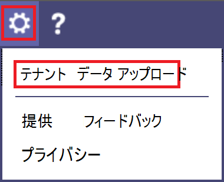

# <a name="quality-of-experience-review-guide"></a>QoE のレビュー ガイド 

<!-- Note that this link to the Word doc is intentionally NOT the aka.ms/qerquide link -->
このガイドでは、Microsoft Teams と Skype for Business Online のドライブ値フェーズについて説明します。 

## <a name="introduction"></a>概要

ユーザーエクスペリエンスの向上に大きな影響を与えるために、組織は次の図に示す主要な領域を operationalize する必要があります。 その他の領域には、運用タスクの特定、品質指標のターゲットの設定、組織の成功を測定するために使用する指標の ascertaining、必要に応じた調査の範囲の縮小などがあります。


_図 1-このガイドで取り上げている主要な運用領域_

このガイドで説明されている領域を継続的に評価してを修復するすることで、ユーザーエクスペリエンスの品質に悪影響を与える可能性を低減できます。 展開で生じる多くのユーザー エクスペリエンスに関する問題は、次のカテゴリにグループ化されます。

-   不完全なファイアウォールまたはプロキシの構成
-   貧弱な Wi-Fi の有効範囲
-   不十分な帯域幅
-   VPN
-   クライアントのバージョンとドライバーが不整合または古くなっている
-   最適化されていない、または組み込みのオーディオデバイス
-   問題のあるサブネットまたはネットワーク デバイス

チームまたは Skype for Business Online を展開する前に適切な計画と設計を行うことで、高品質のエクスペリエンスを維持するために必要な労力の量を減らすことができます。

このガイドでは、通話品質ダッシュボード (CQD) をオンラインで使用して各領域の報告と調査を行い、オーディオを強調して、導入と影響を最大限に高めています。 また、オーディオエクスペリエンスを向上させるためにネットワークに加えられた改善により、ビデオとデスクトップ共有の改善に直接翻訳されます。

評価を加速するために、2つの[CURATED CQD テンプレート](https://aka.ms/qertemplates)が用意されています。1つはすべてのネットワークを管理することで、もう1つは管理された (内部) ネットワーク専用にフィルター処理します。 すべてのネットワークテンプレートレポートは、建物とネットワーク情報を表示するように構成されていますが、建物情報の収集とアップロードに向けて作業している場合は、引き続き使うことができます。 建物情報を CQD にアップロードすると、外部のサブネットとの間の内部情報を追加しながら、独自の建物情報、ネットワーク、位置情報を追加して、レポートを拡張できます。 詳細については、このガイドの「後の[マッピングを作成](#building-mapping)する」を参照してください。

### <a name="intended-audience"></a>対象ユーザー

このガイドは、共同作業のリーダー、アーキテクト、コンサルタント、変更管理/導入スペシャリスト、サポート/ヘルプデスクのリーダー、ネットワーク潜在顧客、デスクトップリーダー、IT 管理者などの役割を備えたパートナーおよびお客様の関係者によって使用されることを目的としています。

このガイドは、指定された品質チャンピオンでも使用することを目的としています。 詳細については、「[品質支持者の役割](4-envision-plan-my-service-management.md#the-quality-champion-role)」を参照してください。

## <a name="assign-roles-for-accessing-cqd"></a>CQD にアクセスするための役割の割り当て

このガイドを使用する前に、CQD にアクセスできるように、適切なテナント[ロール](https://docs.microsoft.com/office365/admin/add-users/about-admin-roles)が割り当てられていることを確認してください。

次の表に、CQD で実行できる各役割について説明します。


|  |レポートを表示する  |EUII フィールドを表示する  |レポートを作成する  |建物のデータをアップロードする  |
|---------|:-------:|:-------:|:-------:|:-------:|
|Office 365 のグローバル管理者     |はい         |Yes         |Yes         |Yes         |
|Teams サービス管理者     |はい         |Yes         |Yes         |Yes         |
|Teams 通信管理者     |はい         |Yes         |Yes         |Yes         |
|Teams 通信サポート エンジニア     |はい         |Yes         |必要         |いいえ         |
|Teams 通信サポート スペシャリスト     |はい         |いいえ         |はい         |いいえ         |
|Skype for Business 管理者     |はい         |Yes         |Yes         |Yes         |
|Azure AD グローバルリーダー |はい         |Yes         |必要         |いいえ         |
|Office 365 レポートリーダー<sup>1</sup>     |はい         |いいえ         |はい         |いいえ         |

<sup>1</sup> CQD レポートの読み取りに加えて、Office 365 レポート閲覧者は、管理センターのすべての[アクティビティレポート](https://support.office.com/article/activity-reports-0d6dfb17-8582-4172-a9a9-aed798150263)と、 [Microsoft 365 導入コンテンツパック](https://support.office.com/article/Office-365-Adoption-content-pack-77ff780d-ab19-4553-adea-09cb65ad0f1f)のすべてのレポートを表示できます。

> [!NOTE]
> EUII (エンドユーザーを特定できる情報) が表示されず、この情報を表示することを許可されているロールの1つがある場合は、CQD で30日間は EUII しか保持されないことに注意してください。 30日以上経過したものは削除されます。

## <a name="what-is-quality"></a>品質とは

Teams や Skype for Business の品質について話し合うときは、共通の理解を得るために用語を定義することが重要です。 ここで定義した品質は、サービスの指標とユーザーエクスペリエンスの組み合わせです。

<!-- Note: need to update graphic-->


_図 2-品質とは_

### <a name="service-metrics"></a>サービスの指標

サービスの指標は、特定のクライアントベースのメトリックで構成されます。 各通話中に、クライアントは通話に関するテレメトリ情報を収集し、CQD または[通話分析](https://techcommunity.microsoft.com/t5/Skype-for-Business-Blog/Introducing-Call-Analytics/ba-p/57309)を使用して後からアクセスできる各通話の終了時にレポートを送信します。 次のような指標があります。

-   低品質ストリーム料金
-   セットアップ失敗率
-   ドロップの失敗率


#### <a name="poor-stream-rate"></a>低品質ストリーム料金

低品質ストリームレート (PSR) は、組織の品質が低いストリームの全体のパーセンテージを表します。 この指標は、この価値を低減してユーザーエクスペリエンスを向上させるために、組織が最大限に努力を集中できる分野を強調することを目的としています。これは、管理された[ネットワーク](#managed-vs-unmanaged-networks)が psr を確認するときのプライマリフォーカスである理由です。 外部ユーザーは重要ですが、調査は組織ベースでは異なります。 外部ユーザーに対してベストプラクティスを提供し、組織全体から独立して外部通話を調査することを検討してください。

CQD の実際の測定値はワークロードによって異なりますが、品質エクスペリエンスレビューの目的では、主に_オーディオの低_解像度の測定値に重点を置いています。 PSR は、次の表に示す5つのネットワークメトリックの平均値で構成されています。 低品質として分類されるストリームについては、定義されたしきい値を超えるメトリックは1つだけです。 ストリーム分類プロセスの詳細については、[この記事](stream-classification-in-call-quality-dashboard.md)を参照してください。

> [!Note]
> CQD により、"低品質" の問題が提供されます。ストリームを低品質として分類するために発生した条件を詳しく理解するための測定値。


_表 1-音質の低品質メトリック_

| メトリックの平均     | 説明     | ユーザー エクスペリエンス |
|-------------|-----------------|-----------------|
| ジッタ\>30 ミリ秒        | これは、連続するパケット間の遅延の平均変更です。 チームと Skype for Business は、バッファリングによって一部のレベルのジッターに対応できます。 これは、ジッタがジッタの効果についてのバッファリングを超えたときにのみ表示されます。      | 異なる速度で到着したパケットによって、スピーカーの音声がロボットに聞こえるようになります。   |
| パケット損失率\>10% または0.1        | これは、紛失したパケットの割合として定義されることがよくあります。 パケット損失は、オーディオ品質に直接影響します。小型の個々の損失パケットには、オーディオが完全に切り取られるようになるバックツーバックのバースト損失への影響はほとんどありません。     | パケットがドロップされ、意図した宛先に到着していない場合、メディア内で隙間が生じ、音節と単語が欠落して、ビデオと共有が途切れることがあります。 |
| 往復時間\>500 ミリ秒        | これは、ポイント A からポイント B の間に IP パケットを取得し、ポイント A に戻るためにかかる時間です。このネットワーク伝搬遅延は、2つの地点とライトの速度の間の物理的な距離に関連しており、ネットワークパスのさまざまなデバイスによって得られるオーバーヘッドが追加されています。      | 通話先に到着するまでの時間が長すぎると、トランシーバーのような効果が発生します。   |
| NMOS 低下平均\>1.0         | ストリームの平均[ネットワーク平均意見スコア (NMOS)](https://docs.microsoft.com/previous-versions/office/communications-server/bb894481(v=office.12)#network-mos)の低下。 NMOS が複数のポイントによってドロップされた、受信した音声の品質に対するネットワークの損失とジッターの影響度を表します。 | これは、ジッタ、パケット損失、およびより低いレベルのラウンドトリップ時間を組み合わせたものです。 ユーザーには、これらの症状の組み合わせが発生する可能性があります。   |
| 非標準的なサンプル\>の平均比7% または0.07 | パケット損失の回復によって生成された、オーディオフレームの合計数に対する、非表示のサンプルを含むオーディオフレームの平均比率。 隠しオーディオのサンプルは、ネットワークパケットのドロップによって通常発生する突然の切り替えをスムーズにするために使用される手法です。      | 値が大きい場合は、大量の損失 concealment が適用され、音声がひずむか失われることを示します。     |

#### <a name="setup-failure-rate"></a>セットアップ失敗率

セットアップの失敗率 (CQD での_通話設定の失敗率の合計_とも呼ばれます) は、通話の開始時にエンドポイント間のメディアパスを確立できなかったストリームの数です。

これは、確立できなかったメディアストリームを表します。 ここで測定されたユーザーエクスペリエンスへの影響の深刻度に基づいて、この値を可能な限りゼロに近い値に減らすことを目標としています。 このメトリックの高い値は、新しい展開では成熟した展開よりも不完全なファイアウォール規則が適用されていますが、定期的に見ておくことも重要です。

このメトリックは、正常な通話の詳細レコード (CDR) を送信したストリームの合計数で区切られた、セットアップに失敗したストリームの合計数を取得することによって計算されます。

-   **セットアップ失敗率**= 合計通話セットアップに失敗したストリームカウント/合計 CDR 利用可能なストリームカウント

#### <a name="drop-failure-rate"></a>ドロップの失敗率

ドロップの失敗率 (CQD での_合計通話の破棄の失敗率_) は、メディアパスが正常に終了しなかった、正常に確立されたストリームのパーセンテージです。

これは、予期せず終了したメディアストリームを表します。 このような影響は、セットアップに失敗したストリームと比べて深刻ではありませんが、ユーザーエクスペリエンスに悪影響を及ぼす可能性があります。 突然のメディアの損失は、ユーザーエクスペリエンスに重大な影響を与える可能性があるため、ユーザーは再接続する必要があるため、生産性が損なわれる可能性があります。

メトリックは、正常にセットアップされたストリームの合計数で割ったドロップストリームの合計数を取得することによって計算されます。

-   **ドロップエラー率**= 合計通話ドロップストリームカウント/合計通話セットアップ成功ストリームカウント

### <a name="define-your-target-metrics"></a>目標指標の定義

このセクションでは、サービスの正常性を評価するために使用するコアサービスのメトリックの一部について説明します。 こうした指標を定義されたターゲットの下に維持するために、継続的に評価していくことで、ユーザーは一貫した信頼性の高い通話品質を実現できます。 開始するには、次のターゲットが用意されています。

_表 2-コアターゲットの正常性評価メトリック_
<table>
<tr>
<th rowspan="2" colspan="2" valign="center">ネットワークの種類</th><th rowspan="1">品質ターゲット</th><th colspan="2">信頼性のターゲット</th></tr>
<tr><th>オーディオ低品質ストリームの速度</th><th>セットアップ失敗率</th><th>ドロップの失敗率</th></tr>
<tr><td rowspan="2"><strong>すべての</strong></td><td>内部</td><td>2.0%</td><td>0.5%</td><td>2.0%</td></tr>
<tr><td>全体</td><td>3.0%</td><td>1.0%</td><td>3.0%</td></tr>
<tr><td rowspan="5"><strong>会議</strong></td><td>内部</td><td>2.0%</td><td>0.5%</td><td>2.0%</td></tr>
<tr><td>有線内蔵</td><td>1.0%</td><td>0.5%</td><td>1.0%</td></tr>
<tr><td>Wi-fi 5 GHz 内部</td><td>1.0%</td><td>0.5%</td><td>1.0%</td></tr>
<tr><td>Wi-fi 2.4 GHz 内蔵</td><td>2.0%</td><td>0.5%</td><td>2.0%</td></tr>
<tr><td>全体</td><td>2.0%</td><td>0.5%</td><td>3.0%</td></tr>
<tr><td rowspan="4"><strong>P2P</strong></td><td>内部</td><td>2.0%</td><td>0.5%</td><td>2.0%</td></tr>
<tr><td>有線/Wi-fi 5 GHz 内蔵</td><td>1.0%</td><td>0.5%</td><td>1.0%</td></tr>
<tr><td>有線/Wi-fi 5 GHz 全体的</td><td>2.0%</td><td>1.0%</td><td>1.0%</td></tr>
<tr><td>全体</td><td>2.0%</td><td>1.0%</td><td>3.0%</td></tr>
</table>


会社の目標を達成するために、組織のターゲットを討議して定義することが重要です。

### <a name="user-experience"></a>ユーザー エクスペリエンス

ここで収集された指標は、ネットワークやサービスに問題があることを意味するものではありませんが、ユーザーエクスペリエンスの分析は科学よりもより複雑になります。 Microsoft は、全体的なユーザーエクスペリエンスを測定するために、通話の評価 (RMC) と呼ばれる組み込みのアンケートメカニズムを提供しています。 RMC は、ユーザーの視点から以下の質問に回答するのに役立ちます。

-   ソリューションの使い方はわかっていますか?
-   このソリューションは使いやすく直感的であり、日常的なコミュニケーションのニーズをサポートしていますか?
-   この解決策で仕事をすることはできますか?
-   このソリューションの全体的な認識は何ですか?
-   現在の場所に関係なく、いつでもソリューションを使用できますか?
-   通話を設定して管理することはできますか?

#### <a name="rate-my-call"></a>通話の評価 

通話料金 (RMC) は Teams と Skype for Business に組み込まれており、参加者が10回、または10% の間隔で参加者に表示されるように自動的に構成されます。 この簡単なアンケートを行うと、ユーザーは通話の評価を行い、通話品質が悪い可能性がある理由について若干のコンテキストを提供するように求められます。 1つまたは2つの評価は低品質で、3 ~ 4 は良好であり、5は素晴らしいと考えられます。 これは、鈍くなるインジケーターの一部ですが、サービスの測度が見逃される問題を明らかにするための便利な指標となります。

> [!Note]
> 適切なフィードバックを提供することにより、ユーザーが RMC 調査に応答するまでは、通常、応答が overwhelmingly 否定的として返されます。 ほとんどのユーザーは、通話品質が低い場合にのみ応答します。 このため、サービスの指標が適切であるにもかかわらず、RMC のレポートが低品質のサイドに悪影響を及ぼす可能性があります。

CQD を使用して RMC ユーザーの応答について報告し、サンプルレポートは CQD テンプレートに含まれています。 ただし、このガイドでは詳しく説明しません。 Skype for Business Online の RMC と、役立つ RMC 応答を提供するためのガイダンスについて詳しくは、[このブログ投稿](https://blogs.technet.microsoft.com/jenstr/2015/05/05/rate-my-call-in-skype-for-business-2015/)をご覧ください。

#### <a name="client-and-device-readiness"></a>クライアントとデバイスの準備

ユーザーに一貫した良好なユーザーエクスペリエンスを提供するために役立つ、堅固なクライアントとデバイスの戦略が必要です。 いくつかの重要な原則で、各準備計画を行います。

##### <a name="client-readiness"></a>クライアントの準備

強力なクライアントの準備方針により、ユーザーは最新のバージョンのクライアントを実行しながら、最適なエクスペリエンスを実現できます。 Microsoft は、Skype for Business クライアントを定期的に更新しています。環境内で最新の状態を維持することは、全体的な成功に不可欠です。 また、ネットワーク、ビデオ、USB、およびオーディオドライバーは、見落とされがちで、ユーザーエクスペリエンスに影響を与える可能性があるため、忘れずに修正することも重要です。 現在の修正プログラム管理プロセスに、ネットワーク、Wi-fi、ビデオ、USB、オーディオドライバーを追加することを検討してください。

クライアントバージョンの遅延が6か月を超えないようにすることをお勧めします。 Office クイック実行を使用している場合は、サービスによって既に最新の状態に維持されています。 このガイドの後半で説明するように、対象の[クライアントバージョン](#client-versions)を使用して、このプロセスを支援します。 また、電話番号の評価のサンプルレポートを活用して、顧客の対応戦略をさらに強化することもできます。

> [!IMPORTANT]
> 現時点では、チームのクライアントは Azure コンテンツ配信ネットワークを介して自動的に配布および更新され、サービスによって最新の状態に維持されます。 このため、クライアントの準備と調査のアクティビティは Teams には適用されません。


##### <a name="device-readiness"></a>デバイスの準備

ユーザーエクスペリエンスは、デバイスの準備戦略よりも、1つの戦略によって影響を受けることはありません。 ほとんどの組織は、ユーザーから不要なデバイス (卓上電話やその他の専用のオーディオデバイスなど) を削除することに満足しています。これは、多くの場合、Teams または Skype for Business に切り替えるための基本的な業務上の正当な根拠となります。 ただし、このような組織では、これらのデバイスが低コストであっても、交換用のデバイスを提供することができます。 最新のノート Pc と Pc は、内蔵マイクとスピーカーが搭載されていますが、ビジネスクラスのボイスオーバー IP (VoIP) では最適化されていません。 これにより、すべての参加者にとって低品質のエクスペリエンスが実現されることがよくあります。特に、スピーカーが雑音の多い環境にいる場合です。 Microsoft のデバイス認定プログラムでは、ユーザーが電話に参加したときに、チームまたは Skype for Business に対して認定されたデバイスを使用している場合は、認定されていないデバイスよりも優れたエクスペリエンスが生成されます。 

デスクトップクライアントで音声通話に参加しているときは、チームと Skype for Business のユーザーが認定されたヘッドセットまたはスピーカーを使用することを常にお勧めします。 Microsoft 認定デバイスの詳細については、[認定プログラム](/SkypeForBusiness/certification/overview)について以下の記事を参照してください。[パートナー solutions のカタログ](https://partnersolutions.skypeforbusiness.com/solutionscatalog/personal-peripherals-pcs)については、こちらを参照してください。 このガイドで後述する[デバイスレポート](#devices)を使用して、デバイスの管理について説明します。


### <a name="categories-of-quality"></a>品質のカテゴリ

Operationalizing の品質と信頼性の高い展開を成功させるには、建物の運用が厳密であることが重要です。 具体的には、次の図に示す3つのカテゴリについて特に注意を払ってください。次に、このガイドの焦点を示します。

-   **ネットワーク:** 音質は低品質ストリーム比 (PSR) メトリック、TCP 使用率、有線およびワイヤレスサブネット、HTTP プロキシおよび VPN の使用を特定することを目的としています。

-   **エンドポイント:** オーディオデバイスとクライアントバージョン (Skype for Business のみ)。

-   **サービス管理:** このカテゴリは、次の2つのセクションで構成します。

    -   1つ目は、チームと Skype for Business Online サービスの管理と維持を Microsoft が担当します。

    -   次に、インフラストラクチャがサービスに追加されたときに、建物情報の更新、新しい Office 365 IP アドレス用のファイアウォールの維持など、サービスへの確実なアクセスを確保するために、組織が管理する必要があるタスクです。


_図 3-Teams および Skype for Business Online の展開に関する重要なカテゴリ_

次の図は、各カテゴリに対して実行する必要があるタスクの概要を示しています。 これらのタスクは、少なくとも1週間に一度実行することをお勧めします。

これらのタスクを初めて実行するときには、これらのカテゴリの多くで展開構成を検証する必要があるため、後続のイテレーションよりも多くの作業が必要になります。 定義したターゲットを会議にして目的の状態を達成したら、これらのタスクを実行することで、その状態を維持することができます。

<!--  This is a net new graphic, never was included in the online article. OOPS! -->


#### <a name="service-management-tasks"></a>サービス管理タスク

クラウドの最初の世界では、高品質のユーザーエクスペリエンスを維持するために特定のサービス管理タスクを実行する必要があります。 これらのタスクには、インターネットリンクを飽和させずにサービスに接続するための十分な帯域幅があることを保証することや、すべての管理されたネットワーク領域にサービスの品質 (QoS) が設定されていることを確認すること、そして最後に、[ファイアウォールで Office 365 IP 範囲](https://aka.ms/o365ips)を常に把握することです。

#### <a name="network-tasks"></a>ネットワークタスク

[ネットワークタスク] には、信頼性と品質という2つのカテゴリがあります。 信頼性は、ユーザーが通話を正常に発信して接続を維持できるようにすることに重点を置いています。 音質は、通話中に、ユーザーのクライアントによってチームおよび Skype for Business Online に送信される集約されたテレメトリに焦点を当てています。 

ユーザーエクスペリエンスに対する信頼性の重大な影響を考えると、評価を開始してから品質を実現することが重要です。 

#### <a name="endpoints-tasks"></a>エンドポイントタスク

このカテゴリの主なタスクでは、ユーザーが skype for business デスクトップクライアントに対して行われた継続的な最適化のメリットを得ることができるように、過去6か月間のデスクトップビルドで Skype for Business を実行しているクライアントバージョンを検証しています。 さらに、これにより、全体的なクライアント管理作業が簡素化され、一貫性のあるユーザーエクスペリエンスを提供できます。

もう1つの重要な領域は、展開でどのデバイスが使用されているかを監視し、最適なユーザーエクスペリエンスを実現するために認定されたデバイスの使用を推進することです。


> [!IMPORTANT]
> 現時点では、チームのクライアントは Azure コンテンツ配信ネットワークを介して自動的に配布および更新され、サービスによって最新の状態に維持されます。 クライアントの準備と調査のアクティビティは Teams には適用されません。

## <a name="cqd-basics"></a>CQD の基本

このセクションでは、CQD を操作する場合の基本事項について説明します。 ガイダンスについては、次のトピックをご覧ください。

-   CQD とは何ですか?
-   CQD を使用した期待
-   テナント ID の検索
-   Microsoft Teams と Skype for Business のレポート
-   第1と第2の分類
-   ディメンション、メジャー、およびフィルター
-   ストリームと通話
-   良好、低品質、および未分類の通話
-   共通のサブネット

より詳細なトレーニングとリソースについては、[付録](#other-resources)を参照してください。

### <a name="what-is-cqd"></a>CQD とは何ですか?

通話品質ダッシュボード (CQD) を使用して、Teams と Skype for Business のサービスを使って発信した通話の品質を把握することができます。 CQD は、Skype for Business と Teams の管理者およびネットワークエンジニアがネットワークを最適化し、品質、信頼性、ユーザーエクスペリエンスを常に把握できるように設計されています。 CQD は、全体的なパターンが明らかになっている組織全体の集計テレメトリを確認し、スタッフは情報に基づいた評価を行ったり、改善活動を計画して最大限に活用したりできるようになります。 CQD には、全体的な品質、信頼性、ユーザーエクスペリエンスを把握するためのメトリックのレポートが用意されています。

このガイドでは、CQD の基本的な概念を理解して、チームまたは Skype for Business Online を使用してユーザーのエクスペリエンスを向上させるための大きな影響を最大限に高めるために役立ちます。 その他の CQD のリソースについては、[付録](#other-resources)を参照してください。

### <a name="expectations-using-cqd"></a>CQD を使用した期待

CQD は、傾向やサブネットを分析するのに便利ですが、特定のシナリオについては、常に特定の原因が提供されるわけではありません。 CQD を使用する場合は、このことを理解して、適切な期待値を設定することが重要です。

-   CQD では、すべてのシナリオについて根本的な原因が示されるわけではありません。
-   CQD には、電話システムや電話会議のストリームは含まれません。
-   CQD は、傾向に基づいてさらに調査のための領域を呼び出します。

### <a name="report-editions"></a>レポートエディション

CQD Online には、"概要" と "詳細" という2つのレポートエディションがあります。 画面上部のバーにあるドロップダウンメニューを使用して、レポートエディションを開きます。 選択したレポートエディションの名前が画面の上部に表示されます。

-   概要レポートは静的であり、編集、ダウンロード、エクスポートはできません。 
-   詳細レポートは完全にカスタマイズ可能であり、CSV ファイルへのダウンロード、エクスポート、複製などを行うことができます。

2つのエディションの違いの詳細については、[この記事](turning-on-and-using-call-quality-dashboard.md)を参照してください。

2020年1月の新[機能: POWER BI クエリテンプレートをダウンロードして CQD](https://github.com/MicrosoftDocs/OfficeDocs-SkypeForBusiness/blob/live/Teams/downloads/CQD-Power-BI-query-templates.zip?raw=true)します。 CQD データの分析と報告に使用できる、カスタマイズ可能な Power BI テンプレート。

_図 4-CQD レポートのカテゴリ_

概要レポートは、次の4つのカテゴリに分類されます。

-   **概要レポート**では、高品質のサブネットを特定するのに役立つ、毎日、毎月、およびテーブルレポートを使用して品質の傾向を分析することに重点を置いています。 これは、CQD Online に初めてサインインするときの既定のランディングページです。
-   **場所の拡張レポートは、** 位置情報に基づいて品質の傾向を分析することに重点を置いています。 これらのレポートを使用するには、建物ファイルをアップロードする必要があります。
-   **信頼性レポート**は、オーディオ、ビデオ、ビデオベースの画面共有 (vbss)、アプリの共有の信頼性傾向の分析に重点を置いています。
-   **品質エクスペリエンスレポート**は、オーディオの品質と信頼性を分析するための主要な領域に焦点を絞った、詳細な qer テンプレートの "slimmed" バージョンです。

### <a name="report-types"></a>レポートの種類

CQD では、データの表示方法に応じて、2種類のレポートから選ぶことができます。 このガイドでは、別の種類のレポートを作成する方法については説明していませんが、QER CQD テンプレートでは、次のようにカスタマイズできるグラフと表のレポートを組み合わせて使用できます。

-   グラフレポートは、視覚的な形式でデータを表すためのグラフィカルな横棒グラフを作成します。 グラフレポートは、一定の期間にわたってデータを視覚化するために最も適しています。
-   表レポートは、Microsoft Excel で操作するためにレポートを CSV ファイルにエクスポートするときに、個々の測定値と寸法を調べるのに役立ちます。

### <a name="tenant-id"></a>テナント ID

一部の CQD レポートでは、テナント ID のフィルターを含める必要があります。 CQD のデータの集計方法により、フェデレーション参加者の利用統計情報が含まれています。 これは、傾向を分析するときに役立つ可能性がありますが、クライアントとデバイスのレポートでは、フェデレーション参加者のテレメトリを除外するために、特定のテナントにデータをフィルター処理する必要があります。 テナント ID がわからない場合は、次のいずれかの方法で見つけることができます。

> [!Note]
> これらのメソッドには、次のアクセス許可が必要です。<ul><li>グローバル管理者の役割</li><li>Skype for Business の管理者の役割</li></ul>

#### <a name="azure-portal"></a>Azure ポータル

1.  Microsoft Azure ポータルにサインインします。<https://portal.azure.com>

2.  [ **Azure Active Directory**] を選びます。

3.  [**管理**] で [**プロパティ**] を選択します。 [**ディレクトリ id** ] ボックスにテナント ID が表示されます。

#### <a name="azure-powershell"></a>Azure PowerShell

1. [Microsoft Azure PowerShell サービス管理モジュールをインストール](https://docs.microsoft.com/powershell/azure/servicemanagement/install-azure-ps?view=azuresmps-4.0.0)します。

2. Azure PowerShell コマンドウィンドウを開き、次のスクリプトを実行します。メッセージが表示されたら、Office 365 資格情報を入力します。 

   ```PowerShell
   Login-AzureRmAccount
   ```

3. テナント ID が出力に表示されます。

#### <a name="skype-for-business-online-admin-center"></a>Skype for Business Online 管理センター

1.  <https://portal.office.com> に移動します。

2.  テナント管理者の組織のアカウントでサインインします。

3.  [**管理センター**] で [ **Skype for business** ] を選びます。

4.  テナント ID は、[ようこそ] ページの [**組織 ID** ] として表示されます。

#### <a name="skype-for-business-online-using-powershell"></a>PowerShell を使用した Skype for Business Online

1. [Windows PowerShell 用にコンピューターを](/SkypeForBusiness/set-up-your-computer-for-windows-powershell/set-up-your-computer-for-windows-powershell)セットアップします。

2. 次のコマンドを実行します。

   ```PowerShell
   (Get-cstenant).tenantid
   ```

3. テナント ID が GUID として表示されます。

### <a name="teams-vs-skype-for-business"></a>Teams と Skype for Business の比較

CQD は、Teams と Skype for Business テレメトリの両方について報告できます。 ただし、レポートを開発して、Skype for Business とは別に Teams のテレメトリを確認したい場合があります。

#### <a name="summary-reports"></a>概要レポート

[概要レポート] ページを変更して、Teams または Skype for Business のみを表示するには、画面の上部にある [**製品フィルター** ] ドロップダウンメニューを選択し、目的の製品を選択します。


_図 5-製品フィルターを選ぶ_

#### <a name="detailed-reports"></a>詳細レポート

すべての詳細レポートをフィルター処理するには、ブラウザーバーで、URL の末尾に次の内容を追加します。

```PowerShell
/filter/[AllStreams].[Is Teams]|[FALSE]
```

**次**

```https://cqd.teams.microsoft.com/cqd/#/1234567/2018-5/filter/[AllStreams].[Is Teams]|[FALSE]```

URL フィルターの詳細については、このセクションで後述する「[レポートのフィルター処理](#filtering-reports)」を参照してください。

個々の詳細レポートにフィルターを適用するに``Is Teams``は、レポートにフィルターを追加して、True または False に設定します。 詳細については、このセクションで後述する「[レポートの編集](#editing-reports)」を参照してください。

![[フィルターの追加] ページのスクリーンショット](media/qerguide-image-addteamsfilter.png)

_図 6-レポートに Microsoft Teams フィルターを追加する_


### <a name="managed-vs-unmanaged-networks"></a>管理されたネットワークと非管理ネットワーク

既定では、CQD のすべてのエンドポイントが外部として分類されます。 建物のファイルが導入されるとすぐに、管理されたエンドポイントデータの確認を開始できます。 前に説明したように、CQD のネットワークは次のように定義されています。

-   管理された_ネットワーク_(通常は内部または内部とも呼ばれる) は、組織によって影響を受けることができます。 これには、内部 LAN、リモート WAN、VPN が含まれます。
-   管理されていない_ネットワーク_(外部または外部とも呼ばれる) は、組織によって影響を受けたり、制御したりすることはできません。 管理されていないネットワークの例としては、ホテルまたは空港のネットワークがあります。

### <a name="dimensions-measures-and-filters"></a>ディメンション、メジャー、およびフィルター

整形式の CQD クエリには、次の3つのパラメーターがすべて含まれています。

-   **Dimension:** データにピボットを追加する方法を教えてください。

-   **測定:** 報告する対象

-   **フィルター:** クエリによって返されるデータセットを削減する方法を説明します。

もう1つの方法は、_ディメンション_が grouping 関数であり、 _measure_が目的のデータであることを確認することです。また、_フィルター_を使うと、クエリに関連する値に結果を絞り込むことができます。

適切に整形されたクエリの例としては、**低品質のストリームが [Measure] のサブネットによって [Dimension] ([Filter]) に表示**されます。 詳細については、「 [CQD で使用できるディメンションとメジャー](https://aka.ms/cqd-dm)」を参照してください。

### <a name="first-vs-second"></a>第1対第2 

CQD の次元とメジャーの多くは、first または second として分類されます。 CQD では、発信者番号と呼び出し先のフィールドは使われません。これは、呼び出し元と呼び出し先の間に手順が介在するため、_最初_と_2 番目_に名前が変更されています。 次のロジックは、どのエンドポイントに最初のラベルが付いているかを決定します。

-   **まず**、サーバーがストリームまたは通話に関与している場合は、常にサーバーエンドポイント (会議サーバー、仲介サーバーなど) になります。

-   **Second**は、ストリームが2つのサーバーエンドポイントの間にある場合を除き、常にクライアントエンドポイントになります。

-   両方のエンドポイントが同じ型である場合、どちらのエンドポイントが最初に選択されるかは、ユーザーエージェントカテゴリの内部順序に基づいて決まります。 これにより、順序付けに整合性が確保されます。

第1または第2のエンドポイントが同じである場合の確認方法については、「 [CQD で使用できるディメンションとメジャー](https://aka.ms/cqd-dm)」を参照してください。

### <a name="stream-vs-call"></a>ストリームと通話

CQD で表示する寸法またはメジャーを適切に選択するには、通話とストリームの違いについて理解する必要があります。 CQD の主なフォーカスはストリームに関するものですが、通話ベースの測定値を使うこともできます。

-   **ストリーム:** 2つのエンドポイントの間には、_ストリーム_が存在します。 各方向には1つのストリームしかありません。通信には2つのストリームが必要です。 ストリームは、建物、ネットワーク、またはサブネットを調査するのに役立ちます。 場合によっては、呼び出しとストリームが両方とも測定の名前で使われていることがあります (たとえば、セットアップストリームを呼び出すか、[ドロップしたストリームを呼び出す] など)。 これらは依然としてストリームとして分類されます。

-   **通話:**_通話_は、すべての参加者からのすべてのストリームをグループ化したものです。 通話は、少なくとも2つのストリームで構成されます。 1つの通話には少なくとも2つのエンドポイントがあり、それぞれに最低1つのストリームが含まれます。

ディメンションまたはメジャーが通話またはストリームを参照しているかどうかに関する追加のガイダンスについては、「 [CQD で使用できるディメンションとメジャー](https://aka.ms/cqd-dm) 」を参照してください。

### <a name="good-poor-and-unclassified-calls"></a>良好、低品質、および未分類の通話

通話は、良好、低品質、または未分類のいずれかに分類されます。 各1つについて詳しく説明します。

-   **良好または低品質:** 良好または低品質の通話は、完全な QoE レポートが生成され、サービスによって受信された一連のサービスメトリックが含まれている通話で構成されます。 [このガイドでは、前に](#poor-stream-rate)説明したように、ストリームが良好か低かを判断する方法について説明します。

-   **未分類:** 未分類のストリームには、サービスメトリックの完全なセットが含まれていません。 これは短い通話 (通常は60秒未満) である可能性があります。平均値は計算できず、QoE レポートは生成されませんでした。 未分類で通話を発信する最も一般的な理由は、パケット使用量が少ないということです。 この例としては、会議に参加し、話すことはできません。 参加者は受信していますが、メディアを送信していません。 メディアが送信されていない場合は、CQD がエンドポイントの送信メディアストリームの分類に使用できるメトリックはありません。

ストリーム分類プロセスの詳細については、[この記事](stream-classification-in-call-quality-dashboard.md)を参照してください。

### <a name="common-subnets"></a>共通のサブネット

共通サブネットは、ホテル、ホームネットワーク、ホットスポットなどの領域で使用される特定のプライベートサブネットです。 これらのサブネットは、普及しているため、優先順位付けが困難です。 組織でこれらの共通サブネットのいずれかを使用している場合は、そのネットワークを別のサブネットに移動することをお勧めします。 これにより、CQD で簡単にレポートできるようになります。 この場合、[すべてのネットワーク] テンプレートのレポートは、これらのサブネットを除外して、低品質のソースとして排除されるように構成されています。 共通のサブネットは以下で定義されています。影響は組織によって異なります。

-   10.0.0.0/24
-   192.168.0.0/24
-   192.168.1.0/24
-   192.168.2.0/24
-   172.20.10.0/24
-   192.168.43.0/24

共通のサブネットを使用している管理されたネットワークを調査する場合、2番目の再帰ローカル IP ディメンションを使ってサブネットをグループ化する必要があります。 このディメンションにはエンドポイントのパブリック IP アドレスが含まれます。

## <a name="cqd-online"></a>オンライン CQD

このセクションでは、CQD にアクセスするための基本事項について説明します。 ガイダンスについては、次のトピックをご覧ください。

-   CQD online へのアクセス
-   CQD の概要
-   CQD でレポートを編集する
-   CQD でレポートをフィルター処理する
-   CQD でレポートをインポートする

より詳細なトレーニングとリソースについては、[付録](#other-resources)を参照してください。

### <a name="access-cqd-online"></a>オンライン CQD

CQD にアクセスするには、次の3つの方法があります。

-   <https://cqd.teams.microsoft.com> に移動します。

-   次の図に示すように、 **Microsoft Teams 管理センター**に移動して、CQD へのリンクを選択します。

    

    _図 7-Microsoft Teams 管理センターを使用して CQD にアクセスする_

-   次の図に示すように、従来の**Skype for business 管理センター** > **ツール**に移動して、CQD へのリンクを選択します。

    

    _図 8-Skype for Business 管理センターから CQD にアクセスする_


### <a name="getting-started"></a>はじめに

初めて CQD を参照すると、[概要レポート] ページが表示されます。 このガイドで説明されているレポートのほとんどは、カスタム詳細レポートです。 詳細レポートの使用を開始するには、ページの上部にある [**概要レポート**] を選択し、[**詳細レポート**] を選択します。


_図 9-詳細レポートに移動する_

CQD の [レポートの詳細] ページは、次の図のようになります。


|             |           |
| ------------|-----------|
|  | [概要] ウィンドウには、右側に表示されるレポートセットのコンテキストが表示されます。 |
|  | [概要] ウィンドウで [**編集**] を選ぶと、レポートレベルのプロパティ (y 軸の高さを含む) を設定したり、新しいテンプレートをインポートしたりできます。 |
|  | 階層リンクを使用すると、ユーザーはレポートセット階層内の現在の位置情報を特定するのに役立ちます。 |
|  | 子レポートを含むレポートは、青色のリンクで示されます。 リンクを選択すると、子レポートにドリルダウンすることができます。 |

_図 10-詳細レポートページ_

レポートの [横棒グラフ] および [近似曲線] をポイントして、詳細な値を表示します。 フォーカスがあるレポートには、[アクション] メニュー ([**編集**]、[**複製**]、[**削除**]、[**ダウンロード**]、[エクスポート] の各**レポート**) が表示されます。

### <a name="editing-reports"></a>レポートの編集

レポートのアクションメニューで [**編集**] を選択すると、クエリエディターが開きます。 各レポートは、クエリによって CQD にサポートされます。 レポートは、クエリから返されたデータを視覚化したものです。 クエリエディターは、次の図に示すように、レポートの表示オプションに加えて、これらのクエリを編集するための UI です。


|             |           |
| ------------|-----------|
|  | 左側のウィンドウからディメンション、メジャー、フィルターを選択します。 既存の値をポイントすると、[閉じる] ボタン (**X**) が表示され、この値を削除することができます。<ul><li>寸法またはメジャーを選択することにより、タイトルフィールドを編集し**てタイトルを**変更することができます。 上部のウィンドウで青色の上向き矢印または下向き矢印を選択して順序を変更することもできます。</li><li>見出しの**+** 横にある () を選択すると、新しい寸法、メジャー、またはフィルターを追加するためのダイアログボックスが開きます。</li><li>検索を簡単にするには、[フィールドの**検索**] フィールドに、ディメンション、メジャー、またはフィルターの最初の数文字を入力します。</li></ul> |
|  | 上のウィンドウには、グラフをカスタマイズするためのオプションが表示されます。 |
|  | クエリエディターにレポートのプレビューが表示されます。 |
|  | レポートの詳細な説明を作成または編集するには、画面の下部にある [**編集**] ボックスを使用します。 |

_図 11-クエリエディター_

### <a name="filtering-reports"></a>レポートのフィルター処理

用意されているテンプレートには、いくつかの組み込みクエリとレポートフィルターがあります。 以下のセクションでは、テンプレート全体で使用される最も一般的なフィルターについて説明します。

#### <a name="url-filter"></a>URL フィルター

URL フィルターを使用して、特定のディメンションのすべてのレポートをフィルター処理することができます。 最も一般的な URL フィルターは、フェデレーション参加者のテレメトリを除外する、またはチームまたは Skype for Business Online にフォーカスするレポートにフィルターを適用するために使用されます。 フィルターを使用する場合は、それらをブックマークして簡単に参照できるようにすることをお勧めします。 

CQD レポートからフェデレーションデータを除外することは、フェデレーションエンドポイントがレポートに影響を与える可能性のある、管理された建物またはネットワークをを修復するする場合に便利です。

URL フィルターを実装するには、ブラウザーのアドレスバーで、URL の末尾に次のを追加します。

```PowerShell
/filter/[AllStreams].[Second Tenant Id]\|[YOUR TENANT ID HERE]
```

例:  

```https://cqd.teams.microsoft.com/cqd/#/1234567/2018-08/filter/[AllStreams].[Second Tenant Id]|[TENANTID]```

Teams または Skype for Business のレポートをフィルター処理するには、URL の末尾に次の内容を追加します。

```PowerShell
/filter/[AllStreams].[Is Teams]|[TRUE | FALSE]
```

例:

```https://cqd.teams.microsoft.com/cqd/#/1234567/2018-08/filter/[AllStreams].[Is Teams]|[TRUE]```


> [!NOTE]
> 上の URL 例は、視覚的な表現のみを対象としています。 のデフォルトの<https://cqd.teams.microsoft.com>CQD リンクを使用してください。


#### <a name="query-filters"></a>クエリフィルター

クエリフィルターは、CQD のクエリエディターを使用して実装されます。 これらのフィルターは、CQD によって返されるレコード数を減らすために使用されるため、レポート全体のサイズとクエリの時間を最小限に抑えることができます。 これは、管理されていないネットワークをフィルター処理する場合に特に便利です。 次の表に示すフィルターは、正規表現 (RegEx) を使用しています。

_表 3-クエリフィルター_

| フィルター         | 説明          | CQD クエリフィルターの例      |
|----------------|----------------------|-------------------------------|
| 空白値はありません   | 一部のフィルターには、空の値をフィルター処理するオプションがありません。 空の値を手動でフィルター処理するには、必要に応じて、空の式を使用し、フィルターを "等しい" または "Not Equals" に設定します。      | 第2の\< \> \^ \\建物の名前\*\$                       |
| 共通サブネットを除外する | 管理されていないネットワークから個別に管理するための有効な建物ファイルがない場合、ホームネットワークはレポートに含まれます。 これらのホームサブネットは、その制御の範囲外であり、レポートからすばやく除外することができます。 このガイドで定義されている一般的なサブネットは、10.0.0.0、192.168.1.0、192.168.0.0 です。 | 第 2 \< \>の\|サブ\|ネット 10.0.0.0 192.168.0.0 192.168.1.0 |
| 内部でのみ表示  | 管理対象 (内部) または非管理 (外部) のレポートをフィルター処理するために使用されます。 管理された CQD テンプレートは、これらのフィルターで既に構成されています。       | 2番目の内部企業 = 内部        |

#### <a name="report-filters"></a>レポートフィルター

レポートフィルターは、クエリエディターで、または直接レポートにフィルターを追加することによって実装されます。 次のレポートフィルターがテンプレート全体で使用されます。

_表 4-レポートフィルター_

| フィルター     | 説明                            | CQD レポートフィルターの例         |
|------------|----------------------------------------|-----------------------------------|
| Month      | 最初の年から月までを開始します。 | 2017-10                           |
| 昇順 | 任意のアルファベット文字をフィルター処理します。 | [a-z]                             |
| 真数    | 任意の数字をフィルター処理します。    | [0-9]                             |
| パーセンテージ | フィルターでパーセンテージを指定します。              | ([3-9]\\)\|([3-9])\|([1-9] [0-9]) |

## <a name="import-the-cqd-templates"></a>CQD テンプレートをインポートする

このガイドには、 [2 つの CURATED CQD テンプレート](https://aka.ms/qertemplates)が含まれています。 これらのテンプレートは、CQD の使用を迅速化し、CQD の機能をすばやく活用して、ユーザーのチームまたは Skype for Business のエクスペリエンスに影響を与える機会を提供します。 建物のデータファイルを操作するために最適化された [すべてのネットワーク] テンプレートは、次のセクションで説明するように、建物情報を収集して CQD にアップロードするときに使用できます。

**テンプレートをインポートするには (.CQDX) を CQD Online に接続する**

1. <https://cqd.teams.microsoft.com> に移動します。

2. Office 365 管理者の資格情報を使用して認証します。

   > [!NOTE]
   > CQD にアクセスするには、Office 365 のグローバル管理者、Skype for Business の管理者、またはレポートリーダーの役割が必要です。 

3. ページの上部にある [**概要レポート**] メニューを選択し、[**詳細レポート**] を選択します。

4. [概要] ウィンドウで、[**インポート**] を選択します。 CQDX に保存されている場所に移動し、CQDX テンプレートを選択して、[**開く**] を選択します。

5. テンプレートがアップロードされると、ポップアップウィンドウに "レポートのインポートが成功しました。" というメッセージが表示されます。 [ **OK] を選びます。**

   

6. 2つ目の CQD テンプレートについて、手順4と5を繰り返します。

> [!NOTE]
> CQD テンプレートはユーザーごとにインポートされます。 他のユーザーがレポートを使用する必要がある場合は、そのテンプレートを CQD インスタンスにサインインしてインポートする必要があります。 


## <a name="building-mapping"></a>建物のマッピング

Teams または Skype for Business Online の展開では、すべてのクライアントが外部になります。 既定では、クライアントが社内の企業ネットワークに接続されているかどうかに関係なく、すべてのクライアントが CQD Online の外部として報告されるという意味があります。

CQD を使用する場合は、エンドポイントの場所と、管理できないネットワークに接続されていたかどうかを確認する必要があります。これは、管理できるネットワークのみを対象としていることを前提としています。 サブネットと建物の情報を CQD Online にアップロードすることで、CQD は、エンドポイントが内部の企業/管理ネットワークに接続されているのか、それとも外部/非管理ネットワークに接続しているのかを確認できます。

### <a name="building-data-file-structure"></a>データファイル構造の作成

アップロードするデータファイルの形式は、次の要件を満たしている必要があります。これは、アップロード前に検証チェックに合格するためです。

-   このファイルは、各行の各列がタブ文字で区切られる TSV ファイル、または各列がカンマで区切られた CSV ファイルのいずれかである必要があります。

-   ファイルのサイズは、50 MB 以下にする必要があります。

-   データファイルの内容には、*テーブルの見出しを含めることはできません*。 つまり、データファイルの最初の行は、"ネットワーク" などの列見出しではなく、実際のデータである必要があります。

-   列ごとに、データ型に指定できるのは String、Number、またはブール値のみです。 データ型が数値の場合、値は数値である必要があります。ブール値の場合は、0または1のいずれかである必要があります。

-   列ごとに、データ型が String の場合、データは空にすることができます (ただし、適切な区切り記号 (タブ文字またはコンマ) で区切る必要があります)。 これにより、このフィールドは空の文字列値として割り当てられます。

-   各行は14列である必要があります (オプションの VPN 列を追加する場合は、15列)。 各列には、次の表で説明されているデータ型が必要です。また、列はテーブルの順序で指定する必要があります。

_表 5-ファイル構造を作成する_

| 列名        | データ型 | 例                   | ガイダンス    |
|--------------------|-----------|---------------------------|-------------|
| ネットワーク            | String    | 192.168.1.0               | 必須    |
| NetworkName        | String    | 米国/シアトル/シアトル-SEA-1 | 必須\*  |
| NetworkRange       | 数値    | #                        | 必須    |
| BuildingName       | String    | シアトル-SEA-1             | 必須\*  |
| OwnershipType      | String    | コントソ                   | 省略可能    |
| BuildingType       | String    | IT の終了            | 省略可能    |
| BuildingOfficeType | String    | エンジニアリング               | 省略可能    |
| 市区町村               | String    | 調布市調布ヶ丘                   | 推奨 |
| ZipCode            | String    | 98001                     | 推奨 |
| 居住            | String    | プロセッサー                        | 推奨 |
| 都道府県              | String    | WA                        | 推奨 |
| Region             | String    | MSUS                      | 推奨 |
| InsideCorp         | ブール      | 1                         | 必須    |
| ExpressRoute       | ブール      | 0                         | 必須    |
| VPN                | ブール      | 0                         | 省略可能    |

\*CQD では必須ではありませんが、テンプレートは、建物とネットワーク名を表示するように構成されています。

#### <a name="supernetting"></a>スーパー

各サブネットを定義する代わりに、スーパーネッティング (一般的にはクラスレスドメインルーティング (CIDR) と呼ばれます) を使うことができます。 *スーパーネット*は、単一のルーティングプレフィックスを共有する複数のサブネットの組み合わせです。 サブネットごとにエントリを追加する代わりに、supernetted 住所を使用することができます。 スーパーネッティングはサポートされていますが、使用することはお勧めしません。

たとえば、Contoso のマーケティング用建物は以下のサブネットで構成されています。

-   10.1.0.0/24: 第1階
-   10.1.1.0/24: 第2階
-   10.1.2.0/24: 3 階
-   10.1.3.0/24: 4 階

サブネットごとにエントリを追加する代わりに、supernetted 住所 (この例では 10.1.0.0/22) を使うことができます。

-   Network = 10.1.0.0
-   ネットワーク範囲 = 22

スーパーネッティングを実装する前に、次の点について考慮する必要があります。

-   スーパーネッティングは、8ビットから28ビットのマスクを持つサブネットマッピングでのみ使用できます。

-   スーパーネッティングでは時間が短くなりますが、データの量を削減するためのコストがかかります。 サブネット200.1.2.0 に関する音質の問題が発生したとします。 スーパーネッティングが実装されている場合は、サブネットの構築場所またはネットワークの種類 (ラボなど) がわかりません。 建物およびアップロードされたフロア位置情報のすべてのサブネットを定義した場合は、その区別を見ることができます。

-   Supernetted 住所が正しいこと、および不要なサブネットがキャッチされていないことを確認することが重要です。

-   192.168.0.0 をデータで検索するのは非常に一般的です。 多くの組織では、ユーザーが自宅にいることを示します。 他のユーザーの場合、これは、サテライトオフィスの IP アドレススキームです。 組織でこの構成を使用しているオフィスがある場合は、共通のサブネットを使ってホームネットワークと内部ネットワークを区別することが難しいため、建物のファイルには含めないでください。 このガイドの「[一般的なサブネット](#common-subnets)について」を参照してください。

> [!IMPORTANT]
> ネットワーク範囲は、supernet を表すために使用できます。 新しくなったすべてのデータファイルアップロードで、重複範囲がチェックされます。 以前にビルドファイルをアップロードしたことがある場合は、現在のファイルをダウンロードしてもう一度アップロードし、重複を特定し、問題を修正する必要があります。 以前にアップロードされたファイルが重なっていると、サブネットとレポートの建物とのマッピングが間違っている可能性があります。

#### <a name="vpn"></a>VPN

クライアントから Office 365 に送信されるエクスペリエンス (QoE) データ (CQD データのソースとなる) は、VPN フラグを含みます。 CQD は、これを最初の VPN と第2の VPN のサイズとして表示します。 ただし、このフラグは vpn ベンダーの Windows に依存し、VPN ネットワークアダプターが登録されていることがリモートアクセスアダプターであることを前提としています。 すべての VPN ベンダーがリモートアクセスアダプターを正しく登録しているわけではありません。 このため、組み込みの VPN クエリフィルターを使用できない場合があります。 建物情報ファイルに VPN サブネットを対応するには、次の2つの方法があります。

- VPN サブネットの場合は、このフィールドに「VPN」というテキストを使用して、**ネットワーク名**を定義します。

  

  _図 12-ネットワーク名を使用した VPN_

- VPN サブネットの場合は、このフィールドに「VPN」というテキストを使用して、**建物名**を定義します。

  

  _図 13-建物名を使用した VPN_

> [!IMPORTANT]
> 特定の VPN 実装では、サブネット情報を正確に報告しません。 これは、VPN クライアントに32ビットのサブネットが用意されているためです。  前のセクションで説明したように、CQD は32ビットサブネットを正しく識別できません。  CQD で VPN サブネットを正確に識別するには、建物ファイルで VPN フィールドを1に設定します。


> [!NOTE]
> 基盤となるインターネット接続がワイヤレスの場合、VPN 接続はネットワーク接続を有線として misidentify ことがわかっています。 VPN 接続の品質を見ているときに、接続の種類が正確に識別されていると見なすことはできません。

### <a name="uploading-building-information"></a>建物情報のアップロード

CQD Summary レポートダッシュボードには、右上隅にある**テナントデータアップロード**リンクタグを選択することによってアクセスできる**テナントデータアップロード**ページが含まれています (歯車アイコンを探します)。 このページでは、管理者が自分の情報 (IP アドレスと地理的情報のマッピング、各ワイヤレスアクセスポイントと MAC アドレスのマッピングなど) をアップロードするために使用されます。

1. を<https://cqd.teams.microsoft.com>参照して、CQD Online に移動します。

2. 右上隅の歯車アイコンを選択し、[**概要レポート**] ページで [**テナントデータアップロード**] を選びます。

   

   _図 14-テナントデータアップロードメニュー_

3. また、初めて CQD にアクセスする場合は、建物のデータをアップロードするように求められます。 [**今すぐアップロード**] を選択すると、[**テナントデータアップロード**] ページにすばやく移動できます。

   

   _図 15-データアップロードのバナーを作成する_

4. [**テナントデータのアップロード**] ページで、[**参照**] を選んでデータファイルを選びます。

5. データファイルを選択した後、[**開始日**] を指定し、必要に応じて終了日を指定します。

6. [**開始日**] を選んだら、[**アップロード**] を選んでファイルを CQD にアップロードします。 <br><br>ファイルがアップロードされる前に、ファイルが検証されます。 検証に失敗した場合は、ファイルを修正するように求めるエラーメッセージが表示されます。 次の図は、データファイルの列数が正しくない場合に発生するエラーを示しています。

   
 
   _図 16-データアップロードエラーの作成_

7. 検証中にエラーが発生しなかった場合、ファイルのアップロードは成功します。 アップロードしたデータファイルが **[マイアップロード**] テーブルに表示されます。これにより、そのページの下部にある現在のテナントのすべてのアップロードされたファイルの一覧が表示されます。

> [!NOTE]
> ビルドファイルの処理が完了するまでに最大で4時間かかることがあります。 <br><br> 既に文書ファイルをアップロードしていて、見つからないか除外されている可能性のあるサブネットを追加する必要がある場合は、新しいサブネットを追加して元のファイルを変更し、現在のファイルを削除し、新しく編集したファイルを再アップロードします。 CQD には、アクティブな建物データファイルは1つしか存在できません。 


### <a name="updating-a-building-file"></a>建物のファイルを更新する

建物とサブネット情報を収集する場合、管理者は多くの場合、複数のイテレーションでビルドファイルをアップロードし、新しいサブネットとその建物情報が利用可能になったときにその作成情報を追加します。 この問題が発生した場合は、建物のファイルを再アップロードする必要があります。 このプロセスは、前のセクションで説明した最初のアップロードのようなものです。次のセクションで説明するように、いくつかの例外があります。

> [!Important]
> 一度に1つの建物ファイルのみをアクティブにすることができます。 複数のビルドファイルは累積的ではありません。

#### <a name="adding-net-new-subnets"></a>ネット新しいサブネットの追加

元のネットワークトポロジの一部ではない、CQD にネット新しいサブネットを追加する必要がある場合もあります。 ネット新しいサブネットを追加するには、CQD テナントデータアップロードポータルで次の操作を行います。

1.  元の建物のファイルを編集して、ネット上の新しいサブネットが取得される前の少なくとも1日前に発生する終了日を指定します。
2.  まだ最新の状態のコピーを持っていない場合は、元のファイルをダウンロードします。
3.  元の建物ファイルにネット新しいサブネットを追加します。
4.  上記と同じ手順に従って、新しく変更した建物ファイルをアップロードし、前の建物のファイルが終了した1日間の開始日を設定します。

#### <a name="updating-the-current-building-file"></a>現在の建物のファイルを更新する

建物のファイルが既にアップロードされているが、見つからないサブネットを追加する必要がある場合は、CQD テナントデータアップロードポータルで次の操作を行います。

1.  まだ最新の状態のコピーを持っていない場合は、元のファイルをダウンロードします。
2.  CQD で現在のファイルを削除します。
3.  新しいサブネットを元のファイルに追加します。
4.  建物のファイルをアップロードします。 CQD が履歴データを処理するためには、少なくとも8か月前に開始日を設定しておく必要があります。

### <a name="missing-subnets"></a>サブネットが見つからない

管理されたネットワークの建物情報をアップロードした後は、管理対象のすべてのネットワークに建物の関連付けを設定する必要があります。 ただし、このような場合は常に問題になります。通常、いくつかのサブネットが失われます。 このセクションでは、これらの不足しているネットワークを検証する方法について説明します。

CQD Online の**詳細レポート**ページを参照し、CQD テンプレートに含まれている**サブネットレポートが見つからない**ことに移動します。 これにより、作成データファイルに定義されていない10個以上のオーディオストリームを含むすべてのサブネットが表示され、外部としてマークされます。 この一覧に管理されたネットワークがないことを確認します。 サブネットが見つからない場合は、元の建物データファイルを更新し、CQD に再アップロードします。

> [!IMPORTANT]
> 組織のテナントデータのみを表示するようにレポートをフィルター処理するには、テナント ID を**第2のテナント id**のクエリフィルターとしてこのレポートに追加する必要があります。 そうしないと、レポートにフェデレーションサブネットが表示されます。

> [!NOTE] 
> 月単位のレポートフィルターは、現在の月に合わせて調整してください。 [**編集**] を選択し、 **month Year**レポートフィルターを調整して、新しい既定の月を保存します。


_図 17-建物レポートが見つからない_

### <a name="building-mapping-tools"></a>作成マッピングツール

このように、組織内のサブネットのマッピングは困難な場合があります。 大規模なグローバルネットワークは非常に複雑であり、チームごとにそれぞれの地域を管理しています。また、ネットワークトポロジ用に単一のソースが存在しない場合もあります。 次のセクションで説明するように、建物マッピングの演習を始めるときに役立つツールが2つあります。

#### <a name="cqd-tools"></a>CQD ツール

これらのツールは、PowerShell を基盤としており、Active Directory (AD) のサイトとサービス、および Microsoft DHCP サービスを活用して、作成したファイルを事前に作成することができます。  これらのツールは、次のタスクを実行するときに役立ちます。

1.  広告サイトとサービスを照会し、その中に含まれている情報に基づいて建物ファイルを作成します。
2.  Microsoft DHCP サーバーまたはサーバーに照会して、サブネット情報を取得し、建物ファイルを自動的に作成します。
3.  重複しているかどうかを確認し、既存の建物ファイルを検証します。
4.  CQD でマッピングされていないサブネットを検索します。

このツールの詳細については、[ブログ投稿](https://aka.ms/cqdtools)を参照してください。

#### <a name="network-planner"></a>ネットワーク プランナー

ネットワークプランナーは、いくつかの簡単な手順でクラウドの音声展開のネットワーク要件を特定し、整理します。 組織のネットワークの詳細とクラウド音声の使用を提供することにより、クラウドの音声展開のためのネットワーク要件の概算計算、レポート作成のための詳細情報の管理とエクスポート、さらに調査や次のステップのための領域の表示を行うことができます。

ネットワークプランナーでは、ネットワークの情報がネットワークプランナーに入力された後で、ファイルをアップロードする準備ができたときに、構築ファイルにエクスポートすることができます。

## <a name="reliability-investigations"></a>信頼性の調査

品質を向上させるための最初の手順は、組織全体の信頼性の状態を評価することです。 信頼性は、良好なユーザーエクスペリエンスを実現するために重要であるため、次の2つのコンポーネントを使用して信頼性を測定します。

1.  **セットアップエラー:** 通話を確立できませんでした。

2.  **ドロップエラー:** 通話が確立され、予期せず終了しました。

このセクションでは、両方の領域を調査する方法について説明します。

> [!NOTE]
> このガイドでは、テンプレートに含まれているすべてのレポートについては説明していません。  ただし、以下で説明する調査の方法は引き続き適用されます。 詳細については、個々のレポートの説明を参照してください。


### <a name="setup-failures"></a>セットアップエラー

これらのエラーはユーザーエクスペリエンスに重大な悪影響を与えるため、最初にこの領域でのを修復するのセットアップエラーの優先順位を設定します。

組織の全体的なセットアップエラーの割合を評価して調査を開始し、建物またはネットワークによって、最大の割合に基づいて調査の領域の優先順位を付けます。 

#### <a name="setup-failure-trend-analysis"></a>セットアップ失敗の傾向分析

このレポートには、ストリームの合計量、ストリームのセットアップエラー、ストリームのセットアップ失敗率が表示されます。 次の図に示すように、列のいずれかをポイントすると、個々の値が表示されます。 


_図 19-音声の信頼性-ストリームのセットアップエラー_

##### <a name="analysis"></a>分析

このレポートを使用すると、次の質問に回答して、次の操作を行うことができます。

-   今月の通話の合計失敗率はどのくらいですか?

-   は、定義されたターゲットメトリックの下または上の合計通話設定失敗率ですか?

-   障害の傾向は、前月よりも悪く、またはより良いですか?

-   障害の傾向は増加、着実、または減少ですか?

以前の回答とは無関係に、コンパニオンサブレポートを使用して、改善が必要な個々の建物またはサブネットを検索して、さらに調査してみてください。 全体的な障害率は目標の指標の下にある場合もありますが、1つ以上の建物またはネットワークのエラーの発生率は、ターゲットのメトリックの上にあり、調査が必要な場合があります。

#### <a name="setup-failure-investigations"></a>セットアップ失敗の調査 

この概要レポートは、修復が必要な建物やネットワークを検出し、分離するために使用されます。

> [!NOTE]
> 月単位のレポートフィルターは、現在の月に合わせて調整してください。 [**編集**] を選択し、 **month Year**レポートフィルターを調整して、新しい既定の月を保存します。


_図 20-サブネット別のオーディオセットアップエラー_

##### <a name="remediation"></a>計画 

最も大きな障害が発生している建物またはサブネットに、最初の改善努力を集中します。 これにより、ユーザーエクスペリエンスへの影響が最大になり、組織呼び出しのセットアップエラーの速度をすばやく減らすことができます。 次の表では、CQD によって報告されるセットアップエラーの2つの理由を示します。

_表7–通話セットアップエラーの理由_

| 通話セットアップ失敗の理由       | 一般的な原因                    |
|----------------------------------|----------------------------------|
| FW ディープのパケット検査の除外ルールが見つかりません | パスに沿ったネットワーク機器が、詳細なパケット検査ルールのためにメディアパスを確立できないことを示します。 これは、ファイアウォール規則が正しく構成されていないことが原因である可能性があります。 このシナリオでは、TCP ハンドシェイクは正常に終了しましたが、SSL ハンドシェイクは成功しませんでした。      |
| FW IP ブロック例外ルールがありません      | パスに沿ったネットワーク機器が、Office 365 ネットワークに対してメディアパスを確立できないことを示します。 これは、チームおよび Skype for Business トラフィックで使用される IP アドレスとポートへのアクセスを許可するように、プロキシまたはファイアウォール規則が適切に構成されていないことが原因である可能性があります。 |

修復を開始すると、特定の建物またはサブネットに集中して作業を進めることができます。 上の表に示すように、これらの問題は、ファイアウォールまたはプロキシ構成によって発生します。 修復アクションについて、次の表のオプションを確認します。

_表 8: 通話セットアップ失敗の修復の次の手順_


|      計画      |                                                                                                                                                                                                                                                                                                                                                                   ガイダンス                                                                                                                                                                                                                                                                                                                                                                   |
|-----------------------|----------------------------------------------------------------------------------------------------------------------------------------------------------------------------------------------------------------------------------------------------------------------------------------------------------------------------------------------------------------------------------------------------------------------------------------------------------------------------------------------------------------------------------------------------------------------------------------------------------------------------------------------------------------------------------------------------------------------------------------------|
| ファイアウォールを構成する | ネットワークチームと協力して、 [Office 365 IP アドレス一覧](https://aka.ms/o365ips)に対してファイアウォールの構成を確認します。<br><br>[メディアのサブネット](https://support.office.com/article/Office-365-URLs-and-IP-address-ranges-8548a211-3fe7-47cb-abb1-355ea5aa88a2#bkmk_teams)とポートがファイアウォールルールに含まれていることを確認します。 <br><br>ファイアウォールで、必要なポート (以下に表示) が開かれていることを確認します。 TCP はオーディオ、ビデオ、ビデオベースの画面共有のフェイルバックプロトコルと見なされるため、UDP は優先度を与える必要があります。これを使用すると、通話の品質に影響します。 従来の RDP アプリケーション共有は、TCP のみを使用します。<br><ul><li>**TCP:** ポート443</li><li>**UDP:** ports 3478 –3481</li><ul> |
|        ください         |                                                                                                                                                                                                                                                                 [Microsoft ネットワーク評価ツール](https://www.microsoft.com/download/details.aspx?id=53885)を使用して、接続性チェック機能を使用して、影響を受ける建物またはサブネットへの接続を確認します。                                                                                                                                                                                                                                                                  |

### <a name="drop-failures"></a>ドロップ障害

セットアップの失敗コードとは異なり、CDQ には、ドロップ障害が発生した理由を示すドロップエラーコードはありません。これにより、特定の根本原因を特定することが困難になります。 ドロップの失敗をより詳しくトリアージするには、推定アプローチを使用します。 メディアの興味のある領域をを修復するし、クライアントとドライバーを修正して、チームと Skype for Business の認定されたデバイスの使用を推進することで、ドロップ失敗が拒否されることが予想されます。

#### <a name="drop-failure-trend-analysis"></a>ドロップダウンの傾向分析

このレポートには、オーディオストリームの合計量、合計ドロップの失敗、およびドロップの失敗率が表示されます。 次の図に示すように、いずれかの列をポイントして、その値を表示します。 


_図 21-ドロップされたストリームの速度_

##### <a name="analysis"></a>分析

この種類のレポートを使用すると、次の質問に答えることができます。

-   現在のドロップダウン率は何ですか?
-   定義されたターゲットメトリックの下にあるドロップダウン率は?
-   障害の傾向は、前月よりも悪く、またはより良いですか?
-   障害の傾向は増加、着実、または減少ですか?

上記の質問に対する回答にかかわらず、サブレポートを使って、修復が必要な建物やネットワークを探すことができます。 全体的な問題の発生率は目標のメトリックの下にある可能性がありますが、1つ以上の建物またはネットワークのドロップの失敗率は目標のメトリックよりも高く、調査が必要な場合があります。

#### <a name="drop-failure-investigations"></a>ドロップ障害調査

ここに報告されたエラーは、通話が予期せずに破棄され、ユーザーエクスペリエンスが否定的になったことを示します。 トレンド分析レポートとは異なり、これらのレポートは、さらに調査が必要な特定のサブネットの詳細情報を提供します。

> [!NOTE]
> 月の年単位のフィルターは、現在の月に合わせて調整してください。 [**編集**] を選択し、**月の年**を調整して新しい既定の月を保存します。


_図22–サブネット別のドロップ障害_

##### <a name="remediation"></a>計画

含まれているテーブルレポートを使用すると、定義したターゲットメトリックの上にドロップレートがあるネットワーク内の問題領域を切り分けることができます。 最大限の影響を与えるには、合計ストリーム数が最大の建物またはサブネットに重点を置いてください。

通話の一般的な原因は次のとおりです。

-   [プロビジョニングされたネットワークまたはインターネットの出口]
-   制限付きのネットワークで QoS が構成されていない
-   以前のバージョンのクライアント
-   ユーザーの動作

問題の領域が見つかったら、[通話分析](https://techcommunity.microsoft.com/t5/Skype-for-Business-Blog/Introducing-Call-Analytics/ba-p/57309)を使用して、その建物のユーザーに対して、特定の問題をさらに詳しく確認できます。 通話分析には追加の PII データが含まれており、これを使用すると、ドロップが失敗する可能性がある理由をさらに切り分けることができます。

次の手順にかかわらず、特定の建物またはサブネットで問題が検出されたことをヘルプデスクに通知することをお勧めします。 こうすることで、着信通話にすばやく応答したり、ユーザーをより効率的に選別したりできるようになります。 フラグが設定されたユーザーは、詳細を調査できるように、エンジニアリングチームに報告することができます。

次の表では、ドロップエラーを管理および修復するための一般的なメソッドをいくつか示します。

_表 9-通話のドロップダウン修復の次のステップ_

| 計画                              | ガイダンス                      |
|------------------------------------------|-------------------------------|
| **ネットワーク/インターネット**                         | **輻輳**: ネットワークチームと協力して特定の建物/サブネットで帯域幅を監視し、過大使用の問題があることを確認します。 ネットワークが輻輳していることを確認する場合は、その建物の帯域幅を増やすか、QoS を適用することを検討してください。 含まれている[品質不足ストリームの概要レポート](#quality-investigations)を使用して、ジッター、遅延、パケット損失の問題について問題のサブネットを確認します。これは、ドロップされたストリームの前にあることが多いためです。<br><br>**Qos**: 帯域幅を増やすことができない場合、またはコストがかかりすぎる場合は、qos の実装を検討してください。 このツールは、混雑したトラフィックを管理するのに非常に効果的であり、管理されたネットワーク上のメディアパケットがメディア以外のトラフィックよりも優先されることを保証できます。 また、帯域幅が原因である明確な証拠がない場合は、次の解決策を検討してください。<ul><li>[Microsoft Teams の QoS ガイダンス](qos-in-teams.md)</li></ul><br>**ネットワーク準備評価の実施**: ネットワーク評価では、期待される帯域幅の使用状況の詳細、帯域幅とネットワークの変化の対処方法、チームおよび Skype for business の推奨されるネットワークプラクティスについて説明します。 上記の表をソースとして使用すると、評価の候補となる建物またはサブネットの一覧が表示されます。<ul><li>[Microsoft Teams のネットワーク準備評価](3-envision-evaluate-my-environment.md#test-the-network)</li></ul><br>**Microsoft ネットワーク評価ツール:** このツールを使用すると、ネットワークのパフォーマンスを簡単にテストして、チームまたは Skype for Business Online 通話でネットワークがどのように実行されるかを判断することができます。 このツールは、サブネットのパフォーマンスを評価し、Microsoft のパフォーマンス[要件](https://aka.ms/performancerequirements)に対してネットワークの準備ができたかどうかを検証するのに役立ちます。<ul><li>[ネットワーク評価ツールをダウンロードする](https://www.microsoft.com/download/details.aspx?id=53885)</li></ul> |
| **クライアント (Skype for Business Online のみ)** | 一部の古いクライアントには、メディアの信頼性に関する既知の問題が文書化されています。 影響を受ける複数のユーザーからの通話分析レポートを確認します。または、CQD で、特定の建物またはサブネットにフィルター処理されたカスタムクライアントバージョンテーブルレポートを作成して、合計呼び出しの破棄されたエラー% メジャーを確認します。 この情報は、特定の建物での通話の競合と、特定のバージョンのクライアントとの間にリレーションシップが存在するかどうかを判断するのに役立ちます。     |
| **Devices**                                  | 通話の品質と信頼性の低下の原因となる可能性があるため、通話が切断されている、または一般的な通話が不十分なユーザーは、認定された[ヘッドセットまたはスピーカーフォン](https://partnersolutions.skypeforbusiness.com/solutionscatalog/personal-peripherals-pcs)をプロビジョニングする必要があることをお勧めします。 |
| **ユーザーの動作**                            | ネットワーク、デバイス、クライアントのいずれも問題ではないと判断した場合は、ユーザーを教育して、会議への参加や会議の終了方法をユーザーに教えることを検討してください。 スマートなチームと Skype for Business のユーザーは、会議のすべての参加者に対してユーザーエクスペリエンスを向上させることができます。 会議を終了せずにノート pc をスリープ状態にする (ふたを閉じることで) ユーザーは、予期しない通話のドロップとして分類されます。   |

## <a name="quality-investigations"></a>品質調査

組織全体の音質の状態を評価するための次の手順は、低品質のストリームレート (PSR)、TCP、およびプロキシの使用状況を調査することです。 CQD データは、特定の根本原因を提供するわけではありませんが、問題が発生する可能性があることを覚えておいてください。これは、修復アクティビティのために適切なチームとの共同作業を開始するために発生します。 

> [!NOTE]
> このガイドでは、テンプレートに含まれているすべてのレポートについては説明していません。ただし、以下で説明する調査の方法は、引き続きそれらのレポートに適用されます。 詳細については、個々のレポートの説明を参照してください。 

### <a name="quality"></a>最高

PSR パーセンテージは、組織が特定のフォーカス領域に対して定義されたメトリック目標を満たしているかどうかを示すために使用されます。 上位レベルのパーセンテージが定義されたターゲット内にある場合でも、個々のサブネットまたは建物が定義されたターゲットを満たしていない可能性があるため、さらに調査する必要があることに注意してください。 たとえば、全体的なオーディオ PSR パーセンテージが4月の4パーセントになっている場合、その目標を満たしている場合、個々の建物およびサブネットの品質が、その2% の全体的な分布によっては依然として不十分な場合があります。 

低品質のストリームのパーセンテージを評価するには、品質レポートを使用します。 さまざまな品質レポートが提供され、全体的な、会議、2当事者、PSTN 通話、VPN、会議室のメトリックが確認できます。 このプロセスを支援するために、毎月、毎週、毎日のレポートが提供されます。 週単位および日単位のレポートは、管理対象ネットワークのテンプレートに制限され、効率性が向上し、ノイズが低減されます。 

#### <a name="quality-trend-analysis"></a>品質のトレンド分析

トレンド分析レポートには、時間の経過に伴う品質情報が表示され、興味のある領域内の品質傾向を特定して理解するために使用されます。 上で説明したように、品質を調査するためのテンプレートにはレポートツリーが含まれています。会議、2パーティ、PSTN 通話、VPN、会議室。 品質の分析を目的として、調査プロセスは同じです。 ただし、会議の品質の改善は、他のすべての領域にも悪影響を与えるため、最初に会議から始めることをお勧めします。 

> [!Note]
> 2パーティ、PSTN 通話、会議室の調査は、会議の調査と似ています。 焦点となるのは、最低品質の建物またはサブネットを使用して品質を向上させることです。

> [!Important]
> VPN ベースのレポートは、2つ目の VPN ディメンションを使用してフィルター処理されます。 このディメンションでは、VPN ネットワークアダプターがリモートアクセスアダプターとして適切に登録されている必要があります。 VPN ベンダーはこのフラグを確実に使うことはできません。また、お客様の組織に展開されている VPN ベンダーによって、お客様のマイレージは異なります。 [このガイドで前に](#vpn)説明したガイダンスに従って、必要に応じて、建物またはネットワーク名を使用して VPN レポートを変更します。


_図23–音声品質-会議_

##### <a name="investigation"></a>調査

これらのレポートを使用すると、次の質問に答えることができます。

-   今月の PSR の合計は何ですか?
-   は、定義された目標指標の下の PSR ですか?
-   PSR は前月よりも悪く、またはより良いですか?
-   PSR の傾向は増加、着実、または減少ですか?

上記の質問に対する回答にかかわらず、サブレポートを使用して、調査が必要な建物またはサブネットを検索します。 PSR 全体は目標の指標の下にある場合もありますが、多くの場合、1つ以上の建物またはネットワークの PSR はメトリックの上にあり、修復が必要です。

#### <a name="quality-investigations"></a>品質調査

品質の概要レポートを使用すると、低速として分類されているストリームの内容を詳しく把握し、管理されたネットワーク内の問題領域を切り分けることができます。

使用されるディメンションはレポートによって少し異なりますが、各レポートには、ストリームの合計、低品質のストリーム、PSR、および低品質のためのメジャーが含まれます。 会議、2パーティ、PSTN 通話、VPN、会議室ごとに、レポートが作成されています。 管理されたネットワークテンプレートには、建物ファイルを使用してアップロードされた位置情報を利用するための追加のレポートが含まれています。

> [!NOTE]
> 月の年単位のフィルターは、現在の月に合わせて調整してください。 [**編集**] を選択し、**月の年**を調整して新しい既定の月を保存します。

> [!Note]
> 一般的なサブネットは、普及しているため、優先順位付けが困難です。 共通のネットワークを使用するを修復するのオフィスを支援するために、クライアントのパブリック IP (2 番目の再帰ローカル IP) を表示する個別のレポートが [すべてのネットワーク] テンプレートに追加されました。


_図24–建物およびサブネット会議によって低品質のオーディオストリームの概要_

##### <a name="remediation"></a>計画

最大限のストリームを備えた建物またはサブネットに対して、改善に重点を置いてください。これにより、影響が最大になり、ユーザーエクスペリエンスをすばやく向上させることができます。 ジッタ、パケット損失、往復時間 (RTT) の測定値を使って、低品質に対する影響を把握します (複数の問題が発生する可能性があります)。

-   **ジッター**: メディアパケットがさまざまな速度で到着しているため、スピーカーがサウンドロボットで再生されます。
-   **パケット損失**: メディアパケットは破棄されています。これにより、見つからない単語や音節の効果が作成されます。
-   **RTT**: メディアパケットの宛先に到達するまで時間がかかります。これにより、トランシーバー効果が作成されます。

品質の問題の調査に役立てるために、[通話分析](https://techcommunity.microsoft.com/t5/Skype-for-Business-Blog/Introducing-Call-Analytics/ba-p/57309)を利用できます。 通話分析を使用すると、特定の会議またはユーザーの詳細な通話レポートを表示できます。 このレポートには PII データが含まれており、エラーの原因を探しているときに役立ちます。 影響を受ける建物がわかったら、その建物内のユーザーを簡単に管理できるようにする必要があります。 

お客様は、これらのネットワークに品質の問題が発生していることを知らせてください。これにより、通話の優先順位付けと応答がすぐにできるようになります。

_表 10-一般的な協力者によるハイ PSR の投稿_

| 計画                              | ガイダンス                         |
|------------------------------------------|----------------------------------|
| **規模**                                 | **輻輳**: 超過またはプロビジョニングされたネットワークでは、メディアの品質の問題が発生する可能性があります。 ネットワークチームと協力して、ユーザーからインターネットの出口ポイントへのネットワーク接続に、メディアをサポートするための十分な帯域幅があるかどうかを確認します。 <br><br>**ネットワーク準備評価の実施**: ネットワーク評価では、期待される帯域幅の使用状況の詳細、帯域幅とネットワークの変化の対処方法、チームおよび Skype for business の推奨されるネットワークプラクティスについて説明します。 上記の表をソースとして使用すると、評価の候補となる建物またはサブネットの一覧が表示されます。<ul><li>[Microsoft Teams のネットワーク準備評価](3-envision-evaluate-my-environment.md#test-the-network)</li></ul><br>**Microsoft ネットワーク評価ツール:** このツールを使用すると、ネットワークのパフォーマンスを簡単にテストして、チームまたは Skype for Business Online 通話でネットワークがどのように実行されるかを判断することができます。 このツールは、サブネットのパフォーマンスを評価し、Microsoft のパフォーマンス[要件](https://aka.ms/performancerequirements)に対してネットワークの準備ができたかどうかを検証するのに役立ちます。<ul><li>[ネットワーク評価ツールをダウンロードする](https://www.microsoft.com/download/details.aspx?id=53885)</li></ul><br> |
| **サービスの品質 (QoS)**  | QoS は、混雑したネットワーク上でパケットの優先順位を付けて、その送信先に確実かつ時間的に到達するための実証済みのツールです。 帯域幅が制限されているユーザーエクスペリエンスの品質を最大化するには、組織全体で QoS を実装することを検討してください。 QoS は、多くの場合、高レベルのパケット損失に関連する問題を解決するのに役立ちます。これは、ジッタとラウンドトリップの時間よりも低いレベルです。<ul><li>[Microsoft Teams の QoS ガイダンス](qos-in-teams.md)</li></ul> |
| **Wi-Fi**               | Wi-fi は通話品質に大きな影響を与える可能性があります。 Wi-fi 展開では、通常、VoIP サービスのネットワーク要件を考慮する必要はありません。また、多くの場合、低品質のソースになります。 Wi-fi インフラストラクチャの最適化について詳しくは、[この記事の「wi-fi の計画につい](/skypeforbusiness/certification/plan-wifi)て」をご覧ください。<br><br>**ワイヤレスドライバー**: ワイヤレスドライバーが最新の状態であることを確認します。 これにより、古いドライバーに関連するユーザーエクスペリエンスの質を軽減できます。 多くの組織には、ワイヤレスドライバーがパッチサイクルに含まれていません。これらのドライバーは、何年もかかることがあります。 unpatched ワイヤレスドライバーが最新の状態であることを確認することで、多くのワイヤレス問題が解決されます。<br><br>**WMM**: ワイヤレスマルチメディア拡張機能 (WMM) (Wi-fi マルチメディアとも呼ばれます) は、ワイヤレスネットワークに対する基本的な QoS 機能を提供します。 最新のワイヤレスネットワークでは、多くのデバイスをサポートする必要があります。 これらのデバイスは帯域幅の競合が発生するため、VoIP サービスの品質の問題が発生する可能性があります。その速度と待ち時間は重要です。 Skype for Business および Teams メディアの優先順位を付けるには、ワイヤレスベンダーにお問い合わせのうえ、ワイヤレスネットワークで WMM を実装することを検討してください。<br><br>**アクセスポイントの密度**: アクセスポイントは、離れすぎているか、適切な場所に配置されていない可能性があります。 干渉の可能性を最小限に抑えるため、特別なアクセスポイントを会議室や、壁やその他の Wi-fi 信号が弱い場所に配置します。<br><br>**2.4 ghz 対 5 ghz**: 5 ghz では、バックグラウンドでの干渉と速度の向上が少なく、wi-fi 経由で VoIP を展開するときに優先順位を指定する必要があります。 ただし、5 GHz は 2.4 GHz と比べて強力ではないため、壁を簡単に浸透させることはできません。 建物のレイアウトを確認して、最適な接続を利用できる頻度を決定します。 |
|**ネットワークデバイス** | 大規模な組織では、ネットワーク経由で多数のデバイスが展開されている場合があります。 ネットワークチームと協力して、ユーザーからインターネットへのネットワークデバイスが維持され、最新の状態になっていることを確認します。 |
| **VPN**  | VPN アプライアンスは、従来はリアルタイムのメディアワークロードを処理するように設計されていません。 一部の VPN 構成では、UDP (メディアの優先プロトコル) を使用できないため、TCP のみを利用することは禁じられています。 Vpn 分割トンネルソリューションを実装して、VPN を低品質のソースとして減らすことができます。 |
| **クライアント** <br>(Skype for Business Online のみ) | すべてのクライアントが定期的に更新されていることを確認します。 |
| **Devices** | 最適化された[デバイス](https://partnersolutions.skypeforbusiness.com/solutionscatalog)を使用すると、ユーザーエクスペリエンスを大幅に向上させることができます。 すべてが同等で、最適化されたデバイスは、チームと Skype for Business のユーザーエクスペリエンスを最大限に高め、優れた品質を生み出すように設計されています。 |
| **デバイス** | パッチ適用ネットワーク (イーサネットおよび Wi-fi)、オーディオ、ビデオ、USB ドライバーは、全体的な修正プログラム管理戦略の一部として使用する必要があります。 多くの品質の問題は、ドライバーの更新によって解決されます。 |
| **Wi-fi の会議室** | 少なくとも 1 Gbps のイーサネット接続を使用して、会議室のデバイスをネットワークに接続することを強くお勧めします。 会議室のデバイスには、通常、複数のオーディオおよびビデオストリームと、画面共有などの会議コンテンツが含まれます。また、他のチームエンドポイントや Skype for Business エンドポイントよりも高いネットワーク要件があります。 会議室は、固定されたデバイスであり、インストール時にのみ Wi-fi によってメリットが得られます。<br><br>会議室は、これらのデバイスを使用するエクスペリエンスが期待しているかどうかを確認するために、追加の注意と注意を払って処理する必要があります。 会議室に関する品質の問題は、通常、上級レベルのスタッフによって使用されるため、迅速にエスカレーションされることがあります。<br><br>すべてが同じである (便利ではない) ことは、多くの場合、Wi-fi のパフォーマンスは有線接続よりも少なくなります。 "独自のデバイスを使う" ポリシーとラップトップの普及の増加により、Wi-fi アクセスポイントは頻繁に使用されています。 Wi-fi ネットワークではリアルタイムメディアの優先順位が適用されない場合があるため、使用時間のピーク時に品質の問題が発生する可能性があります。 この大量の使用は、会議に参加していて、それぞれが自分のノート pc とスマートフォンを使用している場合、会議室のデバイスと同じ Wi-fi アクセスポイントに接続されている場合があります。<br><br>Wi-fi は一時的なソリューションとして、モバイルインストールの場合にのみ、またはビジネスクラスのリアルタイムベースのメディアをサポートするように Wi-fi が適切にプロビジョニングされている場合に限ります。 |


### <a name="tcp"></a>TCP

TCP は、リアルタイムメディアのプライマリトランスポートではなく、フェールバックトランスポートと見なされます。 フェールバックトランスポートの理由は、TCP のステートフルな性質が原因です。 たとえば、通話が逐次ネットワークで行われ、メディアパケットが遅延している場合は、数秒前からパケットが消費されます。これにより、帯域幅の競合が発生します。これにより、不適切な状況が発生する可能性があります。 これにより、オーディオ healer ステッチとストレッチオーディオが作成され、多くの場合、ジッターという形で聞こえる不自然な音が発生します。

このセクションのレポートでは、良好で不十分なストリームを区別することはできません。 UDP が優先されるため、レポートでは、オーディオ、ビデオ、ビデオベースの画面共有 (VBSS) に TCP を使うことができます。 UDP 品質と TCP 品質の比較を支援するために、低速度のストリーム料金が提供されます。 TCP の使用は、主にファイアウォールの規則が不完全であることが原因です。 Teams および Skype for Business Online のファイアウォールルールの詳細については、「 [Office 365 の url と IP アドレスの範囲](https://aka.ms/o365ips)」を参照してください。

> [!Important]
> [有効な建物ファイル](#building-mapping)をアップロードすることを強くお勧めします。 TCP の使用状況を確認しているときに、外部ストリームとの間で簡単に区別できるようにするためです。

> [!Note]
> オーディオ、ビデオ、および VBSS はすべて、プライマリトランスポートとして UDP を優先します。 従来の RDP アプリケーション共有ワークロードは、TCP のみを使用します。

#### <a name="tcp-usage"></a>TCP の使用状況

[TCP] レポートでは、過去7か月間の TCP の全体的な使用状況が示されます。 このセクションの以降のレポートでは、TCP が最も一般的に使用されている特定の建物およびサブネットを絞り込むことに重点を置いています。 会議と2パーティーのストリームでは、別々のレポートを利用できます。


図25を使ったオーディオストリームの割合を示すグラフ、_tcp 使用のオーディオストリーム_


##### <a name="investigation"></a>調査

このレポートを使用すると、次の質問に答えることができます。

-   現在の月の TCP ストリームの合計量は何ですか?
-   前月よりも悪くないか、またはもっと良いでしょうか。
-   TCP 使用率の傾向は増加、着実、または減少していますか?
-   TCP PSR は、私の全体的な PSR と同じですか?

TCP の使用状況の傾向が、通常の月次使用量よりも大きくなっていることに気付いた場合は、サブレポートを使って、修復が必要な建物やネットワークを探してみてください。 管理されたネットワークでできる限り、TCP ベースのオーディオセッションはできるだけ少なくすることをお勧めします。

#### <a name="tcp-vs-udp"></a>TCP と UDP

このレポートでは、オーディオ、ビデオ、およびビデオベースの画面共有 (VBSS) の最新の月の TCP と UDP の使用状況レポートの量が示されます。 


_図26– TCP と UDP の比較_

##### <a name="analysis"></a>分析

TCP の使用量をできるだけ少なくする必要がありますが、正常に展開されている場合は、TCP の使用量が若干発生する可能性があります。 TCP 自体が低品質の通話に寄与することはないため、TCP の使用率が低品質の共同作業者であるかどうかを特定できるように、ストリーム料金が提供されます。 

#### <a name="tcp-investigations"></a>TCP 調査

提供されている CQD テンプレートで、[管理されたネットワーク] テンプレートまたは [すべてのネットワーク] テンプレートのいずれかを使用して、レポートを作成およびサブネット化して、TCP ストリームに移動します。 TCP の使用状況を調査する目的で、プロセスは同じであるため、ここでは会議に重点を置いて説明します。

> [!IMPORTANT]
> 有効な[建物ファイル](#building-mapping)をアップロードすることをお勧めします。これにより、TCP の使用状況を確認しているときに外部ストリームとの間で簡単に区別できるようになります。 

> [!NOTE]
> 月の年単位のフィルターは、現在の月に合わせて調整してください。 [**編集**] を選択し、**月の年**を調整して新しい既定の月を保存します。                                  |


_図27–建物とサブネット会議による TCP ストリーム_

##### <a name="remediation"></a>計画

このレポートでは、TCP 使用量の量に寄与する特定の建物およびサブネットが識別されます。 また、通話で使用されていた Microsoft Relay IP を特定して、不足しているファイアウォールルールを切り分けるための追加のレポートも含まれています。 最大限の TCP ストリームを備えた建物に対する改善努力を集中して、影響を最大にします。

TCP usage の最も一般的な原因は、ファイアウォールまたはプロキシに例外ルールがありません。 ここでは、次のセクションでプロキシについて説明します。これで、ファイアウォールに重点を置いて作業を進めることができます。 提供されている建物またはサブネットを使用して、更新する必要があるファイアウォールを決定することができます。


_表 11-建物とサブネットによる TCP ストリームの修復ガイダンス_

| 計画        | ガイダンス     |
|--------------------|--------------------------------------|
| ファイアウォールを構成する | [Office 365 IP ポートおよびアドレス](https://aka.ms/o365ips)がファイアウォールから除外されていることを確認します。 メディア関連の TCP の問題については、最初の作業を次の項目に絞ってください。<ul><li>クライアントメディアサブネット 13.107.64.0/18 および 52.112.0.0/14 がファイアウォールルールに含まれていることを確認します。</li><li>UDP ポート3478–3481は必要なメディアポートであり、開く必要があります。そうでない場合、クライアントは TCP ポート443にフェイルバックします。</li></ul> |
| ください             | [Microsoft ネットワーク評価ツール](https://www.microsoft.com/download/details.aspx?id=53885)を使用して、影響を受ける建物またはサブネットから特定の OFFICE 365 IP アドレスとポートへの接続に関する問題を確認します。    |

### <a name="http-proxy"></a>HTTP プロキシ

HTTP プロキシは、さまざまな理由でメディアセッションを確立するための優先パスではありません。 多くは、サービスへの接続が完了しなくなり、中断することを防ぐためのディープパケット検査機能が含まれています。 さらに、ほとんどすべてのプロキシは UDP を許可するのと同じように TCP を強制し、最適な音質を実現することをお勧めします。

チームと Skype for Business サービスに直接接続するようにクライアントを構成することをお勧めします。 これは、メディアベースのトラフィックで特に重要です。


> [!IMPORTANT]
> 有効な[ビルドファイル](#building-mapping)がアップロードされていると、プロキシの使用状況を分析するときに、外部のオーディオストリームから簡単に区別できます。 


#### <a name="http-proxy-usage"></a>HTTP プロキシの使用状況

テンプレートのこのセクションの HTTP プロキシストリームレポートは、TCP レポートとよく似ています。 通話が低品質か良好かにかかわらず、通話が HTTP 経由で接続されているかどうかは表示されません。


_図28– HTTP プロキシの使用状況を含むオーディオストリーム_

##### <a name="analysis"></a>分析

できるだけ少ない HTTP メディアストリームを表示したい。 プロキシを通過しているストリームがある場合は、ネットワークチームに相談して、クライアントが Teams または Skype for Business Online メディアサブネットに直接ルーティングしていることを確認してください。

組織内にインターネットプロキシが1つしかない場合は、適切な[Office 365 url と IP アドレス範囲の除外](https://aka.ms/o365ips)を確認してください。 複数のインターネットプロキシが組織で構成されている場合は、HTTP サブレポートを使って、影響を受ける建物またはサブネットを特定します。

プロキシをバイパスできない組織の場合は、「skype for business クライアントがプロキシを使っているときに適切にサインインするように設定されていることを確認してください。」で説明されているように、skype for business クライアントは、[直接接続を試みる代わりにプロキシサーバーを使用](https://support.microsoft.com/help/3207112/skype-for-business-should-use-proxy-server-to-sign-in-instead-of-tryin)してサインインする必要があります。 


#### <a name="http-proxy-investigations"></a>HTTP プロキシの調査

このレポートは、HTTP の使用に寄与している特定の建物およびサブネットを特定します。

> [!IMPORTANT]
> 有効な[ビルドファイル](#building-mapping)がアップロードされていると、プロキシの使用状況を分析するときに、外部のオーディオストリームから簡単に区別できます。

> [!NOTE]
> 月の年単位のフィルターは、現在の月に合わせて調整してください。 [**編集**] を選択し、**月の年**を調整して新しい既定の月を保存します。


_図29–建物とサブネットでの HTTP プロキシの使用_

##### <a name="remediation"></a>計画

Skype for Business と Teams、特にメディアトラフィックのプロキシは常にバイパスすることをお[勧め](proxy-servers-for-skype-for-business-online.md)します。 プロキシは、そのトラフィックが既に暗号化されているため、Skype for Business の安全性を高めません。 パフォーマンスに関連する問題は、待ち時間とパケット損失によって環境に導入される可能性があります。 このような問題が発生した場合、オーディオ、ビデオ、画面の共有によって、リアルタイムのストリームが重要になります。

HTTP の使用の最も一般的な原因は、プロキシに例外規則がありません。 提供されている建物またはサブネットを使うと、メディアバイパス用に構成する必要があるプロキシをすばやく判断できます。

必須の[Office 365 fqdn](https://aka.ms/o365ips)がプロキシに表示されていることを確認します。

## <a name="endpoint-investigations"></a>エンドポイントの調査

このセクションでは、クライアントバージョンと認定されたデバイスの使用に関するレポートのタスクに重点を置いて説明します。 レポートは、クライアントバージョン、クライアントの種類、キャプチャデバイスとドライバー (マイク)、ビデオキャプチャデバイス、Wi-fi ベンダーおよびドライバーバージョンの使用状況の概要を表示するために使用できます。

> [!NOTE]
> このガイドでは、テンプレートに含まれているすべてのレポートについては説明していません。ただし、以下で説明する調査の方法は引き続き適用されます。 詳細については、個々のレポートの説明を参照してください。

### <a name="client-versions"></a>クライアントのバージョン

この分野のレポートでは、Skype for Business クライアントのバージョンと、環境での相対的なボリュームの識別に重点が置かれています。

> [!IMPORTANT]
> 現時点では、チームのクライアントは Azure コンテンツ配信ネットワークを介して自動的に配布および更新され、サービスによって最新の状態に維持されます。 クライアントの準備と調査のアクティビティは Teams には適用されません。

> [!Important]
> フェデレーション参加者のデータを除外する場合を除き、これらのレポートには、フェデレーションエンドポイントからのクライアントテレメトリが含まれます。 フェデレーションエンドポイントを除外するには、組織の[テナント id](#tenant-id)に設定された第2のテナント id の[クエリフィルター](#query-filters)を追加する必要があります。 または、 [URL フィルター](#url-filter)を使用して、フェデレーション参加者のテレメトリを除外することもできます。

> [!NOTE]
> 月の年単位のフィルターは、現在の月に合わせて調整してください。 [**編集**] を選択し、**月の年**を調整して新しい既定の月を保存します。


_図 30-クライアントバージョンレポート_

#### <a name="remediation"></a>計画

高品質のユーザーエクスペリエンスの重要な部分は、サポートされているオーディオ、ビデオ、ネットワーク、USB ドライバーが最新の状態であることに加えて、マネージクライアントが Skype for Business の最新バージョンを実行していることを確認することです。 その中には、次のようないくつかの利点があります。 

-   いくつかのバージョンの管理がより簡単になります。
-   エクスペリエンスの一貫性レベルが提供されます。
-   通話品質とユーザビリティの問題のトラブルシューティングが簡単になります。
-   Microsoft では、製品全体で全般的な改善と最適化を継続的に行っています。 ユーザーがこれらの更新プログラムを受け取ることによって、既に解決された問題が発生する可能性が低くなります。

6か月以内のクライアントバージョンへの展開を制限することで、ユーザーエクスペリエンス全体を向上させ、サポートする必要があるバージョンの数を減らすことで管理性を向上させることができます。

Office クイック実行のみを使用している場合は、自動的に6か月のウィンドウ内に表示されます。 それ以上の操作は必要ありません。

クイック実行とインストーラーパッケージ (MSI) が混在している場合は、レポートを使って MSI クライアントが定期的に更新されていることを確認できます。 クライアントが遅れていることに気付いた場合は、Office の更新プログラムの管理に責任を負うチームに協力し、定期的にクライアント更新プログラムの承認と展開を行っていることを確認します。

また、ネットワーク、ビデオ、USB、およびオーディオドライバーも確実に修正されるようにすることも重要です。 このようなドライバーは見落としやすく、パッチ管理戦略に含めることはできません。

Skype for Business のバージョン番号は、以下のリンクから参照できます。

-   [Office ProPlus の更新プログラムのリリース情報](https://docs.microsoft.com/officeupdates/release-notes-office365-proplus)
-   [Office 365 ProPlus の更新履歴](https://docs.microsoft.com/officeupdates/update-history-office365-proplus-by-date)
-   [Skype for Business のダウンロードと更新プログラム](/SkypeForBusiness/software-updates)

### <a name="devices"></a>デバイス

マイクデバイスのレポートを使用するには、平均意見スコア (MOS) の概念を理解する必要があります。 MOS は、聞こえる音質を測定するためのゴールド標準の測定値です。 0 ~ 5 の整数評価として表されます。

音声品質のすべての測定値は、ユーザーが音声の品質をどのように認識するかに基づいています。 人間の知覚によって影響を受けるため、本質的に主観的になります。 主観的なテストにはいくつかの方法があります。 ほとんどの音声品質は、絶対的な分類レベル (ACR) のスケールに基づいています。

ACR の主観的な主観テストでは、統計的に非常に多くのユーザーが、エクスペリエンスの品質を1つ (不良) から 5 (非常に優れた) に評価しています。 スコアの平均は MOS です。 結果として得られる MOS は、グループに公開された経験の範囲と、評価されるエクスペリエンスの種類によって異なります。

Microsoft Teams と Skype for Business では、live communication system の音声品質の主観的なテストを実施することは非現実的であるため、高度なアルゴリズムを使用して、主観的なテストの結果を客観的に予測することで、MOS の価値を生み出します。

利用可能な MOS とそれに関連付けられたメトリックのセットによって、オーディオデバイスによってユーザーに配信されるエクスペリエンスの品質を把握することができます。 

チームと Skype for Business で認定されたデバイスにユーザーを提供することによって、デバイス自体 (たとえば、ノートパソコンの内蔵スピーカーとマイクなど) による悪影響を受ける可能性を減らします。 詳細については、[認定プログラム](/SkypeForBusiness/certification/overview)と[パートナーソリューションカタログ](https://partnersolutions.skypeforbusiness.com/solutionscatalog/personal-peripherals-pcs)に関する記事を参照してください。

デバイスレポートは、ボリュームと MOS score (オーディオのみ) によるデバイスの使用を評価するために使用され、[クライアント & デバイス] の下にある付随するテンプレートで確認できます。 

> [!IMPORTANT]
> フェデレーション参加者のデータを除外する場合を除き、これらのレポートには、フェデレーションエンドポイントからのクライアントテレメトリが含まれます。 フェデレーションエンドポイントを除外するには、組織の[テナント id](#tenant-id)に設定された**第2のテナント id**のクエリフィルターを追加する必要があります。 または、 [URL フィルター](#url-filter)を使用して、フェデレーション参加者のテレメトリを除外することもできます。

> [!NOTE] 
> 月の年単位のフィルターは、現在の月に合わせて調整してください。 [**編集**] を選択し、**月の年**を調整して新しい既定の月を保存します。

> [!Note]
> このレポートを表示すると、同じデバイスが複数回報告されていることがわかります。 これは、デバイスが CQD に報告される方法によるものです。 ハードウェアと OS のロケールでの違いにより、デバイスデータの報告方法が異なります。


_図 31-デバイス (マイク) レポート_

##### <a name="remediation"></a>計画

通常は、認定されていないデバイスを検出してフェーズアウトし、認定されたデバイスに置き換える必要があります。 デバイスレポートを確認する際には、次のような考慮事項があります。

-   使用しているデバイスが、Teams と Skype for Business で認定されていますか? 
-   [通話分析](https://techcommunity.microsoft.com/t5/Skype-for-Business-Blog/Introducing-Call-Analytics/ba-p/57309)を使用して、特定のデバイスのユーザーを識別することができます。 最新のデバイスドライバを使用していること、およびデバイスが USB ハブまたはドッキングステーション経由で接続されていないことを確認します。 
-   使用中のさまざまなバージョンのドライバーの数はいくつですか。 それらは定期的に修正されていますか? オーディオ、ビデオ、Wi-fi ドライバーが定期的に修正されていることを確認すると、品質の問題の原因となる可能性があるため、ユーザーエクスペリエンスをより予測可能かつ一貫性のあるものにすることができます。

##### <a name="audio"></a>オーディオ

次のタスクは、認定された[オーディオデバイス](https://partnersolutions.skypeforbusiness.com/solutionscatalog/personal-peripherals-pcs)の全体的な使用状況を特定することです。 すべてのオーディオストリームで少なくとも80% が認定されたオーディオデバイスを使用することをお勧めします。 これを実現するには、マイクデバイスレポートを Excel にエクスポートして、認定されたデバイスまたは承認済みデバイスの使用量を計算することをお勧めします。 通常、組織はすべての承認済みデバイスの一覧を保持するため、データのフィルター処理と並べ替えは簡単に行う必要があります。

##### <a name="video"></a>ビデオ

ビデオドライバーは、更新も維持することが重要です。 ビデオカードが定期的に修正されていることを確認すると、ビデオストリームの品質低下の原因となるビデオドライバーを除外することができます。 [認定ビデオデバイス](https://partnersolutions.skypeforbusiness.com/solutionscatalog/personal-peripherals-pcs)を使用すると、スムーズで高品質なユーザーエクスペリエンスを実現することができます。 このようなネイティブエンコードをサポートするビデオデバイスをお勧めします。ビデオ会議中の CPU 使用量を減らすことができます。

##### <a name="wi-fi"></a>Wi-Fi

また、wi-fi ドライバーは、通常のリズムでもパッチを適用する必要があります。また、パッチ管理戦略に含める必要があります。 最新の Wi-fi ドライバーを使うことで、多くの品質の問題を修正できます。 Wi-fi インフラストラクチャの最適化について詳しくは、[この記事の「wi-fi の計画につい](/skypeforbusiness/certification/networking-wifi)て」をご覧ください。

## <a name="appendix"></a>A 

### <a name="office-365-network-connectivity-principles"></a>Office 365 のネットワーク接続の原則

Office 365 ネットワーク接続のためにネットワークの計画を開始する前に、接続の原則を理解して、Office 365 トラフィックを安全に管理し、最高のパフォーマンスを実現することが重要です。 次の記事は、Office 365 ネットワーク接続を安全に最適化するための最新のガイダンスについて理解するのに役立ちます。

[Office 365 のネットワーク接続の原則](https://aka.ms/pnc)

### <a name="planning-for-wi-fi"></a>Wi-fi の計画

ワイヤレスネットワークのドライブの品質と機敏性に対する Microsoft のアプローチは、3つの部分で構成されています。エンドツーエンドの計画、展開のベストプラクティス、および予防的なメンテナンスと運用。 この解決方法については、次のプロセスを実行して、エンタープライズクラスの Skype for Business のエクスペリエンスを実現します。

[エンタープライズクラスのワイヤレス Skype for Business エクスペリエンスを実現する](https://www.microsoft.com/download/details.aspx?id=47257)

### <a name="lync-networking-guide"></a>Lync ネットワークガイド

Teams および Skype for Business ネットワークの概念と、品質の重要性の背後にある理論の背景については、「 [Lync Server 2013 ネットワークガイド」](https://blogs.technet.microsoft.com/nexthop/2013/06/03/lync-server-2013-networking-guide-network-planning-monitoring-and-troubleshooting-with-microsoft-lync-server/)を参照してください。

### <a name="network-performance-requirements"></a>ネットワークパフォーマンス要件

IP 経由のリアルタイムメディア (オーディオ、ビデオ、およびアプリケーション共有) の品質は、エンドツーエンドのネットワーク接続の品質に大きく影響します。 最適なチームまたは Skype for Business のメディアの品質を実現するには、ネットワークのパフォーマンスに関する次の基準を満たしている必要があります。

_表 12-ネットワークパフォーマンス要件_

| 指標                            | クライアントから Microsoft Edge           | Customer Edge から Microsoft Edge    |
|-----------------------------------|------------------------------------|------------------------------------|
| 遅延 (一方向)                 | \<50ミリ秒                            | \<30ミリ秒                            |
| 待機時間 (RTT または往復時間) | \<100ミリ秒                           | \<60ミリ秒                            |
| バースト パケット損失                 | \<200秒間隔で10%   | \<200秒間隔で1%    |
| パケット損失                       | \<15秒間隔中は1%    | \<15秒間隔で0.1%  |
| パケット間の着信のジッター       | \<15秒の間隔で30ミリ秒 | \<15秒間の間隔で15ミリ秒 |
| パケットの並べ替え                    | \<0.05%-注文中のパケット       | \<0.01%-注文中のパケット      |

詳細については、「チームおよび Skype for Business Online の[メディアの品質とネットワークパフォーマンスに関する記事](https://aka.ms/performancerequirements)」を参照してください。

### <a name="other-resources"></a>その他のリソース

#### <a name="building-data-file"></a>データファイルを作成する

-   [Microsoft Teams および Skype for Business Online で通話品質ダッシュボードをオンにして使用する](turning-on-and-using-call-quality-dashboard.md)

#### <a name="cqd-training"></a>CQD のトレーニング

-   <https://aka.ms/sof-cqd>

-   [CQD](https://www.skypeoperationsframework.com/Academy?SOFTrainings=Configuring%20Call%20Quality%20Dashboard%20to%20monitor%20your%20Skype%20for%20Business%20Online%20Environment)ガイドとワークショップの概要

-   [通話品質ダッシュボードで利用できるディメンションとメジャー](https://aka.ms/cqd-dm)

### <a name="call-analytics-training"></a>通話分析のトレーニング

-   [通話分析の概要](https://techcommunity.microsoft.com/t5/Skype-for-Business-Blog/Introducing-Call-Analytics/ba-p/57309)

-   [通話分析をセットアップする](set-up-call-analytics.md)

-   [通話分析と通話品質ダッシュボードの違いは何ですか?](difference-between-call-analytics-and-call-quality-dashboard.md)

-   [通話分析を使用して低品質の通話をトラブルシューティングする](use-call-analytics-to-troubleshoot-poor-call-quality.md)

### <a name="call-analytics-support"></a>通話分析のサポート

-   コミュニティ: [Skype For Business Preview プログラム](https://techcommunity.microsoft.com/t5/Skype-for-Business-Preview/bd-p/SkypeforBusinessPreviewProgram)

### <a name="devices"></a>デバイス

-   [Skype for Business ソリューションパーソナルペリフェラル & Pc](http://partnersolutions.skypeforbusiness.com/solutionscatalog/personal-peripherals-pcs)

### <a name="tenant-reporting"></a>テナントレポート

-   [Office 365 の導入コンテンツパック](https://www.microsoft.com/microsoft-365/blog/2017/05/22/announcing-the-public-preview-of-the-office-365-adoption-content-pack-in-powerbi/)

-   [Microsoft 365 利用状況分析](https://support.office.com/article/Microsoft-365-usage-analytics-77ff780d-ab19-4553-adea-09cb65ad0f1f)

-   [Skype for Business Online のレポート](/SkypeForBusiness/skype-for-business-online-reporting/skype-for-business-online-reporting)

-   [Microsoft Teams のレポート](https://techcommunity.microsoft.com/t5/Microsoft-Teams-Blog/New-usage-reports-for-Microsoft-Teams/ba-p/132614)
 
