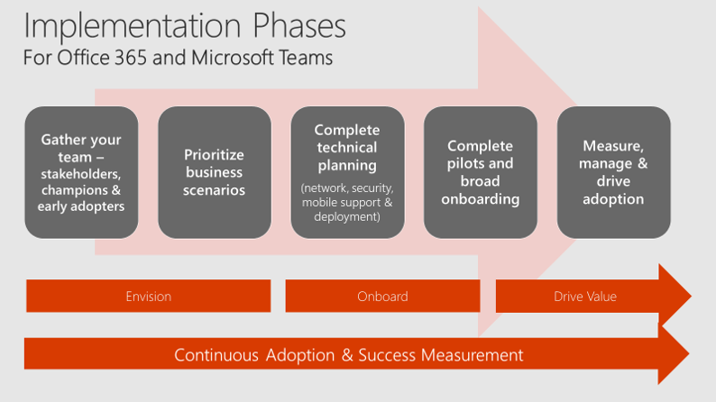
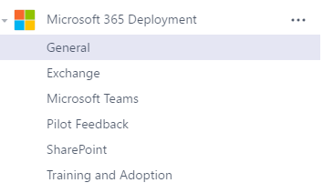
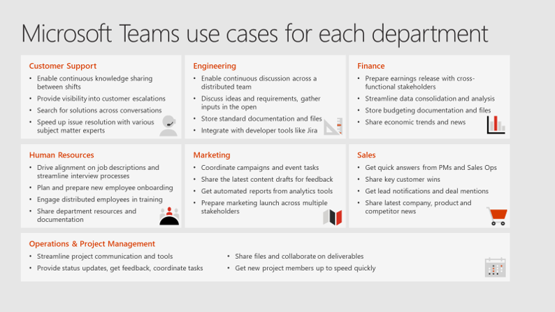

クイック スタート: Microsoft Teams の計画ガイド
==========================================================

このガイドは、所属する組織で使用する Microsoft Teams を計画、実装、導入するための手順を説明します。 このガイドはコラボレーションおよびチームのコミュニケーション シナリオについて焦点をあてています。 Teams のエンタープライズ VoIP 機能を実装するには、[Cloud Voice](https://docs.microsoft.com/MicrosoftTeams/cloud-voice-deployment) に関するドキュメントをご覧ください。

#### *図 1: Office 365 および Teams の実装段階*

## 手順 1: ユーザーをまとめて編成する

使用する Teams の展開でのステークホルダーおよび意思決定グループとして機能するように、会社、IT 部門、ユーザー コミュニティに属している人たちのグループを編成します。 より小規模な組織では、2、3 人のユーザーのグループになるかもしれません。 正常に導入を完了するために、確実にこれらの 3 つのコミュニティすべてのユーザーを含めるようにしてください。  

各グループは、一般化の流れの中でお互いに重なる役割を果たすこともありますが、固有のスキルを持ち寄ってきます。 IT 専門家は、すべての Office 365 サービスにわたりエンドツーエンドの結合を確保しながら、エクスペリエンスの正常性、セキュリティ、管理容易性について焦点をあてることがよくあります。 ビジネス ユーザーは、貴重なテスト ケースとなる実践的なシナリオやビジネス ニーズをもたらします。 テストが成功し、広範な展開の計画を行うためには、両方の観点が必要となります。    

## 手順 2: ビジネス シナリオに優先順位を設定する

コラボレーションやコミュニケーションは、人に関わることです。 各種の機能について議論する代わりに、お客様の組織でもっとも関連性が深いビジネス シナリオを取り上げます。 お客様の会社のシナリオを定義するのに役立つ例については、[Microsoft 365 FastTrack Productivity Library](https://fasttrack.microsoft.com/microsoft365/productivitylibrary) をご覧ください。 正常に完了した Teams の展開では、製品開発部、マーケティング イベント チーム、財務グループ、サポート組織などの緊密に連携し合う俊敏なチームを中心に置いていることがよくあります。 これらのシナリオのいずれか 1 つを選択し、各ユーザーが現在どのように機能しているかについて簡易的な要約を作成します。これにより、関係するユーザーにとって意味のある形式で効率的に Teams のエクスペリエンスを設計することができます。

### :トロフィー: ベスト プラクティス:
**Teams で Teams を計画する** ユーザーが自分たちの展開を計画するために Teams を使用することで、主要なステークホルダーの変化曲線が緩やかになります。 Microsoft 365 の展開という名前のチームを作成して、展開しようと考えているさまざまなワークロード用のチャネルの作成を検討します。 お客様のチームは次のようになる可能性があります。

Microsoft Teams でチーム、チャネル、タブの計画を行うときの考慮事項についての簡単なガイダンスを含んでいるこの短いビデオを視聴します。 

<iframe width="350" height="200" src="https://www.youtube.com/embed/hjJWtoaRJeE" frameborder="0" allowfullscreen></iframe>

マイクロソフトのチームが、Office 365 テナントに有効になっていないと、以下の管理者が Office 365 は[チームへのユーザー アクセスの管理](user-access.md)の記事で、ユーザーを確実にあるアプリケーションへのアクセス。

## 手順 3: 技術計画を完成する

効率的な技術計画は、優れたユーザー エクスペリエンスの基礎となります。 所属する組織が所有しているライセンスが 50 シートを超えていて、[対象となるプラン](https://technet.microsoft.com/library/dn783224.aspx) に参加している場合は、[FastTrack の特典](https://technet.microsoft.com/library/dn783224.aspx?f=255&MSPPError=-2147217396)を利用することができます。この特典は、追加で費用がかからずに、計画、展開、サービス導入にいたるまでのガイドとして利用できます。 また、この作業をお客様自身で完了することもできます。その場合は、Office 365 アカウントでサインインすると [FastTrack](https://fasttrack.microsoft.com/) から利用できるようになる FastTrack オンボーディング ウィザードを使用します。 以下の情報は、この手順を Teams のために完了するのに役立ちます。 少なくとも、次の 4 つの記事の内容を確認する必要があります。

1.  [Teams の導入に向けた環境の準備を確認する](environment-readiness.md)
2.  [Teams 用にネットワークを準備する](prepare-network.md)
3.  [Office 365 の URL と IP アドレスの範囲](office-365-urls-ip-address-ranges.md)
4.  [Teams でのゲスト アクセス](guest-access.md)

さらに、一部の組織では、[Teams のセキュリティとコンプライアンスの概要](security-compliance-overview.md)を確認する必要がある可能性があります。

## 手順 4: パイロットを実施し、Teams を展開する

これまでに選択したシナリオの 1 つまたはそれ以上において、多くの組織では、ステークホルダー、チャンピオン、アーリー アダプターとともに初期の Teams パイロットを実施することが考えられます。 パイロットによって、Office 365 および Teams がどのように組織で受け取られるかについての有意義な情報が得られます。 関心のあるユーザー グループと、優先順位が設定されたビジネス シナリオをを選択して開始します。 図 2 にはシナリオのいくつかの例が示されています。

#### *図 2: Teams でのユース ケースの例*

パイロットが完了したら、Teams の展開を広げることを計画するために必要なフィードバックを得られます。 大規模な組織では、高品質な従業員エクスペリエンスを実装するのために必要な研修やトレーニングの作業を管理できるよう、展開が段階的に実施されます。 展開の計画で、従業員が Office 365 および Teams を最大限に活用できるように、必ず優先順位が設定されたビジネス シナリオが統合されていることを確認してください。

Teams をオンする準備ができたら、「[Teams 用の Office 365 ライセンス](office-365-licensing.md)」を読んでその手順を確認してください。

### :トロフィー: ベスト プラクティス:
より小規模な組織 (現時点で 2500 未満のユーザー) では、Teams を組織全体で有効にして、すべてのユーザーを 1 つの会社全体のチームに追加します。 共通の参照項目およびタスクをそのチームに追加して、すべてのユーザーが簡単にコラボレーションと生産性の向上を実施できるようにします。

会社での広範なコラボレーションのために Yammer を使用する場合は、Yammer を Teams エクスペリエンスに統合することを検討してください。 この統合によって、Yammer のネイティブ ブラウザーやモバイル エクスペリエンスが利用できなくなることはありません。組織全体にわたり幅広く関心があるトピックについての最新情報を取得し続けるための統合手段を提供します。 詳細については、「[Tech Tip: Community management for Yammer with Microsoft Teams (技術ヒント: Microsoft Teams と統合した Yammer でのコミュニティ管理)](https://youtu.be/LU-sv-07jcY)」をご覧ください。

### モバイルの機能を忘れずに!
Teams を展開しているときに、モバイル エクスペリエンスをオンにすることを忘れないでください。 お客様のユーザーが Office 365 のモバイル アプリケーションを実行できるようにすることによって、使用状況と満足度が劇的に向上します。 Office、Outlook、SharePoint、Teams、Planner、Yammer、およびその他の有名な Office 365 サービスはすべて、モバイル エクスペリエンスを提供しています。 ベスト プラクティスとして、デスクトップおよびブラウザーのクライアントを展開すると同時に[Teams のモバイル エクスペリエンスをオンにします](get-clients.md#mobile-clients)。

## 手順 5: 使用状況を測定し、満足度を管理し、導入を促進する

ソフトウェアを展開すること以外にも、組織での変更を促進するために必要なことがあります。 コラボレーションを確かなものにするには、技術よりも人の問題に対処することになります。 Office 365 と Teams を正常に導入するためには、継続して従業員のエクスペリエンスを重視する必要があります。 ここでは、開始するにあたってのベスト プラクティスの簡易チェックリストを示しています。 Microsoft のパートナーからも、組織のために適正な導入計画を作成するための支援を受けることができます。

1. **ベスト プラクティスについて、「[Office 365 Adoption Guidance]( https://aka.ms/office365adoptionguide)**」を読みます。 「[Microsoft Teams の変更管理戦略を作成する](change-management-strategy.md)」の記事を参考にして、お客様自身のアプローチを文書化します。
1. **「[Office 365 アクティビティ レポート](https://support.office.com/article/Activity-Reports-in-the-Office-365-admin-center-0d6dfb17-8582-4172-a9a9-aed798150263)**」を詳しく調べて、現在の環境全体にわたる使用状況を把握します。 お客様が会社における Office 365 管理者ではない場合は、管理者に問い合わせて、アクティビティ レポートにアクセスできるように、レポートを読むためのアクセス許可を付与してもらいます。
2. Office 365 および Teams についてのエクスペリエンスに関して、**従業員からのフィードバックを取得します**。 組織のユーザーが 2500 人より少ない場合は、Teams の公開チャネルを使用します。 組織の規模が Teams での現在のメンバーシップ制限を超えている場合は、Yammer のパブリック グループを使用します。 

4. **チャンピオンを育成し、成功したことについて強調します。** 従業員に対して、新しいツールを抱えながらそれらを会社のビジネス成果に結びつく革新的な方法で使用していることについて報奨を与えます。 そうすることで、より着実に Office 365 と Teams の継続的な導入が確実になります。

## 次のステップ
1. [ツールとワークショップ: Teams の計画、提供、導入](planning-workshop-practical-guide.md)に移動します
2. 「[Quick start guide: Successfully enable Teams (クイック スタート ガイド: Teams を正常に利用できるようにする)](http://download.microsoft.com/download/F/3/9/F39B4F10-5720-4516-87E1-91E5A5678EFB/MicrosoftTeams-AdminQuickStart-EnableTeams.docx)」の技術計画に関するアンケートをダウンロードして記入します。
3. 組織内で Teams を起動するためのワークショップ「[Microsoft Teams の計画、提供、運用](http://download.microsoft.com/download/A/A/D/AAD74246-790D-4E61-8DA0-865742CB42DB/MicrosoftTeams-Planning-Workshop-Dec2017.pptx)」をダウンロードします。
