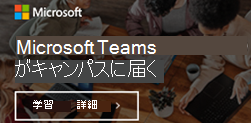

教育機関管理者向け Microsoft Teams のリソースMicrosoft Teams resources for Education admins
==============================================

## リモート学習のリソースResources for remote learning

学校や大学で Microsoft Teams をリモート学習を有効にする必要がありますか?Does your school or university need to enable Microsoft Teams for remote learning? 1 ページの [開始] と以下の導入資料を [使用](https://github.com/MicrosoftDocs/OfficeDocs-SkypeForBusiness/blob/live/Teams/downloads/edu-resources/teams-for-education-getting-started-1-pager.pdf?raw=true) して、簡単に起動して実行できます。Get up and running quickly with the [Getting Started one-pager](https://github.com/MicrosoftDocs/OfficeDocs-SkypeForBusiness/blob/live/Teams/downloads/edu-resources/teams-for-education-getting-started-1-pager.pdf?raw=true) and any of the below adoption materials!

## 導入向けコンテンツAdoption content

メール、ポスター、資料など、今すぐ無料で使用できるリソースを使用して、学校で Microsoft Teams に関する最新情報を得ます。Get your school excited about Microsoft Teams with emails, posters, handouts, and more resources that you are free to use now. バナー、GIF、ビデオで満たされた新しいデジタル ツールキットを使用して、オンラインや学内の学生にアクセスできます。You can also reach students online and across campus with the new digital toolkit filled with banners, GIFs, and videos. 今すぐ始めましょう。Get started today!

これらの資料を [使用する前に、ご契約条件](https://github.com/MicrosoftDocs/OfficeDocs-SkypeForBusiness/blob/live/Teams/downloads/edu-resources/license_agreement_teams_for_education.pdf?raw=true) をお読みください。Please read the [terms and conditions](https://github.com/MicrosoftDocs/OfficeDocs-SkypeForBusiness/blob/live/Teams/downloads/edu-resources/license_agreement_teams_for_education.pdf?raw=true) before you use these materials.

### 物理資産Physical assets

| |  |
|---------|---------|
|ポスター - [カスタマイズ可能](https://github.com/MicrosoftDocs/OfficeDocs-SkypeForBusiness/blob/live/Teams/downloads/edu-resources/posters-customizable.zip?raw=true) で [印刷可能](https://github.com/MicrosoftDocs/OfficeDocs-SkypeForBusiness/blob/live/Teams/downloads/edu-resources/posters-print-ready.zip?raw=true)Posters - [customizable](https://github.com/MicrosoftDocs/OfficeDocs-SkypeForBusiness/blob/live/Teams/downloads/edu-resources/posters-customizable.zip?raw=true) and [print-ready](https://github.com/MicrosoftDocs/OfficeDocs-SkypeForBusiness/blob/live/Teams/downloads/edu-resources/posters-print-ready.zip?raw=true)      |[資料Handouts](https://github.com/MicrosoftDocs/OfficeDocs-SkypeForBusiness/blob/live/Teams/downloads/edu-resources/handouts.zip?raw=true) |
|[チラシFlyers](https://github.com/MicrosoftDocs/OfficeDocs-SkypeForBusiness/blob/live/Teams/downloads/edu-resources/flyers.zip?raw=true)    |[書籍の広告Book adverts](https://github.com/MicrosoftDocs/OfficeDocs-SkypeForBusiness/blob/live/Teams/downloads/edu-resources/book-adverts.zip?raw=true)          |
|[ヒントとテクニックの小冊子Tips and Tricks booklet](https://github.com/MicrosoftDocs/OfficeDocs-SkypeForBusiness/blob/live/Teams/downloads/edu-resources/get-started-tips-tricks.zip?raw=true)      |

### デジタル資産Digital assets

Teams の起動を最大化するために [、Toolkitガイダンス](https://github.com/MicrosoftDocs/OfficeDocs-SkypeForBusiness/blob/live/Teams/downloads/edu-resources/digital-toolkit-guidance.zip?raw=true) を確認してください。Be sure to check out the [Digital Toolkit Guidance](https://github.com/MicrosoftDocs/OfficeDocs-SkypeForBusiness/blob/live/Teams/downloads/edu-resources/digital-toolkit-guidance.zip?raw=true) to maximize your Teams launch! 

|  |  |
|---------|---------|
|[メール テンプレートEmail templates](https://github.com/MicrosoftDocs/OfficeDocs-SkypeForBusiness/blob/live/Teams/downloads/edu-resources/email-templates.zip?raw=true)      |[GIFGIFs](https://github.com/MicrosoftDocs/OfficeDocs-SkypeForBusiness/blob/live/Teams/downloads/edu-resources/gifs.zip?raw=true)         |
|[Web バナーWeb banners](https://github.com/MicrosoftDocs/OfficeDocs-SkypeForBusiness/blob/live/Teams/downloads/edu-resources/web-banners.zip?raw=true)     |[ビデオVideos](https://github.com/MicrosoftDocs/OfficeDocs-SkypeForBusiness/blob/live/Teams/downloads/edu-resources/videos.zip?raw=true)           |
|[デジタルスクリーン広告Digital screen adverts](https://github.com/MicrosoftDocs/OfficeDocs-SkypeForBusiness/blob/live/Teams/downloads/edu-resources/digital-screen-adverts.zip?raw=true)    |      |

## 実施すべき内容Call to action

- トレーニング、 [ビデオ、対話型デモについては、Teams for Education](https://www.microsoft.com/en-us/education/products/teams/default.aspx) のページにアクセスしてくださいVisit the [Teams for Education page](https://www.microsoft.com/en-us/education/products/teams/default.aspx) for trainings, videos, and interactive demos
- [Microsoft 365](https://portal.office.com/adminportal/home#/Settings/ServicesAndAddIns)管理センターで Teams を有効にする (Office 365 管理者としてサインインする)Turn on Teams in the [Microsoft 365 admin center](https://portal.office.com/adminportal/home#/Settings/ServicesAndAddIns) (sign in as an Office 365 admin)
- Teams クライアントをダウンロードする: [すべてのデバイスで Teams をオンにする](https://teams.microsoft.com/downloads)Download Teams clients: [Get Teams on all your devices](https://teams.microsoft.com/downloads)
- [Education ヘルプ センター](https://support.office.com/education)で Office 365 for Education について学ぶLearn more about Office 365 for Education at the [Education help center](https://support.office.com/education)

## その他のリソースAdditional resources

- [Teams のロードマップTeams roadmap](https://aka.ms/teamsroadmap)
- [Tech Community Blog ](https://techcommunity.microsoft.com/t5/Microsoft-Teams-Blog/bg-p/MicrosoftTeamsBlog) で最新情報を入手するStay up to date with our [Tech Community Blog](https://techcommunity.microsoft.com/t5/Microsoft-Teams-Blog/bg-p/MicrosoftTeamsBlog)
- [Teams での PowerShell の概要Teams PowerShell overview](teams-powershell-overview.md)
- [提案を送信するSend a suggestion](https://aka.ms/eduuservoice)
- [サポートに問い合わせるContact support](https://aka.ms/o365portal)
- [Teams コミュニティに質問するAsk the Teams community](https://aka.ms/msteamscommunity)
- [教育に関する資料を見つけるFind more resources for education](https://education.microsoft.com/)
