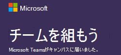

教育機関管理者向け Microsoft Teams のリソース
==============================================

## リモート学習のリソース

学校や大学で Microsoft Teams をリモート学習を有効にする必要がありますか? 1 ページの [開始] と以下の導入資料を [使用](https://github.com/MicrosoftDocs/OfficeDocs-SkypeForBusiness/blob/live/Teams/downloads/edu-resources/teams-for-education-getting-started-1-pager.pdf?raw=true) して、簡単に起動して実行できます。

## 導入向けコンテンツ

メール、ポスター、資料など、今すぐ無料で使用できるリソースを使用して、学校で Microsoft Teams に関する最新情報を得ます。 バナー、GIF、ビデオで満たされた新しいデジタル ツールキットを使用して、オンラインや学内の学生にアクセスできます。 今すぐ始めましょう。

これらの資料を [使用する前に、ご契約条件](https://github.com/MicrosoftDocs/OfficeDocs-SkypeForBusiness/blob/live/Teams/downloads/edu-resources/license_agreement_teams_for_education.pdf?raw=true) をお読みください。

### 物理資産

| |  |
|---------|---------|
|ポスター - [カスタマイズ可能](https://github.com/MicrosoftDocs/OfficeDocs-SkypeForBusiness/blob/live/Teams/downloads/edu-resources/posters-customizable.zip?raw=true) で [印刷可能](https://github.com/MicrosoftDocs/OfficeDocs-SkypeForBusiness/blob/live/Teams/downloads/edu-resources/posters-print-ready.zip?raw=true)      |[資料](https://github.com/MicrosoftDocs/OfficeDocs-SkypeForBusiness/blob/live/Teams/downloads/edu-resources/handouts.zip?raw=true) |
|[チラシ](https://github.com/MicrosoftDocs/OfficeDocs-SkypeForBusiness/blob/live/Teams/downloads/edu-resources/flyers.zip?raw=true)    |[書籍の広告](https://github.com/MicrosoftDocs/OfficeDocs-SkypeForBusiness/blob/live/Teams/downloads/edu-resources/book-adverts.zip?raw=true)          |
|[ヒントとテクニックの小冊子](https://github.com/MicrosoftDocs/OfficeDocs-SkypeForBusiness/blob/live/Teams/downloads/edu-resources/get-started-tips-tricks.zip?raw=true)      |

### デジタル資産

Teams の起動を最大化するために [、Toolkitガイダンス](https://github.com/MicrosoftDocs/OfficeDocs-SkypeForBusiness/blob/live/Teams/downloads/edu-resources/digital-toolkit-guidance.zip?raw=true) を確認してください。 

|  |  |
|---------|---------|
|[メール テンプレート](https://github.com/MicrosoftDocs/OfficeDocs-SkypeForBusiness/blob/live/Teams/downloads/edu-resources/email-templates.zip?raw=true)      |[GIF](https://github.com/MicrosoftDocs/OfficeDocs-SkypeForBusiness/blob/live/Teams/downloads/edu-resources/gifs.zip?raw=true)         |
|[Web バナー](https://github.com/MicrosoftDocs/OfficeDocs-SkypeForBusiness/blob/live/Teams/downloads/edu-resources/web-banners.zip?raw=true)     |[ビデオ](https://github.com/MicrosoftDocs/OfficeDocs-SkypeForBusiness/blob/live/Teams/downloads/edu-resources/videos.zip?raw=true)           |
|[デジタルスクリーン広告](https://github.com/MicrosoftDocs/OfficeDocs-SkypeForBusiness/blob/live/Teams/downloads/edu-resources/digital-screen-adverts.zip?raw=true)    |      |

## 実施すべき内容

- トレーニング、 [ビデオ、対話型デモについては、Teams for Education](https://www.microsoft.com/en-us/education/products/teams/default.aspx) のページにアクセスしてください
- [Microsoft 365](https://portal.office.com/adminportal/home#/Settings/ServicesAndAddIns)管理センターで Teams を有効にする (Office 365 管理者としてサインインする)
- Teams クライアントをダウンロードする: [すべてのデバイスで Teams をオンにする](https://teams.microsoft.com/downloads)
- [Education ヘルプ センター](https://support.office.com/education)で Office 365 for Education について学ぶ

## その他のリソース

- [Teams のロードマップ](https://aka.ms/teamsroadmap)
- [Tech Community Blog ](https://techcommunity.microsoft.com/t5/Microsoft-Teams-Blog/bg-p/MicrosoftTeamsBlog) で最新情報を入手する
- [Teams での PowerShell の概要](teams-powershell-overview.md)
- [提案を送信する](https://aka.ms/eduuservoice)
- [サポートに問い合わせる](https://aka.ms/o365portal)
- [Teams コミュニティに質問する](https://aka.ms/msteamscommunity)
- [教育に関する資料を見つける](https://education.microsoft.com/)
