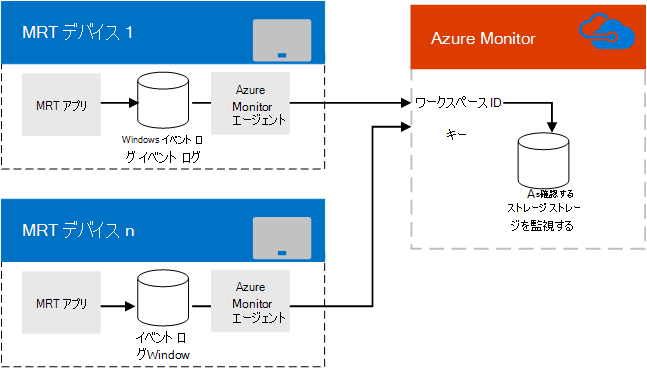

# Azure モニターを使用して Microsoft Teams の会議室の管理を計画する
 
 この記事では、Microsoft Teams または Skype for Business の実装で Azure モニターを使用して Microsoft Teams のルームデバイスを管理する場合の計画に関する考慮事項について説明します。
  
[Azure Monitor](https://docs.microsoft.com/azure/azure-monitor/overview)は、最初からクラウドで設計された管理サービスのコレクションです。 オンプレミスのリソースを展開して管理する代わりに、Azure Monitor コンポーネントはすべて Azure でホストされます。 構成は最小限で、わずかな時間ですぐに起動して実行できます。 一部のカスタマイズ作業では、Microsoft Teams の会議システムを管理するために、個々の room システムのシステム正常性またはフォールトに関するリアルタイムの通知が提供されます。また、多くの Microsoft Teams の管理にも対応できる場合があります会議室の会議室。
  
この記事では、Microsoft Teams 室の会議デバイスの Azure Monitor ベースの管理を実装するために必要な要件、設計、アーキテクチャ、実装のベストプラクティスについて説明し、詳細な記事へのリンクを提供します。microsoft Teams 室の管理と、Microsoft Teams ルームの継続的な監視に関する重要なリファレンス情報に対する Azure モニターの実装。 
  
## 機能の概要

  
コンソールデバイス上の Microsoft Teams 会議アプリは、Windows イベントログにイベントを書き込みます。 Microsoft Monitoring agent をインストールすると、その情報が Azure Monitor サービスに渡されます。 
  
適切に構成されたら、ログ解析は、イベントの説明に埋め込まれた JSON ペイロードを解析して、Microsoft Teams の各ルームシステムがどのように機能しているか、検出されたエラーを説明します。 
  
Azure モニターを使用している管理者は、Microsoft Teams の会議室システムについて、オフラインになっている、またはアプリ、接続、ハードウェアの障害が発生していること、またシステムを再起動する必要があるかどうかを確認する通知を受けることができます。 各システム状態は頻繁に更新されるため、これらの通知はリアルタイムの更新プログラムに近い状態になります。
  
## Azure モニターの要件

ログ分析機能を使用するには、Azure モニター用の有効な Azure サブスクリプションが必要です。 組織のサブスクリプションを作成するには、「[ログ分析ワークスペースの使用を開始](https://docs.microsoft.com/azure/azure-monitor/learn/quick-create-workspace)する」を参照してください。
  
ログ分析ビューデザイナーの使用方法については、必要に応じて理解しておく必要があります。 詳細については、「[ログ分析のビュー」を](https://docs.microsoft.com/azure/azure-monitor/platform/view-designer)参照してください。
  
### 関連タスク

1. Azure Monitor ログ分析にサブスクライブしたら、Microsoft Teams ルーム本体から送信される情報を解析するのに必要なカスタムフィールドを作成します ([[マップのユーザー設定フィールド](azure-monitor-deploy.md#Custom_fields)] で説明されています)。 これには、「[ログエントリについて理解](azure-monitor-manage.md#understand-the-log-entries)する」で説明されている JSON スキーマの概要が含まれます。
    
2. ログ分析で Microsoft Teams のルーム管理ビューを開発します。 [Microsoft teams のルームダッシュボードを作成するには、インポート方法を使用](azure-monitor-deploy.md#create-a-microsoft-teams-rooms-dashboard-by-using-the-import-method)するか、 [Microsoft teams のルームダッシュボードを手動で作成](azure-monitor-deploy.md#create-a-microsoft-teams-rooms-dashboard-manually)します。
    
## 個々の Microsoft Teams 室のコンソール要件

Microsoft Teams の各ルームコンソールは、キオスクモードで Surface Pro デバイスで実行されているアプリです (通常は、デバイスで実行できる唯一のアプリとして構成されています)。 他の Windows アプリと同じように、Microsoft Teams の会議アプリでは、起動やハードウェアの障害などのイベントを Windows イベントログに書き込みます。 Microsoft Teams のルームデバイスに Microsoft Monitor エージェントを追加すると、これらのイベントを収集できます。 (詳細については[、「Windows コンピューターを Azure のログ分析サービスに接続する」を](https://docs.microsoft.com/azure/azure-monitor/platform/agent-windows)参照してください。)
  
## 進行中の管理

Azure モニターを使用して Microsoft Teams の会議室のデバイスを管理しているときに、Azure モニターで使用されるイベントログに含まれる情報について理解する必要があります。 これらの正常性メッセージの詳細について[は、「ログエントリについ](azure-monitor-manage.md#understand-the-log-entries)て」を参照してください。
  
### 関連タスク

- Microsoft Teams のルームによって生成されるアラートとその解決方法について説明します (「[ログエントリを理解](azure-monitor-manage.md#understand-the-log-entries)する」のセクションを参照してください)。
    
## 関連項目

[Azure モニターを使用して Microsoft Teams のルーム管理を展開する](azure-monitor-deploy.md)
  
[Azure モニターを使用して Microsoft Teams 室のデバイスを管理する](azure-monitor-manage.md)