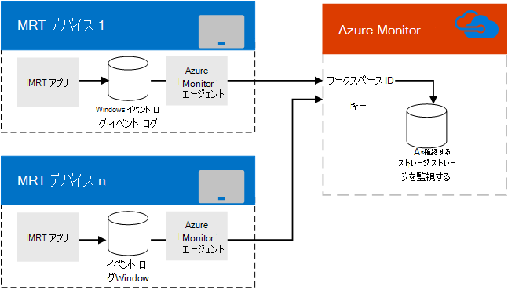

# Azure Monitor でMicrosoft Teams Rooms監視を計画する
 
 この記事では、Microsoft Teams や Skype for Business の実装で、Azure Monitor を使用して Microsoft Teams Rooms デバイスを管理する場合の計画上の考慮事項について説明します。

> [!NOTE]
> Teams 管理センターを使用して[、Teams Roomsの正常性監視を設定](../alerts/device-health-status.md)することもできます。

[!INCLUDE [teams-pro-license-requirement](../includes/teams-pro-license-requirement.md)]

[Azure Monitor](/azure/azure-monitor/overview) は、最初からクラウドで設計された監視サービスのコレクションです。 Azure Monitor コンポーネントでは、オンプレミスのリソースをデプロイおよび管理するのではなく、すべて Azure でホストされます。 構成は最小限であり、数分で稼働させることができます。 カスタマイズ作業によっては、個々のルーム システムのシステム正常性または障害の通知を提供することでMicrosoft Teams Roomsの監視に役立ち、数千のMicrosoft Teams Roomsの管理にスケールアップできます。
  
この記事では、Microsoft Teams Roomsの Azure Monitor ベースの監視を実装するために必要な要件、設計/アーキテクチャ、および実装のベスト プラクティスについて説明します。 また、Microsoft Teams Rooms用の Azure Monitor の実装に関する詳細な記事へのリンクと、Microsoft Teams Rooms ルームの継続的な監視のための重要な参照情報も提供されています。
  
## 機能の概要

  
Microsoft Teams Rooms アプリは、Windows イベント ログにイベントを書き込みます。 Microsoft Monitoring エージェントは、インストールされると、Azure Monitor サービスに情報を渡します。
  
適切に構成されると、Log Analytics はイベントの説明に埋め込まれた JSON ペイロードを解析して、Microsoft Teams Roomsがどのように機能しているか、どのような障害が検出されるかを説明します。
  
Azure Monitor を使用している管理者は、オフラインまたはアプリ、接続、ハードウェアの障害が発生しているMicrosoft Teams Roomsの通知を受け取り、システムを再起動する必要があるかどうかを確認できます。 各システムの状態は頻繁に更新されるため、これらの通知はほぼリアルタイムの更新情報となります。
  
## Azure Monitor の要件

Log Analytics 機能を使用するには、Azure Monitor の有効な Azure サブスクリプションが必要です。 組織のサブスクリプションを作成するには、「[Log Analytics ワークスペースの使用を開始する](/azure/azure-monitor/learn/quick-create-workspace)」を参照してください。
  
Log Analytics ビュー デザイナーの使用方法について理解しておく必要があります。 これらの詳細については、「[Log Analytics のビュー](/azure/azure-monitor/platform/view-designer)」をご覧ください。
  
### 関連作業

1. Azure Monitor Log Analytics をサブスクライブしたら、Microsoft Teams Roomsから送信される情報を解析するために必要なカスタム フィールドを作成します ([カスタム フィールドのマップ](azure-monitor-deploy.md#Custom_fields)で説明されているように)。 これには、「[ログ エントリを理解する](azure-monitor-manage.md#understand-the-log-entries)」で説明されている JSON スキーマについて理解することが含まれます。
    
2. Log Analytics の [Microsoft Teams Rooms 管理] ビューを開発します。 [Microsoft Teams Rooms ダッシュボードは手動で作成](azure-monitor-deploy.md#create-a-microsoft-teams-rooms-dashboard-manually)できます。
    
## 個々のMicrosoft Teams Rooms要件

Microsoft Teams Roomsは、キオスク モードでコンピューティング デバイスで実行されているアプリです。 他の Windows アプリと同様に、Microsoft Teams Rooms アプリは、起動やハードウェア障害などのイベントを Windows イベント ログに記録します。 Microsoft Teams Roomsに Microsoft Monitor エージェントを追加すると、これらのイベントを収集できます。 (詳細については、「[Windows コンピューターを Azure の Log Analytics サービスに接続する](/azure/azure-monitor/platform/agent-windows)」を参照してください。)
  
## 継続的な管理

Azure Monitor を使用してMicrosoft Teams Roomsを監視するときに、Azure Monitor で使用されるイベント ログに含まれる情報を理解する必要があります。 これらの正常性メッセージの詳細については、「[ログ エントリを理解する](azure-monitor-manage.md#understand-the-log-entries)」を参照してください。
  
### 関連作業

- Microsoft Teams Rooms により生成されたアラートとそれらの解決方法を理解する (「[ログ エントリを理解する](azure-monitor-manage.md#understand-the-log-entries)」というタイトルのセクションを参照)
    
## 関連項目

[Azure Monitor を使用して Microsoft Teams Rooms 管理をデプロイする](azure-monitor-deploy.md)
  
[Azure Monitorを使用して Microsoft Teams Rooms デバイスをデプロイする](azure-monitor-manage.md)
