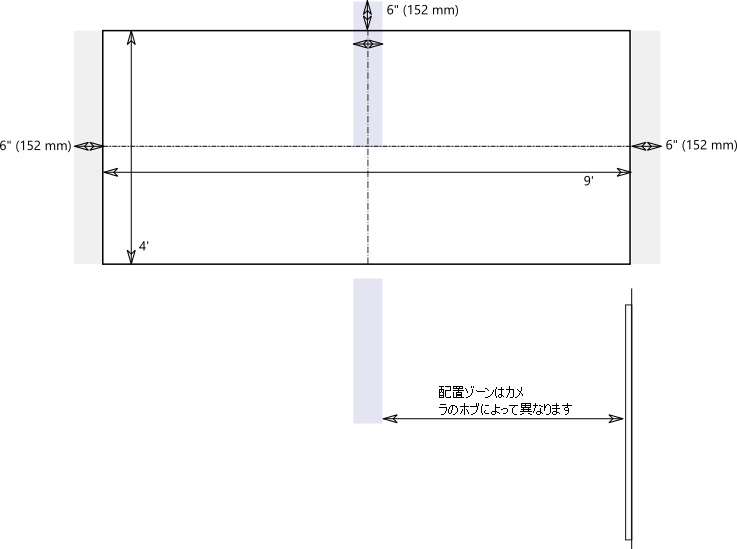
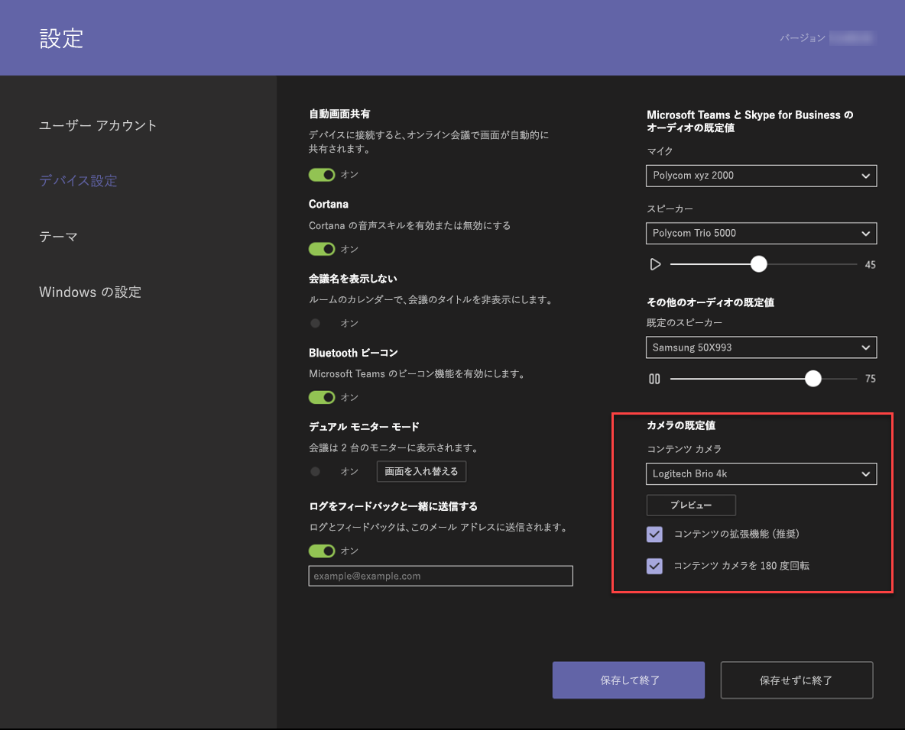

# コンテンツ カメラ

Microsoft Teams ミーティング システムでコンテンツ カメラを使用できるようになりました。 コンテンツ カメラは、特殊な画像処理ソフトウェアやホワイトボードと連携して、発表者がアナログ ホワイトボードに描画し、リモート参加者とそのコンテンツを共有できるようにします。

コンテンツ カメラの機能の例については、次のビデオを参照してください。

> [!VIDEO https://www.microsoft.com/videoplayer/embed/RE3E7fy]

## コンテンツ カメラを設定する

> [!NOTE]
> お住まいの国または地域の建築基準法に必ず従ってください。床からの最小距離、または天井に取り付けられた機器を垂木または他の構造物に固定する要件が定義されている場合があります。 選択したカメラに同梱されているハードウェアのマウント手順に従ってください。 OEM カメラ マウント キットには、カメラ、USB 2.0 エクステンダー、必要なケーブルが含まれています。

共有に使用するホワイトボードのサイズは、カメラの位置に影響します。 推奨されるボードのサイズは次のとおりです。

- 幅 0.9 から 1.8 m - サポート対象
- 幅 1.8 から 2.7 m - 推奨
- 幅 2.7 から 3.6 m ‐ サポート対象
- 幅 3.6 m を超える - カメラは 2.7 から 3.6 m までカバーし、残りはトリミングされます。

## カメラの場所

コンテンツ カメラの最適な配置は、ホワイトボード上で垂直方向と水平方向にセンタリングされている状態です。 地域の建築基準法によっては、高度の制限があり、カメラをホワイトボードの上部より高く設置することが求められる場合があります。

カメラは、図に示されているように、ホワイトボードの上部よりも 最大 152 mm 高く、ホワイトボードの中央に設置できます。 カメラの画像の左右両側に少なくとも 152 mm の罫線が 含まれていることを確認してください。 Microsoft Teams Rooms アプリのカメラ プレビューを使用して、カメラの最終的な配置を決定できます。

### カメラの距離

一般的なホワイトボード マーカーを使用する場合、リモート ユーザー エクスペリエンスを最適にするには、コンテンツ カメラの画像のピクセル範囲あたり 1 - 2 mm のインク ストロークを共有します。最良の結果を得るには、ピクセルあたり 1.5 mm を使用します。 サポートされているすべてのカメラでは、1920 x 1080 の解像度が提供され、中にはその解像度を超えるものもあります。

ホワイトボードとカメラの距離は、カメラの解像度および HFoV を組み合わせて決定します。 次の表には、さまざまなホワイトボード サイズの距離の例が示されています。 これらの値を開始点として使用し、コンテンツ カメラの最終的な配置を決定することができます。

**ホワイトボードからカメラまでの距離**

| カメラの HFoV |0.91 m     | 1.8 m    | 2.74 m        |3.65 m         | ホワイトボードからの最大距離  |
|:---         |:---               |:---                |:---                 |:---             | :--- |
| 80°         | 0.54 m | 1.09 m  | 1.6 m    |2.17 m |2.28 m |
| 90°         | 0.45 m | 0.91 m   | 1.37 m    |1.82 m    |1.92 m |
| 100°        | 0.38 m| 0.77 m   | 1.15 m   |1.53 m   |1.61 m |
| 110°        | 0.32 m| 0.64 m   | 0.96 m   |1.28 m    |1.31 m |
| 120°        | 0.26 m| 0.52 m   | 0.79 m   |1.05 m   |1.10 m |
|             |               |                  |                  |        |                    |                  |

コンテンツ カメラとホワイトボードが取り付けられている壁との距離は、そのカメラのモデルの HFoV によって異なります。 HFoV が広い (たとえば、120 度) カメラの場合は壁に近づけて設置し、HFoV が狭いカメラの場合は、壁から遠く離して設置します。 選択したカメラを設置する前に、HFoV を確認してください。

3.65 mを超えるホワイトボードを使用する場合、または (壁全体がホワイトボードのように) 四隅がない場合は、カメラを中央の任意の場所に配置できます。 拡張ソフトウェアは、ホワイトボードの四隅を検出できない場合、中央の領域を選択します。

> [!NOTE]
> 暗色のテープやその他のアイテムを使用して、壁全体のホワイトボードに定義されたコンテンツ カメラ領域を作成できます。
>
> 固定設置する代わりに、カメラを可動三脚に取り付けることも選択できます。 三脚をホワイトボードの中央に配置します。 この設定は、一時的に使用したり、装置が倒れる可能性がほとんどない場所で使用したりする場合に行えます。 一時的に取り付けた場合、最初の共有の後にカメラを移動すると、コンテンツの拡張機能が影響を受け、移動を修正するために再共有しなければならないことに注意してください。
>
> ホワイト以外のライティング ボードはサポートされていません。

## サポートされるカメラ

カメラをコンテンツ カメラとして使用できるかどうかを確認するには、「[USB オーディオとビデオの周辺機器についての認定済みファームウェア バージョン](requirements.md#certified-firmware-versions-for-usb-audio-and-video-peripherals)」を参照してください。

または、サポートされているコンテンツ カメラ キットについては、Microsoft Teams デバイス マーケットプレイス ([aka.ms/teamsdevices](https://aka.ms/teamsdevices)) を参照してください。

## カメラの設定

部屋にカメラを設置したら、その部屋の Microsoft Teams Rooms コンソールにカメラを設定します。

1. **[設定]** ![[設定] アイコン](../media/70f1b43f-16d6-4172-9139-71d845c4ed5c.png) を選択し、管理者としてログインし、**[デバイスの設定]** を選択します。
2. **[カメラの既定値]** セクションで、コンテンツ カメラを選び、**[コンテンツの拡張機能]** オプションが選択されていることを確認します。
3. (オプション) カメラを天井から取り付けるためにカメラが上下逆になってしまった場合は、**[コンテンツ カメラを 180 度回転]** オプションをオンにします。
4. **[保存して終了]** を選択します。

[XML 構成ファイル](xml-config-file.md)を使用して、これらの設定をリモートで調整することもできます。

## 関連項目

[Microsoft Teams Rooms のコンソールの設定を、XML 構成ファイルを使用してリモートで管理する](xml-config-file.md)

[Microsoft Teams Rooms の要件](requirements.md)

