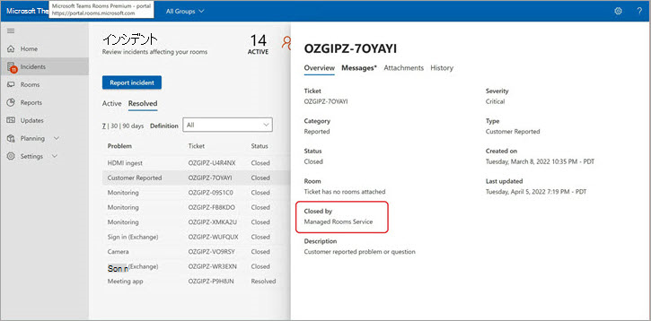

# 顧客から報告されたインシデント チケット

Microsoft がフラグを設定しなかったあらゆる種類のインシデント、またはサービス/機能に関する質問については、お客様に代わって顧客またはパートナーがインシデント報告機能を使用して、問題を調査するか質問に回答するよう Microsoft に警告することができます。

[説明] フィールドで、Microsoft からサポートが必要な問題をできるだけ適切に説明します。 1 つ以上のルームを追加できます。

インシデントがサービスまたは重大な部屋の重大な正常性低下を引き起こしている場合は、  **高い影響** を確認します。 Microsoft が要求に適切に優先順位を付けられるように、これが大きな影響を与える理由を詳細に説明します。

> [!NOTE]
> このフィールドは、一般的な質問、会議室、または利用可能な軽減策がない問題には使用しないでください。

顧客から報告されたインシデント (CRI) は重要なチケットと見なされます。つまり、Teams Rooms Service Operations Center が最初にこれらのチケットをトリアージします。 お客様から報告されたインシデントのサービス説明 SLA については、 [こちらをご覧ください](microsoft-teams-rooms-premium.md)。 部屋が CRI の一部として選択されている (または部屋が) 選択されている場合、各ルームは CRI が閉じられるまで **異常** としてマークされます。

## 顧客から報告されたインシデント チケットを終了する

お客様から報告されたインシデントは、顧客、顧客に代わってルームを管理するパートナー、または Microsoft の Service Operations Center エンジニアによって終了できます。

**インシデントを閉じるには**

1. [ **チケットを閉じる**] を選択します。

   

1. 一覧からカテゴリを選択して、閉じる理由を選択します。

   終了の理由を確認すると、チケットは閉じられ、 **解決済** みに移動されます。

   

チケットの [詳細の概要] セクションには、Managed Rooms Service (Microsoft) または顧客/パートナーの名前によってチケットが閉じられたことが表示されます。  

 

## よくあるご質問 (FAQ)

**誰でもチケットを閉じることができますか?**

ユーザーまたは Microsoft の Managed Rooms Service Operations センターでは、お客様から報告されたインシデントのみを閉じることができます。 チケット管理のアクセス許可を持つ会議室を管理するためにパートナーを割り当てたお客様は、顧客から報告されたインシデントを終了できます。

**チケットを閉じるユーザーを制限できますか?**

現時点ではありません。 チケット管理アクセス許可を持つすべてのユーザーは、CRI を閉じることができます。

**顧客から報告されたインシデント チケットが閉じると、通知を受け取ることはできますか?**

現時点ではありません。