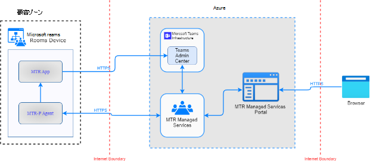
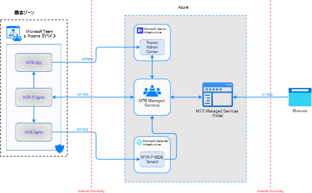

# 手法

マネージド サービスを使用しているお客様は、最も価値のある資産であるデータを Microsoft に委託します。 彼らは、そのプライバシーが保護され、期待に沿った方法でのみ使用されることを信頼しています。

このテクノロジは、プライバシー プロセスに従って、データを効果的に実行してサービスを実行する際の顧客の約束に従っていることを確認します。

## データ収集

テクノロジによって収集されるデータは、登録済みの部屋で特定された正常性、根本原因、および問題の軽減を監視するために必要な情報に限定されます。

テクノロジは、デバイスを監視し、テレメトリ データを収集し、Microsoft が管理者としてデバイスにリモートでアクセスして管理できるようにします。

収集されるテレメトリ データは、個々のユーザーではなく、Room アカウントに固有です。 個々のユーザーへの偶発的な参照は、デバイスの使用中にアクティビティ ログに記録される場合があります。

### データにアクセスできるWho

テクノロジ サービスは、不正なアクセスや不正なユーザーによる使用から顧客データを保護するために強力な対策を講じます。 これには、Microsoft の担当者と下請け業者によるアクセスの制限が含まれます。

### ゼロ スタンディング アクセス データ Storage

このテクノロジは、ゼロ スタンディング アクセスの原則を通じて、組織内外の悪意のあるアクターからの特権アクセスを持つアカウントに関連するリスクを軽減します。 これにより、既定では、任意のユーザーが利用できる特権なしでサービスを操作できます。 Just-In-Time と Just-Enough-Access の原則と組み合わせることで、セキュリティで保護され、既定で準拠する堅牢なフレームワークが提供されます。 診断データは、内部ポータルを介してサービス運用チームが利用できます。

## データ処理

Microsoft は、データ転送、ストレージ、使用、および保持に関する厳格な標準に準拠しています。 Microsoft には、データ分類に基づいてデータを処理する方法に関するデータ処理標準ポリシーがあります。

Microsoft は、一般データ保護規則 (GDPR) データ保護の権利を、ヨーロッパだけでなく世界中のすべての顧客に拡張します。

## データ分類

データ分類は、ユーザーの個人情報を収集、保存、使用するためのセキュリティ、コンプライアンス、プライバシーの要件とプロセスに準拠するために使用できます。

|分類|説明|例|
| :- | :- | :- |
|顧客コンテンツ|管理者とユーザーによって直接提供/作成されたコンテンツ。|
- 顧客が生成した BLOB または構造化ストレージ データ

- 顧客所有/提供されたシークレット (パスワード、証明書、暗号化キー、ストレージ キー)
|
|エンド ユーザー識別情報 (EUII)|Microsoft サービスのユーザーを識別または識別するために使用できるデータ。 EUII には顧客コンテンツが含まれていません。|
- ユーザー名または表示名 (DOMAIN\UserName)

- ユーザー プリンシパル名 (name@company.com)

- ユーザー固有の IP アドレス
|
|アカウント データ|
テナントなどの管理者の連絡先情報を含む、顧客の課金情報と支払い方法の情報

管理者の名前、住所、または

電話番号。
|
- テナント管理者の連絡先情報 (たとえば、

テナント管理者の名前、アドレス、電子メール アドレス、電話番号)

- 顧客のプロビジョニング

情報
|
|エンド ユーザー擬似識別子 (EUPI)|
Microsoft サービスのユーザーに関連付けられた Microsoft によって作成された識別子。 EUPI をマッピング テーブルなどの他の情報と組み合わせると、エンド ユーザーが識別されます。 EUPI には、お客様によってアップロードまたは作成された情報は含まれていません

(顧客コンテンツまたは EUII)
|
- ユーザー GUID、PUID、または SID

- セッション ID
|
|組織識別情報 (OII)|テナントの識別に使用できるデータ(一般に構成データまたは使用状況データ)。 このデータはユーザーにリンクできず、顧客コンテンツも含まれません。|
- テナント ID (GUID 以外)

- 電子メール アドレス (xxx@contoso.com) またはその他のテナント固有のドメイン内のドメイン名

情報
|
|システム メタデータ|ユーザーまたはテナントにリンクできないサービスまたはプログラムの実行中に生成されたデータ。|
- イベント ログ

- 使用状況データ

- 構成データ
|

テクノロジの説明

このテクノロジは、デプロイ内の問題の監視、診断、軽減を目的として、Microsoft にデータを送信します。 例を次に示します。

1. デバイスが最新であることを確認する (アプリ、OS、ドライバー、F/W を含む)
1. デバイスを使用する準備ができている (サインインしている、正常な状態を報告するすべての周辺機器など)
1. 環境の準備が整っている (プロビジョニングされたアカウント、ネットワーク速度が十分に速いなど)
1. ハードウェアの問題やインストールの問題 (ケーブルの緩みなど) がある可能性があるかどうかを判断する
1. 問題を特定するためのヒューリスティック (過剰な再起動など) 

テクノロジは、次のようなアクションを使用してデバイスを管理します。

1. ソフトウェアの更新
1. 再起動による問題の軽減、USB 接続&状態のリセット
1. 問題の診断に役立つ特定のログを収集する

このテクノロジは、ソリューション キットのオーディオ、ビデオ、メディア、会議コンテンツを監視または記録しません。 

### サービスで収集されたデータ カテゴリ
 
|[カテゴリ]|詳細|クエリの理由|
| :- | :- | :- |
|継続的なデータ収集&管理|IP アドレス、ルーム アカウントの ID (Exchange、Skype for Business、Teams)、場所座標、電子メール、Microsoft またはソフトウェアとのポータル内の通信|管理下のシステムを特定してConnectする。障害を特定、診断、軽減する。使用状況、分析、およびインサイトを追跡する。接続状態の修復&クエリ|
|アドホック データ収集&管理|
イベント ログ情報、ルーム ユーザーのログイン ログ ファイルからのユーザー アクティビティ/ID、診断情報\*、Windows システム クエリ (例: USB デバイスの一覧、

電源状態など)
|障害の特定、診断、軽減、および使用状況、分析、およびインサイト|
|
試用版の登録と

セットアップ
|
Windows システム クエリ

例: USB デバイスの一覧、電源状態など。
|
登録、オンボード、注文、配送に必要です。

試用版のセットアップを行います。
|

\* デバイス アクティビティ ログの機密性の高い PII は、(テクノロジによって収集されない) ローカルで再編集されます。

1. 会議の件名&本文
1. 会議出席者の連絡先カード情報 (タイトル、電話番号など)
1. 会議 IM メッセージ コンテンツで

>> [!NOTE]
>Microsoft がテクノロジを進化させるにつれて、特定のデータは変更される可能性があります。 

### エージェント データ分類

**継続的な監視中に収集されるすべてのデータの詳細な説明**
|収集されたデータの説明|分類|
| :- | :- |
|共有デバイスの ID|OII|
|顧客 ID|OII|
|MMR エージェント ディレクトリの場所|システム メタデータ|
|MRT アプリログディレクトリの場所|システム メタデータ|
|デバイスのシリアル番号|システム メタデータ|
|デバイス Bios 情報|システム メタデータ|

|MMR エージェントのバージョン|システム メタデータ|
| :- | :- |
|MRT アプリのバージョン|システム メタデータ|
|Teams アプリのバージョン|システム メタデータ|
|MRT アプリの夜間メンテナンス ジョブの時間|システム メタデータ|
|MMR エージェントの更新 URL|システム メタデータ|
|MMR エージェント リング|システム メタデータ|
|Windows OS バージョン|システム メタデータ|
|現在ログインしているユーザー|システム メタデータ|
|MMR エージェント セッション GUID|システム メタデータ|
|ドメイン名|システム メタデータ|
|前回の OS 再起動からの時間|システム メタデータ|
|最後の MMR エージェントが開始されてからの時間|システム メタデータ|
|MRT デバイスの作成とモデル|システム メタデータ|
|使用中のデバイスの状態|システム メタデータ|
|デバイスオンボードの種類|システム メタデータ|
|接続されたモニターの数|システム メタデータ|
|MRT スピーカーの詳細|システム メタデータ|
|MRT マイクの詳細|システム メタデータ|
|MRT の既定のスピーカーの詳細|システム メタデータ|
|MRT アプリの自動画面共有設定|システム メタデータ|
|MRT アプリBluetooth提供情報の設定|システム メタデータ|
|パスワードが最後に変更された日付|システム メタデータ|
|MRT パスワードローテーション設定|システム メタデータ|
|MRT アプリのTeams/Skype for Business設定|システム メタデータ|
|MRT アプリの更新リング|システム メタデータ|
|MRT アプリ コンテンツ カメラの設定|システム メタデータ|
|MRT アプリ会議名の設定|システム メタデータ|
|部屋の表示設定の前面の MRT アプリ|システム メタデータ|
|MRT アプリ GUID|システム メタデータ|
|プロキシ アドレスとポート|システム メタデータ|
|MRT デバイスの正常性|システム メタデータ|
|MRT ルーム アカウントの詳細|OII|
|IPV4 アドレスと IPV6 アドレス|OII|
|経度と緯度|OII|
|MRT デバイスのホスト名|OII|
|MRT デバイスのタイム ゾーン|システム メタデータ|
|MRT アプリの状態|システム メタデータ|
|レストロン サービスの詳細|システム メタデータ|
|Logitech ファームウェアバージョンと Logitech 同期バージョン|システム メタデータ|
|使用中の CPU の割合の合計|システム メタデータ|
|使用中の合計 RAM|システム メタデータ|
|MRT Skype または Teams Apps で使用されている CPU|システム メタデータ|
|MRT デバイス温度|システム メタデータ|
|内部ディスク ドライブの状態|システム メタデータ|
|MRT アプリのクラッシュの詳細|システム メタデータ|
|デバイス上のアプリが原因で検出されたメモリ リークの詳細|システム メタデータ|

|
で発生したデバイスのブルー スクリーン エラーの詳細

過去 24 時間
|システム メタデータ|
| :- | :- |
|
会議中に、MRT アプリが検出したエラーの詳細

デバイス
|システム メタデータ|
|インストールされているソフトウェアの詳細|システム メタデータ|
|インストール済み/保留中/ホット修正の詳細がありません|システム メタデータ|
|認識されたハードウェアの詳細|システム メタデータ|
|デバイス上のすべてのドライバーの詳細|システム メタデータ|
|MMR デバイス修復の詳細|システム メタデータ|
|過去 24 時間の会議室の使用状況、会議の時間と数の詳細|システム メタデータ|
|Windows ストアの自動更新の詳細|システム メタデータ|
|Windows OS 更新プログラムの詳細|システム メタデータ|
|MMR エージェントのクラッシュの詳細|システム メタデータ|
|エラーの詳細を接続する MMR エージェント|システム メタデータ|
|TPM セキュリティが有効になっているかどうかの詳細|システム メタデータ|
|MRT デバイス接続状態の詳細|システム メタデータ|

**インシデントの診断と修復のために収集されるデータの MRTP エージェント**
|収集されたデータの説明|分類|
| :- | :- |
|
イベント ログ: システム、アプリケーション、Skype ルーム システム、Microsoft- Windows-AppXDeploymentServer%4Operational、Microsoft-Windows- PowerShell%4Operational、Microsoft-Windows- AppXDeployment%4Operational、Microsoft-Windows- AppXDeploymentServer%4Operational、Microsoft-Windows- TWinUI%4Operational、Microsoft マネージド ルーム、Microsoft-Windows-

TaskScheduler%4Operational, Security
|システム メタデータ|
|やり直された MRT アプリ ログ\*|システム メタデータ|
|Microsoft teams ログ|システム メタデータ|
|MMR エージェント sqlLitedb|システム メタデータ|
|デバイスの電源状態情報の詳細|システム メタデータ|
|デバイス グループ ポリシー情報|システム メタデータ|
|すべての MMR エージェント アクションの監査トレース|システム メタデータ|
\* デバイス アクティビティ ログの機密性の高い PII は、ローカルで再編集されます。

### 登録

このテクノロジは、診断やレポートなど、自動監視とサポート サービスのためにオンライン ポータルに登録されます。 登録は、デバイスのトラステッド プラットフォーム モジュール (TPM) ベースの公開キーを使用して暗号化されたネットワーク通信を介して行われます。

### 登録解除

デバイスは、テクノロジをアンインストールして登録解除できます。 Microsoft は、使用停止中にバックエンド監視からデバイスを削除し、要求に応じて収集されたデータを削除することもできます。

### データ フロー

このテクノロジは、エージェントから MRT マネージド サービスにデータ フローを追加します。

Microsoft Defender for Endpointの統合を有効にすると、MDE エージェントから Microsoft Defender インフラストラクチャへの追加のデータ フローが導入されます。

## コンプライアンス

製品に取り組むすべてのエンジニアは、セキュリティとプライバシー意識のトレーニングを受ける必要があります。 また、Microsoft は、すべての担当者がプライバシー要件に対する責任の受け入れを認定することを保証します。

このテクノロジは、ヨーロッパ (EU)、アジア太平洋 (APAC)、米国 (米国) のデータセンターを通じて、地域データ常駐のサポートを提供します。 つまり、サービスのお客様は、選択したリージョンのデータセンターに格納されている組織に関連するデータを持ちます。

## その他のリソース

Microsoft Teams Rooms セキュリティ:/microsoftteams/rooms/security Microsoft Privacy Statement: https://aka.ms/privacyMicrosoft でのデータ管理: https://www.microsoft.com/trust-center/privacy/data-management テクノロジ サービスの説明: [Microsoft Teams Room マネージド サービス](microsoft-teams-rooms-premium.md)
