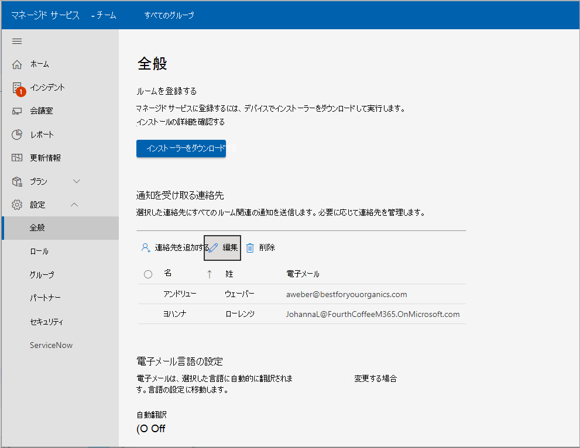

# デバイスをマネージド サービスに登録する

デプロイには、Microsoft Teams Rooms の管理対象サービスへの Microsoft Teams デバイスのオンボードが必要です。 監視サービス エージェントは、認定された MICROSOFT TEAMS Room (ISO) システムおよび周辺機器で使用します。

## 前提条件

登録プロセスを試みる前に、次の手順に従ってハードウェアを設定します。

### プロキシ設定の追加 (省略可能)

1. 「操作の実行」に従って管理者として [ログインします。この操作は、このデバイスの管理者ユーザーとして行います](#performing-operations-as-the-admin-user-of-the-mtr-device)。
1. [Windows ***Search** _ フィールド (画面の左下のセクション) に「_ *cmd**」と入力します (画面を長押しするか右選択し、[管理者として実行] **_を_** 選択します)。  
1. 次のコマンドを実行します (コマンドの最後の二重引用符が重要です)。
   - 単一の ***プロキシ サーバーを*** 使用している場合: bitsadmin /Util /SetIEProxy LOCALSYSTEM <proxyserver>MANUAL_PROXY :<port> ""

      *例:* bitsadmin /Util /SetIEProxy LOCALSYSTEM MANUAL_PROXY contosoproxy.corp.net:8080 ""
      

   - pac ファイルを ***使用している*** 場合: bitsadmin /Util /SetIEProxy LOCALSYSTEM AUTOSCRIPT <pac file url>

      
      *例:* bitsadmin /Util /SetIEProxy LOCALSYSTEM AUTOSCRIPT `http://contosoproxy.corp.net/proxy.pac`
      

### TPM 設定の有効化

> [!NOTE]
> 管理対象サービスに登録するには、TPM を有効にする必要があります。

Intel NUC デバイスの TPM が無効になっている場合は、次のようにこれらのデバイスで TPM を有効にします。  

1. NUC デバイスにキーボードを接続します。  
1. デバイスを再起動します。  
1. BIOS 画面を表示するには、F2 キーを速 **く押します**。  
1. [詳細設定] **を選択します**。  
1. [セキュリティ] **を選択します**。  
1. 右側の [セキュリティ機能] の下で、 **Intel Platform Trust Technology を有効にしてください**。  
1. 設定を保存するには、 **F10 キーを押します**。  
1. 確認ボックスで、[はい] を **選択します**。 
## 操作を、デバイスの管理者ユーザーとして実行する

一部の構成/インストール手順では、管理者としてデバイスにログインする必要があります。

管理者 (ローカル管理者) としてデバイスにログインするには:

1. 進行中の通話を必ず停止し、ホーム画面に戻ります。
1. Microsoft Teams Room のユーザー インターフェイスで、[詳細] を選択し、[**設定**] を選択します。ここで、デバイスのローカル管理者パスワード (既定のパスワードは **_sfb_**) を求められます。
1. [**設定**] を選択し、[**Windows 設定] を** 選択してWindows管理者としてアクセスします。  

1. [ログイン] 画面に表示されるユーザー Windows、[管理者 **] (または** デバイスのそれぞれのローカル管理者) を選択します。

> [!NOTE]
> コンピューターがドメインに *参加* している場合は、[その他のユーザー] を選択し、.**\admin**、またはデバイスで構成されているローカル管理者のユーザー名をユーザー名として使用します。  

必要な管理タスクをMicrosoft Teamsして、Microsoft Teams Room アプリに戻る場合:

1. [Windows ***スタート メニュー*** から、管理者アカウントからサインアウトします。
1. 画面のMicrosoft Teamsの左側にあるユーザー アカウント アイコンを選択し、[ユーザー アカウント] アイコンを選択して [Skype] **に戻ります**。

> [!NOTE]
> ユーザーがSkype場合は、[その他のユーザー] を選択し、ユーザー名として ***「.\skype***」と入力してサインインします。

 

## 通信に必要な URL

 > [!NOTE]
 > ポート 443 を使用して、すべてのネットワーク トラフィックMicrosoft Teams MTR デバイス エージェントと MICROSOFT TEAMS Rooms – Managed Services サービス ポータルの間の SSL です *。*  「[Office 365 URL と IP アドレス範囲 - Microsoft 365 Enterprise |Microsoft Docs](/microsoft-365/enterprise/urls-and-ip-address-ranges?view=o365-worldwide&preserve-view=true)。

エンタープライズ環境内でトラフィック許可リストが有効になっている場合は、 **次のホスト** を許可する必要があります。

agent.rooms.microsoft.com 
global.azure-devices-provisioning.net 
gj3ftstorage.blob.core.windows.net 
mmrstgnoamiot.azure-devices.net 
mmrstgnoamstor.blob.core.windows.net 
mmrprodapaciot.azure-devices.net 
mmrprodapacstor.blob.core.windows.net 
mmrprodemeaiot.azure-devices.net 
mmrprodemeastor.blob.core.windows.net 
mmrprodnoamiot.azure-devices.net 
mmrprodnoamstor.blob.core.windows.net

## 登録プロセス

登録プロセスには、次の手順が含まれます。  

1. [会議室 - Managed Services [http://portal.rooms.microsoft.com](https://portal.rooms.microsoft.com/)] ポータルのMicrosoft Teamsのナビゲーション バーで **、[設定]** を展開し、[全般] を **選択します**。  
1. [ *ルームの登録] で*、[ **インストーラーのダウンロード] を**  選択して監視エージェント ソフトウェアをダウンロードします。
1. **省略可能:** エージェントのプロキシ設定を設定します。「 [プロキシ設定の追加 (省略可能)」を参照してください](#adding-proxy-settings-optional)。
1. (手順 2 でダウンロードした) エージェント インストーラーを、MSI をローカルの MSI デバイスで実行するか、環境内のデバイス (グループ ポリシーなど) に MSI アプリケーションを発行する通常の手段を使用して、(手順 2 でダウンロードした) インストールします。  
1. 5 ~ 10 分以内にポータルにルームが表示されます。 サポートされていない場合は、お問い合 managedroomsupport@microsoft.com。  

   
 
> [!NOTE]
> TEAMS にログインできる TEAMS App をインストールせずにエージェントをインストールする必要がある場合は、オプションのプロセスとして登録キーを使用できます。 '?' に移動する (ヘルプ) ポータルの右上隅にある [Download key (省略可能)] を選択します。 エージェントをインストールするときに、デバイスの **C:\Rigeldirectory** に "自己登録キー" (以前にポータルからダウンロード) を配置します。

## インストール

(ポータルから、または上記の AKA.ms URL を使用して) Microsoft からインストーラーをダウンロードした後、その内容を解凍して ファイル にアクセス **ManagedRoomsInstaller.msi**。

インストールには 2 つのモードがあります。1) 個々のローカル マシンのインストールと 2) 一括デプロイ モード (通常は同様の方法のグループ ポリシーを使用)。 ドメインに参加しないマシン、または MSI インストーラーをリモートで実行する方法がないマシンには、個別インストールすることをお勧めします。  

お客様が MSI アプリケーションを一括デプロイ モードで実行できるさまざまな方法のため、このドキュメントでは、個々のモードでのインストールのみを説明します。  
## 個々の DeviceDomain&mdash; 参加チュートリアル

1. デバイスに管理者としてログインします。 デバイスの *管理者ユーザーとしての操作の実行手順に* 従ってください。

1. ファイルをコピー **ManagedRoomsInstaller.msi** MTR デバイスにコピーします。

   ライセンス ***を実行ManagedRoomsInstaller.msi*** ライセンス契約画面が表示されます。

1.  契約を読んだ後、[***使用許諾契約** 書の条項に同意します] をオンにし、_*Install** を押します。  

    これにより、Microsoft Teams Rooms – Managed Services 監視ソフトウェアのインストールが開始されます。 昇格のプロンプト (管理者として実行) が表示されます。

 1. [ **はい] を選択します**。

    インストールは続行されます。 インストール手順の間に、コンソール ウィンドウが開き、Microsoft Teams Rooms – Managed Services 監視ソフトウェアのインストールの最終段階が開始されます。  

    > [!NOTE]
    > ウィンドウを閉じない。 インストールが完了すると、ウィザードに [完了] ボタンが表示されます。

## 登録の完了

インストールが完了したら、5 ~ 10 分待ってポータルを更新すると、デバイスが一覧表示され、オンボード状態 *として報告* されます。

オンボード *状態では* 、ルームの状態が表示および更新されますが、アラートが発生したり、調査チケットを作成したりはされません。

ルームを選択し、[ **登録] を**  選択してインシデント アラートの取得、調査チケットの取得、またはインシデントの報告を開始します。

質問や問題については、ポータルで顧客から報告されたインシデントを開くか、お問い合 managedroomsupport@microsoft.com。

### 監視ソフトウェアの登録解除とアンインストール

デバイスの登録を解除するには、次のように、監視エージェントを次のように、監視エージェントを ()

1. 監視対象のデバイスで、デバイスに管理者としてログインします。 デバイスの管理者ユーザーとして操作 *を実行する方法に関するページの手順に従ってください*。
1. aka.ms/MTRPDeviceOffBoarding からリセット [スクリプトをダウンロードします](https://aka.ms/MTRPDeviceOffBoarding)。
1. デバイス上のどこかにスクリプトを抽出し、パスをコピーします。
1. 管理者として PowerShell を開く: Windows ***Search** _ フィールド (画面の左下のセクション) で、「Powershell」と入力し、_*_Windows PowerShell** を右_ クリックします。
1. [管理者 *として実行] を選択し、* UAC プロンプトに同意します。
1. *「Set-ExecutionPolicy –ExecutionPolicy RemoteSigned*」と入力し、次のプロンプトで **Y** キーを押します。  
1. PowerShell ウィンドウに、未接続のオフボード スクリプトへの完全パスを貼り付けるか入力し、Enter キーを押 **します**。

   例: 

   *C:\Users\admin\Downloads\MTRPDeviceOffboarding\_\_\MTRPDevice\_Offboarding.ps1\_*  

   これにより、デバイスがユーザー標準のTRM 更新プログラムにリセットされ、監視エージェントとファイルが削除されます。

1. [会議室 - Managed Services] ポータルのMicrosoft Teamsメニューで、[会議室] を選択 **します**。  
1. 指定されたルームの一覧で、登録を解除するルームを選択し、[登録解除] を選択してインシデント アラートや調査チケットの取得を停止するか、ルームのインシデントを報告します。

## テーブルのトラブルシューティング

> [!NOTE]
> すべての Microsoft Teams - Managed Services の監視エラーは、Microsoft Managed Rooms という名前の特定のイベント ログ **ファイルに記録されます**。 

### ***アプリケーション ランタイム ログ ファイルの場所*** =  

C:\Windows\ServiceProfiles\LocalService\AppData\Local\ServicePortalAgent\ app-x.x.x\ServicePortalAgent\ServicePortalVerboseLogFile.log\_\_。**x.x.x** はアプリのバージョン番号です。

|**現象**  |**推奨される手順**  |
| :- | :- |
|
というエラー メッセージが表示されます。   

***エラー: このアプリケーションを_ で実行** してください 

_ *_elevated privileges_**  
|昇格された特権でアプリケーションを実行し、もう一度やり直す  |
|  |  |
|
というエラー メッセージが表示されます。   

***TPM データが見つからない***  
|デバイスの BIOS で TPM (トラステッド プラットフォーム モジュール) が有効になっていることを確認します。 これは通常、デバイスの BIOS のセキュリティ設定で確認できます。  |
|  |  |
|
エラー メッセージが表示される  

` `***エラー: "Admin" または 'Skype' という名前のローカル ユーザー アカウントが見つかりません***  
|認証済みの Room システム デバイスにユーザー アカウントMicrosoft Teams確認します。  |
|  |  |
|上記で説明していないエラー状態メッセージが表示される  |インストール ログのコピーをシステム サポート エージェントMicrosoft Teamsしてください。 |
