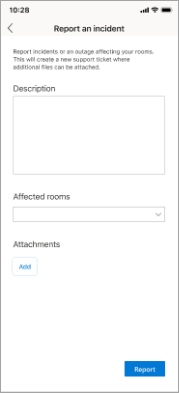
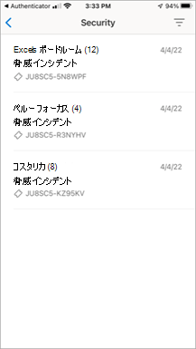
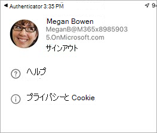

# モバイル クライアント アプリケーションの機能をTeams Roomsする

モバイル デバイスからマネージド サービス (MTMS) Teams Rooms管理する必要がある場合があります。 モバイル アプリには、モバイルまたはタブレット デバイスから管理できるさまざまな機能があります。
## はじめに

Teams Roomsモバイル アプリを使用するには、Microsoft 365 組織の管理者である必要があります。
Apple App Storeまたは [Google Play ストア](https://play.google.com/store/search?q=Microsoft%20Teams%20Rooms&c=apps)から[Teams Rooms](https://apps.apple.com/app/apple-store/id761397963?pt=80423&ct=docsaboutadminapp&mt=8)モバイル アプリをダウンロードします。

モバイル クライアントは、チケットの作成と組織内でのインシデント機能の管理の両方を提供します。

## 次の手順

**MTMS モバイル アプリを取得するには**

1. デバイスのアプリ ストアでマネージド サービスTeams Rooms検索し、インストールします。
2. グローバル管理者のメール アドレスでサインインし、ダッシュボードを表示してサービスの正常性を確認し、ユーザー ライセンスを監視し、メッセージとサービス要求を表示します。

**Teams Rooms モバイル アプリを使用するには**

1. [Apple App Store]()または [Google Play ストア]()からアプリをダウンロードします。
1. 有効な Microsoft 365 サブスクリプションがあることを確認します。
1. Teams Rooms デスクトップ アプリへのアクセスに使用する作業資格情報を使用します。

## インシデントの管理

インシデントを管理するためにモバイル アプリで使用できる機能の一部を次に示します。

- 新しいインシデントのプッシュ通知を受け取ります。
- 通知をタップして、インシデントの詳細をすぐに開いて表示します。
- メッセージの読み取り状態と未読状態を含むすべてのアクティブなインシデントと解決済みインシデントを一覧表示します。
- メッセージを含むチケット情報を使用して、基本的なインシデントの詳細を表示します。
- チケットの添付ファイルとファイルを表示します。
- ユーザー パネルからサインアウトします (サインアウトした場合、通知/メッセージは無効になります)。

[インシデント] ページには、開いているインシデントの種類が表示されます。

### インシデントを報告する

### カテゴリ別にインシデントを表示する

![MTMS モバイル アプリケーションの [Rooms の問題] 画面を示すスクリーンショット。](../media/mtms-extended-app-001.png)

### チケットの管理
モバイル アプリでチケットを管理するための機能の一部を次に示します。

- インシデントの確認 (読み取りとしてマーク)。
- チケットのメッセージの読み取り、投稿、返信を行います。
- ダーク モードに切り替えます。
- 添付ファイルを追加する (写真を撮ってアップロードする)。
- インシデントを報告するチケットを作成します。
- Microsoft Defender を使用してセキュリティと専門家とのコミュニケーションを管理する

アプリでは、チケットの詳細、メッセージ、ファイルが個別のタブに表示されます。

<!--

### Sign out

-->

## トラブルシューティング

一般的なモバイル アプリのトラブルシューティング手順をいくつか試すことができます。
- アプリを閉じてから再度開きます。
- アプリをアンインストールして再インストールします。 アプリの最新バージョンであることを確認します。
- デバイスに Microsoft Authenticator またはポータル サイト アプリがインストールされている場合は、再インストールするか、最新バージョンに更新してみてください。 それでも問題が解決しない場合は、feedback365@microsoft.com にお知らせください。
