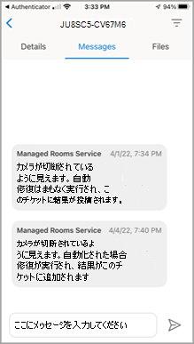

# モバイル クライアント アプリケーションの機能をTeams Roomsする

モバイル デバイスからマネージド サービス (MTMS) Teams Rooms管理する必要がある場合があります。 モバイル アプリには、モバイルまたはTablet PC デバイスから管理できるさまざまな機能があります。
## はじめに

Teams Rooms モバイル アプリを使用するには、Microsoft 365組織内の管理者である必要があります。
Apple App StoreまたはGoogle Play ストアから[Teams Rooms](https://apps.apple.com/app/apple-store/id761397963?pt=80423&ct=docsaboutadminapp&mt=8)モバイル アプリをダウンロード[します](https://play.google.com/store/search?q=Microsoft%20Teams%20Rooms&c=apps)。

**MTMS モバイル アプリを取得するには**

1. デバイスのアプリ ストアでマネージド サービスTeams Rooms検索し、インストールします。
2. グローバル管理者のメール アドレスでサインインし、ダッシュボードを表示してサービスの正常性を確認し、ユーザー ライセンスを監視し、メッセージとサービス要求を表示します。
## インシデントの管理

インシデントを管理するためにモバイル アプリで使用できる機能の一部を次に示します。

- 新しいインシデントのプッシュ通知を受け取ります。
- 通知をタップして、インシデントの詳細をすぐに開いて表示します。
- メッセージの読み取り状態と未読状態を含むすべてのアクティブなインシデントと解決済みインシデントを一覧表示します。
- メッセージを含むチケット情報を使用して、基本的なインシデントの詳細を表示します。
- チケットの添付ファイルとファイルを表示します。
- ユーザー パネルからサインアウトします (サインアウトした場合、通知/メッセージは無効になります)。

### [インシデント] ページ

[インシデント] ページには、開いているインシデントの種類が表示されます。

<!--作成者ごとの Microsoft 承認済み画像.>

## チケットの管理
モバイル アプリでチケットを管理するための機能の一部を次に示します。

- インシデントの確認 (読み取りとしてマーク)。
- チケットのメッセージの読み取り、投稿、返信を行います。
- ダーク モードに切り替えます。
- 添付ファイルを追加する (写真を撮ってアップロードする)。
- インシデントを報告する (チケットを作成する)。

### チケット メッセージ

### チケットの詳細

### インシデントを報告する

### カテゴリ別にインシデントを表示する

<!--作成者ごとの Microsoft 承認済み画像.>
### Microsoft Defender を使用したマネージド セキュリティ

### 専門家とのコミュニケーション

### サインアウトする

<!--作成者ごとの Microsoft 承認済み画像.>
## よく寄せられる質問

よく寄せられる質問に対する回答を次に示します。

**アプリを使用できるようにするには、どうすればよいですか?**

アプリを使用するには、管理者のアクセス許可と有効なMicrosoft 365サブスクリプションが必要です。

**アプリでサポートされている言語は何ですか?**

**インシデントとメッセージを組織の残りの部分と共有するにはどうすればよいですか?**

**このアプリを複数のアカウントまたはテナントで使用できますか?**

**ログインできないか、アプリが面白い動作をしています。問題のトラブルシューティングや修正を行うにはどうすればよいですか?**

一般的なモバイル アプリのトラブルシューティング手順をいくつか試すことができます。
- アプリを閉じてから再度開きます。
- アプリをアンインストールして再インストールします。アプリの最新バージョンであることを確認します。
- デバイスにMicrosoft Authenticatorまたはポータル サイト アプリがインストールされている場合は、再インストールするか、最新バージョンに更新してみてください。 それでも問題が解決しない場合は、feedback365@microsoft.com にお知らせください。

**質問に回答がない場合はどうすればよいですか?**

## 次の手順

モバイル クライアントは、チケットの作成と組織内でのインシデント機能の管理の両方を提供します。

**Teams Rooms モバイル アプリを使用するには**

1. [Apple App Store]()または[Google Play ストア]()のいずれかにアプリをダウンロードする
1. 有効なMicrosoft 365 サブスクリプションがあることを確認します。
1. Teams Rooms デスクトップ アプリへのアクセスに使用する作業資格情報を使用します。
