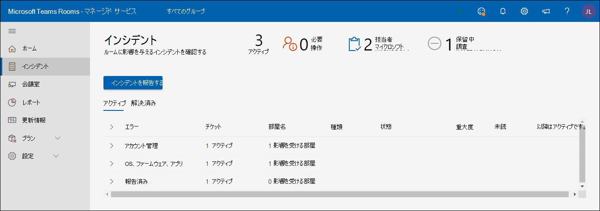

# Microsoft マネージド ミーティング ルーム ポータル

## 概要

管理された会議室ポータル ("Rooms Portal") では、会議室の正常性を確認できます。 このポータルの顧客ビューは、可視性とフィードバックを提供し、既存の監視ツール/プラクティスを容易にするためです。

監視の範囲は次の値です。

- インシデントのビュー
  - ルームに影響を与える主要な問題
  - ルームを正常な状態に復元するために必要なアクション
  - Microsoft によって調査中の問題
- Microsoft Teams Room デバイスの表示
  - Microsoft Teams Rooms (MRT) デバイス レベルでの状態のスナップショット
  - すべてのデバイスの基本的な履歴と詳細

**Microsoft Teams Room デバイスの表示**

- Microsoft Teams Rooms (MRT) デバイス レベルでの状態のスナップショット
- すべてのデバイスの基本的な履歴と詳細

> [!Important]
> [**マネージド サービス管理者ロールにユーザーを割り当てる**](enrolling-mtrp-managed-service.md#assign-users-to-the-managed-service-administrator-role)を確認し、ビジネス ニーズに基づいてポータルへのアクセスが制限されていることを確認します。

## 用語

ポータルでよく使用される用語を次に示します。

|用語 |意味 |
| :- | :- |
|**ソフトウェアの監視** |Microsoft Teams Room の各デバイスに展開されている監視エージェント。 |
|**アプリ** |Microsoft Teams Room システム アプリ (コラボレーション サービスとしてSkype for Businessまたは Microsoft Teams を使用するかどうかに関係なく。 |
|**Room/Device** |認定された Microsoft Teams Room システム デバイス。 |
|**監視されていない** | マネージド サービスの一部として展開された Microsoft 監視ソフトウェアは、クラウド サービスに接続できません。 デバイスに関するテレメトリを受け取りません。 |
|
**正常/** 

**不健康** 
|デバイス/周辺機器の異常。 |
|**抑制** |デバイスがメンテナンス中であることがわかっており、そのアラートを無視する必要がある場合は、デバイスを意図的に抑制できます。 |
|**オンボーディング** |セットアップの追加中のルーム デバイスの状態ですが、定期的にサポートされているルームとして準備ができていません。 |
|**事件** |アクションが必要なエンド ユーザーの会議エクスペリエンスに影響する問題。 |
|**誤り** |検出された構成が正しくない/一般的に使用されている。 |
|**サポート チケット** |インシデントに関するすべての通信/アクションを追跡する内部 Microsoft 追跡識別子。 |

## インシデント ビュー

このビューは、マネージド ルーム ポータルの [インシデント] タブの概要です。 このページは、ポータルの既定のホーム ページです。

### 最上位レベルの概要 
最上位の概要は、会議室に影響を与える問題、必要な操作、Microsoft が行っていることを一目で示しています。

|# |説明 |
| :- | :- |
|1 |ルームに影響を与えるインシデントの種類 |
|2 |**NEED ACTION**: 解決するために介入が必要な項目。 |
|3 |**MICROSOFT に割り当てられている**: Microsoft の担当者によって現在調査されている項目。 |
|4 |**保留中の調査**: Microsoft 担当者が調査するキュー内のアイテム。 |

インシデントは、次の 3 つの状態のいずれかに含まれると予想されます。

- **アクションが必要: アクション** のために割り当てられている
- **Microsoft に割り当てられる**: 次のアクションのために Microsoft に割り当てられます
- **保留中の調査**: 次の手順の調査中

### インシデントの確認

次の図は、会議室で現在アクティブになっているすべてのインシデントの一覧です。 自分に割り当てられているものが *一番上* にあります。これらは、次の手順で確認する必要があるものです。 さらに、Microsoft に割り当てられたもの、または保留中の調査には、介入に使用できる詳細があります。

状態が "**必要なアクション**" の項目をクリックすると、インシデントに関するその他の詳細が表示されます。

## インシデントの種類

インシデントは、次の 2 つの重大度の種類に分類されます。

- **重要**: 会議で問題が発生している可能性が高いインシデントに優先順位を付ける必要があります。
- **警告** – メンテナンス アクションを計画するための通知であるインシデント。 これらの処理が行われなければ、時間の経過と共に部屋に問題が発生する可能性が高くなります。 警告は、サポートの計画と調整に時間を与えることを目的としています。

しばらく出席していない場合、警告は "**重要**" に移行する可能性があります。

## デバイスとインシデントの正常性状態

重大度で **"重要"** として分類されるインシデントは、デバイスの正常性状態に影響します。 デバイスに関連付けられている **重大度 = "重要"** のインシデントが少なくとも 1 つある場合、デバイスは **_異常_** なデバイスとして分類されます。

**"警告"** 重大度として分類されたインシデントは、デバイスで報告された正常性状態には影響しません。 ただし、デバイスに警告レベルのインシデントが関連付けられている場合は、デバイスの正常性状態が次のように表示されます。

表示される可能性のあるインシデントの種類と、各種類の説明を次に示します。 種類ごとに、インシデントに関連付けられているアクションは、問題に応じてより具体的になります。

**表 1: "重要" 重大度のインシデント**

|種類 |説明 |
| :- | :- |
|**ディスプレイ** |デバイスに接続されたディスプレイが正常に表示されていないように見えます。|
|**会議のマイク、会議の講演者** |オーディオ デバイス (マイク/スピーカー) が正しく構成されていないようです。 |
|**カメラ** |デバイスに接続されているカメラは正常に見えません。 |
|**HDMI 取り込み** |HDMI Ingest は正常ではありません。 |
|**サインイン** (Exchange) |Microsoft Teams Room アプリは Exchange から予定表情報にアクセスし、サインインの成功に関する問題はサインイン インシデントで報告されます。 |
|**サインイン** (Teams) |Microsoft Teams Room アプリがデバイスにサインインし、サインインに失敗した場合は、このインシデントで報告されます (顧客が Teams を使用している場合)。 |
|**サインイン** (Skype for Business) |Microsoft Teams Room アプリがデバイスにサインインすると、このインシデントでサインインできなかったと報告されます (お客様がSkype for Businessを使用している場合) |
|**近接センサー** |Microsoft Teams Room アプリは、出席者が近くにいれば会議に参加するように招待します。 この機能のエラーは、このインシデントの下で報告されます。 |

**表 2: "警告" 重大度のインシデント**

|種類 |説明 |
| :- | :- |
|**アプリのバージョン** |デバイスで実行されている Microsoft Teams Room App のバージョンが最新ではありません。 古いバージョンは、ユーザーが経験した問題の原因として知られています。 |
|**OS バージョン** |会議室で実行されている Windows オペレーティング システムのバージョンは推奨されなくなりました。 |
|**ネットワーク** |これは、評価後に必要な追加作業のため、近い期間に警告の一種として削除されます。 |

## インシデントへの対応

インシデントは、アクションの必要、保留中の調査、または Microsoft への割り当ての 3 つのカテゴリに分類されます。

### "ニーズ アクション" インシデント

状態が **"必要なアクション"** に設定されているインシデントは、修正アクションを実行するために割り当てられます。

このような各インシデントには、次のように Microsoft から推奨されるアクションを含むアクション フィールドがあります。

- アクションを実行した場合は、[応答] ボックスにメモを含めてインシデントに対応し、投稿する前に [Microsoft に割り当てる] を選択します。
- また、レビューに基づいて通知が正しくない可能性もあります。 その場合は、そのフィードバックを提供し、Microsoft に割り当て直してください。
- 最後に、自分のチームまたは Microsoft チームに追加のコンテキストを提供するコメントを追加する場合は、[Microsoft に割り当てる] をオンにせずにメッセージを投稿します。

>[!NOTE]
>修正アクションによって問題が解決される可能性があり、マネージド ルームの監視によって、そのインシデントがリストからクリアされます。 上記の状況では、問題を解決して Microsoft に割り当てる機会がない場合があります。 この問題は、今後のリリースで対処される予定です。

### "保留中の調査" インシデント

調査中のインシデントの場合、説明フィールドには、特定の問題を解決するのに役立つ可能性があるインシデント、一般的な原因、および解決策に関する情報が保持され、遅延なく対処できます。

### "Microsoft に割り当てられた" インシデント

Microsoft に割り当てられたインシデントの場合、[アクション] フィールドには、計画済みまたは進行中の修正手順に関する簡単な詳細が含まれます。 これらの手順では、チームとのコラボレーションが必要な場合があり、必要に応じて電子メール/通話を通じて拡張コラボレーションが行われます。 これらの問題が解決されると、ポータルから消え、今後、このようなインシデントとその解決を追跡するための履歴が表示されます。

## ルーム ビュー

各デバイスは、部屋とその接続された周辺機器のプロキシです。 正常なデバイスは正常な部屋を表し、異常なデバイスは会議中に問題を引き起こす可能性のある部屋を表します。 Managed Rooms Portal では、インシデント ビューに加えて、会議室の正常性の概要も提供され、デバイスの詳細のトラブルシューティングを行い、インシデント履歴で繰り返されるエラーを理解するのに役立ちます。

**正常、異常、切断** [ルーム] ビューの上部パネルには、状態が良好なデバイスの数 ("正常")、問題の影響を受けるデバイスの数 ("異常")、テレメトリを提供していないデバイスの数 ("切断済み")、(オーバーライドとして) アラートが抑制されているデバイスの数の簡単なスナップショットが表示されます。 ルームは、進化する基準とヒューリスティックを使用して正常性を監視します。 目標は、ルーム内のユーザー エクスペリエンスの現実を可能な限り正確に反映し、実用的なものにすることです。

**正常/異常な部屋**:

重大度 "重要" のインシデントがないデバイス/周辺機器は、現在の正常性の基準を満たしており、正常としてマークされます。 ただし、ポータル内のすべての異常なデバイスに対して部屋の停止があることを意味するわけではありません。 インシデントの説明とアクション部分には、問題に関するより具体的な詳細と、ユーザー エクスペリエンスへの潜在的な影響が含まれています。

**切断されたデバイス:**

Managed Rooms パイロットの一部として展開された Microsoft 監視エージェントは、マネージド ルーム クラウド サービスから切断されます。 ルームに関するテレメトリを受け取っていないため、最新の正常性状態はありません。 これは、ネットワークの問題、ファイアウォール ポリシーの変更、またはデバイス イメージに加えられた変更が原因で発生する可能性があります。

## ルームの詳細: 状態と変更

**ルームの詳細: 状態** [デバイス *の状態]* タブには、デバイスの状態、デバイスに対してアクティブなすべての問題、それらを解決するために必要なアクション、または進行中のアクションの統合ビューが表示されます。 [状態] タブには、[ *インシデント] タブ* のデバイスのさまざまな正常性コンポーネントの内訳も表示されます。デバイスが切断されている場合、状態の詳細は使用できません。

**すべてのシグナルを表示します。** シグナル カテゴリに含まれるすべてのシグナルを表示するには、[すべてのシグナルを表示] トグル ボタンを有効にします。 展開矢印は、アコーディオン ビューを展開するためにクリックできるカテゴリ見出しの横に表示されます。

**チケットを抑制/抑制解除する** 会議室が登録されると、会議室テレメトリの変更に関する通知を受け取る必要があることを示します。 特定のデバイスまたは周辺機器が既知の状態にあり、チケットや通知を生成したくない場合があります。 チケットの抑制機能を使用すると、その特定のシグナルに関するすべての通知が消音されます。 サービスがそのシグナルを監視して通知する準備ができたら、個々の信号を抑制解除するだけです。

**アクティブ チケット カテゴリの展開** 各チケット カテゴリの下に、アクティブまたは最新の解決済みチケットが重大度とチケットが最後に更新されたときと共に表示されます。 展開矢印をクリックすると、すべてのチケットにチケット情報へのアクティブなリンクが表示されます。

アクティブ チケット カテゴリの展開: 各チケット カテゴリの下に、アクティブまたは最新の解決済みチケットが重大度とチケットが最後に更新された日時と共に表示されます。 展開矢印をクリックすると、すべてのチケットにチケット情報へのアクティブなリンクが表示されます。

## アクティブ チケット: 概要

作成される各インシデントは、検出された問題と、部屋を正常な状態に復元するために実行する必要がある修正アクションを識別します。 生成されたチケットには、マネージド サービス AI によって生成されたすべてのメッセージと、問題を調査している Microsoft サービス エンジニアリング チームが含まれるインシデントの概要が伝えられます。 インシデントのトラブルシューティングのために収集されたすべての添付ファイルが一覧表示されます。 [履歴] タブには、問題が特定された日付が表示されます。

アクティブ チケット: メッセージメッセージ UI は、特定された問題の修復に取り組む Microsoft サービス エンジニアと対話するための主要な通信ツールです。 Microsoft からの通信を確認して、可能な限り最高のサービスを提供していることを確認することが重要です。 推奨されるアクションを実行した場合は、[応答] ボックスにメモを含めてこのインシデントに対応し、投稿する前に [Microsoft に割り当てる] をクリックして Microsoft に割り当てます。
また、レビューに基づいて通知が正しくない可能性もあります。 その場合は、そのフィードバックを提供し、Microsoft に割り当て直してください。
最後に、自分のチームまたは Microsoft チームに追加のコンテキストを提供するコメントを追加する場合は、[Microsoft に割り当てる] をオンにせずにメッセージを投稿するだけです。

アクティブ チケット: 添付ファイル:Microsoft サービス エンジニアが問題の調査を強化するために追加情報を必要とする場合があります。 [添付ファイル] タブには、要求された画像、ビデオ、またはログをアップロードする機能が用意されています。

アクティブチケット: 履歴 各ルームシグナルには、目的に応じて割り当てられているチケット番号が 1 つだけ含まれています。 ルーム デバイスまたは周辺機器は部屋に保持され、時間の経過と共に問題が発生する可能性があります。 この情報を特定の一意のチケット ID で管理することで、すべての履歴情報が保持され、動作パターンを分析できます。 履歴 UI には、このシグナル用に作成および解決されたすべてのチケット アクションが表示されます。

FAQ 動的チケットは、自分と部屋の操作にどのような影響を与えるのですか?  
お客様には、バイナリシグナル チケットだけでなく、よりスマートなチケットと修復の作成が表示されます。 たとえば、会議室には 3 つのディスプレイを表示できます (ディスプレイ 1、ディスプレイ 2 &、MRT タッチ パネルディスプレイ)。 ただし、正常または異常の表示信号は 1 つだけです。 新しい動的チケットを使用して、各表示信号に固有のチケットを生成できるようになりました。
